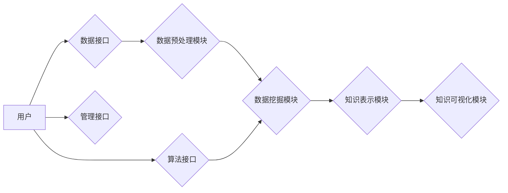

                 

## 知识发现引擎的API设计与开发

> 关键词：知识发现引擎, API设计, 数据挖掘, 机器学习, 自然语言处理, 知识图谱, 应用场景, 未来趋势

## 1. 背景介绍

在海量数据时代，知识发现引擎 (Knowledge Discovery Engine, KDE) 作为一种能够从海量数据中自动提取有价值知识的系统，显得尤为重要。KDE 能够帮助我们洞察数据背后的隐藏模式、趋势和关系，从而为决策提供数据支持，推动业务创新。

传统的KDE系统通常是封闭的，缺乏与外部应用程序的交互接口。为了更好地将KDE技术应用于实际场景，需要设计和开发一个开放、灵活、易于使用的API接口。

## 2. 核心概念与联系

### 2.1 知识发现引擎 (KDE)

知识发现引擎 (KDE) 是指能够从数据中自动发现、提取和表示有价值知识的系统。KDE 通常包含以下几个核心模块：

* **数据预处理模块:** 对原始数据进行清洗、转换、整合等操作，使其能够被后续模块进行分析。
* **数据挖掘模块:** 使用各种数据挖掘算法，从预处理后的数据中发现模式、趋势和关系。
* **知识表示模块:** 将发现的知识以可理解的形式表示出来，例如知识图谱、规则等。
* **知识可视化模块:** 将知识以图形化的形式展示出来，方便用户理解和分析。

### 2.2 API设计

API (Application Programming Interface) 是一种软件组件之间通信的标准接口。API的设计需要考虑以下几个方面：

* **功能性:** API应该提供足够的功能，满足用户需求。
* **易用性:** API应该易于理解和使用，提供清晰的文档和示例。
* **可扩展性:** API应该能够随着业务发展而扩展，支持新的功能和数据类型。
* **安全性:** API应该保证数据安全，防止未授权访问。

### 2.3  KDE API架构

KDE API 的架构通常包括以下几个部分：

* **数据接口:** 用于用户上传数据和获取数据分析结果。
* **算法接口:** 用于用户选择不同的数据挖掘算法进行分析。
* **知识表示接口:** 用于用户获取发现的知识以不同的格式，例如 JSON、XML 等。
* **管理接口:** 用于用户管理用户账户、权限等。



## 3. 核心算法原理 & 具体操作步骤

### 3.1  算法原理概述

KDE API 中常用的数据挖掘算法包括：

* **关联规则挖掘:** 用于发现数据集中频繁出现的项集之间的关联关系。
* **分类算法:** 用于根据已标记的数据，对新的数据进行分类。
* **聚类算法:** 用于将数据集中相似的样本进行分组。
* **异常检测算法:** 用于识别数据集中异常值。

### 3.2  算法步骤详解

以关联规则挖掘为例，其具体操作步骤如下：

1. **构建频繁项集:** 统计数据集中所有项的出现频率，并找出频繁出现的项集。
2. **生成关联规则:** 对于每个频繁项集，计算其支持度和置信度，并生成关联规则。
3. **筛选关联规则:** 根据预设的阈值，筛选出满足条件的关联规则。

### 3.3  算法优缺点

每个算法都有其自身的优缺点，需要根据实际应用场景选择合适的算法。

* **关联规则挖掘:** 优点是能够发现数据之间的隐含关系，缺点是计算复杂度较高，并且容易产生冗余规则。
* **分类算法:** 优点是能够对新的数据进行准确分类，缺点是需要大量的标记数据进行训练。
* **聚类算法:** 优点是能够将数据进行分组，发现数据中的结构，缺点是聚类结果难以解释。
* **异常检测算法:** 优点是能够识别数据中的异常值，缺点是需要根据具体应用场景选择合适的算法。

### 3.4  算法应用领域

KDE API 中的算法可以应用于各个领域，例如：

* **商业领域:** 发现客户行为模式，进行精准营销。
* **医疗领域:** 发现疾病的潜在风险因素，辅助诊断和治疗。
* **金融领域:** 发现欺诈行为，进行风险控制。
* **教育领域:** 发现学生的学习模式，进行个性化教学。

## 4. 数学模型和公式 & 详细讲解 & 举例说明

### 4.1  数学模型构建

关联规则挖掘算法通常使用支持度和置信度来衡量规则的质量。

* **支持度:** 规则在数据集中的出现频率。
* **置信度:** 给定 antecedent (前件) 的情况下， consequent (后件) 出现的概率。

### 4.2  公式推导过程

* **支持度:**

$$
Support(A \rightarrow B) = \frac{Count(A \cup B)}{Count(D)}
$$

其中：

* $A \rightarrow B$ 是一个关联规则。
* $Count(A \cup B)$ 是规则 $A \rightarrow B$ 在数据集 $D$ 中出现的次数。
* $Count(D)$ 是数据集 $D$ 的总记录数。

* **置信度:**

$$
Confidence(A \rightarrow B) = \frac{Count(A \cup B)}{Count(A)}
$$

其中：

* $A \rightarrow B$ 是一个关联规则。
* $Count(A \cup B)$ 是规则 $A \rightarrow B$ 在数据集 $D$ 中出现的次数。
* $Count(A)$ 是 antecedent (前件) $A$ 在数据集 $D$ 中出现的次数。

### 4.3  案例分析与讲解

假设我们有一个数据集，包含以下记录：

* 牛奶、面包
* 牛奶、鸡蛋
* 牛奶、橙汁
* 鸡蛋、橙汁
* 面包、橙汁

我们可以发现，规则 "牛奶 $\rightarrow$ 面包" 的支持度为 2/5，置信度为 2/3。

## 5. 项目实践：代码实例和详细解释说明

### 5.1  开发环境搭建

KDE API 的开发环境可以根据实际需求选择不同的语言和框架。例如，可以使用 Python 和 Flask 框架开发一个 RESTful API。

### 5.2  源代码详细实现

```python
from flask import Flask, request, jsonify

app = Flask(__name__)

# 数据集
data = [
    ["牛奶", "面包"],
    ["牛奶", "鸡蛋"],
    ["牛奶", "橙汁"],
    ["鸡蛋", "橙汁"],
    ["面包", "橙汁"],
]

# 关联规则挖掘算法
def apriori(data):
    # ... 算法实现 ...
    return rules

@app.route('/api/rules', methods=['POST'])
def get_rules():
    # 获取用户上传的数据
    data = request.get_json()

    # 调用关联规则挖掘算法
    rules = apriori(data)

    # 返回结果
    return jsonify(rules)

if __name__ == '__main__':
    app.run(debug=True)
```

### 5.3  代码解读与分析

* **数据预处理:** 代码中没有显式的数据预处理模块，但可以根据实际需求添加数据清洗、转换等操作。
* **关联规则挖掘算法:** 代码中使用了 `apriori` 函数来实现关联规则挖掘算法，具体实现细节需要根据实际需求进行编写。
* **API接口:** 代码中定义了一个 `/api/rules` 接口，用于接收用户上传的数据，并返回挖掘出的关联规则。

### 5.4  运行结果展示

当用户向 API 接口发送 POST 请求，并包含数据信息时，API 将会调用关联规则挖掘算法，并返回挖掘出的关联规则。

## 6. 实际应用场景

KDE API 可以应用于各个领域，例如：

* **电商平台:** 发现用户购买行为模式，进行个性化推荐。
* **社交媒体:** 发现用户兴趣爱好，进行精准广告投放。
* **医疗诊断:** 发现疾病的潜在风险因素，辅助医生进行诊断。

### 6.4  未来应用展望

随着人工智能技术的不断发展，KDE API 将会更加智能化、自动化，能够更好地帮助我们洞察数据背后的价值。

## 7. 工具和资源推荐

### 7.1  学习资源推荐

* **书籍:**
    * "Data Mining: Concepts and Techniques" by Jiawei Han, Micheline Kamber, and Jian Pei
    * "Introduction to Data Mining" by Pang-Ning Tan, Michael Steinbach, and Vipin Kumar
* **在线课程:**
    * Coursera: Data Mining Specialization
    * edX: Data Science Fundamentals

### 7.2  开发工具推荐

* **Python:** 
    * Scikit-learn: 机器学习库
    * Pandas: 数据分析库
    * Flask: Web 框架
* **R:** 
    * Tidyverse: 数据分析和可视化套件
    * caret: 机器学习库

### 7.3  相关论文推荐

* "Apriori: Bringing Down the Cost of Discovering Frequent Itemsets" by Rakesh Agrawal, Tomasz Imielinski, and Arun Swami
* "FP-Growth: A Frequent Pattern Growth Algorithm for Discovery of Association Rules" by Jian Pei, Jiawei Han, and Beichuan Zhang

## 8. 总结：未来发展趋势与挑战

### 8.1  研究成果总结

KDE API 的发展为数据挖掘技术提供了更加灵活、开放的应用平台，推动了数据挖掘技术在各个领域的应用。

### 8.2  未来发展趋势

* **更智能化的算法:** 随着人工智能技术的进步，KDE API 中的算法将会更加智能化，能够自动学习和优化，并提供更精准的知识发现结果。
* **更丰富的知识表示:** KDE API 将会支持多种知识表示形式，例如知识图谱、规则等，能够更好地表达和组织发现的知识。
* **更强大的可视化工具:** KDE API 将会提供更强大的可视化工具，能够帮助用户更好地理解和分析发现的知识。

### 8.3  面临的挑战

* **数据质量问题:** 数据挖掘算法的准确性依赖于数据质量，如何保证数据质量是KDE API发展面临的挑战。
* **算法复杂度问题:** 一些数据挖掘算法的计算复杂度较高，如何提高算法效率是KDE API发展面临的挑战。
* **知识解释问题:** 许多数据挖掘算法生成的知识难以解释，如何提高知识的可解释性是KDE API发展面临的挑战。

### 8.4  研究展望

未来，KDE API 将会朝着更加智能化、自动化、可解释的方向发展，为我们提供更强大的数据分析和知识发现能力。


## 9. 附录：常见问题与解答

* **Q1: KDE API 如何保证数据安全？**

* **A1:** KDE API 可以采用多种安全措施，例如数据加密、身份验证、权限控制等，来保证数据安全。

* **Q2: KDE API 支持哪些数据类型？**

* **A2:** KDE API 可以支持多种数据类型，例如文本、数字、时间等。

* **Q3: KDE API 如何进行知识表示？**

* **A3:** KDE API 可以使用多种知识表示形式，例如知识图谱、规则等。

作者：禅与计算机程序设计艺术 / Zen and the Art of Computer Programming 


<end_of_turn>

