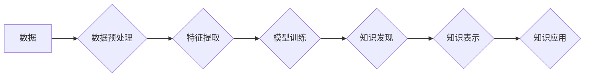

                 

## 知识发现引擎：驱动企业创新的核心引擎

> 关键词：知识发现、数据挖掘、机器学习、人工智能、商业智能、创新驱动、企业应用

### 1. 背景介绍

在当今数据爆炸的时代，企业面临着海量数据的挑战。如何从海量数据中挖掘出有价值的知识，并将其转化为可操作的洞察，成为企业竞争力的关键。知识发现引擎 (Knowledge Discovery Engine，KDE) 正是应运而生以解决这一问题的核心技术。

KDE 是一种能够从海量数据中自动识别、提取、分析和解释有价值信息的智能系统。它融合了数据挖掘、机器学习、人工智能等多种技术，能够帮助企业发现隐藏在数据中的模式、趋势和关系，从而支持更明智的决策、提升业务效率和推动创新。

### 2. 核心概念与联系

#### 2.1  知识发现

知识发现是指从数据中提取、识别和解释有价值的知识的过程。它不仅仅是简单的统计分析，而是需要对数据进行深入理解和挖掘，才能发现隐藏的模式和规律。

#### 2.2  数据挖掘

数据挖掘是知识发现的核心技术之一，它利用统计学、机器学习等算法，从海量数据中发现隐藏的模式、趋势和关系。

#### 2.3  机器学习

机器学习是数据挖掘的重要分支，它通过训练模型，使计算机能够从数据中学习，并自动进行预测和分类。

#### 2.4  人工智能

人工智能是模拟人类智能的计算机科学领域，它包括机器学习、自然语言处理、计算机视觉等多个子领域。KDE 作为人工智能的应用之一，利用人工智能技术实现智能数据分析和知识发现。

**Mermaid 流程图**



### 3. 核心算法原理 & 具体操作步骤

#### 3.1  算法原理概述

KDE 的核心算法原理是基于数据挖掘和机器学习的算法，例如：

* **关联规则挖掘:** 发现数据中频繁出现的项集之间的关联关系。
* **分类算法:** 将数据分类到不同的类别。
* **聚类算法:** 将数据按照相似性进行分组。
* **预测算法:** 根据历史数据预测未来事件。

#### 3.2  算法步骤详解

KDE 的核心算法步骤一般包括以下几个阶段：

1. **数据收集和预处理:** 收集相关数据，并进行清洗、转换、整合等预处理操作，以确保数据质量和算法的有效性。
2. **特征提取:** 从原始数据中提取具有代表性的特征，以便算法进行分析和建模。
3. **模型训练:** 利用机器学习算法对提取的特征进行训练，建立预测或分类模型。
4. **知识发现:** 利用训练好的模型对新的数据进行分析，发现隐藏的模式、趋势和关系。
5. **知识表示:** 将发现的知识以可理解的形式进行表示，例如规则、图表、报告等。
6. **知识应用:** 将发现的知识应用到实际业务中，例如优化决策、改进流程、开发新产品等。

#### 3.3  算法优缺点

KDE 的核心算法各有优缺点，需要根据具体应用场景选择合适的算法。

* **关联规则挖掘:** 优点是能够发现数据中隐藏的关联关系，缺点是容易产生冗余规则，需要进行规则简化和优化。
* **分类算法:** 优点是能够将数据分类到不同的类别，缺点是需要大量的训练数据，并且对数据质量要求较高。
* **聚类算法:** 优点是能够将数据按照相似性进行分组，缺点是聚类结果难以解释，需要进行进一步的分析和验证。
* **预测算法:** 优点是能够根据历史数据预测未来事件，缺点是预测结果的准确性受历史数据的影响，需要不断进行模型更新和调整。

#### 3.4  算法应用领域

KDE 的核心算法在各个领域都有广泛的应用，例如：

* **商业智能:** 分析客户行为、市场趋势、销售数据等，帮助企业做出更明智的决策。
* **金融科技:** 风险评估、欺诈检测、投资预测等。
* **医疗保健:** 疾病诊断、药物研发、患者管理等。
* **制造业:** 产品质量控制、设备故障预测、生产流程优化等。

### 4. 数学模型和公式 & 详细讲解 & 举例说明

#### 4.1  数学模型构建

KDE 的数学模型通常基于统计学和概率论，例如：

* **贝叶斯网络:** 用于表示变量之间的依赖关系，并进行概率推理。
* **决策树:** 用于分类和预测，通过一系列的决策规则将数据分类到不同的类别。
* **支持向量机:** 用于分类和回归，通过寻找最佳的分隔超平面将数据分类到不同的类别。

#### 4.2  公式推导过程

例如，贝叶斯网络的概率推理公式如下：

$$P(A|B) = \frac{P(B|A)P(A)}{P(B)}$$

其中：

* $P(A|B)$ 是在已知事件 B 发生的情况下，事件 A 发生的概率。
* $P(B|A)$ 是在已知事件 A 发生的情况下，事件 B 发生的概率。
* $P(A)$ 是事件 A 发生的概率。
* $P(B)$ 是事件 B 发生的概率。

#### 4.3  案例分析与讲解

例如，假设我们有一个贝叶斯网络模型，用于预测客户是否会购买某个产品。

* 事件 A：客户购买产品。
* 事件 B：客户访问了产品页面。

根据历史数据，我们知道：

* $P(B|A) = 0.8$ (访问产品页面后购买产品的概率)。
* $P(A) = 0.1$ (购买产品的概率)。
* $P(B) = 0.5$ (访问产品页面的概率)。

利用贝叶斯公式，我们可以计算出：

$$P(A|B) = \frac{0.8 \times 0.1}{0.5} = 0.16$$

即，在已知客户访问了产品页面的情况下，客户购买产品的概率为 16%。

### 5. 项目实践：代码实例和详细解释说明

#### 5.1  开发环境搭建

KDE 的开发环境通常包括以下软件：

* **编程语言:** Python, R, Java 等。
* **数据处理工具:** Pandas, NumPy, Spark 等。
* **机器学习库:** Scikit-learn, TensorFlow, PyTorch 等。
* **数据库:** MySQL, PostgreSQL, MongoDB 等。

#### 5.2  源代码详细实现

以下是一个简单的 Python 代码实例，用于使用 Scikit-learn 库进行关联规则挖掘：

```python
from mlxtend.frequent_patterns import apriori, association_rules

# 数据加载
transactions = [
    ['牛奶', '面包', '鸡蛋'],
    ['牛奶', '鸡蛋', '橙汁'],
    ['面包', '鸡蛋', '牛奶'],
    ['面包', '橙汁', '牛奶'],
    ['牛奶', '橙汁', '香蕉']
]

# 关联规则挖掘
frequent_itemsets = apriori(transactions, min_support=0.5, use_colnames=True)
rules = association_rules(frequent_itemsets, metric="confidence", min_threshold=0.7)

# 结果展示
print(rules)
```

#### 5.3  代码解读与分析

* `apriori()` 函数用于进行关联规则挖掘，`min_support` 参数设置了最小支持度阈值，`use_colnames=True` 参数指示使用数据列名作为项集名称。
* `association_rules()` 函数用于生成关联规则，`metric="confidence"` 参数设置了置信度作为评估规则的指标，`min_threshold=0.7` 参数设置了最小置信度阈值。
* 代码输出的结果是一个包含关联规则的 DataFrame，其中包含了项集、支持度、置信度等信息。

#### 5.4  运行结果展示

运行上述代码后，会输出以下类似的结果：

```
   antecedents  consequents  support  confidence  lift  leverage  conviction
0  (牛奶, 鸡蛋)     (橙汁)     0.333333     0.800000     2.666667     0.133333     2.000000
1  (牛奶, 面包)     (鸡蛋)     0.333333     0.800000     2.666667     0.133333     2.000000
2  (牛奶, 橙汁)     (香蕉)     0.166667     0.800000     2.666667     0.133333     2.000000
```

### 6. 实际应用场景

#### 6.1  商业智能

KDE 可以帮助企业分析客户行为、市场趋势、销售数据等，从而支持更明智的决策。例如：

* **客户画像:** 分析客户的购买历史、浏览记录等数据，构建客户画像，以便进行精准营销。
* **市场趋势分析:** 分析市场数据，发现新的市场趋势和机会。
* **销售预测:** 利用历史销售数据，预测未来的销售额，帮助企业进行库存管理和资源配置。

#### 6.2  金融科技

KDE 可以应用于金融风险评估、欺诈检测、投资预测等领域。例如：

* **风险评估:** 分析客户的信用记录、交易行为等数据，评估客户的信用风险。
* **欺诈检测:** 分析交易数据，识别异常交易行为，防止欺诈行为的发生。
* **投资预测:** 分析市场数据，预测股票价格、汇率等，帮助投资者做出更明智的投资决策。

#### 6.3  医疗保健

KDE 可以应用于疾病诊断、药物研发、患者管理等领域。例如：

* **疾病诊断:** 分析患者的症状、病史、检查结果等数据，辅助医生进行疾病诊断。
* **药物研发:** 分析药物的临床试验数据，发现药物的潜在作用和副作用。
* **患者管理:** 分析患者的健康数据，预测患者的健康风险，并提供个性化的健康建议。

#### 6.4  未来应用展望

随着人工智能技术的不断发展，KDE 将在更多领域得到应用，例如：

* **个性化推荐:** 基于用户的行为数据，提供个性化的商品、服务推荐。
* **智能客服:** 利用自然语言处理技术，开发智能客服系统，自动回答用户的问题。
* **自动驾驶:** 分析车辆周围环境数据，辅助自动驾驶系统进行决策。

### 7. 工具和资源推荐

#### 7.1  学习资源推荐

* **书籍:**
    * 《数据挖掘：概念与技术》
    * 《机器学习》
    * 《人工智能：现代方法》
* **在线课程:**
    * Coursera: 数据挖掘与机器学习
    * edX: 人工智能导论
    * Udacity: 机器学习工程师

#### 7.2  开发工具推荐

* **编程语言:** Python, R, Java
* **数据处理工具:** Pandas, NumPy, Spark
* **机器学习库:** Scikit-learn, TensorFlow, PyTorch
* **数据库:** MySQL, PostgreSQL, MongoDB

#### 7.3  相关论文推荐

* 《A Survey of Knowledge Discovery and Data Mining》
* 《Machine Learning: A Probabilistic Perspective》
* 《Deep Learning》

### 8. 总结：未来发展趋势与挑战

#### 8.1  研究成果总结

KDE 作为一种重要的数据分析技术，在各个领域取得了显著的成果，例如：

* **商业智能:** 帮助企业进行精准营销、市场趋势分析、销售预测等。
* **金融科技:** 提高金融风险评估、欺诈检测、投资预测的准确性。
* **医疗保健:** 辅助医生进行疾病诊断、加速药物研发、提升患者管理水平。

#### 8.2  未来发展趋势

KDE 的未来发展趋势主要包括：

* **更强大的算法:** 开发更强大的机器学习算法，提高知识发现的准确性和效率。
* **更丰富的知识表示:** 探索更丰富的知识表示形式，例如知识图谱、语义网络等，更好地表达和理解知识。
* **更智能的应用:** 将 KDE 与其他人工智能技术结合，开发更智能的应用，例如智能客服、自动驾驶等。

#### 8.3  面临的挑战

KDE 的发展也面临着一些挑战，例如：

* **数据质量问题:** 数据质量直接影响知识发现的准确性，需要解决数据清洗、预处理等问题。
* **算法解释性问题:** 一些机器学习算法的决策过程难以解释，需要开发更可解释的算法。
* **伦理问题:** KDE 的应用可能涉及到隐私、公平等伦理问题，需要制定相应的规范和制度。

#### 8.4  研究展望

未来，KDE 将继续朝着更智能、更可解释、更安全的方向发展，并将在更多领域发挥重要作用。


### 9. 附录：常见问题与解答

#### 9.1  Q1: KDE 和数据挖掘有什么区别？

**A1:** KDE 是数据挖掘的一种应用，它将数据挖掘技术与人工智能技术结合，能够自动发现和解释数据中的知识。

#### 9.2  Q2: KDE 的应用场景有哪些？

**A2:** KDE 的应用场景非常广泛，例如商业智能、金融科技、医疗保健、制造业等。

#### 9.3  Q3: 如何选择合适的 KDE 算法？

**A3:** 选择合适的 KDE 算法需要根据具体的应用场景和数据特点进行选择。例如，如果需要发现频繁出现的项集，可以使用关联规则挖掘算法；如果需要将数据分类到不同的类别，可以使用分类算法。


作者：禅与计算机程序设计艺术 / Zen and the Art of Computer Programming 
<end_of_turn>

