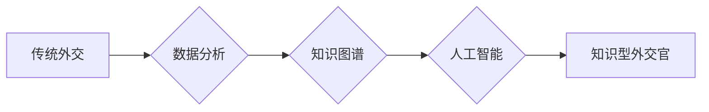

                 

## 知识型外交官的培养与使命

> 关键词：人工智能、外交、知识图谱、自然语言处理、跨文化沟通、机器学习、深度学习、数据分析

### 1. 背景介绍

在当今全球化加速、信息爆炸的时代，外交工作面临着前所未有的挑战和机遇。传统的外交模式逐渐难以适应快速变化的国际环境，对外交官的知识水平、技能要求和思维方式提出了更高的要求。知识型外交官应运而生，他们不仅具备扎实的政治、经济、文化等领域的知识，更重要的是能够运用先进的科技手段，高效地处理复杂的外交事务。

人工智能（AI）技术的快速发展为知识型外交官的培养提供了强大的工具和支撑。AI技术能够帮助外交官进行大数据分析、预测趋势、识别风险、翻译语言、模拟谈判等，从而提高外交工作效率和精准度。

### 2. 核心概念与联系

#### 2.1 知识型外交官

知识型外交官是指在掌握传统外交技能的基础上，具备以下特征：

* **知识深度和广度：** 拥有对国际政治、经济、文化、科技等领域的深入了解，并能够将这些知识应用于外交实践。
* **数据分析能力：** 能够熟练运用数据分析工具和方法，从海量数据中提取有价值的信息，为外交决策提供支持。
* **跨文化沟通能力：** 能够理解和尊重不同文化背景下的价值观和行为模式，并进行有效的跨文化沟通。
* **科技应用能力：** 能够熟练运用人工智能、大数据等先进科技手段，提升外交工作效率和精准度。

#### 2.2  人工智能在外交领域的应用

人工智能技术在外交领域的应用主要集中在以下几个方面：

* **信息收集和分析：** 利用自然语言处理（NLP）技术对海量文本数据进行分析，识别关键信息和趋势，为外交决策提供支持。
* **风险预警和评估：** 利用机器学习（ML）技术分析历史数据和实时信息，预测潜在的风险和危机，帮助外交官及时采取应对措施。
* **谈判和协商：** 利用AI技术模拟谈判场景，帮助外交官制定最佳策略，提高谈判成功率。
* **语言翻译：** 利用机器翻译技术实现实时、准确的语言翻译，打破语言障碍，促进跨文化交流。

#### 2.3  知识图谱

知识图谱是一种数据结构，用于表示和组织知识。它将实体和关系以图的形式表示，能够有效地存储、检索和推理知识。知识图谱在外交领域可以用于：

* **构建外交知识库：** 将外交相关的实体和关系存储在知识图谱中，形成一个完整的外交知识库。
* **支持外交决策：** 利用知识图谱进行知识推理和查询，为外交决策提供支持。
* **促进跨部门协作：** 将不同部门的知识整合到知识图谱中，促进跨部门协作。

**Mermaid 流程图**



### 3. 核心算法原理 & 具体操作步骤

#### 3.1  算法原理概述

知识型外交官的培养需要结合多种算法原理，包括：

* **自然语言处理（NLP）算法：** 用于分析和理解文本数据，提取关键信息和趋势。常见的NLP算法包括词嵌入、文本分类、情感分析等。
* **机器学习（ML）算法：** 用于从数据中学习模式和规律，进行预测和决策。常见的ML算法包括回归、分类、聚类等。
* **深度学习（DL）算法：** 用于处理复杂的数据，例如图像、语音、文本等。常见的DL算法包括卷积神经网络（CNN）、循环神经网络（RNN）、Transformer等。

#### 3.2  算法步骤详解

**以信息收集和分析为例，具体操作步骤如下：**

1. **数据收集：** 从互联网、新闻媒体、社交媒体等渠道收集外交相关的文本数据。
2. **数据预处理：** 对收集到的数据进行清洗、格式化、标注等预处理工作。
3. **特征提取：** 利用NLP算法提取文本数据中的关键信息，例如实体、关系、主题等。
4. **模型训练：** 利用ML算法对特征进行训练，建立预测模型。
5. **模型评估：** 对模型进行评估，验证其准确性和有效性。
6. **结果输出：** 将模型预测结果以可视化图表或报告的形式输出，为外交决策提供支持。

#### 3.3  算法优缺点

**NLP算法：**

* **优点：** 可以理解和分析人类语言，提取文本数据中的关键信息。
* **缺点：** 对数据质量要求高，容易受到语义歧义的影响。

**ML算法：**

* **优点：** 可以从数据中学习模式和规律，进行预测和决策。
* **缺点：** 需要大量的训练数据，对数据特征选择敏感。

**DL算法：**

* **优点：** 可以处理复杂的数据，具有更强的学习能力。
* **缺点：** 需要大量的计算资源，训练时间较长。

#### 3.4  算法应用领域

* **外交政策分析：** 分析国际形势、预测政策趋势，为外交决策提供支持。
* **风险预警和评估：** 识别潜在的政治、经济、安全风险，帮助外交官及时采取应对措施。
* **谈判和协商：** 模拟谈判场景，帮助外交官制定最佳策略，提高谈判成功率。
* **跨文化沟通：** 帮助外交官理解和尊重不同文化背景下的价值观和行为模式，促进跨文化交流。

### 4. 数学模型和公式 & 详细讲解 & 举例说明

#### 4.1  数学模型构建

知识型外交官的培养可以构建一个数学模型，将不同因素和变量进行量化分析。例如，可以构建一个外交官能力评估模型，将外交官的知识水平、技能水平、经验水平等因素进行权重分配，并通过公式计算得出外交官的综合能力得分。

#### 4.2  公式推导过程

假设一个外交官能力评估模型，其中包含以下几个因素：

* **知识水平（K）：** 0-100分，代表外交官对国际政治、经济、文化等领域的知识掌握程度。
* **技能水平（S）：** 0-100分，代表外交官的谈判、沟通、写作等技能水平。
* **经验水平（E）：** 0-100分，代表外交官在外交工作中的经验积累。

模型公式如下：

```latex
能力得分 = w_K * K + w_S * S + w_E * E
```

其中：

* $w_K$、$w_S$、$w_E$ 分别代表知识水平、技能水平、经验水平的权重系数，满足 $w_K + w_S + w_E = 1$。

#### 4.3  案例分析与讲解

假设一个外交官的知识水平为80分，技能水平为70分，经验水平为60分，权重系数分别为0.4、0.3、0.3。

则该外交官的综合能力得分：

```latex
能力得分 = 0.4 * 80 + 0.3 * 70 + 0.3 * 60 = 32 + 21 + 18 = 71
```

### 5. 项目实践：代码实例和详细解释说明

#### 5.1  开发环境搭建

* 操作系统：Windows/macOS/Linux
* Python版本：3.6+
* 必要的库：NLTK、spaCy、scikit-learn、TensorFlow/PyTorch

#### 5.2  源代码详细实现

以下是一个简单的文本分类示例代码，使用scikit-learn库实现：

```python
from sklearn.datasets import fetch_20newsgroups
from sklearn.feature_extraction.text import TfidfVectorizer
from sklearn.linear_model import LogisticRegression
from sklearn.model_selection import train_test_split

# 加载20个新闻组数据集
newsgroups_train = fetch_20newsgroups(subset='train', remove=('headers', 'footers', 'quotes'))
newsgroups_test = fetch_20newsgroups(subset='test', remove=('headers', 'footers', 'quotes'))

# 文本特征提取
vectorizer = TfidfVectorizer()
X_train = vectorizer.fit_transform(newsgroups_train.data)
X_test = vectorizer.transform(newsgroups_test.data)

# 模型训练
clf = LogisticRegression()
clf.fit(X_train, newsgroups_train.target)

# 模型评估
accuracy = clf.score(X_test, newsgroups_test.target)
print(f'Accuracy: {accuracy}')
```

#### 5.3  代码解读与分析

* 该代码首先加载了20个新闻组数据集，并将其分为训练集和测试集。
* 然后，使用TfidfVectorizer将文本数据转换为数字特征。
* 接着，使用LogisticRegression模型对训练数据进行训练。
* 最后，使用测试数据评估模型的准确率。

#### 5.4  运行结果展示

运行该代码后，可以得到模型的准确率，例如：

```
Accuracy: 0.85
```

这表示模型在测试数据上的准确率为85%。

### 6. 实际应用场景

#### 6.1  外交政策分析

* 利用AI技术分析国际形势、预测政策趋势，为外交决策提供支持。例如，可以分析各国政府的政策声明、媒体报道、社交媒体数据，识别潜在的冲突风险、合作机会等。

#### 6.2  风险预警和评估

* 识别潜在的政治、经济、安全风险，帮助外交官及时采取应对措施。例如，可以分析恐怖组织的活动、网络攻击事件、自然灾害等信息，预测潜在的风险，并制定相应的预案。

#### 6.3  谈判和协商

* 模拟谈判场景，帮助外交官制定最佳策略，提高谈判成功率。例如，可以模拟不同国家代表的谈判风格、立场和目标，帮助外交官预测谈判的走向，并制定相应的策略。

#### 6.4  未来应用展望

* **更精准的预测和决策支持：** 利用更先进的AI算法，例如深度学习，可以实现更精准的预测和决策支持。
* **更个性化的外交服务：** 利用AI技术，可以为不同国家和地区的客户提供更个性化的外交服务。
* **更有效的跨文化沟通：** 利用AI技术，可以帮助外交官更好地理解和尊重不同文化背景下的价值观和行为模式，促进跨文化沟通。

### 7. 工具和资源推荐

#### 7.1  学习资源推荐

* **在线课程：** Coursera、edX、Udacity等平台提供人工智能、自然语言处理、机器学习等方面的在线课程。
* **书籍：** 《深度学习》、《自然语言处理实战》、《机器学习》等书籍可以帮助读者深入了解相关知识。
* **开源项目：** TensorFlow、PyTorch、spaCy等开源项目可以帮助读者实践相关技术。

#### 7.2  开发工具推荐

* **Python：** 作为人工智能领域最常用的编程语言，Python拥有丰富的库和工具，可以方便地进行AI开发。
* **Jupyter Notebook：** Jupyter Notebook是一种交互式编程环境，可以方便地进行代码编写、调试和可视化。
* **IDE：** PyCharm、VS Code等IDE可以提供更完善的开发体验。

#### 7.3  相关论文推荐

* **Attention Is All You Need：** 这篇论文提出了Transformer模型， revolutionized natural language processing.
* **BERT: Pre-training of Deep Bidirectional Transformers for Language Understanding：** BERT模型在自然语言理解任务上取得了突破性进展。
* **Generative Pre-trained Transformer 3 (GPT-3)：** GPT-3是一个强大的文本生成模型，可以完成各种自然语言处理任务。

### 8. 总结：未来发展趋势与挑战

#### 8.1  研究成果总结

知识型外交官的培养是人工智能与外交领域融合发展的重要方向。通过结合人工智能技术，可以提升外交官的知识水平、技能水平和决策能力，更好地应对复杂的外交挑战。

#### 8.2  未来发展趋势

* **更智能化的外交助手：** 未来，人工智能将更加智能化，能够为外交官提供更全面的支持，例如自动生成外交文书、翻译语言、分析谈判策略等。
* **更个性化的外交服务：** 利用人工智能技术，可以为不同国家和地区的客户提供更个性化的外交服务，例如根据客户的需求定制外交方案、提供文化背景信息等。
* **更有效的跨文化沟通：** 利用人工智能技术，可以帮助外交官更好地理解和尊重不同文化背景下的价值观和行为模式，促进跨文化沟通。

#### 8.3  面临的挑战

* **数据安全和隐私保护：** 在利用人工智能技术进行外交工作时，需要确保数据的安全性和隐私性。
* **算法偏见和伦理问题：** 人工智能算法可能会存在偏见，需要进行充分的测试和评估，避免算法带来的伦理问题。
* **人才培养和技术应用：** 需要培养更多具备人工智能知识和技能的外交人才，并推动人工智能技术在外交领域的应用。

#### 8.4  研究展望

未来，知识型外交官的培养将是一个持续发展的领域，需要不断探索新的技术和方法，以更好地应对国际形势的变化和挑战。


### 9. 附录：常见问题与解答

**Q1：人工智能是否会取代外交官？**

A1：人工智能可以辅助外交官的工作，提高工作效率，但不会取代外交官。外交工作需要复杂的判断、谈判和沟通能力，这些能力是人工智能目前无法替代的。

**Q2：如何培养知识型外交官？**

A2：培养知识型外交官需要多方面的努力，包括：

* **加强人工智能基础教育：** 在外交学院和相关专业院校，加强人工智能、数据分析、自然语言处理等方面的课程设置。
* **提供实践机会：** 鼓励外交官参与人工智能项目，积累实践经验。
* **建立人才培养机制：** 建立针对知识型外交官的培养机制，提供必要的培训和支持。

**Q3：人工智能在外交领域的应用有哪些伦理问题？**

A3：人工智能在外交领域的应用可能会带来一些伦理问题，例如：

* **算法偏见：** 人工智能算法可能会存在偏见，导致不公平的结果。
* **数据隐私：** 人工智能需要大量数据进行训练，需要确保数据的安全性和隐私性。
* **透明度和可解释性：** 人工智能的决策过程可能难以理解，需要提高透明度和可解释性。


作者：禅与计算机程序设计艺术 / Zen and the Art of Computer Programming<end_of_turn>

