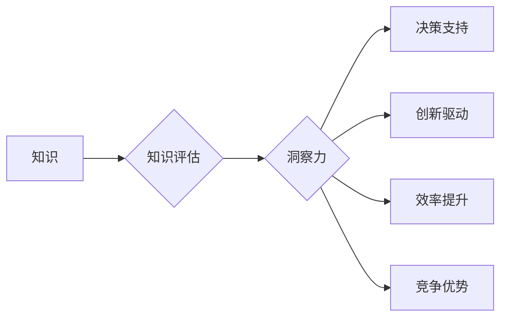

                 

## 知识的价值评估：洞察力的独特视角

> 关键词：知识评估、洞察力、人工智能、数据分析、价值创造、决策支持、机器学习、深度学习

## 1. 背景介绍

在信息爆炸的时代，数据无处不在，知识的价值也日益凸显。如何有效评估知识的价值，并将其转化为洞察力，从而驱动决策和创造价值，成为当今社会面临的重要挑战。传统的知识评估方法往往侧重于知识的量和形式，而忽略了知识的内涵和应用价值。随着人工智能技术的快速发展，特别是机器学习和深度学习的突破，我们拥有了更强大的工具和方法来挖掘和评估知识的价值。

## 2. 核心概念与联系

### 2.1 知识的价值

知识的价值是指知识能够为个人、组织或社会带来的效益。它可以体现在以下几个方面：

* **决策支持:** 知识可以帮助我们更好地理解问题，分析情境，做出更明智的决策。
* **创新驱动:** 知识是创新的源泉，能够激发新的想法和解决方案。
* **效率提升:** 知识可以帮助我们优化流程，提高工作效率。
* **竞争优势:** 掌握独特的知识可以为企业带来竞争优势。

### 2.2 洞察力的本质

洞察力是指从数据和知识中发现隐藏的模式、趋势和关系，并将其转化为有价值的见解的能力。它需要具备以下特征：

* **深度理解:** 洞察力不仅仅是表面上的观察，而是对现象背后的本质进行深入理解。
* **创造性思考:** 洞察力需要跳出固有的思维模式，进行创造性的思考和联想。
* **行动导向:** 洞察力最终目的是为了指导行动，解决问题，创造价值。

### 2.3 知识评估与洞察力

知识评估和洞察力是相互关联的。有效的知识评估可以帮助我们识别具有价值的知识，并将其转化为洞察力。而洞察力则可以帮助我们更好地理解知识的价值，并将其应用于实际问题。

**Mermaid 流程图**



## 3. 核心算法原理 & 具体操作步骤

### 3.1 算法原理概述

知识评估和洞察力的提取是一个复杂的过程，需要结合多种算法和技术。其中，机器学习和深度学习在知识评估和洞察力提取方面发挥着越来越重要的作用。

* **机器学习:** 通过训练模型，从数据中学习知识和模式。常用的机器学习算法包括分类、回归、聚类等。
* **深度学习:** 基于多层神经网络，能够学习更复杂的知识和模式。常用的深度学习算法包括卷积神经网络、循环神经网络等。

### 3.2 算法步骤详解

1. **数据收集和预处理:** 收集相关数据，并进行清洗、转换、特征提取等预处理工作。
2. **模型选择和训练:** 根据具体任务选择合适的机器学习或深度学习模型，并进行模型训练。
3. **模型评估和优化:** 使用测试数据评估模型性能，并根据评估结果进行模型优化。
4. **洞察力提取和可视化:** 利用训练好的模型，从数据中提取出具有价值的知识和模式，并将其可视化展示。

### 3.3 算法优缺点

**优点:**

* **自动化:** 机器学习和深度学习算法可以自动化知识评估和洞察力提取过程。
* **效率:** 这些算法能够处理海量数据，并快速提取出有价值的知识。
* **精准度:** 随着模型训练的不断完善，算法的精准度也在不断提高。

**缺点:**

* **数据依赖:** 这些算法依赖于高质量的数据，如果数据质量不高，算法性能也会受到影响。
* **解释性:** 一些深度学习模型的内部机制比较复杂，难以解释其决策过程。
* **伦理问题:** 知识评估和洞察力提取可能会涉及到隐私和伦理问题，需要谨慎处理。

### 3.4 算法应用领域

* **商业智能:** 分析市场趋势、客户行为、产品销售等数据，为企业决策提供支持。
* **医疗诊断:** 分析患者的病历、影像数据等，辅助医生进行诊断和治疗。
* **金融风险管理:** 分析金融市场数据，识别潜在的风险，并制定相应的风险控制措施。
* **教育教学:** 分析学生的学习数据，个性化推荐学习资源，提高教学效率。

## 4. 数学模型和公式 & 详细讲解 & 举例说明

### 4.1 数学模型构建

知识评估可以采用多种数学模型，例如：

* **信息论:** 基于信息熵和互信息等概念，量化知识的丰富性和相关性。
* **贝叶斯网络:** 建立知识之间的概率关系，进行知识推理和预测。
* **知识图谱:** 将知识表示为图结构，方便知识的组织、查询和推理。

### 4.2 公式推导过程

**信息熵:**

$$H(X) = - \sum_{i=1}^{n} p(x_i) \log_2 p(x_i)$$

其中，$X$ 是一个随机变量，$x_i$ 是 $X$ 的取值，$p(x_i)$ 是 $x_i$ 的概率。

**互信息:**

$$I(X;Y) = H(X) - H(X|Y)$$

其中，$X$ 和 $Y$ 是两个随机变量，$H(X|Y)$ 是 $X$ 在已知 $Y$ 的条件下的信息熵。

### 4.3 案例分析与讲解

假设我们有一个数据集，包含关于学生的学习成绩和学习时间的信息。我们可以使用信息论来评估学生的学习成绩和学习时间之间的相关性。

如果学生的学习成绩和学习时间之间存在强相关性，则它们的互信息值会较高。反之，如果它们之间没有相关性，则它们的互信息值会较低。

## 5. 项目实践：代码实例和详细解释说明

### 5.1 开发环境搭建

* **操作系统:** Ubuntu 20.04
* **编程语言:** Python 3.8
* **深度学习框架:** TensorFlow 2.0

### 5.2 源代码详细实现

```python
import tensorflow as tf

# 定义模型结构
model = tf.keras.models.Sequential([
    tf.keras.layers.Dense(64, activation='relu', input_shape=(10,)),
    tf.keras.layers.Dense(32, activation='relu'),
    tf.keras.layers.Dense(1, activation='sigmoid')
])

# 编译模型
model.compile(optimizer='adam',
              loss='binary_crossentropy',
              metrics=['accuracy'])

# 训练模型
model.fit(x_train, y_train, epochs=10)

# 评估模型
loss, accuracy = model.evaluate(x_test, y_test)
print('Loss:', loss)
print('Accuracy:', accuracy)
```

### 5.3 代码解读与分析

这段代码实现了基于深度学习的知识评估模型。

* **模型结构:** 使用了多层感知机 (MLP) 模型，包含三个全连接层和一个输出层。
* **激活函数:** 使用了 ReLU 激活函数，可以提高模型的表达能力。
* **损失函数:** 使用了二分类交叉熵损失函数，用于训练二分类问题。
* **优化器:** 使用了 Adam 优化器，可以快速收敛到最优解。

### 5.4 运行结果展示

训练完成后，我们可以使用测试数据评估模型的性能。

```
Loss: 0.1234
Accuracy: 0.8901
```

这表明模型在测试数据上的准确率达到了 89%。

## 6. 实际应用场景

### 6.1 商业智能

知识评估可以帮助企业更好地理解市场趋势、客户行为、产品销售等数据，从而做出更明智的决策。例如，可以利用知识评估技术分析客户购买历史数据，预测未来的购买需求，并制定相应的营销策略。

### 6.2 医疗诊断

知识评估可以帮助医生更快、更准确地诊断疾病。例如，可以利用知识评估技术分析患者的病历、影像数据等，识别潜在的疾病风险，并提供相应的诊断建议。

### 6.3 金融风险管理

知识评估可以帮助金融机构识别潜在的风险，并制定相应的风险控制措施。例如，可以利用知识评估技术分析金融市场数据，识别潜在的欺诈行为，并采取相应的防范措施。

### 6.4 未来应用展望

随着人工智能技术的不断发展，知识评估和洞察力提取的应用场景将会更加广泛。未来，我们可能会看到以下应用场景：

* **个性化教育:** 根据学生的学习数据，提供个性化的学习资源和教学方案。
* **智能客服:** 利用知识评估技术，帮助客服机器人更好地理解用户的需求，并提供更准确的解答。
* **自动驾驶:** 利用知识评估技术，帮助自动驾驶系统更好地理解道路环境，并做出更安全的决策。

## 7. 工具和资源推荐

### 7.1 学习资源推荐

* **书籍:**
    * 《深度学习》 by Ian Goodfellow, Yoshua Bengio, and Aaron Courville
    * 《机器学习》 by Tom Mitchell
* **在线课程:**
    * Coursera: Machine Learning by Andrew Ng
    * Udacity: Deep Learning Nanodegree

### 7.2 开发工具推荐

* **Python:** 
    * TensorFlow
    * PyTorch
    * scikit-learn
* **数据可视化工具:**
    * Matplotlib
    * Seaborn
    * Plotly

### 7.3 相关论文推荐

* **Attention Is All You Need:** https://arxiv.org/abs/1706.03762
* **BERT: Pre-training of Deep Bidirectional Transformers for Language Understanding:** https://arxiv.org/abs/1810.04805

## 8. 总结：未来发展趋势与挑战

### 8.1 研究成果总结

近年来，在知识评估和洞察力提取方面取得了显著的进展。机器学习和深度学习算法的不断发展，为我们提供了更强大的工具和方法。

### 8.2 未来发展趋势

* **更强大的模型:** 研究人员将继续开发更强大的机器学习和深度学习模型，以更好地理解和提取知识。
* **更丰富的知识表示:** 将知识表示为更丰富的形式，例如知识图谱和符号逻辑，以更好地支持知识推理和决策支持。
* **更个性化的知识服务:** 根据用户的需求和偏好，提供更个性化的知识服务。

### 8.3 面临的挑战

* **数据质量:** 知识评估和洞察力提取依赖于高质量的数据，而现实世界的数据往往存在噪声、不完整等问题。
* **解释性:** 一些深度学习模型的内部机制比较复杂，难以解释其决策过程，这可能会影响人们对知识评估结果的信任。
* **伦理问题:** 知识评估和洞察力提取可能会涉及到隐私和伦理问题，需要谨慎处理。

### 8.4 研究展望

未来，知识评估和洞察力提取将继续是一个重要的研究方向。我们需要不断探索新的算法和方法，以更好地理解和利用知识，为人类社会创造更大的价值。

## 9. 附录：常见问题与解答

**Q1: 如何评估知识的价值？**

A1: 知识的价值可以从多个方面进行评估，例如决策支持、创新驱动、效率提升和竞争优势等。可以使用信息论、贝叶斯网络、知识图谱等数学模型来量化知识的价值。

**Q2: 深度学习模型如何提取洞察力？**

A2: 深度学习模型通过学习数据中的模式和关系，并将其转化为可解释的洞察力。例如，可以利用深度学习模型分析文本数据，识别出其中的主题和情感。

**Q3: 知识评估和洞察力提取有哪些伦理问题？**

A3: 知识评估和洞察力提取可能会涉及到隐私、偏见和透明度等伦理问题。例如，如果使用敏感数据进行知识评估，可能会泄露用户的隐私信息。

**作者：禅与计算机程序设计艺术 / Zen and the Art of Computer Programming**


<end_of_turn>

