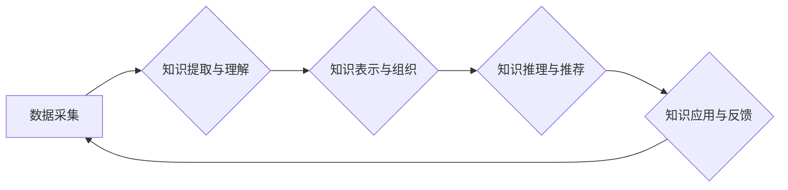

                 

## 知识管理3.0：AI驱动的组织学习革命

> 关键词：知识管理、人工智能、机器学习、深度学习、组织学习、知识图谱、数据分析、自动化、未来趋势

## 1. 背景介绍

在当今瞬息万变的数字化时代，知识已成为企业最宝贵的资产。传统的知识管理（KM）模式，往往依赖于人工整理、存储和传播，效率低下，难以应对海量信息和快速变化的挑战。随着人工智能（AI）技术的飞速发展，知识管理迎来了新的变革——知识管理3.0。

知识管理3.0，以AI为核心，利用机器学习、深度学习等技术，实现对知识的智能识别、理解、组织和应用，赋予组织更强大的学习能力和适应能力。它打破了传统知识管理的局限性，将知识管理从静态的知识库转变为动态的知识网络，推动组织实现持续创新和发展。

## 2. 核心概念与联系

**2.1 知识管理3.0的核心概念**

* **智能知识识别:** 利用自然语言处理（NLP）、计算机视觉等技术，自动识别和提取知识点，包括文本、图像、音频等多种形式的信息。
* **知识图谱构建:** 将知识点以结构化的方式组织成知识图谱，建立知识之间的关联关系，形成知识网络。
* **知识推理与推荐:** 基于知识图谱，利用机器学习算法进行知识推理和关联分析，为用户提供个性化的知识推荐和洞察。
* **自动化知识应用:** 将知识嵌入到业务流程中，实现知识的自动化应用，提高工作效率和决策质量。

**2.2 知识管理3.0的架构**



**2.3 知识管理3.0与组织学习的联系**

组织学习是指组织成员通过经验积累、知识共享和创新活动，不断提升组织整体能力的过程。知识管理3.0为组织学习提供了强大的技术支撑，通过智能知识识别、知识图谱构建和知识应用自动化，加速组织知识的流动和转化，促进组织成员的知识共享和协作，最终提升组织的学习能力和适应能力。

## 3. 核心算法原理 & 具体操作步骤

**3.1 算法原理概述**

知识管理3.0的核心算法主要包括：

* **自然语言处理（NLP）:** 用于理解和处理自然语言文本，包括文本分类、情感分析、文本摘要等。
* **机器学习（ML）:** 用于从数据中学习模式和规律，包括监督学习、无监督学习和强化学习等。
* **深度学习（DL）:** 用于处理复杂的数据模式，包括卷积神经网络（CNN）、循环神经网络（RNN）等。

**3.2 算法步骤详解**

1. **数据采集:** 收集各种形式的知识数据，包括文本文件、文档、数据库、网络信息等。
2. **数据预处理:** 对收集到的数据进行清洗、格式化和转换，使其适合算法训练和应用。
3. **知识提取与理解:** 利用NLP算法，从数据中提取关键知识点，并进行语义理解和关系抽取。
4. **知识表示与组织:** 将提取的知识点以结构化的方式组织成知识图谱，建立知识之间的关联关系。
5. **知识推理与推荐:** 利用机器学习算法，对知识图谱进行推理和分析，为用户提供个性化的知识推荐和洞察。
6. **知识应用与反馈:** 将知识嵌入到业务流程中，实现知识的自动化应用，并收集用户反馈，不断优化算法和知识库。

**3.3 算法优缺点**

* **优点:**

    * 自动化知识识别和组织，提高效率和准确性。
    * 建立知识网络，促进知识共享和协作。
    * 提供个性化知识推荐，提升用户体验。
    * 促进组织学习和创新。

* **缺点:**

    * 需要大量高质量的数据进行训练。
    * 算法模型的复杂性可能导致部署和维护成本高。
    * 知识图谱的构建和维护需要专业人员的参与。
    * 算法的解释性和透明度需要进一步提升。

**3.4 算法应用领域**

* **企业知识管理:** 自动化知识提取、知识库构建、知识共享和知识应用。
* **教育培训:** 个性化学习推荐、知识问答系统、智能辅导系统。
* **医疗保健:** 疾病诊断、药物研发、患者个性化治疗方案。
* **金融服务:** 风险评估、欺诈检测、投资决策支持。

## 4. 数学模型和公式 & 详细讲解 & 举例说明

**4.1 数学模型构建**

知识管理3.0的数学模型主要基于图论、概率论和统计学。

* **图论:** 用于表示知识之间的关系，构建知识图谱。
* **概率论:** 用于计算知识点之间的关联概率，进行知识推理和推荐。
* **统计学:** 用于分析知识数据，识别知识模式和趋势。

**4.2 公式推导过程**

* **PageRank算法:** 用于计算知识点在知识图谱中的重要性。

$$PR(A) = (1-d) + d \sum_{p \in P(A)} \frac{PR(p)}{C(p)}$$

其中：

* $PR(A)$ 是知识点 $A$ 的 PageRank 值。
* $d$ 是阻尼因子，通常取值为 0.85。
* $P(A)$ 是指向知识点 $A$ 的所有链接。
* $C(p)$ 是指向知识点 $p$ 的所有链接的数量。

* **余弦相似度:** 用于计算两个知识点之间的语义相似度。

$$Sim(A, B) = \frac{A \cdot B}{||A|| ||B||}$$

其中：

* $A$ 和 $B$ 是两个知识点的向量表示。
* $A \cdot B$ 是 $A$ 和 $B$ 的点积。
* $||A||$ 和 $||B||$ 是 $A$ 和 $B$ 的模长。

**4.3 案例分析与讲解**

假设我们构建了一个知识图谱，包含了关于人工智能的知识点，例如“机器学习”、“深度学习”、“自然语言处理”等。我们可以利用 PageRank 算法计算每个知识点的重要性，例如“深度学习” 的 PageRank 值可能比 “自然语言处理” 高，因为前者被更多的人引用。

我们可以利用余弦相似度计算两个知识点之间的语义相似度，例如“机器学习” 和 “深度学习” 的相似度可能较高，因为它们都是人工智能的子领域。

## 5. 项目实践：代码实例和详细解释说明

**5.1 开发环境搭建**

* Python 3.7+
* TensorFlow 2.0+
* PyTorch 1.0+
* Jupyter Notebook

**5.2 源代码详细实现**

```python
# 使用 TensorFlow 构建一个简单的知识图谱嵌入模型

import tensorflow as tf

# 定义模型结构
model = tf.keras.Sequential([
    tf.keras.layers.Embedding(input_dim=vocab_size, output_dim=embedding_dim),
    tf.keras.layers.Flatten(),
    tf.keras.layers.Dense(units=128, activation='relu'),
    tf.keras.layers.Dense(units=embedding_dim)
])

# 编译模型
model.compile(optimizer='adam', loss='mse')

# 训练模型
model.fit(train_data, train_labels, epochs=10)

# 使用模型进行知识嵌入
embeddings = model.predict(test_data)
```

**5.3 代码解读与分析**

* 该代码示例使用 TensorFlow 构建了一个简单的知识图谱嵌入模型。
* 模型输入是知识点对应的词嵌入向量，输出是知识点在嵌入空间中的向量表示。
* 模型使用 Embedding 层将知识点映射到低维向量空间，并使用全连接层进行非线性变换，最终得到知识点的嵌入向量。
* 模型使用均方误差 (MSE) 作为损失函数，使用 Adam 优化器进行训练。

**5.4 运行结果展示**

训练完成后，我们可以使用模型预测新的知识点的嵌入向量，并进行分析和应用。例如，我们可以计算两个知识点的嵌入向量之间的余弦相似度，判断它们之间的语义相关性。

## 6. 实际应用场景

**6.1 企业知识管理**

* **知识库构建:** 利用 AI 自动提取和组织企业内部的知识文档，构建智能知识库。
* **知识共享:** 建立知识图谱，方便员工查找和共享相关知识。
* **知识应用:** 将知识嵌入到业务流程中，例如销售流程、客户服务流程等，提高工作效率和决策质量。

**6.2 教育培训**

* **个性化学习推荐:** 根据学生的学习情况和兴趣，推荐个性化的学习资源。
* **知识问答系统:** 利用 AI 构建知识问答系统，帮助学生解答学习疑问。
* **智能辅导系统:** 提供智能化的学习辅导，帮助学生理解知识点和解决学习难题。

**6.3 医疗保健**

* **疾病诊断:** 利用 AI 分析患者的症状和病史，辅助医生进行疾病诊断。
* **药物研发:** 利用 AI 分析药物的结构和作用机制，加速药物研发过程。
* **患者个性化治疗方案:** 根据患者的基因信息和病史，制定个性化的治疗方案。

**6.4 未来应用展望**

随着 AI 技术的不断发展，知识管理3.0 将在更多领域得到应用，例如：

* **法律服务:** 利用 AI 分析法律法规，辅助律师进行法律咨询和案件处理。
* **金融服务:** 利用 AI 进行风险评估、欺诈检测和投资决策支持。
* **城市管理:** 利用 AI 分析城市数据，优化城市规划和管理。

## 7. 工具和资源推荐

**7.1 学习资源推荐**

* **书籍:**

    * 《深度学习》
    * 《机器学习实战》
    * 《知识管理3.0》

* **在线课程:**

    * Coursera: 深度学习
    * edX: 机器学习
    * Udacity: AI Nanodegree

**7.2 开发工具推荐**

* **Python:** 广泛应用于 AI 开发，拥有丰富的库和工具。
* **TensorFlow:** 开源深度学习框架，支持多种硬件平台。
* **PyTorch:** 开源深度学习框架，以其灵活性和易用性而闻名。
* **Neo4j:** 图数据库，用于构建和管理知识图谱。

**7.3 相关论文推荐**

* **Knowledge Graph Embedding: A Survey**
* **Deep Learning for Knowledge Graph Completion**
* **Knowledge Management 3.0: AI-Driven Organizational Learning Revolution**

## 8. 总结：未来发展趋势与挑战

**8.1 研究成果总结**

知识管理3.0 已经取得了显著的成果，例如：

* 自动化知识提取和组织
* 智能知识推荐和推理
* 知识图谱构建和应用

**8.2 未来发展趋势**

* **更强大的 AI 模型:** 发展更强大的 AI 模型，例如 Transformer、BERT 等，提高知识理解和推理能力。
* **更丰富的知识数据:** 收集和整合更丰富的知识数据，构建更全面的知识图谱。
* **更个性化的知识服务:** 提供更个性化的知识服务，例如个性化学习推荐、个性化医疗诊断等。

**8.3 面临的挑战**

* **数据质量问题:** 知识数据往往存在不完整、不准确、不一致等问题，需要进行有效的数据清洗和预处理。
* **算法解释性和透明度:** 许多 AI 算法的内部机制难以理解，需要提高算法的解释性和透明度。
* **知识图谱的维护和更新:** 知识图谱需要不断维护和更新，以适应不断变化的知识环境。

**8.4 研究展望**

未来，知识管理3.0 将继续朝着更智能、更个性化、更可解释的方向发展，为组织和个人提供更强大的知识服务，推动社会进步。

## 9. 附录：常见问题与解答

**9.1 如何构建知识图谱？**

构建知识图谱需要以下步骤：

1. **数据收集:** 收集各种形式的知识数据，例如文本文件、文档、数据库等。
2. **数据清洗:** 对收集到的数据进行清洗，去除重复数据、错误数据等。
3. **实体识别:** 利用 NLP 技术识别知识图谱中的实体，例如人物、地点、事件等。
4. **关系抽取:** 利用 NLP 技术识别知识图谱中的关系，例如“人-工作”、“地点-事件”等。
5. **知识图谱构建:** 将实体和关系组织成知识图谱，可以使用 Neo4j 等图数据库工具。

**9.2 如何评估知识图谱的质量？**

知识图谱的质量可以从以下几个方面进行评估：

* **准确性:** 知识图谱中的实体和关系是否准确。
* **完整性:** 知识图谱是否包含了所有重要的知识。
* **一致性:** 知识图谱中的信息是否一致。
* **可解释性:** 知识图谱是否易于理解和使用。

**9.3 如何应用知识图谱？**

知识图谱可以应用于多种场景，例如：

* **知识搜索:** 基于知识图谱进行知识搜索，提供更精准和相关的搜索结果。
* **知识推荐:** 基于知识图谱进行知识推荐，推荐用户可能感兴趣的知识。
* **知识推理:** 基于知识图谱进行知识推理，发现新的知识和洞察。


作者：禅与计算机程序设计艺术 / Zen and the Art of Computer Programming<end_of_turn>

