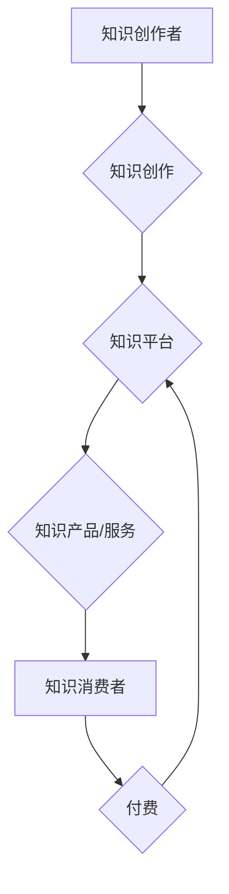

                 

## 知识经济时代下的知识付费创新商业模式运营

> 关键词：知识付费、商业模式、创新、在线教育、内容平台、用户体验、数据驱动、人工智能

### 1. 背景介绍

进入21世纪，全球经济结构发生深刻变化，知识成为重要的生产要素，知识经济时代正式到来。在这个时代，知识的获取、传播和应用成为经济发展和社会进步的关键。知识付费作为一种新型的商业模式，应运而生，它以知识为核心，通过付费的方式提供知识产品和服务，满足人们对知识的需求。

知识付费模式的兴起，得益于以下几个因素：

* **互联网技术的发展:** 互联网技术的快速发展，为知识的传播和分享提供了便捷的平台。
* **移动互联网的普及:** 移动互联网的普及，使得人们随时随地可以获取知识。
* **知识经济的崛起:** 知识经济的崛起，使得人们更加重视知识的价值。
* **个人学习需求的增长:**  随着社会竞争的加剧，人们对个人能力提升的需求不断增长。

知识付费模式的出现，为知识创作者和消费者提供了新的机遇。知识创作者可以将自己的知识和经验转化为产品和服务，获得收益；知识消费者可以以更低成本获取高质量的知识，提升自身能力。

### 2. 核心概念与联系

**2.1 知识付费的核心概念**

知识付费是指以知识为核心，通过付费的方式提供知识产品和服务，满足人们对知识的需求的一种商业模式。

**2.2 知识付费的商业模式架构**

知识付费的商业模式架构主要包括以下几个环节：

* **知识创作者:** 拥有知识和经验的人，例如专家、学者、企业家等。
* **知识平台:** 提供知识付费服务的平台，例如在线教育平台、内容平台等。
* **知识产品:** 包括线上课程、电子书、音频课程、视频教程等。
* **知识服务:** 包括一对一辅导、咨询服务、社群互动等。
* **知识消费者:** 需要获取知识的人，例如学生、职场人士、创业者等。

**2.3 知识付费商业模式流程图**



**2.4 知识付费模式的优势**

* **低成本、高效率:** 知识付费模式可以降低知识传播的成本，提高知识的传播效率。
* **个性化定制:** 知识付费模式可以根据用户的需求提供个性化的知识产品和服务。
* **持续收益:** 知识付费模式可以实现知识产品的持续收益。
* **知识共享:** 知识付费模式可以促进知识的共享和传播。

**2.5 知识付费模式的挑战**

* **知识质量控制:** 知识付费平台需要建立有效的知识质量控制机制。
* **用户信任问题:** 知识付费平台需要建立用户的信任。
* **知识版权保护:** 知识付费平台需要加强知识版权保护。
* **商业模式创新:** 知识付费平台需要不断创新商业模式，以适应市场变化。

### 3. 核心算法原理 & 具体操作步骤

**3.1 算法原理概述**

知识付费模式的运营离不开数据分析和算法推荐。 

* **用户画像:** 通过用户行为数据，构建用户画像，了解用户的兴趣、需求、学习习惯等。
* **内容推荐:** 基于用户画像和内容标签，使用协同过滤、内容过滤等算法，推荐用户感兴趣的内容。
* **个性化学习路径:** 根据用户的学习进度和知识掌握情况，推荐个性化的学习路径。

**3.2 算法步骤详解**

1. **数据收集:** 收集用户行为数据，例如用户浏览记录、学习记录、评价记录等。
2. **数据清洗:** 对收集到的数据进行清洗，去除无效数据和重复数据。
3. **特征提取:** 从用户行为数据中提取特征，例如用户兴趣、学习习惯、知识掌握情况等。
4. **模型训练:** 使用机器学习算法，训练用户画像和内容推荐模型。
5. **模型评估:** 对模型进行评估，调整模型参数，提高模型精度。
6. **个性化推荐:** 根据用户画像和内容标签，使用推荐模型，推荐用户感兴趣的内容。

**3.3 算法优缺点**

* **优点:** 能够精准推荐用户感兴趣的内容，提高用户粘性，促进知识付费转化。
* **缺点:** 需要大量的用户数据进行训练，模型训练成本较高，算法效果受数据质量影响较大。

**3.4 算法应用领域**

* 在线教育平台
* 内容平台
* 社交媒体
* 电子商务平台

### 4. 数学模型和公式 & 详细讲解 & 举例说明

**4.1 数学模型构建**

知识推荐系统可以使用协同过滤算法，构建用户-物品评分矩阵。

* **用户-物品评分矩阵:**  一个n x m的矩阵，其中n代表用户数量，m代表知识产品数量。矩阵中的每个元素代表用户对知识产品的评分。

**4.2 公式推导过程**

协同过滤算法的核心是计算用户对未知物品的评分。可以使用以下公式计算用户u对物品i的评分预测值：

$$
\hat{r}_{ui} = \bar{r}_u + \frac{\sum_{v \in N(u)} (r_{uv} - \bar{r}_v) * sim(u,v)}{\sum_{v \in N(u)} sim(u,v)}
$$

其中：

* $\hat{r}_{ui}$: 用户u对物品i的评分预测值
* $\bar{r}_u$: 用户u的平均评分
* $r_{uv}$: 用户u对物品v的实际评分
* $\bar{r}_v$: 物品v的平均评分
* $sim(u,v)$: 用户u和用户v之间的相似度

**4.3 案例分析与讲解**

假设有一个用户-物品评分矩阵，其中用户1对课程A评分为5，用户2对课程A评分为4，用户1对课程B评分为3，用户2对课程B评分为5。

可以使用协同过滤算法，计算用户1对课程B的评分预测值。

* 用户1的平均评分： (5 + 3) / 2 = 4
* 用户2的平均评分： (4 + 5) / 2 = 4.5
* 用户1和用户2之间的相似度： 可以使用余弦相似度等算法计算。

将以上信息代入公式，即可计算出用户1对课程B的评分预测值。

### 5. 项目实践：代码实例和详细解释说明

**5.1 开发环境搭建**

* Python 3.x
* Jupyter Notebook
* Scikit-learn

**5.2 源代码详细实现**

```python
import pandas as pd
from sklearn.metrics.pairwise import cosine_similarity

# 加载用户-物品评分矩阵
ratings = pd.read_csv('ratings.csv')

# 计算用户之间的相似度
user_similarity = cosine_similarity(ratings)

# 计算用户对未知物品的评分预测值
def predict_rating(user_id, item_id):
    user_ratings = ratings[ratings['user_id'] == user_id]
    similar_users = user_similarity[user_id]
    weighted_sum = 0
    for i in range(len(similar_users)):
        if similar_users[i] > 0:
            user_i = i
            weighted_sum += similar_users[i] * user_ratings.loc[user_i, 'rating']
    return weighted_sum / sum(similar_users)

# 预测用户1对课程B的评分
user_id = 1
item_id = 2
predicted_rating = predict_rating(user_id, item_id)
print(f'用户{user_id}对课程{item_id}的评分预测值: {predicted_rating}')
```

**5.3 代码解读与分析**

* 代码首先加载用户-物品评分矩阵。
* 然后使用余弦相似度算法计算用户之间的相似度。
* 接着定义一个函数`predict_rating`，用于计算用户对未知物品的评分预测值。
* 最后使用该函数预测用户1对课程B的评分。

**5.4 运行结果展示**

运行代码后，会输出用户1对课程B的评分预测值。

### 6. 实际应用场景

**6.1 在线教育平台**

在线教育平台可以利用知识付费模式，提供各种类型的在线课程，例如编程课程、语言课程、商业课程等。

* **个性化推荐:** 根据用户的学习进度和知识掌握情况，推荐个性化的学习路径。
* **知识社区:** 建立知识社区，让用户可以互相交流学习经验。
* **直播课程:** 提供直播课程，让用户可以实时互动学习。

**6.2 内容平台**

内容平台可以利用知识付费模式，提供各种类型的付费内容，例如文章、视频、音频等。

* **付费订阅:** 用户可以订阅平台的付费内容，获得独家内容和优惠。
* **付费会员:** 用户可以成为平台的付费会员，获得更多权益，例如免费观看视频、下载电子书等。
* **付费专栏:** 内容创作者可以开设付费专栏，提供深度内容和互动服务。

**6.3 其他应用场景**

* **企业培训:** 企业可以利用知识付费模式，提供员工培训课程，提升员工技能。
* **个人成长:** 个人可以利用知识付费模式，学习新的技能，提升个人能力。

**6.4 未来应用展望**

随着人工智能技术的不断发展，知识付费模式将更加智能化、个性化。

* **智能化推荐:** 利用人工智能算法，更加精准地推荐用户感兴趣的内容。
* **个性化学习:** 根据用户的学习风格和习惯，定制个性化的学习方案。
* **虚拟现实/增强现实:** 利用虚拟现实和增强现实技术，打造更加沉浸式的学习体验。

### 7. 工具和资源推荐

**7.1 学习资源推荐**

* **书籍:** 《数据科学实战》、《机器学习实战》
* **在线课程:** Coursera、edX、Udacity
* **博客:** Towards Data Science、Machine Learning Mastery

**7.2 开发工具推荐**

* **Python:** 强大的数据分析和机器学习库
* **Jupyter Notebook:** 便捷的代码编辑和可视化工具
* **Scikit-learn:** 机器学习算法库

**7.3 相关论文推荐**

* **协同过滤算法:** "Collaborative Filtering: A User-Based Approach"
* **内容推荐算法:** "Content-Based Recommendation Systems"
* **深度学习推荐算法:** "Deep Learning for Recommender Systems"

### 8. 总结：未来发展趋势与挑战

**8.1 研究成果总结**

知识付费模式在知识经济时代具有重要的意义，它为知识创作者和消费者提供了新的机遇。通过数据分析和算法推荐，知识付费模式可以更加精准地推荐用户感兴趣的内容，提高用户粘性，促进知识付费转化。

**8.2 未来发展趋势**

* **智能化推荐:** 利用人工智能算法，更加精准地推荐用户感兴趣的内容。
* **个性化学习:** 根据用户的学习风格和习惯，定制个性化的学习方案。
* **虚拟现实/增强现实:** 利用虚拟现实和增强现实技术，打造更加沉浸式的学习体验。

**8.3 面临的挑战**

* **知识质量控制:** 知识付费平台需要建立有效的知识质量控制机制。
* **用户信任问题:** 知识付费平台需要建立用户的信任。
* **知识版权保护:** 知识付费平台需要加强知识版权保护。
* **商业模式创新:** 知识付费平台需要不断创新商业模式，以适应市场变化。

**8.4 研究展望**

未来，知识付费模式将更加智能化、个性化、多元化。研究者需要继续探索新的算法和技术，以提高知识付费模式的效率和效果。同时，还需要关注知识付费模式的伦理问题和社会影响，确保知识付费模式的健康发展。

### 9. 附录：常见问题与解答

**9.1 如何选择合适的知识付费平台？**

选择知识付费平台时，需要考虑以下因素：

* 平台的口碑和信誉
* 平台提供的知识内容质量
* 平台的收费标准
* 平台的用户体验

**9.2 如何保护知识付费平台上的知识版权？**

知识付费平台需要采取以下措施保护知识版权：

* 建立完善的知识版权管理制度
* 使用技术手段保护知识产权
* 加强与版权机构的合作

**9.3 如何提高知识付费模式的转化率？**

提高知识付费模式的转化率，需要从以下几个方面入手：

* 提供高质量的知识内容
* 提升用户体验
* 进行有效的营销推广
* 建立良好的用户关系


作者：禅与计算机程序设计艺术 / Zen and the Art of Computer Programming 
<end_of_turn>

