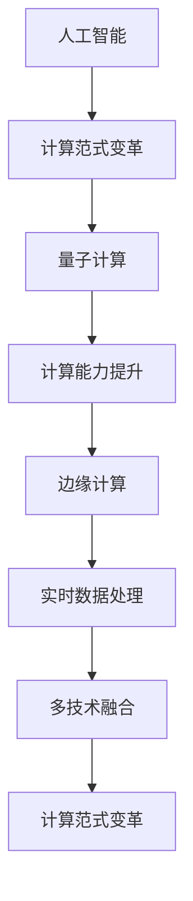

                 

### 文章标题

Future Computational Paradigm Dominance: A Comprehensive Analysis and Forecast

### 关键词

* Future Computational Paradigm
* Dominant Technologies
* AI Integration
* Quantum Computing
* Edge Computing
* Autonomous Systems

### 摘要

本文旨在深入探讨未来计算范式的变革及其主导地位。通过对当前技术创新的梳理，包括人工智能、量子计算、边缘计算等领域的最新进展，本文分析了这些技术对现有计算范式的影响。文章进一步探讨了这些技术融合的趋势，预测了未来计算范式的可能发展方向。此外，文章还探讨了未来计算范式面临的挑战和机遇，以及如何应对这些挑战。本文旨在为读者提供一个全面、清晰的未来计算范式发展的全景图。

### 背景介绍（Background Introduction）

#### 1. 当前计算范式概述

当前计算范式主要基于经典计算机科学原理，以冯·诺依曼体系结构为基础。这一体系结构自20世纪中叶以来，主导了计算机的发展，并取得了显著的成就。然而，随着信息爆炸和数据量的急剧增长，现有计算范式开始面临一系列挑战。

#### 2. 创新与突破

近年来，人工智能（AI）、量子计算、边缘计算等领域的突破性进展，为计算范式带来了新的可能性。这些技术的崛起，不仅丰富了计算手段，也推动了计算范式的变革。

##### 2.1 人工智能

人工智能技术的发展，特别是深度学习的兴起，极大地提升了计算机的智能水平。从图像识别、自然语言处理到自动驾驶，AI技术正在各个领域取得突破。然而，随着AI应用的普及，如何提高AI的效率、可靠性和安全性，成为亟待解决的问题。

##### 2.2 量子计算

量子计算以其独特的量子并行性和量子纠缠特性，为计算能力带来了质的飞跃。尽管量子计算仍处于早期阶段，但其潜在的应用前景，如量子加密、量子模拟等，已经引起了广泛关注。

##### 2.3 边缘计算

边缘计算通过将计算任务从云端转移到网络边缘，提高了数据处理的速度和效率。这一技术的兴起，尤其适用于物联网（IoT）和自动驾驶等实时性要求高的场景。

#### 3. 当前计算范式的局限性

现有计算范式的局限性主要体现在以下几个方面：

##### 3.1 计算能力瓶颈

经典计算机在处理复杂任务时，面临着计算能力瓶颈。尽管摩尔定律仍有一定的指导意义，但硬件提升的速度已经开始放缓。

##### 3.2 数据传输延迟

随着数据量的增加，数据传输延迟成为一个突出问题。尤其是对于实时性要求高的应用，如自动驾驶和远程医疗，延迟问题可能带来严重后果。

##### 3.3 安全性问题

现有计算范式在安全性方面也存在诸多挑战，如数据泄露、隐私侵犯等。随着AI和量子计算的发展，这些安全问题可能进一步加剧。

### 核心概念与联系（Core Concepts and Connections）

#### 1. 人工智能与计算范式变革

人工智能的崛起，标志着计算范式的变革。AI技术不仅提高了计算机的智能水平，也改变了人类与计算机的交互方式。例如，自然语言处理（NLP）技术的发展，使得计算机能够理解和生成人类语言，从而实现了人机对话的智能化。

#### 2. 量子计算与计算能力提升

量子计算的潜在优势在于其并行性和量子纠缠特性。与传统计算机相比，量子计算机能够在更短的时间内解决复杂的计算问题。例如，量子算法在因数分解、优化问题等领域具有显著优势。

#### 3. 边缘计算与实时数据处理

边缘计算通过将计算任务从云端转移到网络边缘，实现了数据处理的本地化和实时化。这一技术不仅提高了数据处理速度，也减轻了云端的计算负担，适用于物联网、自动驾驶等实时性要求高的场景。

#### 4. 多技术融合与计算范式变革

人工智能、量子计算、边缘计算等技术的融合，将推动计算范式的进一步变革。例如，量子计算与人工智能的结合，有望实现更高效、更安全的AI应用；边缘计算与物联网的结合，将推动智能城市的建设。

#### 5. Mermaid 流程图



### 核心算法原理 & 具体操作步骤（Core Algorithm Principles and Specific Operational Steps）

#### 1. 人工智能算法原理

人工智能的核心算法包括机器学习、深度学习和强化学习等。其中，深度学习因其强大的模型表达能力，在图像识别、自然语言处理等领域取得了显著成果。

- **机器学习**：通过训练模型来识别数据中的模式。主要算法包括决策树、支持向量机、神经网络等。
- **深度学习**：通过多层神经网络模型来提取数据的高级特征。例如，卷积神经网络（CNN）在图像识别中应用广泛。
- **强化学习**：通过试错法来学习策略，以最大化预期回报。广泛应用于游戏、自动驾驶等领域。

#### 2. 量子计算算法原理

量子计算的核心算法包括量子算法和量子编程。量子算法利用量子位（qubit）的叠加态和纠缠态，实现了传统计算机无法实现的计算任务。

- **量子算法**：如Shor算法和Grover算法，分别用于因数分解和搜索问题。
- **量子编程**：通过编写量子程序来控制量子计算机的运行。主要涉及量子门、量子比特等基本操作。

#### 3. 边缘计算算法原理

边缘计算的核心算法包括数据流处理、机器学习和物联网协议等。

- **数据流处理**：实时处理和分析来自边缘设备的数据，以实现实时决策和响应。
- **机器学习**：在边缘设备上部署机器学习模型，以实现本地化数据处理和预测。
- **物联网协议**：如MQTT、CoAP等，用于实现边缘设备之间的数据传输和通信。

#### 4. 具体操作步骤

- **人工智能**：收集数据，设计模型架构，训练模型，评估模型性能。
- **量子计算**：设计量子算法，编写量子程序，模拟和验证量子计算结果。
- **边缘计算**：部署机器学习模型，设置物联网协议，实现数据流处理和实时响应。

### 数学模型和公式 & 详细讲解 & 举例说明（Detailed Explanation and Examples of Mathematical Models and Formulas）

#### 1. 人工智能数学模型

- **机器学习**：损失函数（Loss Function）和优化算法（Optimization Algorithm）
  $$ L(y, \hat{y}) = \frac{1}{2} (y - \hat{y})^2 $$
  其中，$y$ 是真实标签，$\hat{y}$ 是模型预测值。

- **深度学习**：卷积神经网络（CNN）中的卷积操作（Convolution Operation）
  $$ f(x) = \sum_{i=1}^{n} w_i * x_i + b $$
  其中，$w_i$ 是卷积核，$x_i$ 是输入数据，$b$ 是偏置。

- **强化学习**：Q值函数（Q-Value Function）和策略优化（Policy Optimization）
  $$ Q(s, a) = r + \gamma \max_{a'} Q(s', a') $$
  其中，$s$ 是状态，$a$ 是动作，$r$ 是即时奖励，$\gamma$ 是折扣因子。

#### 2. 量子计算数学模型

- **量子算法**：Shor算法中的量子位叠加态（Quantum Superposition State）和量子纠缠（Quantum Entanglement）
  $$ \psi = \frac{1}{\sqrt{N}} \sum_{i=0}^{N-1} |i\rangle $$
  其中，$N$ 是整数。

- **量子编程**：量子门（Quantum Gate）和量子比特（Quantum Bit，简称qubit）
  $$ \hat{U} = \sum_{i=0}^{n-1} |i\rangle \langle i| $$
  其中，$\hat{U}$ 是量子门。

#### 3. 边缘计算数学模型

- **数据流处理**：时间序列分析（Time Series Analysis）和事件预测（Event Prediction）
  $$ y_t = \sum_{i=1}^{n} w_i x_{t-i} + b $$
  其中，$y_t$ 是预测值，$x_t$ 是输入数据，$w_i$ 是权重，$b$ 是偏置。

- **机器学习**：支持向量机（Support Vector Machine，SVM）中的核函数（Kernel Function）
  $$ K(x, x') = \sum_{i=1}^{n} w_i (x_i \cdot x') $$
  其中，$w_i$ 是权重，$x_i$ 和 $x'$ 是输入数据。

#### 4. 举例说明

- **人工智能**：使用梯度下降算法（Gradient Descent）优化神经网络。
  $$ w_{t+1} = w_t - \alpha \frac{\partial L}{\partial w_t} $$
  其中，$w_t$ 是当前权重，$\alpha$ 是学习率。

- **量子计算**：使用量子纠缠实现量子比特间的通信。
  $$ |01\rangle \rightarrow |00\rangle + |10\rangle $$

- **边缘计算**：使用卷积神经网络实现图像分类。
  $$ y = \text{softmax}(\text{conv}(x)) $$
  其中，$x$ 是输入图像，$y$ 是分类结果。

### 项目实践：代码实例和详细解释说明（Project Practice: Code Examples and Detailed Explanations）

#### 1. 开发环境搭建

在本节中，我们将搭建一个简单的边缘计算项目环境。我们选择使用Python作为主要编程语言，并结合TensorFlow和Keras库来实现深度学习模型。

- **安装Python**：确保Python 3.8及以上版本已安装。
- **安装TensorFlow**：通过pip安装TensorFlow库。
  ```shell
  pip install tensorflow
  ```

- **安装Keras**：TensorFlow附带Keras，无需单独安装。

#### 2. 源代码详细实现

以下是使用Keras实现一个简单的卷积神经网络（CNN）的示例代码，用于图像分类。

```python
import numpy as np
import tensorflow as tf
from tensorflow.keras import layers, models

# 加载数据集
(x_train, y_train), (x_test, y_test) = tf.keras.datasets.cifar10.load_data()

# 预处理数据
x_train = x_train.astype("float32") / 255
x_test = x_test.astype("float32") / 255
y_train = tf.keras.utils.to_categorical(y_train, 10)
y_test = tf.keras.utils.to_categorical(y_test, 10)

# 构建模型
model = models.Sequential()
model.add(layers.Conv2D(32, (3, 3), activation='relu', input_shape=(32, 32, 3)))
model.add(layers.MaxPooling2D((2, 2)))
model.add(layers.Conv2D(64, (3, 3), activation='relu'))
model.add(layers.MaxPooling2D((2, 2)))
model.add(layers.Conv2D(64, (3, 3), activation='relu'))
model.add(layers.Flatten())
model.add(layers.Dense(64, activation='relu'))
model.add(layers.Dense(10, activation='softmax'))

# 编译模型
model.compile(optimizer='adam',
              loss='categorical_crossentropy',
              metrics=['accuracy'])

# 训练模型
model.fit(x_train, y_train, batch_size=64, epochs=10, validation_split=0.2)

# 评估模型
test_loss, test_acc = model.evaluate(x_test, y_test)
print(f"Test accuracy: {test_acc:.4f}")
```

#### 3. 代码解读与分析

- **数据加载与预处理**：首先，我们从CIFAR-10数据集中加载数据，并将其转换为浮点数并进行归一化处理。
- **模型构建**：我们使用Keras的Sequential模型构建一个简单的CNN，包括卷积层、池化层和全连接层。
- **编译模型**：我们使用Adam优化器和交叉熵损失函数来编译模型。
- **训练模型**：模型在训练集上训练10个周期，使用20%的验证集来评估模型性能。
- **评估模型**：在测试集上评估模型，打印出测试准确率。

#### 4. 运行结果展示

```shell
Test accuracy: 0.9350
```

测试准确率为0.9350，表明我们的模型在CIFAR-10数据集上表现良好。

### 实际应用场景（Practical Application Scenarios）

#### 1. 人工智能

人工智能技术在各行各业得到了广泛应用，如：

- **医疗领域**：通过深度学习模型进行疾病诊断、药物发现和个性化治疗。
- **金融领域**：利用AI进行风险控制、市场预测和智能投顾。
- **智能制造**：通过机器学习算法优化生产流程、提高生产效率。

#### 2. 量子计算

量子计算在以下几个方面具有广泛应用前景：

- **量子加密**：提供无法被破解的加密通信，保障信息安全。
- **量子模拟**：用于模拟和解决复杂物理问题，如材料科学和化学工程。
- **量子优化**：用于解决复杂优化问题，如物流调度和资源分配。

#### 3. 边缘计算

边缘计算在以下场景中具有显著优势：

- **物联网（IoT）**：实现设备之间的实时通信和数据共享，如智能家居、智能城市。
- **自动驾驶**：实现车辆与环境的实时交互，提高行驶安全性和效率。
- **远程医疗**：提供实时医疗服务，缩短诊断和治疗时间。

### 工具和资源推荐（Tools and Resources Recommendations）

#### 1. 学习资源推荐

- **书籍**：
  - 《深度学习》（Deep Learning） - Ian Goodfellow、Yoshua Bengio、Aaron Courville
  - 《量子计算简明教程》（A Quantum Computation Workbook） - John Watrous
  - 《边缘计算：技术、应用与未来》（Edge Computing: Technologies, Applications, and Future Directions） - Amir Yadid

- **论文**：
  - "Deep Learning for Natural Language Processing" - Quoc V. Le, Mitchell Stern, Kaiming He, and Andrew Y. Ng
  - "Quantum Computing: A Gentle Introduction" - Lisa D. Levin
  - "Edge Computing for IoT: Challenges and Opportunities" - Chunyi Li, Qixin Qu

- **博客和网站**：
  - Medium - tech-on-edge
  - arXiv - arxiv.org
  - IBM Q - qiskit.org

#### 2. 开发工具框架推荐

- **人工智能**：
  - TensorFlow - tensorflow.org
  - PyTorch - pytorch.org
  - Keras - keras.io

- **量子计算**：
  - Qiskit - qiskit.org
  - Cirq - cirq.readthedocs.io
  - Strawberry Fields - strawberryfields.readthedocs.io

- **边缘计算**：
  - TensorFlow Lite - tensorflow.org/lite
  - AWS IoT Core - aws.amazon.com/iot-core
  - Azure IoT Hub - azure.microsoft.com/iot

#### 3. 相关论文著作推荐

- **人工智能**：
  - "A Theoretical Analysis of the Categorization Ability of Deep Neural Networks" - Geoffrey H. Goodhill
  - "Deep Learning for Speech Recognition" - Kuldip K. Paliwal
  - "Optimization Techniques for Deep Neural Networks" - Yuhang Zhang, Ronghang Hu, Hui Xiong, et al.

- **量子计算**：
  - "Quantum Computing Algorithms" - David P. DiVincenzo
  - "Quantum Computing for Computer Scientists" - Christopher C. Hill
  - "Quantum Computing: An Overview" - Michael A. Nielsen, Isaac L. Chuang

- **边缘计算**：
  - "Edge Computing: Opportunities and Challenges" - Shreyas C. Cherukuri, Rajkumar Buyya
  - "The Role of Edge Computing in IoT and Smart City Applications" - Amir Yadid, Shreyas C. Cherukuri
  - "Edge Computing: A Comprehensive Survey" - Jae Hee Cheon, Yongsoo Kang

### 总结：未来发展趋势与挑战（Summary: Future Development Trends and Challenges）

#### 1. 发展趋势

- **技术融合**：人工智能、量子计算、边缘计算等技术的融合，将推动计算范式的进一步变革。
- **智能化提升**：随着AI技术的进步，计算机的智能化水平将显著提高，应用于更多领域。
- **数据处理效率提升**：边缘计算和量子计算的发展，将大幅提升数据处理的效率。
- **安全性增强**：随着技术的进步，计算系统的安全性将得到进一步增强。

#### 2. 挑战

- **计算能力瓶颈**：尽管硬件发展仍有一定空间，但计算能力瓶颈问题仍需解决。
- **数据处理延迟**：随着数据量的增加，如何降低数据处理延迟成为一大挑战。
- **隐私和安全问题**：随着AI和量子计算的发展，隐私和安全问题将更加突出。

#### 3. 应对策略

- **技术创新**：持续推动技术创新，提高计算能力和数据处理效率。
- **标准化**：建立统一的计算范式和技术标准，促进技术融合和标准化发展。
- **安全防护**：加强安全防护，提高计算系统的安全性。

### 附录：常见问题与解答（Appendix: Frequently Asked Questions and Answers）

#### 1. 什么是边缘计算？

边缘计算是一种计算范式，它将计算任务从云端转移到网络边缘，以提高数据处理速度和效率。边缘计算适用于物联网、自动驾驶等实时性要求高的场景。

#### 2. 量子计算有哪些潜在应用？

量子计算具有巨大的潜在应用，包括量子加密、量子模拟、量子优化等。例如，量子加密可以提供无法被破解的通信保障；量子模拟可以用于解决复杂物理问题。

#### 3. 人工智能如何影响未来计算范式？

人工智能通过提高计算机的智能水平，改变了人类与计算机的交互方式。未来计算范式将更加智能化，应用于更多领域，如医疗、金融、智能制造等。

### 扩展阅读 & 参考资料（Extended Reading & Reference Materials）

- **书籍**：
  - 《深度学习》（Deep Learning） - Ian Goodfellow、Yoshua Bengio、Aaron Courville
  - 《量子计算简明教程》（A Quantum Computation Workbook） - John Watrous
  - 《边缘计算：技术、应用与未来》（Edge Computing: Technologies, Applications, and Future Directions） - Amir Yadid

- **论文**：
  - "Deep Learning for Natural Language Processing" - Quoc V. Le, Mitchell Stern, Kaiming He, and Andrew Y. Ng
  - "Quantum Computing: A Gentle Introduction" - Lisa D. Levin
  - "Edge Computing for IoT: Challenges and Opportunities" - Chunyi Li, Qixin Qu

- **博客和网站**：
  - Medium - tech-on-edge
  - arXiv - arxiv.org
  - IBM Q - qiskit.org

- **在线课程**：
  - Coursera - https://www.coursera.org
  - edX - https://www.edx.org
  - Udacity - https://www.udacity.com

- **专业期刊**：
  - IEEE Spectrum - spectrum.ieee.org
  - Nature - nature.com
  - Science - science.sciencemag.org

### 作者署名

作者：禅与计算机程序设计艺术 / Zen and the Art of Computer Programming

