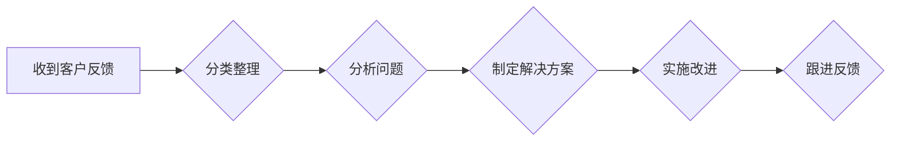

                 

## 程序员如何处理知识付费的客户反馈

> 关键词：知识付费、客户反馈、程序员、沟通技巧、问题解决、产品迭代、用户体验

## 1. 背景介绍

知识付费行业近年来蓬勃发展，程序员作为知识付费领域的优质内容提供者，通过线上课程、书籍、博客等形式分享技术经验和技能。然而，随着用户群体的扩大，如何有效处理客户反馈成为了程序员面临的重要挑战。

客户反馈是宝贵的资源，它反映了用户对课程、产品或服务的真实感受，能够帮助程序员了解用户需求、发现问题并进行改进，最终提升用户体验和产品价值。

## 2. 核心概念与联系

### 2.1  知识付费模式

知识付费模式是指知识产权所有者通过线上平台向用户提供付费学习内容，用户通过支付获得知识和技能的学习机会。

### 2.2  客户反馈机制

客户反馈机制是指程序员收集、整理和分析用户对知识付费产品的反馈信息，并根据反馈进行改进和优化。

### 2.3  反馈类型

客户反馈可以分为以下几种类型：

* **积极反馈:** 用户对课程、产品或服务表示满意，并给予肯定评价。
* **消极反馈:** 用户对课程、产品或服务表示不满，并提出改进建议。
* **建议反馈:** 用户提出新的功能需求或改进方案。
* **问题反馈:** 用户遇到课程、产品或服务使用过程中遇到的问题。

### 2.4  反馈处理流程

**Mermaid 流程图**



## 3. 核心算法原理 & 具体操作步骤

### 3.1  算法原理概述

处理客户反馈的核心算法原理是基于数据分析和问题解决。程序员需要通过收集、整理和分析客户反馈数据，识别出用户需求、问题和改进方向，并制定相应的解决方案。

### 3.2  算法步骤详解

1. **收集反馈数据:** 程序员可以通过多种方式收集客户反馈，例如在线问卷调查、评论区留言、邮件咨询、社交媒体互动等。
2. **分类整理数据:** 将收集到的反馈数据进行分类整理，例如根据反馈类型、主题、用户等级等进行分组。
3. **分析问题:** 对每个反馈类别进行深入分析，识别出用户遇到的问题、需求和改进建议。
4. **制定解决方案:** 根据分析结果，制定相应的解决方案，例如更新课程内容、修复产品bug、改进服务流程等。
5. **实施改进:** 将解决方案付诸实践，并进行测试和验证。
6. **跟进反馈:** 对改进后的产品或服务进行持续跟踪，收集用户反馈，并根据反馈进行进一步优化。

### 3.3  算法优缺点

**优点:**

* **数据驱动:** 基于数据分析，能够更准确地识别用户需求和问题。
* **迭代优化:** 通过持续收集和分析反馈，不断迭代优化产品或服务。
* **提升用户体验:** 能够有效解决用户问题，提升用户体验和满意度。

**缺点:**

* **数据量大:** 需要处理大量的反馈数据，需要强大的数据分析能力。
* **分析复杂:** 需要对用户反馈进行深入分析，识别出潜在的问题和需求。
* **实施成本:** 针对用户反馈进行改进需要投入一定的成本和时间。

### 3.4  算法应用领域

该算法广泛应用于知识付费行业，例如：

* **在线课程平台:** 处理学员对课程内容、教学方式、学习平台的反馈。
* **软件开发工具:** 处理用户对工具功能、使用体验、bug反馈的处理。
* **技术博客:** 处理读者对文章内容、写作风格、技术方案的反馈。

## 4. 数学模型和公式 & 详细讲解 & 举例说明

### 4.1  数学模型构建

可以构建一个简单的数学模型来衡量客户反馈的满意度，例如：

$$
满意度 = \frac{\text{积极反馈数}}{\text{总反馈数}}
$$

### 4.2  公式推导过程

该公式的推导过程如下：

* 设 $A$ 为积极反馈数，$B$ 为总反馈数。
* 满意度是指用户对产品或服务的满意程度，可以用积极反馈数占总反馈数的比例来表示。
* 因此，满意度公式为 $满意度 = \frac{A}{B}$。

### 4.3  案例分析与讲解

假设一个在线课程平台收到了 100 条用户反馈，其中 80 条为积极反馈，则该平台的满意度为：

$$
满意度 = \frac{80}{100} = 0.8
$$

表示用户对该平台的满意度为 80%。

## 5. 项目实践：代码实例和详细解释说明

### 5.1  开发环境搭建

使用 Python 语言和 Flask 框架搭建一个简单的客户反馈系统。

### 5.2  源代码详细实现

```python
from flask import Flask, render_template, request

app = Flask(__name__)

feedback_data = []

@app.route('/', methods=['GET', 'POST'])
def index():
    if request.method == 'POST':
        name = request.form['name']
        email = request.form['email']
        feedback = request.form['feedback']
        feedback_data.append({'name': name, 'email': email, 'feedback': feedback})
        return '感谢您的反馈！'
    else:
        return render_template('index.html')

if __name__ == '__main__':
    app.run(debug=True)
```

### 5.3  代码解读与分析

* `Flask` 框架用于构建 web 应用。
* `render_template` 函数用于渲染 HTML 模板。
* `request` 对象用于获取用户提交的数据。
* `feedback_data` 列表用于存储用户反馈信息。
* `index` 函数处理用户提交的反馈信息，并将其存储在 `feedback_data` 列表中。

### 5.4  运行结果展示

运行代码后，访问 `http://127.0.0.1:5000/`，即可看到一个简单的反馈表单。用户填写姓名、邮箱和反馈内容后提交，反馈信息将被存储在 `feedback_data` 列表中。

## 6. 实际应用场景

### 6.1  在线课程平台

程序员可以利用客户反馈系统收集学员对课程内容、教学方式、学习平台的反馈，并根据反馈进行课程更新、教学改进和平台优化。

### 6.2  软件开发工具

程序员可以收集用户对工具功能、使用体验、bug反馈，并根据反馈进行工具功能完善、bug修复和用户体验优化。

### 6.3  技术博客

程序员可以收集读者对文章内容、写作风格、技术方案的反馈，并根据反馈进行文章内容更新、写作风格调整和技术方案改进。

### 6.4  未来应用展望

随着人工智能技术的不断发展，程序员可以利用自然语言处理技术自动分析客户反馈，识别出用户需求、问题和改进方向，并自动生成解决方案，从而提高客户反馈处理效率。

## 7. 工具和资源推荐

### 7.1  学习资源推荐

* **Python 编程语言:** https://www.python.org/
* **Flask 框架:** https://flask.palletsprojects.com/en/2.2.x/
* **数据分析工具:** Pandas, NumPy, Scikit-learn

### 7.2  开发工具推荐

* **代码编辑器:** VS Code, Sublime Text
* **版本控制系统:** Git
* **云平台:** AWS, Azure, GCP

### 7.3  相关论文推荐

* **自然语言处理:** https://arxiv.org/search/?query=natural+language+processing&searchtype=all&source=header
* **客户关系管理:** https://arxiv.org/search/?query=customer+relationship+management&searchtype=all&source=header

## 8. 总结：未来发展趋势与挑战

### 8.1  研究成果总结

处理客户反馈是知识付费行业的重要环节，通过数据分析和问题解决算法，程序员可以有效收集、分析和处理客户反馈，并根据反馈进行产品和服务优化。

### 8.2  未来发展趋势

未来，人工智能技术将进一步推动客户反馈处理的自动化和智能化，程序员可以利用自然语言处理技术自动分析客户反馈，识别出用户需求、问题和改进方向，并自动生成解决方案。

### 8.3  面临的挑战

* **数据质量:** 客户反馈数据可能存在噪声和不完整性，需要进行数据清洗和预处理。
* **算法复杂度:** 针对复杂的用户反馈进行分析和处理，需要开发更 sophisticated 的算法模型。
* **隐私保护:** 处理客户反馈数据需要注重用户隐私保护，确保数据安全和合规性。

### 8.4  研究展望

未来研究方向包括：

* 开发更智能的客户反馈分析算法，能够更准确地识别用户需求和问题。
* 研究如何利用人工智能技术自动生成解决方案，提高客户反馈处理效率。
* 探索如何将客户反馈与其他数据源进行融合，获得更全面的用户洞察。

## 9. 附录：常见问题与解答

### 9.1  如何收集客户反馈？

程序员可以使用多种方式收集客户反馈，例如：

* 在线问卷调查
* 评论区留言
* 邮件咨询
* 社交媒体互动

### 9.2  如何分析客户反馈？

程序员可以使用数据分析工具对客户反馈进行分析，例如：

* 统计分析
* 主题分析
* 情感分析

### 9.3  如何处理客户反馈？

程序员需要根据分析结果，制定相应的解决方案，例如：

* 更新课程内容
* 修复产品bug
* 改进服务流程

### 9.4  如何跟进客户反馈？

程序员需要对改进后的产品或服务进行持续跟踪，收集用户反馈，并根据反馈进行进一步优化。


作者：禅与计算机程序设计艺术 / Zen and the Art of Computer Programming 
<end_of_turn>

