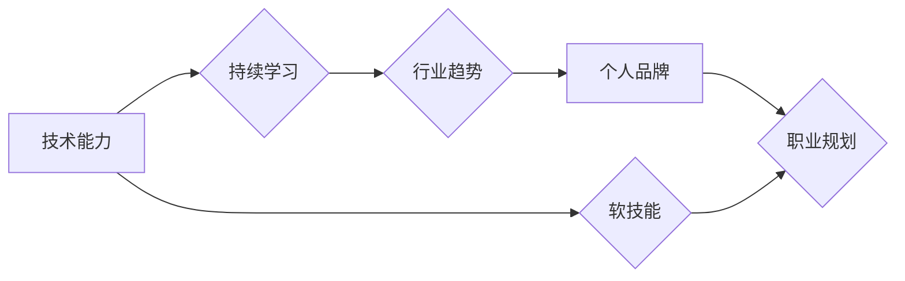

                 

## 程序员如何建立长期的职业竞争力

> 关键词：程序员职业发展、技术能力、持续学习、软技能、行业趋势、职业规划、个人品牌、项目经验、开源贡献

### 1. 背景介绍

在当今瞬息万变的科技时代，程序员的职业发展面临着前所未有的挑战和机遇。技术迭代速度飞快，新技术层出不穷，而程序员需要不断学习和提升自身技能才能保持竞争力。仅仅依靠当初学习的编程语言和框架，很难在长远的发展道路上保持优势。因此，程序员需要积极探索如何建立长期的职业竞争力，才能在激烈的市场竞争中脱颖而出。

### 2. 核心概念与联系

**2.1  技术能力与软技能的平衡**

程序员的职业竞争力主要取决于两方面：技术能力和软技能。

* **技术能力** 指的是程序员掌握的编程语言、框架、工具和技术架构等方面的知识和技能。这包括掌握主流编程语言，了解不同软件开发模式，熟悉常用的开发工具和框架，以及能够独立解决技术问题的能力。
* **软技能** 包括沟通能力、团队合作能力、问题解决能力、学习能力、时间管理能力等。这些技能对于程序员在团队合作、项目管理、客户沟通等方面至关重要。

**2.2  持续学习与行业趋势的紧密结合**

科技发展日新月异，程序员需要保持持续学习的姿态，不断更新自己的知识和技能。这不仅包括学习新的编程语言和框架，还包括关注行业趋势，了解新兴技术的发展方向，并将其应用到实际工作中。

**2.3  个人品牌建设与职业规划的整合**

在互联网时代，个人品牌建设对于程序员的职业发展至关重要。通过参与开源项目、撰写技术博客、分享学习经验等方式，程序员可以建立自己的个人品牌，提升自身的知名度和影响力。同时，需要结合自身兴趣和职业目标，制定合理的职业规划，明确未来的发展方向。

**Mermaid 流程图**



### 3. 核心算法原理 & 具体操作步骤

**3.1  算法原理概述**

算法是解决特定问题的步骤或规则，是程序员的核心技能之一。掌握多种算法的原理和应用，可以帮助程序员更高效地解决问题，编写更优化的代码。

**3.2  算法步骤详解**

例如，常见的排序算法包括冒泡排序、插入排序、快速排序等。

* **冒泡排序:** 比较相邻的两个元素，如果顺序错误则交换位置，重复此过程直到整个数组有序。
* **插入排序:** 将数组中的每个元素插入到已经排序的部分中，直到整个数组有序。
* **快速排序:** 选择一个元素作为基准，将小于基准的元素放在左边，大于基准的元素放在右边，然后递归地对左右子数组进行排序。

**3.3  算法优缺点**

不同的算法具有不同的时间复杂度和空间复杂度，在实际应用中需要根据具体情况选择合适的算法。

**3.4  算法应用领域**

算法广泛应用于各个领域，例如搜索引擎、数据分析、图像处理、机器学习等。

### 4. 数学模型和公式 & 详细讲解 & 举例说明

**4.1  数学模型构建**

数学模型可以用来描述和分析算法的性能，例如时间复杂度和空间复杂度。

**4.2  公式推导过程**

时间复杂度通常用大O符号表示，例如O(n)表示算法的时间复杂度与输入数据的大小n成正比。

**4.3  案例分析与讲解**

例如，冒泡排序的时间复杂度为O(n^2)，因为需要比较n-1次，每次比较需要O(n)的时间。

$$
T(n) = \sum_{i=1}^{n-1} i = \frac{n(n-1)}{2} = O(n^2)
$$

### 5. 项目实践：代码实例和详细解释说明

**5.1  开发环境搭建**

选择合适的编程语言和开发环境，例如Python和VS Code。

**5.2  源代码详细实现**

编写代码实现排序算法，例如冒泡排序的Python代码：

```python
def bubble_sort(arr):
    n = len(arr)
    for i in range(n):
        for j in range(0, n-i-1):
            if arr[j] > arr[j+1]:
                arr[j], arr[j+1] = arr[j+1], arr[j]
    return arr

# 测试代码
arr = [64, 34, 25, 12, 22, 11, 90]
sorted_arr = bubble_sort(arr)
print("排序后的数组:", sorted_arr)
```

**5.3  代码解读与分析**

代码解释了冒泡排序的算法步骤，包括外层循环遍历数组，内层循环比较相邻元素并交换位置。

**5.4  运行结果展示**

运行代码后，输出排序后的数组：[11, 12, 22, 25, 34, 64, 90]。

### 6. 实际应用场景

**6.1  数据排序**

排序算法广泛应用于数据排序，例如数据库查询、搜索引擎结果排序等。

**6.2  算法优化**

程序员可以使用不同的算法进行比较，选择最优的算法来提高程序的效率。

**6.3  机器学习**

机器学习算法也依赖于排序算法，例如支持向量机、决策树等。

**6.4  未来应用展望**

随着人工智能和大数据的快速发展，排序算法将在更多领域得到应用，例如推荐系统、图像识别、自然语言处理等。

### 7. 工具和资源推荐

**7.1  学习资源推荐**

* **书籍:** 《算法导论》、《编程珠玑》
* **在线课程:** Coursera、edX、Udemy
* **网站:** GeeksforGeeks、LeetCode、HackerRank

**7.2  开发工具推荐**

* **IDE:** VS Code、IntelliJ IDEA、Eclipse
* **版本控制:** Git、GitHub
* **测试工具:** pytest、JUnit

**7.3  相关论文推荐**

* **快速排序:** Hoare, C. A. R. (1962). Quicksort. Communications of the ACM, 5(10), 380-381.
* **冒泡排序:** Shell, S. (1959). A sorting algorithm. Communications of the ACM, 2(6), 303-304.

### 8. 总结：未来发展趋势与挑战

**8.1  研究成果总结**

程序员职业竞争力的建立需要技术能力和软技能的平衡，持续学习和行业趋势的紧密结合，以及个人品牌建设和职业规划的整合。

**8.2  未来发展趋势**

未来，程序员需要更加关注人工智能、大数据、云计算等新兴技术的发展，并将其应用到实际工作中。

**8.3  面临的挑战**

程序员需要不断学习新的知识和技能，才能适应快速变化的科技环境。

**8.4  研究展望**

未来研究可以更加深入地探讨程序员职业发展路径、学习方法和个人品牌建设等方面。

### 9. 附录：常见问题与解答

**9.1  如何提高技术能力？**

* 持续学习新的编程语言和框架。
* 参与开源项目，积累实践经验。
* 阅读技术书籍和博客，了解行业趋势。

**9.2  如何提升软技能？**

* 参加团队项目，锻炼沟通和合作能力。
* 学习有效的沟通技巧，提升表达能力。
* 积极参与行业活动，拓展人脉关系。


作者：禅与计算机程序设计艺术 / Zen and the Art of Computer Programming 
<end_of_turn>

