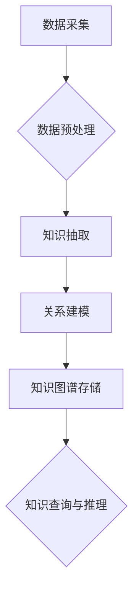

                 

## 程序员如何打造个人知识发现引擎

> 关键词：知识发现引擎、知识图谱、机器学习、自然语言处理、数据挖掘、个人学习、知识管理

## 1. 背景介绍

在当今信息爆炸的时代，程序员每天需要处理海量的信息，从技术文档到博客文章，从代码库到论坛讨论，如何高效地发现和利用这些知识成为了一个关键问题。传统的搜索引擎虽然可以帮助我们找到相关信息，但往往难以捕捉知识之间的关联性，更难以提供个性化的知识推荐。因此，打造一个属于自己的知识发现引擎，能够帮助程序员更有效地学习、工作和思考，显得尤为重要。

## 2. 核心概念与联系

知识发现引擎的核心是构建一个知识图谱，它将知识点作为节点，并将它们之间的关系作为边，形成一个网络结构。通过分析知识图谱中的结构和连接，我们可以发现知识之间的隐性关联，并根据用户的兴趣和需求，提供个性化的知识推荐。

**知识图谱构建流程:**



**核心概念:**

* **数据采集:** 从各种来源收集相关数据，例如技术文档、博客文章、代码库、论坛讨论等。
* **数据预处理:** 对收集到的数据进行清洗、格式化和转换，使其能够被后续步骤处理。
* **知识抽取:** 利用自然语言处理技术，从数据中提取知识点，例如概念、实体、关系等。
* **关系建模:** 将提取到的知识点和关系进行组织和建模，构建知识图谱的结构。
* **知识图谱存储:** 将构建好的知识图谱存储在数据库或其他存储系统中。
* **知识查询与推理:** 利用知识图谱进行查询和推理，例如根据用户查询，返回相关知识点，或根据已知知识推断新的知识。

## 3. 核心算法原理 & 具体操作步骤

### 3.1  算法原理概述

知识发现引擎的核心算法通常基于机器学习和数据挖掘技术。常见的算法包括：

* **关联规则挖掘:** 发现数据中频繁出现的项集和它们的关联关系。
* **聚类算法:** 将数据按照相似性进行分组，发现数据中的潜在结构。
* **推荐算法:** 根据用户的历史行为和偏好，预测用户可能感兴趣的知识点。

### 3.2  算法步骤详解

以关联规则挖掘为例，其具体步骤如下：

1. **数据预处理:** 对数据进行清洗、格式化和转换，例如去除停用词、转换数据类型等。
2. **频繁项集挖掘:** 使用Apriori算法或FP-Growth算法等，找出数据中频繁出现的项集。
3. **关联规则生成:** 根据频繁项集，计算支持度和置信度，生成关联规则。
4. **规则过滤:** 对生成的规则进行过滤，去除不符合特定条件的规则，例如支持度过低、置信度过低等。
5. **规则排序:** 对过滤后的规则进行排序，例如按照置信度、支持度或其他指标排序。

### 3.3  算法优缺点

**关联规则挖掘算法的优点:**

* 能够发现数据中隐藏的关联关系。
* 算法相对简单易懂。

**关联规则挖掘算法的缺点:**

* 难以处理高维数据。
* 容易产生冗余规则。

### 3.4  算法应用领域

关联规则挖掘算法广泛应用于以下领域：

* **市场营销:** 分析客户购买行为，发现商品之间的关联关系，进行精准营销。
* **推荐系统:** 根据用户的历史行为，推荐用户可能感兴趣的商品或服务。
* **医疗诊断:** 分析患者的症状和病史，发现疾病之间的关联关系，辅助医生进行诊断。

## 4. 数学模型和公式 & 详细讲解 & 举例说明

### 4.1  数学模型构建

关联规则挖掘的核心是计算支持度和置信度。

* **支持度:** 规则在数据集中的出现频率。

$$
Support(A \rightarrow B) = \frac{Count(A \cup B)}{Count(D)}
$$

其中：

* $A \rightarrow B$ 是一个关联规则。
* $Count(A \cup B)$ 是规则 $A \rightarrow B$ 在数据集 $D$ 中出现的次数。
* $Count(D)$ 是数据集 $D$ 的总记录数。

* **置信度:** 规则在满足前提条件 $A$ 的情况下，后件条件 $B$ 出现的概率。

$$
Confidence(A \rightarrow B) = \frac{Count(A \cup B)}{Count(A)}
$$

其中：

* $A \rightarrow B$ 是一个关联规则。
* $Count(A \cup B)$ 是规则 $A \rightarrow B$ 在数据集 $D$ 中出现的次数。
* $Count(A)$ 是前提条件 $A$ 在数据集 $D$ 中出现的次数。

### 4.2  公式推导过程

支持度和置信度的公式推导过程相对简单，主要基于概率论和集合论的知识。

### 4.3  案例分析与讲解

假设我们有一个数据集，包含以下交易记录：

* {苹果, 香蕉}
* {苹果, 橙子}
* {香蕉, 橙子}
* {苹果, 香蕉, 橙子}

我们可以计算以下关联规则的支持度和置信度：

* **规则:** {苹果} $\rightarrow$ {香蕉}

* **支持度:** $\frac{3}{4} = 0.75$

* **置信度:** $\frac{3}{3} = 1$

* **规则:** {香蕉} $\rightarrow$ {苹果}

* **支持度:** $\frac{3}{4} = 0.75$

* **置信度:** $\frac{3}{3} = 1$

## 5. 项目实践：代码实例和详细解释说明

### 5.1  开发环境搭建

* **操作系统:** Linux/macOS/Windows
* **编程语言:** Python
* **库依赖:** pandas, numpy, scikit-learn

### 5.2  源代码详细实现

```python
import pandas as pd
from mlxtend.frequent_patterns import apriori, association_rules

# 加载数据
data = pd.read_csv('transactions.csv')

# 数据预处理
# ...

# 频繁项集挖掘
frequent_itemsets = apriori(data, min_support=0.2, use_colnames=True)

# 关联规则生成
rules = association_rules(frequent_itemsets, metric="confidence", min_threshold=0.8)

# 打印规则
print(rules)
```

### 5.3  代码解读与分析

* **数据加载:** 使用 pandas 库加载数据，数据格式为 CSV 文件。
* **数据预处理:** 对数据进行清洗、格式化和转换，例如去除停用词、转换数据类型等。
* **频繁项集挖掘:** 使用 mlxtend 库中的 apriori 函数，挖掘频繁项集，参数 `min_support` 设置了支持度的阈值。
* **关联规则生成:** 使用 mlxtend 库中的 association_rules 函数，生成关联规则，参数 `metric` 设置了置信度作为评估指标，参数 `min_threshold` 设置了置信度的阈值。
* **规则打印:** 打印生成的关联规则。

### 5.4  运行结果展示

运行代码后，会输出一个包含关联规则的 DataFrame，其中包含规则、支持度、置信度等信息。

## 6. 实际应用场景

知识发现引擎可以应用于以下场景：

* **程序员学习:** 自动发现程序员感兴趣的知识点，提供个性化的学习推荐。
* **代码搜索:** 基于知识图谱，实现更智能的代码搜索，例如根据代码功能或语义进行搜索。
* **代码生成:** 利用知识图谱中的代码片段和关系，辅助程序员进行代码生成。
* **问题解决:** 根据用户提出的问题，自动从知识图谱中找到相关解决方案。

### 6.4  未来应用展望

未来，知识发现引擎将更加智能化和个性化，能够更好地理解用户的需求，提供更精准的知识推荐和服务。

## 7. 工具和资源推荐

### 7.1  学习资源推荐

* **书籍:**
    * 《数据挖掘：概念与技术》
    * 《机器学习》
    * 《自然语言处理》
* **在线课程:**
    * Coursera: 数据挖掘
    * edX: 机器学习
    * Udacity: 自然语言处理

### 7.2  开发工具推荐

* **Python:** 强大的编程语言，广泛应用于数据挖掘和机器学习领域。
* **pandas:** 用于数据分析和处理的 Python 库。
* **scikit-learn:** 用于机器学习的 Python 库。
* **mlxtend:** 用于数据挖掘的 Python 库。

### 7.3  相关论文推荐

* **Association Rule Mining: A Data Mining Task**
* **Knowledge Graph Embedding: A Survey**
* **Deep Learning for Natural Language Processing**

## 8. 总结：未来发展趋势与挑战

### 8.1  研究成果总结

知识发现引擎的研究取得了显著进展，能够有效地发现数据中的知识关联，并提供个性化的知识推荐。

### 8.2  未来发展趋势

未来，知识发现引擎将朝着以下方向发展：

* **更加智能化:** 利用深度学习等先进算法，提高知识发现引擎的智能化水平。
* **更加个性化:** 基于用户的行为和偏好，提供更加个性化的知识推荐。
* **更加跨领域:** 将知识发现引擎应用于更多领域，例如医疗、金融、教育等。

### 8.3  面临的挑战

知识发现引擎也面临一些挑战：

* **数据质量:** 知识发现引擎的性能依赖于数据质量，如何处理不完整、不一致的数据是一个难题。
* **知识表示:** 如何更好地表示知识，使其能够被机器理解和利用，是一个关键问题。
* **可解释性:** 知识发现引擎的决策过程往往难以解释，如何提高其可解释性，增强用户信任，是一个重要的研究方向。

### 8.4  研究展望

未来，我们将继续致力于知识发现引擎的研究，探索更智能、更个性化、更跨领域的知识发现方法，为程序员和其他用户提供更强大的知识服务。

## 9. 附录：常见问题与解答

* **Q1: 如何选择合适的算法？**

* **A1:** 选择算法需要根据具体的数据特点和应用场景进行考虑。例如，对于事务型数据，关联规则挖掘算法效果较好；对于文本数据，自然语言处理算法效果较好。

* **Q2: 如何评估知识发现引擎的性能？**

* **A2:** 常见的评估指标包括支持度、置信度、准确率、召回率等。

* **Q3: 如何处理高维数据？**

* **A3:** 处理高维数据可以使用 dimensionality reduction 技术，例如 PCA 或 LDA。


作者：禅与计算机程序设计艺术 / Zen and the Art of Computer Programming 
<end_of_turn>

