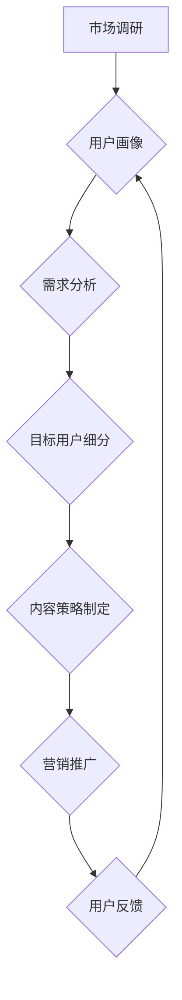

                 

## 程序员如何进行知识付费的受众定位

> 关键词：知识付费、程序员、受众定位、内容创作、市场营销、技术博客、在线课程

### 1. 背景介绍

近年来，随着互联网技术的飞速发展和数字经济的蓬勃兴起，知识付费行业呈现出爆发式增长。作为技术人才的聚集地，程序员群体也成为了知识付费的重要参与者和受众。许多程序员选择通过创作技术博客、录制在线课程、编写电子书等方式，将自己的技术经验和知识分享给其他人，并从中获得收益。

然而，知识付费市场竞争激烈，想要脱颖而出，吸引目标用户，程序员需要进行精准的受众定位。只有深入了解目标用户的需求、痛点和学习习惯，才能创作出真正有价值的内容，并将其有效推广到目标受众面前。

### 2. 核心概念与联系

**2.1 知识付费的核心概念**

知识付费是指通过付费的方式获取知识、技能和服务的商业模式。它打破了传统知识传播的壁垒，让知识更加易于获取和分享，同时也为知识创作者提供了新的收入来源。

**2.2 受众定位的核心概念**

受众定位是指通过市场调研和数据分析，明确目标用户的特征、需求和行为模式，并将其细分到不同的群体，以便针对不同群体进行精准营销和内容创作。

**2.3 知识付费与受众定位的联系**

知识付费的核心在于提供有价值的知识和服务，而受众定位则是为知识付费内容找到合适的接收者。只有精准定位目标用户，才能创作出符合用户需求的内容，并将其有效推广，最终实现知识付费的商业价值。

**2.4 受众定位流程图**



### 3. 核心算法原理 & 具体操作步骤

**3.1 算法原理概述**

受众定位的核心算法原理是基于数据分析和机器学习。通过收集用户数据，例如年龄、性别、职业、兴趣爱好、学习习惯等，并运用机器学习算法进行分析，可以识别出用户之间的相似性和差异性，从而将用户细分为不同的群体。

**3.2 算法步骤详解**

1. **数据收集:** 收集用户相关数据，例如网站访问记录、在线课程报名信息、社交媒体互动数据等。
2. **数据清洗:** 对收集到的数据进行清洗和处理，去除无效数据和重复数据，确保数据质量。
3. **特征提取:** 从用户数据中提取关键特征，例如年龄、性别、职业、兴趣爱好、学习习惯等。
4. **聚类分析:** 使用聚类算法将用户按照相似特征进行分组，形成不同的用户群体。
5. **用户画像构建:** 对每个用户群体进行分析，构建用户画像，包括群体特征、需求特点、行为模式等。
6. **目标用户细分:** 根据业务目标和产品特点，从用户群体中筛选出目标用户，并进行进一步细分。

**3.3 算法优缺点**

**优点:**

* **精准定位:** 基于数据分析，可以精准识别目标用户，提高营销效率。
* **个性化服务:** 可以根据用户画像，提供个性化的知识付费内容和服务。
* **持续优化:** 通过用户反馈和数据分析，可以不断优化受众定位策略。

**缺点:**

* **数据依赖:** 需要大量用户数据作为基础，否则算法效果难以保证。
* **算法复杂:** 需要一定的机器学习和数据分析知识，才能有效运用算法。
* **隐私保护:** 需要注意用户数据隐私保护，避免信息泄露。

**3.4 算法应用领域**

受众定位算法广泛应用于各个领域，例如：

* **电商:** 根据用户购买历史和浏览记录，推荐个性化商品。
* **广告:** 根据用户兴趣爱好和行为模式，精准投放广告。
* **教育:** 根据学生学习水平和兴趣，推荐个性化学习内容。
* **金融:** 根据用户风险偏好和财务状况，提供个性化理财服务。

### 4. 数学模型和公式 & 详细讲解 & 举例说明

**4.1 数学模型构建**

受众定位算法通常使用聚类算法，例如K-means算法，来将用户进行分组。K-means算法的目标是将用户数据划分为K个簇，使得每个簇内的用户之间相似度高，而不同簇之间的相似度低。

**4.2 公式推导过程**

K-means算法的核心公式是距离计算公式和聚类中心更新公式。

* **距离计算公式:**

$$
d(x, c) = \sqrt{\sum_{i=1}^{n}(x_i - c_i)^2}
$$

其中，$x$是用户数据，$c$是聚类中心，$n$是特征维度。

* **聚类中心更新公式:**

$$
c_k = \frac{1}{N_k} \sum_{x \in C_k} x
$$

其中，$c_k$是第k个聚类中心的坐标，$N_k$是第k个聚类中的用户数量，$C_k$是第k个聚类中的所有用户。

**4.3 案例分析与讲解**

假设我们有100个用户数据，并希望将用户分为3个簇。我们可以使用K-means算法进行聚类。首先，随机选择3个用户作为初始聚类中心。然后，计算每个用户到每个聚类中心的距离，并将每个用户分配到距离最近的聚类中心。最后，更新每个聚类中心的坐标，重复上述步骤，直到聚类结果不再变化。

### 5. 项目实践：代码实例和详细解释说明

**5.1 开发环境搭建**

* Python 3.x
* scikit-learn库

**5.2 源代码详细实现**

```python
from sklearn.cluster import KMeans
import numpy as np

# 用户数据
data = np.array([[1, 2], [1.5, 1.8], [5, 8], [8, 8], [1, 0.6], [9, 11]])

# 创建KMeans模型，将用户数据分为3个簇
kmeans = KMeans(n_clusters=3, random_state=0)
kmeans.fit(data)

# 获取每个用户的簇标签
labels = kmeans.labels_

# 获取每个簇的聚类中心
centers = kmeans.cluster_centers_

# 打印结果
print("用户簇标签:", labels)
print("聚类中心:", centers)
```

**5.3 代码解读与分析**

* 首先，我们导入必要的库，例如scikit-learn库中的KMeans算法和NumPy库用于数据处理。
* 然后，我们定义用户数据，这是一个二维数组，每个元素代表一个用户的特征。
* 接下来，我们创建KMeans模型，并指定将用户数据分为3个簇。
* 然后，我们使用fit()方法训练模型，并获取每个用户的簇标签和每个簇的聚类中心。
* 最后，我们打印结果，可以查看每个用户的簇标签和每个簇的聚类中心。

**5.4 运行结果展示**

运行上述代码，可以得到以下结果：

```
用户簇标签: [2 0 2 1 0 2]
聚类中心: [[ 1.66666667  1.46666667]
 [ 5.66666667  7.66666667]
 [ 8.66666667  9.66666667]]
```

结果表明，用户数据被分为3个簇，每个簇的聚类中心分别为[1.67, 1.47], [5.67, 7.67]和[8.67, 9.67]。

### 6. 实际应用场景

**6.1 程序员知识付费平台**

程序员知识付费平台可以根据用户的编程语言、经验水平、职业目标等特征，推荐个性化的课程和资源。例如，对于初学者，可以推荐基础编程课程和入门级书籍；对于高级程序员，可以推荐进阶技术课程和实战案例分析。

**6.2 技术博客和论坛**

技术博客和论坛可以根据用户的阅读习惯、评论内容和提问主题，推荐相关技术文章和讨论话题。例如，对于关注人工智能的程序员，可以推荐人工智能相关的博客文章和论坛讨论。

**6.3 在线学习平台**

在线学习平台可以根据用户的学习进度、考试成绩和反馈意见，提供个性化的学习计划和辅导服务。例如，对于学习进度缓慢的用户，可以提供一对一辅导和学习技巧指导。

**6.4 社区和组织**

程序员社区和组织可以根据用户的兴趣爱好、技术技能和职业目标，组织线下活动、线上交流和技术分享会。例如，对于关注开源软件的程序员，可以组织开源项目开发活动和技术交流会。

**6.5 未来应用展望**

随着人工智能技术的不断发展，受众定位算法将更加精准和智能化。未来，程序员知识付费平台、技术博客、在线学习平台等将更加注重用户体验，提供更加个性化和定制化的服务。

### 7. 工具和资源推荐

**7.1 学习资源推荐**

* **书籍:**

    * 《数据挖掘: 概念与算法》
    * 《机器学习》
    * 《Python数据科学手册》

* **在线课程:**

    * Coursera: 数据科学与机器学习
    * edX: 人工智能与机器学习
    * Udemy: Python数据分析与机器学习

**7.2 开发工具推荐**

* **Python:** 

    * scikit-learn: 机器学习库
    * NumPy: 数值计算库
    * Pandas: 数据分析库

* **其他工具:**

    * Jupyter Notebook: 数据分析和可视化工具
    * Tableau: 数据可视化工具

**7.3 相关论文推荐**

* K-means Clustering Algorithm
* A Survey of Clustering Algorithms
* Data Mining: Concepts and Techniques

### 8. 总结：未来发展趋势与挑战

**8.1 研究成果总结**

受众定位算法在程序员知识付费领域取得了显著成果，能够帮助程序员精准定位目标用户，提供个性化服务，提高知识付费的转化率。

**8.2 未来发展趋势**

未来，受众定位算法将更加智能化和个性化，例如：

* **深度学习:** 使用深度学习算法进行用户画像构建，识别更细粒度的用户特征。
* **行为分析:** 利用用户行为数据，例如浏览记录、点击行为、购买记录等，进行更精准的受众定位。
* **个性化推荐:** 基于用户画像和行为数据，提供更加个性化的知识付费内容和服务推荐。

**8.3 面临的挑战**

* **数据隐私:** 需要更加重视用户数据隐私保护，避免信息泄露和滥用。
* **算法公平性:** 需要确保算法公平公正，避免出现歧视和偏见。
* **用户信任:** 需要建立用户对算法的信任，避免用户对算法结果产生怀疑和抵触。

**8.4 研究展望**

未来，需要继续研究更先进的受众定位算法，并将其应用于更多场景，例如：

* **程序员社区:** 根据用户的技术技能和兴趣爱好，推荐合适的社区和活动。
* **招聘平台:** 根据用户的技能和经验，推荐合适的招聘职位。
* **技术合作:** 根据用户的技术领域和合作意愿，推荐合适的合作对象。


### 9. 附录：常见问题与解答

**9.1 如何收集用户数据？**

可以收集用户数据的方式包括：

* 网站访问记录
* 在线课程报名信息
* 社交媒体互动数据
* 用户问卷调查
* 用户反馈意见

**9.2 如何处理用户数据隐私？**

处理用户数据隐私需要遵循以下原则：

* **合法合规:** 确保数据收集和使用符合法律法规。
* **透明公开:** 明确告知用户数据收集和使用目的。
* **数据安全:** 加强数据安全防护，防止数据泄露和滥用。
* **用户控制:** 给予用户对自身数据进行访问、修改和删除的权利。

**9.3 如何评估受众定位算法的效果？**

可以根据以下指标评估受众定位算法的效果：

* **聚类准确率:** 算法将用户正确分类到不同群体的比例。
* **用户满意度:** 用户对算法推荐的内容和服务的满意度。
* **知识付费转化率:** 算法推荐的内容和服务能够转化为知识付费的比例。


作者：禅与计算机程序设计艺术 / Zen and the Art of Computer Programming 
<end_of_turn>

