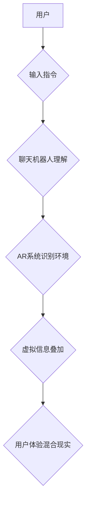

                 

## 聊天机器人增强现实：混合互动体验

> 关键词：聊天机器人、增强现实、混合现实、自然语言处理、计算机视觉、交互体验、人工智能、用户体验

## 1. 背景介绍

增强现实（AR）技术近年来发展迅速，它通过叠加虚拟信息到现实世界中，为用户提供了一种全新的交互体验。从游戏到教育，从购物到医疗，AR技术正在改变着我们生活的方方面面。而聊天机器人作为一种能够理解和响应人类语言的智能系统，正在逐渐成为AR体验的重要组成部分。

结合聊天机器人和AR技术的优势，我们可以构建出更具沉浸性和交互性的混合现实体验。例如，用户可以通过与AR聊天机器人进行对话，获取关于周围环境的信息，完成任务，甚至与虚拟角色进行互动。这种混合互动体验将为用户带来更丰富、更直观、更便捷的体验。

## 2. 核心概念与联系

### 2.1 增强现实（AR）

增强现实（AR）是一种叠加虚拟信息到现实世界中，为用户提供增强现实体验的技术。AR系统通常利用摄像头、传感器和计算机视觉算法，识别现实世界中的物体和场景，然后将虚拟信息（例如图像、视频、音频等）叠加到现实世界中，从而为用户提供一种混合的现实体验。

### 2.2 聊天机器人

聊天机器人是一种能够理解和响应人类语言的智能系统。它通常基于自然语言处理（NLP）技术，能够识别用户的意图，并生成相应的回复。聊天机器人可以用于各种场景，例如客服、教育、娱乐等。

### 2.3 混合现实（MR）

混合现实（MR）是一种将虚拟现实（VR）和增强现实（AR）技术融合在一起的技术。MR系统能够创建出更加沉浸式的体验，用户可以在虚拟世界中与现实世界进行交互。

**核心概念与联系流程图**



## 3. 核心算法原理 & 具体操作步骤

### 3.1 算法原理概述

聊天机器人增强现实系统的核心算法主要包括自然语言处理（NLP）、计算机视觉（CV）和混合现实（MR）技术。

* **自然语言处理（NLP）:** 用于理解用户的自然语言输入，识别用户的意图和实体，并生成相应的回复。
* **计算机视觉（CV）:** 用于识别现实世界中的物体和场景，并将其与虚拟信息进行融合。
* **混合现实（MR）:** 用于将虚拟信息叠加到现实世界中，并提供用户交互的接口。

### 3.2 算法步骤详解

1. **用户输入:** 用户通过语音或文本输入指令给聊天机器人。
2. **自然语言理解:** 聊天机器人使用NLP算法分析用户的输入，识别用户的意图和实体。
3. **环境识别:** AR系统使用CV算法识别用户的周围环境，例如物体、场景、位置等。
4. **虚拟信息生成:** 根据用户的意图和环境信息，聊天机器人生成相应的虚拟信息，例如图像、视频、音频等。
5. **虚拟信息叠加:** AR系统将虚拟信息叠加到用户的现实世界视图中，形成混合现实体验。
6. **用户交互:** 用户可以通过语音、手势或其他方式与虚拟信息进行交互。
7. **反馈循环:** 聊天机器人根据用户的交互反馈，更新其理解和生成虚拟信息的策略。

### 3.3 算法优缺点

**优点:**

* **沉浸式体验:** 结合AR和聊天机器人的优势，可以为用户提供更加沉浸式的体验。
* **交互性增强:** 用户可以通过与虚拟角色进行对话，完成任务，从而增强交互体验。
* **信息获取便捷:** 用户可以通过与聊天机器人对话，获取关于周围环境的信息，更加便捷。

**缺点:**

* **技术复杂:** 结合AR和聊天机器人的技术难度较高，需要整合多种技术，例如NLP、CV、MR等。
* **计算资源需求:** AR体验需要大量的计算资源，可能会导致设备性能下降。
* **隐私安全问题:** AR系统需要访问用户的摄像头和传感器数据，可能会引发隐私安全问题。

### 3.4 算法应用领域

* **教育:** AR聊天机器人可以为学生提供个性化的学习体验，例如虚拟实验室、互动式教学等。
* **医疗:** AR聊天机器人可以帮助医生进行远程诊断、手术指导等。
* **零售:** AR聊天机器人可以为顾客提供虚拟试衣、商品推荐等服务。
* **旅游:** AR聊天机器人可以为游客提供虚拟导游、景点信息等服务。

## 4. 数学模型和公式 & 详细讲解 & 举例说明

### 4.1 数学模型构建

聊天机器人增强现实系统的数学模型主要包括以下几个方面：

* **自然语言理解模型:** 使用统计语言模型（如n-gram模型）或深度学习模型（如Transformer）来预测用户的意图和实体。
* **计算机视觉模型:** 使用卷积神经网络（CNN）来识别现实世界中的物体和场景。
* **混合现实渲染模型:** 使用3D图形渲染技术将虚拟信息叠加到现实世界视图中。

### 4.2 公式推导过程

* **自然语言理解模型:**

一个简单的n-gram模型可以用来预测下一个词的概率，公式如下：

$$P(w_i|w_{i-n+1},...,w_{i-1})$$

其中，$w_i$是当前词，$w_{i-n+1},...,w_{i-1}$是前n-1个词。

* **计算机视觉模型:**

CNN模型通过多个卷积层和池化层来提取图像特征，最终输出物体分类或定位的结果。

### 4.3 案例分析与讲解

**案例:**

假设用户输入“我想看看附近的咖啡馆”，聊天机器人可以使用自然语言理解模型识别用户的意图是“查找咖啡馆”，并使用计算机视觉模型识别用户的周围环境。然后，聊天机器人可以从数据库中获取附近的咖啡馆信息，并将其以虚拟信息的形式叠加到用户的现实世界视图中，例如在地图上标注咖啡馆的位置，或者在用户的视野中显示咖啡馆的名称和评分。

## 5. 项目实践：代码实例和详细解释说明

### 5.1 开发环境搭建

* **操作系统:** Windows、macOS、Linux
* **编程语言:** Python
* **框架:** TensorFlow、PyTorch
* **AR库:** ARKit、ARCore
* **聊天机器人库:** Rasa、Dialogflow

### 5.2 源代码详细实现

```python
# 导入必要的库
import tensorflow as tf
from tensorflow.keras.models import Sequential
from tensorflow.keras.layers import Dense, Embedding, LSTM

# 定义聊天机器人模型
model = Sequential()
model.add(Embedding(input_dim=10000, output_dim=128))
model.add(LSTM(units=64))
model.add(Dense(units=10, activation='softmax'))

# 训练聊天机器人模型
# ...

# 定义AR渲染函数
def render_ar_scene(user_input):
    # 使用计算机视觉模型识别环境
    # ...
    # 根据用户输入生成虚拟信息
    # ...
    # 将虚拟信息叠加到现实世界视图中
    # ...

# 主程序
if __name__ == "__main__":
    # 获取用户输入
    user_input = input("请输入您的指令: ")
    # 使用聊天机器人模型处理用户输入
    predicted_intent = model.predict(user_input)
    # 根据预测意图渲染AR场景
    render_ar_scene(user_input)
```

### 5.3 代码解读与分析

* **聊天机器人模型:** 使用了深度学习模型（LSTM）来处理用户的自然语言输入，并预测用户的意图。
* **AR渲染函数:** 使用计算机视觉模型识别环境，根据用户的意图生成虚拟信息，并将其叠加到现实世界视图中。
* **主程序:** 获取用户的输入，使用聊天机器人模型处理输入，并调用AR渲染函数渲染AR场景。

### 5.4 运行结果展示

运行该程序后，用户可以输入指令，例如“我想看看附近的咖啡馆”，聊天机器人会识别用户的意图，并使用AR技术将附近的咖啡馆信息叠加到用户的现实世界视图中。

## 6. 实际应用场景

### 6.1 教育

* **虚拟实验室:** 学生可以通过与AR聊天机器人互动，进行虚拟实验，例如模拟化学反应、解剖人体等。
* **互动式教学:** 老师可以使用AR聊天机器人创建互动式教学内容，例如虚拟游览、角色扮演等，提高学生的学习兴趣和参与度。

### 6.2 医疗

* **远程诊断:** 医生可以通过AR聊天机器人远程查看患者的病历、影像资料等，并进行诊断。
* **手术指导:** 医生可以使用AR聊天机器人进行手术指导，例如显示手术步骤、提供实时反馈等。

### 6.3 零售

* **虚拟试衣:** 顾客可以通过AR聊天机器人虚拟试穿衣服，选择合适的款式和尺寸。
* **商品推荐:** 顾客可以通过与AR聊天机器人对话，获取商品推荐，例如根据用户的喜好和需求推荐商品。

### 6.4 未来应用展望

* **个性化体验:** 聊天机器人增强现实系统可以根据用户的个人喜好和需求，提供更加个性化的体验。
* **沉浸式娱乐:** AR聊天机器人可以为用户提供更加沉浸式的娱乐体验，例如虚拟游戏、虚拟演唱会等。
* **增强现实社交:** AR聊天机器人可以帮助用户进行更加丰富和有趣的社交互动，例如虚拟聚会、虚拟旅行等。

## 7. 工具和资源推荐

### 7.1 学习资源推荐

* **书籍:**
    * 《深度学习》
    * 《自然语言处理》
    * 《增强现实技术》
* **在线课程:**
    * Coursera
    * edX
    * Udacity

### 7.2 开发工具推荐

* **编程语言:** Python
* **框架:** TensorFlow、PyTorch
* **AR库:** ARKit、ARCore
* **聊天机器人库:** Rasa、Dialogflow

### 7.3 相关论文推荐

* **自然语言处理:**
    * Attention Is All You Need
    * BERT: Pre-training of Deep Bidirectional Transformers for Language Understanding
* **计算机视觉:**
    * AlexNet
    * ResNet
* **增强现实:**
    * A Survey of Augmented Reality
    * Augmented Reality for Education: A Systematic Review

## 8. 总结：未来发展趋势与挑战

### 8.1 研究成果总结

聊天机器人增强现实技术近年来取得了显著的进展，在教育、医疗、零售等领域展现出巨大的应用潜力。

### 8.2 未来发展趋势

* **更智能的聊天机器人:** 未来聊天机器人将更加智能，能够更好地理解用户的意图和需求，提供更加个性化的服务。
* **更沉浸式的AR体验:** 未来AR体验将更加沉浸式，用户能够更加真实地与虚拟世界互动。
* **更广泛的应用场景:** 聊天机器人增强现实技术将应用到更多领域，例如工业、交通、娱乐等。

### 8.3 面临的挑战

* **技术复杂性:** 结合AR和聊天机器人的技术难度较高，需要整合多种技术，例如NLP、CV、MR等。
* **计算资源需求:** AR体验需要大量的计算资源，可能会导致设备性能下降。
* **隐私安全问题:** AR系统需要访问用户的摄像头和传感器数据，可能会引发隐私安全问题。

### 8.4 研究展望

未来，我们将继续研究聊天机器人增强现实技术的核心算法，开发更加智能、更加沉浸式的AR体验，并探索其在更多领域的应用。


## 9. 附录：常见问题与解答

**Q1: 聊天机器人增强现实技术与虚拟现实技术有什么区别？**

**A1:** 聊天机器人增强现实技术将虚拟信息叠加到现实世界中，而虚拟现实技术则将用户完全沉浸到虚拟世界中。

**Q2: 聊天机器人增强现实技术有哪些应用场景？**

**A2:** 聊天机器人增强现实技术可以应用于教育、医疗、零售、工业、交通、娱乐等多个领域。

**Q3: 聊天机器人增强现实技术有哪些挑战？**

**A3:** 聊天机器人增强现实技术面临的技术挑战包括技术复杂性、计算资源需求和隐私安全问题。


作者：禅与计算机程序设计艺术 / Zen and the Art of Computer Programming 
<end_of_turn>

