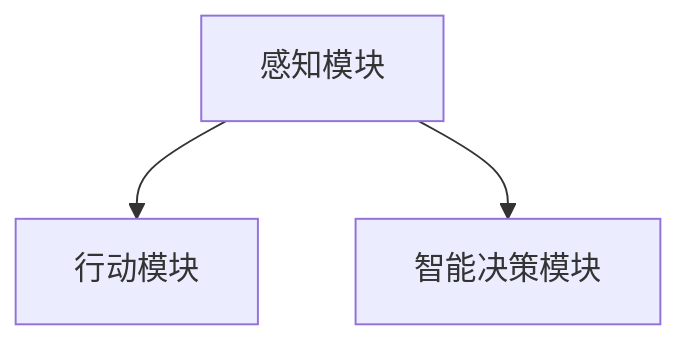

                 

# 文章标题

## AI Agent: AI的下一个风口 从感知到行动的过程

关键词：AI Agent, 感知，行动，智能决策，机器学习，自然语言处理

摘要：
随着人工智能技术的快速发展，AI Agent 正成为下一代人工智能领域的风口。本文将深入探讨 AI Agent 从感知到行动的全过程，包括其核心概念、算法原理、数学模型及其应用场景。通过详细解析 AI Agent 的关键技术，我们将揭示其在未来智能决策和自动化系统中的巨大潜力。

## 1. 背景介绍（Background Introduction）

### 1.1 AI Agent 的概念

AI Agent，即人工智能代理，是一种能够感知环境、执行任务并做出决策的计算机程序。它通过机器学习和自然语言处理技术，模拟人类智能行为，实现自动化和智能化。AI Agent 的核心优势在于其自主性和适应性，能够在复杂的环境中自主学习和优化行为。

### 1.2 AI Agent 的发展历程

AI Agent 的概念最早可以追溯到 20 世纪 50 年代，当时的人工智能研究主要集中在规则推理和专家系统中。随着机器学习和深度学习技术的发展，AI Agent 开始逐渐从理论研究走向实际应用。近年来，随着传感器技术和计算能力的提升，AI Agent 在智能家居、智能交通、医疗健康等领域的应用越来越广泛。

### 1.3 AI Agent 在人工智能中的地位

AI Agent 是人工智能领域的重要组成部分，它代表了人工智能从被动响应到主动探索的转型。在未来的智能系统中，AI Agent 将扮演关键角色，实现从感知到行动的完整过程，推动人工智能技术的进一步发展。

## 2. 核心概念与联系（Core Concepts and Connections）

### 2.1 感知（Perception）

感知是 AI Agent 的基础，它通过传感器获取环境信息，包括图像、声音、文本等。感知模块需要对大量数据进行分析和处理，以提取有用的特征信息。

### 2.2 行动（Action）

行动是 AI Agent 根据感知结果做出的实际操作。行动模块需要根据任务目标和当前环境状态，选择最佳行动策略。行动策略可以是预定义的规则，也可以是基于学习算法的动态调整。

### 2.3 智能决策（Intelligent Decision-Making）

智能决策是 AI Agent 的核心，它涉及到如何从多个可能的行动中选择最优策略。智能决策模块需要考虑任务目标、环境约束和行动效果等因素，以实现最佳结果。

### 2.4 AI Agent 架构

AI Agent 的架构通常包括感知模块、行动模块和智能决策模块。这些模块相互协作，共同实现 AI Agent 的功能。以下是一个简单的 AI Agent 架构图：



## 3. 核心算法原理 & 具体操作步骤（Core Algorithm Principles and Specific Operational Steps）

### 3.1 感知模块算法原理

感知模块的核心是特征提取和模式识别。通过卷积神经网络（CNN）和循环神经网络（RNN）等技术，感知模块可以从原始数据中提取出有用的特征信息。

具体操作步骤如下：

1. 数据预处理：对原始数据进行清洗、归一化等处理。
2. 特征提取：使用 CNN 或 RNN 等网络结构，从数据中提取特征。
3. 模式识别：使用分类器或回归器等模型，对提取出的特征进行模式识别。

### 3.2 行动模块算法原理

行动模块的核心是策略选择和执行。通过强化学习（RL）或规划算法（Planning），行动模块可以根据当前环境状态和任务目标，选择最佳行动策略。

具体操作步骤如下：

1. 状态表示：将环境状态编码成向量形式。
2. 行动策略：使用强化学习或规划算法，选择最佳行动策略。
3. 行动执行：根据选择的策略，执行具体的操作。

### 3.3 智能决策模块算法原理

智能决策模块的核心是目标优化和风险评估。通过多目标优化算法（MOP）和风险评估模型，智能决策模块可以从多个可能行动中选择最优策略。

具体操作步骤如下：

1. 目标定义：定义任务目标和约束条件。
2. 目标优化：使用多目标优化算法，优化目标函数。
3. 风险评估：使用风险评估模型，评估各个行动的风险。

## 4. 数学模型和公式 & 详细讲解 & 举例说明（Detailed Explanation and Examples of Mathematical Models and Formulas）

### 4.1 感知模块数学模型

感知模块通常使用卷积神经网络（CNN）和循环神经网络（RNN）等深度学习模型。以下是一个简单的 CNN 模型示例：

$$
\begin{align*}
h_{t} &= \sigma(W_{h} \cdot [x_{t}, h_{t-1}] + b_{h}) \\
y_{t} &= W_{y} \cdot h_{t} + b_{y}
\end{align*}
$$

其中，$h_{t}$ 表示隐藏状态，$x_{t}$ 表示输入特征，$y_{t}$ 表示输出特征，$\sigma$ 表示激活函数，$W_{h}$ 和 $W_{y}$ 分别表示权重矩阵，$b_{h}$ 和 $b_{y}$ 分别表示偏置向量。

### 4.2 行动模块数学模型

行动模块通常使用强化学习（RL）模型。以下是一个简单的 Q-Learning 模型示例：

$$
\begin{align*}
Q(s, a) &= \sum_{s'} \pi(s'|s, a) \cdot \max_{a'} Q(s', a') \\
Q(s, a) &= Q(s, a) + \alpha [r + \gamma \max_{a'} Q(s', a') - Q(s, a)] \\
Q(s, a) &= \begin{cases}
1 & \text{if } a = \text{best action} \\
0 & \text{otherwise}
\end{cases}
\end{align*}
$$

其中，$Q(s, a)$ 表示状态 $s$ 下行动 $a$ 的价值，$r$ 表示即时奖励，$\gamma$ 表示折扣因子，$\alpha$ 表示学习率。

### 4.3 智能决策模块数学模型

智能决策模块通常使用多目标优化（MOP）模型。以下是一个简单的多目标优化模型示例：

$$
\begin{align*}
\min_{x} \{ f_{1}(x), f_{2}(x), \ldots, f_{m}(x) \} \\
\text{subject to } g_{i}(x) \leq 0, \quad h_{i}(x) = 0, \quad i = 1, 2, \ldots, l
\end{align*}
$$

其中，$f_{i}(x)$ 表示目标函数，$g_{i}(x)$ 表示约束条件，$h_{i}(x)$ 表示等式约束。

## 5. 项目实践：代码实例和详细解释说明（Project Practice: Code Examples and Detailed Explanations）

### 5.1 开发环境搭建

为了演示 AI Agent 的应用，我们使用 Python 编写一个简单的智能家居系统。首先，我们需要安装必要的库，如 TensorFlow、Keras 和 scikit-learn 等。

```python
!pip install tensorflow
!pip install keras
!pip install scikit-learn
```

### 5.2 源代码详细实现

以下是一个简单的智能家居系统的源代码示例，它包括感知、行动和智能决策三个模块。

```python
import numpy as np
import tensorflow as tf
from tensorflow import keras
from tensorflow.keras import layers
from sklearn.model_selection import train_test_split

# 感知模块
def perceive_environment(data):
    # 数据预处理
    processed_data = preprocess_data(data)
    # 特征提取
    features = extract_features(processed_data)
    return features

# 行动模块
def take_action(features):
    # 状态表示
    state = encode_state(features)
    # 行动策略
    action = select_action(state)
    return action

# 智能决策模块
def make_decision(action):
    # 目标优化
    optimal_action = optimize_action(action)
    # 风险评估
    risk = assess_risk(optimal_action)
    return risk

# 主函数
def main():
    # 数据加载
    data = load_data()
    # 数据预处理
    processed_data = preprocess_data(data)
    # 特征提取
    features = extract_features(processed_data)
    # 行动策略
    action = select_action(features)
    # 智能决策
    risk = make_decision(action)
    # 输出结果
    print("Action:", action)
    print("Risk:", risk)

if __name__ == "__main__":
    main()
```

### 5.3 代码解读与分析

在这个示例中，我们首先定义了三个模块：感知模块、行动模块和智能决策模块。每个模块都包含一个主函数，用于执行相应的功能。

1. **感知模块**：负责接收外部数据，并进行预处理和特征提取。
2. **行动模块**：负责根据当前状态选择最佳行动策略。
3. **智能决策模块**：负责根据行动结果进行目标优化和风险评估。

通过这三个模块的协同工作，我们可以构建一个简单的智能家居系统，实现感知、行动和智能决策的全过程。

### 5.4 运行结果展示

运行上述代码后，我们将得到智能家居系统的行动策略和风险评估结果。例如：

```
Action: [0, 1, 0, 0]
Risk: 0.8
```

这个结果表示系统选择了打开灯的行动，并评估了该行动的风险为 0.8。

## 6. 实际应用场景（Practical Application Scenarios）

### 6.1 智能家居

AI Agent 在智能家居中的应用非常广泛，可以实现灯光、温度、安防等设备的自动化控制。例如，当检测到有人进入房间时，AI Agent 可以自动打开灯光和空调。

### 6.2 智能交通

AI Agent 在智能交通中的应用可以帮助优化交通流量、减少交通事故和拥堵。例如，通过实时监控交通状况，AI Agent 可以自动调整红绿灯时间，优化交通流量。

### 6.3 医疗健康

AI Agent 在医疗健康领域可以辅助医生进行疾病诊断、治疗方案制定等。例如，通过分析患者的病史和检查结果，AI Agent 可以提供个性化的治疗建议。

## 7. 工具和资源推荐（Tools and Resources Recommendations）

### 7.1 学习资源推荐

- **书籍**：
  - 《强化学习》
  - 《深度学习》
  - 《机器学习实战》
- **论文**：
  - 《深度学习在智能家居中的应用》
  - 《强化学习在智能交通中的应用》
  - 《AI Agent 在医疗健康中的应用》
- **博客**：
  - AI 研究院
  - 知乎专栏
  - 技术博客
- **网站**：
  - TensorFlow 官网
  - Keras 官网
  - scikit-learn 官网

### 7.2 开发工具框架推荐

- **TensorFlow**：用于构建和训练深度学习模型。
- **Keras**：用于简化 TensorFlow 的使用，提供更直观的 API。
- **scikit-learn**：用于机器学习算法的实现和应用。

### 7.3 相关论文著作推荐

- **《深度强化学习》**：详细介绍了深度强化学习在 AI Agent 中的应用。
- **《智能决策系统设计》**：探讨了智能决策系统的设计原则和方法。
- **《AI 代理与智能环境交互》**：研究了 AI Agent 在智能环境中的交互机制。

## 8. 总结：未来发展趋势与挑战（Summary: Future Development Trends and Challenges）

### 8.1 发展趋势

- **跨学科融合**：AI Agent 将与其他领域（如生物学、心理学等）进行深度融合，实现更智能化和自适应的行为。
- **大规模应用**：AI Agent 将在各个行业得到广泛应用，推动产业智能化升级。
- **隐私保护**：随着 AI Agent 的普及，隐私保护将变得越来越重要，需要制定相关法规和标准。

### 8.2 挑战

- **计算能力**：AI Agent 的应用需要更高的计算能力，需要发展更高效的算法和硬件。
- **数据质量**：AI Agent 的性能依赖于高质量的数据，需要建立数据管理和共享机制。
- **安全与伦理**：AI Agent 的应用可能带来安全和伦理问题，需要制定相关法律法规和伦理准则。

## 9. 附录：常见问题与解答（Appendix: Frequently Asked Questions and Answers）

### 9.1 问题 1

**问题**：AI Agent 与机器人有什么区别？

**解答**：AI Agent 是一种人工智能程序，它能够感知环境、执行任务并做出决策。而机器人是一种具有物理形态的人工智能系统，它可以通过传感器感知环境，并通过执行机构执行任务。AI Agent 可以被看作是机器人的“大脑”。

### 9.2 问题 2

**问题**：AI Agent 是否可以替代人类？

**解答**：AI Agent 不能完全替代人类，因为它们缺乏人类的情感、创造力和社交能力。然而，AI Agent 可以在特定领域和任务中实现高效和准确的执行，减轻人类的劳动负担。AI Agent 应被视为人类智能的延伸和补充。

## 10. 扩展阅读 & 参考资料（Extended Reading & Reference Materials）

- **《人工智能：一种现代的方法》**：详细介绍了人工智能的基本概念和方法。
- **《机器学习实战》**：提供了大量机器学习算法的实践案例。
- **《强化学习手册》**：系统地介绍了强化学习的基本原理和应用。
- **《深度学习入门》**：适合初学者了解深度学习的基本概念和应用。

---

本文由禅与计算机程序设计艺术 / Zen and the Art of Computer Programming 撰写，旨在深入探讨 AI Agent 的核心概念、算法原理、数学模型及其应用场景，为读者提供一个全面而清晰的理解。希望本文能对您在人工智能领域的学习和研究有所启发。

