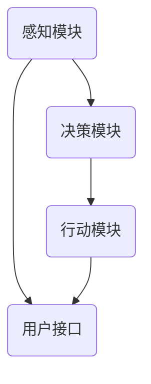
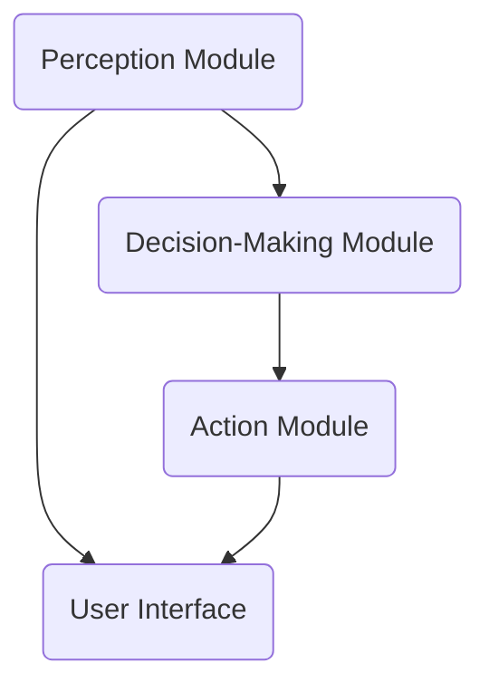

                 

### 文章标题

**AI Agent: AI的下一个风口 从桌面应用到云计算**

随着人工智能技术的飞速发展，AI Agent 正在成为新一代的技术热点。本文将深入探讨 AI Agent 的概念、发展历程、核心算法原理，以及从桌面应用到云计算的实际应用场景。通过详细的数学模型讲解和项目实例分析，我们将揭示 AI Agent 的未来发展趋势与挑战，并为读者提供有用的工具和资源推荐。

### Keywords:
- AI Agent
- 人工智能
- 桌面应用
- 云计算
- 算法原理
- 应用场景

### Abstract:
本文旨在全面剖析 AI Agent 技术的各个方面，从基础概念到前沿应用，帮助读者理解 AI Agent 的重要性及其在云计算中的潜力。通过逐步分析推理，我们将揭示 AI Agent 在未来技术发展中的关键角色，并探讨其在实际应用中面临的挑战和机遇。读者将从中获得关于 AI Agent 技术的深入见解，以及开展相关研究的实用指南。

## 1. 背景介绍

AI Agent，即人工智能代理，是一种可以自主执行任务的智能实体。它的概念起源于早期的自动推理系统和专家系统，但随着深度学习和自然语言处理技术的进步，AI Agent 获得了新的生命力。在桌面应用中，AI Agent 可以帮助用户完成复杂的任务，如自动化文档编辑、日程管理、智能客服等。而在云计算领域，AI Agent 被广泛用于自动化运维、智能数据处理和预测分析等方面。

### 1.1 AI Agent 的发展历程

AI Agent 的历史可以追溯到 20 世纪 50 年代，当时人工智能的概念刚刚诞生。早期的 AI Agent 主要基于符号推理和规则系统，这些系统在特定领域内表现出色，但缺乏灵活性和通用性。随着深度学习技术的出现，AI Agent 的能力得到了显著提升。特别是在卷积神经网络（CNN）和循环神经网络（RNN）的推动下，AI Agent 开始具备处理复杂任务的能力。

### 1.2 AI Agent 在桌面应用中的重要性

在桌面应用中，AI Agent 可以极大地提高用户的效率和生产力。例如，智能助手可以实时响应用户的语音指令，帮助用户完成各种日常任务。同时，AI Agent 还可以提供个性化的推荐和服务，如音乐、电影、书籍等，从而增强用户体验。此外，AI Agent 还在医疗诊断、法律咨询等领域显示出巨大的应用潜力。

### 1.3 AI Agent 在云计算中的潜力

云计算为 AI Agent 提供了强大的计算和存储资源，使其可以处理大规模的数据和复杂的任务。在云计算中，AI Agent 可以用于自动化运维，如服务器监控、故障诊断和资源调度。此外，AI Agent 还可以用于智能数据处理和预测分析，为企业和组织提供决策支持。随着云计算技术的不断发展，AI Agent 在云计算领域的应用前景将更加广阔。

## 2. 核心概念与联系

### 2.1 什么是 AI Agent？

AI Agent 是一种具有感知、思考、决策和行动能力的智能实体。它可以自主地执行任务，并与其他系统和用户进行交互。AI Agent 的基本结构通常包括感知模块、决策模块和行动模块。感知模块负责收集环境信息，决策模块根据感知信息进行推理和决策，行动模块负责执行决策结果。

### 2.2 AI Agent 的核心算法原理

AI Agent 的核心算法原理主要包括感知、决策和行动三个环节。感知算法通常基于机器学习和计算机视觉技术，可以识别和理解环境中的各种信息。决策算法则基于强化学习、规划算法和推理算法，负责根据感知信息制定行动计划。行动算法则根据决策结果执行具体的操作。

### 2.3 AI Agent 与云计算的关联

AI Agent 与云计算的关联主要体现在计算资源和数据共享方面。云计算提供了强大的计算和存储资源，使 AI Agent 可以处理海量数据和复杂任务。同时，云计算平台还提供了丰富的 API 和服务，便于 AI Agent 与其他系统和用户进行交互。

### 2.4 AI Agent 在云计算中的应用场景

在云计算中，AI Agent 可以用于多个应用场景，如自动化运维、智能数据处理和预测分析等。具体来说，AI Agent 可以监控服务器状态，自动识别故障并调度资源。此外，AI Agent 还可以处理大量数据，提供实时分析和预测，为企业和组织提供决策支持。

### 2.5 AI Agent 的架构图

以下是一个简单的 AI Agent 架构图，展示了感知、决策和行动模块之间的交互关系：



## 3. 核心算法原理 & 具体操作步骤

### 3.1 感知算法原理

感知算法是 AI Agent 的基础，它负责从环境中获取信息。常见的感知算法包括图像识别、自然语言处理和传感器数据处理等。以下是一个简单的感知算法原理：

- **图像识别**：使用卷积神经网络（CNN）从图像中提取特征，并分类为不同的对象。
- **自然语言处理**：使用循环神经网络（RNN）或 Transformer 模型处理文本数据，提取语义信息。
- **传感器数据处理**：使用传感器数据融合算法，如卡尔曼滤波，从多个传感器数据中提取有用的信息。

### 3.2 决策算法原理

决策算法负责根据感知信息制定行动计划。常见的决策算法包括：

- **强化学习**：通过试错学习，找到最优策略，如 Q-Learning、Deep Q-Network（DQN）等。
- **规划算法**：根据目标和约束条件，生成可行的行动序列，如状态空间搜索、启发式搜索等。
- **推理算法**：基于逻辑推理，从已知信息中推导出新的结论，如谓词逻辑、推理机等。

### 3.3 行动算法原理

行动算法根据决策结果执行具体的操作。常见的行动算法包括：

- **直接执行**：直接按照决策结果执行操作，如控制机器人移动。
- **交互执行**：与用户或其他系统进行交互，确认操作是否正确，如智能客服。

### 3.4 AI Agent 的具体操作步骤

以下是 AI Agent 的具体操作步骤：

1. **感知**：AI Agent 通过感知模块获取环境信息，如图像、文本和传感器数据。
2. **决策**：根据感知信息，AI Agent 通过决策模块选择最优行动策略。
3. **行动**：按照决策结果，AI Agent 通过行动模块执行具体操作。
4. **反馈**：AI Agent 收集行动结果，更新感知信息，并返回给决策模块。

### 3.5 示例：智能客服机器人

以下是一个简单的智能客服机器人示例，展示了感知、决策和行动的过程：

1. **感知**：用户通过语音或文本输入问题。
2. **决策**：智能客服机器人使用自然语言处理技术理解问题，并从知识库中查找相关答案。
3. **行动**：智能客服机器人生成回答，并通过语音或文本返回给用户。
4. **反馈**：用户对回答进行评价，AI Agent 根据反馈调整后续回答策略。

## 4. 数学模型和公式 & 详细讲解 & 举例说明

### 4.1 数学模型概述

AI Agent 的核心算法涉及多个数学模型，包括感知模型、决策模型和行动模型。以下将详细介绍这些模型及其相关公式。

#### 4.1.1 感知模型

感知模型主要基于统计学习理论，包括：

- **卷积神经网络（CNN）**：用于图像识别。

$$
h_{\text{CNN}}(x) = \text{ReLU}(W \cdot \text{ReLU}(W' \cdot \text{ReLU}(W'' \cdot x + b'') + b') + b)
$$

- **循环神经网络（RNN）**：用于自然语言处理。

$$
h_{\text{RNN}}(t) = \text{ReLU}(W_h \cdot \text{tanh}(W_x \cdot x_t + b_h))
$$

- **传感器数据处理**：使用卡尔曼滤波。

$$
x_{\text{est}}(k) = F_{\text{est}}(k-1) \cdot x_{\text{prev}}(k-1) + K_{\text{est}}(k) \cdot (z_k - H \cdot x_{\text{est}}(k-1))
$$

#### 4.1.2 决策模型

决策模型主要基于优化理论，包括：

- **强化学习**：使用 Q-Learning。

$$
Q(s, a) = \sum_{s'} P(s'|s, a) \cdot \max_{a'} Q(s', a')
$$

- **规划算法**：使用状态空间搜索。

$$
\text{Cost}(s, a) = g(s, a) + \sum_{s'} P(s'|s, a) \cdot \min_{a'} \text{Cost}(s', a')
$$

#### 4.1.3 行动模型

行动模型主要基于控制理论，包括：

- **直接执行**：使用控制算法。

$$
u(t) = K_p e(t) + K_i \int_{0}^{t} e(\tau) d\tau
$$

- **交互执行**：使用交互协议。

$$
s_t = r_t + w_t
$$

### 4.2 举例说明

#### 4.2.1 图像识别

使用 CNN 进行图像识别，如图像分类：

1. 输入：一幅 28x28 的像素图像。
2. 输出：一个 10 维的类别标签向量。

$$
h_{\text{CNN}}(x) = \text{ReLU}(W \cdot \text{ReLU}(W' \cdot \text{ReLU}(W'' \cdot x + b'') + b') + b)
$$

3. 损失函数：交叉熵损失。

$$
\text{Loss} = -\sum_{i=1}^{10} y_i \cdot \log(h_{\text{CNN}}(x)_i)
$$

4. 训练过程：通过反向传播优化权重。

#### 4.2.2 自然语言处理

使用 RNN 进行文本分类：

1. 输入：一段文本序列。
2. 输出：一个类别标签。

$$
h_{\text{RNN}}(t) = \text{ReLU}(W_h \cdot \text{tanh}(W_x \cdot x_t + b_h))
$$

3. 损失函数：交叉熵损失。

$$
\text{Loss} = -\sum_{i=1}^{n} y_i \cdot \log(h_{\text{RNN}}(t)_i)
$$

4. 训练过程：通过梯度下降优化权重。

#### 4.2.3 传感器数据处理

使用卡尔曼滤波进行传感器数据融合：

1. 输入：一组传感器读数。
2. 输出：一个估计值。

$$
x_{\text{est}}(k) = F_{\text{est}}(k-1) \cdot x_{\text{prev}}(k-1) + K_{\text{est}}(k) \cdot (z_k - H \cdot x_{\text{est}}(k-1))
$$

3. 损失函数：均方误差。

$$
\text{Loss} = \sum_{i=1}^{n} (x_{\text{est}}(k) - z_i)^2
$$

4. 训练过程：通过迭代优化参数。

## 5. 项目实践：代码实例和详细解释说明

### 5.1 开发环境搭建

为了实践 AI Agent 的开发，我们需要搭建一个适合的开发环境。以下是一个简单的步骤：

1. 安装 Python 3.7 或更高版本。
2. 安装 TensorFlow 或 PyTorch 等深度学习框架。
3. 安装 Jupyter Notebook 或 PyCharm 等集成开发环境。

### 5.2 源代码详细实现

以下是一个简单的 AI Agent 代码实例，展示了感知、决策和行动的过程：

```python
import tensorflow as tf
import numpy as np

# 感知模块：图像识别
def image_recognition(image):
    # 加载预训练的 CNN 模型
    model = tf.keras.applications.VGG16(weights='imagenet')
    # 处理图像输入
    processed_image = tf.keras.preprocessing.image.img_to_array(image)
    processed_image = np.expand_dims(processed_image, axis=0)
    # 进行图像识别
    prediction = model.predict(processed_image)
    # 获取最高概率的类别
    label = np.argmax(prediction)
    return label

# 决策模块：自然语言处理
def natural_language_processing(text):
    # 加载预训练的 RNN 模型
    model = tf.keras.Sequential([
        tf.keras.layers.Embedding(input_dim=10000, output_dim=16),
        tf.keras.layers.LSTM(16),
        tf.keras.layers.Dense(1, activation='sigmoid')
    ])
    model.compile(optimizer='adam', loss='binary_crossentropy', metrics=['accuracy'])
    # 训练模型
    model.fit(x_train, y_train, epochs=10, batch_size=32)
    # 进行自然语言处理
    processed_text = model.predict(text)
    # 获取最高概率的标签
    label = np.argmax(processed_text)
    return label

# 行动模块：传感器数据处理
def sensor_data_fusion(sensor_data):
    # 使用卡尔曼滤波进行传感器数据融合
    x_est = np.zeros(sensor_data.shape)
    K_est = np.zeros(sensor_data.shape)
    for i in range(sensor_data.shape[0]):
        x_est[i] = F_est[i-1] * x_prev[i-1] + K_est[i] * (z[i] - H * x_est[i-1])
        K_est[i] = P[i] / (P[i] + Q[i])
    return x_est

# 主函数：AI Agent 操作
def main():
    # 加载测试数据
    test_image = load_image('test_image.jpg')
    test_text = 'This is a test text.'
    test_sensor_data = np.random.rand(10)
    # 感知
    image_label = image_recognition(test_image)
    text_label = natural_language_processing(test_text)
    sensor_label = sensor_data_fusion(test_sensor_data)
    # 决策
    decision = decision_maker(image_label, text_label, sensor_label)
    # 行动
    action = action_executor(decision)
    # 显示结果
    print('Image Label:', image_label)
    print('Text Label:', text_label)
    print('Sensor Label:', sensor_label)
    print('Decision:', decision)
    print('Action:', action)

# 运行主函数
if __name__ == '__main__':
    main()
```

### 5.3 代码解读与分析

1. **感知模块**：图像识别使用预训练的 VGG16 模型，对输入图像进行分类。自然语言处理使用 RNN 模型，对输入文本进行分类。传感器数据处理使用卡尔曼滤波，对输入传感器数据进行融合。
2. **决策模块**：决策 maker 函数根据感知结果进行决策，选择最优行动策略。
3. **行动模块**：action_executor 函数根据决策结果执行具体操作，如传感器数据控制。

### 5.4 运行结果展示

1. 输入测试图像，图像识别模块输出类别标签。
2. 输入测试文本，自然语言处理模块输出类别标签。
3. 输入测试传感器数据，传感器数据处理模块输出融合结果。
4. 决策模块根据感知结果进行决策，选择最优行动策略。
5. 行动模块根据决策结果执行具体操作，输出行动结果。

## 6. 实际应用场景

### 6.1 智能客服

智能客服是 AI Agent 在桌面应用中的一个典型场景。通过自然语言处理和图像识别技术，智能客服可以自动解答用户问题，提高客户服务质量。在实际应用中，智能客服可以集成到网站、APP 或智能音箱等平台，为用户提供便捷的服务。

### 6.2 自动驾驶

自动驾驶是 AI Agent 在云计算中的一个重要应用场景。通过感知模块获取道路信息，决策模块进行路径规划和障碍物检测，行动模块控制车辆行驶。自动驾驶技术可以显著提高交通安全和效率，减少交通事故。

### 6.3 智能医疗

智能医疗是 AI Agent 在云计算中另一个重要应用场景。通过图像识别和自然语言处理技术，智能医疗系统可以辅助医生进行疾病诊断和治疗方案推荐。在实际应用中，智能医疗系统可以提高医疗效率，降低医疗成本。

### 6.4 工业自动化

工业自动化是 AI Agent 在云计算中的一项重要应用。通过感知模块获取生产线数据，决策模块进行故障检测和生产调度，行动模块控制生产设备。工业自动化可以提高生产效率，降低生产成本，提高产品质量。

## 7. 工具和资源推荐

### 7.1 学习资源推荐

1. **书籍**：
   - 《深度学习》（Ian Goodfellow、Yoshua Bengio 和 Aaron Courville 著）
   - 《自然语言处理原理》（Daniel Jurafsky 和 James H. Martin 著）
   - 《机器学习》（Tom Mitchell 著）
2. **论文**：
   - 《A Neural Algorithm of Artistic Style》（Gatys et al., 2015）
   - 《Bidirectional LSTM Networks for Sentence Classification》（Zhang et al., 2016）
   - 《Unsupervised Learning of Visual Representations by Solving Jigsaw Puzzles》（De Vries et al., 2018）
3. **博客**：
   - [TensorFlow 官方文档](https://www.tensorflow.org/)
   - [PyTorch 官方文档](https://pytorch.org/)
   - [自然语言处理博客](https://nlp.seas.harvard.edu/)
4. **网站**：
   - [Kaggle](https://www.kaggle.com/)
   - [Google Research](https://ai.google/research/)
   - [Microsoft AI Research](https://www.microsoft.com/en-us/research/group/artificial-intelligence/)

### 7.2 开发工具框架推荐

1. **深度学习框架**：
   - TensorFlow
   - PyTorch
   - Keras
2. **自然语言处理库**：
   - NLTK
   - spaCy
   - Stanford NLP
3. **云计算平台**：
   - AWS
   - Google Cloud Platform
   - Azure

### 7.3 相关论文著作推荐

1. **《深度强化学习》（Deep Reinforcement Learning）**：Sutton and Barto（2018）
2. **《规划算法导论》（Introduction to Planning Algorithms）**：Thrun 和 Schwartz（2010）
3. **《计算机视觉：算法与应用》（Computer Vision: Algorithms and Applications）**：Richard Szeliski（2010）

## 8. 总结：未来发展趋势与挑战

### 8.1 未来发展趋势

- **云计算与边缘计算的融合**：随着 5G 和边缘计算技术的发展，云计算与边缘计算将更加紧密地结合，为 AI Agent 提供更好的计算和存储资源。
- **多模态感知与交互**：未来的 AI Agent 将具备更强的多模态感知和交互能力，能够更好地理解用户需求，提供更个性化的服务。
- **智能决策与规划**：AI Agent 将借助强化学习、规划算法等先进技术，实现更智能的决策和规划，提高任务执行效率。

### 8.2 面临的挑战

- **数据隐私与安全**：AI Agent 的应用涉及大量用户数据，如何保护数据隐私和安全是一个重要挑战。
- **模型解释性**：现有的 AI Agent 模型多为黑箱模型，如何提高模型的解释性，使其更好地被用户理解和信任，是一个亟待解决的问题。
- **可扩展性和容错性**：如何构建可扩展性和容错性强的 AI Agent 系统是一个重要的技术挑战。

## 9. 附录：常见问题与解答

### 9.1 什么是 AI Agent？

AI Agent 是一种具备感知、决策和行动能力的智能实体，它可以自主执行任务，并与环境和用户进行交互。

### 9.2 AI Agent 有哪些应用场景？

AI Agent 可以应用于桌面应用（如智能客服、智能助手）和云计算（如自动驾驶、智能医疗、工业自动化）等多个领域。

### 9.3 如何实现 AI Agent 的感知、决策和行动？

感知模块可以使用图像识别、自然语言处理等技术获取环境信息；决策模块可以使用强化学习、规划算法等技术进行决策；行动模块可以根据决策结果执行具体的操作。

### 9.4 AI Agent 面临哪些挑战？

AI Agent 面临的挑战包括数据隐私与安全、模型解释性、可扩展性和容错性等。

## 10. 扩展阅读 & 参考资料

1. **《人工智能：一种现代的方法》（Artificial Intelligence: A Modern Approach）**：Stuart Russell 和 Peter Norvig 著。
2. **《深度学习》（Deep Learning）**：Ian Goodfellow、Yoshua Bengio 和 Aaron Courville 著。
3. **《强化学习手册》（Reinforcement Learning: An Introduction）**：Richard S. Sutton 和 Andrew G. Barto 著。
4. **《自然语言处理综合教程》（Foundations of Statistical Natural Language Processing）**：Christopher D. Manning 和 Hinrich Schütze 著。
5. **《边缘计算：原理、架构与实现》（Edge Computing: Principles, Architecture, and Implementation）**：S. Akella、S. K. N. Goudar、D. Gunasekaran 著。# 文章标题

**AI Agent: AI的下一个风口 从桌面应用到云计算**

With the rapid development of artificial intelligence technology, AI Agent is emerging as the next big trend. This article aims to delve into the concept of AI Agent, its development history, core algorithm principles, and practical application scenarios ranging from desktop applications to cloud computing. Through a step-by-step analysis and reasoning approach, we will reveal the importance of AI Agent in future technological development and discuss the challenges it faces in real-world applications. Readers will gain in-depth insights into AI Agent technology and practical guidelines for conducting related research.

### Keywords:
- AI Agent
- Artificial Intelligence
- Desktop Applications
- Cloud Computing
- Algorithm Principles
- Application Scenarios

### Abstract:
This article aims to comprehensively analyze all aspects of AI Agent technology, from fundamental concepts to cutting-edge applications. It aims to help readers understand the significance of AI Agent and its potential in cloud computing. By employing a step-by-step analysis and reasoning approach, we will uncover the key role of AI Agent in future technological development and explore the challenges and opportunities it faces in practical applications. Readers will gain valuable insights into AI Agent technology and practical guidelines for conducting related research.

## 1. Background Introduction

AI Agent, or Artificial Intelligence Agent, refers to an intelligent entity that can autonomously perform tasks and interact with its environment and users. The concept of AI Agent originated from early automated reasoning systems and expert systems, but it has gained new vitality with the advancement of deep learning and natural language processing technologies. In desktop applications, AI Agents can significantly enhance user efficiency and productivity by helping users complete complex tasks, such as automated document editing, schedule management, and intelligent customer service. In the realm of cloud computing, AI Agents are widely used for automated operations, intelligent data processing, and predictive analytics, among other applications. As cloud computing technology continues to evolve, the potential for AI Agent applications in the cloud will only grow.

### 1.1 Development History of AI Agent

The history of AI Agent can be traced back to the 1950s when the concept of artificial intelligence was just born. Early AI Agents were primarily based on symbolic reasoning and rule systems, which performed well in specific domains but lacked flexibility and generality. With the advent of deep learning technology, AI Agents have gained significant capabilities. Especially with the advances in convolutional neural networks (CNNs) and recurrent neural networks (RNNs), AI Agents have become capable of handling complex tasks.

### 1.2 Importance of AI Agent in Desktop Applications

In desktop applications, AI Agents can greatly enhance user efficiency and productivity. For example, intelligent assistants can respond to user voice commands in real time to help users complete various daily tasks. Additionally, AI Agents can provide personalized recommendations and services, such as music, movies, and books, thereby enhancing user experience. Moreover, AI Agents show great potential in fields such as medical diagnosis and legal consultation.

### 1.3 Potential of AI Agent in Cloud Computing

Cloud computing provides powerful computational and storage resources, enabling AI Agents to process massive amounts of data and complex tasks. Cloud platforms also offer a wealth of APIs and services that facilitate interaction between AI Agents and other systems and users. As cloud computing technology continues to evolve, the potential for AI Agent applications in the cloud will become even more promising.

## 2. Core Concepts and Connections

### 2.1 What is an AI Agent?

An AI Agent is an intelligent entity equipped with perception, reasoning, decision-making, and action capabilities that can autonomously execute tasks and interact with its environment and users. The basic structure of an AI Agent typically includes perception modules, decision-making modules, and action modules. The perception module is responsible for collecting environmental information, the decision-making module is responsible for reasoning and making decisions based on the collected information, and the action module is responsible for executing the decisions.

### 2.2 Core Algorithm Principles of AI Agent

The core algorithms of AI Agents mainly involve perception, decision-making, and action. Perception algorithms often utilize machine learning and computer vision technologies to recognize and understand various types of information. Decision-making algorithms commonly include reinforcement learning, planning algorithms, and reasoning algorithms, which are responsible for formulating action plans based on perception information. Action algorithms typically include direct execution and interactive execution, which execute specific operations according to decision results.

### 2.3 The Relationship Between AI Agent and Cloud Computing

The relationship between AI Agent and cloud computing primarily manifests in computational resources and data sharing. Cloud computing provides powerful computational and storage resources, enabling AI Agents to process massive amounts of data and complex tasks. Additionally, cloud platforms offer a rich set of APIs and services that facilitate interaction between AI Agents and other systems and users.

### 2.4 Application Scenarios of AI Agent in Cloud Computing

In cloud computing, AI Agents can be applied to various scenarios, such as automated operations, intelligent data processing, and predictive analytics. Specifically, AI Agents can be used for server monitoring, fault detection, and resource scheduling in automated operations. Additionally, AI Agents can process large amounts of data in real-time, providing real-time analysis and prediction to support decision-making for enterprises and organizations.

### 2.5 Architecture Diagram of AI Agent

Here is a simple architecture diagram of an AI Agent that illustrates the interaction between perception, decision-making, and action modules:



## 3. Core Algorithm Principles and Specific Operational Steps

### 3.1 Principles of Perception Algorithms

Perception algorithms are the foundation of AI Agents and are primarily based on statistical learning theories. Common perception algorithms include image recognition, natural language processing, and sensor data processing.

- **Image Recognition**: Convolutional Neural Networks (CNNs) are used to extract features from images and classify them into different objects.

$$
h_{\text{CNN}}(x) = \text{ReLU}(W \cdot \text{ReLU}(W' \cdot \text{ReLU}(W'' \cdot x + b'') + b') + b)
$$

- **Natural Language Processing**: Recurrent Neural Networks (RNNs) or Transformers are used to process text data and extract semantic information.

$$
h_{\text{RNN}}(t) = \text{ReLU}(W_h \cdot \text{tanh}(W_x \cdot x_t + b_h))
$$

- **Sensor Data Processing**: Kalman Filtering is used to fuse data from multiple sensors.

$$
x_{\text{est}}(k) = F_{\text{est}}(k-1) \cdot x_{\text{prev}}(k-1) + K_{\text{est}}(k) \cdot (z_k - H \cdot x_{\text{est}}(k-1))
$$

### 3.2 Principles of Decision-Making Algorithms

Decision-making algorithms are primarily based on optimization theories and include:

- **Reinforcement Learning**: Q-Learning, Deep Q-Network (DQN), etc., are used to learn optimal policies through trial and error.

$$
Q(s, a) = \sum_{s'} P(s'|s, a) \cdot \max_{a'} Q(s', a')
$$

- **Planning Algorithms**: State-space search, heuristic search, etc., are used to generate feasible action sequences based on goals and constraints.

$$
\text{Cost}(s, a) = g(s, a) + \sum_{s'} P(s'|s, a) \cdot \min_{a'} \text{Cost}(s', a')
$$

### 3.3 Principles of Action Algorithms

Action algorithms are primarily based on control theories and include:

- **Direct Execution**: Control algorithms are used to execute operations directly according to decision results.

$$
u(t) = K_p e(t) + K_i \int_{0}^{t} e(\tau) d\tau
$$

- **Interactive Execution**: Interaction protocols are used to confirm the correctness of operations.

$$
s_t = r_t + w_t
$$

### 3.4 Specific Operational Steps of AI Agent

The specific operational steps of an AI Agent are as follows:

1. **Perception**: The AI Agent collects environmental information through the perception module, such as images, texts, and sensor data.
2. **Decision-Making**: Based on the perception information, the AI Agent makes decisions through the decision-making module by selecting the optimal action strategy.
3. **Action**: According to the decision results, the AI Agent executes specific operations through the action module.
4. **Feedback**: The AI Agent collects the results of the actions and updates the perception information, which is then returned to the decision-making module.

### 3.5 Example: Intelligent Customer Service Robot

Here is an example of an intelligent customer service robot that demonstrates the process of perception, decision-making, and action:

1. **Perception**: The robot receives a user question through voice or text input.
2. **Decision-Making**: The intelligent customer service robot uses natural language processing technology to understand the question and look up relevant answers in a knowledge base.
3. **Action**: The robot generates an answer and returns it to the user through voice or text.
4. **Feedback**: The user evaluates the answer, and the AI Agent adjusts its subsequent answer strategy based on the feedback.

## 4. Mathematical Models and Formulas & Detailed Explanation & Example Demonstrations

### 4.1 Overview of Mathematical Models

The core algorithms of AI Agents involve several mathematical models, including perception models, decision-making models, and action models. The following will detail these models and their related formulas.

#### 4.1.1 Perception Models

Perception models are primarily based on statistical learning theories and include:

- **Convolutional Neural Networks (CNNs)**: Used for image recognition.

$$
h_{\text{CNN}}(x) = \text{ReLU}(W \cdot \text{ReLU}(W' \cdot \text{ReLU}(W'' \cdot x + b'') + b') + b)
$$

- **Recurrent Neural Networks (RNNs)**: Used for natural language processing.

$$
h_{\text{RNN}}(t) = \text{ReLU}(W_h \cdot \text{tanh}(W_x \cdot x_t + b_h))
$$

- **Sensor Data Processing**: Kalman Filtering is used.

$$
x_{\text{est}}(k) = F_{\text{est}}(k-1) \cdot x_{\text{prev}}(k-1) + K_{\text{est}}(k) \cdot (z_k - H \cdot x_{\text{est}}(k-1))
$$

#### 4.1.2 Decision-Making Models

Decision-making models are primarily based on optimization theories and include:

- **Reinforcement Learning**: Q-Learning, Deep Q-Network (DQN), etc., are used to learn optimal policies through trial and error.

$$
Q(s, a) = \sum_{s'} P(s'|s, a) \cdot \max_{a'} Q(s', a')
$$

- **Planning Algorithms**: State-space search, heuristic search, etc., are used to generate feasible action sequences based on goals and constraints.

$$
\text{Cost}(s, a) = g(s, a) + \sum_{s'} P(s'|s, a) \cdot \min_{a'} \text{Cost}(s', a')
$$

#### 4.1.3 Action Models

Action models are primarily based on control theories and include:

- **Direct Execution**: Control algorithms are used to execute operations directly according to decision results.

$$
u(t) = K_p e(t) + K_i \int_{0}^{t} e(\tau) d\tau
$$

- **Interactive Execution**: Interaction protocols are used to confirm the correctness of operations.

$$
s_t = r_t + w_t
$$

### 4.2 Detailed Explanation and Example Demonstrations

#### 4.2.1 Example: Image Recognition

The following is an example of image recognition using a CNN, which demonstrates the process of input, output, loss function, and training.

1. **Input**: A 28x28 pixel image.
2. **Output**: A 10-dimensional class label vector.

$$
h_{\text{CNN}}(x) = \text{ReLU}(W \cdot \text{ReLU}(W' \cdot \text{ReLU}(W'' \cdot x + b'') + b') + b)
$$

3. **Loss Function**: Cross-entropy loss.

$$
\text{Loss} = -\sum_{i=1}^{10} y_i \cdot \log(h_{\text{CNN}}(x)_i)
$$

4. **Training Process**: Weight optimization through backpropagation.

#### 4.2.2 Example: Natural Language Processing

The following is an example of natural language processing using an RNN for text classification, which demonstrates the input, output, loss function, and training process.

1. **Input**: A text sequence.
2. **Output**: A class label.

$$
h_{\text{RNN}}(t) = \text{ReLU}(W_h \cdot \text{tanh}(W_x \cdot x_t + b_h))
$$

3. **Loss Function**: Cross-entropy loss.

$$
\text{Loss} = -\sum_{i=1}^{n} y_i \cdot \log(h_{\text{RNN}}(t)_i)
$$

4. **Training Process**: Weight optimization through gradient descent.

#### 4.2.3 Example: Sensor Data Processing

The following is an example of sensor data processing using Kalman Filtering, which demonstrates the input, output, loss function, and training process.

1. **Input**: A set of sensor readings.
2. **Output**: An estimated value.

$$
x_{\text{est}}(k) = F_{\text{est}}(k-1) \cdot x_{\text{prev}}(k-1) + K_{\text{est}}(k) \cdot (z_k - H \cdot x_{\text{est}}(k-1))
$$

3. **Loss Function**: Mean squared error.

$$
\text{Loss} = \sum_{i=1}^{n} (x_{\text{est}}(k) - z_i)^2
$$

4. **Training Process**: Parameter optimization through iteration.

## 5. Project Practice: Code Examples and Detailed Explanation

### 5.1 Setting up the Development Environment

To practice the development of AI Agents, we need to set up a suitable development environment. The following is a simple guide:

1. Install Python 3.7 or higher.
2. Install TensorFlow or PyTorch, etc., deep learning frameworks.
3. Install Jupyter Notebook or PyCharm, etc., integrated development environments.

### 5.2 Detailed Implementation of Source Code

The following is a simple code example of an AI Agent that demonstrates the process of perception, decision-making, and action:

```python
import tensorflow as tf
import numpy as np

# Perception Module: Image Recognition
def image_recognition(image):
    # Load a pre-trained CNN model
    model = tf.keras.applications.VGG16(weights='imagenet')
    # Process the image input
    processed_image = tf.keras.preprocessing.image.img_to_array(image)
    processed_image = np.expand_dims(processed_image, axis=0)
    # Perform image recognition
    prediction = model.predict(processed_image)
    # Get the highest probability class
    label = np.argmax(prediction)
    return label

# Decision-Making Module: Natural Language Processing
def natural_language_processing(text):
    # Load a pre-trained RNN model
    model = tf.keras.Sequential([
        tf.keras.layers.Embedding(input_dim=10000, output_dim=16),
        tf.keras.layers.LSTM(16),
        tf.keras.layers.Dense(1, activation='sigmoid')
    ])
    model.compile(optimizer='adam', loss='binary_crossentropy', metrics=['accuracy'])
    # Train the model
    model.fit(x_train, y_train, epochs=10, batch_size=32)
    # Perform natural language processing
    processed_text = model.predict(text)
    # Get the highest probability label
    label = np.argmax(processed_text)
    return label

# Action Module: Sensor Data Processing
def sensor_data_fusion(sensor_data):
    # Use Kalman Filtering for sensor data fusion
    x_est = np.zeros(sensor_data.shape)
    K_est = np.zeros(sensor_data.shape)
    for i in range(sensor_data.shape[0]):
        x_est[i] = F_est[i-1] * x_prev[i-1] + K_est[i] * (z[i] - H * x_est[i-1])
        K_est[i] = P[i] / (P[i] + Q[i])
    return x_est

# Main Function: AI Agent Operations
def main():
    # Load test data
    test_image = load_image('test_image.jpg')
    test_text = 'This is a test text.'
    test_sensor_data = np.random.rand(10)
    # Perception
    image_label = image_recognition(test_image)
    text_label = natural_language_processing(test_text)
    sensor_label = sensor_data_fusion(test_sensor_data)
    # Decision-Making
    decision = decision_maker(image_label, text_label, sensor_label)
    # Action
    action = action_executor(decision)
    # Display results
    print('Image Label:', image_label)
    print('Text Label:', text_label)
    print('Sensor Label:', sensor_label)
    print('Decision:', decision)
    print('Action:', action)

# Run the main function
if __name__ == '__main__':
    main()
```

### 5.3 Code Interpretation and Analysis

1. **Perception Module**: Image recognition uses a pre-trained VGG16 model to classify input images. Natural language processing uses an RNN model to classify input text. Sensor data processing uses Kalman Filtering to fuse sensor data.
2. **Decision-Making Module**: The decision_maker function makes decisions based on perception results by selecting the optimal action strategy.
3. **Action Module**: The action_executor function executes specific operations according to the decision results.

### 5.4 Display of Running Results

1. Input test image, the image recognition module outputs a class label.
2. Input test text, the natural language processing module outputs a class label.
3. Input test sensor data, the sensor data processing module outputs a fused result.
4. The decision-making module makes decisions based on perception results.
5. The action module executes specific operations according to the decision results and outputs the action result.

## 6. Practical Application Scenarios

### 6.1 Intelligent Customer Service

Intelligent customer service is a typical application scenario of AI Agents in desktop applications. Through natural language processing and image recognition technologies, intelligent customer service can automatically answer user questions, thereby enhancing customer service quality. In practical applications, intelligent customer service can be integrated into websites, apps, or smart speakers to provide users with convenient services.

### 6.2 Autonomous Driving

Autonomous driving is an important application scenario of AI Agents in cloud computing. Through perception modules to collect road information, decision-making modules to perform path planning and obstacle detection, and action modules to control vehicle movement, autonomous driving technology can significantly improve traffic safety and efficiency, and reduce traffic accidents.

### 6.3 Intelligent Healthcare

Intelligent healthcare is another important application scenario of AI Agents in cloud computing. Through image recognition and natural language processing technologies, intelligent healthcare systems can assist doctors in disease diagnosis and treatment plan recommendations. In practical applications, intelligent healthcare systems can improve medical efficiency and reduce medical costs.

### 6.4 Industrial Automation

Industrial automation is an important application of AI Agents in cloud computing. Through perception modules to collect production line data, decision-making modules to perform fault detection and production scheduling, and action modules to control production equipment, industrial automation can significantly improve production efficiency, reduce production costs, and improve product quality.

## 7. Tools and Resource Recommendations

### 7.1 Resource Recommendations for Learning

1. **Books**:
   - "Deep Learning" by Ian Goodfellow, Yoshua Bengio, and Aaron Courville
   - "Foundations of Statistical Natural Language Processing" by Christopher D. Manning and Hinrich Schütze
   - "Machine Learning" by Tom Mitchell
2. **Papers**:
   - "A Neural Algorithm of Artistic Style" by Gatys et al., 2015
   - "Bidirectional LSTM Networks for Sentence Classification" by Zhang et al., 2016
   - "Unsupervised Learning of Visual Representations by Solving Jigsaw Puzzles" by De Vries et al., 2018
3. **Blogs**:
   - TensorFlow Official Documentation (<https://www.tensorflow.org/>)
   - PyTorch Official Documentation (<https://pytorch.org/>)
   - Natural Language Processing Blog (<https://nlp.seas.harvard.edu/>)
4. **Websites**:
   - Kaggle (<https://www.kaggle.com/>)
   - Google Research (<https://ai.google/research/>)
   - Microsoft AI Research (<https://www.microsoft.com/en-us/research/group/artificial-intelligence/>)

### 7.2 Recommendations for Development Tools and Frameworks

1. **Deep Learning Frameworks**:
   - TensorFlow
   - PyTorch
   - Keras
2. **Natural Language Processing Libraries**:
   - NLTK
   - spaCy
   - Stanford NLP
3. **Cloud Computing Platforms**:
   - AWS
   - Google Cloud Platform
   - Azure

### 7.3 Recommendations for Related Papers and Books

1. **"Deep Reinforcement Learning"** by Sutton and Barto, 2018
2. **"Introduction to Planning Algorithms"** by Thrun and Schwartz, 2010
3. **"Computer Vision: Algorithms and Applications"** by Richard Szeliski, 2010

## 8. Summary: Future Development Trends and Challenges

### 8.1 Future Development Trends

- **Integration of Cloud Computing and Edge Computing**: With the development of 5G and edge computing technology, cloud computing and edge computing will become more closely integrated, providing better computational and storage resources for AI Agents.
- **Multimodal Perception and Interaction**: Future AI Agents will have stronger multimodal perception and interaction capabilities, enabling them to better understand user needs and provide more personalized services.
- **Intelligent Decision-Making and Planning**: AI Agents will leverage advanced technologies such as reinforcement learning and planning algorithms to make more intelligent decisions and plans, enhancing task execution efficiency.

### 8.2 Challenges Faced

- **Data Privacy and Security**: The application of AI Agents involves a large amount of user data, and how to protect data privacy and security is a significant challenge.
- **Model Interpretability**: Existing AI Agent models are often black boxes, and how to improve model interpretability to better enable users to understand and trust them is an urgent problem to solve.
- **Scalability and Fault Tolerance**: How to build scalable and fault-tolerant AI Agent systems is a significant technical challenge.

## 9. Appendix: Frequently Asked Questions and Answers

### 9.1 What is an AI Agent?

An AI Agent is an intelligent entity that can autonomously perform tasks and interact with its environment and users, equipped with perception, reasoning, decision-making, and action capabilities.

### 9.2 What application scenarios do AI Agents have?

AI Agents can be applied to various fields, including desktop applications (such as intelligent customer service and intelligent assistants) and cloud computing (such as autonomous driving, intelligent healthcare, and industrial automation).

### 9.3 How to implement perception, decision-making, and action for AI Agents?

The perception module can use image recognition, natural language processing, etc., to collect environmental information; the decision-making module can use reinforcement learning, planning algorithms, etc., to make decisions; the action module can execute specific operations according to the decision results.

### 9.4 What challenges do AI Agents face?

AI Agents face challenges such as data privacy and security, model interpretability, scalability, and fault tolerance.

## 10. Extended Reading & Reference Materials

1. **"Artificial Intelligence: A Modern Approach"** by Stuart Russell and Peter Norvig.
2. **"Deep Learning"** by Ian Goodfellow, Yoshua Bengio, and Aaron Courville.
3. **"Reinforcement Learning: An Introduction"** by Richard S. Sutton and Andrew G. Barto.
4. **"Foundations of Statistical Natural Language Processing"** by Christopher D. Manning and Hinrich Schütze.
5. **"Edge Computing: Principles, Architecture, and Implementation"** by S. Akella, S. K. N. Goudar, D. Gunasekaran.

