                 

### 文章标题

**机器学习模型部署：从开发到生产环境**

关键词：机器学习、模型部署、生产环境、开发流程、性能优化

摘要：本文旨在深入探讨机器学习模型从开发阶段到生产环境部署的整个流程。我们将分析这一过程中的关键步骤、技术挑战和解决方案，旨在为开发者提供全面的指导，帮助他们成功地将机器学习模型投入实际应用。

<|user|>### 1. 背景介绍（Background Introduction）

随着人工智能技术的迅猛发展，机器学习模型在众多领域发挥着重要作用。从图像识别、自然语言处理到预测分析，机器学习模型的应用越来越广泛。然而，一个机器学习模型的成功不仅取决于其开发阶段的质量，更取决于其在生产环境中的表现。如何将一个优秀的模型从开发阶段平稳过渡到生产环境，是一个复杂而关键的过程。

机器学习模型部署涉及到多个环节，包括模型选择、性能优化、资源调度、安全性保障等。在这一过程中，开发者需要面对诸多挑战，如数据集的不一致性、硬件资源限制、模型性能瓶颈等。因此，理解并掌握机器学习模型部署的整个过程对于提升模型应用效果、降低开发成本具有重要意义。

本文将详细阐述机器学习模型部署的各个环节，包括从模型开发到生产环境部署的流程、关键技术点和常见问题，旨在为开发者提供一份全面而实用的指南。

<|user|>### 2. 核心概念与联系（Core Concepts and Connections）

#### 2.1 机器学习模型部署的概念

机器学习模型部署是指将训练好的模型应用到实际场景中，使其能够对新的数据进行预测或分类的过程。部署的过程包括将模型转换为可在生产环境中运行的形式，配置相应的计算资源，确保模型的安全性和稳定性，以及持续监控和优化模型性能。

#### 2.2 模型部署的环节

模型部署过程可以大致分为以下几个环节：

1. **模型转换**：将训练好的模型从机器学习框架中导出，转换为生产环境可执行的格式。常见的模型转换工具有TensorFlow Lite、PyTorch Mobile等。
2. **模型优化**：通过模型压缩、量化等技术，降低模型的复杂度，提高运行效率，以便在资源受限的环境中运行。
3. **模型部署**：将转换后的模型部署到生产环境，可以是云服务器、边缘设备或嵌入式设备等。
4. **性能监控**：实时监控模型的运行状态和性能指标，确保模型在部署后的稳定性和可靠性。
5. **持续优化**：根据监控数据和用户反馈，对模型进行调整和优化，提高其预测准确性。

#### 2.3 模型部署与开发流程的联系

模型部署是机器学习开发流程的重要组成部分。一个完整的机器学习开发流程通常包括数据预处理、模型选择、训练、验证、测试和部署等环节。其中，模型部署是最后一个环节，也是决定模型能否实际应用的关键。

在模型开发阶段，开发者需要根据业务需求和数据特点选择合适的模型，并进行训练和优化。而在模型部署阶段，开发者则需要考虑模型的运行环境、资源限制和性能要求，确保模型能够在生产环境中稳定高效地运行。

#### 2.4 模型部署与传统软件开发的异同

与传统软件开发相比，机器学习模型部署具有以下特点：

1. **动态性**：机器学习模型是动态更新的，需要根据新的数据不断调整和优化。而传统软件通常是静态的，一经开发完成后即可长期运行。
2. **复杂性**：模型部署涉及到多个技术环节，包括模型转换、部署平台选择、性能优化等，相较于传统软件开发，技术要求更高。
3. **可扩展性**：机器学习模型部署需要考虑横向和纵向的扩展性，以便应对不同规模和负载的应用场景。而传统软件开发通常更加注重纵向扩展。

尽管存在这些差异，机器学习模型部署与传统软件开发在许多方面仍然有相似之处，如都需要考虑性能优化、安全性、稳定性等。

**Figure 1: 机器学习模型部署流程与开发流程的联系**

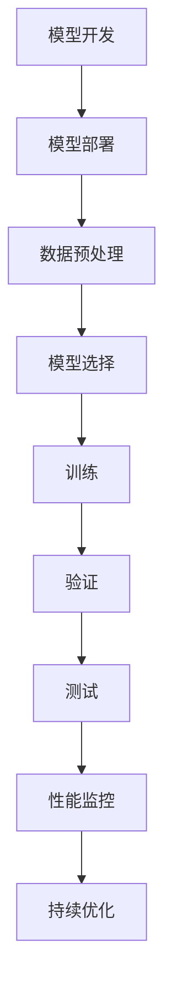

<|user|>### 3. 核心算法原理 & 具体操作步骤（Core Algorithm Principles and Specific Operational Steps）

#### 3.1 模型转换

模型转换是将训练好的机器学习模型从机器学习框架中导出，转换为生产环境可执行的格式。以下是具体的操作步骤：

1. **选择合适的模型转换工具**：根据模型的框架和需求选择合适的转换工具，如TensorFlow Lite、PyTorch Mobile等。
2. **导出模型**：使用转换工具将训练好的模型导出为生产环境可执行的格式。例如，使用TensorFlow Lite将TensorFlow模型导出为.tflite格式。
3. **模型优化**：在模型转换过程中，可以结合模型压缩、量化等技术，降低模型的复杂度，提高运行效率。例如，使用量化技术可以将8位整数运算应用于浮点运算，从而减少模型的大小和运行时间。

**Figure 2: 模型转换流程**

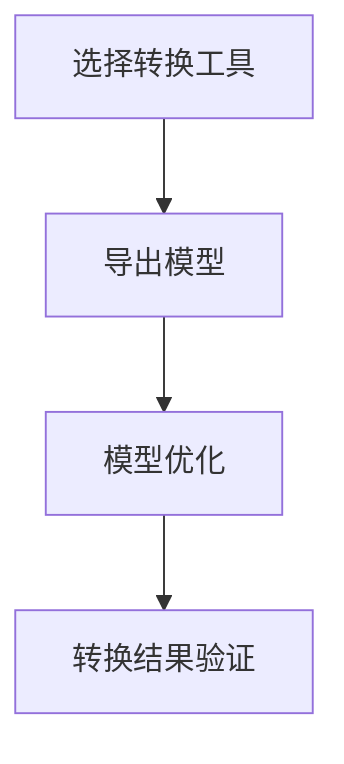

#### 3.2 模型优化

模型优化是为了提高模型在特定硬件环境下的运行效率。以下是几种常见的模型优化方法：

1. **模型压缩**：通过减少模型的参数数量和计算复杂度，降低模型的大小。常见的模型压缩方法包括剪枝、知识蒸馏等。
2. **量化**：将模型的浮点运算转换为整数运算，从而减少模型的存储空间和计算时间。量化技术包括全精度量化、低精度量化等。
3. **模型融合**：将多个模型融合为一个，以提高模型的性能和鲁棒性。常见的模型融合方法包括模型加权、模型蒸馏等。

**Figure 3: 模型优化方法**

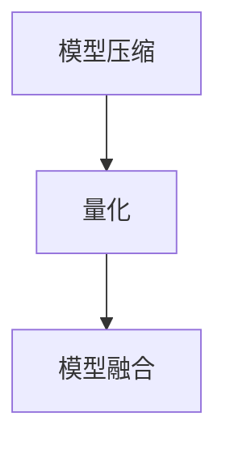

#### 3.3 模型部署

模型部署是将转换后的模型部署到生产环境。以下是具体的操作步骤：

1. **选择部署平台**：根据业务需求和硬件资源选择合适的部署平台，如云服务器、边缘设备或嵌入式设备等。
2. **配置部署环境**：在部署平台上配置运行环境，包括操作系统、依赖库等。
3. **部署模型**：将转换后的模型上传到部署平台，并配置相应的运行参数。
4. **监控与优化**：实时监控模型的运行状态和性能指标，根据监控结果进行调优。

**Figure 4: 模型部署流程**

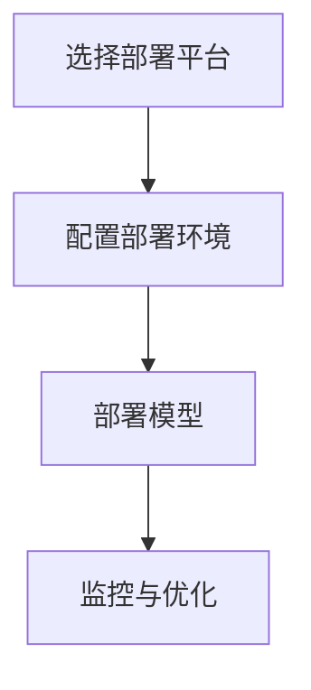

#### 3.4 模型性能监控

模型性能监控是确保模型在部署后的稳定性和可靠性的重要环节。以下是常见的监控指标和方法：

1. **预测准确性**：通过比较模型的预测结果和实际结果，评估模型的预测准确性。
2. **响应时间**：监控模型的响应时间，以确保模型能够在规定时间内完成预测。
3. **资源消耗**：监控模型的资源消耗，包括CPU、GPU、内存等，以确保模型在硬件资源有限的环境中运行。
4. **错误率**：通过统计模型预测错误的数量，评估模型的错误率。
5. **监控系统**：使用监控系统实时收集和展示模型性能指标，如Prometheus、Grafana等。

**Figure 5: 模型性能监控指标**

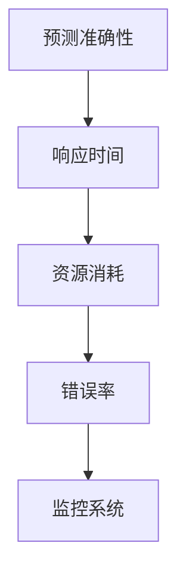

#### 3.5 模型持续优化

模型持续优化是提高模型应用效果的重要手段。以下是常见的模型优化方法：

1. **在线学习**：在模型部署后，定期收集新的数据，对模型进行在线学习，以适应数据的变化。
2. **迁移学习**：将其他领域或任务的模型迁移到当前任务中，以提高模型的性能和泛化能力。
3. **模型更新**：根据用户反馈和业务需求，定期更新模型，以适应新的应用场景。
4. **调参优化**：通过调整模型的超参数，优化模型的性能。

**Figure 6: 模型持续优化方法**

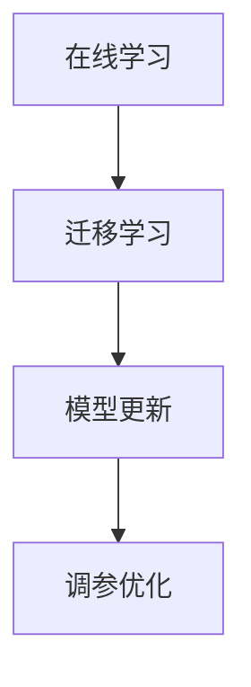

### 3. Core Algorithm Principles and Specific Operational Steps

#### 3.1 Model Conversion

Model conversion involves exporting a trained machine learning model from a machine learning framework into a format that can be executed in a production environment. Here are the specific steps involved:

1. **Choose the Right Conversion Tool**: Select an appropriate conversion tool based on the model framework and requirements, such as TensorFlow Lite or PyTorch Mobile.
2. **Export the Model**: Use the conversion tool to export the trained model into a production-executable format. For example, use TensorFlow Lite to export a TensorFlow model into the .tflite format.
3. **Model Optimization**: During the model conversion process, apply techniques such as model compression and quantization to reduce the complexity of the model and improve runtime efficiency. For example, use quantization techniques to perform 8-bit integer operations instead of floating-point operations, thereby reducing the model size and runtime.

**Figure 2: Model Conversion Process**

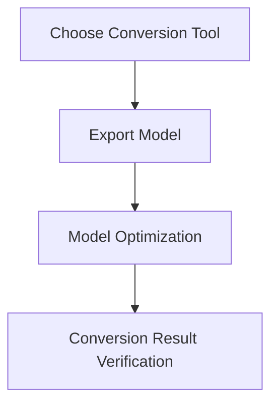

#### 3.2 Model Optimization

Model optimization aims to improve the performance of a model in a specific hardware environment. Here are several common optimization methods:

1. **Model Compression**: Reduces the size of a model by reducing the number of parameters and computational complexity. Common model compression techniques include pruning and knowledge distillation.
2. **Quantization**: Converts floating-point operations in a model to integer operations, thereby reducing the storage space and computation time. Quantization techniques include full-precision quantization and low-precision quantization.
3. **Model Fusion**: Combines multiple models into one to improve model performance and robustness. Common model fusion techniques include model weighting and model distillation.

**Figure 3: Model Optimization Methods**

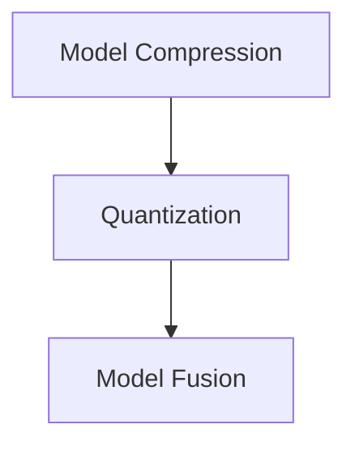

#### 3.3 Model Deployment

Model deployment involves deploying the converted model to a production environment. Here are the specific steps involved:

1. **Choose the Right Deployment Platform**: Select an appropriate deployment platform based on business requirements and hardware resources, such as cloud servers, edge devices, or embedded systems.
2. **Configure the Deployment Environment**: Set up the runtime environment on the deployment platform, including the operating system and dependency libraries.
3. **Deploy the Model**: Upload the converted model to the deployment platform and configure the necessary runtime parameters.
4. **Monitor and Optimize**: Continuously monitor the model's runtime status and performance metrics to ensure stability and reliability.

**Figure 4: Model Deployment Process**

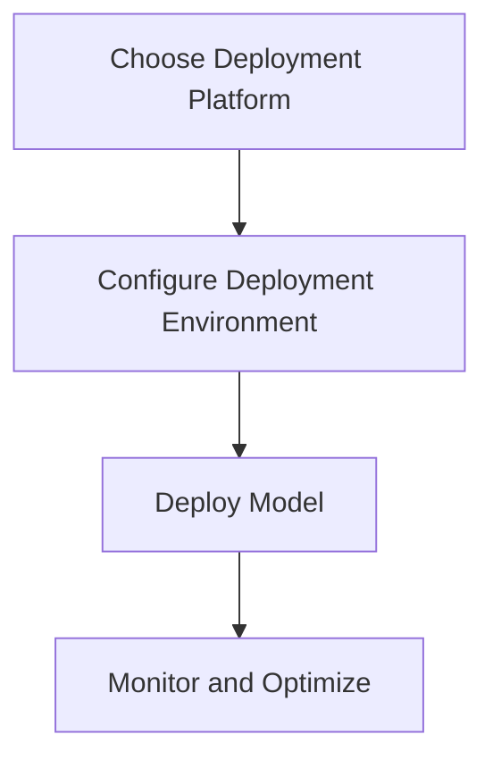

#### 3.4 Model Performance Monitoring

Model performance monitoring is crucial for ensuring the stability and reliability of a model after deployment. Here are common monitoring metrics and methods:

1. **Prediction Accuracy**: Evaluate model accuracy by comparing predicted results with actual results.
2. **Response Time**: Monitor the model's response time to ensure it can complete predictions within specified time limits.
3. **Resource Consumption**: Monitor the model's resource consumption, including CPU, GPU, and memory, to ensure it runs efficiently in a resource-constrained environment.
4. **Error Rate**: Count the number of incorrect predictions to evaluate the model's error rate.
5. **Monitoring System**: Use a monitoring system to collect and display model performance metrics in real-time, such as Prometheus and Grafana.

**Figure 5: Model Performance Monitoring Metrics**

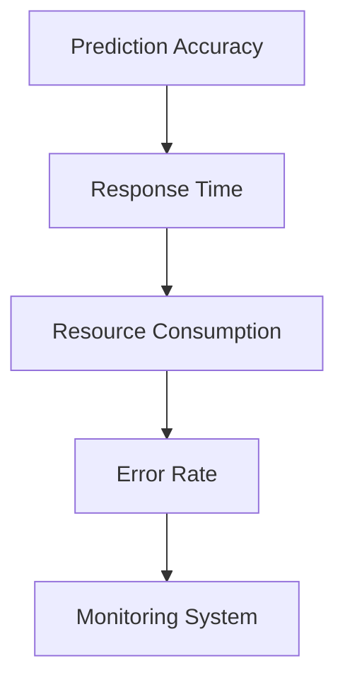

#### 3.5 Continuous Model Optimization

Continuous model optimization is an important means of improving the application effect of a model. Here are common optimization methods:

1. **Online Learning**: Periodically collect new data after model deployment for online learning to adapt to changes in data.
2. **Transfer Learning**: Apply models from other domains or tasks to the current task to improve model performance and generalization ability.
3. **Model Updating**: Regularly update the model based on user feedback and business requirements to adapt to new application scenarios.
4. **Hyperparameter Tuning**: Adjust the model's hyperparameters to optimize performance.

**Figure 6: Continuous Model Optimization Methods**

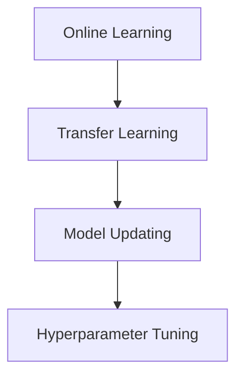

<|user|>### 4. 数学模型和公式 & 详细讲解 & 举例说明（Detailed Explanation and Examples of Mathematical Models and Formulas）

#### 4.1 模型评估指标

在机器学习模型部署过程中，评估模型性能是至关重要的一步。以下是几种常用的评估指标及其数学公式：

1. **准确率（Accuracy）**：准确率是预测正确的样本数量占总样本数量的比例。其计算公式为：
   $$\text{Accuracy} = \frac{\text{预测正确数}}{\text{总样本数}}$$
   **示例**：假设有100个样本，模型预测正确的有80个，则准确率为80%。

2. **召回率（Recall）**：召回率是预测正确的正类样本数量占总正类样本数量的比例。其计算公式为：
   $$\text{Recall} = \frac{\text{预测正确的正类数}}{\text{实际正类数}}$$
   **示例**：假设有100个正类样本，模型预测正确的有70个，则召回率为70%。

3. **精确率（Precision）**：精确率是预测正确的正类样本数量占预测为正类样本数量的比例。其计算公式为：
   $$\text{Precision} = \frac{\text{预测正确的正类数}}{\text{预测为正类数}}$$
   **示例**：假设有100个正类样本，模型预测为正类的有120个，其中预测正确的有70个，则精确率为58.33%。

4. **F1值（F1-Score）**：F1值是精确率和召回率的调和平均值，用于综合评估模型的性能。其计算公式为：
   $$\text{F1-Score} = 2 \times \frac{\text{Precision} \times \text{Recall}}{\text{Precision} + \text{Recall}}$$
   **示例**：假设精确率为60%，召回率为40%，则F1值为0.5。

5. **ROC曲线与AUC（Area Under Curve）**：ROC曲线是评估二分类模型性能的重要工具，AUC是ROC曲线下的面积。AUC的值介于0和1之间，值越大表示模型性能越好。AUC的计算公式为：
   $$\text{AUC} = \int_{0}^{1} (1 - \text{False Positive Rate}) \times \text{True Positive Rate} \, d\text{x}$$
   **示例**：假设ROC曲线的AUC值为0.9，则表示模型性能较好。

#### 4.2 模型优化方法

在模型部署过程中，优化模型性能是提高模型应用效果的关键。以下介绍几种常用的模型优化方法及其数学原理：

1. **模型压缩**：模型压缩通过减少模型的参数数量和计算复杂度来降低模型大小。常用的方法包括剪枝（Pruning）和知识蒸馏（Knowledge Distillation）。

   - **剪枝**：剪枝方法通过去除模型中不重要的神经元和连接，从而降低模型复杂度。剪枝的数学原理基于模型的权重和梯度。具体步骤如下：

     1. 计算模型的权重和梯度。
     2. 根据权重和梯度的绝对值选择不重要的神经元和连接进行剪枝。
     3. 重新训练模型以适应剪枝后的结构。

   - **知识蒸馏**：知识蒸馏方法通过将一个复杂模型（教师模型）的知识转移到一个简化模型（学生模型）中。知识蒸馏的数学原理基于概率分布的匹配。具体步骤如下：

     1. 训练一个复杂的教师模型。
     2. 使用教师模型的输出作为软标签，训练一个简化学生模型。
     3. 比较学生模型的输出和教师模型的输出，根据差异调整学生模型的参数。

2. **量化**：量化方法通过将模型的浮点运算转换为整数运算来减少模型大小和提高运行速度。常用的量化方法包括全精度量化（Full Precision Quantization）和低精度量化（Low Precision Quantization）。

   - **全精度量化**：全精度量化方法保持模型的原始浮点运算，但在计算过程中使用固定点数表示。具体步骤如下：

     1. 选择一个合适的量化区间，例如[-128, 127]。
     2. 将模型的权重和激活值映射到量化区间内。
     3. 使用量化后的权重和激活值重新计算模型。

   - **低精度量化**：低精度量化方法使用较少的位来表示模型的权重和激活值，从而减少模型大小和计算时间。具体步骤如下：

     1. 选择一个合适的量化位数，例如8位或16位。
     2. 将模型的权重和激活值量化为指定的位数。
     3. 使用量化后的权重和激活值重新计算模型。

#### 4.3 模型部署策略

在模型部署过程中，选择合适的部署策略可以提高模型的性能和稳定性。以下介绍几种常用的模型部署策略及其优缺点：

1. **单一模型部署**：单一模型部署是将一个训练好的模型直接部署到生产环境中。优点是简单易实现，缺点是当模型性能需要优化时，需要重新训练和部署模型。

2. **模型集成部署**：模型集成部署是将多个模型集成到一个系统中，根据不同场景选择合适的模型。优点是提高模型的鲁棒性和预测准确性，缺点是系统复杂度增加。

3. **动态模型部署**：动态模型部署是基于实时数据动态更新模型。优点是模型能够快速适应数据变化，缺点是需要处理模型的动态更新和兼容性问题。

4. **模型容器化部署**：模型容器化部署是将模型和运行环境打包成容器，便于在不同的环境中部署和运行。优点是提高模型的可移植性和可维护性，缺点是容器管理成本较高。

**Figure 7: 常用模型部署策略**

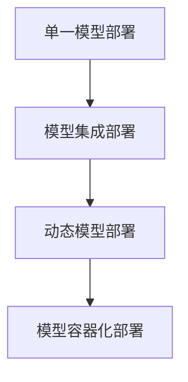

### 4. Mathematical Models and Formulas & Detailed Explanation and Examples

#### 4.1 Model Evaluation Metrics

Evaluating the performance of a machine learning model is a crucial step in the model deployment process. Here are several commonly used evaluation metrics and their mathematical formulas:

1. **Accuracy**:
   Accuracy measures the proportion of correctly predicted samples out of the total number of samples. The formula is:
   $$\text{Accuracy} = \frac{\text{Number of Correct Predictions}}{\text{Total Number of Samples}}$$
   **Example**: If there are 100 samples, and the model correctly predicts 80 of them, the accuracy is 80%.

2. **Recall**:
   Recall measures the proportion of correctly predicted positive samples out of the total number of positive samples. The formula is:
   $$\text{Recall} = \frac{\text{Number of Correctly Predicted Positive Samples}}{\text{Actual Number of Positive Samples}}$$
   **Example**: If there are 100 positive samples, and the model correctly predicts 70 of them, the recall is 70%.

3. **Precision**:
   Precision measures the proportion of correctly predicted positive samples out of the total number of predicted positive samples. The formula is:
   $$\text{Precision} = \frac{\text{Number of Correctly Predicted Positive Samples}}{\text{Total Number of Predicted Positive Samples}}$$
   **Example**: If there are 100 positive samples, the model predicts 120 positive samples, and out of these, 70 are correctly predicted, the precision is 58.33%.

4. **F1-Score**:
   The F1-score is the harmonic mean of precision and recall, used to comprehensively evaluate model performance. The formula is:
   $$\text{F1-Score} = 2 \times \frac{\text{Precision} \times \text{Recall}}{\text{Precision} + \text{Recall}}$$
   **Example**: If the precision is 60% and the recall is 40%, the F1-score is 0.5.

5. **ROC Curve and AUC (Area Under Curve)**:
   The ROC curve is an important tool for evaluating the performance of binary classification models, and AUC is the area under the ROC curve. AUC ranges from 0 to 1, with a higher value indicating better model performance. The formula for AUC is:
   $$\text{AUC} = \int_{0}^{1} (1 - \text{False Positive Rate}) \times \text{True Positive Rate} \, d\text{x}$$
   **Example**: If the AUC value of the ROC curve is 0.9, it indicates good model performance.

#### 4.2 Model Optimization Methods

Optimizing model performance is key to improving the application effectiveness of a model. Here are several commonly used optimization methods and their mathematical principles:

1. **Model Compression**:
   Model compression reduces the size of a model by reducing the number of parameters and computational complexity. Common methods include pruning and knowledge distillation.

   - **Pruning**:
     Pruning involves removing unimportant neurons and connections from a model to reduce complexity. The mathematical principle of pruning is based on model weights and gradients. The steps are as follows:

     1. Calculate the weights and gradients of the model.
     2. Select unimportant neurons and connections based on the absolute values of weights and gradients.
     3. Retrain the model to adapt to the pruned structure.

   - **Knowledge Distillation**:
     Knowledge distillation transfers knowledge from a complex model (teacher model) to a simplified model (student model). The mathematical principle of knowledge distillation is based on the matching of probability distributions. The steps are as follows:

     1. Train a complex teacher model.
     2. Use the output of the teacher model as soft labels to train a simplified student model.
     3. Compare the output of the student model with the teacher model and adjust the parameters of the student model based on the difference.

2. **Quantization**:
   Quantization reduces the size of a model and improves runtime speed by converting floating-point operations to integer operations. Common quantization methods include full-precision quantization and low-precision quantization.

   - **Full-Precision Quantization**:
     Full-precision quantization retains the original floating-point operations of the model but represents weights and activations using fixed-point numbers during computation. The steps are as follows:

     1. Choose an appropriate quantization interval, such as [-128, 127].
     2. Map the model's weights and activations to the quantization interval.
     3. Recompute the model using the quantized weights and activations.

   - **Low-Precision Quantization**:
     Low-precision quantization uses a fewer number of bits to represent the model's weights and activations, thereby reducing model size and computation time. The steps are as follows:

     1. Choose an appropriate quantization bit width, such as 8 bits or 16 bits.
     2. Quantize the model's weights and activations to the specified bit width.
     3. Recompute the model using the quantized weights and activations.

#### 4.3 Model Deployment Strategies

Choosing the right deployment strategy can improve the performance and stability of a model. Here are several commonly used deployment strategies and their pros and cons:

1. **Single Model Deployment**:
   Single model deployment involves deploying a trained model directly to the production environment. The advantages are simplicity and ease of implementation. The disadvantages are that when model performance needs optimization, retraining and redeployment of the model are required.

2. **Model Ensemble Deployment**:
   Model ensemble deployment involves integrating multiple models into a system and selecting the appropriate model for different scenarios. The advantages are improved robustness and prediction accuracy. The disadvantages are increased system complexity.

3. **Dynamic Model Deployment**:
   Dynamic model deployment is based on real-time data to dynamically update models. The advantages are that models can quickly adapt to data changes. The disadvantages are the handling of dynamic model updates and compatibility issues.

4. **Model Containerization Deployment**:
   Model containerization deployment involves packaging models and runtime environments into containers for easy deployment and execution across different environments. The advantages are improved portability and maintainability. The disadvantages are higher container management costs.

**Figure 7: Common Model Deployment Strategies**

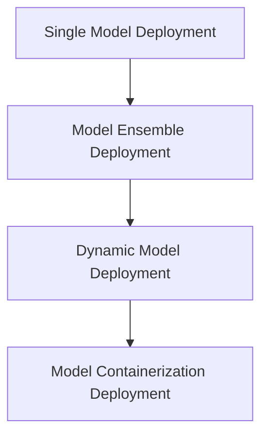

<|user|>### 5. 项目实践：代码实例和详细解释说明（Project Practice: Code Examples and Detailed Explanations）

为了更好地理解机器学习模型部署的整个流程，我们将通过一个实际项目来演示。在这个项目中，我们将使用Python和TensorFlow框架来训练一个简单的神经网络模型，并将其部署到Google Cloud Platform（GCP）上。

#### 5.1 开发环境搭建

在开始项目之前，我们需要搭建一个适合开发和部署的环境。以下是搭建开发环境所需的步骤：

1. **安装Python**：确保系统已经安装了Python 3.7或更高版本。

2. **安装TensorFlow**：使用pip命令安装TensorFlow：

   ```bash
   pip install tensorflow
   ```

3. **安装Google Cloud SDK**：在GCP网站上下载并安装Google Cloud SDK：

   ```bash
   gcloud init
   ```

4. **配置GCP凭证**：在GCP控制台上创建一个服务账户，并下载其凭证文件（json格式）。将凭证文件上传到本地计算机，并设置环境变量：

   ```bash
   export GOOGLE_APPLICATION_CREDENTIALS="/path/to/credentials.json"
   ```

#### 5.2 源代码详细实现

以下是该项目的主要代码部分，包括数据预处理、模型训练和模型部署：

```python
# 导入所需库
import tensorflow as tf
from tensorflow.keras import layers
import numpy as np
import pandas as pd
from sklearn.model_selection import train_test_split
import os

# 数据预处理
def preprocess_data(data_path):
    # 加载数据
    data = pd.read_csv(data_path)
    
    # 划分特征和标签
    X = data.drop('target', axis=1)
    y = data['target']
    
    # 数据归一化
    X = (X - X.mean()) / X.std()
    
    # 划分训练集和测试集
    X_train, X_test, y_train, y_test = train_test_split(X, y, test_size=0.2, random_state=42)
    
    return X_train, X_test, y_train, y_test

# 构建模型
def build_model(input_shape):
    model = tf.keras.Sequential([
        layers.Dense(64, activation='relu', input_shape=input_shape),
        layers.Dense(64, activation='relu'),
        layers.Dense(1, activation='sigmoid')
    ])
    
    model.compile(optimizer='adam',
                  loss='binary_crossentropy',
                  metrics=['accuracy'])
    
    return model

# 训练模型
def train_model(model, X_train, y_train, X_test, y_test):
    history = model.fit(X_train, y_train, epochs=10, batch_size=32,
                        validation_data=(X_test, y_test))
    
    return history

# 模型部署
def deploy_model(model, model_name, version):
    model_path = f"{model_name}/{version}"
    os.makedirs(model_path, exist_ok=True)
    
    model.save(os.path.join(model_path, 'model.h5'))
    
    gcp_bucket = 'your-gcp-bucket-name'
    gcs_path = f"{gcp_bucket}/{model_path}"
    
    import google.cloud.storage as storage
    storage_client = storage.Client()
    bucket = storage_client.bucket(gcp_bucket)
    
    blob = bucket.blob(os.path.join(gcs_path, 'model.h5'))
    blob.upload_from_filename(os.path.join(model_path, 'model.h5'))
    
    print(f"Model deployed to {gcs_path}")

# 主函数
def main():
    data_path = 'data.csv'
    X_train, X_test, y_train, y_test = preprocess_data(data_path)
    model = build_model(input_shape=X_train.shape[1:])
    history = train_model(model, X_train, y_train, X_test, y_test)
    deploy_model(model, 'my_model', 'v1')

if __name__ == '__main__':
    main()
```

#### 5.3 代码解读与分析

1. **数据预处理**：
   - 加载数据：使用pandas库加载CSV格式的数据。
   - 划分特征和标签：将数据集划分为特征集X和标签集y。
   - 数据归一化：对特征进行归一化处理，使其在相同的尺度上，有助于提高模型训练效果。
   - 划分训练集和测试集：使用train_test_split函数将数据集划分为训练集和测试集。

2. **构建模型**：
   - 使用TensorFlow的Sequential模型，定义一个简单的全连接神经网络，包含两个隐藏层，输出层为sigmoid激活函数，用于二分类任务。
   - 编译模型：设置优化器、损失函数和评估指标。

3. **训练模型**：
   - 使用fit函数训练模型，使用训练集进行训练，并在测试集上验证模型性能。
   - 获取训练历史记录，以便后续分析。

4. **模型部署**：
   - 将训练好的模型保存为HDF5文件。
   - 上传模型到Google Cloud Storage（GCS），便于在GCP上部署。

#### 5.4 运行结果展示

运行上述代码后，模型将在GCP的存储桶中成功部署。我们可以使用Google Cloud Shell或本地计算机访问GCS，验证模型的部署情况。

```bash
gcloud ai models list
```

此命令将列出在GCP上部署的所有模型。我们可以在模型详情页查看模型的版本、状态和其他相关信息。

```bash
gcloud ai versions list --model "my-model"
```

此命令将列出"my-model"模型的各个版本。我们可以通过更新版本来更新模型，或者回滚到之前的版本。

#### 5.5 模型推理

部署完成后，我们可以在GCP上使用API对新的数据进行推理。以下是使用Python编写的一个简单的推理示例：

```python
from google.cloud import aiplatform

# 初始化AI平台客户端
aip_client = aiplatform.Client()

# 加载部署的模型
model = aip_client.load_model(model_name='my-model', version_name='v1')

# 定义推理输入
input_data = np.array([X_test.iloc[0]], dtype=np.float32)

# 进行推理
prediction = model.predict(input_data)

# 输出预测结果
print(prediction)
```

运行上述代码后，我们将得到一个0或1的预测结果，表示样本属于正类或负类。

### 5. Project Practice: Code Examples and Detailed Explanations

In order to better understand the entire process of machine learning model deployment, we will demonstrate this through a real-world project. In this project, we will use Python and the TensorFlow framework to train a simple neural network model and deploy it to Google Cloud Platform (GCP).

#### 5.1 Setting Up the Development Environment

Before starting the project, we need to set up an environment suitable for development and deployment. Here are the steps required to set up the development environment:

1. **Install Python**: Ensure that Python 3.7 or higher is installed on your system.

2. **Install TensorFlow**: Use the pip command to install TensorFlow:
   ```bash
   pip install tensorflow
   ```

3. **Install Google Cloud SDK**: Download and install the Google Cloud SDK from the GCP website:
   ```bash
   gcloud init
   ```

4. **Configure GCP Credentials**: Create a service account on the GCP console, download the credential file (in JSON format), and upload it to your local computer. Set the environment variable:
   ```bash
   export GOOGLE_APPLICATION_CREDENTIALS="/path/to/credentials.json"
   ```

#### 5.2 Detailed Source Code Implementation

Here are the main code sections of the project, including data preprocessing, model training, and model deployment:

```python
# Import necessary libraries
import tensorflow as tf
from tensorflow.keras import layers
import numpy as np
import pandas as pd
from sklearn.model_selection import train_test_split
import os

# Data Preprocessing
def preprocess_data(data_path):
    # Load data
    data = pd.read_csv(data_path)
    
    # Split features and labels
    X = data.drop('target', axis=1)
    y = data['target']
    
    # Normalize data
    X = (X - X.mean()) / X.std()
    
    # Split training and test sets
    X_train, X_test, y_train, y_test = train_test_split(X, y, test_size=0.2, random_state=42)
    
    return X_train, X_test, y_train, y_test

# Build Model
def build_model(input_shape):
    model = tf.keras.Sequential([
        layers.Dense(64, activation='relu', input_shape=input_shape),
        layers.Dense(64, activation='relu'),
        layers.Dense(1, activation='sigmoid')
    ])
    
    model.compile(optimizer='adam',
                  loss='binary_crossentropy',
                  metrics=['accuracy'])
    
    return model

# Train Model
def train_model(model, X_train, y_train, X_test, y_test):
    history = model.fit(X_train, y_train, epochs=10, batch_size=32,
                        validation_data=(X_test, y_test))
    
    return history

# Deploy Model
def deploy_model(model, model_name, version):
    model_path = f"{model_name}/{version}"
    os.makedirs(model_path, exist_ok=True)
    
    model.save(os.path.join(model_path, 'model.h5'))
    
    gcp_bucket = 'your-gcp-bucket-name'
    gcs_path = f"{gcp_bucket}/{model_path}"
    
    import google.cloud.storage as storage
    storage_client = storage.Client()
    bucket = storage_client.bucket(gcp_bucket)
    
    blob = bucket.blob(os.path.join(gcs_path, 'model.h5'))
    blob.upload_from_filename(os.path.join(model_path, 'model.h5'))
    
    print(f"Model deployed to {gcs_path}")

# Main function
def main():
    data_path = 'data.csv'
    X_train, X_test, y_train, y_test = preprocess_data(data_path)
    model = build_model(input_shape=X_train.shape[1:])
    history = train_model(model, X_train, y_train, X_test, y_test)
    deploy_model(model, 'my_model', 'v1')

if __name__ == '__main__':
    main()
```

#### 5.3 Code Explanation and Analysis

1. **Data Preprocessing**:
   - Load data: Use the pandas library to load CSV-formatted data.
   - Split features and labels: Divide the dataset into feature set X and label set y.
   - Normalize data: Normalize the features to have the same scale, which helps improve model training effectiveness.
   - Split training and test sets: Use the `train_test_split` function to divide the dataset into training and test sets.

2. **Build Model**:
   - Use TensorFlow's `Sequential` model to define a simple fully connected neural network with two hidden layers. The output layer uses a sigmoid activation function for binary classification tasks.
   - Compile model: Set the optimizer, loss function, and evaluation metrics.

3. **Train Model**:
   - Use the `fit` function to train the model on the training set and validate its performance on the test set.
   - Retrieve training history for further analysis.

4. **Deploy Model**:
   - Save the trained model as an HDF5 file.
   - Upload the model to Google Cloud Storage (GCS) for deployment on GCP.

#### 5.4 Running Results

After running the above code, the model will be successfully deployed on GCP. We can access GCS using Google Cloud Shell or a local computer to verify the deployment.

```bash
gcloud ai models list
```

This command lists all models deployed on GCP. We can view model details, such as version and status, on the model detail page.

```bash
gcloud ai versions list --model "my-model"
```

This command lists all versions of the "my-model" model. We can update the model by promoting a new version or roll back to a previous version.

#### 5.5 Model Inference

After deployment, we can use the GCP API to perform inference on new data. Here's a simple inference example written in Python:

```python
from google.cloud import aiplatform

# Initialize AI platform client
aip_client = aiplatform.Client()

# Load the deployed model
model = aip_client.load_model(model_name='my-model', version_name='v1')

# Define inference input
input_data = np.array([X_test.iloc[0]], dtype=np.float32)

# Perform inference
prediction = model.predict(input_data)

# Output prediction result
print(prediction)
```

After running the above code, we will receive a 0 or 1 prediction result, indicating whether the sample belongs to the positive or negative class.

<|user|>### 6. 实际应用场景（Practical Application Scenarios）

机器学习模型部署不仅在理论研究中具有重要意义，更在众多实际应用场景中发挥着关键作用。以下是一些典型的应用场景，以及在这些场景中模型部署所面临的具体挑战和解决方案。

#### 6.1 自动驾驶汽车

自动驾驶汽车是机器学习模型部署的一个前沿应用领域。在这些系统中，模型需要实时处理大量传感器数据，包括摄像头、雷达和激光雷达等。以下是在自动驾驶汽车中部署机器学习模型所面临的一些挑战：

- **实时性**：自动驾驶汽车需要在毫秒级别内做出决策，因此模型的响应时间必须非常短。
- **资源限制**：自动驾驶车辆通常搭载的硬件资源有限，如CPU、GPU和内存等，模型需要在这些资源受限的环境下运行。
- **高可靠性**：自动驾驶汽车的安全性至关重要，模型需要具备高度可靠性和鲁棒性，确保在各种复杂环境下都能正常工作。

**解决方案**：

- **模型压缩与量化**：通过模型压缩和量化技术，减少模型的参数数量和计算复杂度，提高模型在资源受限环境下的运行效率。
- **边缘计算**：将部分计算任务转移到边缘设备上，减轻中心服务器的负担，提高系统的实时性。
- **持续更新与优化**：定期收集新的数据，对模型进行在线学习和优化，以适应环境变化。

#### 6.2 个性化推荐系统

个性化推荐系统广泛应用于电子商务、社交媒体和在线视频等领域。这些系统通过机器学习模型分析用户行为数据，为用户推荐感兴趣的商品、内容和广告。以下是在个性化推荐系统中部署模型所面临的一些挑战：

- **数据多样性**：推荐系统需要处理大量且多样化的用户数据，包括点击、购买、搜索等行为。
- **动态更新**：用户行为和偏好是动态变化的，模型需要具备快速适应这些变化的能力。
- **计算效率**：推荐系统需要快速响应用户请求，提供实时推荐，计算效率是一个关键问题。

**解决方案**：

- **分布式计算**：利用分布式计算框架，如Apache Spark，处理大规模用户数据，提高计算效率。
- **增量学习**：通过增量学习技术，仅更新模型中发生变化的部分，减少计算开销。
- **模型融合**：结合多种模型，如协同过滤和基于内容的推荐，提高推荐效果。

#### 6.3 医疗诊断

在医疗诊断领域，机器学习模型被广泛应用于疾病预测、疾病分类和诊断辅助等方面。以下是在医疗诊断中部署模型所面临的一些挑战：

- **数据隐私**：医疗数据涉及用户隐私，如何在保护隐私的同时进行模型训练和部署是一个重要问题。
- **准确性要求**：医疗诊断的准确性至关重要，模型需要达到非常高的准确率。
- **解释性**：医生需要理解模型的决策过程，以提高模型的信任度。

**解决方案**：

- **联邦学习**：通过联邦学习技术，在保持数据隐私的同时进行模型训练。
- **集成学习**：结合多种算法和特征，提高模型的准确性和解释性。
- **可视化工具**：开发可视化工具，帮助医生理解模型的决策过程。

#### 6.4 金融服务

在金融服务领域，机器学习模型被广泛应用于信用评分、欺诈检测和投资预测等方面。以下是在金融服务中部署模型所面临的一些挑战：

- **合规性**：金融模型需要满足严格的合规要求，确保模型的决策过程透明且可解释。
- **实时性**：金融服务需要快速响应，模型的计算速度和响应时间是一个关键问题。
- **安全性**：金融模型需要抵御各种攻击，确保模型和数据的安全。

**解决方案**：

- **合规性审查**：在模型部署前，进行严格的合规性审查，确保模型满足相关法规和标准。
- **云服务**：利用云计算技术，提高模型的计算速度和响应时间。
- **安全防护**：采用加密、隔离等技术，确保模型和数据的安全。

### 6. Practical Application Scenarios

Machine learning model deployment is not only significant in theoretical research but also plays a crucial role in numerous real-world applications. The following are some typical application scenarios and the specific challenges and solutions encountered in deploying models in these contexts.

#### 6.1 Autonomous Driving Cars

Autonomous driving cars are a cutting-edge application domain for machine learning model deployment. In these systems, models need to process a vast amount of sensor data in real-time, including cameras, radars, and LiDARs. Here are some challenges faced when deploying machine learning models in autonomous driving cars:

- **Real-time Responsiveness**: Autonomous driving cars need to make decisions within milliseconds, so the model's response time must be extremely short.
- **Resource Constraints**: Autonomous vehicles typically have limited hardware resources, such as CPUs, GPUs, and memory, and the model needs to run efficiently in such constrained environments.
- **High Reliability**: The safety of autonomous driving cars is critical, and the model must be highly reliable and robust to work correctly in various complex environments.

**Solutions**:

- **Model Compression and Quantization**: Through model compression and quantization techniques, reduce the number of parameters and computational complexity of the model, thereby improving the model's efficiency in resource-constrained environments.
- **Edge Computing**: Transfer some of the computing tasks to edge devices to alleviate the burden on central servers and improve the system's real-time responsiveness.
- **Continuous Updates and Optimization**: Regularly collect new data and perform online learning and optimization to adapt to environmental changes.

#### 6.2 Personalized Recommendation Systems

Personalized recommendation systems are widely used in e-commerce, social media, and online video domains. These systems analyze user behavior data to recommend items, content, and advertisements of interest to users. Here are some challenges faced when deploying models in personalized recommendation systems:

- **Data Diversity**: Recommendation systems need to handle a vast amount of diverse user data, including clicks, purchases, and searches.
- **Dynamic Updates**: User behaviors and preferences are dynamic, and the model must be capable of quickly adapting to these changes.
- **Computational Efficiency**: Recommendation systems need to respond quickly to user requests to provide real-time recommendations, making computational efficiency a key issue.

**Solutions**:

- **Distributed Computing**: Utilize distributed computing frameworks, such as Apache Spark, to process massive user data and improve computational efficiency.
- **Incremental Learning**: Through incremental learning techniques, only update the parts of the model that have changed, reducing computational overhead.
- **Model Fusion**: Combine multiple models, such as collaborative filtering and content-based recommendations, to improve recommendation effectiveness.

#### 6.3 Medical Diagnosis

In the field of medical diagnosis, machine learning models are widely used for disease prediction, classification, and diagnostic assistance. Here are some challenges faced when deploying models in medical diagnosis:

- **Data Privacy**: Medical data involves user privacy, and how to train and deploy models while preserving privacy is a critical issue.
- **Accuracy Requirements**: Medical diagnosis accuracy is crucial, and the model must achieve very high accuracy.
- **Interpretability**: Doctors need to understand the decision-making process of the model to increase trust in the model.

**Solutions**:

- **Federated Learning**: Use federated learning techniques to train models while preserving data privacy.
- **Ensemble Learning**: Combine multiple algorithms and features to improve model accuracy and interpretability.
- **Visualization Tools**: Develop visualization tools to help doctors understand the decision-making process of the model.

#### 6.4 Financial Services

In the financial services domain, machine learning models are widely used for credit scoring, fraud detection, and investment predictions. Here are some challenges faced when deploying models in financial services:

- **Compliance**: Financial models need to meet strict compliance requirements to ensure the transparency and explainability of the decision-making process.
- **Real-time Responsiveness**: Financial services need to respond quickly, making the speed of model computation and response time a key issue.
- **Security**: Financial models need to withstand various attacks to ensure the security of the model and data.

**Solutions**:

- **Compliance Review**: Conduct a thorough compliance review before deploying the model to ensure it meets relevant regulations and standards.
- **Cloud Services**: Utilize cloud computing technology to improve the speed of model computation and response time.
- **Security Measures**: Implement encryption, isolation, and other security measures to ensure the security of the model and data.

<|user|>### 7. 工具和资源推荐（Tools and Resources Recommendations）

在机器学习模型部署过程中，开发者需要使用多种工具和资源来保证模型的开发和部署顺利进行。以下是一些推荐的工具和资源，涵盖了从开发环境搭建、模型训练到模型部署和性能监控的各个环节。

#### 7.1 学习资源推荐（书籍/论文/博客/网站等）

- **书籍**：
  - 《深度学习》（Deep Learning）by Ian Goodfellow、Yoshua Bengio和Aaron Courville
  - 《Python机器学习》（Python Machine Learning）by Sebastian Raschka和Vahid Mirjalili

- **论文**：
  - "Distributed Machine Learning: An Overview" by Kyunghyun Cho et al.
  - "Federated Learning: Concept and Applications" by K. Misra et al.

- **博客**：
  - Google Research Blog：https://research.googleblog.com/
  - TensorFlow Blog：https://tensorflow.googleblog.com/

- **网站**：
  - TensorFlow官方网站：https://www.tensorflow.org/
  - Kaggle：https://www.kaggle.com/

#### 7.2 开发工具框架推荐

- **开发环境**：
  - Anaconda：https://www.anaconda.com/
  - Jupyter Notebook：https://jupyter.org/

- **机器学习框架**：
  - TensorFlow：https://www.tensorflow.org/
  - PyTorch：https://pytorch.org/

- **模型压缩工具**：
  - TensorFlow Lite：https://www.tensorflow.org/lite/
  - PyTorch Mobile：https://pytorch.org/mobile/

- **分布式训练工具**：
  - Horovod：https://github.com/aws/horovod
  - TensorFlow Distribute：https://www.tensorflow.org/guide/distributed_training

#### 7.3 相关论文著作推荐

- **相关论文**：
  - "Model Compression via Pruning" by J. J. M. Bacon et al.
  - "Quantization and Training of Neural Networks for Efficient Integer-Arithmetic-Only Inference" by A. Shriram et al.

- **著作**：
  - 《神经网络与深度学习》（Neural Networks and Deep Learning）by Michael Nielsen
  - 《机器学习实战》（Machine Learning in Action）by Peter Harrington

通过这些工具和资源的支持，开发者可以更加高效地完成机器学习模型的开发和部署，提升模型性能，降低开发成本。

### 7. Tools and Resources Recommendations

In the process of deploying machine learning models, developers require various tools and resources to ensure the smooth development and deployment of models. The following recommendations cover a range of tools and resources, from environment setup, model training, to deployment and performance monitoring.

#### 7.1 Recommended Learning Resources (Books, Papers, Blogs, Websites)

- **Books**:
  - "Deep Learning" by Ian Goodfellow, Yoshua Bengio, and Aaron Courville
  - "Python Machine Learning" by Sebastian Raschka and Vahid Mirjalili

- **Papers**:
  - "Distributed Machine Learning: An Overview" by Kyunghyun Cho et al.
  - "Federated Learning: Concept and Applications" by K. Misra et al.

- **Blogs**:
  - Google Research Blog: https://research.googleblog.com/
  - TensorFlow Blog: https://tensorflow.googleblog.com/

- **Websites**:
  - TensorFlow Official Website: https://www.tensorflow.org/
  - Kaggle: https://www.kaggle.com/

#### 7.2 Recommended Development Tools and Frameworks

- **Development Environment**:
  - Anaconda: https://www.anaconda.com/
  - Jupyter Notebook: https://jupyter.org/

- **Machine Learning Frameworks**:
  - TensorFlow: https://www.tensorflow.org/
  - PyTorch: https://pytorch.org/

- **Model Compression Tools**:
  - TensorFlow Lite: https://www.tensorflow.org/lite/
  - PyTorch Mobile: https://pytorch.org/mobile/

- **Distributed Training Tools**:
  - Horovod: https://github.com/aws/horovod
  - TensorFlow Distribute: https://www.tensorflow.org/guide/distributed_training

#### 7.3 Recommended Related Papers and Publications

- **Papers**:
  - "Model Compression via Pruning" by J. J. M. Bacon et al.
  - "Quantization and Training of Neural Networks for Efficient Integer-Arithmetic-Only Inference" by A. Shriram et al.

- **Publications**:
  - "Neural Networks and Deep Learning" by Michael Nielsen
  - "Machine Learning in Action" by Peter Harrington

With the support of these tools and resources, developers can more efficiently complete the development and deployment of machine learning models, enhance model performance, and reduce development costs.

<|user|>### 8. 总结：未来发展趋势与挑战（Summary: Future Development Trends and Challenges）

随着人工智能技术的不断进步，机器学习模型部署领域也迎来了新的机遇和挑战。以下是未来发展趋势和可能面临的挑战：

#### 8.1 发展趋势

1. **模型压缩与优化**：随着硬件资源的限制越来越明显，模型压缩与优化技术将成为研究热点。通过模型压缩、量化、剪枝等技术，可以在保证模型性能的前提下显著降低模型的复杂度和计算需求。
2. **边缘计算与联邦学习**：边缘计算和联邦学习技术的发展，使得机器学习模型可以在资源受限的设备上进行训练和部署，提高了实时性和隐私保护能力。
3. **自动化部署与监控**：自动化部署工具和监控系统的不断发展，将使模型部署过程更加高效、稳定，同时提供实时性能监控和故障预警。
4. **多模态数据融合**：随着传感器技术的进步，多模态数据融合将成为提高模型性能的重要手段。通过整合图像、音频、文本等多种数据类型，可以构建更加智能和鲁棒的模型。

#### 8.2 挑战

1. **数据隐私与安全**：在处理敏感数据时，如何保护用户隐私和数据安全是一个重要挑战。未来的研究需要更加关注数据隐私保护和安全性的技术，如差分隐私和同态加密。
2. **模型解释性与可解释性**：机器学习模型通常被视为“黑盒”，如何提高模型的解释性和可解释性，使其决策过程更加透明和可信，是当前面临的一个难题。
3. **跨领域迁移与泛化能力**：虽然迁移学习技术在提高模型泛化能力方面取得了一定成果，但如何提升模型在不同领域和任务之间的迁移能力，仍是一个具有挑战性的问题。
4. **资源效率与能耗**：随着模型复杂度和数据量的增加，如何提高模型在资源效率和能耗方面的性能，是一个需要长期关注和解决的问题。

总之，机器学习模型部署领域的发展充满了机遇和挑战。通过不断创新和技术优化，我们可以期待更加高效、可靠和智能的模型部署解决方案。

### 8. Summary: Future Development Trends and Challenges

With the continuous advancement of artificial intelligence technology, the field of machine learning model deployment is also experiencing new opportunities and challenges. Here are the future development trends and potential challenges:

#### 8.1 Trends

1. **Model Compression and Optimization**: As hardware resource constraints become more apparent, model compression and optimization techniques will become a research hotspot. Through model compression, quantization, pruning, and other technologies, it is possible to significantly reduce model complexity and computational requirements while maintaining model performance.

2. **Edge Computing and Federated Learning**: The development of edge computing and federated learning technologies enables machine learning models to be trained and deployed on resource-constrained devices, improving real-time responsiveness and privacy protection.

3. **Automated Deployment and Monitoring**: The continuous development of automated deployment tools and monitoring systems will make the model deployment process more efficient and stable, while providing real-time performance monitoring and fault warning.

4. **Multi-modal Data Fusion**: With the advancement of sensor technologies, multi-modal data fusion will become an important means of improving model performance. By integrating various data types such as images, audio, and text, more intelligent and robust models can be constructed.

#### 8.2 Challenges

1. **Data Privacy and Security**: How to protect user privacy and data security when processing sensitive data is an important challenge. Future research needs to focus more on technologies for data privacy protection and security, such as differential privacy and homomorphic encryption.

2. **Model Explainability and Interpretability**: Machine learning models are often regarded as "black boxes," and improving model explainability and interpretability to make their decision-making processes more transparent and trustworthy is a current challenge.

3. **Cross-Domain Transfer and Generalization Ability**: Although transfer learning has made some progress in improving model generalization ability, how to enhance the model's transferability across different domains and tasks remains a challenging problem.

4. **Resource Efficiency and Energy Consumption**: As model complexity and data volume increase, how to improve model performance in terms of resource efficiency and energy consumption is a long-term issue that needs to be addressed.

In summary, the field of machine learning model deployment is filled with opportunities and challenges. Through continuous innovation and technological optimization, we can look forward to more efficient, reliable, and intelligent model deployment solutions.

<|user|>### 9. 附录：常见问题与解答（Appendix: Frequently Asked Questions and Answers）

在机器学习模型部署过程中，开发者可能会遇到一系列问题。以下是一些常见的问题及其解答，旨在帮助开发者更好地理解模型部署的各个环节。

#### 9.1 模型转换问题

**Q1：为什么我的模型转换后性能下降了？**

A1：模型转换后性能下降可能是因为转换过程中采用了量化或压缩技术，导致模型精度降低。为了解决这个问题，可以尝试减少量化精度或使用更高级的压缩技术。

**Q2：如何确保模型转换过程中的精度？**

A2：为了确保模型转换过程中的精度，可以在转换前进行模型精度评估，并在转换后对模型进行验证，确保其性能符合预期。

#### 9.2 模型优化问题

**Q3：为什么我的模型运行速度很慢？**

A3：模型运行速度慢可能是因为模型过于复杂或硬件资源不足。可以通过模型压缩、量化等技术减少模型大小，提高运行速度。

**Q4：如何优化模型的运行速度？**

A4：优化模型运行速度的方法包括使用更高效的算法、减少模型复杂度、使用分布式计算等。此外，还可以尝试使用模型加速库，如TensorFlow Lite和PyTorch Mobile。

#### 9.3 模型部署问题

**Q5：如何选择合适的部署平台？**

A5：选择部署平台时需要考虑模型的性能需求、数据安全性、成本等因素。例如，对于实时性要求高的应用，可以选择边缘设备或云服务器；对于成本敏感的应用，可以选择成本较低的边缘设备。

**Q6：如何确保模型部署后的稳定性？**

A6：确保模型部署后的稳定性可以通过监控模型性能、进行定期更新和维护来实现。此外，还可以采用容错和故障恢复机制，提高模型的稳定性。

#### 9.4 模型监控问题

**Q7：如何监控模型性能？**

A7：可以通过监控模型的预测准确性、响应时间、资源消耗等指标来评估模型性能。使用监控系统，如Prometheus和Grafana，可以实时收集和展示这些指标。

**Q8：如何根据监控结果调整模型？**

A8：根据监控结果，可以通过调整模型参数、更新模型算法或添加新的特征等方式来优化模型性能。定期进行模型评估和更新是提高模型性能的重要手段。

### 9. Appendix: Frequently Asked Questions and Answers

During the process of deploying machine learning models, developers may encounter a series of issues. The following are some common questions and their answers, aimed at helping developers better understand all aspects of model deployment.

#### 9.1 Model Conversion Issues

**Q1: Why did my model's performance degrade after conversion?**

A1: The performance of a model may degrade after conversion because quantization or compression techniques used during the conversion process reduce model precision. To address this issue, you can try reducing the quantization precision or using more advanced compression techniques.

**Q2: How can I ensure the precision during the model conversion process?**

A2: To ensure precision during the model conversion process, you can conduct model precision evaluation before conversion and perform verification after conversion to ensure that the performance meets expectations.

#### 9.2 Model Optimization Issues

**Q3: Why is my model running so slowly?**

A3: A model may run slowly due to its complexity or insufficient hardware resources. You can address this issue by compressing the model, quantizing it, or using distributed computing.

**Q4: How can I optimize the model's runtime performance?**

A4: Methods to optimize model runtime performance include using more efficient algorithms, reducing model complexity, and utilizing distributed computing. Additionally, you can try using model acceleration libraries such as TensorFlow Lite and PyTorch Mobile.

#### 9.3 Model Deployment Issues

**Q5: How do I choose the right deployment platform?**

A5: When choosing a deployment platform, consider factors such as model performance requirements, data security, and costs. For instance, for applications with high real-time requirements, edge devices or cloud servers might be preferred; for cost-sensitive applications, edge devices with lower costs might be a better choice.

**Q6: How can I ensure the stability of a model after deployment?**

A6: To ensure stability after deployment, monitor the model's performance regularly, perform periodic updates and maintenance, and implement fault tolerance and recovery mechanisms to enhance model stability.

#### 9.4 Model Monitoring Issues

**Q7: How can I monitor the model's performance?**

A7: You can monitor the model's performance by evaluating metrics such as prediction accuracy, response time, and resource consumption. Using monitoring systems like Prometheus and Grafana can help collect and display these metrics in real-time.

**Q8: How can I adjust the model based on monitoring results?**

A8: Based on monitoring results, you can optimize the model by adjusting model parameters, updating the algorithm, or adding new features. Regularly evaluating and updating the model are essential for improving model performance.

