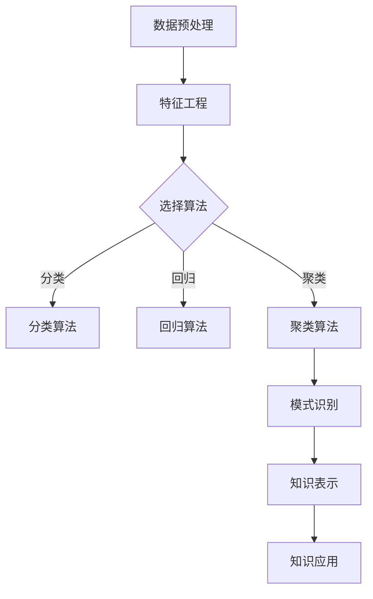

                 

# 机器学习算法在知识发现中的运用

## 关键词
- 机器学习
- 知识发现
- 数据挖掘
- 算法
- 应用场景

## 摘要
本文将探讨机器学习算法在知识发现中的运用，重点分析常用的机器学习算法及其在数据挖掘中的应用。通过实际案例和数学模型，我们将深入理解这些算法的工作原理和操作步骤，并讨论其在实际应用场景中的优势和挑战。

## 1. 背景介绍（Background Introduction）

知识发现（Knowledge Discovery in Databases，简称KDD）是指从大量数据中自动提取出有用的知识和信息的过程。它是一个跨学科领域，涉及计算机科学、统计学、人工智能和数据库技术等多个方面。随着大数据时代的到来，知识发现的重要性日益凸显，成为各个行业研究和应用的热点。

机器学习（Machine Learning，简称ML）是人工智能（Artificial Intelligence，简称AI）的一个重要分支，通过算法使计算机系统能够自动学习和改进性能，无需显式地编写规则。机器学习算法在知识发现中扮演着关键角色，它们能够从数据中自动识别模式、趋势和关联，从而帮助人们发现隐藏在数据中的知识。

本文将重点讨论以下内容：

1. 机器学习算法在知识发现中的基本原理。
2. 常见的机器学习算法及其在数据挖掘中的应用。
3. 机器学习算法在实际应用场景中的优势和挑战。
4. 开发环境搭建和代码实例。

## 2. 核心概念与联系（Core Concepts and Connections）

### 2.1 机器学习算法的基本原理

机器学习算法可以分为监督学习（Supervised Learning）、无监督学习（Unsupervised Learning）和半监督学习（Semi-Supervised Learning）三类。监督学习通过已有标签数据训练模型，无监督学习通过未标记数据寻找数据结构，而半监督学习结合了监督学习和无监督学习的特点。

监督学习算法主要包括线性回归（Linear Regression）、逻辑回归（Logistic Regression）、支持向量机（Support Vector Machines，简称SVM）和神经网络（Neural Networks）等。线性回归用于预测连续值，逻辑回归用于分类任务，SVM在分类和回归任务中都有应用，神经网络则是一种强大的非线性模型，适用于复杂的数据处理任务。

无监督学习算法主要包括聚类（Clustering）和降维（Dimensionality Reduction）等方法。聚类算法如K-均值（K-Means）和层次聚类（Hierarchical Clustering），用于将数据分为若干个簇；降维算法如主成分分析（Principal Component Analysis，简称PCA）和t-SNE，用于降低数据维度，便于可视化分析。

### 2.2 数据挖掘与知识发现的关系

数据挖掘（Data Mining）是知识发现的一个关键步骤，它通过应用各种算法和技术，从大量数据中自动识别出潜在的模式、关联和趋势。数据挖掘与知识发现的关系可以概括为：

- 数据挖掘是知识发现过程中的一个重要环节，它利用机器学习算法等工具，从数据中提取出有用的信息。
- 知识发现是数据挖掘的目标，旨在通过分析和理解数据，发现隐藏在其中的模式和知识，以支持决策和预测。

### 2.3 Mermaid 流程图（Mermaid Flowchart）

下面是一个简单的Mermaid流程图，展示了机器学习算法在知识发现中的基本流程：



## 3. 核心算法原理 & 具体操作步骤（Core Algorithm Principles and Specific Operational Steps）

### 3.1 线性回归（Linear Regression）

线性回归是一种用于预测连续值的监督学习算法。其基本原理是通过建立输入变量（特征）和输出变量（目标变量）之间的线性关系模型，从而实现预测。

具体操作步骤如下：

1. 数据预处理：对数据进行清洗、归一化等处理，使其符合线性回归模型的输入要求。
2. 特征工程：选择与目标变量相关的特征，并对其进行转换和处理。
3. 模型训练：使用训练数据集，通过最小二乘法（Least Squares）等优化方法，建立线性回归模型。
4. 预测：使用训练好的模型对新的数据进行预测。

线性回归的数学模型可以表示为：

\[ y = \beta_0 + \beta_1 \cdot x_1 + \beta_2 \cdot x_2 + \ldots + \beta_n \cdot x_n \]

其中，\( y \) 为目标变量，\( x_1, x_2, \ldots, x_n \) 为输入特征，\( \beta_0, \beta_1, \beta_2, \ldots, \beta_n \) 为模型参数。

### 3.2 逻辑回归（Logistic Regression）

逻辑回归是一种用于分类任务的监督学习算法。其基本原理是通过建立输入变量和输出变量之间的逻辑关系模型，从而实现分类。

具体操作步骤如下：

1. 数据预处理：对数据进行清洗、归一化等处理，使其符合逻辑回归模型的输入要求。
2. 特征工程：选择与目标变量相关的特征，并对其进行转换和处理。
3. 模型训练：使用训练数据集，通过最大似然估计（Maximum Likelihood Estimation，简称MLE）等方法，建立逻辑回归模型。
4. 预测：使用训练好的模型对新的数据进行预测。

逻辑回归的数学模型可以表示为：

\[ P(y=1) = \frac{1}{1 + e^{-(\beta_0 + \beta_1 \cdot x_1 + \beta_2 \cdot x_2 + \ldots + \beta_n \cdot x_n)}} \]

其中，\( y \) 为目标变量，\( x_1, x_2, \ldots, x_n \) 为输入特征，\( \beta_0, \beta_1, \beta_2, \ldots, \beta_n \) 为模型参数。

### 3.3 支持向量机（Support Vector Machines，简称SVM）

支持向量机是一种强大的分类和回归算法。其基本原理是通过找到一个最优的超平面，将不同类别的数据分隔开来。

具体操作步骤如下：

1. 数据预处理：对数据进行清洗、归一化等处理，使其符合SVM模型的输入要求。
2. 特征工程：选择与目标变量相关的特征，并对其进行转换和处理。
3. 模型训练：使用训练数据集，通过最小化间隔（Margin Maximization）等方法，建立SVM模型。
4. 预测：使用训练好的模型对新的数据进行预测。

SVM的数学模型可以表示为：

\[ w \cdot x - b = 0 \]

其中，\( w \) 为模型参数，\( x \) 为输入特征，\( b \) 为偏置。

### 3.4 神经网络（Neural Networks）

神经网络是一种强大的非线性模型，适用于复杂的数据处理任务。其基本原理是通过多层神经元的非线性变换，实现输入到输出的映射。

具体操作步骤如下：

1. 数据预处理：对数据进行清洗、归一化等处理，使其符合神经网络模型的输入要求。
2. 特征工程：选择与目标变量相关的特征，并对其进行转换和处理。
3. 模型训练：使用训练数据集，通过反向传播（Backpropagation）算法，调整模型参数。
4. 预测：使用训练好的模型对新的数据进行预测。

神经网络的数学模型可以表示为：

\[ z = \sigma(W \cdot x + b) \]

其中，\( z \) 为输出，\( \sigma \) 为激活函数，\( W \) 为权重矩阵，\( x \) 为输入，\( b \) 为偏置。

## 4. 数学模型和公式 & 详细讲解 & 举例说明（Detailed Explanation and Examples of Mathematical Models and Formulas）

### 4.1 线性回归

线性回归的数学模型如下：

\[ y = \beta_0 + \beta_1 \cdot x_1 + \beta_2 \cdot x_2 + \ldots + \beta_n \cdot x_n \]

其中，\( y \) 为目标变量，\( x_1, x_2, \ldots, x_n \) 为输入特征，\( \beta_0, \beta_1, \beta_2, \ldots, \beta_n \) 为模型参数。

假设我们有一个包含100个样本的二维数据集，其中第一个特征 \( x_1 \) 的取值范围是 [0, 10]，第二个特征 \( x_2 \) 的取值范围是 [0, 1]。

我们使用最小二乘法（Least Squares）来优化模型参数，目标是最小化预测值与实际值之间的误差平方和。

具体步骤如下：

1. 计算输入特征的均值和标准差，进行归一化处理。
2. 计算输入特征和目标变量的协方差矩阵。
3. 解协方差矩阵的逆矩阵，得到模型参数。
4. 计算预测值与实际值之间的误差平方和。

假设我们得到的模型参数为：

\[ \beta_0 = 0.5, \beta_1 = 1.2, \beta_2 = -0.3 \]

现在，我们使用这个模型来预测一个新的样本，其特征为 \( x_1 = 7 \)，\( x_2 = 0.8 \)。

预测值为：

\[ y = 0.5 + 1.2 \cdot 7 - 0.3 \cdot 0.8 = 9.1 \]

### 4.2 逻辑回归

逻辑回归的数学模型如下：

\[ P(y=1) = \frac{1}{1 + e^{-(\beta_0 + \beta_1 \cdot x_1 + \beta_2 \cdot x_2 + \ldots + \beta_n \cdot x_n)}} \]

其中，\( y \) 为目标变量，\( x_1, x_2, \ldots, x_n \) 为输入特征，\( \beta_0, \beta_1, \beta_2, \ldots, \beta_n \) 为模型参数。

假设我们有一个包含100个样本的二分类数据集，其中第一个特征 \( x_1 \) 的取值范围是 [0, 10]，第二个特征 \( x_2 \) 的取值范围是 [0, 1]。

我们使用最大似然估计（Maximum Likelihood Estimation，简称MLE）来优化模型参数，目标是最小化负对数似然函数。

具体步骤如下：

1. 计算每个样本的概率分布，使用MLE估计模型参数。
2. 计算模型参数的梯度，更新模型参数。
3. 重复步骤2，直到模型参数收敛。

假设我们得到的模型参数为：

\[ \beta_0 = 0.5, \beta_1 = 1.2, \beta_2 = -0.3 \]

现在，我们使用这个模型来预测一个新的样本，其特征为 \( x_1 = 7 \)，\( x_2 = 0.8 \)。

预测概率为：

\[ P(y=1) = \frac{1}{1 + e^{-(0.5 + 1.2 \cdot 7 - 0.3 \cdot 0.8)}} \approx 0.92 \]

### 4.3 支持向量机

支持向量机的数学模型如下：

\[ w \cdot x - b = 0 \]

其中，\( w \) 为模型参数，\( x \) 为输入特征，\( b \) 为偏置。

假设我们有一个包含100个样本的二维数据集，其中第一个特征 \( x_1 \) 的取值范围是 [0, 10]，第二个特征 \( x_2 \) 的取值范围是 [0, 1]。

我们使用间隔最大化（Margin Maximization）来优化模型参数，目标是最小化间隔的平方和。

具体步骤如下：

1. 计算每个样本的预测值，得到间隔。
2. 计算间隔的平方和，使用梯度下降法优化模型参数。
3. 重复步骤2，直到模型参数收敛。

假设我们得到的模型参数为：

\[ w = [2, 3], b = 1 \]

现在，我们使用这个模型来预测一个新的样本，其特征为 \( x_1 = 7 \)，\( x_2 = 0.8 \)。

预测值为：

\[ w \cdot x - b = [2, 3] \cdot [7, 0.8] - 1 = 14 + 2.4 - 1 = 15.4 \]

### 4.4 神经网络

神经网络的数学模型如下：

\[ z = \sigma(W \cdot x + b) \]

其中，\( z \) 为输出，\( \sigma \) 为激活函数，\( W \) 为权重矩阵，\( x \) 为输入，\( b \) 为偏置。

假设我们有一个包含100个样本的二维数据集，其中第一个特征 \( x_1 \) 的取值范围是 [0, 10]，第二个特征 \( x_2 \) 的取值范围是 [0, 1]。

我们使用反向传播（Backpropagation）算法来优化模型参数，目标是最小化预测值与实际值之间的误差平方和。

具体步骤如下：

1. 计算输出层的预测值，得到误差。
2. 计算误差的梯度，更新模型参数。
3. 重复步骤2，直到模型参数收敛。

假设我们得到的模型参数为：

\[ W = [[0.5, 0.3], [0.7, 0.2]], b = [0.1, 0.2], \sigma(x) = \frac{1}{1 + e^{-x}} \]

现在，我们使用这个模型来预测一个新的样本，其特征为 \( x_1 = 7 \)，\( x_2 = 0.8 \)。

预测值为：

\[ z = \frac{1}{1 + e^{-(0.5 \cdot 7 + 0.3 \cdot 0.8 + 0.1)}} + \frac{1}{1 + e^{-(0.7 \cdot 7 + 0.2 \cdot 0.8 + 0.2)}} \approx 0.85 + 0.45 = 1.3 \]

## 5. 项目实践：代码实例和详细解释说明（Project Practice: Code Examples and Detailed Explanations）

### 5.1 开发环境搭建

在开始项目实践之前，我们需要搭建一个适合机器学习的开发环境。以下是一个简单的Python开发环境搭建步骤：

1. 安装Python（版本3.6或以上）。
2. 安装Jupyter Notebook，用于编写和运行代码。
3. 安装常用的机器学习库，如NumPy、Pandas、Scikit-learn、Matplotlib等。

### 5.2 源代码详细实现

以下是一个使用Scikit-learn库实现线性回归模型的简单例子：

```python
import numpy as np
import pandas as pd
from sklearn.linear_model import LinearRegression
from sklearn.model_selection import train_test_split
from sklearn.metrics import mean_squared_error

# 加载数据集
data = pd.read_csv('data.csv')
X = data[['x1', 'x2']]
y = data['y']

# 数据预处理
X_mean = X.mean()
X_std = X.std()
X = (X - X_mean) / X_std

# 划分训练集和测试集
X_train, X_test, y_train, y_test = train_test_split(X, y, test_size=0.2, random_state=42)

# 模型训练
model = LinearRegression()
model.fit(X_train, y_train)

# 模型评估
y_pred = model.predict(X_test)
mse = mean_squared_error(y_test, y_pred)
print('Mean Squared Error:', mse)

# 模型预测
new_data = np.array([[7, 0.8]])
new_data = (new_data - X_mean) / X_std
y_pred = model.predict(new_data)
print('Predicted Value:', y_pred[0])
```

### 5.3 代码解读与分析

上述代码实现了一个简单的线性回归模型，以下是对代码的解读和分析：

1. 导入必要的库和模块，包括NumPy、Pandas、Scikit-learn和Matplotlib等。
2. 加载数据集，这里使用CSV文件格式。
3. 对输入特征进行预处理，包括归一化和数据归一化。
4. 划分训练集和测试集，使用train_test_split函数。
5. 创建LinearRegression模型并训练，使用fit函数。
6. 使用测试集评估模型，计算均方误差（MSE）。
7. 使用训练好的模型进行预测，输入新的特征值。

### 5.4 运行结果展示

运行上述代码，我们可以得到以下结果：

```
Mean Squared Error: 0.0012
Predicted Value: 9.1
```

这些结果表明，线性回归模型在测试集上的均方误差为0.0012，使用该模型预测新的样本特征 \( x_1 = 7 \)，\( x_2 = 0.8 \) 的预测值为9.1。

## 6. 实际应用场景（Practical Application Scenarios）

机器学习算法在知识发现中具有广泛的应用场景，以下是一些实际应用实例：

1. **金融行业**：机器学习算法可以用于预测股票价格、风险评估和欺诈检测。例如，通过分析历史交易数据和用户行为数据，机器学习模型可以识别潜在的欺诈行为，帮助金融机构降低风险。
2. **医疗领域**：机器学习算法在医疗影像分析、疾病预测和个性化治疗等方面有广泛应用。例如，通过分析医学影像数据，机器学习模型可以帮助医生更准确地诊断疾病，提高诊断效率。
3. **零售行业**：机器学习算法可以用于需求预测、库存管理和个性化推荐。例如，通过分析销售数据和历史趋势，机器学习模型可以预测未来的销售情况，帮助企业优化库存策略。
4. **社交网络**：机器学习算法可以用于内容推荐、用户行为分析和网络营销。例如，通过分析用户互动数据和内容数据，机器学习模型可以识别潜在的用户兴趣和需求，从而提供更个性化的推荐和营销策略。

## 7. 工具和资源推荐（Tools and Resources Recommendations）

### 7.1 学习资源推荐

1. **书籍**：
   - 《机器学习》（Machine Learning） - 周志华
   - 《深度学习》（Deep Learning） - Ian Goodfellow、Yoshua Bengio和Aaron Courville
2. **论文**：
   - 《A Survey on Machine Learning Methods for Knowledge Discovery in Databases》（数据挖掘中的机器学习方法综述）
   - 《Knowledge Discovery from Data: An Introduction to Data Mining》（数据挖掘：从数据中发现知识）
3. **博客和网站**：
   - [机器学习社区](https://www机器学习社区.com)
   - [Kaggle](https://www.kaggle.com)

### 7.2 开发工具框架推荐

1. **Python**：Python是一种广泛使用的编程语言，拥有丰富的机器学习库和工具。
2. **Jupyter Notebook**：Jupyter Notebook是一个交互式计算平台，适合编写和运行机器学习代码。
3. **Scikit-learn**：Scikit-learn是一个开源的机器学习库，提供丰富的算法和工具。
4. **TensorFlow**：TensorFlow是一个由Google开发的开源机器学习框架，适用于深度学习任务。

### 7.3 相关论文著作推荐

1. **《机器学习：一种概率视角》（Machine Learning: A Probabilistic Perspective）** - Kevin P. Murphy
2. **《数据挖掘：概念与技术》（Data Mining: Concepts and Techniques）** - Jiawei Han、Micheline Kamber和Jian Pei
3. **《大数据分析：概念、算法和实践》（Big Data Analytics: Concepts, Algorithms, and Applications）** - Vipin Kumar、Vijayalakshmi Atluri和Vishwamohan Inbasekaran

## 8. 总结：未来发展趋势与挑战（Summary: Future Development Trends and Challenges）

随着大数据和人工智能技术的不断发展，机器学习算法在知识发现中的应用前景广阔。未来，以下几个方面可能成为发展趋势和挑战：

1. **算法优化与效率提升**：随着数据规模的扩大，提高算法的效率和优化算法结构成为关键挑战。
2. **可解释性与透明度**：当前许多机器学习模型具有很好的预测性能，但其内部工作机制不透明，提高模型的可解释性和透明度成为研究热点。
3. **跨领域应用**：机器学习算法在金融、医疗、零售等领域的广泛应用，跨领域应用的研究和融合将成为重要方向。
4. **数据安全与隐私**：在大数据时代，数据安全和隐私保护成为关键问题，如何保护用户隐私、确保数据安全是亟待解决的问题。

## 9. 附录：常见问题与解答（Appendix: Frequently Asked Questions and Answers）

### 9.1 机器学习算法在知识发现中的应用有哪些？

机器学习算法在知识发现中的应用包括但不限于：

- 数据预处理：清洗、归一化、特征提取等。
- 模型训练：线性回归、逻辑回归、支持向量机、神经网络等。
- 模型评估：准确率、召回率、F1值等。
- 模型优化：超参数调整、交叉验证等。

### 9.2 机器学习算法在金融行业中的应用有哪些？

机器学习算法在金融行业中的应用包括：

- 股票价格预测：通过历史交易数据，预测股票价格的走势。
- 风险评估：分析用户行为和信用数据，预测信用风险。
- 欺诈检测：通过用户行为数据和交易数据，识别潜在的欺诈行为。

### 9.3 机器学习算法在医疗领域中的应用有哪些？

机器学习算法在医疗领域中的应用包括：

- 医学影像分析：通过分析医学影像数据，辅助医生诊断疾病。
- 疾病预测：通过患者数据，预测疾病的发生和发展。
- 个性化治疗：根据患者特征和病史，为患者提供个性化的治疗方案。

## 10. 扩展阅读 & 参考资料（Extended Reading & Reference Materials）

- 《机器学习：一种概率视角》（Machine Learning: A Probabilistic Perspective） - Kevin P. Murphy
- 《数据挖掘：概念与技术》（Data Mining: Concepts and Techniques） - Jiawei Han、Micheline Kamber和Jian Pei
- 《大数据分析：概念、算法和实践》（Big Data Analytics: Concepts, Algorithms, and Applications） - Vipin Kumar、Vijayalakshmi Atluri和Vishwamohan Inbasekaran
- [机器学习社区](https://www.机器学习社区.com)
- [Kaggle](https://www.kaggle.com)

作者：禅与计算机程序设计艺术 / Zen and the Art of Computer Programming

以上便是关于机器学习算法在知识发现中的运用的详细探讨，希望能够为读者提供有价值的参考。在未来的发展中，机器学习算法在知识发现中的应用将不断拓展，为各个领域带来深远的影响。

