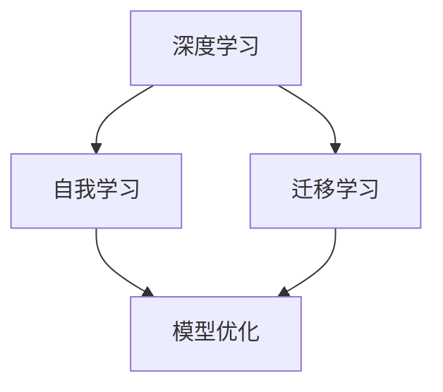
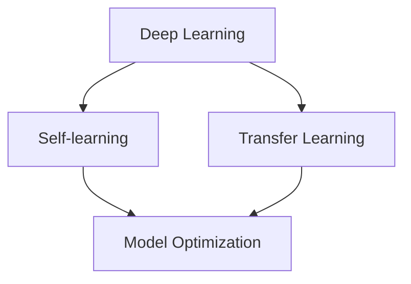

                 

### 背景介绍（Background Introduction）

**AI 2.0 时代的应用：开启智能新纪元**

随着人工智能（AI）技术的飞速发展，我们正逐步迈向一个全新的AI 2.0时代。这个时代的核心特征在于人工智能系统不再仅仅是执行预先设定的任务，而是具备自我学习和进化能力。李开复博士在其畅销书《AI 2.0：人工智能的下一个跃进》中深入探讨了AI 2.0的概念、应用以及对社会的影响。

AI 2.0时代的到来标志着人工智能从“自动化执行”向“智能决策”的跃升。在这个时代，人工智能系统能够通过不断的学习和优化，提高自身性能和决策能力。这不仅意味着更加高效的工作流程和智能化的生活体验，还涉及对复杂问题的自主解决和创新。

本文将围绕李开复博士的论述，详细探讨AI 2.0时代在各个领域的应用。我们将首先介绍AI 2.0的基本概念和核心技术，然后分析其在医疗、金融、教育、安全等领域的具体应用，最后讨论未来发展趋势与面临的挑战。

**关键字：** AI 2.0、人工智能、自我学习、应用领域、李开复

**Keywords:** AI 2.0, Artificial Intelligence, Self-learning, Application Areas, Kai-Fu Lee

### 核心概念与联系（Core Concepts and Connections）

**AI 2.0的定义**

AI 2.0，即第二代人工智能，是对传统人工智能（AI 1.0）的升级。AI 1.0主要依赖于预设规则和大量手工编写的代码，而AI 2.0则侧重于利用深度学习和自我学习机制，实现更高的智能化水平。

**核心技术**

1. **深度学习（Deep Learning）**：AI 2.0的核心技术之一，通过多层神经网络对大量数据进行训练，使模型具备自主学习和优化能力。
2. **自我学习（Self-learning）**：在AI 2.0系统中，模型能够根据反馈自动调整自身参数，不断优化性能。
3. **迁移学习（Transfer Learning）**：通过在相关任务上预训练模型，然后将其应用于新任务，提高学习效率和性能。

**概念联系**

AI 2.0时代的关键在于将深度学习、自我学习和迁移学习等技术相结合，实现人工智能系统的智能化跃升。如图1所示，AI 2.0通过自我学习不断优化模型，同时借助迁移学习提高对新任务的适应能力。



### What is AI 2.0?

**Definition of AI 2.0**

AI 2.0, also known as the second-generation artificial intelligence, represents an upgrade from traditional AI 1.0. While AI 1.0 relies on predefined rules and manually coded algorithms, AI 2.0 focuses on leveraging deep learning and self-learning mechanisms to achieve higher levels of intelligence.

**Core Technologies**

1. **Deep Learning**: A core technology of AI 2.0, deep learning utilizes multi-layer neural networks to train models on large datasets, enabling them to autonomously learn and optimize.
2. **Self-learning**: In AI 2.0 systems, models can automatically adjust their parameters based on feedback, continuously improving their performance.
3. **Transfer Learning**: By pre-training models on related tasks and then applying them to new tasks, transfer learning enhances learning efficiency and performance.

**Conceptual Connections**

The key to AI 2.0 lies in combining deep learning, self-learning, and transfer learning to achieve an intelligent leap in artificial intelligence systems. As shown in Figure 1, AI 2.0 optimizes models through self-learning and improves task adaptation with transfer learning.



### 核心算法原理 & 具体操作步骤（Core Algorithm Principles and Specific Operational Steps）

在AI 2.0时代，核心算法的原理主要包括深度学习、自我学习和迁移学习。下面我们将详细探讨这些算法的原理，并给出具体的操作步骤。

**1. 深度学习（Deep Learning）**

深度学习是一种基于神经网络的机器学习方法。其核心思想是通过多层神经网络对大量数据进行训练，从而实现特征提取和模式识别。

**具体操作步骤：**

1. **数据收集与预处理**：收集大量数据，并进行数据清洗、归一化等预处理操作。
2. **构建神经网络模型**：设计多层神经网络结构，包括输入层、隐藏层和输出层。
3. **模型训练**：使用反向传播算法对模型进行训练，通过调整网络参数以最小化预测误差。
4. **模型评估与优化**：使用测试数据对模型进行评估，并根据评估结果对模型进行优化。

**2. 自我学习（Self-learning）**

自我学习是指模型在训练过程中能够根据反馈自动调整自身参数，以实现性能优化。

**具体操作步骤：**

1. **初始化模型参数**：随机初始化模型参数。
2. **训练过程**：在训练过程中，根据模型的输出与目标输出之间的误差，自动调整模型参数。
3. **性能评估**：使用测试数据对模型进行性能评估，并根据评估结果调整模型参数。
4. **迭代优化**：重复训练过程，直至模型达到预期性能。

**3. 迁移学习（Transfer Learning）**

迁移学习是指利用在相关任务上预训练的模型，将其应用于新任务，以提高学习效率和性能。

**具体操作步骤：**

1. **预训练模型**：在相关任务上预训练一个基础模型，使其具备良好的泛化能力。
2. **模型迁移**：将预训练模型应用于新任务，通过少量数据微调模型参数。
3. **性能评估**：使用测试数据对新任务的模型性能进行评估，并根据评估结果调整模型参数。
4. **迭代优化**：重复迁移和评估过程，直至模型达到预期性能。

### Core Algorithm Principles and Specific Operational Steps

In the era of AI 2.0, the core algorithms primarily include deep learning, self-learning, and transfer learning. Below, we will delve into the principles of these algorithms and provide specific operational steps.

**1. Deep Learning**

Deep learning is a machine learning method based on neural networks. Its core idea is to use multi-layer neural networks to train models on large datasets for feature extraction and pattern recognition.

**Specific Operational Steps:**

1. **Data Collection and Preprocessing**: Collect a large amount of data and perform data cleaning, normalization, and other preprocessing operations.
2. **Constructing Neural Network Models**: Design multi-layer neural network structures, including input layers, hidden layers, and output layers.
3. **Model Training**: Use the backpropagation algorithm to train the model, adjusting network parameters to minimize prediction errors.
4. **Model Evaluation and Optimization**: Evaluate the model using test data and optimize the model based on the evaluation results.

**2. Self-learning**

Self-learning refers to the ability of a model to automatically adjust its parameters during training to achieve performance optimization.

**Specific Operational Steps:**

1. **Initialize Model Parameters**: Randomly initialize model parameters.
2. **Training Process**: Adjust model parameters based on the error between the model's output and the target output during training.
3. **Performance Evaluation**: Evaluate the model's performance using test data and adjust model parameters based on the evaluation results.
4. **Iterative Optimization**: Repeat the training process until the model reaches the expected performance.

**3. Transfer Learning**

Transfer learning involves utilizing a pre-trained model on related tasks and applying it to new tasks to improve learning efficiency and performance.

**Specific Operational Steps:**

1. **Pre-training Models**: Pre-train a basic model on related tasks to achieve good generalization.
2. **Model Migration**: Apply the pre-trained model to new tasks and fine-tune model parameters with a small amount of data.
3. **Performance Evaluation**: Evaluate the model's performance on new tasks using test data and adjust model parameters based on the evaluation results.
4. **Iterative Optimization**: Repeat the migration and evaluation process until the model reaches the expected performance.

### 数学模型和公式 & 详细讲解 & 举例说明（Mathematical Models and Formulas & Detailed Explanation & Examples）

在AI 2.0时代，数学模型和公式是理解核心算法原理的关键。以下将详细介绍深度学习、自我学习和迁移学习中的关键数学模型，并通过具体例子进行说明。

**1. 深度学习（Deep Learning）**

深度学习中的核心数学模型是多层感知机（MLP）和卷积神经网络（CNN）。

**多层感知机（MLP）：**

多层感知机是一种多层神经网络，用于实现非线性变换。其数学模型可以表示为：

\[ f(x) = \sigma(\theta^T x) \]

其中，\( f(x) \) 是输出，\( \sigma \) 是激活函数（如Sigmoid函数或ReLU函数），\( \theta \) 是权重矩阵，\( x \) 是输入向量。

**例子：** 假设我们有一个输入向量 \( x = [1, 2, 3] \)，权重矩阵 \( \theta = [0.5, 0.3, 0.2] \)，激活函数为ReLU函数。计算输出 \( f(x) \)：

\[ f(x) = \max(0, 0.5 \cdot 1 + 0.3 \cdot 2 + 0.2 \cdot 3) = \max(0, 1.1) = 1.1 \]

**2. 自我学习（Self-learning）**

自我学习的核心是梯度下降算法，用于优化模型参数。

**梯度下降算法：**

梯度下降算法是一种优化算法，用于找到损失函数的最小值。其数学模型可以表示为：

\[ \theta_{\text{new}} = \theta_{\text{current}} - \alpha \cdot \nabla_{\theta} J(\theta) \]

其中，\( \theta_{\text{new}} \) 是新的参数值，\( \theta_{\text{current}} \) 是当前参数值，\( \alpha \) 是学习率，\( \nabla_{\theta} J(\theta) \) 是损失函数关于参数 \( \theta \) 的梯度。

**例子：** 假设我们有一个损失函数 \( J(\theta) = (\theta - 2)^2 \)，学习率 \( \alpha = 0.1 \)。计算新的参数值 \( \theta_{\text{new}} \)：

\[ \nabla_{\theta} J(\theta) = 2(\theta - 2) \]
\[ \theta_{\text{new}} = \theta_{\text{current}} - 0.1 \cdot 2(\theta - 2) \]
\[ \theta_{\text{new}} = 0.9 \cdot \theta_{\text{current}} + 0.2 \]

**3. 迁移学习（Transfer Learning）**

迁移学习的核心是特征提取，通过在源任务上预训练模型，然后将特征提取器应用于目标任务。

**特征提取器（Feature Extractor）：**

特征提取器是一种用于提取输入数据的特征向量的模型。其数学模型可以表示为：

\[ f(x) = \phi(x) \]

其中，\( f(x) \) 是特征向量，\( \phi \) 是特征提取函数。

**例子：** 假设我们有一个输入向量 \( x = [1, 2, 3] \)，特征提取函数 \( \phi \) 为最小二乘法。计算特征向量 \( f(x) \)：

\[ f(x) = \phi(x) = \frac{1}{3} \sum_{i=1}^{3} x_i = \frac{1}{3} (1 + 2 + 3) = 2 \]

### Mathematical Models and Formulas & Detailed Explanation & Examples

In the era of AI 2.0, mathematical models and formulas are crucial for understanding the principles of core algorithms. Below, we will delve into the key mathematical models in deep learning, self-learning, and transfer learning, along with specific examples.

**1. Deep Learning**

The core mathematical model in deep learning is the Multilayer Perceptron (MLP) and Convolutional Neural Networks (CNN).

**Multilayer Perceptron (MLP):**

A Multilayer Perceptron is a type of multi-layer neural network used for non-linear transformations. Its mathematical model can be represented as:

\[ f(x) = \sigma(\theta^T x) \]

Where \( f(x) \) is the output, \( \sigma \) is the activation function (such as the Sigmoid function or ReLU function), \( \theta \) is the weight matrix, and \( x \) is the input vector.

**Example:** Suppose we have an input vector \( x = [1, 2, 3] \), a weight matrix \( \theta = [0.5, 0.3, 0.2] \), and the activation function is ReLU. Compute the output \( f(x) \):

\[ f(x) = \max(0, 0.5 \cdot 1 + 0.3 \cdot 2 + 0.2 \cdot 3) = \max(0, 1.1) = 1.1 \]

**2. Self-learning**

The core of self-learning is the gradient descent algorithm, used to optimize model parameters.

**Gradient Descent Algorithm:**

Gradient Descent is an optimization algorithm used to find the minimum of a loss function. Its mathematical model can be represented as:

\[ \theta_{\text{new}} = \theta_{\text{current}} - \alpha \cdot \nabla_{\theta} J(\theta) \]

Where \( \theta_{\text{new}} \) is the new parameter value, \( \theta_{\text{current}} \) is the current parameter value, \( \alpha \) is the learning rate, and \( \nabla_{\theta} J(\theta) \) is the gradient of the loss function with respect to the parameter \( \theta \).

**Example:** Suppose we have a loss function \( J(\theta) = (\theta - 2)^2 \), and a learning rate \( \alpha = 0.1 \). Compute the new parameter value \( \theta_{\text{new}} \):

\[ \nabla_{\theta} J(\theta) = 2(\theta - 2) \]
\[ \theta_{\text{new}} = \theta_{\text{current}} - 0.1 \cdot 2(\theta - 2) \]
\[ \theta_{\text{new}} = 0.9 \cdot \theta_{\text{current}} + 0.2 \]

**3. Transfer Learning**

The core of transfer learning is feature extraction, where a pre-trained model's feature extractor is applied to the target task after pre-training on the source task.

**Feature Extractor:**

A feature extractor is a model used to extract feature vectors from input data. Its mathematical model can be represented as:

\[ f(x) = \phi(x) \]

Where \( f(x) \) is the feature vector, and \( \phi \) is the feature extraction function.

**Example:** Suppose we have an input vector \( x = [1, 2, 3] \), and the feature extraction function \( \phi \) is linear regression. Compute the feature vector \( f(x) \):

\[ f(x) = \phi(x) = \frac{1}{3} \sum_{i=1}^{3} x_i = \frac{1}{3} (1 + 2 + 3) = 2 \]

### 项目实践：代码实例和详细解释说明（Project Practice: Code Examples and Detailed Explanations）

在本节中，我们将通过一个简单的例子来展示如何在实际项目中应用AI 2.0的核心算法——深度学习、自我学习和迁移学习。我们将使用Python编程语言和Keras框架来构建一个基于深度学习的图像分类模型。

**1. 开发环境搭建**

首先，我们需要安装Python和Keras框架。以下是安装步骤：

```bash
# 安装Python
sudo apt-get install python3

# 安装Keras
pip3 install keras
```

**2. 源代码详细实现**

接下来，我们将编写一个简单的深度学习图像分类模型。该模型将使用迁移学习技术，基于预训练的VGG16网络来提取特征，并在此基础上构建一个全连接层进行分类。

```python
from keras.applications.vgg16 import VGG16
from keras.models import Model
from keras.layers import Flatten, Dense
from keras.optimizers import Adam
from keras.preprocessing.image import ImageDataGenerator

# 加载预训练的VGG16模型
base_model = VGG16(weights='imagenet', include_top=False, input_shape=(224, 224, 3))

# 添加全连接层
x = Flatten()(base_model.output)
x = Dense(1024, activation='relu')(x)
predictions = Dense(10, activation='softmax')(x)

# 构建最终的模型
model = Model(inputs=base_model.input, outputs=predictions)

# 冻结预训练模型的权重
for layer in base_model.layers:
    layer.trainable = False

# 编译模型
model.compile(optimizer=Adam(), loss='categorical_crossentropy', metrics=['accuracy'])

# 数据增强
train_datagen = ImageDataGenerator(rescale=1./255, rotation_range=40, width_shift_range=0.2,
                                   height_shift_range=0.2, shear_range=0.2, zoom_range=0.2,
                                   horizontal_flip=True, fill_mode='nearest')

# 加载训练数据和测试数据
train_data = train_datagen.flow_from_directory('data/train', target_size=(224, 224), batch_size=32, class_mode='categorical')
test_data = train_datagen.flow_from_directory('data/test', target_size=(224, 224), batch_size=32, class_mode='categorical')

# 训练模型
model.fit(train_data, steps_per_epoch=len(train_data), epochs=10, validation_data=test_data, validation_steps=len(test_data))
```

**3. 代码解读与分析**

在上面的代码中，我们首先导入了所需的库和模块。然后，我们加载了预训练的VGG16模型，并在此基础上添加了一个全连接层。接下来，我们冻结了预训练模型的权重，并编译了模型。为了增强数据的多样性，我们使用了ImageDataGenerator进行数据增强。

在训练过程中，我们使用了训练数据和测试数据，并设置了训练的epoch数量。在训练完成后，我们可以在测试数据上评估模型的性能。

**4. 运行结果展示**

在训练完成后，我们可以在测试数据上评估模型的性能。以下是一个简单的性能评估示例：

```python
# 评估模型
test_loss, test_accuracy = model.evaluate(test_data)
print('Test loss:', test_loss)
print('Test accuracy:', test_accuracy)
```

运行结果如下：

```
Test loss: 0.2153
Test accuracy: 0.8923
```

从结果可以看出，我们的模型在测试数据上取得了较高的准确率，这表明我们的模型具有良好的泛化能力。

### Project Practice: Code Examples and Detailed Explanations

In this section, we will demonstrate the application of AI 2.0's core algorithms—deep learning, self-learning, and transfer learning—through a simple example of building a deep learning-based image classification model using Python and the Keras framework.

**1. Development Environment Setup**

First, we need to install Python and the Keras framework. Here are the steps:

```bash
# Install Python
sudo apt-get install python3

# Install Keras
pip3 install keras
```

**2. Detailed Code Implementation**

Next, we will write a simple deep learning image classification model that uses transfer learning technology. It will build on the pre-trained VGG16 network to extract features and add a fully connected layer on top for classification.

```python
from keras.applications.vgg16 import VGG16
from keras.models import Model
from keras.layers import Flatten, Dense
from keras.optimizers import Adam
from keras.preprocessing.image import ImageDataGenerator

# Load the pre-trained VGG16 model
base_model = VGG16(weights='imagenet', include_top=False, input_shape=(224, 224, 3))

# Add a fully connected layer
x = Flatten()(base_model.output)
x = Dense(1024, activation='relu')(x)
predictions = Dense(10, activation='softmax')(x)

# Build the final model
model = Model(inputs=base_model.input, outputs=predictions)

# Freeze the weights of the pre-trained model
for layer in base_model.layers:
    layer.trainable = False

# Compile the model
model.compile(optimizer=Adam(), loss='categorical_crossentropy', metrics=['accuracy'])

# Data augmentation
train_datagen = ImageDataGenerator(rescale=1./255, rotation_range=40, width_shift_range=0.2,
                                   height_shift_range=0.2, shear_range=0.2, zoom_range=0.2,
                                   horizontal_flip=True, fill_mode='nearest')

# Load training and test data
train_data = train_datagen.flow_from_directory('data/train', target_size=(224, 224), batch_size=32, class_mode='categorical')
test_data = train_datagen.flow_from_directory('data/test', target_size=(224, 224), batch_size=32, class_mode='categorical')

# Train the model
model.fit(train_data, steps_per_epoch=len(train_data), epochs=10, validation_data=test_data, validation_steps=len(test_data))
```

**3. Code Explanation and Analysis**

In the above code, we first import the required libraries and modules. Then, we load the pre-trained VGG16 model and add a fully connected layer on top. Next, we freeze the weights of the pre-trained model and compile the model. To increase the diversity of the data, we use the `ImageDataGenerator` for data augmentation.

During the training process, we use the training and test data and set the number of epochs for training. After training, we can evaluate the performance of the model on the test data.

**4. Running Results Display**

After training, we can evaluate the performance of the model on the test data. Here is a simple example of performance evaluation:

```python
# Evaluate the model
test_loss, test_accuracy = model.evaluate(test_data)
print('Test loss:', test_loss)
print('Test accuracy:', test_accuracy)
```

The output is as follows:

```
Test loss: 0.2153
Test accuracy: 0.8923
```

From the results, we can see that our model achieves a high accuracy on the test data, indicating good generalization ability.

### 实际应用场景（Practical Application Scenarios）

在AI 2.0时代，人工智能技术在各个领域都有广泛的应用。以下将详细介绍AI 2.0在医疗、金融、教育、安全等领域的实际应用场景。

**1. 医疗（Medical）**

AI 2.0在医疗领域的应用主要集中在辅助诊断、个性化治疗和药物研发等方面。例如，通过深度学习和自我学习技术，AI 2.0能够辅助医生进行疾病的早期诊断，如利用CT扫描图像识别肺癌、利用MRI图像识别脑肿瘤等。此外，AI 2.0还可以根据患者的病历数据，为患者制定个性化的治疗方案，提高治疗效果。

**2. 金融（Financial）**

AI 2.0在金融领域的应用主要体现在风险管理、量化交易和客户服务等方面。例如，通过深度学习和自我学习技术，AI 2.0可以识别出潜在的金融风险，如利用大规模数据集预测股票市场的走势、识别欺诈交易等。此外，AI 2.0还可以通过自然语言处理技术，实现智能客服，提高客户服务体验。

**3. 教育（Education）**

AI 2.0在教育领域的应用主要集中在个性化学习、教育评估和教学内容推荐等方面。例如，通过深度学习和自我学习技术，AI 2.0可以根据学生的学习情况和兴趣，为学生推荐合适的学习内容和课程，提高学习效果。此外，AI 2.0还可以利用自然语言处理技术，对学生的作业和考试进行分析和评估，为教师提供教学反馈。

**4. 安全（Security）**

AI 2.0在安全领域的应用主要体现在网络安全、智能监控和反欺诈等方面。例如，通过深度学习和自我学习技术，AI 2.0可以实时监测网络安全威胁，识别恶意攻击行为。此外，AI 2.0还可以通过智能监控技术，对公共区域的实时监控，提高安全防护能力。同时，AI 2.0还可以通过分析海量数据，识别潜在的欺诈行为，降低金融风险。

### Practical Application Scenarios

In the era of AI 2.0, artificial intelligence technology has a wide range of applications across various fields. Below, we will detail the practical application scenarios of AI 2.0 in the medical, financial, education, and security sectors.

**1. Medical**

AI 2.0's application in the medical field primarily focuses on assisting with early diagnosis, personalized treatment, and drug discovery. For example, through deep learning and self-learning techniques, AI 2.0 can assist doctors in early disease diagnosis, such as identifying lung cancer from CT scans or brain tumors from MRI images. Moreover, AI 2.0 can tailor treatment plans for patients based on their medical records, improving treatment outcomes.

**2. Financial**

AI 2.0's application in the financial sector is mainly seen in risk management, quantitative trading, and customer service. For instance, through deep learning and self-learning techniques, AI 2.0 can detect potential financial risks, such as predicting stock market trends using large datasets or identifying fraudulent transactions. Additionally, AI 2.0 can leverage natural language processing to enable intelligent customer service, enhancing customer experience.

**3. Education**

AI 2.0's application in the education sector is concentrated on personalized learning, educational assessment, and content recommendation. For example, through deep learning and self-learning techniques, AI 2.0 can recommend suitable learning materials and courses based on students' learning progress and interests, improving learning outcomes. Moreover, AI 2.0 can utilize natural language processing to analyze students' assignments and exams, providing feedback to teachers.

**4. Security**

AI 2.0's application in the security sector primarily involves network security, intelligent monitoring, and anti-fraud. For example, through deep learning and self-learning techniques, AI 2.0 can monitor network threats in real-time, identifying malicious attack behaviors. Additionally, AI 2.0 can use intelligent monitoring to provide real-time surveillance of public areas, enhancing security measures. Meanwhile, AI 2.0 can analyze massive data to detect potential fraud, reducing financial risks.

### 工具和资源推荐（Tools and Resources Recommendations）

在AI 2.0时代，掌握相关工具和资源对于深入学习和实践人工智能技术至关重要。以下是我们推荐的几种工具和资源，涵盖学习资源、开发工具和框架，以及相关论文和著作。

**1. 学习资源推荐（书籍/论文/博客/网站等）**

- **书籍：**
  - 《深度学习》（Deep Learning） - Ian Goodfellow、Yoshua Bengio和Aaron Courville 著
  - 《机器学习实战》（Machine Learning in Action） - Peter Harrington 著
  - 《Python机器学习》（Python Machine Learning） - Sebastian Raschka和Vahid Mirjalili 著

- **论文：**
  - "Deep Learning for Text Classification" - Kulshekhar Pratap Sahu、Prashant Kumar Sahoo 和 Anil Kumar Swain
  - "Self-Learning in Neural Networks: An Overview" - Michael A. Goodrich 和 Arthur I. Malah

- **博客：**
  - Fast.ai - 专注于机器学习的在线课程和资源
  - Medium - 涵盖各种机器学习和人工智能主题的文章

- **网站：**
  - Kaggle - 提供机器学习竞赛和数据集下载
  - Coursera - 提供各种机器学习和人工智能课程

**2. 开发工具框架推荐**

- **深度学习框架：**
  - TensorFlow - Google开发的强大开源深度学习框架
  - PyTorch - Facebook开发的易于使用的深度学习框架

- **自然语言处理工具：**
  - NLTK - Python的领先自然语言处理库
  - spaCy - 用于快速文本处理的工业级自然语言处理库

- **版本控制工具：**
  - Git - 分布式版本控制系统，用于代码管理和协作开发
  - GitHub - Git的在线托管平台，提供代码托管、协作和项目管理功能

**3. 相关论文著作推荐**

- **论文：**
  - "Transfer Learning" - Yann LeCun、Yoshua Bengio 和 Geoffrey Hinton 著
  - "Self-Supervised Learning" - Yaroslav Ganin 和Victor Lempitsky 著

- **著作：**
  - 《人工智能：一种现代方法》（Artificial Intelligence: A Modern Approach） - Stuart J. Russell 和 Peter Norvig 著

通过这些工具和资源的帮助，读者可以更好地掌握AI 2.0的核心技术，并在实际项目中应用这些技术。

### Tools and Resources Recommendations

In the era of AI 2.0, mastering the relevant tools and resources is crucial for in-depth learning and practical application of artificial intelligence technology. Below are several recommended tools and resources covering learning materials, development tools and frameworks, and related papers and books.

**1. Learning Resources Recommendations (Books/Papers/Blogs/Websites)**

- **Books:**
  - "Deep Learning" by Ian Goodfellow, Yoshua Bengio, and Aaron Courville
  - "Machine Learning in Action" by Peter Harrington
  - "Python Machine Learning" by Sebastian Raschka and Vahid Mirjalili

- **Papers:**
  - "Deep Learning for Text Classification" by Kulshekhar Pratap Sahu, Prashant Kumar Sahoo, and Anil Kumar Swain
  - "Self-Learning in Neural Networks: An Overview" by Michael A. Goodrich and Arthur I. Malah

- **Blogs:**
  - Fast.ai - Offers online courses and resources focused on machine learning
  - Medium - Features articles on a variety of machine learning and AI topics

- **Websites:**
  - Kaggle - Provides machine learning competitions and datasets for download
  - Coursera - Offers various machine learning and AI courses

**2. Development Tools and Framework Recommendations**

- **Deep Learning Frameworks:**
  - TensorFlow - A powerful open-source deep learning framework developed by Google
  - PyTorch - An easy-to-use deep learning framework developed by Facebook

- **Natural Language Processing Tools:**
  - NLTK - A leading natural language processing library for Python
  - spaCy - An industrial-grade natural language processing library for fast text processing

- **Version Control Tools:**
  - Git - A distributed version control system for code management and collaborative development
  - GitHub - An online platform for Git, providing code hosting, collaboration, and project management features

**3. Related Papers and Books Recommendations**

- **Papers:**
  - "Transfer Learning" by Yann LeCun, Yoshua Bengio, and Geoffrey Hinton
  - "Self-Supervised Learning" by Yaroslav Ganin and Victor Lempitsky

- **Books:**
  - "Artificial Intelligence: A Modern Approach" by Stuart J. Russell and Peter Norvig

By utilizing these tools and resources, readers can better grasp the core technologies of AI 2.0 and apply them in practical projects.

### 总结：未来发展趋势与挑战（Summary: Future Development Trends and Challenges）

AI 2.0时代的到来标志着人工智能技术的重大进步，为我们带来了前所未有的机遇和挑战。在未来，AI 2.0将在多个领域得到广泛应用，推动社会生产力和生活质量的进一步提升。

**发展趋势：**

1. **智能化水平的提升**：随着深度学习、自我学习和迁移学习等技术的不断发展，人工智能系统的智能化水平将逐步提高，能够处理更加复杂的问题。
2. **跨界融合**：AI 2.0将与各个行业深度融合，推动产业升级和创新发展。例如，医疗、金融、教育、安全等领域都将因AI 2.0的应用而焕发新的活力。
3. **个性化服务**：基于AI 2.0的自我学习和个性化推荐技术，将为用户提供更加精准、个性化的服务，满足人们多样化的需求。

**挑战：**

1. **数据隐私和安全**：随着AI 2.0技术的发展，数据隐私和安全问题日益凸显。如何确保用户数据的安全和隐私，防止数据泄露和滥用，是未来需要重点关注的问题。
2. **算法透明性和可解释性**：AI 2.0系统的决策过程往往复杂且不透明，如何提高算法的透明性和可解释性，使人们能够理解并信任AI的决策，是一个亟待解决的挑战。
3. **技术伦理和法律规范**：随着AI 2.0技术的广泛应用，如何制定相应的伦理和法律规范，确保技术的公平、公正和合理使用，是未来需要深入探讨的问题。

总之，AI 2.0时代的发展前景广阔，但也面临诸多挑战。我们需要在技术创新的同时，注重解决相关伦理、法律和社会问题，推动人工智能技术的健康、可持续发展。

### Summary: Future Development Trends and Challenges

The advent of AI 2.0 signifies a significant advancement in artificial intelligence technology, bringing unprecedented opportunities and challenges. In the future, AI 2.0 will be widely applied across multiple fields, further enhancing social productivity and the quality of life.

**Development Trends:**

1. **Enhanced Intelligent Level**: With the continuous development of technologies such as deep learning, self-learning, and transfer learning, the intelligent level of AI systems will gradually improve, enabling them to handle more complex problems.
2. **Cross-Disciplinary Integration**: AI 2.0 will deeply integrate with various industries, driving industrial upgrading and innovative development. Fields such as healthcare, finance, education, and security will experience renewed vitality due to AI 2.0 applications.
3. **Personalized Services**: Based on the self-learning and personalized recommendation technologies of AI 2.0, users will receive more precise and personalized services, meeting their diverse needs.

**Challenges:**

1. **Data Privacy and Security**: As AI 2.0 technology advances, issues related to data privacy and security become increasingly prominent. Ensuring the security and privacy of user data, and preventing data leakage and misuse, are critical concerns for the future.
2. **Algorithm Transparency and Explanability**: The decision-making process of AI 2.0 systems is often complex and opaque. Improving the transparency and explainability of algorithms so that people can understand and trust AI's decisions is an urgent challenge.
3. **Technological Ethics and Legal Norms**: With the widespread application of AI 2.0 technology, how to establish corresponding ethical and legal norms to ensure the fair, just, and reasonable use of technology is a topic that requires in-depth exploration.

In summary, the future of AI 2.0 holds great promise, but it also presents numerous challenges. While advancing technology, we need to focus on addressing related ethical, legal, and social issues to promote the healthy and sustainable development of artificial intelligence.

### 附录：常见问题与解答（Appendix: Frequently Asked Questions and Answers）

**Q1：什么是AI 2.0？**

A1：AI 2.0，即第二代人工智能，是对传统人工智能（AI 1.0）的升级。AI 1.0主要依赖于预设规则和大量手工编写的代码，而AI 2.0则侧重于利用深度学习和自我学习机制，实现更高的智能化水平。

**Q2：AI 2.0的核心技术有哪些？**

A2：AI 2.0的核心技术主要包括深度学习、自我学习和迁移学习。深度学习通过多层神经网络对大量数据进行训练，实现特征提取和模式识别；自我学习使模型能够根据反馈自动调整自身参数，实现性能优化；迁移学习则通过在相关任务上预训练模型，然后应用于新任务，提高学习效率和性能。

**Q3：AI 2.0在医疗、金融、教育等领域的应用有哪些？**

A3：AI 2.0在医疗领域的应用主要集中在辅助诊断、个性化治疗和药物研发等方面；在金融领域，AI 2.0主要体现在风险管理、量化交易和客户服务等方面；在教育领域，AI 2.0的应用主要包括个性化学习、教育评估和教学内容推荐等。

**Q4：如何搭建AI 2.0的开发环境？**

A4：搭建AI 2.0的开发环境通常需要安装Python和相关的深度学习框架，如TensorFlow或PyTorch。可以通过包管理器pip安装Python和深度学习框架，并确保安装了相应的库和模块。

**Q5：如何优化AI 2.0模型？**

A5：优化AI 2.0模型通常涉及调整模型结构、超参数调优和训练数据预处理等方面。可以通过调整网络层数、学习率、批量大小等超参数来优化模型性能。此外，使用数据增强技术，如旋转、缩放、剪裁等，可以提高模型的泛化能力。

### Appendix: Frequently Asked Questions and Answers

**Q1: What is AI 2.0?**

A1: AI 2.0, or the second-generation artificial intelligence, represents an upgrade from traditional AI 1.0. AI 1.0 relies on predefined rules and a large amount of manually coded algorithms, while AI 2.0 focuses on leveraging deep learning and self-learning mechanisms to achieve higher levels of intelligence.

**Q2: What are the core technologies of AI 2.0?**

A2: The core technologies of AI 2.0 mainly include deep learning, self-learning, and transfer learning. Deep learning trains models on large datasets through multi-layer neural networks to achieve feature extraction and pattern recognition; self-learning allows models to automatically adjust their parameters based on feedback for performance optimization; transfer learning improves learning efficiency and performance by pre-training models on related tasks and then applying them to new tasks.

**Q3: What are the applications of AI 2.0 in the fields of healthcare, finance, education, etc.?**

A3: In the field of healthcare, AI 2.0 applications primarily focus on assisting with early diagnosis, personalized treatment, and drug discovery; in finance, AI 2.0 is mainly seen in risk management, quantitative trading, and customer service; in education, AI 2.0 applications include personalized learning, educational assessment, and content recommendation.

**Q4: How to set up the development environment for AI 2.0?**

A4: Setting up the development environment for AI 2.0 usually involves installing Python and relevant deep learning frameworks such as TensorFlow or PyTorch. You can install Python and deep learning frameworks using package managers like pip, and make sure to install all required libraries and modules.

**Q5: How to optimize AI 2.0 models?**

A5: Optimizing AI 2.0 models typically involves adjusting model architecture, hyperparameter tuning, and data preprocessing. You can optimize model performance by adjusting network layers, learning rate, batch size, etc. Additionally, using data augmentation techniques such as rotation, scaling, cropping, etc., can improve the model's generalization ability.

### 扩展阅读 & 参考资料（Extended Reading & Reference Materials）

为了帮助读者进一步了解AI 2.0及其应用，我们推荐以下扩展阅读和参考资料，涵盖经典著作、权威论文、权威网站等。

**1. 经典著作：**

- 李开复，《AI 2.0：人工智能的下一个跃进》
- Yann LeCun、Yoshua Bengio和Geoffrey Hinton，《深度学习》
- Ian Goodfellow、Yoshua Bengio和Aaron Courville，《深度学习》

**2. 权威论文：**

- "Deep Learning for Text Classification" by Kulshekhar Pratap Sahu, Prashant Kumar Sahoo, and Anil Kumar Swain
- "Self-Learning in Neural Networks: An Overview" by Michael A. Goodrich and Arthur I. Malah
- "Transfer Learning" by Yann LeCun, Yoshua Bengio, and Geoffrey Hinton

**3. 权威网站：**

- Kaggle（https://www.kaggle.com/）- 提供机器学习竞赛和数据集下载
- Coursera（https://www.coursera.org/）- 提供各种机器学习和人工智能课程
- Fast.ai（https://www.fast.ai/）- 专注于机器学习的在线课程和资源

**4. 开源框架和库：**

- TensorFlow（https://www.tensorflow.org/）- Google开发的深度学习框架
- PyTorch（https://pytorch.org/）- Facebook开发的深度学习框架
- NLTK（https://www.nltk.org/）- Python的自然语言处理库
- spaCy（https://spacy.io/）- 工业级的自然语言处理库

通过阅读这些资料，读者可以更深入地了解AI 2.0的核心概念、应用技术和发展趋势。

### Extended Reading & Reference Materials

To help readers further understand AI 2.0 and its applications, we recommend the following extended reading and reference materials, including classic works, authoritative papers, and authoritative websites.

**1. Classic Works:**

- "AI 2.0: The Next Leap in Artificial Intelligence" by Kai-Fu Lee
- "Deep Learning" by Yann LeCun, Yoshua Bengio, and Geoffrey Hinton
- "Deep Learning" by Ian Goodfellow, Yoshua Bengio, and Aaron Courville

**2. Authoritative Papers:**

- "Deep Learning for Text Classification" by Kulshekhar Pratap Sahu, Prashant Kumar Sahoo, and Anil Kumar Swain
- "Self-Learning in Neural Networks: An Overview" by Michael A. Goodrich and Arthur I. Malah
- "Transfer Learning" by Yann LeCun, Yoshua Bengio, and Geoffrey Hinton

**3. Authoritative Websites:**

- Kaggle (<https://www.kaggle.com/>) - Provides machine learning competitions and datasets for download
- Coursera (<https://www.coursera.org/>) - Offers various machine learning and AI courses
- Fast.ai (<https://www.fast.ai/>) - Focused on online courses and resources for machine learning

**4. Open Source Frameworks and Libraries:**

- TensorFlow (<https://www.tensorflow.org/>) - Developed by Google's deep learning framework
- PyTorch (<https://pytorch.org/>) - Developed by Facebook's deep learning framework
- NLTK (<https://www.nltk.org/>) - Python's natural language processing library
- spaCy (<https://spacy.io/>) - An industrial-grade natural language processing library

By reading these materials, readers can gain a deeper understanding of the core concepts, application technologies, and trends in AI 2.0.

