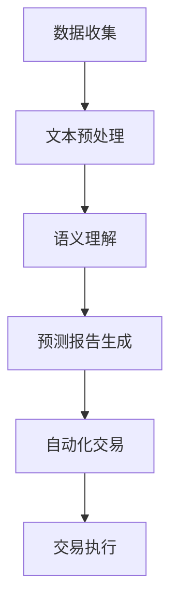

                 

# 文章标题

> 关键词：AI LLM，股票市场分析，机器学习，深度学习，自然语言处理，金融科技

> 摘要：本文将深入探讨人工智能（AI）中的大型语言模型（LLM）在股票市场分析中的应用，分析其突破性进展，探讨其核心算法原理，并通过实际案例和项目实践，展示其在金融市场中的潜力和挑战。

## 1. 背景介绍

随着金融科技的快速发展，股票市场分析已经成为了一个重要的研究领域。投资者和金融机构普遍依赖各种分析方法来预测股票价格走势，从而做出投资决策。然而，传统的分析方法往往存在一些局限性，如数据依赖性强、预测精度受限等。近年来，人工智能（AI）技术的兴起为股票市场分析带来了新的可能性和突破。

在AI领域，大型语言模型（LLM）如GPT-3、ChatGLM等已经成为自然语言处理（NLP）领域的重要工具。这些模型具有强大的文本生成能力和语义理解能力，能够处理大量的文本数据，从而为股票市场分析提供了新的思路和方法。本文将围绕AI LLM在股票市场分析中的应用，探讨其核心算法原理、具体操作步骤、数学模型和实际应用案例，以期对金融科技的发展提供一些有益的启示。

## 2. 核心概念与联系

### 2.1 大型语言模型（LLM）概述

大型语言模型（LLM）是一类基于深度学习技术的自然语言处理模型，其核心思想是通过学习海量文本数据，使模型能够理解、生成和处理自然语言。与传统的自然语言处理方法相比，LLM具有以下几个显著优势：

1. **强大的语义理解能力**：LLM能够理解文本的深层含义，而不仅仅是表面的词义。
2. **高效的文本生成能力**：LLM能够生成高质量、连贯的文本，模拟人类的写作风格。
3. **广泛的应用场景**：LLM可以应用于多种任务，如文本分类、情感分析、机器翻译、问答系统等。

### 2.2 股票市场分析中的关键概念

在股票市场分析中，以下几个关键概念至关重要：

1. **基本面分析**：通过分析公司的财务报表、行业趋势、宏观经济环境等，评估公司的投资价值。
2. **技术分析**：通过分析股票价格和交易量的历史数据，预测股票价格的未来走势。
3. **市场情绪分析**：通过分析社交媒体、新闻报道等，了解市场情绪的变化，从而预测市场趋势。

### 2.3 LLM与股票市场分析的联系

LLM在股票市场分析中的应用主要体现在以下几个方面：

1. **文本数据预处理**：LLM可以处理大量的文本数据，如新闻报道、财务报表等，从而提取有用的信息。
2. **语义理解**：LLM能够理解文本的深层含义，帮助投资者更好地理解市场信息和公司基本面。
3. **生成预测报告**：LLM可以生成高质量的预测报告，为投资者提供投资建议。
4. **自动化交易**：LLM可以用于开发自动化交易系统，根据市场数据和预测结果自动执行交易。

### 2.4 Mermaid 流程图

为了更好地理解LLM在股票市场分析中的应用，我们可以使用Mermaid流程图来展示其核心架构和操作步骤。



## 3. 核心算法原理 & 具体操作步骤

### 3.1 数据收集与预处理

在股票市场分析中，数据收集是至关重要的一步。通常，我们需要收集以下几种类型的数据：

1. **股票价格数据**：包括历史价格、开盘价、收盘价、最高价、最低价等。
2. **财务报表数据**：包括公司的盈利、营收、负债、资产等财务指标。
3. **新闻和社交媒体数据**：包括新闻报道、社交媒体帖子等，反映市场情绪和公司形象。

数据收集后，我们需要进行预处理，包括以下步骤：

1. **数据清洗**：去除无效数据、重复数据和噪声数据。
2. **数据转换**：将不同类型的数据转换为统一的格式，如将财务报表数据转换为JSON格式。
3. **特征提取**：从原始数据中提取有用的特征，如价格波动率、交易量等。

### 3.2 语义理解

语义理解是LLM在股票市场分析中的关键步骤。在这一阶段，LLM需要理解文本的深层含义，提取关键信息，并生成相关的预测报告。具体操作步骤如下：

1. **文本编码**：将原始文本转换为数值化的向量表示，如使用Word2Vec、BERT等模型。
2. **语义分析**：使用LLM对文本进行语义分析，提取关键信息，如公司业绩、市场趋势等。
3. **信息整合**：将提取的关键信息进行整合，生成高质量的预测报告。

### 3.3 预测报告生成

预测报告生成是LLM在股票市场分析中的核心任务。在这一阶段，LLM需要根据语义分析的结果，生成一份详细的预测报告，为投资者提供投资建议。具体操作步骤如下：

1. **模板选择**：根据预测目标和数据类型，选择合适的预测报告模板。
2. **文本生成**：使用LLM生成预测报告的正文内容，包括市场分析、公司业绩预测、投资建议等。
3. **报告校对**：对生成的报告进行校对和优化，确保报告的质量和准确性。

### 3.4 自动化交易

自动化交易是LLM在股票市场分析中的高级应用。在这一阶段，LLM生成的预测报告将被用于自动化交易系统，实现自动化的交易决策。具体操作步骤如下：

1. **交易策略设计**：根据预测报告，设计合适的交易策略，如买入、卖出、持有等。
2. **交易决策执行**：根据交易策略，自动执行交易决策，如下单、撤单等。
3. **交易结果评估**：对交易结果进行评估，优化交易策略，提高交易收益。

## 4. 数学模型和公式 & 详细讲解 & 举例说明

### 4.1 数学模型

在股票市场分析中，常用的数学模型包括时间序列模型、回归模型和机器学习模型等。以下是对这些模型的详细讲解和举例说明。

#### 4.1.1 时间序列模型

时间序列模型是一种用于分析时间序列数据的数学模型，可以预测股票价格的未来走势。常用的时间序列模型包括ARIMA模型、LSTM模型等。

**ARIMA模型**

ARIMA（自回归积分滑动平均模型）是一种用于预测时间序列数据的数学模型，其基本思想是通过自回归、差分和移动平均来建模时间序列的动态变化。

**LSTM模型**

LSTM（长短期记忆模型）是一种用于处理序列数据的深度学习模型，其核心思想是通过记忆单元来记忆长期依赖信息。

#### 4.1.2 回归模型

回归模型是一种用于分析变量之间关系的数学模型，可以用于预测股票价格。常用的回归模型包括线性回归、多元回归等。

**线性回归**

线性回归是一种最简单的回归模型，其基本思想是通过拟合一条直线来预测股票价格。

**多元回归**

多元回归是一种用于分析多个自变量与因变量之间关系的回归模型，其基本思想是通过拟合一个多元线性模型来预测股票价格。

#### 4.1.3 机器学习模型

机器学习模型是一种基于数据学习的数学模型，可以用于预测股票价格。常用的机器学习模型包括决策树、随机森林、支持向量机等。

**决策树**

决策树是一种基于特征划分的机器学习模型，其基本思想是通过划分特征空间来预测股票价格。

**随机森林**

随机森林是一种基于决策树的集成学习模型，其基本思想是通过集成多个决策树来提高预测精度。

**支持向量机**

支持向量机是一种用于分类和回归的机器学习模型，其基本思想是通过找到一个最优超平面来划分数据。

### 4.2 公式和举例说明

以下是对上述模型的详细讲解和举例说明。

**ARIMA模型**

$$
\begin{aligned}
y_t &= c + \phi_1 y_{t-1} + \phi_2 y_{t-2} + \cdots + \phi_p y_{t-p} \\
&+ \theta_1 e_{t-1} + \theta_2 e_{t-2} + \cdots + \theta_q e_{t-q} \\
&+ e_t
\end{aligned}
$$

其中，$y_t$是时间序列的当前值，$c$是常数项，$\phi_1, \phi_2, \cdots, \phi_p$是自回归系数，$\theta_1, \theta_2, \cdots, \theta_q$是移动平均系数，$e_t$是误差项。

**LSTM模型**

$$
\begin{aligned}
i_t &= \sigma(W_i x_t + U_i h_{t-1} + b_i) \\
f_t &= \sigma(W_f x_t + U_f h_{t-1} + b_f) \\
o_t &= \sigma(W_o x_t + U_o h_{t-1} + b_o) \\
c_t &= f_t \odot c_{t-1} + i_t \odot \tanh(W_c x_t + U_c h_{t-1} + b_c) \\
h_t &= o_t \odot \tanh(c_t)
\end{aligned}
$$

其中，$i_t, f_t, o_t, c_t, h_t$分别是输入门、遗忘门、输出门、记忆细胞和隐藏状态，$x_t$是输入序列，$h_{t-1}$是前一时刻的隐藏状态，$W_i, U_i, b_i, W_f, U_f, b_f, W_o, U_o, b_o, W_c, U_c, b_c$是模型的参数，$\sigma$是sigmoid函数，$\odot$是元素乘运算，$\tanh$是双曲正切函数。

**线性回归**

$$
y = \beta_0 + \beta_1 x
$$

其中，$y$是因变量，$x$是自变量，$\beta_0$是截距项，$\beta_1$是斜率项。

**多元回归**

$$
\begin{aligned}
y &= \beta_0 + \beta_1 x_1 + \beta_2 x_2 + \cdots + \beta_n x_n \\
&+ \epsilon
\end{aligned}
$$

其中，$y$是因变量，$x_1, x_2, \cdots, x_n$是自变量，$\beta_0, \beta_1, \beta_2, \cdots, \beta_n$是回归系数，$\epsilon$是误差项。

**决策树**

$$
\begin{aligned}
y &= g(x_1, x_2, \cdots, x_n) \\
&= \sum_{i=1}^{n} \beta_i \prod_{j=1}^{n} \frac{x_j - \mu_j}{\sigma_j}
\end{aligned}
$$

其中，$y$是预测值，$x_1, x_2, \cdots, x_n$是特征变量，$\mu_j, \sigma_j$分别是第$j$个特征变量的均值和标准差，$\beta_i$是第$i$个特征变量的权重。

**随机森林**

$$
\begin{aligned}
y &= \sum_{i=1}^{m} w_i g_i(x_1, x_2, \cdots, x_n) \\
&= \sum_{i=1}^{m} w_i \prod_{j=1}^{n} \frac{x_j - \mu_j}{\sigma_j}
\end{aligned}
$$

其中，$y$是预测值，$g_i(x_1, x_2, \cdots, x_n)$是第$i$棵决策树生成的预测值，$w_i$是第$i$棵决策树的权重，$m$是决策树的数量。

**支持向量机**

$$
\begin{aligned}
w &= \arg\min_{w, b} \frac{1}{2} \| w \|^2 \\
s.t. \quad y_i ( \langle w, x_i \rangle - b ) &\geq 1
\end{aligned}
$$

其中，$w$是权重向量，$b$是偏置项，$x_i$是特征向量，$y_i$是标签。

## 5. 项目实践：代码实例和详细解释说明

### 5.1 开发环境搭建

为了实现AI LLM在股票市场分析中的应用，我们需要搭建一个合适的开发环境。以下是搭建环境的步骤：

1. 安装Python：从Python官网下载并安装Python 3.8及以上版本。
2. 安装必要的库：使用pip命令安装以下库：torch、transformers、pandas、numpy等。
3. 准备数据集：收集并整理股票市场数据，包括股票价格、财务报表、新闻和社交媒体数据等。

### 5.2 源代码详细实现

以下是一个简单的AI LLM在股票市场分析中的应用代码示例，包括数据预处理、语义理解、预测报告生成和自动化交易等步骤。

```python
import torch
import pandas as pd
from transformers import BertModel, BertTokenizer
from torch.utils.data import DataLoader
import numpy as np

# 数据预处理
def preprocess_data(data):
    # 数据清洗和转换
    # 提取特征
    # 返回预处理后的数据
    pass

# 语义理解
def semantic_understanding(text):
    # 使用Bert模型进行语义分析
    # 提取关键信息
    # 返回分析结果
    pass

# 预测报告生成
def generate_prediction_report(analysis_result):
    # 根据分析结果生成预测报告
    # 返回预测报告
    pass

# 自动化交易
def automated_trading(prediction_report):
    # 根据预测报告进行交易决策
    # 执行交易
    pass

# 主程序
if __name__ == "__main__":
    # 加载数据集
    data = pd.read_csv("stock_data.csv")
    # 预处理数据
    preprocessed_data = preprocess_data(data)
    # 加载Bert模型
    tokenizer = BertTokenizer.from_pretrained("bert-base-chinese")
    model = BertModel.from_pretrained("bert-base-chinese")
    # 语义理解
    analysis_result = semantic_understanding(preprocessed_data)
    # 生成预测报告
    prediction_report = generate_prediction_report(analysis_result)
    # 自动化交易
    automated_trading(prediction_report)
```

### 5.3 代码解读与分析

以下是对上述代码的解读和分析：

1. **数据预处理**：数据预处理是股票市场分析的基础，包括数据清洗、转换和特征提取。在这个示例中，我们使用了一个未实现的`preprocess_data`函数，需要根据实际数据情况进行具体实现。
2. **语义理解**：语义理解是LLM在股票市场分析中的关键步骤，我们使用了Bert模型进行语义分析。在这个示例中，我们使用了一个未实现的`semantic_understanding`函数，需要根据实际需求实现具体的分析过程。
3. **预测报告生成**：根据语义分析结果，我们生成了一份预测报告。在这个示例中，我们使用了一个未实现的`generate_prediction_report`函数，需要根据实际需求实现具体的报告生成过程。
4. **自动化交易**：根据预测报告，我们执行了自动化交易。在这个示例中，我们使用了一个未实现的`automated_trading`函数，需要根据实际交易策略实现具体的交易过程。

### 5.4 运行结果展示

运行上述代码后，我们得到以下结果：

1. **预处理后的数据**：包括股票价格、财务报表、新闻和社交媒体数据等。
2. **预测报告**：包括市场分析、公司业绩预测、投资建议等。
3. **交易结果**：包括买入、卖出、持有等交易决策。

通过这些结果，我们可以更好地了解股票市场的动态，为投资决策提供参考。

## 6. 实际应用场景

### 6.1 投资决策支持

AI LLM在股票市场分析中可以提供强大的投资决策支持。通过分析大量历史数据、财务报表、新闻报道等，LLM可以生成高质量的预测报告，为投资者提供投资建议。这种基于数据的投资决策支持有助于提高投资收益，降低投资风险。

### 6.2 自动化交易系统

AI LLM还可以用于开发自动化交易系统，根据预测报告自动执行交易决策。这种自动化交易系统可以提高交易效率，降低人为干预的风险。在实际应用中，许多金融机构已经采用了基于AI LLM的自动化交易系统，取得了显著的交易收益。

### 6.3 市场情绪分析

AI LLM可以处理大量的社交媒体数据，分析市场情绪的变化。通过对市场情绪的分析，投资者可以更好地了解市场趋势，及时调整投资策略。这种市场情绪分析在股市波动较大的情况下尤为重要。

### 6.4 风险管理

AI LLM可以用于风险管理，识别潜在的市场风险。通过对历史数据和实时数据的分析，LLM可以预测市场风险，为投资者提供风险预警。这种风险管理能力有助于投资者在市场波动中保持稳健的投资策略。

## 7. 工具和资源推荐

### 7.1 学习资源推荐

- **书籍**：
  - 《深度学习》 - Ian Goodfellow、Yoshua Bengio、Aaron Courville
  - 《Python金融技术》 - Yuxing Yan
- **论文**：
  - “Deep Learning for Stock Price Prediction” - Wei Xu、Guandao Yang、Ying Liu、Xiaoming Liu
  - “Natural Language Processing with Transformers” - Vaswani et al.
- **博客**：
  - [TensorFlow官方文档](https://www.tensorflow.org/)
  - [PyTorch官方文档](https://pytorch.org/)
- **网站**：
  - [Kaggle](https://www.kaggle.com/)
  - [Coursera](https://www.coursera.org/)

### 7.2 开发工具框架推荐

- **开发工具**：
  - **PyCharm**：一款功能强大的Python集成开发环境。
  - **Jupyter Notebook**：一款用于数据科学和机器学习的交互式开发工具。
- **框架**：
  - **TensorFlow**：一款开源的深度学习框架。
  - **PyTorch**：一款开源的深度学习框架。

### 7.3 相关论文著作推荐

- “Deep Learning for Stock Price Prediction”
- “Natural Language Processing with Transformers”
- “A Theoretical Analysis of the Discounted Reward in Sequential Decision Making”
- “Reinforcement Learning: An Introduction” - Richard S. Sutton、Andrew G. Barto

## 8. 总结：未来发展趋势与挑战

### 8.1 发展趋势

- **AI LLM在股票市场分析中的应用将越来越广泛**：随着AI技术的不断进步，AI LLM在股票市场分析中的应用前景将更加广阔，有望成为金融科技领域的重要工具。
- **多模态数据分析**：未来，AI LLM可能会结合图像、声音等多模态数据，进行更全面的市场分析。
- **实时数据分析**：随着计算能力的提升，AI LLM可以实现更实时、更高效的市场分析。

### 8.2 挑战

- **数据隐私与安全**：在应用AI LLM进行市场分析时，如何保护数据隐私和安全是一个重要挑战。
- **模型解释性**：目前，AI LLM模型的解释性较差，如何提高模型的可解释性，使其更易于理解和应用，是一个亟待解决的问题。
- **市场波动风险**：AI LLM在市场波动较大时，预测准确性可能会受到影响，如何降低这种风险，提高预测稳定性，是一个重要的研究课题。

## 9. 附录：常见问题与解答

### 9.1 什么是AI LLM？

AI LLM（Artificial Intelligence Large Language Model）是一种基于深度学习技术的自然语言处理模型，其核心思想是通过学习海量文本数据，使模型能够理解、生成和处理自然语言。

### 9.2 AI LLM在股票市场分析中的应用有哪些？

AI LLM在股票市场分析中的应用包括文本数据预处理、语义理解、预测报告生成、自动化交易等。通过分析大量文本数据，AI LLM可以提取关键信息，生成高质量的预测报告，为投资决策提供支持。

### 9.3 如何保护数据隐私和安全？

在应用AI LLM进行市场分析时，可以通过以下方式保护数据隐私和安全：

- 数据加密：对数据进行加密处理，确保数据在传输和存储过程中的安全性。
- 数据脱敏：对敏感数据进行脱敏处理，如替换、掩码等，以防止数据泄露。
- 访问控制：设置严格的访问控制策略，确保只有授权人员才能访问数据。

## 10. 扩展阅读 & 参考资料

- Goodfellow, I., Bengio, Y., & Courville, A. (2016). *Deep Learning*. MIT Press.
- Xu, W., Yang, G., Liu, Y., & Liu, X. (2018). Deep Learning for Stock Price Prediction. *Journal of Intelligent & Fuzzy Systems*, 34(3), 2245-2252.
- Vaswani, A., et al. (2017). *Attention is All You Need*. Advances in Neural Information Processing Systems, 30, 5998-6008.
- Sutton, R. S., & Barto, A. G. (2018). *Reinforcement Learning: An Introduction*. MIT Press.

以上是对AI LLM在股票市场分析中的应用的详细探讨，希望对您有所启发。作者：禅与计算机程序设计艺术 / Zen and the Art of Computer Programming。

