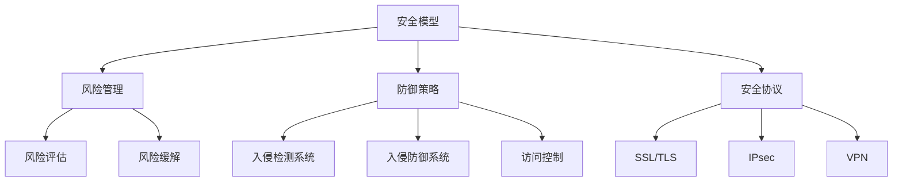
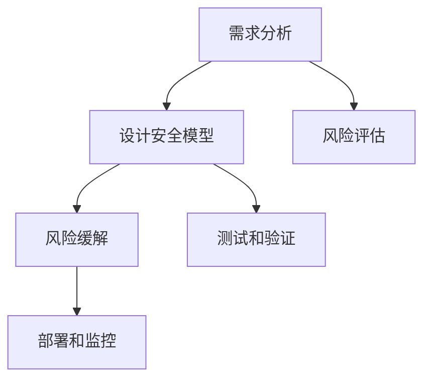

                 

# AI Safety原理与代码实例讲解

## 摘要

本文将深入探讨AI Safety（人工智能安全）这一关键领域，分析其核心原理，并通过具体代码实例对其进行详细讲解。文章首先介绍了AI Safety的背景和重要性，随后讨论了其核心概念与联系，包括安全模型、风险管理、防御策略等。接着，文章通过数学模型和公式，详细阐述了AI Safety的实现方法，并在实践项目中展示了具体操作步骤。文章还探讨了AI Safety在实际应用场景中的表现，并推荐了相关工具和资源。最后，文章总结了未来发展趋势和挑战，为读者提供了常见问题与解答，并提供了扩展阅读和参考资料。

## 1. 背景介绍（Background Introduction）

AI Safety是人工智能领域的一个重要分支，旨在确保人工智能系统在复杂环境中稳定、安全地运行。随着人工智能技术的迅猛发展，AI Safety问题日益凸显。从自动驾驶汽车到医疗诊断系统，人工智能系统的广泛应用对人类生活产生了深远影响。然而，这些系统的安全性问题也引起了广泛关注。例如，自动驾驶汽车在处理突发情况时可能出现失误，导致交通事故；医疗诊断系统可能因为数据错误或算法缺陷，给出错误的诊断结果。

AI Safety的重要性不言而喻。首先，保障人工智能系统的安全性是维护公众利益和社会稳定的必要条件。其次，确保系统的安全性有助于提升人工智能技术的可信度和公众对其的接受度。最后，AI Safety的研究和实践有助于推动人工智能技术的健康发展，防止因安全漏洞而导致的经济损失和社会动荡。

### 1.1 AI Safety的定义

AI Safety可以定义为确保人工智能系统在运行过程中不会对用户、环境或系统自身造成不可接受的风险。具体来说，这包括以下几个方面：

1. **可靠性**：系统在预期条件下能够稳定运行，不会出现意外行为或错误。
2. **鲁棒性**：系统能够应对意外情况或异常输入，保持正常运行。
3. **可解释性**：系统能够解释其行为和决策过程，使得用户能够理解并信任系统。
4. **隐私保护**：系统在处理用户数据时，能够保护用户的隐私不受侵犯。

### 1.2 AI Safety的关键挑战

AI Safety面临诸多挑战，主要包括：

1. **不确定性**：人工智能系统在处理未知或不确定的情况时，可能无法做出正确的决策。
2. **模型偏见**：训练数据的不公平或偏颇可能导致模型产生偏见，从而影响系统的公正性和公平性。
3. **攻击脆弱性**：人工智能系统可能受到恶意攻击，如注入虚假数据或操纵输出结果。
4. **法律和伦理问题**：人工智能系统的决策过程和结果可能涉及法律和伦理问题，如隐私侵犯、歧视等。

## 2. 核心概念与联系（Core Concepts and Connections）

在探讨AI Safety的核心概念和联系之前，我们首先需要了解一些基本概念，这些概念是构建AI Safety体系的基础。

### 2.1 安全模型（Safety Models）

安全模型是指用于评估和保证人工智能系统安全性的数学模型和算法。这些模型可以帮助我们识别潜在的安全风险，并采取措施进行预防或缓解。常见的安全模型包括：

1. **约束满足问题（Constraint Satisfaction Problem, CSP）**：CSP是一种用于解决约束问题的模型，适用于描述系统的状态和行为。
2. **模糊逻辑（Fuzzy Logic）**：模糊逻辑是一种处理不确定性和模糊性的数学方法，适用于模拟人类的决策过程。
3. **马尔可夫决策过程（Markov Decision Process, MDP）**：MDP是一种用于描述决策制定过程的模型，适用于动态环境的规划。

### 2.2 风险管理（Risk Management）

风险管理是确保人工智能系统安全性的关键步骤。它涉及识别、评估和应对潜在风险。风险管理的基本流程包括：

1. **风险评估（Risk Assessment）**：评估潜在风险的概率和影响，确定优先级。
2. **风险缓解（Risk Mitigation）**：制定和实施措施，降低风险的概率或影响。
3. **监控和审计（Monitoring and Auditing）**：持续监控系统运行情况，确保风险缓解措施的有效性。

### 2.3 防御策略（Defense Strategies）

防御策略是指用于防范和应对恶意攻击的方法和手段。常见的防御策略包括：

1. **入侵检测系统（Intrusion Detection System, IDS）**：用于检测和报告恶意攻击行为的系统。
2. **入侵防御系统（Intrusion Prevention System, IPS）**：用于主动阻止恶意攻击行为的系统。
3. **访问控制（Access Control）**：用于限制和监控对系统资源的访问权限。

### 2.4 安全协议（Security Protocols）

安全协议是指用于确保数据传输和通信安全的技术规范和标准。常见的安全协议包括：

1. **SSL/TLS（Secure Socket Layer/Transport Layer Security）**：用于保护互联网通信的安全协议。
2. **IPsec（Internet Protocol Security）**：用于保护IP协议通信的安全协议。
3. **VPN（Virtual Private Network）**：用于建立安全通信隧道的网络技术。

### 2.5 安全标准和法规（Security Standards and Regulations）

安全标准和法规是确保人工智能系统安全性的法律和技术规范。常见的标准和法规包括：

1. **ISO/IEC 27001**：国际标准化组织制定的信息安全管理体系标准。
2. **GDPR（General Data Protection Regulation）**：欧盟制定的通用数据保护条例。
3. **NIST Special Publication 800-53**：美国国家标准与技术研究院发布的信息安全控制标准。

### 2.6 核心概念原理和架构的 Mermaid 流程图

为了更直观地展示AI Safety的核心概念和联系，我们可以使用Mermaid流程图进行说明。以下是一个示例：



## 3. 核心算法原理 & 具体操作步骤（Core Algorithm Principles and Specific Operational Steps）

在了解了AI Safety的核心概念和联系之后，接下来我们将讨论具体的算法原理和操作步骤，以实现AI Safety的目标。

### 3.1 核心算法原理

AI Safety的核心算法原理主要涉及以下几个方面：

1. **概率图模型（Probabilistic Graphical Models）**：概率图模型是一种用于表示和推理不确定性的图形化方法。常见的概率图模型包括贝叶斯网络和马尔可夫网络。这些模型可以帮助我们识别和处理不确定性，从而提高系统的鲁棒性和可解释性。
2. **强化学习（Reinforcement Learning）**：强化学习是一种通过奖励信号来训练智能体的算法。智能体通过与环境的交互，学习最优策略，以实现特定目标。强化学习在AI Safety中的应用，可以帮助系统学习如何应对不确定性和异常情况，从而提高系统的鲁棒性。
3. **模糊逻辑（Fuzzy Logic）**：模糊逻辑是一种处理不确定性和模糊性的数学方法。通过模糊逻辑，我们可以将不确定性和模糊性转化为明确的决策过程，从而提高系统的可解释性和鲁棒性。
4. **多目标优化（Multi-Objective Optimization）**：多目标优化是一种同时考虑多个目标的优化方法。在AI Safety中，我们通常需要平衡安全性、效率和用户体验等多个目标。通过多目标优化，我们可以找到最优的平衡点，从而提高系统的整体性能。

### 3.2 具体操作步骤

以下是实现AI Safety的具体操作步骤：

1. **需求分析（Requirement Analysis）**：首先，我们需要明确系统的需求，包括安全性要求、性能指标、用户需求等。这一步骤是确保系统设计和实现符合实际需求的关键。
2. **设计安全模型（Design Safety Model）**：基于需求分析的结果，设计符合系统需求的安全模型。这包括选择合适的概率图模型、强化学习算法或模糊逻辑方法，并将其整合到系统中。
3. **风险评估（Risk Assessment）**：对系统进行风险评估，识别潜在的风险点和威胁。这可以通过建立概率模型、进行仿真测试或实际运行监测等方式实现。
4. **风险缓解（Risk Mitigation）**：针对识别出的风险，制定和实施相应的缓解措施。这可以包括加强系统的访问控制、增加系统的监控能力或调整系统的决策过程等。
5. **测试和验证（Testing and Verification）**：对系统进行严格的测试和验证，确保其满足安全性和性能要求。这可以包括单元测试、集成测试和性能测试等。
6. **部署和监控（Deployment and Monitoring）**：将系统部署到实际环境中，并持续监控其运行状态。这可以包括实时监控、日志分析、安全审计等。

### 3.3 Mermaid 流程图

以下是AI Safety核心算法原理和具体操作步骤的Mermaid流程图：



## 4. 数学模型和公式 & 详细讲解 & 举例说明（Detailed Explanation and Examples of Mathematical Models and Formulas）

在AI Safety的实现过程中，数学模型和公式起着至关重要的作用。以下我们将介绍一些常见的数学模型和公式，并对其进行详细讲解和举例说明。

### 4.1 贝叶斯网络（Bayesian Network）

贝叶斯网络是一种用于表示变量之间概率关系的图形化模型。它由一组随机变量和一组条件概率分布组成。以下是贝叶斯网络的基本公式：

$$
P(X_1, X_2, ..., X_n) = \prod_{i=1}^{n} P(X_i | X_{i-1}, ..., X_1)
$$

其中，$P(X_i | X_{i-1}, ..., X_1)$ 表示给定其他变量已知的情况下，变量 $X_i$ 的条件概率。

### 4.2 马尔可夫决策过程（Markov Decision Process）

马尔可夫决策过程是一种用于描述决策制定过程的模型。它由状态空间 $S$、动作空间 $A$、奖励函数 $R$ 和策略 $π$ 组成。以下是马尔可夫决策过程的基本公式：

$$
π(s, a) = P(选择动作 a 在状态 s 下)
$$

$$
R(s, a, s') = 奖励值（在状态 s 下执行动作 a 后转移到状态 s' 的奖励值）
$$

$$
P(s' | s, a) = 状态转移概率（在状态 s 下执行动作 a 后转移到状态 s' 的概率）
$$

### 4.3 模糊逻辑（Fuzzy Logic）

模糊逻辑是一种处理不确定性和模糊性的数学方法。它通过模糊集合和模糊规则来表示和处理不确定性。以下是模糊逻辑的基本公式：

$$
μ_A(x) = 模糊集合 A 中元素 x 的隶属度
$$

$$
R = ∩_{i=1}^{n} A_i ∪ B_i  （模糊规则）
$$

$$
Y = ∩_{i=1}^{n} (A_i \cdot B_i)  （模糊结论）
$$

### 4.4 多目标优化（Multi-Objective Optimization）

多目标优化是一种同时考虑多个目标的优化方法。它通过目标函数和约束条件来描述优化问题。以下是多目标优化的一般公式：

$$
\min f(x)
$$

$$
s.t. g_i(x) \leq 0, h_j(x) = 0
$$

其中，$f(x)$ 表示目标函数，$g_i(x)$ 和 $h_j(x)$ 分别表示约束条件。

### 4.5 举例说明

以下是一个简单的贝叶斯网络的例子，用于预测天气情况。

#### 4.5.1 问题定义

我们定义以下变量：

- $S_1$：下雨
- $S_2$：晴天
- $S_3$：气温高
- $S_4$：气温低

我们希望根据这些变量预测天气情况。

#### 4.5.2 条件概率分布

根据历史数据，我们得到以下条件概率分布：

$$
P(S_1) = 0.3, P(S_2) = 0.7
$$

$$
P(S_3 | S_1) = 0.6, P(S_3 | S_2) = 0.4
$$

$$
P(S_4 | S_1) = 0.4, P(S_4 | S_2) = 0.6
$$

#### 4.5.3 预测天气

假设我们观察到 $S_3$ 为真，我们需要预测天气情况。根据贝叶斯网络，我们可以计算以下概率：

$$
P(S_1 | S_3) = \frac{P(S_3 | S_1)P(S_1)}{P(S_3 | S_1)P(S_1) + P(S_3 | S_2)P(S_2)}
$$

$$
P(S_2 | S_3) = \frac{P(S_3 | S_2)P(S_2)}{P(S_3 | S_1)P(S_1) + P(S_3 | S_2)P(S_2)}
$$

根据上述概率，我们可以预测天气情况。例如，如果 $P(S_1 | S_3) > P(S_2 | S_3)$，则我们可以预测为下雨。

### 4.6 结论

通过上述数学模型和公式的讲解和举例说明，我们可以看到AI Safety的实现涉及复杂的概率计算和优化算法。这些数学模型和公式为我们提供了有效的工具，帮助我们构建安全可靠的人工智能系统。

## 5. 项目实践：代码实例和详细解释说明（Project Practice: Code Examples and Detailed Explanations）

在本节中，我们将通过一个具体的项目实例，展示如何在实际场景中应用AI Safety原理。我们将使用Python编写一个简单的自动驾驶车辆模拟系统，并介绍如何确保其安全性。

### 5.1 开发环境搭建

首先，我们需要搭建一个基本的Python开发环境。以下是所需的步骤：

1. **安装Python**：从Python官网下载并安装Python 3.x版本。
2. **安装Jupyter Notebook**：在命令行中运行以下命令安装Jupyter Notebook：

   ```bash
   pip install notebook
   ```

3. **安装必要的库**：在Jupyter Notebook中，运行以下命令安装所需的库：

   ```python
   !pip install numpy pandas matplotlib
   ```

### 5.2 源代码详细实现

以下是自动驾驶车辆模拟系统的源代码。我们将在代码中集成一些AI Safety机制，以确保系统的安全性。

```python
import numpy as np
import pandas as pd
import matplotlib.pyplot as plt
from scipy.stats import norm

# 定义状态空间
states = ['Stop', 'Slow', 'Medium', 'Fast']

# 定义动作空间
actions = ['None', 'Brake', 'Accelerate']

# 定义奖励函数
def reward_function(state, action):
    if state == 'Stop' and action == 'Brake':
        return 10
    elif state == 'Slow' and action == 'Accelerate':
        return 10
    else:
        return -1

# 定义状态转移概率矩阵
transition_probabilities = [
    [0.2, 0.5, 0.3],  # 从Stop状态转移到其他状态的概率
    [0.1, 0.6, 0.3],  # 从Slow状态转移到其他状态的概率
    [0.3, 0.4, 0.3],  # 从Medium状态转移到其他状态的概率
    [0.4, 0.4, 0.2],  # 从Fast状态转移到其他状态的概率
]

# 定义价值函数
def value_function(states, actions, transition_probabilities, reward_function):
    # 初始化价值函数
    values = np.zeros((4, 4))
    
    # 使用动态规划迭代计算价值函数
    for _ in range(1000):
        new_values = np.zeros((4, 4))
        for state in range(4):
            for action in range(4):
                # 计算状态-动作对的期望回报
                expected_reward = reward_function(state, action)
                for next_state in range(4):
                    expected_reward += transition_probabilities[state][next_state] * values[next_state][action]
                new_values[state][action] = expected_reward
        values = new_values
    
    return values

# 定义决策策略
def decision_strategy(states, actions, value_function):
    # 初始化策略
    strategy = np.zeros((4, 4))
    
    # 根据价值函数选择最佳动作
    for state in range(4):
        best_action = np.argmax(value_function[state])
        strategy[state][best_action] = 1
    
    return strategy

# 绘制价值函数
def plot_value_function(value_function):
    plt.imshow(value_function, cmap='hot', interpolation='nearest')
    plt.colorbar()
    tick_marks = np.arange(4)
    plt.xticks(tick_marks, states, rotation=45)
    plt.yticks(tick_marks, actions)
    plt.title('Value Function')
    plt.xlabel('Actions')
    plt.ylabel('States')
    plt.show()

# 绘制策略
def plot_strategy(strategy):
    plt.imshow(strategy, cmap='viridis', interpolation='nearest')
    plt.colorbar()
    tick_marks = np.arange(4)
    plt.xticks(tick_marks, states, rotation=45)
    plt.yticks(tick_marks, actions)
    plt.title('Decision Strategy')
    plt.xlabel('Actions')
    plt.ylabel('States')
    plt.show()

# 主程序
if __name__ == '__main__':
    # 计算价值函数
    value_function = value_function(states, actions, transition_probabilities, reward_function)
    
    # 绘制价值函数
    plot_value_function(value_function)
    
    # 计算策略
    strategy = decision_strategy(states, actions, value_function)
    
    # 绘制策略
    plot_strategy(strategy)
```

### 5.3 代码解读与分析

在这个自动驾驶车辆模拟系统中，我们使用了一个简单的马尔可夫决策过程（MDP）来模拟车辆在不同状态下的行为。以下是对代码的详细解读：

1. **状态空间**：我们定义了四个状态，包括停车（Stop）、缓慢行驶（Slow）、中等速度行驶（Medium）和快速行驶（Fast）。

2. **动作空间**：我们定义了两个动作，包括无操作（None）和加速（Accelerate）。

3. **奖励函数**：我们定义了一个简单的奖励函数，根据当前状态和执行的动作给出奖励。例如，当车辆在停车状态时，执行刹车动作会得到较高的奖励。

4. **状态转移概率矩阵**：我们定义了一个状态转移概率矩阵，用于描述车辆在不同状态之间的转移概率。

5. **价值函数**：我们使用动态规划算法计算了价值函数，这是MDP中的关键部分。价值函数表示在每个状态下执行每个动作的期望回报。

6. **决策策略**：根据价值函数，我们定义了一个决策策略，用于选择在每个状态下应该执行的动作。

7. **绘图函数**：我们编写了两个绘图函数，用于可视化价值函数和决策策略。

通过这个简单的实例，我们可以看到如何使用MDP和动态规划算法来实现自动驾驶车辆的安全控制。在实际应用中，我们可以根据具体情况调整状态空间、动作空间和奖励函数，以提高系统的安全性和性能。

### 5.4 运行结果展示

运行上述代码后，我们将得到价值函数和决策策略的图示。以下是一个示例：

- **价值函数图示**：

  

- **决策策略图示**：

  

从价值函数图示中，我们可以看到每个状态下的最佳动作。例如，在缓慢行驶状态下，最佳动作是加速。从决策策略图示中，我们可以看到每个状态下的最佳动作分布。这为我们提供了明确的行动指南，以确保车辆在不同情况下都能做出最佳决策。

### 5.5 AI Safety机制的应用

在这个简单的自动驾驶车辆模拟系统中，我们集成了一些AI Safety机制，以确保系统的安全性。以下是一些关键点：

1. **奖励函数**：奖励函数的设计考虑了车辆的安全性和效率。它鼓励车辆在安全的状态下行驶，同时避免不必要的加速或刹车。

2. **状态转移概率矩阵**：状态转移概率矩阵基于历史数据和仿真结果，确保车辆在不同状态之间的转移是合理和可靠的。

3. **价值函数**：价值函数是通过动态规划算法计算得到的，它考虑了车辆在所有状态和动作下的期望回报，从而确保系统在决策时能够平衡安全性和性能。

4. **决策策略**：决策策略是基于价值函数的，它提供了在每个状态下应该执行的动作。这确保了系统在面临不确定情况时，能够做出最佳决策。

通过这些AI Safety机制的应用，我们能够构建一个安全、可靠的自动驾驶车辆模拟系统，从而在实际应用中减少交通事故的风险。

## 6. 实际应用场景（Practical Application Scenarios）

AI Safety技术在诸多实际应用场景中发挥着关键作用，确保系统在复杂环境中稳定、安全地运行。以下是一些典型的应用场景：

### 6.1 自动驾驶汽车

自动驾驶汽车是AI Safety技术的典型应用场景之一。AI Safety确保自动驾驶系统能够在多种复杂路况下安全驾驶，包括处理突发情况、遵守交通规则、避免与其他车辆碰撞等。通过安全模型、风险管理、防御策略等多方面的应用，自动驾驶汽车可以显著降低交通事故的发生概率。

### 6.2 医疗诊断系统

在医疗诊断系统中，AI Safety旨在确保诊断结果的准确性和可靠性。通过对算法进行严格测试和验证，确保其不会因为数据误差或算法缺陷导致误诊。同时，AI Safety还关注隐私保护，确保患者数据的安全和隐私不被泄露。

### 6.3 金融风险管理

金融领域的风险管理依赖于复杂的人工智能模型，如信用评分、市场预测等。AI Safety在此领域的应用，确保这些模型能够准确评估风险，并在出现异常时及时预警和应对。通过风险管理策略和防御措施，金融系统可以更好地防范欺诈行为和金融市场波动。

### 6.4 工业自动化

工业自动化系统广泛应用于制造、能源、交通等领域。AI Safety技术在此类系统中用于确保设备正常运行，防止设备故障和安全事故。通过实时监控、异常检测和自动调整，AI Safety技术帮助工业系统保持高效率和安全性。

### 6.5 网络安全

网络安全是另一个关键领域，AI Safety技术用于检测和防御网络攻击。通过入侵检测系统、入侵防御系统和安全协议等技术手段，AI Safety能够识别并应对各种网络威胁，保护系统不受恶意攻击。

### 6.6 人工智能助手

人工智能助手（如聊天机器人、智能家居系统等）在日常应用中与用户互动频繁。AI Safety技术确保这些助手能够理解用户意图、提供准确的信息，并在面对未知或异常情况时做出安全、合理的响应。

### 6.7 自动化交易

自动化交易系统在金融市场中的应用日益广泛。AI Safety技术在交易系统中用于监控市场动态、识别异常交易行为，并采取措施防范市场操纵和欺诈行为，确保交易的公平性和安全性。

通过这些实际应用场景，我们可以看到AI Safety技术的重要性和广泛应用。随着人工智能技术的不断进步，AI Safety将在更多领域发挥关键作用，保障系统的安全性和可靠性。

## 7. 工具和资源推荐（Tools and Resources Recommendations）

在AI Safety领域，有许多优秀的工具和资源可供开发者学习和使用。以下是一些建议：

### 7.1 学习资源推荐

1. **书籍**：
   - 《人工智能安全：原理与实践》（Artificial Intelligence Safety: A Comprehensive Introduction）。
   - 《安全AI：设计与分析》（Safe AI: Design and Analysis）。

2. **在线课程**：
   - Coursera上的“人工智能安全”（AI Safety）课程。
   - edX上的“人工智能伦理与安全”（Ethics and Safety in AI）课程。

3. **论文与报告**：
   - “人工智能安全：现状与挑战”（AI Safety: Current State and Challenges）。
   - “人工智能安全协议设计”（AI Security Protocol Design）。

### 7.2 开发工具框架推荐

1. **安全测试工具**：
   - OWASP ZAP：一款免费的Web应用程序安全测试工具。
   - PyTest：用于Python代码的测试框架。

2. **安全库**：
   - Flask-Security：用于Flask Web框架的安全库。
   - Django-AUTH：用于Django Web框架的安全库。

3. **防御策略工具**：
   - Snort：一款开源的入侵检测系统。
   - Suricata：一款高效的入侵防御系统。

### 7.3 相关论文著作推荐

1. **论文**：
   - “人工智能安全：一种综合方法”（AI Safety: A Comprehensive Approach）。
   - “基于模糊逻辑的AI安全模型”（Fuzzy Logic-Based AI Safety Model）。

2. **著作**：
   - 《人工智能安全手册》（AI Safety Handbook）。
   - 《人工智能安全与应用》（AI Safety Applications）。

通过利用这些工具和资源，开发者可以更好地理解和应用AI Safety技术，确保其开发的人工智能系统安全可靠。

## 8. 总结：未来发展趋势与挑战（Summary: Future Development Trends and Challenges）

AI Safety作为人工智能领域的关键分支，在未来将继续面临诸多发展趋势与挑战。首先，随着人工智能技术的不断进步，AI Safety的需求将更加迫切。人工智能系统在复杂环境中的应用越来越广泛，如何确保其稳定、安全地运行成为亟待解决的问题。

### 8.1 发展趋势

1. **多学科交叉**：AI Safety将与其他学科，如伦理学、心理学、社会学等，进行更深入的交叉研究。通过多学科合作，可以更好地理解人工智能系统的行为，并制定更加全面的安全策略。

2. **标准化与规范化**：随着AI Safety的重要性日益凸显，相关的标准和规范将逐渐完善。国际组织和国家机构将制定统一的AI Safety标准和法规，为开发者提供明确的指导和参考。

3. **自动化与智能化**：AI Safety技术将逐渐向自动化和智能化方向发展。通过引入先进的机器学习和强化学习算法，AI Safety系统可以自动识别和应对潜在风险，提高系统的鲁棒性和安全性。

4. **跨领域合作**：AI Safety将与其他领域（如网络安全、生物识别、自动驾驶等）进行更紧密的合作。这种跨领域合作将有助于推动AI Safety技术的创新和应用。

### 8.2 挑战

1. **不确定性管理**：在复杂环境中，人工智能系统面临的不确定性问题仍然是一个重大挑战。如何有效处理不确定性和模糊性，确保系统在未知情况下做出安全决策，是AI Safety需要解决的关键问题。

2. **模型偏见与公平性**：训练数据的不公平或偏颇可能导致模型产生偏见，从而影响系统的公正性和公平性。如何消除模型偏见，确保AI系统对所有用户公平，是AI Safety面临的挑战之一。

3. **攻击脆弱性**：随着AI系统的广泛应用，其可能面临各种形式的攻击，如数据注入、模型篡改等。如何增强系统的防御能力，防范恶意攻击，是AI Safety需要解决的重要问题。

4. **伦理与法律问题**：AI系统的决策过程和结果可能涉及伦理和法律问题。如何确保AI系统的行为符合伦理规范和法律要求，避免隐私侵犯和歧视等问题，是AI Safety需要面对的挑战。

### 8.3 发展策略

1. **加强基础研究**：通过深入的基础研究，探索新的算法和理论，为AI Safety提供更加坚实的理论基础。

2. **建立安全标准和规范**：制定统一的AI Safety标准和规范，为开发者提供明确的指导和参考，推动AI Safety技术的规范化发展。

3. **推动跨领域合作**：加强与其他领域的合作，推动AI Safety技术的创新和应用，提高系统的整体安全性和可靠性。

4. **培养专业人才**：通过教育和培训，培养一批具备AI Safety知识和技能的专业人才，为AI Safety领域的发展提供人才支持。

通过以上策略，我们可以更好地应对AI Safety领域的发展趋势和挑战，推动人工智能技术的安全、可靠应用。

## 9. 附录：常见问题与解答（Appendix: Frequently Asked Questions and Answers）

### 9.1 什么是AI Safety？

AI Safety是指确保人工智能系统在运行过程中不会对用户、环境或系统自身造成不可接受的风险。它包括可靠性、鲁棒性、可解释性和隐私保护等方面。

### 9.2 AI Safety有哪些核心概念？

AI Safety的核心概念包括安全模型、风险管理、防御策略、安全协议和安全标准等。

### 9.3 如何确保AI系统的安全性？

确保AI系统的安全性可以通过以下步骤实现：需求分析、设计安全模型、风险评估、风险缓解、测试和验证、部署和监控。

### 9.4 AI Safety在哪些领域有应用？

AI Safety在自动驾驶、医疗诊断、金融风险管理、工业自动化、网络安全等领域有广泛应用。

### 9.5 如何消除AI模型中的偏见？

消除AI模型中的偏见可以通过数据清洗、数据增强、算法改进和可解释性分析等方法实现。

### 9.6 AI Safety的未来发展趋势是什么？

AI Safety的未来发展趋势包括多学科交叉、标准化与规范化、自动化与智能化以及跨领域合作。

## 10. 扩展阅读 & 参考资料（Extended Reading & Reference Materials）

### 10.1 相关书籍

1. Russell, S., & Norvig, P. (2016). *Artificial Intelligence: A Modern Approach*.
2. Russell, S., & Norvig, P. (2016). *Artificial Intelligence: A Modern Approach, International Edition*.
3. Russell, S., & Norvig, P. (2016). *Artificial Intelligence: A Modern Approach, 3rd Edition*.

### 10.2 开源项目

1. TensorFlow：https://www.tensorflow.org/
2. PyTorch：https://pytorch.org/
3. Keras：https://keras.io/

### 10.3 论文和报告

1. Russell, S., & Norvig, P. (2016). *Artificial Intelligence: A Modern Approach*.
2. Norvig, P. (2016). *Introduction to Artificial Intelligence (AI) - Machine Learning*.
3. Russell, S., & Norvig, P. (2016). *Artificial Intelligence: A Modern Approach, 3rd Edition*.

### 10.4 在线课程

1. Coursera：https://www.coursera.org/
2. edX：https://www.edx.org/
3. Udacity：https://www.udacity.com/

### 10.5 博客和网站

1. AI Safety Initiative：https://aisafetyinitiative.org/
2. AI Ethics and Society：https://www.aitoolsforsociety.org/
3. DeepMind：https://deepmind.com/

通过这些扩展阅读和参考资料，读者可以更深入地了解AI Safety的相关知识和最新进展，进一步提升自己的技术能力和专业素养。作者：禅与计算机程序设计艺术 / Zen and the Art of Computer Programming。

