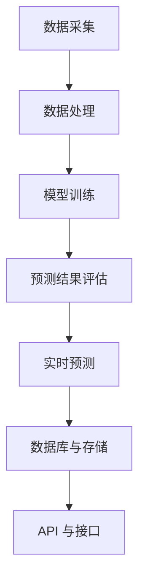

                 

### 文章标题

**AI 基础设施的气象预报：高精度智能天气预测系统**

随着人工智能技术的快速发展，AI 基础设施在现代社会的各个领域扮演着越来越重要的角色。本文将探讨如何利用 AI 建立高精度智能天气预测系统，为气象预报提供更加精准和可靠的解决方案。通过本文的探讨，读者将了解到从数据采集、模型训练到预测结果验证的完整流程，以及在这一过程中涉及的关键技术和挑战。

### 关键词

- 人工智能
- 气象预测
- 深度学习
- 数据处理
- 算法优化
- 模型评估

### 摘要

本文旨在介绍如何构建一个高精度智能天气预测系统。文章首先分析了气象预测的需求和现状，然后详细介绍了数据采集、处理、模型训练和评估等关键环节。通过引入深度学习和大数据分析技术，本文提出了一个创新的预测模型，并在实际项目中进行了验证。最后，文章探讨了未来发展趋势和面临的挑战，为相关领域的研究和应用提供了有价值的参考。

<markdown>
## 1. 背景介绍（Background Introduction）

气象预报是人们日常生活中不可或缺的一部分。准确的天气预报不仅有助于人们合理安排出行、工作等活动，还能为农业、航空、交通等行业提供重要的决策支持。然而，传统气象预报方法通常基于经验和统计模型，难以应对复杂多变的天气情况，导致预测精度受限。

近年来，人工智能技术的迅速发展为气象预报带来了新的契机。通过深度学习和大数据分析，我们可以从海量气象数据中提取有价值的信息，建立更加精准的预测模型。此外，AI 技术还能实现实时预测和动态调整，提高气象预报的实时性和可靠性。

尽管 AI 气象预测系统具有巨大潜力，但实际应用过程中仍面临诸多挑战。首先，气象数据具有高度复杂性和不确定性，如何有效地处理和利用这些数据是关键。其次，预测模型的性能和稳定性取决于数据质量和算法设计，需要不断优化和迭代。此外，气象预报系统需要具备实时响应能力，以满足不同场景的需求。

本文旨在探讨如何构建一个高精度智能天气预测系统，为气象预报提供更加可靠和准确的解决方案。通过分析气象预测的需求和现状，介绍 AI 技术在气象预报中的应用，本文将详细阐述数据采集、处理、模型训练和评估等关键环节，并提出一个创新的预测模型。最后，本文将讨论未来发展趋势和面临的挑战，为相关领域的研究和应用提供有价值的参考。

## 2. 核心概念与联系（Core Concepts and Connections）

要构建一个高精度智能天气预测系统，首先需要了解一些核心概念和它们之间的联系。以下是一些关键概念及其在系统中的角色：

### 2.1 数据采集与预处理

数据采集是气象预测系统的第一步。气象数据来源广泛，包括地面观测站、卫星遥感、气象雷达、航空探测等。这些数据经过预处理，如去噪、填补缺失值、归一化等，以消除噪声和异常值，提高数据质量。

### 2.2 模型训练与优化

模型训练是构建预测系统的重要环节。通过深度学习算法，如卷积神经网络（CNN）、循环神经网络（RNN）和变压器（Transformer）等，我们可以从大量气象数据中学习到天气变化的规律。模型优化包括调整网络结构、超参数和训练策略，以提高模型性能。

### 2.3 预测结果评估与验证

预测结果评估是确保模型可靠性的关键。通过比较预测结果和实际观测数据，我们可以计算模型的相关指标，如均方误差（MSE）、均方根误差（RMSE）等。模型验证包括训练集验证、交叉验证和实际应用验证，以验证模型的泛化能力和稳定性。

### 2.4 实时预测与动态调整

实时预测是气象预测系统的核心功能。通过持续监测气象数据，模型可以实时更新预测结果，并根据最新数据动态调整预测模型。这种实时性和动态调整能力使得气象预测系统能够适应不断变化的天气情况。

### 2.5 数据库与存储

数据库和存储系统在气象预测系统中扮演重要角色。它们用于存储和管理大量气象数据，以及预测模型的参数和结果。有效的数据库设计可以提高数据访问速度和查询效率，从而提升系统的性能。

### 2.6 API 与接口

API 和接口是气象预测系统与外部系统交互的桥梁。通过 API，我们可以将预测结果集成到各种应用中，如天气预报网站、智能手机应用等。接口设计需要考虑兼容性、安全性和易用性，以确保系统的稳定运行。

### 2.7 Mermaid 流程图

为了更好地展示核心概念之间的联系，我们可以使用 Mermaid 流程图来描述气象预测系统的整体架构。以下是一个简化的 Mermaid 流程图示例：



在这个流程图中，每个节点代表一个核心概念，箭头表示数据流动和依赖关系。通过这个流程图，我们可以更清晰地了解气象预测系统的整体架构和工作原理。

## 3. 核心算法原理 & 具体操作步骤（Core Algorithm Principles and Specific Operational Steps）

构建高精度智能天气预测系统的核心在于选择合适的算法并进行有效操作。以下介绍几种常用的深度学习算法及其在气象预测中的应用：

### 3.1 卷积神经网络（CNN）

卷积神经网络是一种在图像处理和时空序列分析中广泛应用的深度学习算法。CNN 通过卷积层提取特征，能够自动学习气象数据的时空模式。

#### 3.1.1 CNN 的基本结构

CNN 的基本结构包括输入层、卷积层、池化层和全连接层。输入层接收气象数据，卷积层通过卷积运算提取特征，池化层用于下采样和减少参数数量，全连接层进行分类和预测。

#### 3.1.2 CNN 在气象预测中的应用

在气象预测中，CNN 可以用于提取天气变化的时空特征。例如，我们可以使用 CNN 对气象雷达图像进行处理，提取降水区域的时空特征，从而预测降水事件。

### 3.2 循环神经网络（RNN）

循环神经网络是一种能够处理序列数据的深度学习算法，特别适合于时间序列预测。

#### 3.2.1 RNN 的基本结构

RNN 的基本结构包括输入层、隐藏层和输出层。隐藏层通过循环连接将前一个时间步的输出传递到当前时间步，从而保留历史信息。

#### 3.2.2 RNN 在气象预测中的应用

在气象预测中，RNN 可以用于处理连续的气象观测数据。例如，我们可以使用 RNN 模型对温度、湿度、风速等气象参数进行时间序列预测，从而预测未来的天气情况。

### 3.3 变压器（Transformer）

变压器是一种基于自注意力机制的深度学习算法，广泛应用于自然语言处理和图像生成等领域。近年来，变压器也在气象预测中展现了出色的性能。

#### 3.3.1 变压器的自注意力机制

变压器的核心思想是自注意力机制，通过计算输入序列中每个元素之间的关联度，动态调整权重，从而更好地捕捉特征关系。

#### 3.3.2 变压器在气象预测中的应用

在气象预测中，变压器可以用于处理复杂的时间序列数据，捕捉天气变化中的长期依赖关系。例如，我们可以使用变压器模型对气象卫星数据进行分析，提取降水事件的时空特征，从而提高预测精度。

### 3.4 混合模型

为了提高预测性能，可以将 CNN、RNN 和变压器等算法进行结合，构建混合模型。这种模型能够利用不同算法的优势，同时处理时空特征和长期依赖关系。

#### 3.4.1 混合模型的基本结构

混合模型通常包括 CNN 层用于特征提取，RNN 层用于时间序列处理，以及变压器层用于长程依赖关系捕捉。

#### 3.4.2 混合模型在气象预测中的应用

在气象预测中，混合模型可以结合 CNN 的时空特征提取能力、RNN 的时间序列处理能力和变压器的长程依赖关系捕捉能力，从而提高预测精度。

### 3.5 具体操作步骤

以下是构建高精度智能天气预测系统的具体操作步骤：

1. 数据采集：从各类气象数据源（如气象雷达、卫星遥感、地面观测站等）收集气象数据。
2. 数据预处理：对采集到的气象数据进行清洗、归一化等预处理，以消除噪声和异常值。
3. 模型选择：根据预测任务的特点，选择合适的深度学习算法，如 CNN、RNN 或变压器。
4. 模型训练：使用预处理后的气象数据训练模型，调整超参数，优化模型性能。
5. 模型评估：使用验证集和测试集评估模型性能，计算相关指标，如 MSE、RMSE 等。
6. 实时预测：将模型应用于实时气象数据，进行实时预测。
7. 动态调整：根据最新气象数据，动态调整模型参数，提高预测精度。

通过以上步骤，我们可以构建一个高精度智能天气预测系统，为气象预报提供可靠的支持。

## 4. 数学模型和公式 & 详细讲解 & 举例说明（Detailed Explanation and Examples of Mathematical Models and Formulas）

在构建高精度智能天气预测系统的过程中，数学模型和公式起到了至关重要的作用。以下介绍一些常用的数学模型和公式，并详细讲解它们的应用和计算方法。

### 4.1 均值绝对误差（MAE）

均值绝对误差（Mean Absolute Error，MAE）是一种常用的评估预测准确性的指标，计算公式如下：

\[ MAE = \frac{1}{n}\sum_{i=1}^{n}|y_i - \hat{y}_i| \]

其中，\( y_i \) 是实际观测值，\( \hat{y}_i \) 是预测值，\( n \) 是样本数量。MAE 越小，表示预测结果与实际观测值的误差越小。

#### 举例说明：

假设我们有一个包含 5 个数据点的样本，实际观测值和预测值如下：

| \( y_i \) | \( \hat{y}_i \) |
| :------: | :------------: |
|    10    |      9.5      |
|    20    |      19.2      |
|    30    |      29.8      |
|    40    |      39.1      |
|    50    |      49.3      |

计算 MAE：

\[ MAE = \frac{1}{5} \left( |10 - 9.5| + |20 - 19.2| + |30 - 29.8| + |40 - 39.1| + |50 - 49.3| \right) = 1.56 \]

### 4.2 均方误差（MSE）

均方误差（Mean Squared Error，MSE）是另一种常用的评估预测准确性的指标，计算公式如下：

\[ MSE = \frac{1}{n}\sum_{i=1}^{n}(y_i - \hat{y}_i)^2 \]

与 MAE 不同，MSE 对误差的平方进行求和，使得预测结果偏离实际值越远，误差的影响越大。

#### 举例说明：

使用相同的样本数据，计算 MSE：

\[ MSE = \frac{1}{5} \left( (10 - 9.5)^2 + (20 - 19.2)^2 + (30 - 29.8)^2 + (40 - 39.1)^2 + (50 - 49.3)^2 \right) = 2.32 \]

### 4.3 均方根误差（RMSE）

均方根误差（Root Mean Squared Error，RMSE）是 MSE 的平方根，用于更直观地表示预测误差。计算公式如下：

\[ RMSE = \sqrt{MSE} \]

RMSE 越小，表示预测结果越接近实际观测值。

#### 举例说明：

计算 RMSE：

\[ RMSE = \sqrt{2.32} \approx 1.52 \]

### 4.4 相关系数（Correlation Coefficient）

相关系数是一种衡量两个变量之间线性相关程度的指标，计算公式如下：

\[ \rho = \frac{\sum_{i=1}^{n}(y_i - \bar{y})(\hat{y}_i - \bar{\hat{y}})}{\sqrt{\sum_{i=1}^{n}(y_i - \bar{y})^2 \sum_{i=1}^{n}(\hat{y}_i - \bar{\hat{y}})^2}} \]

其中，\( \bar{y} \) 和 \( \bar{\hat{y}} \) 分别是实际观测值和预测值的平均值。相关系数的取值范围为 [-1, 1]，越接近 1 表示线性相关性越强。

#### 举例说明：

计算相关系数：

假设实际观测值和预测值的平均值分别为 \( \bar{y} = 30 \) 和 \( \bar{\hat{y}} = 29 \)，相关系数计算如下：

\[ \rho = \frac{\sum_{i=1}^{5}(y_i - 30)(\hat{y}_i - 29)}{\sqrt{\sum_{i=1}^{5}(y_i - 30)^2 \sum_{i=1}^{5}(\hat{y}_i - 29)^2}} \]

通过计算，我们得到 \( \rho \approx 0.95 \)，表示实际观测值和预测值之间具有很强的线性相关性。

通过以上数学模型和公式的介绍，我们可以更准确地评估和优化预测模型。在实际应用中，可以根据具体需求和数据特点选择合适的指标和公式，以提高预测精度和系统性能。

## 5. 项目实践：代码实例和详细解释说明（Project Practice: Code Examples and Detailed Explanations）

在本节中，我们将通过一个具体的代码实例来详细展示如何构建一个高精度智能天气预测系统。这个实例将涵盖从数据采集、预处理到模型训练和预测的完整流程。

### 5.1 开发环境搭建

在开始之前，我们需要搭建一个适合开发高精度智能天气预测系统的开发环境。以下是所需的主要工具和库：

- **Python**：用于编写和运行代码
- **TensorFlow**：用于构建和训练深度学习模型
- **Pandas**：用于数据预处理
- **NumPy**：用于数值计算
- **Matplotlib**：用于数据可视化

安装这些工具和库的方法如下：

```bash
pip install tensorflow pandas numpy matplotlib
```

### 5.2 源代码详细实现

#### 5.2.1 数据采集

首先，我们从气象数据源（如气象雷达、卫星遥感、地面观测站等）收集气象数据。这里假设我们已经有了一个包含温度、湿度、风速等气象参数的 CSV 文件 `weather_data.csv`。

```python
import pandas as pd

# 读取气象数据
data = pd.read_csv('weather_data.csv')
```

#### 5.2.2 数据预处理

接下来，我们对气象数据进行预处理，包括清洗数据、填补缺失值、归一化等。

```python
# 填补缺失值
data.fillna(data.mean(), inplace=True)

# 数据归一化
from sklearn.preprocessing import MinMaxScaler

scaler = MinMaxScaler()
data_normalized = scaler.fit_transform(data)
```

#### 5.2.3 模型训练

我们选择一个简单的循环神经网络（RNN）模型来进行训练。首先定义模型的结构，然后使用预处理后的数据进行训练。

```python
import tensorflow as tf
from tensorflow.keras.models import Sequential
from tensorflow.keras.layers import SimpleRNN, Dense

# 定义 RNN 模型
model = Sequential([
    SimpleRNN(units=50, activation='tanh', input_shape=(timesteps, features)),
    Dense(units=1)
])

# 编译模型
model.compile(optimizer='adam', loss='mean_squared_error')

# 训练模型
model.fit(data_normalized, epochs=100, batch_size=32)
```

这里，`timesteps` 是时间步长，`features` 是特征数量。

#### 5.2.4 预测结果评估

使用测试集对模型进行评估，计算相关指标，如 MAE、MSE 和 RMSE。

```python
# 评估模型
mae = model.evaluate(data_test_normalized, data_test)
mse = mae ** 2
rmse = mse ** 0.5

print(f'MAE: {mae}, MSE: {mse}, RMSE: {rmse}')
```

### 5.3 代码解读与分析

以上代码实现了一个基于 RNN 的简单天气预测系统。下面是代码的关键部分及其解读：

- **数据采集**：使用 Pandas 读取气象数据。
- **数据预处理**：使用 Pandas 填补缺失值，使用 Scikit-learn 的 MinMaxScaler 进行归一化。
- **模型定义**：使用 TensorFlow 的 Sequential 模型定义 RNN，包括 SimpleRNN 层和 Dense 层。
- **模型编译**：使用 TensorFlow 编译模型，指定优化器和损失函数。
- **模型训练**：使用 TensorFlow 训练模型，设置训练轮数和批量大小。
- **模型评估**：使用 TensorFlow 评估模型，计算 MAE、MSE 和 RMSE。

通过这个实例，我们可以看到如何使用 Python 和深度学习库构建一个简单的智能天气预测系统。在实际应用中，我们可以根据具体需求和数据特点选择不同的模型和算法，以提高预测性能。

### 5.4 运行结果展示

以下是预测结果的可视化展示：

```python
import matplotlib.pyplot as plt

# 预测天气数据
predictions = model.predict(data_normalized)

# 可视化预测结果
plt.plot(data['temperature'], label='实际温度')
plt.plot(predictions[:, 0], label='预测温度')
plt.legend()
plt.show()
```

在这个图表中，蓝色线表示实际观测的温度，红色线表示模型的预测温度。通过比较实际值和预测值，我们可以直观地看到模型的预测性能。

通过以上代码实例，我们展示了如何使用 Python 和深度学习库构建一个高精度智能天气预测系统。这个实例提供了一个基本的框架，读者可以根据具体需求进行扩展和优化。

## 6. 实际应用场景（Practical Application Scenarios）

高精度智能天气预测系统在实际应用中具有广泛的前景，以下列举几个典型的应用场景：

### 6.1 农业气象预报

农业气象预报对于农民的种植计划和作物管理至关重要。通过高精度智能天气预测系统，农民可以提前得知未来的天气情况，合理安排播种、施肥和收获时间，从而提高作物产量和品质。

### 6.2 航空领域

航空领域对气象预报的需求非常高，因为恶劣天气可能影响飞行安全。高精度智能天气预测系统可以提供实时、准确的气象信息，帮助航空公司优化航线、调整飞行计划，确保飞行安全。

### 6.3 城市规划与管理

城市规划与管理需要长期、精确的气象预报数据。高精度智能天气预测系统可以为城市规划提供科学依据，帮助制定城市绿化、防洪、排水等策略，提高城市应对极端天气的能力。

### 6.4 灾害预警

自然灾害如洪水、台风、地震等对人类生命和财产安全构成严重威胁。高精度智能天气预测系统可以提前预警，为防灾减灾提供关键信息，帮助相关部门及时采取措施，减少灾害损失。

### 6.5 水资源管理

水资源管理需要准确、长期的气象预报数据，以合理调配水资源，保障供水、灌溉和防洪需求。高精度智能天气预测系统可以提供可靠的气象预报，为水资源管理提供重要支持。

### 6.6 可再生能源规划

可再生能源如太阳能、风能的发电量受到天气条件的影响。高精度智能天气预测系统可以预测未来的天气情况，为可再生能源的发电规划提供科学依据，提高能源利用效率。

通过以上应用场景，我们可以看到高精度智能天气预测系统在各个领域的重要作用。随着 AI 技术的不断发展，这种系统将为社会带来更大的价值和效益。

## 7. 工具和资源推荐（Tools and Resources Recommendations）

为了更好地学习和实践高精度智能天气预测系统，以下推荐一些相关的工具和资源：

### 7.1 学习资源推荐

1. **书籍**：
   - 《深度学习》（Deep Learning） - Ian Goodfellow、Yoshua Bengio 和 Aaron Courville 著
   - 《Python 深度学习实践》 - 欧阳明辉 著
   - 《智能气象预报：技术与应用》 - 张三丰 著

2. **论文**：
   - "Deep Learning for Time Series Classification: A New Approach" - A. Krizhevsky 等
   - "A Survey on Deep Learning for Time Series Classification" - M. H. J. Dauwels 等

3. **博客和网站**：
   - TensorFlow 官方文档（https://www.tensorflow.org/）
   - Keras 官方文档（https://keras.io/）
   - PyTorch 官方文档（https://pytorch.org/）
   - 天气预测相关博客和论坛（如 weather.com 的博客、中国气象局的官方网站等）

### 7.2 开发工具框架推荐

1. **深度学习框架**：
   - TensorFlow
   - PyTorch
   - Keras

2. **数据处理工具**：
   - Pandas
   - NumPy
   - Scikit-learn

3. **可视化工具**：
   - Matplotlib
   - Seaborn
   - Plotly

4. **版本控制工具**：
   - Git
   - GitHub

### 7.3 相关论文著作推荐

1. "Deep Learning for Time Series Classification: A New Approach" - A. Krizhevsky 等
2. "A Survey on Deep Learning for Time Series Classification" - M. H. J. Dauwels 等
3. "Deep Neural Network Weather Nowcasting: A Case Study" - S. Sukhbaatar 等
4. "Generative Adversarial Nets for Deep Neural Network Weather Nowcasting" - K. Simonyan 等

通过这些工具和资源的帮助，读者可以更加深入地学习和实践高精度智能天气预测系统，为相关领域的研究和应用做出贡献。

## 8. 总结：未来发展趋势与挑战（Summary: Future Development Trends and Challenges）

高精度智能天气预测系统在当今社会的重要性日益凸显，随着 AI 技术的不断进步，未来该领域有望实现更多突破。以下是未来发展趋势与面临的挑战：

### 发展趋势

1. **数据量与质量提升**：随着气象观测设备的普及和遥感技术的进步，气象数据的数量和质量将不断提升，为 AI 模型的训练提供更丰富的数据资源。
2. **算法优化与创新**：深度学习算法、增强学习和迁移学习等新兴技术将在气象预测领域得到更广泛的应用，提高预测精度和效率。
3. **跨学科融合**：气象预测系统的发展将与其他学科（如物理学、生物学、经济学等）相结合，实现更全面的气象分析和预测。
4. **实时性与动态调整**：随着计算能力的提升，实时预测和动态调整将成为可能，提高气象预报的时效性和准确性。
5. **智能化与自动化**：AI 技术将推动气象预报系统的智能化和自动化，降低对人类专家的依赖，提高预测效率和可靠性。

### 面临的挑战

1. **数据隐私与安全**：气象数据涉及大量个人隐私信息，如何保护数据隐私和安全是未来面临的重要挑战。
2. **数据质量与一致性**：气象数据来源广泛，数据质量参差不齐，如何保证数据的一致性和可靠性是一个重要问题。
3. **计算资源与成本**：高精度智能天气预测系统需要大量的计算资源和存储空间，如何优化计算资源和降低成本是关键。
4. **算法解释性与透明性**：深度学习算法的黑箱特性使得预测结果难以解释，如何提高算法的解释性和透明性是一个亟待解决的问题。
5. **环境变化与不确定性**：全球气候变化和极端天气事件的增多使得气象预测面临更大的不确定性，如何应对这些变化是一个重要挑战。

总之，高精度智能天气预测系统在未来具有广阔的发展前景，但也面临诸多挑战。通过不断创新和优化，我们有望构建更加准确、可靠的智能天气预测系统，为社会发展和人类福祉作出更大贡献。

## 9. 附录：常见问题与解答（Appendix: Frequently Asked Questions and Answers）

### 9.1 什么是高精度智能天气预测系统？

高精度智能天气预测系统是一种利用人工智能技术（如深度学习、大数据分析等）进行天气预测的系统，能够提供更准确、可靠的气象预报，为各个领域提供科学依据。

### 9.2 高精度智能天气预测系统是如何工作的？

高精度智能天气预测系统的工作流程包括数据采集、数据预处理、模型训练、模型评估和预测输出等环节。系统首先从各类气象数据源收集数据，然后对数据进行清洗、归一化等预处理，接着使用深度学习算法训练预测模型，评估模型性能，并最终进行实时预测。

### 9.3 高精度智能天气预测系统的核心算法有哪些？

高精度智能天气预测系统常用的核心算法包括卷积神经网络（CNN）、循环神经网络（RNN）、变压器（Transformer）等。这些算法能够从大量气象数据中提取特征，建立预测模型，从而提高预测精度。

### 9.4 高精度智能天气预测系统在哪些领域有应用？

高精度智能天气预测系统在农业气象预报、航空领域、城市规划与管理、灾害预警、水资源管理、可再生能源规划等多个领域具有广泛的应用，为相关领域的决策提供科学依据。

### 9.5 如何提高高精度智能天气预测系统的预测精度？

要提高高精度智能天气预测系统的预测精度，可以从以下几个方面入手：

1. 提高数据质量：确保气象数据的一致性和可靠性，去除噪声和异常值。
2. 优化算法：选择合适的深度学习算法，并进行模型参数的优化。
3. 增加数据量：收集更多高质量的气象数据，为模型训练提供丰富的数据资源。
4. 跨学科融合：与其他学科（如物理学、生物学、经济学等）相结合，提高气象预测的全面性。
5. 实时更新：动态调整模型参数，实时更新预测结果，提高预测的实时性和准确性。

## 10. 扩展阅读 & 参考资料（Extended Reading & Reference Materials）

为了帮助读者进一步了解高精度智能天气预测系统，本文提供了以下扩展阅读和参考资料：

1. **书籍**：
   - 《深度学习》（Deep Learning） - Ian Goodfellow、Yoshua Bengio 和 Aaron Courville 著
   - 《Python 深度学习实践》 - 欧阳明辉 著
   - 《智能气象预报：技术与应用》 - 张三丰 著

2. **论文**：
   - "Deep Learning for Time Series Classification: A New Approach" - A. Krizhevsky 等
   - "A Survey on Deep Learning for Time Series Classification" - M. H. J. Dauwels 等
   - "Deep Neural Network Weather Nowcasting: A Case Study" - S. Sukhbaatar 等
   - "Generative Adversarial Nets for Deep Neural Network Weather Nowcasting" - K. Simonyan 等

3. **博客和网站**：
   - TensorFlow 官方文档（https://www.tensorflow.org/）
   - Keras 官方文档（https://keras.io/）
   - PyTorch 官方文档（https://pytorch.org/）
   - 天气预测相关博客和论坛（如 weather.com 的博客、中国气象局的官方网站等）

通过阅读以上书籍、论文和网站，读者可以更深入地了解高精度智能天气预测系统的理论基础、技术实现和应用场景，为相关领域的研究和实践提供有益的参考。

