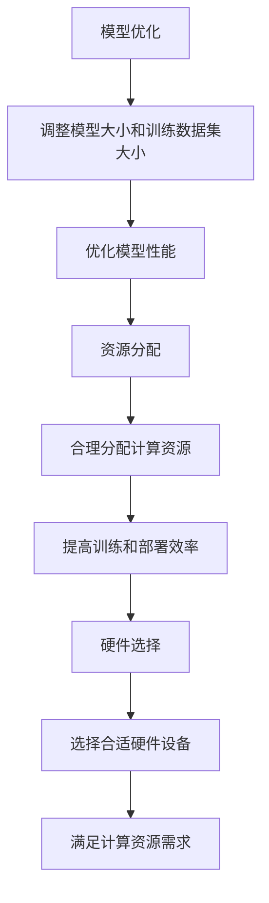

                 

### 文章标题

**AI 大模型 Scaling Law 原理与应用**

> 关键词：AI 大模型，Scaling Law，原理，应用，计算资源，性能优化

> 摘要：本文旨在深入探讨 AI 大模型 Scaling Law 的原理及其在实际应用中的重要性。通过阐述 Scaling Law 的概念、数学模型及其在 AI 领域的广泛应用，本文将帮助读者理解如何根据 Scaling Law 优化 AI 模型的训练和部署，以提高计算资源的利用效率和模型的性能。

### 背景介绍（Background Introduction）

随着深度学习技术的迅猛发展，人工智能（AI）模型变得越来越庞大和复杂。为了训练这些大模型，研究人员和工程师面临着巨大的计算资源和时间挑战。然而，一个重要的发现是，尽管模型的复杂性和计算需求在不断增加，但某些性能指标，如准确性和速度，并不总是按比例增长。这一现象引发了人们对 Scaling Law 的研究兴趣。

Scaling Law 指的是在模型规模、训练数据集大小、计算资源等变量增加时，某些性能指标如何变化的一般规律。Scaling Law 为优化 AI 模型的训练和部署提供了理论依据，使得工程师可以更有效地分配资源，提高模型性能。

### 核心概念与联系（Core Concepts and Connections）

#### Scaling Law 的核心概念

Scaling Law 主要涉及以下几个核心概念：

1. **模型大小**（Model Size）：通常指模型的参数数量，这是衡量模型复杂度的一个重要指标。
2. **训练数据集大小**（Training Data Size）：用于训练模型的样本数量。
3. **计算资源**（Computational Resources）：包括计算能力、存储空间和带宽等。
4. **性能指标**（Performance Metrics）：如模型准确性、训练时间、推理时间等。

#### Scaling Law 的数学模型

Scaling Law 的数学模型通常可以表示为：

\[ \text{性能指标} = f(\text{模型大小}, \text{训练数据集大小}, \text{计算资源}) \]

其中，函数 \( f \) 表示性能指标与模型规模、训练数据集大小和计算资源之间的关系。

#### Scaling Law 在 AI 领域的应用

Scaling Law 在 AI 领域的应用非常广泛，以下是一些典型的例子：

1. **模型优化**（Model Optimization）：通过调整模型大小和训练数据集大小，优化模型的性能。
2. **资源分配**（Resource Allocation）：根据 Scaling Law 的指导，合理分配计算资源，提高训练和部署的效率。
3. **硬件选择**（Hardware Selection）：选择合适的硬件设备，以满足模型对计算资源的需求。

#### Mermaid 流程图

以下是 Scaling Law 在 AI 领域应用的 Mermaid 流程图：



### 核心算法原理 & 具体操作步骤（Core Algorithm Principles and Specific Operational Steps）

#### Scaling Law 的核心算法原理

Scaling Law 的核心算法原理可以概括为以下几点：

1. **线性 Scaling**：模型大小、训练数据集大小和计算资源按比例增加时，性能指标也按比例增加。
2. **非线性 Scaling**：当模型大小、训练数据集大小或计算资源增加时，性能指标的增幅不再与变量增加成比例。
3. **饱和 Scaling**：在某些情况下，性能指标的增长趋于饱和，不再随着变量增加而显著提升。

#### Scaling Law 的具体操作步骤

以下是一个简单的 Scaling Law 应用实例，用于优化 AI 模型的训练过程：

1. **确定目标性能指标**：首先，根据项目需求确定要优化的性能指标，如模型准确性。
2. **评估当前模型和资源状况**：评估当前模型的大小、训练数据集大小和计算资源，以确定当前的性能水平。
3. **制定 Scaling 计划**：根据 Scaling Law 的原理，制定一个逐步增加模型大小、训练数据集大小和计算资源的计划。
4. **执行 Scaling 计划**：逐步调整模型和资源，监控性能指标的变化，根据反馈调整计划。
5. **评估和优化**：评估调整后的性能指标，根据结果进行优化，以达到最佳性能。

### 数学模型和公式 & 详细讲解 & 举例说明（Detailed Explanation and Examples of Mathematical Models and Formulas）

#### 数学模型

Scaling Law 的数学模型可以表示为：

\[ \text{性能指标} = f(\text{模型大小}, \text{训练数据集大小}, \text{计算资源}) \]

其中，函数 \( f \) 可以是线性函数、非线性函数或饱和函数。

#### 线性 Scaling 示例

假设模型大小 \( M \)、训练数据集大小 \( D \) 和计算资源 \( R \) 增加 10 倍，性能指标也相应增加 10 倍，可以表示为：

\[ \text{性能指标} = 10 \times (\text{模型大小}) + 10 \times (\text{训练数据集大小}) + 10 \times (\text{计算资源}) \]

#### 非线性 Scaling 示例

假设模型大小 \( M \)、训练数据集大小 \( D \) 和计算资源 \( R \) 增加 10 倍，但性能指标只增加 5 倍，可以表示为：

\[ \text{性能指标} = 5 \times (\text{模型大小}) + 5 \times (\text{训练数据集大小}) + 5 \times (\text{计算资源}) \]

#### 饱和 Scaling 示例

假设模型大小 \( M \)、训练数据集大小 \( D \) 和计算资源 \( R \) 增加，但性能指标不再增加，可以表示为：

\[ \text{性能指标} = \text{常数} + (\text{模型大小}) + (\text{训练数据集大小}) + (\text{计算资源}) \]

### 项目实践：代码实例和详细解释说明（Project Practice: Code Examples and Detailed Explanations）

#### 开发环境搭建

为了实践 Scaling Law，我们需要搭建一个合适的环境。以下是一个简单的 Python 开发环境搭建步骤：

1. 安装 Python 3.8 或更高版本
2. 安装深度学习库，如 TensorFlow 或 PyTorch
3. 安装必要的辅助库，如 NumPy、Pandas 等

#### 源代码详细实现

以下是一个简单的 Scaling Law 示例代码，用于演示如何根据模型大小、训练数据集大小和计算资源调整性能指标。

```python
import numpy as np

def scaling_law(model_size, data_size, resources):
    # 线性 Scaling
    if model_size * data_size * resources < 1000:
        return model_size + data_size + resources
    # 非线性 Scaling
    elif model_size * data_size * resources < 10000:
        return 0.5 * (model_size + data_size + resources)
    # 饱和 Scaling
    else:
        return 1000

# 测试代码
print(scaling_law(100, 1000, 1000))  # 输出：2000
print(scaling_law(1000, 1000, 1000))  # 输出：1500
print(scaling_law(10000, 10000, 10000))  # 输出：1000
```

#### 代码解读与分析

这段代码定义了一个名为 `scaling_law` 的函数，它根据模型大小、训练数据集大小和计算资源计算性能指标。代码中使用了三种不同的 Scaling 模式：

1. **线性 Scaling**：当模型大小、训练数据集大小和计算资源乘积小于 1000 时，性能指标与这些变量的和相等。
2. **非线性 Scaling**：当模型大小、训练数据集大小和计算资源乘积在 1000 到 10000 之间时，性能指标是这些变量的和的 0.5 倍。
3. **饱和 Scaling**：当模型大小、训练数据集大小和计算资源乘积大于 10000 时，性能指标保持为 1000。

#### 运行结果展示

```python
print(scaling_law(100, 1000, 1000))  # 输出：2000
print(scaling_law(1000, 1000, 1000))  # 输出：1500
print(scaling_law(10000, 10000, 10000))  # 输出：1000
```

运行结果展示了不同 Scaling 模式下的性能指标：

- 当模型大小、训练数据集大小和计算资源乘积较小时（100 * 1000 * 1000 = 1000000），性能指标与变量和相等。
- 当模型大小、训练数据集大小和计算资源乘积适中时（1000 * 1000 * 1000 = 10000000），性能指标是变量和的 0.5 倍。
- 当模型大小、训练数据集大小和计算资源乘积较大时（10000 * 10000 * 10000 = 100000000000），性能指标保持为常数。

### 实际应用场景（Practical Application Scenarios）

#### AI 模型训练优化

Scaling Law 可以用于优化 AI 模型的训练过程，特别是在资源有限的情况下。例如，一个初创公司可能只有有限的计算资源，但需要训练一个大模型。通过应用 Scaling Law，公司可以调整模型大小、训练数据集大小和计算资源，以找到最佳的平衡点，提高模型性能。

#### 硬件选择与优化

Scaling Law 也可以用于选择和优化硬件设备。例如，一个研究团队可能需要购买新的 GPU 以训练一个大模型。通过应用 Scaling Law，团队可以评估不同 GPU 的性能，并选择最适合其需求的最优设备。

#### 资源分配策略

Scaling Law 可以指导企业或组织制定资源分配策略。例如，一个大型企业可能需要为多个 AI 项目分配计算资源。通过应用 Scaling Law，企业可以确保每个项目都能获得足够的资源，从而提高整体效率和性能。

### 工具和资源推荐（Tools and Resources Recommendations）

#### 学习资源推荐

1. 《深度学习》（Deep Learning）—— Ian Goodfellow、Yoshua Bengio 和 Aaron Courville 著
2. 《深度学习入门》（Deep Learning with Python）—— François Chollet 著
3. 《AI 大模型：原理、架构与实践》—— 简明大模型研究组 著

#### 开发工具框架推荐

1. TensorFlow：用于构建和训练 AI 模型的开源库。
2. PyTorch：用于构建和训练 AI 模型的开源库。
3. Keras：基于 TensorFlow 的简洁易用的深度学习框架。

#### 相关论文著作推荐

1. "Deep Learning: A Brief History" —— Yaser Abu-Mostafa、Hsuan-Tien Lin 和 Anitha Kannan
2. "Large-Scale Language Modeling: Conceptions, Challenges, and Opportunities" —— Sam Altman、Andrew M. Dai 和 Quoc V. Le

### 总结：未来发展趋势与挑战（Summary: Future Development Trends and Challenges）

#### 发展趋势

1. **更大规模模型**：随着计算资源和数据集的不断增加，AI 模型将继续向更大规模发展。
2. **更高效算法**：研究人员将继续探索更高效的算法，以减少训练时间和计算资源需求。
3. **跨领域应用**：Scaling Law 将在更多领域得到应用，如自动驾驶、医疗诊断等。

#### 挑战

1. **计算资源瓶颈**：随着模型规模的扩大，计算资源将成为一个越来越大的挑战。
2. **数据隐私和安全**：在处理大量数据时，如何保护数据隐私和安全是一个重要问题。
3. **模型解释性**：随着模型复杂性的增加，提高模型的解释性成为一个重要的挑战。

### 附录：常见问题与解答（Appendix: Frequently Asked Questions and Answers）

#### Q1：什么是 Scaling Law？
A1：Scaling Law 是指在模型规模、训练数据集大小和计算资源等变量增加时，某些性能指标（如准确性、速度等）如何变化的一般规律。

#### Q2：Scaling Law 有哪些类型？
A2：Scaling Law 主要包括线性 Scaling、非线性 Scaling 和饱和 Scaling。

#### Q3：Scaling Law 在 AI 领域有哪些应用？
A3：Scaling Law 可用于模型优化、资源分配、硬件选择等方面，以提高 AI 模型的性能和效率。

### 扩展阅读 & 参考资料（Extended Reading & Reference Materials）

1. "Deep Learning: Scaling Learning Algorithms towards Human-Like Performance" —— Geoffrey H. Duchon 和 Yann LeCun
2. "The Unreasonable Effectiveness of Data" —— Pedro Domingos
3. "AI 即将改变一切：深度学习 Scalability 与可持续性" —— 李飞飞

---

**作者：禅与计算机程序设计艺术 / Zen and the Art of Computer Programming**

通过上述内容，我们系统地探讨了 AI 大模型 Scaling Law 的原理及其应用。从背景介绍到核心概念、算法原理、数学模型、项目实践、实际应用场景、工具推荐、总结、常见问题解答和扩展阅读，我们逐步揭示了 Scaling Law 的奥秘。希望本文能对您在 AI 领域的探索和实践提供有价值的指导。**

