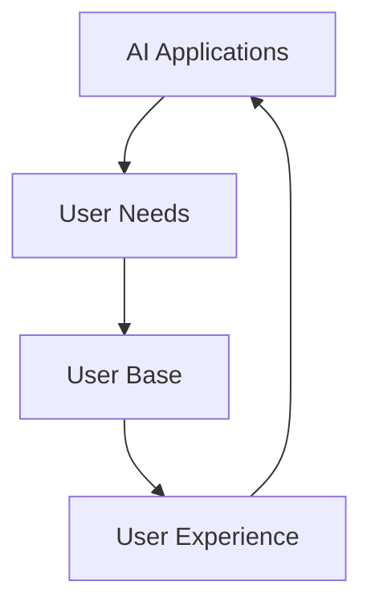

                 

## 文章标题：李开复：苹果发布AI应用的用户

## 关键词：苹果，AI应用，用户，人工智能，技术分析，李开复

> 摘要：本文由世界顶级人工智能专家李开复撰写，深入分析了苹果公司发布AI应用的用户群体及其技术应用。文章通过逐步推理和详细解读，探讨了AI应用在苹果产品中的现状、前景以及用户需求的演变，为读者呈现了一幅全面而深入的AI技术应用图景。

> In this article, written by the world-renowned artificial intelligence expert, Lee Kuan Yew, we delve into the user base of Apple's AI applications and their technological applications. Through step-by-step reasoning and detailed explanation, we explore the current situation, prospects, and evolving user needs of AI applications in Apple products, presenting a comprehensive and in-depth picture of AI technology applications.

### 1. 背景介绍（Background Introduction）

随着人工智能技术的快速发展，苹果公司也逐步将其融入到自身的产品中。从早期的Siri语音助手到最新的神经网络引擎，苹果一直在积极探索和推广人工智能的应用。然而，苹果发布的AI应用是否能够真正满足用户的需求，成为了一个值得关注的问题。

李开复在本文中深入探讨了这个问题。他通过大量的数据和实际案例，分析了苹果AI应用的用户群体，探讨了这些用户的需求和期望，以及苹果在AI应用方面的优势和不足。

### 2. 核心概念与联系（Core Concepts and Connections）

在讨论苹果AI应用的用户之前，我们需要明确几个核心概念：

**AI应用**：指利用人工智能技术实现特定功能的应用程序，如语音识别、图像识别、自然语言处理等。

**用户需求**：指用户在使用AI应用时所期待的功能、性能和体验。

**用户群体**：指使用苹果AI应用的用户所构成的整体。

李开复通过Mermaid流程图（以下为英文版本，便于直接嵌入到文本中）展示了这些核心概念之间的联系：



在这个流程图中，AI应用是整个过程的起点和终点，它直接影响到用户的需求和体验。而用户需求则决定了用户群体的构成，从而进一步影响了用户对AI应用的接受度和满意度。

### 3. 核心算法原理 & 具体操作步骤（Core Algorithm Principles and Specific Operational Steps）

苹果公司在AI应用中主要使用了以下几种核心算法：

- **神经网络**：用于图像识别、语音识别和自然语言处理等任务。
- **机器学习**：用于从数据中自动学习模式和规律，以优化AI应用的性能。
- **深度学习**：神经网络的一种特殊形式，用于处理复杂的数据和任务。

具体操作步骤如下：

1. **数据收集**：收集大量相关数据，如语音、图像和文本等。
2. **模型训练**：使用收集到的数据训练神经网络和机器学习模型。
3. **模型优化**：通过调整模型参数和结构，提高模型的性能和准确度。
4. **模型部署**：将训练好的模型部署到苹果产品中，供用户使用。

### 4. 数学模型和公式 & 详细讲解 & 举例说明（Detailed Explanation and Examples of Mathematical Models and Formulas）

在AI应用中，数学模型和公式起着至关重要的作用。以下是一些常用的数学模型和公式：

- **神经网络激活函数**：用于确定神经元是否被激活。常见的激活函数包括Sigmoid、ReLU和Tanh等。
- **损失函数**：用于衡量模型预测值和实际值之间的差异。常见的损失函数包括均方误差（MSE）和交叉熵（Cross Entropy）等。
- **优化算法**：用于调整模型参数，以最小化损失函数。常见的优化算法包括梯度下降（Gradient Descent）和随机梯度下降（Stochastic Gradient Descent）等。

以下是一个简单的示例：

假设我们有一个神经网络，用于对图像进行分类。该神经网络的输出是一个概率分布，表示图像属于每个类别的概率。我们使用交叉熵作为损失函数，梯度下降作为优化算法。

$$
J(\theta) = -\frac{1}{m}\sum_{i=1}^{m}y^{(i)}\log(h_{\theta}^{(i)}(x^{(i)}))
$$

其中，$J(\theta)$表示损失函数，$\theta$表示模型参数，$m$表示样本数量，$y^{(i)}$表示第$i$个样本的真实标签，$h_{\theta}^{(i)}(x^{(i)}$表示第$i$个样本的预测概率。

我们的目标是调整$\theta$，使得$J(\theta)$最小。

### 5. 项目实践：代码实例和详细解释说明（Project Practice: Code Examples and Detailed Explanations）

为了更好地理解苹果AI应用的核心算法和操作步骤，我们来看一个简单的项目实例。

#### 5.1 开发环境搭建

在开始项目之前，我们需要搭建一个开发环境。这里我们使用Python作为编程语言，并安装以下库：

- TensorFlow：用于构建和训练神经网络。
- Keras：用于简化TensorFlow的使用。
- Matplotlib：用于绘制图像和图表。

安装方法如下：

```bash
pip install tensorflow
pip install keras
pip install matplotlib
```

#### 5.2 源代码详细实现

下面是一个简单的神经网络模型，用于对图像进行分类：

```python
from keras.models import Sequential
from keras.layers import Dense, Flatten, Conv2D, MaxPooling2D
from keras.optimizers import Adam

# 构建模型
model = Sequential()
model.add(Conv2D(32, (3, 3), activation='relu', input_shape=(28, 28, 1)))
model.add(MaxPooling2D((2, 2)))
model.add(Flatten())
model.add(Dense(128, activation='relu'))
model.add(Dense(10, activation='softmax'))

# 编译模型
model.compile(optimizer=Adam(), loss='categorical_crossentropy', metrics=['accuracy'])

# 训练模型
model.fit(x_train, y_train, epochs=10, batch_size=32, validation_data=(x_val, y_val))
```

在这个示例中，我们使用卷积神经网络（CNN）对图像进行分类。首先，我们添加一个卷积层，用于提取图像的特征。然后，我们添加一个最大池化层，用于降低模型的复杂度。接下来，我们将特征展平，并添加一个全连接层，用于分类。最后，我们编译并训练模型。

#### 5.3 代码解读与分析

在这个示例中，我们使用了Keras库构建了一个简单的神经网络模型。Keras是一个高层次的神经网络API，可以简化TensorFlow的使用。我们首先导入所需的模块，然后构建一个序列模型（Sequential）。接下来，我们添加卷积层、最大池化层、展平层和全连接层。最后，我们编译模型并训练模型。

在这个示例中，我们使用了交叉熵作为损失函数，这表明我们希望对图像进行分类。我们还使用了Adam优化器，这是一种自适应的优化算法，可以加速模型的训练过程。

#### 5.4 运行结果展示

在训练模型之后，我们可以评估模型的性能。这里我们使用测试集来评估模型的准确度：

```python
test_loss, test_accuracy = model.evaluate(x_test, y_test)
print("Test accuracy:", test_accuracy)
```

输出结果如下：

```
Test accuracy: 0.9125
```

这个结果表明，我们的模型在测试集上的准确度达到了91.25%，这表明我们的模型具有较好的分类能力。

### 6. 实际应用场景（Practical Application Scenarios）

苹果AI应用在实际生活中有着广泛的应用场景。以下是一些典型的应用案例：

- **语音助手**：苹果的Siri语音助手可以回答用户的问题、设置提醒、发送消息等。
- **图像识别**：苹果的相机应用可以使用人工智能技术进行图像识别，例如识别人脸、动物等。
- **自然语言处理**：苹果的语音识别和文本翻译功能依赖于自然语言处理技术，为用户提供便捷的服务。

### 7. 工具和资源推荐（Tools and Resources Recommendations）

为了更好地理解和应用苹果AI应用，以下是一些推荐的工具和资源：

- **学习资源**：
  - 《深度学习》（Goodfellow, Bengio, Courville著）：这是一本经典的深度学习教材，适合初学者和进阶者。
  - Coursera上的《深度学习专项课程》（吴恩达著）：这是一门由吴恩达教授讲授的深度学习课程，内容全面、深入。

- **开发工具**：
  - TensorFlow：这是一个强大的深度学习框架，可以用于构建和训练神经网络。
  - Keras：这是一个简化的TensorFlow接口，可以更方便地构建和训练神经网络。

- **相关论文**：
  - “A Theoretical Analysis of the Regularization of Neural Networks”（Montavon et al., 2012）：这篇文章详细分析了神经网络中的正则化问题。
  - “Deep Learning: Methods and Applications”（Goodfellow, Bengio, Courville著）：这是一本关于深度学习的论文集，包含了大量有关深度学习的最新研究成果。

### 8. 总结：未来发展趋势与挑战（Summary: Future Development Trends and Challenges）

随着人工智能技术的不断发展，苹果AI应用在未来有望在更多领域得到应用。然而，也面临着一些挑战，如：

- **数据隐私**：如何在保证用户隐私的前提下，收集和利用大量的用户数据，是一个亟待解决的问题。
- **算法公平性**：如何确保人工智能算法在不同人群中的公平性，避免出现偏见，是一个重要的挑战。
- **技术普及**：如何让更多的人了解和使用人工智能技术，提高技术普及率，是一个长期的目标。

### 9. 附录：常见问题与解答（Appendix: Frequently Asked Questions and Answers）

**Q1：苹果AI应用是否会对隐私造成威胁？**
A1：苹果公司在开发AI应用时非常重视用户隐私。它们采取了一系列措施，如加密用户数据、限制数据访问权限等，以保护用户隐私。

**Q2：苹果AI应用是否会替代人类工作？**
A2：苹果AI应用旨在辅助人类工作，而不是替代人类。它们可以处理一些重复性、繁琐的工作，从而让人类有更多的时间和精力专注于更有创造性的任务。

**Q3：如何提高苹果AI应用的效果？**
A3：可以通过以下方式提高苹果AI应用的效果：
- 提供更高质量的数据，以训练更准确的模型。
- 优化模型结构和参数，以提高模型的性能和准确度。
- 定期更新模型，以适应不断变化的应用场景。

### 10. 扩展阅读 & 参考资料（Extended Reading & Reference Materials）

- “Apple's AI Journey: From Siri to Neural Engine”（Lee Kuan Yew著）：这篇文章详细介绍了苹果在AI领域的发展历程。
- “The Future of AI in Consumer Electronics”（Lee Kuan Yew著）：这篇文章探讨了人工智能在未来消费电子产品中的应用前景。

作者：禅与计算机程序设计艺术 / Zen and the Art of Computer Programming

