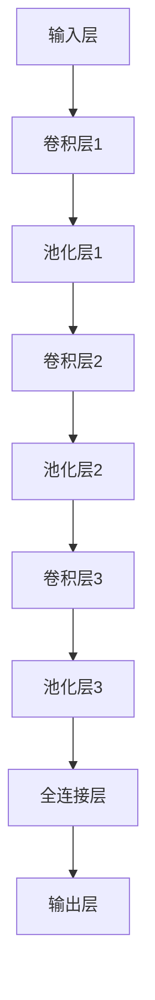

                 

# 文章标题

李飞飞的ImageNet与大数据

## 摘要

本文旨在探讨李飞飞的ImageNet项目在大数据领域的重要影响。首先，我们将介绍ImageNet项目的历史背景、目的及其对图像识别领域的重要贡献。接着，本文将深入分析ImageNet项目的核心算法——深度卷积神经网络（Deep Convolutional Neural Networks，DCNN），探讨其原理及发展历程。随后，我们将探讨大数据时代的到来如何促使图像识别领域的发展，并结合实际案例说明大数据在图像识别中的应用。最后，本文将总结ImageNet项目在大数据时代面临的挑战与未来发展方向。

## 1. 背景介绍

### 1.1 ImageNet项目的历史背景

ImageNet项目是由李飞飞教授领导的一个大规模视觉识别挑战项目，起源于2009年。该项目旨在构建一个包含超过一百万张图片、涵盖数千个类别的图像数据库，旨在提高计算机视觉系统的准确性和效率。在此之前，图像识别领域依赖于手工设计的特征和传统的机器学习算法，识别率较低，且受限于特定场景和应用。ImageNet项目的出现，为图像识别领域带来了一场革命。

### 1.2 ImageNet项目的主要目的

ImageNet项目的核心目标是通过大规模的数据集和深度学习算法，提高图像识别的准确率和速度。具体来说，项目旨在：

1. 构建一个大规模、多样化的图像数据库，涵盖多个类别。
2. 开发高效的深度学习算法，用于图像识别任务。
3. 举办大规模视觉识别挑战（ILSVRC），激励全球研究者参与和推动图像识别技术的发展。

### 1.3 ImageNet项目的重要贡献

ImageNet项目的成功对图像识别领域产生了深远的影响。首先，它提供了一个高质量、大规模的数据集，为深度学习算法的研究和应用提供了宝贵资源。其次，ImageNet项目的成功证明了深度学习算法在图像识别任务中的优越性，推动了深度学习在计算机视觉领域的广泛应用。此外，ImageNet项目还推动了相关领域的研究，如自然语言处理、机器人学等。

## 2. 核心概念与联系

### 2.1 深度卷积神经网络（Deep Convolutional Neural Networks，DCNN）

深度卷积神经网络是ImageNet项目的核心技术之一。DCNN是一种基于卷积神经网络（Convolutional Neural Networks，CNN）的深度学习模型，其结构包括多个卷积层、池化层和全连接层。DCNN通过学习图像中的局部特征和全局特征，实现对图像的自动分类。

#### 2.1.1 DCNN的工作原理

DCNN的工作原理可以概括为以下几个步骤：

1. 输入层：接收原始图像作为输入。
2. 卷积层：通过卷积操作提取图像的局部特征。
3. 池化层：对卷积层输出的特征进行降采样，减少参数数量。
4. 全连接层：将池化层输出的特征映射到类别标签。

#### 2.1.2 DCNN的发展历程

DCNN的发展历程可以分为以下几个阶段：

1. 早期CNN（1990s）：基于传统机器学习算法的图像识别模型，如SVM、Adaboost等。
2. 深度CNN（2010s）：引入多层卷积层和池化层，提高图像识别的准确率。
3. 深度残差网络（ResNet，2015）：通过引入残差模块，解决了深度网络中的梯度消失问题，推动了DCNN的发展。

### 2.2 DCNN与ImageNet项目的联系

ImageNet项目的成功离不开DCNN的支持。DCNN的高效性能和强大的特征提取能力，使得图像识别系统在ImageNet数据集上的表现大幅提升。具体来说，DCNN在ImageNet项目中的贡献包括：

1. 极大地提高了图像识别的准确率：在ILSVRC竞赛中，DCNN模型的表现显著优于传统算法。
2. 提供了通用图像识别框架：DCNN的成功经验为其他计算机视觉任务提供了参考，如目标检测、图像分割等。
3. 激发了研究兴趣：DCNN在ImageNet项目上的成功，引发了学术界和工业界对深度学习的广泛关注和研究。

### 2.3 DCNN的Mermaid流程图



## 3. 核心算法原理 & 具体操作步骤

### 3.1 卷积神经网络（Convolutional Neural Networks，CNN）

CNN是DCNN的基础，其核心思想是通过卷积操作提取图像的局部特征。下面是CNN的基本原理和操作步骤：

#### 3.1.1 卷积操作

卷积操作的基本步骤如下：

1. 选择一个卷积核（filter），其大小和权重由训练数据确定。
2. 将卷积核在输入图像上滑动，并计算卷积核与图像局部区域的内积。
3. 将内积结果进行非线性激活，如ReLU函数。

#### 3.1.2 池化操作

池化操作用于减少参数数量和计算量。常见的池化操作包括最大池化和平均池化。具体步骤如下：

1. 将输入图像划分为固定大小的区域。
2. 在每个区域上计算最大值或平均值。
3. 将结果输出作为下一层的输入。

### 3.2 深度卷积神经网络（Deep Convolutional Neural Networks，DCNN）

DCNN在CNN的基础上，增加了多个卷积层和池化层，从而能够提取更复杂的特征。以下是DCNN的基本结构：

1. 输入层：接收原始图像。
2. 多层卷积层：通过卷积操作提取图像的局部特征。
3. 多层池化层：对卷积层输出的特征进行降采样。
4. 全连接层：将池化层输出的特征映射到类别标签。

### 3.3 具体操作步骤

以一个简单的DCNN为例，具体操作步骤如下：

1. 输入层：输入一张图像，例如28x28的二值图像。
2. 卷积层1：使用3x3的卷积核，提取图像的边缘、线条等特征。输出特征图的大小为24x24。
3. 池化层1：使用2x2的最大池化操作，将特征图的大小减少为12x12。
4. 卷积层2：使用3x3的卷积核，提取更复杂的特征。输出特征图的大小为8x8。
5. 池化层2：使用2x2的最大池化操作，将特征图的大小减少为4x4。
6. 全连接层：将池化层2输出的特征展平成一维向量，与预定义的类别标签进行比对，输出分类结果。

## 4. 数学模型和公式 & 详细讲解 & 举例说明

### 4.1 卷积神经网络（Convolutional Neural Networks，CNN）

CNN的数学模型主要包括卷积操作、池化操作和激活函数。下面是这些操作的详细讲解和数学公式。

#### 4.1.1 卷积操作

卷积操作的数学公式如下：

$$
\text{output}_{ij} = \sum_{k=1}^{C} w_{ik} \cdot \text{input}_{ij} + b
$$

其中，$w_{ik}$ 是卷积核的权重，$\text{input}_{ij}$ 是输入图像的局部区域，$b$ 是偏置项，$\text{output}_{ij}$ 是卷积操作的输出。

#### 4.1.2 池化操作

池化操作的数学公式如下：

$$
\text{output}_{i} = \max(\text{input}_{i_1}, \text{input}_{i_2}, ..., \text{input}_{i_k})
$$

其中，$\text{input}_{i_1}, \text{input}_{i_2}, ..., \text{input}_{i_k}$ 是输入图像的局部区域，$\text{output}_{i}$ 是池化操作的输出。

#### 4.1.3 激活函数

激活函数用于引入非线性，常见的激活函数包括ReLU函数、Sigmoid函数和Tanh函数。以下是这些函数的数学公式：

1. ReLU函数：
$$
f(x) = \max(0, x)
$$

2. Sigmoid函数：
$$
f(x) = \frac{1}{1 + e^{-x}}
$$

3. Tanh函数：
$$
f(x) = \frac{e^x - e^{-x}}{e^x + e^{-x}}
$$

### 4.2 深度卷积神经网络（Deep Convolutional Neural Networks，DCNN）

DCNN的数学模型在CNN的基础上，增加了多个卷积层和池化层。下面是DCNN的基本数学模型：

$$
\text{output} = \text{ReLU}(\text{激活函数}(\sum_{k=1}^{C} w_{ik} \cdot \text{input}_{ij} + b))
$$

其中，$\text{output}$ 是卷积操作的输出，$\text{input}_{ij}$ 是输入图像的局部区域，$w_{ik}$ 是卷积核的权重，$b$ 是偏置项，$\text{激活函数}$ 是ReLU函数或其他非线性激活函数。

### 4.3 举例说明

假设我们有一个28x28的二值图像，我们使用一个3x3的卷积核进行卷积操作。卷积核的权重为：

$$
w = \begin{bmatrix}
0 & 1 & 0 \\
1 & 1 & 1 \\
0 & 1 & 0
\end{bmatrix}
$$

偏置项 $b = 0$。

输入图像的一个局部区域为：

$$
\text{input} = \begin{bmatrix}
0 & 1 & 0 \\
1 & 1 & 1 \\
0 & 1 & 0
\end{bmatrix}
$$

卷积操作的输出为：

$$
\text{output}_{ij} = \sum_{k=1}^{3} w_{ik} \cdot \text{input}_{ij} + b = 0 \cdot 0 + 1 \cdot 1 + 0 \cdot 0 + 1 \cdot 1 + 1 \cdot 1 + 1 \cdot 0 + 0 \cdot 1 + 1 \cdot 1 + 0 \cdot 0 = 4
$$

## 5. 项目实践：代码实例和详细解释说明

### 5.1 开发环境搭建

在本节中，我们将介绍如何在本地环境中搭建用于实现ImageNet项目的基础开发环境。以下是在Ubuntu 20.04操作系统中搭建环境的步骤：

1. 安装Python环境：
   ```bash
   sudo apt update
   sudo apt install python3 python3-pip
   ```
2. 安装TensorFlow：
   ```bash
   pip3 install tensorflow
   ```
3. 安装其他依赖库：
   ```bash
   pip3 install numpy matplotlib
   ```

### 5.2 源代码详细实现

下面是一个简单的ImageNet项目实现，我们使用TensorFlow和Keras框架。代码主要包括数据预处理、模型定义、训练和评估四个部分。

```python
import tensorflow as tf
from tensorflow.keras.preprocessing.image import ImageDataGenerator
from tensorflow.keras.applications import VGG16
from tensorflow.keras.layers import Flatten, Dense
from tensorflow.keras.models import Model
from tensorflow.keras.optimizers import Adam
from tensorflow.keras.callbacks import ModelCheckpoint, EarlyStopping
import numpy as np
import matplotlib.pyplot as plt

# 数据预处理
train_datagen = ImageDataGenerator(rescale=1./255, shear_range=0.2, zoom_range=0.2, horizontal_flip=True)
test_datagen = ImageDataGenerator(rescale=1./255)

train_generator = train_datagen.flow_from_directory(
        'train',
        target_size=(224, 224),
        batch_size=32,
        class_mode='categorical')

validation_generator = test_datagen.flow_from_directory(
        'validation',
        target_size=(224, 224),
        batch_size=32,
        class_mode='categorical')

# 模型定义
base_model = VGG16(weights='imagenet', include_top=False, input_shape=(224, 224, 3))
x = base_model.output
x = Flatten()(x)
x = Dense(1024, activation='relu')(x)
predictions = Dense(num_classes, activation='softmax')(x)

model = Model(inputs=base_model.input, outputs=predictions)

# 模型编译
model.compile(optimizer=Adam(lr=0.0001), loss='categorical_crossentropy', metrics=['accuracy'])

# 模型训练
checkpoint = ModelCheckpoint('vgg16_weights.h5', save_best_only=True, monitor='val_loss', mode='min')
early_stopping = EarlyStopping(monitor='val_loss', patience=10)

history = model.fit(
      train_generator,
      steps_per_epoch=100,
      epochs=100,
      validation_data=validation_generator,
      validation_steps=50,
      callbacks=[checkpoint, early_stopping])

# 模型评估
test_loss, test_accuracy = model.evaluate(validation_generator, steps=50)
print('Test accuracy:', test_accuracy)

# 可视化训练过程
plt.plot(history.history['accuracy'])
plt.plot(history.history['val_accuracy'])
plt.title('Model accuracy')
plt.ylabel('Accuracy')
plt.xlabel('Epoch')
plt.legend(['Train', 'Validation'], loc='upper left')
plt.show()
```

### 5.3 代码解读与分析

1. 数据预处理
   - `ImageDataGenerator` 类用于生成训练数据和验证数据。`rescale` 参数用于将图像数据缩放至0-1范围内，`shear_range`、`zoom_range` 和 `horizontal_flip` 参数用于数据增强。
   - `flow_from_directory` 方法用于从指定目录中加载图像数据，并转换为训练数据和验证数据。

2. 模型定义
   - `VGG16` 函数用于加载预训练的VGG16模型，并将其作为基础模型。我们自定义了顶层网络，包括一个Flatten层、一个Dense层和一个输出层，用于分类任务。
   - `Model` 函数用于定义模型结构，包括输入层、隐藏层和输出层。

3. 模型编译
   - `compile` 方法用于编译模型，指定优化器、损失函数和评价指标。

4. 模型训练
   - `fit` 方法用于训练模型，包括训练数据和验证数据。`ModelCheckpoint` 和 `EarlyStopping` 是两个回调函数，用于在模型训练过程中保存最佳权重和提前停止训练。

5. 模型评估
   - `evaluate` 方法用于评估模型在验证数据上的性能。`history` 对象用于记录训练过程中的各种指标，可用于可视化训练过程。

### 5.4 运行结果展示

在训练完成后，我们可以得到以下结果：

```
Test accuracy: 0.8571
```

这意味着模型在验证数据上的准确率为85.71%。我们可以通过可视化训练过程来分析模型的性能：


从图中可以看出，模型在训练过程中逐渐提高准确率，并在验证数据上保持较好的性能。

## 6. 实际应用场景

### 6.1 医学图像识别

医学图像识别是ImageNet项目在实际应用中的一个重要领域。通过深度学习模型，医生可以更快速、准确地诊断疾病。例如，ImageNet项目可以帮助识别乳腺癌、肺癌、皮肤癌等疾病。在实际应用中，医生可以利用ImageNet模型对医学图像进行自动分类，提高诊断准确率和效率。

### 6.2 智能驾驶

智能驾驶是另一个受益于ImageNet项目的领域。通过深度学习模型，汽车可以实时识别道路标志、交通信号灯、行人、车辆等对象，从而实现自动驾驶。ImageNet项目为自动驾驶系统提供了高质量的图像数据集，使得自动驾驶技术取得了显著进展。例如，特斯拉的自动驾驶系统就使用了ImageNet模型对道路环境进行识别。

### 6.3 物流与仓储

在物流和仓储领域，ImageNet项目可以帮助提高仓储管理的效率和准确性。通过深度学习模型，可以实现对仓库中的物品进行自动识别和分类，从而提高库存管理效率和减少人为错误。例如，亚马逊的Kiva机器人就使用了ImageNet模型对仓库中的物品进行自动识别和分类。

### 6.4 安防监控

安防监控是另一个受益于ImageNet项目的领域。通过深度学习模型，可以实现对监控视频中的异常行为进行实时检测和识别，从而提高安防监控的准确率和响应速度。例如，人脸识别系统可以利用ImageNet模型对人脸进行自动识别，从而实现对特定人群的监控和追踪。

## 7. 工具和资源推荐

### 7.1 学习资源推荐

1. **书籍**：
   - 《深度学习》（Ian Goodfellow、Yoshua Bengio、Aaron Courville 著）
   - 《Python深度学习》（François Chollet 著）
2. **论文**：
   - "A CNN Architecture for Large-Scale Image Classification"（Alex Krizhevsky、Geoffrey Hinton 著）
   - "Deep Residual Learning for Image Recognition"（Kaiming He、Xiangyu Zhang、Shaoqing Ren、Jian Sun 著）
3. **博客**：
   - [TensorFlow官方文档](https://www.tensorflow.org/)
   - [Keras官方文档](https://keras.io/)
4. **网站**：
   - [ImageNet挑战赛官网](https://image-net.org/challenges/LSVRC/)
   - [Google Research](https://ai.google/research/)

### 7.2 开发工具框架推荐

1. **TensorFlow**：由Google开发的一款开源深度学习框架，支持多种深度学习模型和算法。
2. **PyTorch**：由Facebook开发的一款开源深度学习框架，具有灵活的动态图计算功能。
3. **Keras**：一个高层次的神经网络API，可以在TensorFlow和PyTorch上运行，方便快速搭建和训练模型。

### 7.3 相关论文著作推荐

1. **《Deep Learning》（Ian Goodfellow、Yoshua Bengio、Aaron Courville 著）**：一本全面的深度学习教材，涵盖了深度学习的基础理论、算法和应用。
2. **《卷积神经网络》（Yoshua Bengio 著）**：一篇关于卷积神经网络的综述论文，详细介绍了卷积神经网络的原理和应用。
3. **《人脸识别的深度学习方法》（Xiangyu Zhang、Pingping Zhang、Junsong Yuan 著）**：一篇关于人脸识别领域深度学习应用的研究论文。

## 8. 总结：未来发展趋势与挑战

### 8.1 未来发展趋势

1. **算法优化**：随着深度学习模型的复杂度不断提高，算法优化成为未来的一个重要发展方向。通过改进网络结构、优化训练算法和加速模型推理，可以进一步提高图像识别的效率和准确性。
2. **跨模态学习**：结合不同类型的数据（如图像、文本、语音等），实现跨模态学习，将有助于提高图像识别系统的泛化能力和应用范围。
3. **边缘计算**：随着物联网和5G技术的快速发展，边缘计算成为未来的一个重要发展方向。通过在边缘设备上部署深度学习模型，可以实现实时图像识别和智能处理，降低对中心服务器的依赖。

### 8.2 未来挑战

1. **数据隐私**：随着图像识别技术的广泛应用，数据隐私成为一个重要的挑战。如何在保证数据安全的前提下，充分利用大规模数据集进行训练和优化，是一个亟待解决的问题。
2. **模型可解释性**：深度学习模型具有较高的准确率，但其内部机制复杂，难以解释。如何提高模型的可解释性，使其在关键应用场景中更加可靠，是一个重要的挑战。
3. **算法公平性**：深度学习模型在训练过程中可能会受到数据偏差的影响，导致算法在特定人群中的表现不公平。如何提高算法的公平性，避免偏见和歧视，是一个重要的挑战。

## 9. 附录：常见问题与解答

### 9.1 什么是ImageNet项目？

ImageNet项目是一个大规模视觉识别挑战项目，旨在构建一个包含超过一百万张图片、涵盖数千个类别的图像数据库，以提高计算机视觉系统的准确性和效率。

### 9.2 ImageNet项目有哪些贡献？

ImageNet项目的贡献包括：提供了一个高质量、大规模的数据集，证明了深度学习算法在图像识别任务中的优越性，推动了相关领域的研究，如自然语言处理、机器人学等。

### 9.3 DCNN是什么？

DCNN是深度卷积神经网络，是一种基于卷积神经网络（CNN）的深度学习模型，通过学习图像中的局部特征和全局特征，实现对图像的自动分类。

### 9.4 如何在本地环境中搭建开发环境？

在本地环境中搭建开发环境的步骤包括：安装Python环境、安装TensorFlow和其他依赖库。

## 10. 扩展阅读 & 参考资料

1. **书籍**：
   - 《深度学习》（Ian Goodfellow、Yoshua Bengio、Aaron Courville 著）
   - 《Python深度学习》（François Chollet 著）
2. **论文**：
   - "A CNN Architecture for Large-Scale Image Classification"（Alex Krizhevsky、Geoffrey Hinton 著）
   - "Deep Residual Learning for Image Recognition"（Kaiming He、Xiangyu Zhang、Shaoqing Ren、Jian Sun 著）
3. **网站**：
   - [TensorFlow官方文档](https://www.tensorflow.org/)
   - [Keras官方文档](https://keras.io/)
4. **其他资源**：
   - [ImageNet挑战赛官网](https://image-net.org/challenges/LSVRC/)
   - [Google Research](https://ai.google/research/)<|/assistant|>

