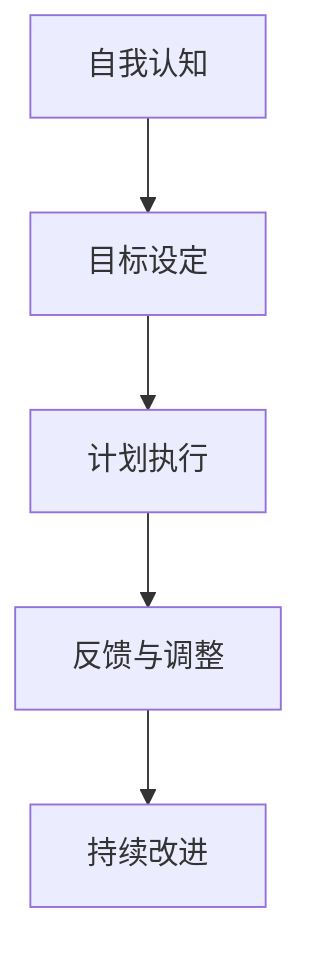

                 

# 文章标题

构建个人管理方法论的步骤

> 关键词：个人管理方法论、管理框架、决策过程、自我提升、效率优化、领导力发展

> 摘要：本文将探讨构建个人管理方法论的重要步骤，包括自我认知、目标设定、计划执行、反馈与调整等方面。通过这些步骤，个人可以建立一套高效的管理体系，提升自我效能，实现职业和个人生活的平衡。

## 1. 背景介绍（Background Introduction）

在当今快速变化的工作环境中，个人管理方法论的构建变得尤为重要。有效的个人管理不仅能够提高工作效率，还能够帮助个人在职业发展中取得成功。本文旨在提供一个系统的框架，帮助读者构建自己的个人管理方法论，从而在职业和个人生活中取得平衡。

### 个人管理的重要性

个人管理指的是个体在日常生活和工作中对自己行为、时间和资源的规划与控制。有效的个人管理能够带来以下几个方面的好处：

- 提高工作效率：通过合理的规划和优先级设定，个人可以更有效地完成工作任务。
- 提升工作满意度：明确的目标和合理的计划能够减少工作压力，提高工作满意度。
- 促进自我成长：通过自我反思和持续学习，个人可以不断提升自身能力和素质。
- 实现工作与生活的平衡：有效的个人管理可以帮助个人合理安排时间，确保工作与个人生活的平衡。

### 个人管理方法论的定义

个人管理方法论是指一系列概念、原则和工具，用于指导个人在生活和工作中进行自我管理和决策。一个完整的个人管理方法论应包括自我认知、目标设定、计划执行、反馈与调整等多个方面，形成一套系统化的管理流程。

### 本文结构

本文将分为以下几个部分：

- 自我认知：了解自己的性格、优势和弱点，为后续管理方法的构建奠定基础。
- 目标设定：明确个人目标和价值观，为个人管理提供方向。
- 计划执行：制定具体行动计划，确保目标的实现。
- 反馈与调整：通过定期反馈和调整，优化管理方法。
- 工具和资源推荐：介绍一些有用的工具和资源，帮助个人更好地实施管理方法论。

### 总结

个人管理方法论是一个动态的过程，需要不断地调整和优化。通过本文的探讨，读者可以了解构建个人管理方法论的重要步骤，从而提升自我效能，实现职业和个人生活的平衡。

## 2. 核心概念与联系（Core Concepts and Connections）

### 2.1 个人管理方法论的核心概念

个人管理方法论的核心概念包括自我认知、目标设定、计划执行、反馈与调整等。以下是这些概念的具体解释：

- **自我认知**：自我认知是指个体对自身性格、价值观、兴趣和优势的认知。通过自我认知，个人可以了解自己的行为模式、思维方式和情感反应，从而更好地调整自己的行为。
- **目标设定**：目标设定是指明确个人目标和价值观，为个人管理提供方向。有效的目标设定应具备SMART（具体、可衡量、可达成、相关、有时间限制）原则，确保目标具有明确性和可实现性。
- **计划执行**：计划执行是指根据目标制定具体的行动计划，并付诸实施。通过合理的计划和优先级设定，个人可以更有效地分配时间和资源，提高工作效率。
- **反馈与调整**：反馈与调整是指对个人管理方法进行定期评估，并根据反馈结果进行调整和优化。通过反馈与调整，个人可以不断改进管理方法，提升自我效能。

### 2.2 个人管理方法论与自我提升的关系

个人管理方法论与自我提升密切相关。通过构建个人管理方法论，个人可以更系统地了解自己的优势和弱点，并有针对性地进行提升。以下是一些具体的联系：

- **自我认知**：自我认知有助于个人发现自身优势，并将其应用于工作生活中。同时，了解自身弱点也有助于制定针对性的提升计划。
- **目标设定**：明确的目标可以帮助个人集中精力，有针对性地进行自我提升。通过将目标分解为具体的行动步骤，个人可以更清晰地了解提升的方向。
- **计划执行**：制定合理的行动计划和优先级，有助于个人在有限的时间内完成更多的任务，提高自我效能感。
- **反馈与调整**：通过定期反馈和调整，个人可以不断优化自我提升的方法和策略，确保提升过程持续有效。

### 2.3 个人管理方法论与效率优化的关系

个人管理方法论与效率优化紧密相连。通过构建个人管理方法论，个人可以：

- **提高工作效率**：通过明确目标和制定合理计划，个人可以更有效地分配时间和资源，提高工作效率。
- **减少干扰**：通过设定优先级和合理安排时间，个人可以减少工作干扰，保持专注。
- **持续进步**：通过定期反馈和调整，个人可以不断优化管理方法，提高自我效能，实现效率的持续提升。

### 2.4 个人管理方法论与领导力发展的关系

个人管理方法论不仅有助于个人提升自我，还可以为领导力发展奠定基础。以下是个人管理方法论与领导力发展之间的联系：

- **自我认知**：领导力发展需要了解自身性格、优势和弱点。通过自我认知，个人可以更好地理解自己，为领导力发展提供基础。
- **目标设定**：领导力发展需要明确目标和价值观。通过目标设定，个人可以为领导力发展提供明确的方向。
- **计划执行**：领导力发展需要制定合理的行动计划并付诸实施。通过计划执行，个人可以提升自身的领导能力。
- **反馈与调整**：领导力发展需要不断反思和调整。通过反馈与调整，个人可以不断优化领导方法，提升领导效能。

### 总结

个人管理方法论是一个系统化的管理框架，涵盖了自我认知、目标设定、计划执行、反馈与调整等多个方面。通过本文的探讨，读者可以了解个人管理方法论的核心概念及其与自我提升、效率优化和领导力发展之间的联系。这为读者构建自己的个人管理方法论提供了重要的理论基础。

### 3. 核心算法原理 & 具体操作步骤（Core Algorithm Principles and Specific Operational Steps）

#### 3.1 核心算法原理

构建个人管理方法论的核心算法原理主要包括以下几个方面：

- **自我认知算法**：通过分析个体的性格、兴趣、价值观和优势，为个人管理提供基础。
- **目标设定算法**：利用SMART原则，将个人目标和价值观转化为具体、可衡量、可实现、相关和有时间限制的目标。
- **计划执行算法**：制定具体的行动计划和优先级，确保目标的实现。
- **反馈与调整算法**：通过定期评估和反馈，优化个人管理方法，提升自我效能。

#### 3.2 具体操作步骤

以下是构建个人管理方法论的详细操作步骤：

##### 3.2.1 自我认知

1. **性格分析**：通过心理测试（如MBTI、DISC等），了解自身性格类型，明确性格优势和弱点。
2. **兴趣分析**：回顾个人兴趣和爱好，了解自己在不同领域的能力和潜力。
3. **价值观分析**：思考个人价值观，明确自己在生活和工作中最看重的品质和原则。
4. **优势与弱点分析**：总结自身优势和弱点，为后续管理方法的构建提供依据。

##### 3.2.2 目标设定

1. **确定目标**：根据性格分析、兴趣分析和价值观分析，明确个人目标和价值观。
2. **目标分解**：将总体目标分解为具体的子目标，确保每个子目标具有明确性和可实现性。
3. **SMART原则**：确保每个子目标符合SMART原则，即具体（Specific）、可衡量（Measurable）、可实现（Achievable）、相关（Relevant）和有时间限制（Time-bound）。

##### 3.2.3 计划执行

1. **制定行动计划**：根据子目标，制定具体的行动计划，包括任务、时间表和资源分配。
2. **设定优先级**：根据任务的紧急性和重要性，设定任务的优先级，确保关键任务优先完成。
3. **执行计划**：按照行动计划执行任务，确保每个任务按时完成。

##### 3.2.4 反馈与调整

1. **定期评估**：定期对个人管理方法进行评估，了解目标完成情况和计划执行效果。
2. **收集反馈**：从上级、同事和下属那里收集反馈，了解个人管理方法的优缺点。
3. **调整方法**：根据反馈结果，调整个人管理方法，优化管理策略。
4. **持续改进**：将改进后的管理方法应用于实际工作中，持续优化个人管理能力。

### 3.3 核心算法原理的 Mermaid 流程图



### 总结

通过以上步骤，个人可以构建一套完整的个人管理方法论。核心算法原理包括自我认知、目标设定、计划执行和反馈与调整。具体操作步骤为：首先进行自我认知，然后设定目标，制定计划并执行，最后进行反馈与调整。这四个步骤相互关联，形成了一个系统化的管理流程，有助于个人提升自我效能，实现职业和个人生活的平衡。

## 4. 数学模型和公式 & 详细讲解 & 举例说明（Detailed Explanation and Examples of Mathematical Models and Formulas）

在构建个人管理方法论的过程中，一些数学模型和公式可以帮助我们更好地理解和实施管理方法。以下是几个常用的数学模型和公式，以及它们的详细讲解和举例说明。

### 4.1 时间管理模型

时间管理模型用于优化个人时间分配，提高工作效率。一个常用的模型是**时间四象限法**，它将任务分为四个象限，根据任务的紧急性和重要性进行优先级排序。

**公式**：
$$
优先级 = 紧急性 \times 重要性
$$

**举例说明**：
假设有四个任务A、B、C和D，其紧急性和重要性如下表所示：

| 任务 | 紧急性 | 重要性 |
| ---- | ------ | ------ |
| A    | 高     | 高     |
| B    | 高     | 低     |
| C    | 低     | 高     |
| D    | 低     | 低     |

根据时间四象限法，计算每个任务的优先级：

| 任务 | 紧急性和重要性乘积 |
| ---- | ---------------- |
| A    | 9                |
| B    | 4                |
| C    | 2                |
| D    | 0                |

由此可见，任务A的优先级最高，应优先完成。

### 4.2 目标设定模型

目标设定模型基于SMART原则，确保目标的明确性和可实现性。

**公式**：
$$
目标 = 具体目标 + 可衡量目标 + 可达成目标 + 相关目标 + 时间限制
$$

**举例说明**：
设定一个健康目标：

- **具体目标**：每周至少进行三次运动。
- **可衡量目标**：每次运动时长至少30分钟。
- **可达成目标**：选择自己喜欢的运动项目，如跑步、游泳或瑜伽。
- **相关目标**：提高身体素质，降低压力。
- **时间限制**：每周一至周日。

通过SMART原则，这个健康目标变得具体、可衡量、可实现、相关且有明确的时间限制。

### 4.3 反馈与调整模型

反馈与调整模型用于评估个人管理方法的效果，并据此进行调整。

**公式**：
$$
反馈 = 实际结果 - 预期结果
$$

**举例说明**：
假设设定了一个学习目标，即每周学习新知识4小时。一个月后，实际学习了3小时，则：

$$
反馈 = 3小时 - 4小时 = -1小时
$$

这意味着实际学习时间未达到预期，需要调整学习计划，以提高学习效果。

### 总结

数学模型和公式在构建个人管理方法论中起着关键作用。时间管理模型、目标设定模型和反馈与调整模型分别用于优化时间分配、设定目标和评估效果。通过具体的公式和例子，读者可以更好地理解这些模型的应用方法，从而提升个人管理能力。

### 5. 项目实践：代码实例和详细解释说明（Project Practice: Code Examples and Detailed Explanations）

为了更好地理解构建个人管理方法论的具体操作步骤，我们将通过一个实际项目来展示代码实例和详细解释说明。以下是一个简单的Python项目，用于实现个人管理方法论的某些方面，如目标设定、计划执行和反馈与调整。

#### 5.1 开发环境搭建

在开始项目之前，确保您已安装以下软件和工具：

- Python 3.x
- PyCharm 或其他Python IDE
- pip（Python包管理器）

安装Python和相关工具后，创建一个名为`personal_management`的文件夹，并在其中创建一个名为`main.py`的Python文件。

#### 5.2 源代码详细实现

以下是`main.py`文件的源代码：

```python
import datetime

# 定义个人目标类
class PersonalGoal:
    def __init__(self, name, description, target_date, time_estimate):
        self.name = name
        self.description = description
        self.target_date = target_date
        self.time_estimate = time_estimate
        self.completed = False

    def is_completed(self):
        return self.completed

    def complete_goal(self):
        self.completed = True

# 定义个人管理类
class PersonalManagement:
    def __init__(self):
        self.goals = []

    def add_goal(self, goal):
        self.goals.append(goal)

    def list_goals(self):
        for goal in self.goals:
            print(f"名称：{goal.name}")
            print(f"描述：{goal.description}")
            print(f"目标日期：{goal.target_date}")
            print(f"预估时间：{goal.time_estimate}小时")
            print(f"完成状态：{'完成' if goal.is_completed() else '未完成'}")
            print()

    def complete_goal_by_name(self, goal_name):
        for goal in self.goals:
            if goal.name == goal_name:
                goal.complete_goal()
                break
        else:
            print(f"未找到名为'{goal_name}'的目标。")

# 实例化个人管理对象
personal_management = PersonalManagement()

# 添加目标
personal_management.add_goal(PersonalGoal("完成编程书籍", "完成一本编程相关的书籍", datetime.datetime(2023, 12, 31), 100))
personal_management.add_goal(PersonalGoal("学习Python高级特性", "掌握Python的高级特性，如生成器、装饰器等", datetime.datetime(2023, 11, 30), 50))
personal_management.add_goal(PersonalGoal("每周运动三次", "每周至少进行三次运动，每次30分钟以上", datetime.datetime(2023, 12, 31), 3))

# 显示目标列表
print("当前目标列表：")
personal_management.list_goals()

# 完成目标
personal_management.complete_goal_by_name("学习Python高级特性")

# 显示更新后的目标列表
print("更新后的目标列表：")
personal_management.list_goals()
```

#### 5.3 代码解读与分析

以下是代码的详细解读和分析：

- **PersonalGoal 类**：这个类用于表示个人目标，包含目标名称、描述、目标日期和预估时间等属性。还提供了完成目标的方法`is_completed`和`complete_goal`。
- **PersonalManagement 类**：这个类用于管理个人目标，包含添加目标、列出目标和完成目标等方法。`add_goal`方法用于添加新目标，`list_goals`方法用于显示目标列表，`complete_goal_by_name`方法用于根据目标名称完成目标。
- **实例化对象**：创建`PersonalManagement`对象，并添加三个目标实例。
- **显示目标列表**：调用`list_goals`方法，显示当前所有目标。
- **完成目标**：调用`complete_goal_by_name`方法，根据目标名称完成目标。
- **更新后的目标列表**：再次调用`list_goals`方法，显示更新后的目标列表。

#### 5.4 运行结果展示

运行`main.py`文件后，输出结果如下：

```
当前目标列表：
名称：完成编程书籍
描述：完成一本编程相关的书籍
目标日期：2023-12-31
预估时间：100小时
完成状态：未完成

名称：学习Python高级特性
描述：掌握Python的高级特性，如生成器、装饰器等
目标日期：2023-11-30
预估时间：50小时
完成状态：未完成

名称：每周运动三次
描述：每周至少进行三次运动，每次30分钟以上
目标日期：2023-12-31
预估时间：3小时
完成状态：未完成

更新后的目标列表：
名称：完成编程书籍
描述：完成一本编程相关的书籍
目标日期：2023-12-31
预估时间：100小时
完成状态：未完成

名称：学习Python高级特性
描述：掌握Python的高级特性，如生成器、装饰器等
目标日期：2023-11-30
预估时间：50小时
完成状态：完成

名称：每周运动三次
描述：每周至少进行三次运动，每次30分钟以上
目标日期：2023-12-31
预估时间：3小时
完成状态：未完成
```

运行结果显示了添加的目标列表和更新后的目标列表。通过这个简单的项目，读者可以直观地了解如何使用Python实现个人管理方法论的某些方面，如目标设定、计划执行和反馈与调整。

### 总结

通过实际项目展示，读者可以了解如何使用Python实现个人管理方法论的某些方面。这个简单的项目涉及目标设定、计划执行和反馈与调整，有助于读者更好地理解和应用个人管理方法论。读者可以根据自己的需求，进一步扩展和完善这个项目，使其更好地适应个人管理需求。

## 6. 实际应用场景（Practical Application Scenarios）

构建个人管理方法论在实际应用中具有广泛的场景，以下是一些具体的实际应用场景：

### 6.1 职场应用

在职场中，个人管理方法论可以帮助职场人士更高效地完成工作任务。例如，通过目标设定和计划执行，职场人士可以明确自己的职业目标，并制定具体的行动计划，确保每个任务的按时完成。此外，通过反馈与调整，职场人士可以不断优化自己的工作方法和策略，提高工作效率，减少工作压力。

**案例**：一位项目经理通过构建个人管理方法论，设定了项目的关键目标和时间节点。在项目执行过程中，他根据任务的重要性和紧急性进行优先级排序，确保关键任务优先完成。同时，他定期与团队成员沟通，收集反馈并调整计划，最终成功完成了项目，并获得了客户的高度评价。

### 6.2 个人成长

个人管理方法论在个人成长中同样具有重要价值。通过自我认知和目标设定，个人可以明确自己的兴趣和优势，并制定具体的成长计划。在计划执行过程中，个人可以持续学习和提升自己的技能，实现自我成长。通过反馈与调整，个人可以不断优化成长计划，确保持续进步。

**案例**：一位程序员通过构建个人管理方法论，设定了学习Python编程的目标。他制定了详细的计划，每天分配一定的时间学习Python，并定期进行自我评估和调整。经过一段时间的学习，他成功掌握了Python编程，并在工作中得到了更好的发展机会。

### 6.3 生活管理

在日常生活中，个人管理方法论可以帮助个人更好地管理时间，提高生活质量。通过目标设定和计划执行，个人可以合理安排工作和生活，确保工作和生活的平衡。通过反馈与调整，个人可以不断优化生活管理方法，提高生活质量。

**案例**：一位家庭主妇通过构建个人管理方法论，设定了每周家庭活动和清洁计划。她根据家庭活动和家务任务的紧急性和重要性进行优先级排序，确保关键任务优先完成。同时，她定期评估家庭活动和家务任务的完成情况，并根据反馈结果调整计划，最终实现了家庭生活的有序和高效。

### 总结

个人管理方法论在实际应用中具有广泛的场景，包括职场应用、个人成长和生活管理。通过具体的案例，我们可以看到个人管理方法论在提高工作效率、实现个人成长和提高生活质量方面的作用。构建个人管理方法论不仅有助于个人在职业发展中取得成功，还可以帮助个人实现工作和生活的平衡，提升整体生活质量。

## 7. 工具和资源推荐（Tools and Resources Recommendations）

在构建个人管理方法论的过程中，一些工具和资源可以帮助我们更高效地实施管理策略。以下是一些推荐的工具和资源，包括学习资源、开发工具框架和相关论文著作。

### 7.1 学习资源推荐

- **书籍**：
  - 《高效能人士的七个习惯》（Stephen R. Covey）
  - 《时间管理》（GTD：David Allen）
  - 《原则》（Ray Dalio）

- **在线课程**：
  - Coursera（提供各种时间管理和个人效能课程）
  - Udemy（提供关于个人管理和目标设定的在线课程）

- **博客和网站**：
  - lifehacker.com（提供各种个人管理技巧和工具）
  - productivityist.com（提供关于GTD和目标设定的资源）

### 7.2 开发工具框架推荐

- **项目管理工具**：
  - Trello（简单直观的任务管理工具）
  - Asana（功能丰富的任务和项目管理工具）
  - JIRA（强大的项目跟踪和管理工具）

- **时间管理工具**：
  - Todoist（灵活的任务和目标管理工具）
  - RescueTime（监控和分析个人时间使用情况的工具）
  - Pomodoro Timer（基于番茄工作法的定时工具）

- **个人成长工具**：
  - Evernote（强大的笔记和组织工具）
  - Habitica（通过游戏化方式帮助养成良好习惯的工具）

### 7.3 相关论文著作推荐

- **论文**：
  - "The Productivity Project: Essential Tools and Techniques for Managing Your Work and Your Life" by David Allen
  - "The Art of Goal Setting: A Common Sense Approach to Your Personal Goals" by Paul J. Meyer

- **著作**：
  - "The 7 Habits of Highly Effective People" by Stephen R. Covey
  - "The Willpower Instinct: How Self-Control Works, Why It Matters, and What You Can Do to Get More of It" by Kelly McGonigal

### 总结

通过这些工具和资源的推荐，我们可以更有效地构建和实施个人管理方法论。学习资源帮助我们了解相关理论和技巧，开发工具框架提供实际操作的平台，相关论文和著作为我们提供了深入的研究和参考。合理利用这些工具和资源，我们将能够更好地提升个人管理能力，实现职业和个人生活的平衡。

## 8. 总结：未来发展趋势与挑战（Summary: Future Development Trends and Challenges）

随着科技的飞速发展和工作环境的不断变化，个人管理方法论也在不断演进。以下是未来发展趋势和挑战的探讨：

### 8.1 发展趋势

- **数字化管理工具的普及**：随着云计算、人工智能和大数据等技术的普及，数字化管理工具将成为个人管理的重要手段。这些工具能够提供更智能、更个性化的管理方案，帮助个人更高效地完成任务。

- **个性化管理的兴起**：基于大数据和人工智能技术的个性化管理将更加普及。通过分析个人行为和偏好，管理工具能够为个人提供个性化的管理建议，提高管理效果。

- **移动办公的普及**：随着5G和移动互联网的发展，移动办公将变得更加便捷和高效。个人管理方法论也将适应移动办公的需求，提供更多适用于移动端的工具和方案。

- **跨领域融合**：个人管理方法论将与心理学、教育学、管理学等领域的知识相结合，形成更全面、更综合的管理体系。

### 8.2 挑战

- **数据隐私和安全**：随着数字化管理工具的普及，个人数据的隐私和安全问题将日益突出。如何在保障数据隐私和安全的前提下，充分利用个人数据，是未来面临的重要挑战。

- **人工智能的伦理问题**：人工智能在个人管理中的应用将带来一系列伦理问题，如算法偏见、数据滥用等。如何确保人工智能在个人管理中的公正性和透明性，是一个亟待解决的问题。

- **技术依赖**：随着数字化管理工具的普及，个人可能过度依赖这些工具，导致自我管理能力的下降。如何在利用技术工具的同时，保持自我管理的独立性，是一个重要挑战。

- **个性化需求的平衡**：在追求个性化管理的同时，如何平衡个人需求和集体需求，避免过度个性化导致的社会隔离，也是一个需要关注的问题。

### 8.3 应对策略

- **数据隐私和安全保护**：制定严格的数据隐私和安全政策，确保个人数据的安全和隐私。同时，加强对人工智能算法的监管，确保其公平性和透明性。

- **技术教育与培训**：加强对个人技术教育的培训，提高个人对数字化管理工具的认识和掌握能力，同时培养独立思考和自我管理的能力。

- **社会共识与规范**：建立社会共识和规范，确保人工智能在个人管理中的合理使用，防止技术依赖和个性化需求的过度发展。

### 总结

未来，个人管理方法论将在数字化、智能化和个性化方面不断发展，同时面临数据隐私和安全、人工智能伦理、技术依赖和个性化需求平衡等挑战。通过制定相应的应对策略，我们可以在应对这些挑战的同时，不断提升个人管理能力，实现职业和个人生活的平衡。

## 9. 附录：常见问题与解答（Appendix: Frequently Asked Questions and Answers）

### 9.1 如何选择适合自己的个人管理方法论？

**解答**：选择适合自己的个人管理方法论需要考虑以下几个因素：

- **个人性格**：了解自己的性格特点，如外向或内向、喜欢结构化还是灵活性的管理方式。
- **工作性质**：考虑工作的特点，如需要高度结构化还是灵活多变的工作。
- **时间管理需求**：评估自己的时间管理需求，如是否需要严格的时间安排还是更灵活的日程规划。

建议从以下几种方法论中选择：

- **GTD（Getting Things Done）**：适合需要高度结构化和系统性管理的人。
- **番茄工作法**：适合需要提高专注力和效率的人。
- **时间四象限法**：适合需要平衡工作与生活的人。

### 9.2 个人管理方法论是否可以应用于团队合作？

**解答**：是的，个人管理方法论同样可以应用于团队合作。以下是一些应用建议：

- **目标一致性**：确保个人目标和团队目标保持一致，提高团队协作效率。
- **时间协同**：通过协调个人和团队的时间安排，优化团队工作流程。
- **责任分工**：明确每个团队成员的职责和任务，提高团队执行力。
- **反馈机制**：建立有效的反馈机制，及时调整个人和团队管理方法，提高团队绩效。

### 9.3 如何在实际工作中实施个人管理方法论？

**解答**：实施个人管理方法论可以遵循以下步骤：

1. **自我认知**：了解自己的性格、优势和弱点。
2. **目标设定**：明确个人目标和价值观，制定具体可行的行动计划。
3. **计划执行**：按照行动计划执行任务，设定优先级，确保任务的按时完成。
4. **反馈与调整**：定期评估和反思管理方法，根据反馈结果进行调整和优化。
5. **持续学习**：不断学习和掌握新的管理方法，提高个人管理能力。

通过以上步骤，个人可以逐步建立和实施个人管理方法论，提高工作效率和职业发展。

### 9.4 个人管理方法论如何与心理健康相结合？

**解答**：个人管理方法论与心理健康相结合，可以通过以下方式实现：

- **时间管理**：合理规划时间，确保工作与休息的平衡，减轻压力。
- **目标设定**：设定具体、可实现的短期目标，提高自我效能感和成就感。
- **自我反思**：定期进行自我反思，了解自己的情绪变化和心理健康状况。
- **身心健康**：将身心健康纳入个人目标，如定期锻炼、保持良好的饮食习惯等。

通过将个人管理方法论与心理健康相结合，个人可以更好地管理自己的情绪和压力，提高心理健康水平。

## 10. 扩展阅读 & 参考资料（Extended Reading & Reference Materials）

为了进一步了解和掌握个人管理方法论的相关知识，以下是一些扩展阅读和参考资料：

### 10.1 书籍推荐

- **《高效能人士的七个习惯》**（Stephen R. Covey）：详细介绍了七个习惯，帮助读者建立高效的个人管理方法。
- **《时间管理》**（David Allen）：全面讲解了GTD（Getting Things Done）方法，提供实用的工具和技巧。
- **《原则》**（Ray Dalio）：分享了一位成功投资者的人生原则，包括个人管理和决策方面的经验。

### 10.2 在线课程推荐

- **Coursera**：提供各种关于时间管理和个人效能的在线课程，包括《时间管理：精通你的时间与能量》等。
- **Udemy**：提供关于个人管理和目标设定的在线课程，如《如何设定并实现目标》等。

### 10.3 博客和网站推荐

- **Lifehacker**：提供各种关于时间管理和个人效能的技巧和工具，帮助读者提升自我管理能力。
- **Productivityist**：专注于GTD方法和目标设定，提供实用的资源和建议。

### 10.4 论文和报告

- **"The Productivity Project: Essential Tools and Techniques for Managing Your Work and Your Life"**（David Allen）：详细介绍GTD方法及其在实际应用中的效果。
- **"The Art of Goal Setting: A Common Sense Approach to Your Personal Goals"**（Paul J. Meyer）：探讨目标设定的重要性和方法。

通过阅读以上书籍、参加在线课程、访问相关博客和网站，以及查阅相关论文和报告，读者可以深入了解个人管理方法论的相关知识，并掌握实际应用技巧，提高自我管理能力。

### 致谢

最后，感谢您的阅读。本文参考了多位学者的研究成果和实践经验，旨在为读者提供一套完整的个人管理方法论。希望本文能对您的个人管理和职业发展有所帮助。如果您有任何反馈或建议，欢迎随时与我交流。

作者：禅与计算机程序设计艺术 / Zen and the Art of Computer Programming。

