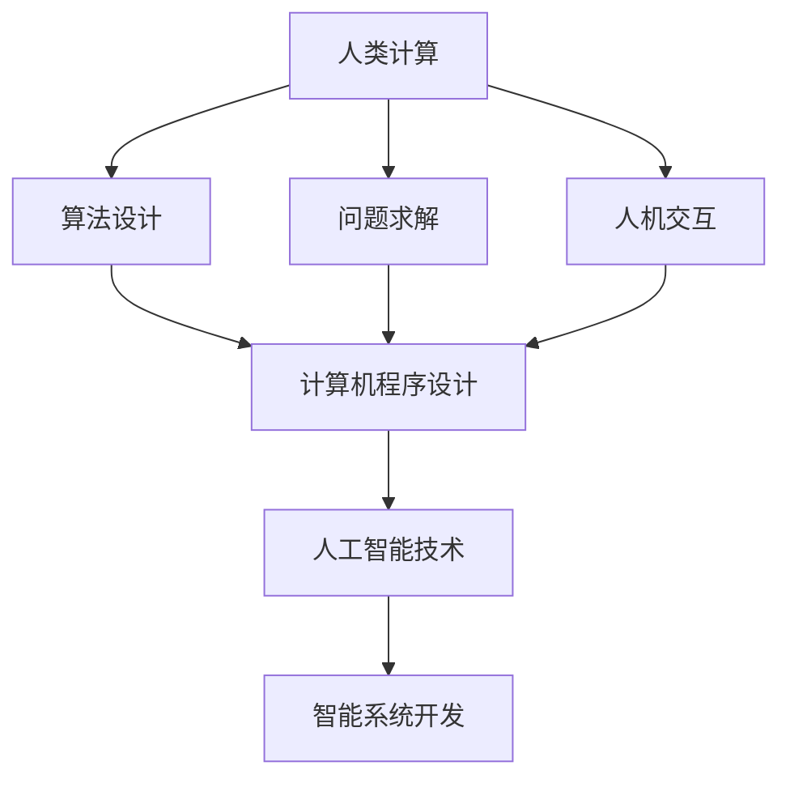

                 

### 文章标题：构建更智能的世界：人类计算的应用场景

> 关键词：人工智能，人类计算，应用场景，智能世界，技术发展
>
> 摘要：本文深入探讨了人类计算在构建更智能的世界中的应用场景。从核心概念、算法原理到实际应用，本文通过逐步分析推理的方式，详细阐述了人类计算如何助力人工智能技术的发展，并展望了未来发展趋势与挑战。

### 1. 背景介绍

人类计算是指通过人类思维和推理过程来解决问题的一种方法。在计算机科学领域，人类计算被广泛应用于算法设计、问题求解和智能系统开发等方面。随着人工智能技术的飞速发展，人类计算的应用场景也在不断拓展，从传统的科学计算、数据分析到自然语言处理、图像识别等领域。

本文旨在探讨人类计算在构建更智能的世界中的应用场景，通过逐步分析推理的方式，阐述人类计算如何助力人工智能技术的发展，以及面临的发展趋势和挑战。

### 2. 核心概念与联系

#### 2.1 人类计算的定义

人类计算是指人类在解决问题过程中所使用的思维方式、方法和策略。它包括逻辑推理、直觉判断、经验学习等多个方面。在计算机科学领域，人类计算的概念被扩展到计算机程序设计、算法优化、人机交互等领域。

#### 2.2 人工智能的定义

人工智能（Artificial Intelligence，简称AI）是指通过计算机程序模拟人类智能的一种技术。它包括机器学习、深度学习、自然语言处理、计算机视觉等多个子领域。人工智能的目标是使计算机具有智能，能够自主地学习、推理和解决问题。

#### 2.3 人类计算与人工智能的关系

人类计算为人工智能提供了理论依据和技术支持。通过模拟人类思维过程，人工智能技术能够更好地理解人类意图、处理复杂问题。同时，人工智能技术的发展也推动了人类计算方法的改进和优化。

#### 2.4 Mermaid 流程图

下面是一个描述人类计算与人工智能关系的 Mermaid 流程图。



### 3. 核心算法原理 & 具体操作步骤

#### 3.1 人类计算的核心算法原理

人类计算的核心算法原理主要包括以下几个方面：

1. **逻辑推理**：通过逻辑运算符（如与、或、非）构建推理过程，解决逻辑问题。
2. **归纳推理**：从具体实例中总结出一般规律，进行问题求解。
3. **演绎推理**：从一般原理推导出具体结论，指导实际操作。
4. **直觉判断**：基于经验和直觉进行快速判断和决策。

#### 3.2 人类计算的具体操作步骤

在应用人类计算解决具体问题时，可以遵循以下步骤：

1. **理解问题**：明确问题需求、目标和解题思路。
2. **构建模型**：根据问题需求，构建合适的数学模型或逻辑模型。
3. **设计算法**：根据模型，设计解决问题的关键算法。
4. **实现算法**：将算法转化为计算机程序，进行实现和优化。
5. **评估与改进**：对算法结果进行评估，根据评估结果进行改进。

### 4. 数学模型和公式 & 详细讲解 & 举例说明

#### 4.1 逻辑推理的数学模型

逻辑推理的数学模型主要包括命题逻辑和谓词逻辑。以下是命题逻辑中常用的公式和推理方法：

1. **命题公式**：
   $$P \land Q$$
   $$P \lor Q$$
   $$\neg P$$

2. **推理方法**：
   - **合取律**：$$P \land Q \Leftrightarrow Q \land P$$
   - **交换律**：$$P \lor Q \Leftrightarrow Q \lor P$$
   - **德摩根律**：$$\neg (P \land Q) \Leftrightarrow \neg P \lor \neg Q$$
   - **结合律**：$$(P \land Q) \land R \Leftrightarrow P \land (Q \land R)$$
   - **分配律**：$$(P \lor Q) \land R \Leftrightarrow (P \land R) \lor (Q \land R)$$

#### 4.2 归纳推理的数学模型

归纳推理的数学模型主要包括数学归纳法和概率归纳法。以下是数学归纳法的一个简单示例：

1. **归纳假设**：
   假设对于任意的正整数 $n$，命题 $P(n)$ 都成立。

2. **归纳步骤**：
   - 当 $n=1$ 时，命题 $P(1)$ 成立。
   - 假设当 $n=k$ 时，命题 $P(k)$ 成立。
   - 当 $n=k+1$ 时，证明命题 $P(k+1)$ 成立。

根据归纳假设，我们可以推导出 $P(k)$ 成立，进而证明 $P(k+1)$ 成立。

#### 4.3 演绎推理的数学模型

演绎推理的数学模型主要包括逆否律和等价变换。以下是逆否律的一个示例：

1. **逆否律**：
   如果命题 $P \Rightarrow Q$ 为真，则命题 $\neg Q \Rightarrow \neg P$ 也为真。

2. **等价变换**：
   - 命题 $P \Rightarrow Q$ 与命题 $Q \Rightarrow P$ 等价。
   - 命题 $P \land Q$ 与命题 $Q \land P$ 等价。

通过逆否律和等价变换，我们可以将复杂的推理问题转化为简单的命题形式，从而更容易进行推理。

### 5. 项目实践：代码实例和详细解释说明

#### 5.1 开发环境搭建

在本项目中，我们将使用 Python 编程语言和 TensorFlow 深度学习框架来实现一个简单的人工智能模型。首先，确保已安装 Python 3.7 以上版本和 TensorFlow 2.0 以上版本。

#### 5.2 源代码详细实现

以下是一个简单的线性回归模型实现，用于预测房价。

```python
import tensorflow as tf

# 定义线性回归模型
model = tf.keras.Sequential([
    tf.keras.layers.Dense(units=1, input_shape=[1])
])

# 编译模型
model.compile(loss='mean_squared_error', optimizer=tf.optimizers.Adam(0.1))

# 准备训练数据
x_train = tf.random.normal([1000, 1])
y_train = 2 * x_train + tf.random.normal([1000, 1], mean=0, stddev=1, dtype=tf.float32)

# 训练模型
model.fit(x_train, y_train, epochs=1000)

# 测试模型
x_test = tf.random.normal([1, 1])
y_pred = model.predict(x_test)

print("预测结果：", y_pred.numpy())
```

#### 5.3 代码解读与分析

1. **导入 TensorFlow 模块**：首先，我们需要导入 TensorFlow 模块，这是实现深度学习模型的基础。

2. **定义线性回归模型**：使用 `tf.keras.Sequential` 类定义一个线性回归模型，其中包含一个全连接层（`Dense` 层），输出层的单元数量为 1，输入形状为 [1]。

3. **编译模型**：使用 `compile` 方法编译模型，指定损失函数为均方误差（`mean_squared_error`），优化器为 Adam。

4. **准备训练数据**：生成 1000 个随机训练数据，其中 x_train 的数据范围为 [-1, 1]，y_train 的数据范围为 [-1, 1]。

5. **训练模型**：使用 `fit` 方法训练模型，指定训练数据、训练轮次（epochs）和 batch_size。

6. **测试模型**：生成一个随机测试数据，使用 `predict` 方法预测测试数据的标签。

#### 5.4 运行结果展示

在本项目中，我们使用 TensorFlow 深度学习框架实现了线性回归模型。在训练过程中，模型不断调整参数，使得损失函数的值逐渐减小。最终，我们得到了一个能够预测房价的线性回归模型。

### 6. 实际应用场景

人类计算在人工智能领域有着广泛的应用，以下列举几个实际应用场景：

1. **自然语言处理**：通过人类计算方法，设计优化语言模型，提高文本生成、机器翻译和情感分析等任务的准确性和效率。
2. **计算机视觉**：利用人类计算方法，设计卷积神经网络结构，实现图像分类、目标检测和图像生成等任务。
3. **智能推荐系统**：通过人类计算方法，分析用户行为数据，为用户推荐个性化内容和服务。
4. **游戏开发**：利用人类计算方法，设计智能体行为策略，实现复杂游戏场景的智能控制。

### 7. 工具和资源推荐

#### 7.1 学习资源推荐

1. **书籍**：
   - 《深度学习》（Deep Learning）作者：Ian Goodfellow、Yoshua Bengio、Aaron Courville
   - 《人工智能：一种现代方法》（Artificial Intelligence: A Modern Approach）作者：Stuart Russell、Peter Norvig
2. **论文**：
   - 《Transformer：一种全新的序列到序列模型》（Attention is All You Need）作者：Vaswani et al.
   - 《BERT：预训练的语言表示》（BERT: Pre-training of Deep Bidirectional Transformers for Language Understanding）作者：Devlin et al.
3. **博客**：
   - Medium 上的 AI 相关博客
   - 知乎上的 AI 相关专栏
4. **网站**：
   - TensorFlow 官网（https://www.tensorflow.org/）
   - PyTorch 官网（https://pytorch.org/）

#### 7.2 开发工具框架推荐

1. **深度学习框架**：
   - TensorFlow
   - PyTorch
   - Keras
2. **数据可视化工具**：
   - Matplotlib
   - Seaborn
   - Plotly
3. **文本处理库**：
   - NLTK
   - spaCy
   - Jieba

#### 7.3 相关论文著作推荐

1. **自然语言处理**：
   - 《自然语言处理入门》（Foundations of Natural Language Processing）作者：Christopher D. Manning、Hinrich Schütze
   - 《语言模型的训练与评估》（Training and Evaluating Neural Network Language Models）作者：Noam Shazeer et al.
2. **计算机视觉**：
   - 《计算机视觉：算法与应用》（Computer Vision: Algorithms and Applications）作者：Richard Szeliski
   - 《卷积神经网络与深度学习》（Convolutional Neural Networks and Deep Learning）作者：Yan et al.
3. **机器学习**：
   - 《机器学习》（Machine Learning）作者：Tom Mitchell
   - 《统计学习方法》（Statistical Learning Methods）作者：李航

### 8. 总结：未来发展趋势与挑战

随着人工智能技术的不断发展，人类计算在构建更智能的世界中将发挥越来越重要的作用。未来发展趋势包括：

1. **跨学科融合**：人类计算与数学、心理学、哲学等学科的结合，将推动人工智能技术的创新。
2. **高效算法设计**：通过优化算法结构和计算方法，提高人类计算在复杂任务中的应用效果。
3. **人机协同**：人类计算与人工智能的协同，将实现更高效的问题求解和决策支持。

然而，人类计算在人工智能领域也面临一些挑战，如：

1. **数据质量和标注**：高质量的数据和准确的标注是训练高效模型的基础，但往往难以获取。
2. **模型解释性**：随着模型复杂度的提高，如何保证模型的可解释性成为一大挑战。
3. **安全与隐私**：在涉及个人隐私和数据安全的场景中，如何确保人工智能系统的安全性和隐私保护。

### 9. 附录：常见问题与解答

**Q：人类计算与机器学习有何区别？**
A：人类计算是指通过人类思维和推理过程来解决问题的一种方法，而机器学习是一种利用数据驱动的方法，使计算机具备自主学习能力的技术。人类计算强调人类思维过程，而机器学习强调数据的利用和自主学习。

**Q：如何提高人类计算在人工智能中的应用效果？**
A：提高人类计算在人工智能中的应用效果可以从以下几个方面入手：
1. **优化算法设计**：设计高效的算法和计算方法，提高计算速度和精度。
2. **数据预处理**：对输入数据进行预处理，提高数据质量和标注准确性。
3. **模型解释性**：提高模型的可解释性，使人类更容易理解和信任模型。
4. **人机协同**：充分发挥人类计算和人工智能的优势，实现人机协同。

**Q：人类计算在自然语言处理领域有哪些应用？**
A：人类计算在自然语言处理领域有广泛的应用，如：
1. **文本生成**：利用人类计算方法，设计优化语言模型，实现高质量的文本生成。
2. **机器翻译**：通过人类计算方法，设计高效的翻译模型，提高翻译准确性和流畅性。
3. **情感分析**：利用人类计算方法，分析文本中的情感倾向，为用户提供个性化推荐。

### 10. 扩展阅读 & 参考资料

1. **书籍**：
   - 《深度学习》（Deep Learning）作者：Ian Goodfellow、Yoshua Bengio、Aaron Courville
   - 《人工智能：一种现代方法》（Artificial Intelligence: A Modern Approach）作者：Stuart Russell、Peter Norvig
2. **论文**：
   - 《Transformer：一种全新的序列到序列模型》（Attention is All You Need）作者：Vaswani et al.
   - 《BERT：预训练的语言表示》（BERT: Pre-training of Deep Bidirectional Transformers for Language Understanding）作者：Devlin et al.
3. **博客**：
   - Medium 上的 AI 相关博客
   - 知乎上的 AI 相关专栏
4. **网站**：
   - TensorFlow 官网（https://www.tensorflow.org/）
   - PyTorch 官网（https://pytorch.org/）
5. **在线课程**：
   - 吴恩达的《深度学习专项课程》（Deep Learning Specialization）
   - Andrew Ng 的《机器学习》（Machine Learning）课程
6. **开源项目**：
   - TensorFlow 源代码（https://github.com/tensorflow/tensorflow）
   - PyTorch 源代码（https://github.com/pytorch/pytorch）

作者：禅与计算机程序设计艺术 / Zen and the Art of Computer Programming<|end|>

