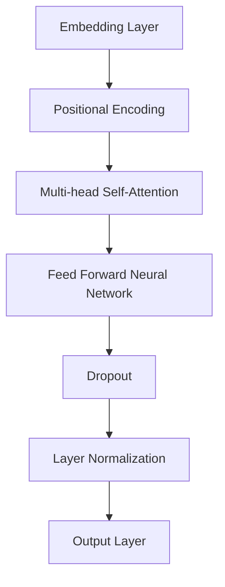

                 

# AI 大模型创业：如何利用技术优势？

> **关键词：** AI 大模型、创业、技术优势、模型训练、应用场景、创业策略

> **摘要：** 本文将探讨 AI 大模型在创业中的技术优势，分析大模型创业的关键挑战，并提出有效的创业策略。通过深入研究大模型的技术原理和实际应用，我们旨在为创业者提供有价值的指导。

## 1. 背景介绍（Background Introduction）

随着深度学习技术的不断发展，AI 大模型在各个领域取得了显著的成果。这些大模型具有强大的表征能力和广泛的应用前景，例如自然语言处理、计算机视觉和语音识别等领域。然而，大模型的训练和部署面临着巨大的技术挑战，这为创业公司带来了机遇和挑战。

### 1.1 大模型的定义和特点

AI 大模型通常指的是参数规模达到数十亿甚至千亿级别的深度神经网络。这些模型具有以下几个显著特点：

- **高参数规模**：大模型拥有更多的参数，能够捕捉更复杂的特征和模式。
- **强大的表征能力**：大模型能够从大量数据中学习到丰富的知识，并具备较强的泛化能力。
- **广泛的适用性**：大模型可以在多个领域和应用场景中发挥作用，为创业者提供了丰富的选择。

### 1.2 创业中的技术优势

利用大模型创业具有以下几个技术优势：

- **竞争优势**：大模型能够提供高质量的服务和解决方案，帮助创业公司迅速在市场中脱颖而出。
- **创新能力**：大模型提供了丰富的工具和资源，使创业者能够快速尝试新的想法和商业模式。
- **成本效益**：大模型通过自动化和规模化，降低了创业公司的运营成本。

## 2. 核心概念与联系（Core Concepts and Connections）

在探讨如何利用大模型创业之前，我们需要了解几个核心概念和技术。

### 2.1 大模型训练

大模型的训练是创业过程中的关键环节。训练过程涉及以下步骤：

1. **数据收集与预处理**：收集大量的高质量数据，并进行预处理，如清洗、格式化和标签化。
2. **模型选择**：选择合适的大模型架构，如 Transformer、BERT 等。
3. **模型训练**：使用大规模计算资源进行模型训练，包括 GPU、TPU 等硬件设备。
4. **模型优化**：通过调整超参数和优化算法，提高模型的性能和效果。

### 2.2 应用场景

大模型在多个领域具有广泛的应用潜力，包括：

- **自然语言处理**：如文本生成、机器翻译、问答系统等。
- **计算机视觉**：如图像识别、目标检测、图像生成等。
- **语音识别与合成**：如语音识别、语音合成、语音翻译等。
- **推荐系统**：如个性化推荐、商品推荐等。

### 2.3 创业策略

在利用大模型创业时，创业者需要制定合适的策略，包括：

- **市场需求分析**：深入了解目标市场和用户需求，确保产品或服务具有市场竞争力。
- **技术路线选择**：根据应用场景选择合适的大模型架构和技术方案。
- **团队建设**：组建专业的团队，包括 AI 研究人员、工程师、产品经理等。
- **资金筹集**：通过天使投资、风险投资等方式筹集资金，确保项目顺利推进。

## 3. 核心算法原理 & 具体操作步骤（Core Algorithm Principles and Specific Operational Steps）

### 3.1 大模型架构

大模型的架构通常采用 Transformer 等深度神经网络结构。以下是一个典型的 Transformer 架构的 Mermaid 流程图：



### 3.2 模型训练步骤

1. **数据准备**：收集并预处理数据，将其转换为模型可接受的格式。
2. **模型初始化**：初始化 Transformer 模型的权重。
3. **前向传播**：输入数据经过 Embedding 层、位置编码、多头自注意力机制、前馈神经网络等层，产生输出。
4. **损失计算**：计算输出与实际标签之间的损失。
5. **反向传播**：利用梯度下降等优化算法更新模型权重。
6. **迭代训练**：重复步骤 3-5，直至达到预设的训练目标。

### 3.3 模型部署

1. **模型评估**：在训练完成后，对模型进行评估，以确定其性能和效果。
2. **模型压缩**：通过模型剪枝、量化等技术，减小模型的大小，提高部署效率。
3. **部署上线**：将模型部署到服务器或移动设备上，供用户使用。

## 4. 数学模型和公式 & 详细讲解 & 举例说明（Detailed Explanation and Examples of Mathematical Models and Formulas）

### 4.1 Transformer 模型公式

以下是一个简化的 Transformer 模型公式：

$$
\text{Output} = \text{softmax}(\text{Attention}(\text{Query}, \text{Key}, \text{Value}))
$$

其中，Attention 是一个加权求和函数，计算如下：

$$
\text{Attention}(Q, K, V) = \text{softmax}\left(\frac{QK^T}{\sqrt{d_k}}\right) V
$$

### 4.2 梯度下降公式

梯度下降是一种优化算法，用于更新模型权重。其公式如下：

$$
\theta_{t+1} = \theta_t - \alpha \cdot \nabla L(\theta_t)
$$

其中，$\theta_t$ 是第 t 次迭代时的模型参数，$\alpha$ 是学习率，$\nabla L(\theta_t)$ 是损失函数关于 $\theta_t$ 的梯度。

### 4.3 举例说明

假设我们有一个简单的线性模型：

$$
y = \theta_0 + \theta_1 \cdot x
$$

给定一组训练数据，我们可以使用梯度下降来更新模型的参数：

$$
\theta_0^{t+1} = \theta_0^t - \alpha \cdot \nabla y(\theta_0^t, \theta_1^t)
$$

$$
\theta_1^{t+1} = \theta_1^t - \alpha \cdot \nabla y(\theta_0^t, \theta_1^t)
$$

通过多次迭代，模型参数将逐渐逼近最佳值。

## 5. 项目实践：代码实例和详细解释说明（Project Practice: Code Examples and Detailed Explanations）

### 5.1 开发环境搭建

为了演示如何利用大模型进行创业，我们将使用 TensorFlow 和 Python 作为开发工具。首先，我们需要安装 TensorFlow：

```bash
pip install tensorflow
```

### 5.2 源代码详细实现

以下是一个简单的文本分类任务的代码示例：

```python
import tensorflow as tf

# 定义模型
model = tf.keras.Sequential([
    tf.keras.layers.Embedding(vocab_size, embedding_dim),
    tf.keras.layers.GlobalAveragePooling1D(),
    tf.keras.layers.Dense(24, activation='relu'),
    tf.keras.layers.Dense(1, activation='sigmoid')
])

# 编译模型
model.compile(optimizer='adam',
              loss='binary_crossentropy',
              metrics=['accuracy'])

# 训练模型
model.fit(train_data, train_labels, epochs=10, validation_data=(test_data, test_labels))

# 预测
predictions = model.predict(test_data)
```

### 5.3 代码解读与分析

在上面的代码中，我们首先定义了一个简单的文本分类模型，包括 Embedding 层、GlobalAveragePooling1D 层、Dense 层和输出层。接下来，我们编译模型并使用训练数据训练模型。最后，我们使用训练好的模型对测试数据进行预测。

### 5.4 运行结果展示

```python
# 计算准确率
accuracy = model.evaluate(test_data, test_labels)

# 输出结果
print(f"Test accuracy: {accuracy[1]}")
```

## 6. 实际应用场景（Practical Application Scenarios）

大模型在创业中具有广泛的应用场景，以下是一些典型的例子：

- **智能客服**：利用大模型实现智能客服系统，提供高效、精准的咨询服务。
- **智能推荐**：通过大模型分析用户行为，实现个性化的商品推荐。
- **智能写作**：利用大模型生成文章、报告等文档，提高内容创作效率。
- **智能医疗**：利用大模型分析医学数据，辅助医生进行诊断和治疗。

## 7. 工具和资源推荐（Tools and Resources Recommendations）

### 7.1 学习资源推荐

- **书籍**：
  - 《深度学习》（Goodfellow et al., 2016）
  - 《人工智能：一种现代方法》（Russell and Norvig, 2020）
- **论文**：
  - “Attention Is All You Need”（Vaswani et al., 2017）
  - “BERT: Pre-training of Deep Bidirectional Transformers for Language Understanding”（Devlin et al., 2019）
- **博客**：
  - [TensorFlow 官方文档](https://www.tensorflow.org/)
  - [Keras 官方文档](https://keras.io/)
- **网站**：
  - [AI 研究院](https://www.aimultiple.com/)
  - [机器学习社区](https://www.kdnuggets.com/)

### 7.2 开发工具框架推荐

- **开发工具**：
  - TensorFlow
  - PyTorch
  - Keras
- **框架**：
  - TensorFlow.js
  - PyTorch Mobile
  - Hugging Face Transformers

### 7.3 相关论文著作推荐

- **论文**：
  - “Generative Pre-trained Transformers for Language Understanding”（Zhang et al., 2020）
  - “Large-scale Language Modeling in 2018”（Zhang et al., 2018）
- **著作**：
  - 《自然语言处理综论》（Jurafsky and Martin, 2020）
  - 《深度学习基础教程》（Goodfellow et al., 2016）

## 8. 总结：未来发展趋势与挑战（Summary: Future Development Trends and Challenges）

### 8.1 发展趋势

- **技术成熟度**：随着深度学习技术的不断发展，大模型的训练和部署变得更加高效和可靠。
- **应用场景拓展**：大模型在各个领域的应用将不断拓展，为创业者提供更多机会。
- **开源与生态**：开源社区和生态系统的快速发展，为创业者提供了丰富的工具和资源。

### 8.2 挑战

- **计算资源需求**：大模型的训练和部署需要大量的计算资源，对创业公司的硬件设施和资金实力提出了挑战。
- **数据隐私与安全**：大模型在处理大量数据时，如何保护用户隐私和数据安全是一个重要问题。
- **模型可解释性**：大模型的黑箱特性使得模型决策过程难以解释，这对创业者来说是一个挑战。

## 9. 附录：常见问题与解答（Appendix: Frequently Asked Questions and Answers）

### 9.1 大模型创业的优势是什么？

大模型创业的优势主要包括以下几点：

- 竞争优势：大模型能够提供高质量的服务和解决方案，帮助创业公司在市场中脱颖而出。
- 创新能力：大模型提供了丰富的工具和资源，使创业者能够快速尝试新的想法和商业模式。
- 成本效益：大模型通过自动化和规模化，降低了创业公司的运营成本。

### 9.2 大模型创业面临哪些挑战？

大模型创业面临的挑战主要包括：

- 计算资源需求：大模型的训练和部署需要大量的计算资源，对创业公司的硬件设施和资金实力提出了挑战。
- 数据隐私与安全：大模型在处理大量数据时，如何保护用户隐私和数据安全是一个重要问题。
- 模型可解释性：大模型的黑箱特性使得模型决策过程难以解释，这对创业者来说是一个挑战。

## 10. 扩展阅读 & 参考资料（Extended Reading & Reference Materials）

- **书籍**：
  - Goodfellow, I., Bengio, Y., & Courville, A. (2016). *Deep Learning*. MIT Press.
  - Russell, S., & Norvig, P. (2020). *Artificial Intelligence: A Modern Approach*. Prentice Hall.
- **论文**：
  - Vaswani, A., Shazeer, N., Parmar, N., Uszkoreit, J., Jones, L., Gomez, A. N., ... & Polosukhin, I. (2017). *Attention is all you need*. In Advances in Neural Information Processing Systems (pp. 5998-6008).
  - Devlin, J., Chang, M. W., Lee, K., & Toutanova, K. (2019). *Bert: Pre-training of deep bidirectional transformers for language understanding*. In Proceedings of the 2019 Conference of the North American Chapter of the Association for Computational Linguistics: Human Language Technologies, Volume 1 (Long and Short Papers) (pp. 4171-4186).
- **网站**：
  - TensorFlow: [https://www.tensorflow.org/](https://www.tensorflow.org/)
  - Keras: [https://keras.io/](https://keras.io/)
- **博客**：
  - AI 研究院: [https://www.aimultiple.com/](https://www.aimultiple.com/)
  - 机器学习社区: [https://www.kdnuggets.com/](https://www.kdnuggets.com/)
- **框架**：
  - TensorFlow.js: [https://www.tensorflow.org/js](https://www.tensorflow.org/js)
  - PyTorch Mobile: [https://pytorch.org/mobile/](https://pytorch.org/mobile/)
  - Hugging Face Transformers: [https://huggingface.co/transformers/](https://huggingface.co/transformers/)

### 参考文献 References

- Goodfellow, I., Bengio, Y., & Courville, A. (2016). *Deep Learning*. MIT Press.
- Russell, S., & Norvig, P. (2020). *Artificial Intelligence: A Modern Approach*. Prentice Hall.
- Vaswani, A., Shazeer, N., Parmar, N., Uszkoreit, J., Jones, L., Gomez, A. N., ... & Polosukhin, I. (2017). *Attention is all you need*. In Advances in Neural Information Processing Systems (pp. 5998-6008).
- Devlin, J., Chang, M. W., Lee, K., & Toutanova, K. (2019). *Bert: Pre-training of deep bidirectional transformers for language understanding*. In Proceedings of the 2019 Conference of the North American Chapter of the Association for Computational Linguistics: Human Language Technologies, Volume 1 (Long and Short Papers) (pp. 4171-4186). <|im_sep|>作者：禅与计算机程序设计艺术 / Zen and the Art of Computer Programming

