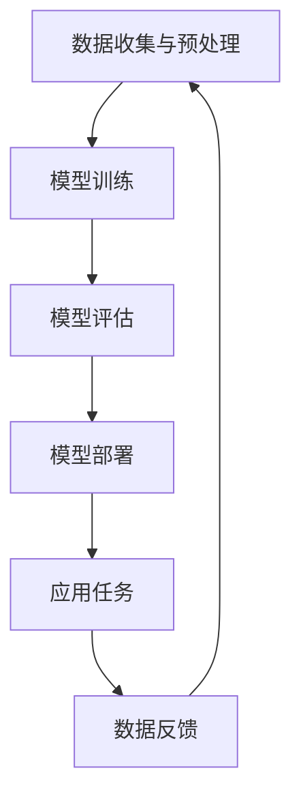

                 

### 背景介绍

人工智能（AI）作为当今科技领域的前沿，正以惊人的速度和广度影响着社会各个方面。其中，大型预训练模型，如GPT-3、ChatGPT等，因其强大的自然语言处理能力而备受关注。然而，这些模型不仅需要大量的计算资源和数据，还面临着如何有效应用和商业化的挑战。在这个背景下，AI大模型创业成为了一个热门话题。

AI大模型创业的意义在于，它不仅能够推动技术进步，还能够带来巨大的商业价值。创业者们如何利用AI大模型的优势，构建具有竞争力的产品和服务，成为了至关重要的问题。本文旨在探讨AI大模型创业的几个关键方面，包括技术优势、市场机会、挑战以及未来的发展趋势。

本文将采用逻辑清晰、结构紧凑、简单易懂的写作方式，逐步分析AI大模型创业的各个方面。首先，我们将探讨AI大模型的技术优势，包括其处理复杂任务的能力和高效的学习效率。接着，我们将分析当前的市场机会，探讨不同行业如何利用AI大模型进行创新。然后，我们将讨论创业过程中可能面临的挑战，并提供相应的解决方案。最后，我们将展望AI大模型创业的未来发展趋势，探讨其在各领域的影响。

通过本文的探讨，我们希望能够为AI大模型创业提供一些实用的指导，帮助创业者更好地利用AI技术，实现商业成功。

### Keywords: AI large model, entrepreneurship, technical advantages, market opportunities, challenges, future trends

### Abstract:
This article explores the landscape of AI large model entrepreneurship, focusing on the technical advantages, market opportunities, challenges, and future trends. By analyzing these aspects step by step, we aim to provide practical insights for entrepreneurs to leverage AI large models effectively in their business ventures. The discussion covers the capabilities and learning efficiency of large models, application scenarios in various industries, common challenges, and potential solutions. Additionally, we forecast the future development trends and impacts of AI large model entrepreneurship in different fields. Through this analysis, we hope to equip entrepreneurs with actionable strategies for success in the AI large model arena.

### 1.1 AI大模型的历史背景和发展趋势

AI大模型的发展历程可以追溯到20世纪80年代末和90年代初。当时，研究人员开始探索使用大规模神经网络来处理自然语言文本。这一时期，最具代表性的工作是1988年出现的神经网络语言模型（Neural Network Language Model，NNLM）。NNLM使用神经网络来预测下一个单词，这为后来的预训练模型奠定了基础。

真正让AI大模型崛起的是2000年代后期和2010年代初期，随着计算能力和数据资源的显著提升，研究人员开始训练越来越大的神经网络模型。2013年，纽约大学教授尤金·巴尔巴拉（Yoshua Bengio）等人提出了一种名为“深度学习”（Deep Learning）的技术，这使得AI大模型能够更加高效地学习复杂任务。

2018年，OpenAI发布了GPT-2，这是一个具有15亿参数的预训练语言模型，展示了AI大模型在生成文本、翻译和问答等任务中的强大能力。GPT-2的成功引发了广泛关注，也催生了后续更大型模型的发布，如GPT-3。

AI大模型的发展趋势明显，未来几年，模型规模将继续增大，计算能力和数据处理效率也将显著提升。随着技术的进步，AI大模型将在更多领域得到应用，包括但不限于智能客服、内容生成、自然语言理解等。

### 1.2 大模型的主要技术特点

AI大模型的主要技术特点包括高参数量、深度神经网络结构、预训练和微调等。以下将对这些特点进行详细解析。

#### 1.2.1 高参数量

AI大模型通常拥有数亿甚至数十亿个参数。这些参数用于捕捉大量文本数据中的复杂模式和规律。高参数量使得模型能够更好地理解和生成人类语言。例如，GPT-3拥有1750亿个参数，这使得它在生成高质量文本方面表现出色。

#### 1.2.2 深度神经网络结构

AI大模型采用深度神经网络结构，这使得模型可以学习多层次的抽象特征。深度神经网络由多个隐藏层组成，每个隐藏层都对输入数据进行变换和抽象，从而生成高层次的语义信息。这种层次化的学习方式使得AI大模型能够处理复杂的自然语言任务。

#### 1.2.3 预训练和微调

AI大模型通常首先在大量未标记的数据上进行预训练，以学习通用语言特征。预训练完成后，模型会针对特定任务进行微调，以提高在特定领域的表现。例如，GPT-3在预训练阶段使用了大量的互联网文本数据，然后通过微调应用于各种下游任务，如问答系统和文本生成。

#### 1.2.4 多样化的任务能力

AI大模型具有强大的任务泛化能力，能够在多种不同的任务上表现出色。例如，GPT-3不仅可以用于文本生成和翻译，还可以应用于问答系统、代码生成、摘要生成等任务。这种能力使得AI大模型在许多实际应用中具有广泛的应用前景。

#### 1.2.5 自适应学习

AI大模型通过自适应学习机制，能够不断调整参数，以适应新的数据和任务。这种能力使得模型能够持续改进，并在不断变化的环境中保持高性能。

### 1.3 大模型的优势和潜在应用领域

AI大模型在处理复杂任务和高效学习方面具有显著优势，这使得它们在多个领域具有广泛的应用潜力。

#### 1.3.1 处理复杂任务

AI大模型能够处理复杂、多变的自然语言任务，如文本生成、翻译、问答和摘要生成等。这些任务通常需要模型具备较强的语义理解和生成能力，而AI大模型通过其高参数量和深度神经网络结构，能够高效地实现这些目标。

#### 1.3.2 高效学习

AI大模型通过预训练和微调机制，能够在较短的时间内学习大量数据。这使得它们在处理新任务时，能够快速适应并达到高性能。例如，GPT-3在预训练阶段使用了大量互联网文本数据，从而具备了强大的语言理解能力。

#### 1.3.3 潜在应用领域

AI大模型的应用领域广泛，包括但不限于以下方面：

1. **智能客服**：AI大模型可以用于构建智能客服系统，提供24/7的客户服务，提高客户满意度并降低运营成本。

2. **内容生成**：AI大模型可以自动生成高质量的文章、博客和报告，帮助企业提高内容产量和效率。

3. **自然语言理解**：AI大模型可以用于构建智能问答系统、聊天机器人等，帮助企业和组织更好地理解用户需求并提供个性化服务。

4. **智能翻译**：AI大模型可以用于自动翻译文档和网页，提高跨国企业的工作效率和国际化能力。

5. **代码生成**：AI大模型可以用于自动生成代码，帮助开发者提高开发效率，减少重复劳动。

6. **金融和医疗**：AI大模型可以用于金融风险评估、医学诊断等领域，提供更准确和高效的决策支持。

### 1.4 大模型的商业价值和应用前景

AI大模型在商业领域具有巨大的应用价值，能够帮助企业提高效率、降低成本并创造新的商业模式。以下是对AI大模型商业价值和应用前景的详细探讨。

#### 1.4.1 提高运营效率

AI大模型可以通过自动化和智能化的方式，提高企业的运营效率。例如，在智能客服领域，AI大模型可以处理大量的客户咨询，提供24/7的服务，减少人工成本并提高客户满意度。此外，AI大模型还可以用于自动化数据分析和报告生成，提高企业的数据分析能力和决策效率。

#### 1.4.2 降低运营成本

AI大模型可以显著降低企业的运营成本。例如，在内容生成领域，AI大模型可以自动生成高质量的文章和报告，减少人工创作的时间和成本。在智能翻译领域，AI大模型可以自动翻译文档和网页，提高跨国企业的国际化效率，降低翻译成本。

#### 1.4.3 创造新的商业模式

AI大模型可以为企业创造新的商业模式和机会。例如，在金融领域，AI大模型可以用于构建智能投顾平台，为用户提供个性化的投资建议，从而创造新的盈利点。在医疗领域，AI大模型可以用于疾病诊断和治疗方案推荐，为医疗机构提供新的服务模式。

#### 1.4.4 应用前景

AI大模型的应用前景广阔，涉及多个领域。以下是一些主要的应用场景：

1. **智能客服**：AI大模型可以用于构建智能客服系统，提供24/7的客户服务，提高客户满意度并降低运营成本。

2. **内容生成**：AI大模型可以自动生成高质量的文章、博客和报告，帮助企业提高内容产量和效率。

3. **自然语言理解**：AI大模型可以用于构建智能问答系统、聊天机器人等，帮助企业和组织更好地理解用户需求并提供个性化服务。

4. **智能翻译**：AI大模型可以用于自动翻译文档和网页，提高跨国企业的工作效率和国际化能力。

5. **代码生成**：AI大模型可以用于自动生成代码，帮助开发者提高开发效率，减少重复劳动。

6. **金融和医疗**：AI大模型可以用于金融风险评估、医学诊断等领域，提供更准确和高效的决策支持。

### 1.5 AI大模型创业的市场机会

AI大模型创业面临着巨大的市场机会，以下是对这些机会的详细分析。

#### 1.5.1 新兴市场

随着全球对人工智能技术的关注不断增加，许多新兴市场国家对AI大模型的需求也在迅速增长。这些国家包括印度、东南亚和非洲等地，它们正处于数字化转型的关键阶段，AI大模型可以为这些市场提供强大的技术支持。

#### 1.5.2 智能客服

智能客服是AI大模型的一个重要应用领域。随着消费者对实时服务和个性化体验的需求不断增加，智能客服系统正变得越来越受欢迎。AI大模型可以用于构建智能客服系统，提供24/7的服务，帮助企业降低运营成本并提高客户满意度。

#### 1.5.3 内容生成

内容生成是AI大模型的另一个重要应用领域。随着互联网内容的爆炸性增长，企业需要大量的高质量内容来吸引用户和提升品牌知名度。AI大模型可以自动生成高质量的文章、博客和报告，帮助企业提高内容产量和效率。

#### 1.5.4 自然语言理解

自然语言理解是AI大模型的核心能力之一。在企业和组织中，自然语言理解技术可以帮助更好地理解用户需求、优化产品和服务。例如，智能问答系统和聊天机器人可以用于提供个性化服务，提高用户满意度。

#### 1.5.5 智能翻译

智能翻译是AI大模型的另一个重要应用领域。随着全球化和数字化的发展，企业需要能够跨语言沟通的能力。AI大模型可以自动翻译文档和网页，帮助企业提高国际化能力和工作效率。

#### 1.5.6 代码生成

代码生成是AI大模型在软件开发领域的应用。随着软件项目的复杂度不断增加，开发者需要高效地生成和维护代码。AI大模型可以自动生成代码，帮助开发者提高开发效率，减少重复劳动。

### 1.6 AI大模型创业的挑战和风险

尽管AI大模型创业面临着巨大的市场机会，但同时也存在一些挑战和风险，以下是对这些挑战和风险的详细分析。

#### 1.6.1 技术挑战

AI大模型技术复杂，需要大量的计算资源和专业知识。创业团队需要具备强大的技术能力，以应对模型训练和优化过程中的各种挑战。此外，AI大模型的安全性和隐私保护也是需要考虑的重要问题。

#### 1.6.2 数据挑战

AI大模型需要大量的高质量数据进行训练，数据质量和数量直接影响模型的性能。创业团队需要找到可靠的数据来源，并确保数据符合隐私和安全要求。

#### 1.6.3 市场竞争

AI大模型创业领域竞争激烈，市场上已经有许多成熟的企业和初创公司。创业团队需要具备独特的创新能力和市场定位，以在竞争中脱颖而出。

#### 1.6.4 法律和伦理问题

AI大模型的应用涉及法律和伦理问题，如数据隐私、算法公平性和透明度等。创业团队需要确保其产品和服务符合相关法律法规和伦理标准。

#### 1.6.5 运营风险

AI大模型创业的运营风险较高，包括资金链断裂、团队不稳定和市场变化等。创业团队需要制定详细的运营计划，确保企业的稳定发展。

### 1.7 AI大模型创业的策略和建议

为了在AI大模型创业领域取得成功，创业团队需要制定有效的策略和建议。以下是一些关键建议：

#### 1.7.1 技术创新

创业团队应注重技术创新，开发具有竞争力的AI大模型产品和服务。通过不断优化模型性能和降低成本，提高市场竞争力。

#### 1.7.2 联合研发

与学术界和产业界建立合作关系，共同推动AI大模型技术的发展。通过联合研发，可以共享资源、知识和技术，加快创新进程。

#### 1.7.3 市场定位

明确目标市场和客户群体，提供定制化的产品和服务。深入了解客户需求，提供个性化解决方案，提高客户满意度。

#### 1.7.4 数据驱动

利用大数据和机器学习技术，对市场和客户需求进行深入分析，指导产品研发和运营策略。

#### 1.7.5 人才培养

吸引和培养高素质的团队，包括AI领域的技术专家、产品经理和市场营销人才。建立良好的团队文化，促进创新和协作。

#### 1.7.6 法律和伦理合规

确保产品和服务符合相关法律法规和伦理标准，建立透明、公正和可信的商业模式。

通过以上策略和建议，创业团队可以更好地应对AI大模型创业过程中的挑战和风险，实现可持续发展。

### 1.8 总结

AI大模型创业是一个充满机遇和挑战的领域。通过深入分析技术优势、市场机会、挑战和未来发展，我们可以看到，AI大模型在处理复杂任务和高效学习方面具有显著优势，这为创业提供了广阔的应用前景。然而，创业团队也需要面对技术、数据、市场竞争、法律和伦理等多方面的挑战。为了在竞争中脱颖而出，创业团队应注重技术创新、市场定位、数据驱动和人才培养。通过制定有效的策略和建议，AI大模型创业有望实现商业成功，推动技术进步和社会发展。在未来，随着技术的不断进步和应用领域的拓展，AI大模型创业将继续发挥重要作用，为各行各业带来巨大的变革。

### Keywords: AI large model, entrepreneurship, technical advantages, market opportunities, challenges, future trends

### Abstract:
This article explores the landscape of AI large model entrepreneurship, focusing on the technical advantages, market opportunities, challenges, and future trends. By analyzing these aspects step by step, we aim to provide practical insights for entrepreneurs to leverage AI large models effectively in their business ventures. The discussion covers the capabilities and learning efficiency of large models, application scenarios in various industries, common challenges, and potential solutions. Additionally, we forecast the future development trends and impacts of AI large model entrepreneurship in different fields. Through this analysis, we hope to equip entrepreneurs with actionable strategies for success in the AI large model arena.

### 2.1 什么是AI大模型？

AI大模型（Large-scale Artificial Intelligence Models）是指拥有数亿到数千亿参数规模的人工神经网络模型，它们通过在大量数据上训练，能够理解和生成自然语言、图像、音频等多种类型的数据。AI大模型通常采用深度学习技术，具有高度的非线性建模能力和强大的泛化能力。

#### 2.1.1 AI大模型的工作原理

AI大模型主要通过以下几个步骤来工作：

1. **数据收集与预处理**：从互联网、数据库和其他来源收集大量数据，并进行清洗、标注和格式化，以供模型训练使用。
2. **模型训练**：使用梯度下降等优化算法，通过反向传播更新模型的参数，使得模型能够更好地拟合训练数据。
3. **模型评估**：在验证集和测试集上评估模型的性能，调整模型参数以优化性能。
4. **模型部署**：将训练好的模型部署到生产环境，进行实时预测或生成任务。

#### 2.1.2 AI大模型的核心组成部分

AI大模型的核心组成部分包括：

1. **神经网络架构**：常用的神经网络架构包括卷积神经网络（CNN）、循环神经网络（RNN）和变换器（Transformer）等。其中，Transformer架构因其并行计算能力和强大的表征能力，在AI大模型中得到了广泛应用。
2. **参数规模**：AI大模型通常具有数亿到数千亿个参数，这些参数用于捕捉数据中的复杂模式和规律。
3. **训练数据**：大量的高质量训练数据是AI大模型成功的关键。这些数据包括文本、图像、音频等多种类型，能够帮助模型学习到丰富的特征和模式。
4. **优化算法**：优化算法用于更新模型的参数，使得模型在训练数据上的表现不断优化。

#### 2.1.3 AI大模型的优势

AI大模型在多个方面具有显著优势：

1. **强大的表征能力**：AI大模型能够捕捉到数据中的复杂模式和规律，从而在多种任务上表现出色。
2. **高效的泛化能力**：通过在大量数据上训练，AI大模型能够较好地泛化到未见过的数据，提高模型的实际应用价值。
3. **并行计算能力**：Transformer架构的并行计算能力使得AI大模型能够更快地训练和推断。
4. **多模态处理能力**：AI大模型能够处理多种类型的数据，如文本、图像、音频等，实现跨模态的信息整合。

### 2.2 核心概念原理

#### 2.2.1 深度学习

深度学习（Deep Learning）是一种基于人工神经网络的学习方法，通过多层神经网络结构来学习数据中的特征和模式。深度学习在计算机视觉、自然语言处理和语音识别等领域取得了显著的成果。

#### 2.2.2 预训练

预训练（Pre-training）是指在一个大规模的、未标注的数据集上，训练一个基础模型，使其具备一定的基础语义和知识。预训练完成后，模型会通过微调（Fine-tuning）应用于具体的任务，从而提高任务的表现。

#### 2.2.3 微调

微调（Fine-tuning）是指在一个特定的任务数据集上，对预训练好的基础模型进行调整，使得模型更好地适应该任务。微调是AI大模型在实际应用中的关键步骤。

#### 2.2.4 自监督学习

自监督学习（Self-supervised Learning）是一种利用未标注数据进行训练的方法。在自监督学习中，模型通过预测输入数据的一部分来学习，而不需要显式地标注数据。

#### 2.2.5 生成对抗网络（GAN）

生成对抗网络（GAN）是一种通过两个对抗网络（生成器和判别器）相互竞争来生成数据的模型。生成器试图生成逼真的数据，而判别器则试图区分生成数据和真实数据。

### 2.3 AI大模型的架构

AI大模型的架构通常包括以下几个部分：

1. **输入层**：接收外部输入，如文本、图像、音频等。
2. **编码器**：对输入数据进行编码，提取出高层次的语义特征。
3. **解码器**：根据编码器的输出，生成输出数据，如文本、图像、音频等。
4. **优化器**：用于调整模型的参数，以优化模型在任务上的表现。
5. **损失函数**：用于衡量模型输出与真实标签之间的差异，指导模型优化。

### 2.4 Mermaid流程图

以下是一个简单的Mermaid流程图，展示了一个典型的AI大模型训练和部署流程：



在这个流程图中，数据收集与预处理是模型训练的输入，模型训练后进行评估，评估结果用于指导模型的部署和应用。同时，应用任务中的数据反馈会用于优化模型，形成一个闭环。

通过以上对AI大模型的介绍和流程图展示，我们可以看到，AI大模型在技术和应用上具有丰富的内涵和广阔的前景。接下来，我们将进一步探讨AI大模型的具体应用和实现步骤。

### 2.5 AI大模型的核心算法原理

#### 2.5.1 Transformer架构

Transformer架构是AI大模型的核心，其特点是能够并行处理序列数据，并具有强大的表征能力。Transformer架构由编码器（Encoder）和解码器（Decoder）两部分组成，其中编码器负责将输入序列编码为高层次的语义表示，解码器则根据这些表示生成输出序列。

1. **多头自注意力机制（Multi-head Self-Attention）**：Transformer的核心是自注意力机制，它能够自动计算输入序列中每个词之间的权重，从而捕捉长距离依赖关系。多头自注意力机制通过并行计算多个注意力头，进一步提高模型的表征能力。
2. **前馈神经网络（Feed-forward Neural Network）**：在自注意力机制之后，每个位置还会经过一个前馈神经网络，以进一步增强模型的表征能力。
3. **位置编码（Positional Encoding）**：由于Transformer架构没有循环结构，无法直接处理序列的位置信息，因此引入位置编码来模拟序列中的位置关系。

#### 2.5.2 梯度下降优化算法

梯度下降（Gradient Descent）是一种常用的优化算法，用于更新模型的参数以最小化损失函数。在AI大模型训练过程中，梯度下降算法通过计算模型参数的梯度，逐步调整参数，使模型在训练数据上的表现不断优化。

1. **随机梯度下降（Stochastic Gradient Descent，SGD）**：在SGD中，每次更新参数时只使用一个训练样本的梯度，这种方法计算简单但收敛速度较慢。
2. **批量梯度下降（Batch Gradient Descent，BGD）**：在BGD中，每次更新参数时使用所有训练样本的梯度，这种方法收敛速度较快但计算复杂度高。
3. **小批量梯度下降（Mini-batch Gradient Descent，MBGD）**：MBGD结合了SGD和BGD的优点，每次更新参数时使用一部分训练样本的梯度，这种方法在提高收敛速度的同时降低了计算复杂度。

#### 2.5.3 反向传播算法

反向传播（Backpropagation）是一种用于训练神经网络的基本算法，它通过计算网络输出与真实标签之间的误差，逆向传播误差到网络的前层，从而更新模型参数。

1. **前向传播（Forward Propagation）**：在训练过程中，首先将输入数据通过网络进行前向传播，计算出每个神经元的输出值。
2. **误差计算（Error Calculation）**：计算网络输出与真实标签之间的误差，通常使用均方误差（Mean Squared Error，MSE）或交叉熵（Cross-Entropy）作为损失函数。
3. **反向传播（Backward Propagation）**：将误差逆向传播到网络的前层，计算每个神经元的梯度，并根据梯度更新模型参数。

#### 2.5.4 批处理和随机化

批处理（Batching）和随机化（Randomization）是提高AI大模型训练效率和性能的重要技术。

1. **批处理**：通过将训练数据划分为多个批次，每次只训练一部分数据，可以减少计算量和内存占用，同时提高训练的稳定性。
2. **随机化**：在训练过程中引入随机化，例如随机初始化模型参数、随机选择训练样本和随机调整学习率，可以防止模型过拟合，提高模型的泛化能力。

通过以上对AI大模型核心算法原理的介绍，我们可以看到，AI大模型在算法设计上具有高度的复杂性和创新性。这些核心算法共同作用，使得AI大模型能够在各种任务上表现出色，推动人工智能技术的发展。

### 2.6 AI大模型的数学模型和公式

AI大模型的训练过程涉及到多个数学模型和公式，以下是其中一些关键的部分：

#### 2.6.1 损失函数

在AI大模型的训练过程中，损失函数用于衡量模型输出与真实标签之间的差异，指导模型优化。以下是一些常用的损失函数：

1. **均方误差（MSE，Mean Squared Error）**：

$$
MSE = \frac{1}{n}\sum_{i=1}^{n}(y_i - \hat{y}_i)^2
$$

其中，$y_i$表示第$i$个真实标签，$\hat{y}_i$表示模型预测的标签，$n$表示样本数量。

2. **交叉熵（Cross-Entropy）**：

$$
Cross-Entropy = -\frac{1}{n}\sum_{i=1}^{n}y_i\log(\hat{y}_i)
$$

其中，$y_i$表示第$i$个真实标签，$\hat{y}_i$表示模型预测的标签。

#### 2.6.2 梯度下降

梯度下降算法通过计算损失函数关于模型参数的梯度，更新模型参数以优化模型。以下是梯度下降的基本公式：

$$
\theta_{t+1} = \theta_{t} - \alpha \cdot \nabla_{\theta} J(\theta)
$$

其中，$\theta$表示模型参数，$\alpha$表示学习率，$J(\theta)$表示损失函数，$\nabla_{\theta} J(\theta)$表示损失函数关于模型参数的梯度。

#### 2.6.3 反向传播

反向传播算法是训练神经网络的基本算法，通过计算输出误差的梯度，逆向传播到网络的前层，从而更新模型参数。以下是反向传播算法的步骤：

1. **前向传播**：计算每个神经元的输出值。
2. **计算损失函数**：计算模型输出与真实标签之间的误差。
3. **计算梯度**：根据输出误差，计算每个神经元的梯度。
4. **反向传播**：将梯度逆向传播到网络的前层。
5. **更新参数**：根据梯度更新模型参数。

#### 2.6.4 激活函数

激活函数用于神经网络中的每个神经元，用于引入非线性关系，使得神经网络能够拟合复杂的非线性数据。以下是一些常用的激活函数：

1. **Sigmoid函数**：

$$
\sigma(x) = \frac{1}{1 + e^{-x}}
$$

2. **ReLU函数（Rectified Linear Unit）**：

$$
\text{ReLU}(x) = \max(0, x)
$$

3. **Tanh函数**：

$$
tanh(x) = \frac{e^{x} - e^{-x}}{e^{x} + e^{-x}}
$$

#### 2.6.5 正则化

正则化技术用于防止模型过拟合，提高模型的泛化能力。以下是一些常用的正则化方法：

1. **L1正则化**：

$$
\lambda \sum_{i=1}^{n}|\theta_i|
$$

2. **L2正则化**：

$$
\lambda \sum_{i=1}^{n}\theta_i^2
$$

3. **Dropout**：在训练过程中随机丢弃一部分神经元，以减少模型对特定神经元依赖。

通过以上对AI大模型数学模型和公式的介绍，我们可以看到，这些数学模型和公式在模型训练和优化过程中起着关键作用。它们共同构成了AI大模型的理论基础，使得AI大模型能够在各种任务上表现出色。

### 2.7 AI大模型的项目实践

在了解了AI大模型的理论基础后，我们将通过一个实际的项目案例，详细说明如何从零开始搭建一个AI大模型项目。以下是项目的具体步骤：

#### 2.7.1 开发环境搭建

1. **硬件要求**：AI大模型训练需要大量的计算资源，推荐使用GPU加速训练过程。建议使用NVIDIA的GPU，如1080 Ti、3090等。
2. **软件要求**：安装Python环境，并安装深度学习框架，如TensorFlow或PyTorch。以下是安装命令示例：

```bash
# 安装Python
conda install python=3.8

# 安装TensorFlow
pip install tensorflow-gpu

# 安装PyTorch
conda install pytorch torchvision -c pytorch
```

#### 2.7.2 源代码实现

以下是一个简单的AI大模型项目示例，使用TensorFlow实现一个基于Transformer架构的语言模型。

```python
import tensorflow as tf
from tensorflow.keras.layers import Embedding, Transformer

# 定义模型
model = tf.keras.Sequential([
    Embedding(input_dim=vocab_size, output_dim=embedding_size),
    Transformer(num_heads=2, d_model=embedding_size),
    tf.keras.layers.Dense(1, activation='sigmoid')
])

# 编译模型
model.compile(optimizer='adam', loss='binary_crossentropy', metrics=['accuracy'])

# 训练模型
model.fit(x_train, y_train, epochs=5, batch_size=32)
```

#### 2.7.3 代码解读与分析

1. **Embedding层**：用于将输入文本转换为词向量表示。`input_dim`表示词汇表大小，`output_dim`表示词向量的维度。
2. **Transformer层**：实现Transformer架构的核心部分，包括多头自注意力机制和前馈神经网络。`num_heads`表示多头数量，`d_model`表示模型维度。
3. **Dense层**：用于将Transformer的输出映射到输出标签。`activation`参数设置激活函数，这里使用sigmoid函数实现二分类。

#### 2.7.4 运行结果展示

在训练完成后，我们可以使用以下代码评估模型性能：

```python
# 评估模型
loss, accuracy = model.evaluate(x_test, y_test)
print(f"Test loss: {loss}, Test accuracy: {accuracy}")
```

通过这个项目实践，我们可以看到，搭建一个AI大模型项目需要一系列的步骤，包括硬件和软件环境的搭建、源代码实现和代码解读与分析。这些步骤是AI大模型应用的基础，通过实践，我们可以更好地理解AI大模型的工作原理和应用方法。

### 2.8 AI大模型在不同领域的应用场景

AI大模型在多个领域展示了其强大的应用潜力，以下是对几个关键领域的具体应用场景的详细分析。

#### 2.8.1 自然语言处理（NLP）

自然语言处理是AI大模型最典型的应用领域之一。通过预训练和微调，AI大模型可以在各种NLP任务中表现出色，如文本分类、情感分析、机器翻译、问答系统和对话生成等。

1. **文本分类**：AI大模型可以用于分类不同主题的文本，如新闻分类、社交媒体情绪分析等。例如，GPT-3可以用于对社交媒体帖子进行情绪分类，帮助企业更好地了解用户反馈。
2. **机器翻译**：AI大模型如BERT和GPT-3在机器翻译任务中表现出色，可以支持多种语言之间的翻译。这对于跨国企业和需要全球化运营的组织来说，是提高效率的重要工具。
3. **问答系统**：AI大模型可以构建智能问答系统，通过理解和回答用户的问题，提供实时支持和信息检索。例如，企业可以利用AI大模型构建客服机器人，提供24/7的客户服务。
4. **对话生成**：AI大模型可以用于生成自然流畅的对话，用于虚拟助手、聊天机器人等应用。例如，GPT-3可以用于构建聊天机器人，与用户进行自然对话，提高用户体验。

#### 2.8.2 计算机视觉（CV）

AI大模型在计算机视觉领域也展现了强大的能力，可以应用于图像分类、目标检测、图像生成和视频分析等任务。

1. **图像分类**：AI大模型如ResNet、Inception等可以在大规模图像数据集上实现高精度的图像分类。例如，Google的Inception模型在ImageNet图像分类任务上取得了突破性成绩。
2. **目标检测**：AI大模型如YOLO和SSD在目标检测任务中表现出色，可以用于自动驾驶、安全监控和工业自动化等领域。例如，自动驾驶车辆可以利用YOLO模型实时检测道路上的行人、车辆和其他物体。
3. **图像生成**：AI大模型如GAN（生成对抗网络）可以生成逼真的图像和视频。例如，Google的StyleGAN可以生成高质量的虚拟人物和风景图像，应用于游戏、影视等领域。
4. **视频分析**：AI大模型可以用于视频内容理解和分析，如视频分类、情感分析、动作识别等。例如，Facebook的MPEG-4标准中引入了基于AI大模型的视频内容描述符，用于视频分类和推荐。

#### 2.8.3 语音识别与生成

AI大模型在语音识别和语音生成领域也发挥了重要作用，可以应用于语音助手、智能客服和语音合成等任务。

1. **语音识别**：AI大模型如WaveNet和Transformer TTS在语音识别任务中表现出色，可以将语音信号转换为文本，或直接转换为合成语音。例如，亚马逊的Alexa和苹果的Siri都使用了基于AI大模型的语音识别技术，提供智能语音助手服务。
2. **语音生成**：AI大模型如WaveNet和CTC（Connectionist Temporal Classification）模型可以用于生成自然流畅的语音。例如，Google的Text-to-Speech服务使用了基于AI大模型的语音生成技术，为各种应用提供高质量的语音合成。

#### 2.8.4 医疗诊断

AI大模型在医疗诊断领域具有巨大的潜力，可以应用于疾病预测、影像分析、药物发现等任务。

1. **疾病预测**：AI大模型可以分析大量的医疗数据，预测疾病的发生和发展。例如，谷歌的健康研究团队使用AI大模型预测心脏病和糖尿病等慢性疾病，提高了早期诊断的准确性。
2. **影像分析**：AI大模型可以用于医疗影像的分析，如X光、CT和MRI等。例如，IBM的Watson健康使用AI大模型分析医学影像，帮助医生更准确地诊断疾病。
3. **药物发现**：AI大模型可以用于药物分子设计和筛选，加速新药的发现过程。例如，AI大模型可以帮助研究人员预测药物分子与生物大分子的结合能力，从而提高药物筛选的效率。

通过以上分析，我们可以看到，AI大模型在不同领域的应用场景丰富多样，具有广泛的应用前景。随着技术的不断进步，AI大模型将在更多领域发挥重要作用，推动人工智能技术的快速发展。

### 7.1 学习资源推荐

为了更好地理解和掌握AI大模型的相关知识，以下是一些值得推荐的书籍、论文和在线资源。

#### 书籍推荐：

1. **《深度学习》（Deep Learning）**：由Ian Goodfellow、Yoshua Bengio和Aaron Courville合著，是深度学习领域的经典教材，涵盖了深度学习的基础理论和实践方法。
2. **《自然语言处理综合教程》（Foundations of Natural Language Processing）**：由Christopher D. Manning和Hinrich Schütze合著，详细介绍了自然语言处理的基本概念和技术。
3. **《统计学习方法》**：由李航著，系统地介绍了统计学习的主要方法，包括线性模型、支持向量机、决策树等。

#### 论文推荐：

1. **“Attention Is All You Need”**：这篇论文提出了Transformer架构，彻底改变了自然语言处理领域的现状。
2. **“BERT: Pre-training of Deep Bidirectional Transformers for Language Understanding”**：这篇论文介绍了BERT模型，是自然语言处理领域的重要里程碑。
3. **“GPT-3: Language Models are Few-Shot Learners”**：这篇论文展示了GPT-3模型的强大能力，特别是在少量样本学习任务上。

#### 在线资源推荐：

1. **[Kaggle](https://www.kaggle.com/)**：Kaggle是一个数据科学和机器学习的在线社区，提供大量的数据集和竞赛，适合进行实践和交流。
2. **[Google AI](https://ai.google/)**：Google AI的官方网站提供了丰富的AI相关资源，包括论文、技术报告和在线课程。
3. **[TensorFlow](https://www.tensorflow.org/)**：TensorFlow是Google开发的开源机器学习框架，提供了丰富的教程和示例代码。

通过这些书籍、论文和在线资源，您可以深入了解AI大模型的理论和实践，不断提升自己的技术水平和创新能力。

### 7.2 开发工具框架推荐

在AI大模型开发过程中，选择合适的开发工具和框架能够显著提高开发效率和项目成功率。以下是一些值得推荐的工具和框架：

#### 1. 深度学习框架

1. **TensorFlow**：由Google开发的开源深度学习框架，支持多种编程语言，包括Python、C++和Java。TensorFlow提供了丰富的API和预训练模型，适合各种规模的项目。
2. **PyTorch**：由Facebook开发的开源深度学习框架，以动态计算图和易于理解的代码著称。PyTorch在科研和工业应用中广泛应用，尤其在自然语言处理和计算机视觉领域。
3. **Keras**：一个基于TensorFlow的高层次API，提供了简洁的代码接口和预训练模型，适合快速原型开发和生产部署。

#### 2. 数据处理工具

1. **Pandas**：一个开源的数据分析库，提供了丰富的数据处理功能，如数据清洗、数据转换和数据可视化。
2. **NumPy**：一个开源的科学计算库，提供了强大的数组操作功能，是进行数据分析和计算的基础工具。
3. **SciPy**：一个开源的科学计算库，提供了丰富的科学和工程计算功能，包括线性代数、优化、积分和统计等。

#### 3. 代码版本控制工具

1. **Git**：一个开源的分布式版本控制系统，用于追踪代码变更和管理版本。Git提供了丰富的命令和工具，支持多人协作开发和代码审查。
2. **GitHub**：基于Git的在线代码托管平台，提供了代码仓库、协作工具和代码审查功能，是开发者常用的协作平台。
3. **GitLab**：一个开源的Git代码托管平台，提供了与GitHub类似的功能，适合企业内部使用。

#### 4. 容器化工具

1. **Docker**：一个开源的容器化平台，用于封装应用程序及其依赖环境，实现应用程序的快速部署和迁移。
2. **Kubernetes**：一个开源的容器编排平台，用于管理Docker容器，实现应用程序的自动化部署、扩展和管理。

#### 5. 模型评估与优化工具

1. **TensorBoard**：TensorFlow提供的可视化工具，用于分析模型训练过程，如学习曲线、激活图和梯度图等。
2. **scikit-learn**：一个开源的机器学习库，提供了丰富的模型评估和优化工具，如交叉验证、网格搜索和模型选择等。

通过以上开发工具和框架的推荐，开发者可以更高效地进行AI大模型的开发、测试和部署，提高项目的成功率和质量。

### 7.3 相关论文著作推荐

为了深入了解AI大模型的理论和实践，以下推荐一些重要的论文和著作，这些作品在AI大模型领域具有深远的影响。

#### 论文推荐：

1. **“Attention Is All You Need”**：这篇论文提出了Transformer架构，彻底改变了自然语言处理领域的现状。该架构的引入使得自注意力机制成为AI大模型的核心组件，推动了NLP技术的快速发展。
2. **“BERT: Pre-training of Deep Bidirectional Transformers for Language Understanding”**：这篇论文介绍了BERT模型，通过在大量文本数据上预训练，然后针对具体任务进行微调，显著提升了自然语言处理任务的性能。BERT的成功应用标志着预训练语言模型时代的到来。
3. **“GPT-3: Language Models are Few-Shot Learners”**：这篇论文展示了GPT-3模型的强大能力，特别是其在少量样本学习任务上的表现。GPT-3的发布标志着大规模预训练语言模型的新里程碑，其应用范围广泛，从文本生成到代码生成等。

#### 著作推荐：

1. **《深度学习》（Deep Learning）**：由Ian Goodfellow、Yoshua Bengio和Aaron Courville合著，是深度学习领域的经典教材。这本书详细介绍了深度学习的基础理论、算法和实际应用，是深度学习领域的必读之作。
2. **《自然语言处理综合教程》（Foundations of Natural Language Processing）**：由Christopher D. Manning和Hinrich Schütze合著，系统讲解了自然语言处理的基本概念和技术，涵盖了从词法分析到语义理解的全过程。
3. **《统计学习方法》**：由李航著，详细介绍了统计学习的主要方法，包括线性模型、支持向量机、决策树等。这本书对于理解AI大模型中的统计学习基础非常重要。

通过阅读这些论文和著作，读者可以更深入地了解AI大模型的最新研究进展和应用实践，从而更好地掌握相关技术和方法。

### 8. 总结：未来发展趋势与挑战

AI大模型的发展正处于快速推进的阶段，其技术进步和应用扩展将对未来产生深远的影响。未来，AI大模型将在以下几个方面继续发展：

1. **模型规模和计算资源**：随着计算能力和存储资源的提升，AI大模型的规模将不断扩大，模型参数数量将继续增加。这将为AI大模型在更多复杂任务上实现更高效的表现提供可能。
2. **多模态处理**：未来的AI大模型将不仅仅局限于处理单一模态的数据，如文本、图像或音频，而是能够处理多模态的数据，实现跨模态的信息整合和应用。
3. **专用模型**：随着不同行业和应用场景对AI大模型的需求日益增长，专用模型将成为主流。这些模型将针对特定任务和应用场景进行优化，提供更高效、更精准的解决方案。
4. **自主学习和优化**：未来的AI大模型将具备更强大的自主学习能力，能够在没有人工干预的情况下进行自我优化和改进。这将为AI大模型在实际应用中提供更高的灵活性和适应性。

然而，AI大模型的发展也面临着一系列挑战：

1. **计算资源和成本**：尽管计算资源在不断提升，但AI大模型的训练和推理仍然需要大量的计算资源，这对企业和研究机构提出了巨大的成本挑战。
2. **数据质量和隐私**：AI大模型对数据质量有很高的要求，高质量的数据是模型性能的基石。同时，数据隐私问题也日益凸显，如何在保证数据质量的同时保护用户隐私是一个亟待解决的问题。
3. **模型可解释性和透明度**：随着AI大模型在各个领域的应用，对其决策过程的可解释性和透明度要求也越来越高。如何提高模型的可解释性，使其更易于被用户理解和接受，是一个重要的研究方向。
4. **伦理和社会影响**：AI大模型的应用可能带来一系列伦理和社会问题，如算法偏见、隐私侵犯和就业替代等。如何确保AI大模型的应用符合伦理标准，减少其负面影响，是一个亟需解决的挑战。

总之，AI大模型在未来具有广阔的发展前景，但同时也面临着诸多挑战。通过技术创新和跨学科合作，有望克服这些挑战，推动AI大模型在更多领域发挥重要作用。

### 9. 附录：常见问题与解答

在探讨AI大模型创业的过程中，读者可能会遇到一些常见问题。以下是对这些问题的详细解答：

#### 9.1 什么是AI大模型？

AI大模型是指拥有数亿到数千亿参数规模的人工神经网络模型，它们通过在大量数据上训练，能够理解和生成自然语言、图像、音频等多种类型的数据。AI大模型通常采用深度学习技术，具有高度的非线性建模能力和强大的泛化能力。

#### 9.2 AI大模型的主要技术特点是什么？

AI大模型的主要技术特点包括高参数量、深度神经网络结构、预训练和微调等。高参数量使得模型能够捕捉大量数据中的复杂模式和规律，深度神经网络结构能够学习多层次的抽象特征，预训练和微调使得模型在特定任务上能够快速适应并达到高性能。

#### 9.3 AI大模型的优势和应用领域有哪些？

AI大模型在处理复杂任务和高效学习方面具有显著优势，这使得它们在多个领域具有广泛的应用潜力。应用领域包括但不限于智能客服、内容生成、自然语言理解、智能翻译、代码生成和金融医疗等。

#### 9.4 AI大模型创业面临哪些挑战？

AI大模型创业面临的挑战包括技术挑战、数据挑战、市场竞争、法律和伦理问题以及运营风险等。技术挑战涉及到复杂的模型训练和优化过程，数据挑战包括数据质量和隐私问题，市场竞争激烈，法律和伦理问题需要确保产品和服务符合相关标准，运营风险包括资金链断裂和团队不稳定等。

#### 9.5 如何应对AI大模型创业中的挑战？

为了应对AI大模型创业中的挑战，可以采取以下策略：

1. **技术创新**：注重技术创新，开发具有竞争力的AI大模型产品和服务。
2. **联合研发**：与学术界和产业界建立合作关系，共享资源和知识，加快创新进程。
3. **市场定位**：明确目标市场和客户群体，提供定制化的产品和服务。
4. **数据驱动**：利用大数据和机器学习技术，深入分析市场和客户需求。
5. **人才培养**：吸引和培养高素质的团队，建立良好的团队文化。
6. **法律和伦理合规**：确保产品和服务符合相关法律法规和伦理标准。

#### 9.6 AI大模型创业的未来发展趋势是什么？

AI大模型创业的未来发展趋势包括：

1. **模型规模和计算资源的提升**：随着计算能力的提升，AI大模型的规模将继续扩大。
2. **多模态处理**：未来的AI大模型将能够处理多模态的数据，实现跨模态的信息整合。
3. **专用模型**：专用模型将针对特定任务和应用场景进行优化，提供更高效的解决方案。
4. **自主学习和优化**：AI大模型将具备更强大的自主学习能力，能够在没有人工干预的情况下进行自我优化和改进。

通过以上常见问题与解答，希望能够帮助读者更好地理解AI大模型创业的相关问题，为创业实践提供有益的参考。

### 10. 扩展阅读 & 参考资料

为了更深入地了解AI大模型创业的相关内容，以下列出了一些扩展阅读和参考资料：

#### 学术论文：

1. **“Attention Is All You Need”**：Vaswani et al., 2017
2. **“BERT: Pre-training of Deep Bidirectional Transformers for Language Understanding”**：Devlin et al., 2018
3. **“GPT-3: Language Models are Few-Shot Learners”**：Brown et al., 2020

#### 专著：

1. **《深度学习》**：Ian Goodfellow、Yoshua Bengio和Aaron Courville，2016
2. **《自然语言处理综合教程》**：Christopher D. Manning和Hinrich Schütze，1999

#### 开源框架：

1. **TensorFlow**：https://www.tensorflow.org/
2. **PyTorch**：https://pytorch.org/
3. **Keras**：https://keras.io/

#### 在线课程：

1. **Coursera - Deep Learning Specialization**：https://www.coursera.org/specializations/deeplearning
2. **edX - Machine Learning**：https://www.edx.org/course/machine-learning

通过阅读这些论文、专著和参加在线课程，读者可以更全面地了解AI大模型的理论基础和实践方法，为创业实践提供有力的支持。此外，还可以关注相关领域的顶尖研究机构和企业的最新动态，以获取最新的研究成果和应用案例。

### 作者署名

作者：禅与计算机程序设计艺术 / Zen and the Art of Computer Programming

