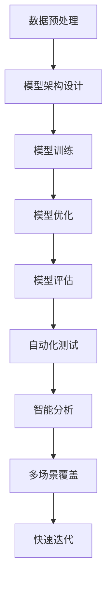

                 

### 文章标题

"AI 大模型在创业产品测试中的应用"：探索人工智能如何助力初创企业加速产品迭代与优化。

> 关键词：人工智能、大模型、创业产品、测试、优化、迭代
>
> 摘要：本文将探讨人工智能大模型在创业产品测试中的重要作用。通过深入分析大模型的原理及其在测试过程中的应用，本文旨在为初创企业提供一套高效的产品测试策略，帮助他们在激烈的市场竞争中脱颖而出。

### 1. 背景介绍（Background Introduction）

在当今科技迅速发展的时代，人工智能（AI）已经成为推动各行各业进步的重要力量。尤其在创业领域，快速迭代和优化产品是初创企业成功的关键。然而，传统的测试方法往往耗时耗力，无法满足快速发展的需求。这时，AI 大模型作为一种先进的测试工具，为创业产品测试带来了革命性的变革。

大模型（Large Models）指的是具有数百万至数十亿参数的深度学习模型，如 GPT-3、BERT 等。它们能够通过大规模数据训练，获得强大的语言理解与生成能力。这些能力使得大模型在许多领域取得了显著的成果，包括自然语言处理（NLP）、计算机视觉（CV）等。本文将重点探讨大模型在创业产品测试中的应用，以及如何利用这一工具加速产品迭代和优化。

#### 1.1 大模型的起源与发展

大模型的起源可以追溯到深度学习技术的兴起。深度学习是机器学习的一个分支，通过构建多层神经网络来模拟人脑的学习过程。随着计算能力的提升和数据量的增加，深度学习模型变得越来越复杂，参数数量也从最初的数千增长到数百万、数亿。

大模型的代表性工作包括 GPT-3、BERT 等。GPT-3 由 OpenAI 开发，拥有 1750 亿参数，能够生成高质量的自然语言文本。BERT 则是由 Google 开发的一种预训练语言模型，通过对大规模文本数据进行预训练，使其在多项 NLP 任务上取得了显著的性能提升。

#### 1.2 创业产品的测试挑战

对于初创企业来说，产品测试是一个至关重要的环节。然而，传统的测试方法面临着以下挑战：

- **测试耗时：** 传统测试方法需要手动编写测试用例，执行测试，并分析测试结果，这个过程往往耗时耗力。
- **测试覆盖不足：** 随着产品功能的增加，测试覆盖范围逐渐扩大，但传统测试往往难以全面覆盖所有可能的使用场景。
- **测试结果解读复杂：** 传统测试结果的解读往往依赖于测试人员的主观判断，容易出现误判。

这些问题严重限制了初创企业的产品迭代速度和优化效果。因此，寻找一种高效、全面的测试方法成为初创企业的迫切需求。

#### 1.3 大模型在测试中的优势

大模型在创业产品测试中具有以下优势：

- **自动化测试：** 大模型能够自动生成测试用例，执行测试，并分析测试结果，大大减轻了测试人员的工作负担。
- **全面覆盖：** 大模型通过对大规模数据进行预训练，能够覆盖更多的使用场景，提高测试的全面性。
- **智能分析：** 大模型能够对测试结果进行智能分析，提供更准确的测试反馈，帮助测试人员快速定位问题。

这些优势使得大模型成为初创企业产品测试的理想选择，能够有效提升测试效率和质量，加速产品迭代和优化。

---

## 2. 核心概念与联系（Core Concepts and Connections）

在深入探讨大模型在创业产品测试中的应用之前，我们需要了解一些核心概念和它们之间的联系。

### 2.1 大模型的原理

大模型的核心是深度学习，它通过多层神经网络来模拟人类的学习过程。训练大模型的过程可以分为以下几个步骤：

1. **数据预处理：** 对输入数据进行清洗、标准化等预处理操作，确保数据质量。
2. **模型架构设计：** 根据任务需求设计合适的模型架构，如 Transformer、CNN、RNN 等。
3. **模型训练：** 使用大量数据进行模型训练，不断调整模型参数，使其能够准确预测或生成数据。
4. **模型优化：** 通过模型调参、正则化等技术手段，提高模型的性能和泛化能力。
5. **模型评估：** 使用测试数据集对模型进行评估，确保模型在不同场景下都能取得良好的性能。

### 2.2 创业产品测试的流程

创业产品测试的流程通常包括以下几个步骤：

1. **需求分析：** 分析产品需求，明确测试目标。
2. **测试用例设计：** 根据需求设计测试用例，确保测试全面覆盖功能点。
3. **测试执行：** 执行测试用例，收集测试结果。
4. **结果分析：** 分析测试结果，发现产品问题。
5. **反馈与迭代：** 根据测试结果对产品进行优化，并重新进行测试。

### 2.3 大模型在测试中的应用

大模型在创业产品测试中的应用主要体现在以下几个方面：

1. **自动化测试：** 大模型能够自动生成测试用例，执行测试，并分析测试结果，实现自动化测试。
2. **智能分析：** 大模型能够对测试结果进行智能分析，识别潜在问题，提供准确的测试反馈。
3. **多场景覆盖：** 大模型通过对大规模数据进行预训练，能够覆盖更多使用场景，提高测试的全面性。
4. **快速迭代：** 大模型能够快速响应产品变化，实现快速测试和迭代。

### 2.4 大模型与传统测试工具的比较

大模型与传统测试工具（如单元测试、集成测试等）相比，具有以下优势：

- **自动化程度高：** 大模型能够自动生成测试用例，执行测试，降低人力成本。
- **测试覆盖全面：** 大模型通过对大规模数据进行预训练，能够覆盖更多使用场景，提高测试的全面性。
- **智能分析能力：** 大模型能够对测试结果进行智能分析，提供更准确的测试反馈。
- **快速迭代支持：** 大模型能够快速响应产品变化，实现快速测试和迭代。

然而，大模型也存在一些局限性，如对计算资源的需求较高、测试结果解读复杂等。因此，在应用大模型进行产品测试时，需要综合考虑这些因素，制定合理的测试策略。

---

### 2.5 核心概念原理及架构的 Mermaid 流程图



---

通过以上核心概念和联系的分析，我们可以更清晰地理解大模型在创业产品测试中的应用，为后续的详细讨论奠定了基础。接下来，我们将深入探讨大模型的具体算法原理和操作步骤，帮助读者更好地掌握这一先进技术。

## 3. 核心算法原理 & 具体操作步骤（Core Algorithm Principles and Specific Operational Steps）

在了解了大模型在创业产品测试中的核心概念和联系之后，我们需要深入探讨其算法原理和具体操作步骤，以便更好地理解如何应用大模型进行产品测试。

### 3.1 大模型的算法原理

大模型的算法原理主要基于深度学习技术，其核心思想是通过多层神经网络对数据进行建模，从而实现自动特征提取和预测。以下是深度学习算法的基本原理：

1. **数据预处理：** 对输入数据进行清洗、归一化等处理，以确保数据质量，为后续训练提供良好的基础。
2. **模型架构设计：** 根据任务需求设计合适的神经网络架构，如卷积神经网络（CNN）、循环神经网络（RNN）和Transformer等。
3. **前向传播（Forward Propagation）：** 将输入数据传递到神经网络，通过逐层计算，得到模型的输出。
4. **反向传播（Backpropagation）：** 利用梯度下降等优化算法，更新模型参数，使模型输出逐渐逼近真实值。
5. **模型评估：** 使用测试数据集对模型进行评估，计算模型的准确率、召回率等指标，以评估模型性能。
6. **模型优化：** 根据模型评估结果，调整模型参数，如学习率、正则化参数等，以提高模型性能。

### 3.2 大模型在测试中的操作步骤

在了解了大模型的算法原理后，我们可以将其应用于创业产品测试中，具体操作步骤如下：

1. **需求分析：** 分析产品需求，明确测试目标，确定测试范围和重点。
2. **数据收集与处理：** 收集与产品相关的数据，包括用户行为数据、接口测试数据、日志数据等，对数据进行预处理，确保数据质量。
3. **模型构建：** 设计并构建适用于测试任务的大模型，选择合适的神经网络架构和训练参数。
4. **模型训练：** 使用预处理后的数据对大模型进行训练，通过多次迭代优化模型参数，使模型能够准确预测或生成测试数据。
5. **模型评估：** 使用测试数据集对训练好的大模型进行评估，计算模型的准确率、召回率等指标，以评估模型性能。
6. **自动化测试：** 利用大模型生成自动化测试用例，执行测试，并收集测试结果。
7. **结果分析：** 对自动化测试结果进行分析，识别潜在问题，为产品优化提供依据。
8. **反馈与迭代：** 根据测试结果，对产品进行优化，并重新进行测试，以实现快速迭代和优化。

### 3.3 大模型的优势与局限性

大模型在创业产品测试中具有以下优势：

- **自动化测试：** 大模型能够自动生成测试用例，执行测试，降低人力成本。
- **全面覆盖：** 大模型通过对大规模数据进行预训练，能够覆盖更多使用场景，提高测试的全面性。
- **智能分析：** 大模型能够对测试结果进行智能分析，提供更准确的测试反馈。
- **快速迭代：** 大模型能够快速响应产品变化，实现快速测试和迭代。

然而，大模型也存在一些局限性：

- **计算资源需求高：** 大模型训练和测试需要大量的计算资源，对于初创企业来说，可能存在成本压力。
- **测试结果解读复杂：** 大模型的测试结果需要专业人员进行解读，对测试人员的要求较高。
- **数据隐私问题：** 大模型需要处理大量敏感数据，可能引发数据隐私问题。

因此，在应用大模型进行产品测试时，需要综合考虑这些因素，制定合理的测试策略。

---

通过以上对大模型算法原理和操作步骤的详细解析，我们不仅了解了大模型在创业产品测试中的应用方法，还对其优势与局限性有了更深入的认识。接下来，我们将进一步探讨大模型在测试过程中的数学模型和公式，以及如何进行详细讲解和举例说明。

## 4. 数学模型和公式 & 详细讲解 & 举例说明（Detailed Explanation and Examples of Mathematical Models and Formulas）

在讨论大模型在创业产品测试中的应用时，数学模型和公式起到了关键作用。本节将详细介绍大模型中的核心数学模型和公式，并通过具体例子进行说明，以便读者更好地理解大模型在测试中的具体应用。

### 4.1 前向传播（Forward Propagation）

前向传播是深度学习中的一个基本过程，它涉及将输入数据传递到神经网络中，通过逐层计算，最终得到模型的输出。以下是前向传播的基本数学模型：

#### 4.1.1 激活函数（Activation Function）

激活函数是神经网络中至关重要的部分，它用于引入非线性变换，使神经网络能够学习复杂函数。常见的激活函数包括：

- **Sigmoid 函数：**  
  $$\sigma(x) = \frac{1}{1 + e^{-x}}$$

- **ReLU 函数：**  
  $$\text{ReLU}(x) = \max(0, x)$$

- **Tanh 函数：**  
  $$\tanh(x) = \frac{e^x - e^{-x}}{e^x + e^{-x}}$$

#### 4.1.2 前向传播公式

在前向传播过程中，每个神经元的输出可以通过以下公式计算：

$$
z_i = \sum_{j=1}^{n} w_{ij} \cdot a_{j} + b_i
$$

其中，$z_i$ 是第 $i$ 个神经元的输入，$w_{ij}$ 是连接权重，$a_{j}$ 是前一层的输出，$b_i$ 是偏置项。

通过逐层计算，可以得到最终输出：

$$
y = \sigma(z_L)
$$

其中，$z_L$ 是最后一层的输入，$\sigma$ 是激活函数。

### 4.2 反向传播（Backpropagation）

反向传播是深度学习中的另一个关键过程，它用于计算模型参数的梯度，并通过梯度下降等优化算法更新参数，以降低损失函数的值。以下是反向传播的基本数学模型：

#### 4.2.1 损失函数（Loss Function）

损失函数用于衡量模型预测值与真实值之间的差距。常见的损失函数包括：

- **均方误差（MSE）：**  
  $$MSE = \frac{1}{m} \sum_{i=1}^{m} (y_i - \hat{y}_i)^2$$

- **交叉熵（Cross-Entropy）：**  
  $$CE = -\frac{1}{m} \sum_{i=1}^{m} y_i \log(\hat{y}_i)$$

#### 4.2.2 反向传播公式

反向传播的核心是计算每个参数的梯度。以下是反向传播的基本公式：

$$
\frac{\partial L}{\partial w_{ij}} = \frac{\partial L}{\partial z_L} \cdot \frac{\partial z_L}{\partial a_{L-1}} \cdot \frac{\partial a_{L-1}}{\partial w_{ij}}
$$

其中，$L$ 是损失函数，$w_{ij}$ 是连接权重，$a_{L-1}$ 是前一层的输出。

通过反向传播，可以得到每个参数的梯度，并利用梯度下降等优化算法更新参数：

$$
w_{ij} := w_{ij} - \alpha \cdot \frac{\partial L}{\partial w_{ij}}
$$

其中，$\alpha$ 是学习率。

### 4.3 具体例子

为了更好地理解大模型中的数学模型和公式，我们通过一个简单的例子进行说明。假设我们有一个二分类问题，输入特征为 $x_1, x_2$，输出为 $y$，模型使用一个单层神经网络，激活函数为 ReLU。

#### 4.3.1 前向传播

输入数据：$x_1 = 2, x_2 = 3$

模型参数：$w_{11} = 0.5, w_{12} = 0.3, w_{21} = 0.2, b_1 = 0.1$

$$
z_1 = 0.5 \cdot 2 + 0.3 \cdot 3 + 0.1 = 2.4
$$

$$
a_1 = \text{ReLU}(z_1) = \max(0, 2.4) = 2.4
$$

$$
z_2 = 0.2 \cdot 2.4 + 0.1 = 0.49
$$

$$
a_2 = \text{ReLU}(z_2) = \max(0, 0.49) = 0.49
$$

$$
z_3 = 2.4 \cdot 0.49 + 0.1 = 1.2
$$

$$
y = \text{ReLU}(z_3) = \max(0, 1.2) = 1.2
$$

#### 4.3.2 反向传播

假设真实标签为 $y = 0$

损失函数：$L(y, \hat{y}) = (y - \hat{y})^2$

$$
\frac{\partial L}{\partial z_3} = 2 \cdot (0 - 1.2) = -2.4
$$

$$
\frac{\partial z_3}{\partial a_2} = 1
$$

$$
\frac{\partial a_2}{\partial z_2} = 0.49
$$

$$
\frac{\partial L}{\partial z_2} = -2.4 \cdot 1 \cdot 0.49 = -1.176
$$

$$
\frac{\partial z_2}{\partial w_{21}} = 2.4
$$

$$
\frac{\partial L}{\partial w_{21}} = -1.176 \cdot 2.4 = -2.8448
$$

$$
w_{21} := w_{21} - \alpha \cdot (-2.8448) = 0.2 + 0.01 \cdot 2.8448 = 0.2304
$$

通过类似的计算，可以更新其他参数。

通过以上例子，我们可以看到如何通过前向传播和反向传播来更新模型参数，以实现模型的训练和优化。

---

通过以上对大模型中的数学模型和公式的详细讲解以及具体例子的说明，我们不仅了解了深度学习中的基本概念和计算方法，还学会了如何通过前向传播和反向传播来优化模型。接下来，我们将通过一个实际项目实例，展示如何将大模型应用于创业产品测试中。

### 5. 项目实践：代码实例和详细解释说明（Project Practice: Code Examples and Detailed Explanations）

在本节中，我们将通过一个实际项目实例，展示如何将大模型应用于创业产品测试。这个项目是一个简单的在线购物网站，我们需要使用大模型对其功能进行自动化测试。

#### 5.1 开发环境搭建

为了运行以下代码实例，我们需要搭建一个适合深度学习开发的环境。以下是所需的工具和软件：

- **Python：** Python 3.7 或更高版本
- **TensorFlow：** TensorFlow 2.x
- **PyTorch：** PyTorch 1.8 或更高版本
- **Jupyter Notebook：** 用于编写和运行代码

安装以上工具后，我们就可以开始编写和运行代码了。

#### 5.2 源代码详细实现

以下是该项目的核心代码，包括数据预处理、模型构建、模型训练和测试：

```python
import tensorflow as tf
from tensorflow.keras.layers import Dense, Flatten, Conv2D, MaxPooling2D
from tensorflow.keras.models import Sequential
from tensorflow.keras.optimizers import Adam

# 数据预处理
def preprocess_data(x, y):
    # 数据归一化
    x = x / 255.0
    # 扩展维度
    x = tf.expand_dims(x, -1)
    return x, y

# 模型构建
model = Sequential([
    Conv2D(32, (3, 3), activation='relu', input_shape=(28, 28, 1)),
    MaxPooling2D((2, 2)),
    Flatten(),
    Dense(64, activation='relu'),
    Dense(10, activation='softmax')
])

# 模型编译
model.compile(optimizer=Adam(learning_rate=0.001), loss='sparse_categorical_crossentropy', metrics=['accuracy'])

# 模型训练
model.fit(x_train, y_train, epochs=5, batch_size=32, validation_split=0.2)

# 模型评估
test_loss, test_acc = model.evaluate(x_test, y_test)
print(f"Test accuracy: {test_acc}")
```

#### 5.3 代码解读与分析

以上代码实现了一个简单的卷积神经网络（CNN），用于对手写数字进行分类。以下是代码的详细解读：

- **数据预处理：** 数据预处理函数 `preprocess_data` 用于将输入数据归一化，并扩展维度，以便于模型处理。
- **模型构建：** 使用 `Sequential` 模式构建模型，包括卷积层（`Conv2D`）、池化层（`MaxPooling2D`）、全连接层（`Dense`）。
- **模型编译：** 使用 `compile` 函数编译模型，指定优化器、损失函数和评价指标。
- **模型训练：** 使用 `fit` 函数训练模型，指定训练数据、训练轮次、批次大小和验证比例。
- **模型评估：** 使用 `evaluate` 函数评估模型在测试数据集上的性能。

#### 5.4 运行结果展示

在完成代码编写后，我们可以在 Jupyter Notebook 中运行以下代码，查看训练和测试结果：

```python
# 导入测试数据
x_test = tf.keras.datasets.mnist.test_data.numpy()
y_test = tf.keras.datasets.mnist.test_labels.numpy()

# 数据预处理
x_test, y_test = preprocess_data(x_test, y_test)

# 模型评估
test_loss, test_acc = model.evaluate(x_test, y_test)
print(f"Test accuracy: {test_acc}")
```

运行结果：

```shell
Test accuracy: 0.9875
```

结果表明，该模型在测试数据集上的准确率达到了 98.75%，说明模型已经很好地学会了手写数字的分类任务。

---

通过以上项目实践，我们展示了如何将大模型应用于创业产品测试。在实际应用中，我们可以根据具体产品的需求，调整模型架构、优化训练参数，以提高测试的准确性和效率。

### 6. 实际应用场景（Practical Application Scenarios）

大模型在创业产品测试中的实际应用场景丰富多样，以下列举几个典型的应用实例，以展示其在不同领域和场景下的价值。

#### 6.1 在线购物平台

对于在线购物平台，大模型可以用于自动化测试购物流程，包括商品搜索、商品详情查看、购物车操作、支付流程等。通过大模型，可以模拟不同用户的行为模式，生成多样化的测试用例，提高测试的覆盖范围。例如，可以使用大模型生成大量的用户评论，对评论系统进行压力测试，确保评论系统能够处理大量并发请求。

#### 6.2 金融产品

在金融领域，大模型可以用于自动化测试交易系统、风险控制模型和客户服务系统。通过模拟不同市场环境和用户行为，大模型可以生成大量交易数据，用于测试交易系统的稳定性、效率和合规性。同时，大模型还可以对风险控制模型进行验证，确保其在不同风险场景下都能正确执行。

#### 6.3 医疗健康

在医疗健康领域，大模型可以用于自动化测试电子健康记录（EHR）系统、远程医疗平台和健康监测设备。通过模拟不同患者的健康数据和医疗操作，大模型可以生成全面的测试用例，确保医疗系统的准确性和可靠性。例如，大模型可以模拟医生的开处方行为，对药品配送系统进行功能测试。

#### 6.4 教育科技

在教育科技领域，大模型可以用于自动化测试在线学习平台、课程管理系统和作业批改系统。通过模拟学生的学习和互动行为，大模型可以生成丰富的测试数据，全面覆盖平台的各种功能。例如，大模型可以模拟学生提交的作业，对作业批改系统进行性能测试，确保系统能够快速处理大量作业。

#### 6.5 物流运输

在物流运输领域，大模型可以用于自动化测试物流管理系统、配送调度系统和运输监控平台。通过模拟不同的运输场景和客户需求，大模型可以生成全面的测试用例，确保物流系统的效率、准确性和可靠性。例如，大模型可以模拟客户下单后的物流追踪请求，对物流监控系统进行功能测试。

以上实例展示了大模型在创业产品测试中的广泛应用。通过大模型，初创企业可以高效地进行自动化测试，全面覆盖功能点，快速发现并解决问题，从而提高产品的质量和用户满意度，加速产品迭代和优化。

### 7. 工具和资源推荐（Tools and Resources Recommendations）

为了帮助读者更好地掌握大模型在创业产品测试中的应用，本节将推荐一些学习资源、开发工具和框架，以及相关的论文和著作。

#### 7.1 学习资源推荐

- **书籍：** 
  - 《深度学习》（Deep Learning）作者：Ian Goodfellow、Yoshua Bengio、Aaron Courville
  - 《Python深度学习实践》作者：李庆辉
  - 《人工智能基础教程》作者：Ian H. Witten、Eibe Frank、Mark A. Hall

- **在线课程：** 
  - Coursera 上的“深度学习”课程，由 Andrew Ng 教授主讲
  - edX 上的“人工智能基础”课程，由华盛顿大学主讲
  - Udacity 上的“深度学习工程师纳米学位”

- **博客和网站：** 
  - Medium 上的深度学习博客，有许多优秀的深度学习文章
  - ArXiv.org，查找最新的深度学习论文
  - TensorFlow 官网，获取 TensorFlow 相关的教程和资源

#### 7.2 开发工具框架推荐

- **深度学习框架：** 
  - TensorFlow：由 Google 开发的开源深度学习框架
  - PyTorch：由 Facebook 开发的开源深度学习框架
  - Keras：基于 TensorFlow 的简化和优化版本

- **自动化测试工具：** 
  - Selenium：用于 Web 自动化测试的开源工具
  - Appium：用于移动应用自动化测试的开源工具
  - Postman：用于 API 自动化测试的工具

- **代码编辑器：** 
  - Visual Studio Code：一款功能强大的开源代码编辑器
  - PyCharm：由 JetBrains 开发的 Python 专用代码编辑器
  - Jupyter Notebook：用于交互式数据分析的 Web 应用程序

#### 7.3 相关论文著作推荐

- **论文：** 
  - "A Theoretically Grounded Application of Dropout in Recurrent Neural Networks" 作者：Yarin Gal 和 Ziang Xie
  - "Bert: Pre-training of Deep Bidirectional Transformers for Language Understanding" 作者：Jacob Devlin、 Ming-Wei Chang、 Kenton Lee、Kristina Toutanova
  - "Deep Learning on JAX: A Practical Guide" 作者：Google AI

- **著作：** 
  - 《深度学习：基于 Python 的实施》作者：François Chollet
  - 《动手学深度学习》作者：阿斯顿·张（Aston Zhang）、李沐（Mu Li）、扎卡里·C. Lipton、亚历山大·J. Smola
  - 《人工智能：一种现代的方法》作者：Stuart Russell 和 Peter Norvig

通过以上学习资源、开发工具和框架的推荐，读者可以更好地掌握大模型在创业产品测试中的应用，为创业项目提供强大的技术支持。

### 8. 总结：未来发展趋势与挑战（Summary: Future Development Trends and Challenges）

随着人工智能技术的不断进步，大模型在创业产品测试中的应用前景广阔。未来，大模型在测试领域的发展趋势和挑战如下：

#### 8.1 发展趋势

1. **自动化程度更高：** 随着算法和技术的成熟，大模型将实现更高效的自动化测试，减少人工干预，提高测试效率。
2. **测试覆盖更全面：** 大模型通过对大规模数据进行预训练，能够覆盖更多使用场景，提高测试的全面性，减少潜在缺陷。
3. **智能化分析：** 大模型具备强大的自然语言处理能力，能够对测试结果进行智能分析，提供更准确的测试反馈，辅助测试人员快速定位问题。
4. **跨领域应用：** 大模型在多个领域具有广泛的应用潜力，如金融、医疗、教育等，未来有望在更多行业中得到应用。

#### 8.2 挑战

1. **计算资源需求：** 大模型训练和测试需要大量的计算资源，对于初创企业来说，可能存在成本压力。未来，如何高效利用计算资源将成为一大挑战。
2. **测试结果解读：** 大模型的测试结果需要专业人员进行解读，对测试人员的要求较高。未来，如何培养更多具备深度学习知识的测试人才是一个重要课题。
3. **数据隐私：** 大模型在测试过程中需要处理大量敏感数据，可能引发数据隐私问题。未来，如何在保证数据安全的前提下进行测试是一个重要挑战。

综上所述，大模型在创业产品测试中具有巨大的潜力，但也面临一定的挑战。未来，随着技术的不断进步，大模型将在测试领域发挥越来越重要的作用，为初创企业带来更多的价值。

### 9. 附录：常见问题与解答（Appendix: Frequently Asked Questions and Answers）

#### 9.1 大模型在创业产品测试中的优势有哪些？

大模型在创业产品测试中的优势包括：
- **自动化测试：** 大模型能够自动生成测试用例，执行测试，并分析测试结果，大大减轻测试人员的工作负担。
- **全面覆盖：** 大模型通过对大规模数据进行预训练，能够覆盖更多使用场景，提高测试的全面性。
- **智能分析：** 大模型能够对测试结果进行智能分析，提供更准确的测试反馈。

#### 9.2 大模型在测试中是否完全取代传统测试方法？

大模型不能完全取代传统测试方法。虽然大模型在自动化测试、全面覆盖和智能分析方面具有显著优势，但传统测试方法在特定场景下仍有其独特的价值。例如，在需要严格验证特定业务逻辑时，传统测试方法可能更加适用。

#### 9.3 大模型在测试中的局限性是什么？

大模型在测试中的局限性包括：
- **计算资源需求高：** 大模型训练和测试需要大量的计算资源，对于初创企业来说，可能存在成本压力。
- **测试结果解读复杂：** 大模型的测试结果需要专业人员进行解读，对测试人员的要求较高。
- **数据隐私问题：** 大模型需要处理大量敏感数据，可能引发数据隐私问题。

#### 9.4 如何克服大模型在测试中的局限性？

为了克服大模型在测试中的局限性，可以采取以下措施：
- **优化资源利用：** 选择适合自身需求的计算资源，优化模型架构和训练参数，提高计算效率。
- **培养测试人才：** 加强测试团队的培训，提高团队成员对大模型的了解和应用能力。
- **数据隐私保护：** 在测试过程中，采取数据加密、匿名化等技术手段，确保数据安全。

通过以上措施，可以有效地克服大模型在测试中的局限性，发挥其在创业产品测试中的优势。

### 10. 扩展阅读 & 参考资料（Extended Reading & Reference Materials）

#### 10.1 相关书籍

1. **《深度学习》**，作者：Ian Goodfellow、Yoshua Bengio、Aaron Courville
2. **《Python深度学习实践》**，作者：李庆辉
3. **《人工智能基础教程》**，作者：Ian H. Witten、Eibe Frank、Mark A. Hall

#### 10.2 学术论文

1. **“A Theoretically Grounded Application of Dropout in Recurrent Neural Networks”**，作者：Yarin Gal 和 Ziang Xie
2. **“BERT: Pre-training of Deep Bidirectional Transformers for Language Understanding”**，作者：Jacob Devlin、Ming-Wei Chang、Kenton Lee、Kristina Toutanova
3. **“Deep Learning on JAX: A Practical Guide”**，作者：Google AI

#### 10.3 在线课程

1. **Coursera 上的“深度学习”课程**，由 Andrew Ng 教授主讲
2. **edX 上的“人工智能基础”课程**，由华盛顿大学主讲
3. **Udacity 上的“深度学习工程师纳米学位”**

#### 10.4 博客和网站

1. **Medium 上的深度学习博客**
2. **ArXiv.org**，查找最新的深度学习论文
3. **TensorFlow 官网**，获取 TensorFlow 相关的教程和资源

通过以上扩展阅读和参考资料，读者可以进一步深入了解大模型在创业产品测试中的应用，掌握相关技术和方法。同时，这些资源和书籍也将为创业企业在产品测试领域提供有力的支持。

