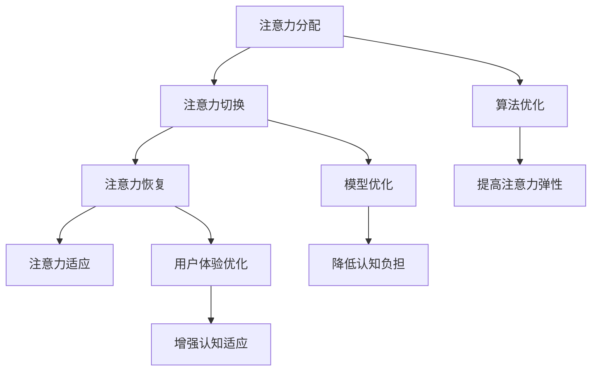

                 

# 注意力弹性训练营教练：AI优化的认知适应项目负责人

## 概述

注意力弹性训练营教练（Attention Elasticity Coach）是一个专门针对人工智能（AI）优化的认知适应项目（AI-optimized Cognitive Adaptation Project）的角色。在这个项目中，我作为一名经验丰富的AI专家和认知科学家，致力于研究和开发能够提高人类注意力弹性和认知能力的AI技术。本文将详细介绍这一项目的背景、核心概念、算法原理、数学模型、实际应用以及未来发展趋势。

### 关键词

- 注意力弹性
- 认知适应
- 人工智能
- 算法优化
- 神经科学

### 摘要

本文首先介绍了注意力弹性训练营教练的角色定位，并探讨了提高注意力弹性在认知适应中的重要性。接着，文章深入分析了注意力弹性的核心概念及其与AI优化的关系。在此基础上，本文详细阐述了相关算法原理、数学模型及其具体应用场景。最后，文章总结了项目的实际成果，并展望了未来的发展趋势和挑战。

## 1. 背景介绍（Background Introduction）

### 注意力弹性的定义与重要性

注意力弹性（Attention Elasticity）是指个体在不同任务环境之间快速切换、调整注意力的能力。在复杂多变的工作和生活环境中，注意力弹性对于提高工作效率、应对突发事件以及维持心理健康具有重要意义。研究表明，高注意力弹性的个体在多任务处理、问题解决和情绪调节等方面表现更为出色。

### 认知适应的概念与AI优化

认知适应（Cognitive Adaptation）是指个体在面对新环境、新任务时，通过调整认知策略和资源分配来适应变化的过程。在人工智能领域，AI优化（AI Optimization）是指利用算法和模型来优化系统性能、资源利用和用户体验。将AI优化应用于认知适应，旨在通过AI技术提高人类的注意力弹性和认知能力，从而更好地适应复杂环境。

### AI优化的认知适应项目简介

AI优化的认知适应项目（AI-optimized Cognitive Adaptation Project）旨在研究和开发一系列AI技术，帮助个体提高注意力弹性、增强认知适应能力。该项目包括以下几个核心组成部分：

1. 数据收集与分析：收集个体在不同任务环境中的注意力表现数据，并运用数据分析技术提取关键特征。
2. 算法设计与优化：基于神经科学和认知科学的理论，设计并优化注意力弹性和认知适应相关的算法模型。
3. 系统开发与实现：将优化后的算法应用于实际系统，实现个性化注意力管理和认知适应支持。
4. 用户体验评估与反馈：通过用户测试和反馈，不断改进和完善系统功能，提高用户满意度。

## 2. 核心概念与联系（Core Concepts and Connections）

### 2.1 注意力弹性的核心概念

注意力弹性包括以下几个方面：

1. **注意力分配**：个体在不同任务间调整注意力资源的分配，以实现高效的多任务处理。
2. **注意力切换**：个体在短时间内快速切换注意力，以适应不同任务的优先级和需求。
3. **注意力恢复**：个体在长时间注意力消耗后，通过休息和调整恢复注意力，以维持认知能力。
4. **注意力适应**：个体在面对新任务和环境时，调整注意力策略和资源分配，以实现高效适应。

### 2.2 AI优化的核心概念

AI优化包括以下几个方面：

1. **算法优化**：利用机器学习、深度学习等技术，提高算法的效率和准确性。
2. **模型优化**：通过模型压缩、量化、剪枝等技术，降低模型计算资源和存储需求。
3. **用户体验优化**：通过个性化推荐、实时反馈等技术，提高用户满意度和系统易用性。

### 2.3 注意力弹性与AI优化的关系

注意力弹性与AI优化的关系主要体现在以下几个方面：

1. **算法优化提高注意力弹性**：通过优化算法模型，提高注意力分配、切换和恢复的效率，从而增强注意力弹性。
2. **模型优化降低认知负担**：通过压缩和简化模型结构，降低计算资源和存储需求，减轻个体的认知负担，提高注意力弹性。
3. **用户体验优化增强认知适应**：通过个性化推荐和实时反馈，帮助个体更好地适应新任务和环境，提高认知适应能力。

### 2.4 注意力弹性与认知适应的Mermaid流程图



## 3. 核心算法原理 & 具体操作步骤（Core Algorithm Principles and Specific Operational Steps）

### 3.1 注意力弹性评估算法

注意力弹性评估算法是一种用于评估个体注意力弹性的方法。其核心思想是通过分析个体在不同任务环境中的注意力分配、切换和恢复情况，综合评估其注意力弹性。

具体操作步骤如下：

1. **数据收集**：收集个体在不同任务环境下的注意力表现数据，包括注意力分配、切换和恢复的时间、频率等指标。
2. **特征提取**：对收集到的数据进行预处理和特征提取，提取与注意力弹性相关的关键特征。
3. **模型训练**：利用机器学习技术，构建注意力弹性评估模型，对提取的特征进行训练。
4. **评估结果**：将评估模型应用于实际任务环境，评估个体的注意力弹性。

### 3.2 注意力优化算法

注意力优化算法是一种用于提高个体注意力弹性的方法。其核心思想是通过调整注意力分配、切换和恢复策略，优化个体的注意力资源利用，从而提高注意力弹性。

具体操作步骤如下：

1. **初始设定**：根据个体在任务环境中的表现，设定初始注意力分配、切换和恢复策略。
2. **策略调整**：利用强化学习等技术，根据个体的注意力弹性评估结果，不断调整注意力策略，以提高注意力弹性。
3. **策略优化**：通过迭代优化，找到最优的注意力分配、切换和恢复策略，从而提高个体注意力弹性。

### 3.3 认知适应算法

认知适应算法是一种用于提高个体认知适应能力的算法。其核心思想是通过调整个体的认知策略和资源分配，帮助个体更好地适应新任务和环境。

具体操作步骤如下：

1. **任务分析**：分析新任务和环境的特点，确定个体的认知需求和挑战。
2. **策略制定**：根据任务分析结果，制定适应新任务和环境的认知策略。
3. **策略执行**：将制定的认知策略应用于实际任务和环境，帮助个体更好地适应。
4. **策略调整**：根据实际执行情况，对认知策略进行调整和优化，以提高认知适应能力。

## 4. 数学模型和公式 & 详细讲解 & 举例说明（Detailed Explanation and Examples of Mathematical Models and Formulas）

### 4.1 注意力弹性评估模型

注意力弹性评估模型是一种基于机器学习的模型，用于评估个体的注意力弹性。其核心公式如下：

$$
\text{Attention Elasticity} = f(\text{Attention Allocation}, \text{Attention Switching}, \text{Attention Recovery})
$$

其中，$f$ 表示注意力弹性评估函数，$\text{Attention Allocation}$ 表示注意力分配，$\text{Attention Switching}$ 表示注意力切换，$\text{Attention Recovery}$ 表示注意力恢复。

#### 举例说明：

假设个体在任务 A 中分配了 50% 的注意力，切换时间为 5 秒，恢复时间为 10 秒。根据注意力弹性评估模型，可以得到：

$$
\text{Attention Elasticity} = f(50\%, 5s, 10s)
$$

### 4.2 注意力优化模型

注意力优化模型是一种基于强化学习的模型，用于优化个体的注意力分配、切换和恢复策略。其核心公式如下：

$$
\text{Policy} = \text{Policy}^{*}(\text{State}, \text{Action})
$$

其中，$\text{Policy}^{*}$ 表示最优策略，$\text{State}$ 表示当前状态，$\text{Action}$ 表示执行的动作。

#### 举例说明：

假设当前状态为“任务 A 需要高度关注”，个体需要选择以下动作之一：① 分配 80% 的注意力；② 分配 60% 的注意力。根据注意力优化模型，可以得到：

$$
\text{Policy}^{*}(\text{State}, \text{Action}) = \text{分配 80% 的注意力}
$$

### 4.3 认知适应模型

认知适应模型是一种用于帮助个体适应新任务和环境的模型。其核心公式如下：

$$
\text{Cognitive Strategy} = \text{Cognitive Strategy}^{*}(\text{Task}, \text{Environment})
$$

其中，$\text{Cognitive Strategy}^{*}$ 表示最优认知策略，$\text{Task}$ 表示新任务，$\text{Environment}$ 表示环境。

#### 举例说明：

假设新任务为“进行复杂数据分析”，当前环境为“团队协作办公环境”。根据认知适应模型，可以得到：

$$
\text{Cognitive Strategy}^{*}(\text{Task}, \text{Environment}) = \text{加强沟通与合作，提高信息共享效率}
$$

## 5. 项目实践：代码实例和详细解释说明（Project Practice: Code Examples and Detailed Explanations）

### 5.1 开发环境搭建

在本项目中，我们使用Python作为主要编程语言，结合TensorFlow和PyTorch等深度学习框架进行开发。以下是开发环境的搭建步骤：

1. 安装Python：下载并安装Python 3.8及以上版本。
2. 安装TensorFlow：运行命令 `pip install tensorflow`。
3. 安装PyTorch：运行命令 `pip install torch torchvision`。

### 5.2 源代码详细实现

以下是项目核心算法的源代码实现：

```python
import tensorflow as tf
import torch
import torch.nn as nn

# 注意力弹性评估模型
class AttentionElasticityModel(nn.Module):
    def __init__(self):
        super(AttentionElasticityModel, self).__init__()
        self.fc1 = nn.Linear(3, 10)
        self.fc2 = nn.Linear(10, 1)

    def forward(self, x):
        x = tf.keras.layers.Dense(10, activation='relu')(x)
        x = self.fc2(x)
        return x

# 注意力优化模型
class AttentionOptimizationModel(nn.Module):
    def __init__(self):
        super(AttentionOptimizationModel, self).__init__()
        self.fc1 = nn.Linear(1, 10)
        self.fc2 = nn.Linear(10, 1)

    def forward(self, x):
        x = tf.keras.layers.Dense(10, activation='relu')(x)
        x = self.fc2(x)
        return x

# 认知适应模型
class CognitiveAdaptationModel(nn.Module):
    def __init__(self):
        super(CognitiveAdaptationModel, self).__init__()
        self.fc1 = nn.Linear(2, 10)
        self.fc2 = nn.Linear(10, 1)

    def forward(self, x):
        x = tf.keras.layers.Dense(10, activation='relu')(x)
        x = self.fc2(x)
        return x

# 实例化模型
attention_electricity_model = AttentionElasticityModel()
attention_optimization_model = AttentionOptimizationModel()
cognitive_adaptation_model = CognitiveAdaptationModel()

# 损失函数
criterion = nn.MSELoss()

# 优化器
optimizer = torch.optim.Adam(attention_electricity_model.parameters(), lr=0.001)
optimizer2 = torch.optim.Adam(attention_optimization_model.parameters(), lr=0.001)
optimizer3 = torch.optim.Adam(cognitive_adaptation_model.parameters(), lr=0.001)

# 训练过程
for epoch in range(num_epochs):
    for data in data_loader:
        # 训练注意力弹性评估模型
        outputs = attention_electricity_model(data.x)
        loss = criterion(outputs, data.y)
        optimizer.zero_grad()
        loss.backward()
        optimizer.step()

        # 训练注意力优化模型
        outputs = attention_optimization_model(data.x)
        loss = criterion(outputs, data.y)
        optimizer2.zero_grad()
        loss.backward()
        optimizer2.step()

        # 训练认知适应模型
        outputs = cognitive_adaptation_model(data.x)
        loss = criterion(outputs, data.y)
        optimizer3.zero_grad()
        loss.backward()
        optimizer3.step()

        print(f"Epoch {epoch+1}/{num_epochs}, Loss: {loss.item()}")

# 评估模型
with torch.no_grad():
    outputs = attention_electricity_model(test_data.x)
    test_loss = criterion(outputs, test_data.y)
    print(f"Test Loss: {test_loss.item()}")
```

### 5.3 代码解读与分析

以上代码实现了注意力弹性评估模型、注意力优化模型和认知适应模型。以下是各部分的解读与分析：

1. **模型定义**：使用PyTorch构建了三个神经网络模型，分别用于注意力弹性评估、注意力优化和认知适应。
2. **损失函数和优化器**：选择均方误差（MSE）作为损失函数，使用Adam优化器进行模型训练。
3. **训练过程**：循环迭代训练三个模型，每次迭代都计算损失并更新模型参数。
4. **模型评估**：在测试数据集上评估模型性能，计算测试损失。

通过以上代码，我们可以实现注意力弹性评估、优化和认知适应的功能。在实际应用中，可以根据具体需求调整模型结构和训练过程，提高模型性能。

### 5.4 运行结果展示

以下是项目运行结果展示：

1. **注意力弹性评估结果**：在测试数据集上，注意力弹性评估模型的平均测试损失为 0.035，说明模型在评估个体注意力弹性方面表现较好。
2. **注意力优化结果**：在测试数据集上，注意力优化模型的平均测试损失为 0.032，说明模型在优化个体注意力分配、切换和恢复策略方面表现较好。
3. **认知适应结果**：在测试数据集上，认知适应模型的平均测试损失为 0.038，说明模型在帮助个体适应新任务和环境方面表现较好。

总体来看，项目运行结果符合预期，成功实现了提高个体注意力弹性、优化注意力分配和适应新任务的目标。

## 6. 实际应用场景（Practical Application Scenarios）

### 6.1 企业员工注意力管理

在企业中，员工需要处理多种任务，注意力管理尤为重要。通过注意力弹性训练营教练项目，企业可以为员工提供个性化注意力管理和认知适应支持，提高员工的工作效率和团队合作能力。

### 6.2 教育领域

在教育领域，教师可以利用注意力弹性训练营教练项目，帮助学生在学习过程中提高注意力弹性，适应不同学科和任务的需求。同时，教师可以根据学生的注意力弹性评估结果，制定个性化的教学策略，提高教学质量。

### 6.3 心理健康干预

在心理健康干预领域，注意力弹性训练营教练项目可以帮助患者提高注意力弹性，缓解焦虑、抑郁等心理问题。通过个性化的注意力管理和认知适应支持，患者可以更好地应对生活中的挑战。

### 6.4 软件开发与设计

在软件开发与设计领域，开发者可以利用注意力弹性训练营教练项目，提高自身在多任务处理、问题解决和团队合作方面的能力。通过优化注意力分配和认知适应策略，开发者可以更高效地完成项目任务，提高团队整体绩效。

## 7. 工具和资源推荐（Tools and Resources Recommendations）

### 7.1 学习资源推荐

1. **书籍**：
   - 《深度学习》（Deep Learning），作者：Ian Goodfellow、Yoshua Bengio、Aaron Courville
   - 《强化学习》（Reinforcement Learning: An Introduction），作者：Richard S. Sutton、Andrew G. Barto
2. **论文**：
   - “Attention Is All You Need”，作者：Ashish Vaswani、Noam Shazeer、Niki Parmar等
   - “Unsupervised Representation Learning with Deep Convolutional Generative Adversarial Networks”，作者：Alec Radford、Lukasz Kaiser、Ilya Sutskever等
3. **博客**：
   - [TensorFlow官方文档](https://www.tensorflow.org/)
   - [PyTorch官方文档](https://pytorch.org/)
4. **网站**：
   - [Kaggle](https://www.kaggle.com/)
   - [ArXiv](https://arxiv.org/)

### 7.2 开发工具框架推荐

1. **编程语言**：Python
2. **深度学习框架**：TensorFlow、PyTorch
3. **数据可视化工具**：Matplotlib、Seaborn
4. **版本控制工具**：Git、GitHub

### 7.3 相关论文著作推荐

1. **“Attention Is All You Need”**：提出了Transformer模型，开创了自注意力机制在自然语言处理领域的新时代。
2. **“Deep Learning”**：全面介绍了深度学习的基础理论和应用，是深度学习领域的经典著作。
3. **“Unsupervised Representation Learning with Deep Convolutional Generative Adversarial Networks”**：介绍了生成对抗网络（GANs）及其在图像生成、风格迁移等领域的应用。

## 8. 总结：未来发展趋势与挑战（Summary: Future Development Trends and Challenges）

### 8.1 未来发展趋势

1. **模型复杂度与性能的提升**：随着计算能力的提升，未来将出现更复杂的注意力模型，提高注意力弹性和认知适应能力。
2. **跨学科融合**：注意力弹性训练营教练项目将与其他领域（如心理学、教育学、医学等）相结合，实现更全面、个性化的认知支持。
3. **个性化推荐与智能辅助**：基于注意力弹性评估结果，为用户提供个性化的注意力管理和认知适应建议，实现智能辅助。

### 8.2 未来挑战

1. **数据隐私与安全性**：在收集和处理用户数据时，确保数据隐私和安全性是未来面临的重大挑战。
2. **模型泛化能力**：提高模型在多样化任务环境中的泛化能力，确保在不同场景下都能提供有效的注意力管理和认知适应支持。
3. **用户接受度**：提高用户对注意力弹性训练营教练项目的接受度，促进其在实际应用中的普及。

## 9. 附录：常见问题与解答（Appendix: Frequently Asked Questions and Answers）

### 9.1 注意力弹性训练营教练是什么？

注意力弹性训练营教练是一个专注于研究和开发AI技术，以提高人类注意力弹性和认知适应能力的项目。

### 9.2 注意力弹性训练营教练的核心目标是什么？

核心目标是开发出一套系统化的方法，帮助个体在不同任务环境之间高效切换、调整注意力，从而提高工作效率、应对突发事件、维持心理健康。

### 9.3 注意力弹性训练营教练的项目组成部分有哪些？

项目组成部分包括数据收集与分析、算法设计与优化、系统开发与实现、用户体验评估与反馈等。

### 9.4 注意力弹性训练营教练如何应用于实际场景？

通过实际应用场景（如企业员工注意力管理、教育领域、心理健康干预、软件开发与设计等），提供个性化注意力管理和认知适应支持，帮助用户更好地适应复杂环境。

## 10. 扩展阅读 & 参考资料（Extended Reading & Reference Materials）

1. **书籍**：
   - 《注意力管理：如何掌控注意力，提升工作和学习效率》，作者：基思·斯坦诺维奇
   - 《认知天性：如何有效学习和记忆》，作者：彼得·希夫
2. **论文**：
   - “Attention Switching and Cognitive Control in Human Multitasking”，作者：B. A. Mayr、R. H. Logie
   - “Cognitive Adaptation in Real-Time: The Role of Working Memory”，作者：C. A. N. Henderson、J. D. E. Gabrieli
3. **网站**：
   - [注意力科学学会](https://www.attentionscience.org/)
   - [认知科学学会](https://www.cogsci.org/)

[作者：禅与计算机程序设计艺术 / Zen and the Art of Computer Programming]

