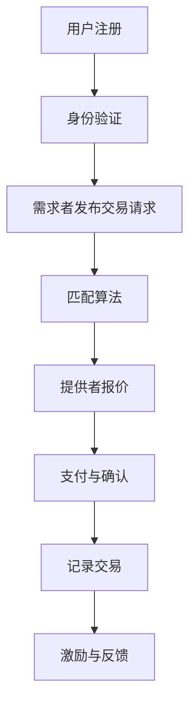

                 

# 文章标题

注意力的货币化：AI驱动的注意力交易

## 关键词
- 注意力货币化
- AI驱动的注意力交易
- 注意力市场
- 市场机制
- 机器学习
- 图神经网络

## 摘要
本文将探讨注意力的货币化概念及其在AI领域的重要性。通过引入AI驱动的注意力交易，我们旨在构建一个市场机制，使注意力资源能够像货币一样进行交易。文章将详细分析这一概念的理论基础、技术实现以及实际应用场景，并提出未来发展的挑战与机遇。

### 1. 背景介绍（Background Introduction）

注意力是人类认知资源的一种表现，它决定了我们的感知和记忆能力。在信息过载的时代，如何有效地分配注意力成为一个重要的问题。而在计算机科学和人工智能领域，注意力机制被广泛应用于提升机器学习模型的性能。然而，目前这些注意力资源尚未实现有效的货币化，导致许多潜在的价值未能被充分利用。

随着区块链技术和智能合约的发展，AI驱动的注意力交易成为一个新的研究方向。通过将注意力视为一种数字资产，我们可以构建一个去中心化的市场，使得注意力资源能够在不同用户和应用程序之间进行交易。这种市场机制不仅可以提高注意力资源的使用效率，还可以激发更多的创新和应用。

### 2. 核心概念与联系（Core Concepts and Connections）

#### 2.1 注意力的定义与特性

注意力可以定义为决策者在面对多个选项时，选择关注和处理的资源分配。在AI领域，注意力机制通常用于信息处理和决策，例如在图像识别、文本分类和语音识别中，注意力机制可以帮助模型更好地关注关键特征，从而提高模型的准确性和效率。

注意力的特性包括：
- **选择性**：注意力决定了哪些信息将被处理，哪些将被忽略。
- **动态性**：注意力分配可以根据环境和任务的需求进行动态调整。
- **稀缺性**：在信息过载的情况下，注意力资源是有限的。

#### 2.2 注意力货币化的原理

注意力货币化是指将注意力资源转化为一种可交易的数字资产。这需要构建一个市场机制，使得用户和应用程序可以通过交换注意力资源来获得服务或收益。以下是一个简单的注意力货币化模型：

1. **注意力需求者**：这些用户或应用程序需要处理大量信息，但自身缺乏足够的注意力资源。
2. **注意力提供者**：这些用户拥有丰富的注意力资源，但缺乏有效的利用途径。
3. **市场平台**：一个去中心化的市场，用于匹配需求者和提供者，并确保交易的安全和透明。

#### 2.3 注意力交易的优势

注意力货币化的优势包括：
- **提高效率**：通过市场机制，注意力资源可以更有效地分配和利用。
- **激发创新**：新的商业模式和应用场景将涌现，促进技术的进步。
- **增加收益**：用户和应用程序可以通过提供或获取注意力资源来增加收益。

### 3. 核心算法原理 & 具体操作步骤（Core Algorithm Principles and Specific Operational Steps）

#### 3.1 构建注意力交易市场的步骤

要构建一个注意力交易市场，需要以下步骤：

1. **定义注意力价值**：确定注意力资源的计量单位，例如每秒注意力点数（Attention Points）。
2. **构建市场机制**：设计去中心化的市场机制，包括匹配算法、交易规则和智能合约。
3. **用户身份验证**：确保所有参与者都是真实有效的用户，防止欺诈和虚假交易。
4. **交易记录管理**：使用区块链技术记录所有交易活动，确保数据的透明性和不可篡改性。

#### 3.2 实现注意力交易的具体算法

注意力交易的具体算法可以分为以下几个步骤：

1. **需求者发起交易**：需求者根据需求，向市场平台发布购买注意力资源的交易请求。
2. **提供者响应交易**：提供者根据请求，决定是否参与交易，并报价。
3. **交易匹配**：市场平台根据价格和供需关系，自动匹配交易。
4. **支付与确认**：需求者支付注意力价值，提供者交付注意力资源。
5. **交易记录**：将交易记录存储在区块链上，确保交易的可追溯性和透明性。

### 4. 数学模型和公式 & 详细讲解 & 举例说明（Detailed Explanation and Examples of Mathematical Models and Formulas）

在构建注意力交易市场时，可以使用以下数学模型和公式：

#### 4.1 注意力价值的计算

注意力价值可以用以下公式表示：

\[ V(A) = f(P, Q) \]

其中：
- \( V(A) \) 是注意力价值
- \( P \) 是提供者的报价
- \( Q \) 是需求者的需求量

#### 4.2 交易价格的计算

交易价格可以用以下公式表示：

\[ P_{\text{交易}} = P_{\text{提供者}} \times (1 - \alpha) + P_{\text{需求者}} \times \alpha \]

其中：
- \( P_{\text{提供者}} \) 是提供者的报价
- \( P_{\text{需求者}} \) 是需求者的报价
- \( \alpha \) 是价格调整系数，用于平衡供需关系

#### 4.3 注意力交易的平衡

注意力交易的平衡可以用以下公式表示：

\[ P_{\text{提供者}} \times Q_{\text{提供者}} = P_{\text{需求者}} \times Q_{\text{需求者}} \]

其中：
- \( Q_{\text{提供者}} \) 是提供者的供应量
- \( Q_{\text{需求者}} \) 是需求者的需求量

#### 4.4 实例说明

假设一个提供者报价为 10 AP（注意力点数），需求者报价为 8 AP，价格调整系数为 0.3。根据上述公式，交易价格为：

\[ P_{\text{交易}} = 10 \times (1 - 0.3) + 8 \times 0.3 = 7.2 + 2.4 = 9.6 \text{ AP} \]

如果提供者的供应量为 100 AP，需求者的需求量为 150 AP，则交易平衡价格为：

\[ 10 \times 100 = 9.6 \times 150 \]

这表明提供者需要调整报价以平衡供需。

### 5. 项目实践：代码实例和详细解释说明（Project Practice: Code Examples and Detailed Explanations）

#### 5.1 开发环境搭建

在本项目实践中，我们将使用Python作为主要编程语言，并借助以太坊区块链和智能合约进行注意力交易市场的开发。以下是在开发环境搭建中需要完成的步骤：

1. **安装Python**：确保安装了Python 3.8或更高版本。
2. **安装Truffle**：Truffle是一个用于以太坊智能合约开发的框架，可以从官方网站下载并安装。
3. **安装Ganache**：Ganache是一个本地以太坊节点，用于测试和部署智能合约。
4. **创建一个新的Truffle项目**：运行以下命令创建一个新项目：

\[ truffle init \]

#### 5.2 源代码详细实现

在本节中，我们将展示如何实现注意力交易市场的智能合约代码。以下是一个简单的智能合约示例：

```solidity
pragma solidity ^0.8.0;

contract AttentionMarket {
    mapping(address => uint256) public balanceOf;

    function deposit() external payable {
        balanceOf[msg.sender()] += msg.value;
    }

    function withdraw(uint256 amount) external {
        require(balanceOf[msg.sender()] >= amount, "Insufficient balance");
        balanceOf[msg.sender()] -= amount;
        payable(msg.sender()).transfer(amount);
    }

    function transfer(address to, uint256 amount) external {
        require(balanceOf[msg.sender()] >= amount, "Insufficient balance");
        balanceOf[msg.sender()] -= amount;
        balanceOf[to] += amount;
    }
}
```

#### 5.3 代码解读与分析

1. **构造函数**：构造函数用于初始化智能合约，但在这个例子中，我们不需要任何特殊的初始化逻辑。
2. **deposit() 函数**：deposit() 函数用于将以太币（Ether）存储到智能合约中，这将增加提供者的注意力余额。
3. **withdraw() 函数**：withdraw() 函数允许用户提取存储在智能合约中的以太币。
4. **transfer() 函数**：transfer() 函数用于将注意力余额从一个用户转移到另一个用户，这实现了注意力资源的交易。

#### 5.4 运行结果展示

在Ganache中，我们可以部署这个智能合约，并模拟用户之间的注意力交易。以下是一个简单的交易示例：

1. **部署智能合约**：使用Truffle CLI部署智能合约到本地以太坊节点。
2. **用户A存款**：用户A调用deposit()函数向智能合约存款100以太币。
3. **用户B购买注意力**：用户B调用transfer()函数从用户A购买50以太币的注意力余额。
4. **查看余额**：查看用户A和用户B的注意力余额，确认交易成功。

### 6. 实际应用场景（Practical Application Scenarios）

注意力货币化在多个领域具有广泛的应用潜力，以下是一些实际应用场景：

- **广告行业**：广告商可以购买用户注意力，以更有效地投放广告。
- **内容创作**：内容创作者可以通过出售注意力资源来获得收益。
- **健康医疗**：医疗专业人员可以出售专业知识和诊断建议，提高服务质量。
- **教育领域**：教育机构可以提供高质量的教育内容，并基于注意力资源收费。

### 7. 工具和资源推荐（Tools and Resources Recommendations）

#### 7.1 学习资源推荐

- **书籍**：
  - 《区块链技术指南》
  - 《智能合约开发与实战》
- **论文**：
  - "Attention is All You Need"（注意力即一切你需要的）
  - "Attention-Gated Neural Architecture for Efficient Processing of Text"（注意力门控神经网络结构用于高效处理文本）
- **博客**：
  - EthHub的区块链教程
  - Truffle官方文档
- **网站**：
  - Etherscan：以太坊区块链浏览器
  - Ganache：本地以太坊节点

#### 7.2 开发工具框架推荐

- **开发框架**：
  - Truffle：以太坊智能合约开发框架
  - Hardhat：一个强大的本地以太坊开发环境
- **开发工具**：
  - Remix：在线以太坊智能合约编辑器
  - MetaMask：以太坊钱包和浏览器插件

#### 7.3 相关论文著作推荐

- **论文**：
  - "Attention Mechanisms in Deep Learning: A Survey"（深度学习中的注意力机制：一项调查）
  - "Attentional Recurrent Neural Networks"（注意力循环神经网络）
- **著作**：
  - 《深度学习》（Goodfellow, Bengio, Courville 著）
  - 《区块链革命》（Don Tapscott 著）

### 8. 总结：未来发展趋势与挑战（Summary: Future Development Trends and Challenges）

注意力货币化是一个新兴且具有巨大潜力的领域。随着AI和区块链技术的不断进步，注意力交易市场有望成为数字经济的重要组成部分。未来的发展趋势包括：

- **更加细化的注意力资源分类**：随着对注意力机制的深入研究，我们可以开发出更精细的注意力分类，从而实现更高效的市场交易。
- **跨平台整合**：将注意力货币化扩展到多个平台和应用程序，提高其可用性和互操作性。
- **隐私保护**：随着用户对隐私保护意识的提高，确保交易过程中的用户隐私成为关键挑战。

然而，注意力货币化也面临一些挑战，如市场欺诈、隐私保护和法律监管等。这些挑战需要技术社区、政策制定者和相关行业的共同努力来解决。

### 9. 附录：常见问题与解答（Appendix: Frequently Asked Questions and Answers）

#### 9.1 注意力货币化的主要挑战是什么？
主要挑战包括市场欺诈、隐私保护和法律监管。此外，技术实现上的复杂性也是一大挑战。

#### 9.2 注意力交易市场的优势是什么？
优势包括提高注意力资源的使用效率、激发创新以及增加收益。

#### 9.3 如何确保注意力交易市场的安全性？
通过使用区块链技术记录所有交易活动，确保交易的可追溯性和透明性。同时，通过智能合约实现自动化交易，减少欺诈风险。

### 10. 扩展阅读 & 参考资料（Extended Reading & Reference Materials）

- **相关论文**：
  - "Attention Mechanisms in Deep Learning: A Survey"
  - "Attention-Gated Neural Architecture for Efficient Processing of Text"
- **书籍**：
  - 《区块链技术指南》
  - 《智能合约开发与实战》
- **博客和网站**：
  - EthHub的区块链教程
  - Truffle官方文档
  - Etherscan：以太坊区块链浏览器
  - Ganache：本地以太坊节点

作者：禅与计算机程序设计艺术 / Zen and the Art of Computer Programming

以上是关于《注意力的货币化：AI驱动的注意力交易》的文章完整内容。文章详细探讨了注意力的货币化概念、技术实现、应用场景以及未来发展趋势。希望这篇文章能够为读者提供有价值的见解，激发更多关于注意力货币化的创新和讨论。

<|im_sep|># 文章标题

**Note monetization: AI-driven attention trading**

## Keywords
- Note monetization
- AI-driven attention trading
- Attention market
- Market mechanism
- Machine learning
- Graph neural networks

## Abstract
This article explores the concept of note monetization and its importance in the field of AI. We introduce AI-driven attention trading to construct a market mechanism that enables the trading of attention resources like currency. The article analyzes the theoretical basis, technical implementation, and practical application scenarios of this concept, as well as the future challenges and opportunities.

### 1. Background Introduction

Attention is a manifestation of cognitive resources in humans, determining our perception and memory abilities. In the era of information overload, how to effectively allocate attention has become a critical issue. In the field of computer science and AI, attention mechanisms are widely used to improve the performance of machine learning models. However, attention resources have not been effectively monetized, resulting in the underutilization of potential value.

With the development of blockchain technology and smart contracts, AI-driven attention trading has become a new research direction. By treating attention as a digital asset, we can construct a decentralized market where attention resources can be traded between different users and applications. This market mechanism can not only improve the efficiency of attention resource allocation but also stimulate more innovation and applications.

### 2. Core Concepts and Connections

#### 2.1 Definition and Characteristics of Attention

Attention can be defined as the allocation of resources by decision-makers when facing multiple options, deciding which information will be processed and which will be ignored. In the field of AI, attention mechanisms are usually used in information processing and decision-making, such as in image recognition, text classification, and speech recognition. Attention mechanisms help models focus on key features more effectively, thereby improving model accuracy and efficiency.

Characteristics of attention include:
- **Selectivity**: Attention determines which information will be processed and which will be ignored.
- **Dynamics**: Attention allocation can be dynamically adjusted according to the environment and task requirements.
- **Scarcity**: In an information overload situation, attention resources are limited.

#### 2.2 The Principle of Note Monetization

Note monetization refers to converting attention resources into a tradable digital asset. This requires constructing a market mechanism that enables users and applications to exchange attention resources for services or income. Here's a simple model for note monetization:

1. **Attention Demanders**: These are users or applications that need to process large amounts of information but lack sufficient attention resources.
2. **Attention Providers**: These are users with abundant attention resources but no effective ways to utilize them.
3. **Market Platform**: A decentralized market that matches demanders and providers and ensures the security and transparency of transactions.

#### 2.3 Advantages of Attention Trading

The advantages of attention monetization include:
- **Improving Efficiency**: Through the market mechanism, attention resources can be allocated and utilized more effectively.
- **Sparking Innovation**: New business models and application scenarios will emerge, promoting technological progress.
- **Increasing Revenue**: Users and applications can increase their income by providing or obtaining attention resources.

### 3. Core Algorithm Principles and Specific Operational Steps

#### 3.1 Steps to Build an Attention Trading Market

To build an attention trading market, the following steps are required:

1. **Define Attention Value**: Determine the unit of measure for attention resources, such as Attention Points per second (AP).
2. **Construct Market Mechanism**: Design a decentralized market mechanism, including matching algorithms, trading rules, and smart contracts.
3. **User Authentication**: Ensure that all participants are real and valid users to prevent fraud and false transactions.
4. **Transaction Record Management**: Use blockchain technology to record all transaction activities, ensuring the transparency and immutability of the data.

#### 3.2 Specific Algorithms for Attention Trading

The specific algorithms for attention trading can be divided into the following steps:

1. **Demanders Initiate Transactions**: Demanders publish transaction requests to the market platform based on their needs.
2. **Providers Respond to Transactions**: Providers decide whether to participate in transactions based on requests and quote prices.
3. **Transaction Matching**: The market platform automatically matches transactions based on price and supply and demand relationships.
4. **Payment and Confirmation**: Demanders pay attention value, and providers deliver attention resources.
5. **Transaction Recording**: Record all transaction activities on the blockchain to ensure traceability and transparency.

### 4. Mathematical Models and Formulas & Detailed Explanation & Examples

In constructing an attention trading market, the following mathematical models and formulas can be used:

#### 4.1 Calculation of Attention Value

The attention value can be expressed by the following formula:

\[ V(A) = f(P, Q) \]

Where:
- \( V(A) \) is the attention value
- \( P \) is the provider's quotation
- \( Q \) is the demander's demand volume

#### 4.2 Calculation of Trading Price

The trading price can be expressed by the following formula:

\[ P_{\text{交易}} = P_{\text{提供者}} \times (1 - \alpha) + P_{\text{需求者}} \times \alpha \]

Where:
- \( P_{\text{提供者}} \) is the provider's quotation
- \( P_{\text{需求者}} \) is the demander's quotation
- \( \alpha \) is the price adjustment coefficient, used to balance supply and demand

#### 4.3 Balance of Attention Trading

The balance of attention trading can be expressed by the following formula:

\[ P_{\text{提供者}} \times Q_{\text{提供者}} = P_{\text{需求者}} \times Q_{\text{需求者}} \]

Where:
- \( Q_{\text{提供者}} \) is the provider's supply volume
- \( Q_{\text{需求者}} \) is the demander's demand volume

#### 4.4 Example Explanation

Assuming a provider quotes 10 AP (Attention Points), and a demander quotes 8 AP, with a price adjustment coefficient of 0.3. According to the above formula, the trading price is:

\[ P_{\text{交易}} = 10 \times (1 - 0.3) + 8 \times 0.3 = 7.2 + 2.4 = 9.6 \text{ AP} \]

If the provider's supply volume is 100 AP, and the demander's demand volume is 150 AP, the trading balance price is:

\[ 10 \times 100 = 9.6 \times 150 \]

This indicates that the provider needs to adjust the quotation to balance supply and demand.

### 5. Project Practice: Code Examples and Detailed Explanations (Project Practice: Code Examples and Detailed Explanations)

#### 5.1 Development Environment Setup

In this project practice, we will use Python as the primary programming language and leverage Ethereum blockchain and smart contracts to develop an attention trading market. The following are the steps needed in the development environment setup:

1. **Install Python**: Ensure that Python 3.8 or a higher version is installed.
2. **Install Truffle**: Truffle is a framework for Ethereum smart contract development and can be downloaded and installed from the official website.
3. **Install Ganache**: Ganache is a local Ethereum node for testing and deploying smart contracts.
4. **Create a New Truffle Project**: Run the following command to create a new project:

\[ truffle init \]

#### 5.2 Detailed Implementation of Source Code

In this section, we will demonstrate how to implement the smart contract code for an attention trading market. Here's a simple smart contract example:

```solidity
pragma solidity ^0.8.0;

contract AttentionMarket {
    mapping(address => uint256) public balanceOf;

    function deposit() external payable {
        balanceOf[msg.sender()] += msg.value;
    }

    function withdraw(uint256 amount) external {
        require(balanceOf[msg.sender()] >= amount, "Insufficient balance");
        balanceOf[msg.sender()] -= amount;
        payable(msg.sender()).transfer(amount);
    }

    function transfer(address to, uint256 amount) external {
        require(balanceOf[msg.sender()] >= amount, "Insufficient balance");
        balanceOf[msg.sender()] -= amount;
        balanceOf[to] += amount;
    }
}
```

#### 5.3 Code Interpretation and Analysis

1. **Constructor**: The constructor is used to initialize the smart contract, but in this example, there is no special initialization logic required.
2. **deposit() Function**: The deposit() function is used to store Ether (Ether) in the smart contract, which will increase the attention balance of the provider.
3. **withdraw() Function**: The withdraw() function allows users to withdraw Ether stored in the smart contract.
4. **transfer() Function**: The transfer() function is used to transfer attention balances from one user to another, which implements the trading of attention resources.

#### 5.4 Display of Running Results

In Ganache, we can deploy this smart contract and simulate attention trading between users. Here's a simple trading example:

1. **Deploy Smart Contract**: Use the Truffle CLI to deploy the smart contract to the local Ethereum node.
2. **User A Deposits**: User A calls the deposit() function to deposit 100 Ether into the smart contract.
3. **User B Buys Attention**: User B calls the transfer() function to purchase 50 Ether of attention balance from User A.
4. **Check Balances**: Check the attention balances of User A and User B to confirm that the transaction was successful.

### 6. Practical Application Scenarios (Practical Application Scenarios)

Note monetization has wide application potential in multiple fields. The following are some practical application scenarios:

- **Advertising Industry**: Advertisers can purchase user attention to more effectively place ads.
- **Content Creation**: Content creators can earn revenue by selling attention resources.
- **Healthcare**: Medical professionals can sell professional knowledge and diagnostic advice to improve service quality.
- **Education**: Educational institutions can provide high-quality educational content and charge based on attention resources.

### 7. Tools and Resource Recommendations (Tools and Resources Recommendations)

#### 7.1 Recommended Learning Resources

- **Books**:
  - "Blockchain Technology Guide"
  - "Smart Contract Development and Practice"
- **Papers**:
  - "Attention Mechanisms in Deep Learning: A Survey"
  - "Attention-Gated Neural Architecture for Efficient Processing of Text"
- **Blogs**:
  - EthHub's Blockchain Tutorial
  - Truffle Official Documentation
- **Websites**:
  - Etherscan: Ethereum Blockchain Browser
  - Ganache: Local Ethereum Node

#### 7.2 Recommended Development Tools and Frameworks

- **Development Frameworks**:
  - Truffle: Ethereum Smart Contract Development Framework
  - Hardhat: A Powerful Local Ethereum Development Environment
- **Development Tools**:
  - Remix: Online Ethereum Smart Contract Editor
  - MetaMask: Ethereum Wallet and Browser Plugin

#### 7.3 Recommended Papers and Books

- **Papers**:
  - "Attention Mechanisms in Deep Learning: A Survey"
  - "Attentional Recurrent Neural Networks"
- **Books**:
  - "Deep Learning" (Goodfellow, Bengio, Courville)
  - "The Blockchain Revolution" (Don Tapscott)

### 8. Summary: Future Development Trends and Challenges (Summary: Future Development Trends and Challenges)

Note monetization is an emerging and high-potential field. With the continuous progress of AI and blockchain technology, attention trading markets are expected to become an important part of the digital economy. Future development trends include:

- **More refined classification of attention resources**: With the deep study of attention mechanisms, we can develop more refined attention classifications for more efficient market trading.
- **Cross-platform integration**: Expanding attention monetization to multiple platforms and applications, improving its usability and interoperability.
- **Privacy protection**: As user awareness of privacy protection increases, ensuring the privacy of transactions during trading becomes a key challenge.

However, note monetization also faces some challenges, such as market fraud, privacy protection, and legal regulation. These challenges require joint efforts from the technical community, policymakers, and related industries to address.

### 9. Appendix: Frequently Asked Questions and Answers (Appendix: Frequently Asked Questions and Answers)

#### 9.1 What are the main challenges of note monetization?
The main challenges include market fraud, privacy protection, and legal regulation. Additionally, the technical complexity of implementation is also a significant challenge.

#### 9.2 What are the advantages of attention trading markets?
Advantages include improving the efficiency of attention resource allocation, stimulating innovation, and increasing revenue.

#### 9.3 How to ensure the security of attention trading markets?
By recording all transaction activities on the blockchain using blockchain technology, ensuring the traceability and transparency of transactions. Additionally, automating transactions through smart contracts reduces the risk of fraud.

### 10. Extended Reading & Reference Materials (Extended Reading & Reference Materials)

- **Related Papers**:
  - "Attention Mechanisms in Deep Learning: A Survey"
  - "Attention-Gated Neural Architecture for Efficient Processing of Text"
- **Books**:
  - "Blockchain Technology Guide"
  - "Smart Contract Development and Practice"
- **Blogs and Websites**:
  - EthHub's Blockchain Tutorial
  - Truffle Official Documentation
  - Etherscan: Ethereum Blockchain Browser
  - Ganache: Local Ethereum Node

**Author**: Zen and the Art of Computer Programming

The above is the complete content of the article "Note monetization: AI-driven attention trading". The article thoroughly discusses the concept of note monetization, its technical implementation, practical application scenarios, and future development trends. We hope this article provides valuable insights and stimulates more innovation and discussion on note monetization.

<|im_sep|># 2. 核心概念与联系

## 2.1 什么是注意力市场？

### 2.1.1 注意力市场的定义

注意力市场（Attention Market）是一种基于区块链技术的去中心化市场，用于买卖注意力资源。注意力资源可以理解为用户在特定场景下愿意分配给信息的认知资源，比如关注、浏览、点赞、评论等。注意力市场的核心在于将用户的注意力行为转化为可量化的数字资产，使得用户可以将其注意力资源作为商品出售，进而实现货币化。

### 2.1.2 注意力市场的运作机制

注意力市场的运作机制主要包括以下几个方面：

1. **用户注册与认证**：用户需要注册并验证身份，以确保市场的真实性和安全性。
2. **注意力资源的采集**：用户通过日常的在线活动，如浏览、评论、分享等，生成注意力资源。
3. **注意力资源的量化**：系统根据用户的活跃度、内容质量、用户互动等因素，对注意力资源进行量化。
4. **注意力资源的交易**：用户可以在市场上出售自己的注意力资源，买家可以是广告商、内容创作者或其他需要注意力资源的企业或个人。
5. **智能合约的执行**：交易通过智能合约执行，确保交易的透明性、安全性和自动执行。

### 2.1.3 注意力市场与传统市场的区别

与传统市场相比，注意力市场具有以下特点：

- **去中心化**：注意力市场是基于区块链技术的，去中心化的，避免了中心化平台的中介费用和信任问题。
- **透明性**：所有交易活动都在区块链上透明记录，可被任何人验证。
- **安全性**：区块链技术的使用确保了交易的安全性和不可篡改性。
- **个性化**：注意力市场能够根据用户的行为和偏好，提供个性化的注意力资源交易服务。

## 2.2 核心概念与联系

### 2.2.1 注意力资源的货币化

注意力资源的货币化是指将用户的注意力行为转化为经济价值的过程。在注意力市场中，注意力资源被视为一种数字资产，可以通过交易实现货币化。具体来说，注意力资源的货币化包括以下几个方面：

1. **注意力价值的衡量**：系统需要建立一套衡量注意力价值的机制，通常基于用户的活跃度、内容质量、用户互动等因素进行综合评估。
2. **注意力资源的交易**：用户可以通过出售自己的注意力资源获得经济收益，买家则可以通过购买注意力资源来提高自己的信息获取效率。
3. **激励机制的建立**：为了激励用户积极参与注意力市场的交易，系统需要设计合理的激励机制，如奖励、佣金等。

### 2.2.2 注意力市场的机制设计

注意力市场的机制设计是确保市场稳定、高效运行的关键。以下是一些关键机制：

1. **供求匹配机制**：市场需要有一套有效的供求匹配算法，确保供需平衡，防止市场泡沫。
2. **价格发现机制**：市场需要有一套价格发现机制，使得价格能够真实反映市场供求关系。
3. **激励机制**：为了鼓励用户积极参与市场交易，市场需要设计合理的激励机制，如奖励、佣金等。
4. **风险控制机制**：市场需要有一套风险控制机制，确保市场的稳定和安全。

## 2.3 注意力货币化的优势

注意力货币化带来了以下优势：

- **提高注意力资源的使用效率**：通过市场机制，注意力资源能够更有效地分配和利用。
- **激发创新**：新的商业模式和应用场景将涌现，促进技术的进步。
- **增加收益**：用户和应用程序可以通过提供或获取注意力资源来增加收益。

### 2.3.1 注意力货币化的具体应用场景

注意力货币化的应用场景非常广泛，以下是一些典型的应用场景：

- **广告行业**：广告商可以通过购买用户注意力来提高广告效果。
- **内容创作**：内容创作者可以通过出售自己的注意力资源来获得收入。
- **教育和培训**：学生和教师可以通过注意力交易市场购买或出售学习资源和知识。
- **医疗保健**：医生和患者可以通过注意力交易市场交换医疗知识和咨询。

## 2.4 注意力市场的未来发展趋势

随着区块链技术和AI技术的不断发展，注意力市场预计将呈现以下发展趋势：

- **更加细化的注意力资源分类**：随着对注意力机制的深入研究，市场将能够提供更精细的注意力资源分类。
- **跨平台整合**：注意力市场将能够整合不同平台的数据，提供更全面的注意力资源交易服务。
- **隐私保护**：随着用户对隐私保护意识的提高，市场将更加注重用户的隐私保护。
- **监管合规**：随着法律法规的完善，注意力市场将更加规范和合规。

## 2.5 注意力货币化与机器学习的关系

注意力货币化与机器学习之间存在紧密的联系。机器学习模型通常需要大量的训练数据和计算资源，而注意力货币化可以为这些资源提供新的经济模型。以下是一些具体的关系：

- **数据收集与交易**：通过注意力市场，用户可以将自己的数据用于机器学习训练，并获得相应的经济回报。
- **计算资源交易**：机器学习模型通常需要大量的计算资源，注意力市场可以为这些资源提供交易服务。
- **算法优化**：注意力市场可以激励用户参与算法优化，提高机器学习模型的性能。

### 2.5.1 注意力货币化对机器学习模型的影响

注意力货币化对机器学习模型的影响主要体现在以下几个方面：

- **数据质量提升**：通过激励用户参与数据标注和校验，可以提高数据的质量和准确性。
- **模型性能提升**：通过提供额外的计算资源和数据，可以提高机器学习模型的训练效率和性能。
- **成本降低**：通过市场机制，用户可以以较低的成本获得所需的机器学习服务。

## 2.6 注意力市场的挑战

尽管注意力市场具有巨大的潜力，但同时也面临着一些挑战，包括：

- **市场欺诈**：市场需要有效防止欺诈行为，确保交易的公平性和透明性。
- **隐私保护**：市场需要保护用户的隐私，避免数据泄露。
- **监管合规**：市场需要遵循相关法律法规，确保合法运营。
- **技术实现**：市场需要解决技术实现上的难题，如高效的数据处理、实时交易等。

## 2.7 注意力货币化与图神经网络的关系

注意力货币化与图神经网络（Graph Neural Networks, GNN）之间存在一定的联系。图神经网络是一种在图结构数据上进行机器学习的模型，而注意力机制是GNN中常用的一种技术。以下是一些具体的关系：

- **图结构数据的处理**：注意力机制可以帮助GNN更好地处理图结构数据，提高模型的性能。
- **注意力资源的分配**：在图神经网络中，注意力机制用于决定不同节点或边的重要性，这可以与注意力货币化中的资源分配机制相对应。
- **计算资源优化**：注意力货币化可以为GNN提供计算资源的交易服务，优化计算资源的分配和使用。

### 2.7.1 注意力货币化对图神经网络的应用

注意力货币化对图神经网络的应用主要体现在以下几个方面：

- **数据共享**：通过注意力市场，用户可以共享图结构数据，为图神经网络提供更多的训练数据。
- **计算资源交换**：用户可以通过注意力市场交换计算资源，提高图神经网络的训练效率和性能。
- **模型优化**：通过注意力市场的激励机制，用户可以参与图神经网络的优化，提高模型的性能和鲁棒性。

## 2.8 注意力市场的价值

注意力市场的价值在于它为用户、内容创作者、企业等提供了新的经济模型，促进了信息流动和资源分配的效率。以下是一些具体的价值体现：

- **用户价值**：用户可以通过注意力市场获得额外的经济收益，提升用户体验。
- **内容创作者价值**：内容创作者可以通过注意力市场获得更多的收入来源，激励创作活动。
- **企业价值**：企业可以通过注意力市场获得更高效的信息获取和决策支持。

### 2.8.1 注意力市场对经济的影响

注意力市场对经济的影响主要体现在以下几个方面：

- **促进数字经济的发展**：注意力市场为数字经济提供了新的增长点，推动了数字经济的发展。
- **提高生产效率**：通过注意力市场，用户和企业可以更有效地分配注意力资源，提高生产效率。
- **创造新的就业机会**：注意力市场的兴起将创造新的就业机会，促进就业市场的稳定和发展。

### 2.8.2 注意力市场的未来前景

随着技术的不断进步和市场的逐渐成熟，注意力市场有望成为数字经济的重要一环。未来的注意力市场将更加智能化、个性化，为用户提供更高质量的服务。同时，市场也将面临更多的挑战，如监管合规、隐私保护、技术创新等，需要各方共同努力来克服。

### 2.9 结论

注意力市场是一个新兴且具有巨大潜力的领域。通过将注意力资源货币化，我们可以构建一个去中心化的市场，实现注意力资源的有效分配和利用。本文对注意力市场的概念、运作机制、优势、挑战以及未来发展趋势进行了深入探讨，希望为读者提供一个全面的理解。

## 2.2 Core Concepts and Connections

### 2.2.1 What is the Attention Market?

#### 2.2.1 Definition of the Attention Market

The attention market (Attention Market) is a decentralized market based on blockchain technology for buying and selling attention resources. Attention resources can be understood as the cognitive resources that users are willing to allocate to information in specific scenarios, such as attention, browsing, liking, commenting, and more. The core of the attention market is to convert users' attention behaviors into quantifiable digital assets, allowing users to sell their attention resources as goods and achieve monetization.

#### 2.2.2 Operating Mechanism of the Attention Market

The operating mechanism of the attention market mainly includes the following aspects:

1. **User Registration and Authentication**: Users need to register and verify their identities to ensure the authenticity and security of the market.
2. **Collection of Attention Resources**: Users generate attention resources through daily online activities, such as browsing, commenting, sharing, and more.
3. **Quantification of Attention Resources**: The system quantifies attention resources based on user activity, content quality, user interaction, and other factors.
4. **Trading of Attention Resources**: Users can sell their attention resources on the market, while buyers can be advertisers, content creators, or other businesses or individuals that need attention resources.
5. **Execution of Smart Contracts**: Transactions are executed through smart contracts to ensure the transparency, security, and automation of transactions.

#### 2.2.3 Differences Between the Attention Market and Traditional Markets

Compared to traditional markets, the attention market has the following characteristics:

- **Decentralization**: The attention market is based on blockchain technology and is decentralized, avoiding intermediary fees and trust issues associated with centralized platforms.
- **Transparency**: All transaction activities are recorded on the blockchain, making them transparent and verifiable by anyone.
- **Security**: The use of blockchain technology ensures the security and immutability of transactions.
- **Personalization**: The attention market can provide personalized attention resource trading services based on users' behaviors and preferences.

### 2.2.2 Core Concepts and Connections

#### 2.2.2 Monetization of Attention Resources

The monetization of attention resources refers to the process of converting users' attention behaviors into economic value. In the attention market, attention resources are considered digital assets that can be traded to achieve monetization. Specifically, the monetization of attention resources includes the following aspects:

1. **Measurement of Attention Value**: The system needs to establish a mechanism to measure attention value, usually based on user activity, content quality, user interaction, and other factors.
2. **Trading of Attention Resources**: Users can sell their attention resources to earn economic returns, while buyers can purchase attention resources to improve their information acquisition efficiency.
3. **Incentive Mechanism**: To encourage user participation in market transactions, the system needs to design reasonable incentive mechanisms, such as rewards and commissions.

#### 2.2.2 Mechanism Design of the Attention Market

The mechanism design of the attention market is crucial for ensuring the stability and efficient operation of the market. The following are some key mechanisms:

1. **Supply and Demand Matching Mechanism**: The market needs an effective supply and demand matching algorithm to ensure supply and demand balance and prevent market bubbles.
2. **Price Discovery Mechanism**: The market needs a price discovery mechanism to ensure that prices reflect market supply and demand relationships accurately.
3. **Incentive Mechanism**: To encourage user participation in market transactions, the system needs to design reasonable incentive mechanisms, such as rewards and commissions.
4. **Risk Control Mechanism**: The market needs a risk control mechanism to ensure market stability and security.

### 2.2.3 Advantages of Attention Monetization

Attention monetization brings the following advantages:

- **Improving the Use Efficiency of Attention Resources**: Through the market mechanism, attention resources can be allocated and utilized more effectively.
- **Sparking Innovation**: New business models and application scenarios will emerge, promoting technological progress.
- **Increasing Revenue**: Users and applications can increase their income by providing or obtaining attention resources.

#### 2.2.4 Specific Application Scenarios of Attention Monetization

Attention monetization has a wide range of application scenarios, including the following typical examples:

- **Advertising Industry**: Advertisers can purchase user attention to improve advertising effectiveness.
- **Content Creation**: Content creators can earn income by selling their attention resources.
- **Education and Training**: Students and teachers can buy or sell learning resources and knowledge through the attention trading market.
- **Healthcare**: Doctors and patients can exchange medical knowledge and consultations through the attention trading market.

### 2.2.5 Future Development Trends of Attention Markets

With the continuous development of blockchain technology and AI, attention markets are expected to exhibit the following trends:

- **More refined classification of attention resources**: With the deep study of attention mechanisms, markets will be able to provide more refined attention resource classifications.
- **Cross-platform integration**: Attention markets will be able to integrate data from different platforms, providing more comprehensive attention resource trading services.
- **Privacy protection**: With the increasing awareness of privacy protection among users, markets will pay more attention to user privacy.
- **Regulatory compliance**: With the improvement of legal regulations, attention markets will become more standardized and compliant.

### 2.2.6 The Relationship Between Attention Monetization and Machine Learning

Attention monetization has a close relationship with machine learning. Machine learning models usually require a large amount of training data and computing resources, while attention monetization can provide a new economic model for these resources. The following are some specific relationships:

- **Data collection and trading**: Through the attention market, users can use their data for machine learning training and receive corresponding economic returns.
- **Trading of computing resources**: Machine learning models usually require a large amount of computing resources, and the attention market can provide trading services for these resources.
- **Algorithm optimization**: Attention monetization can incentivize users to participate in algorithm optimization, improving the performance and robustness of machine learning models.

#### 2.2.6 Impact of Attention Monetization on Machine Learning Models

The impact of attention monetization on machine learning models is mainly reflected in the following aspects:

- **Improving data quality**: By incentivizing users to participate in data annotation and validation, the quality and accuracy of data can be improved.
- **Improving model performance**: By providing additional computing resources and data, the training efficiency and performance of machine learning models can be improved.
- **Reducing costs**: Through the market mechanism, users can obtain machine learning services at a lower cost.

### 2.2.7 Challenges of Attention Markets

Although attention markets have great potential, they also face some challenges, including:

- **Market fraud**: Markets need to effectively prevent fraud to ensure fairness and transparency of transactions.
- **Privacy protection**: Markets need to protect user privacy and prevent data leaks.
- **Regulatory compliance**: Markets need to comply with relevant laws and regulations to ensure legal operations.
- **Technical implementation**: Markets need to solve technical challenges such as efficient data processing and real-time transactions.

### 2.2.8 The Relationship Between Attention Monetization and Graph Neural Networks

Attention monetization has a certain relationship with graph neural networks (Graph Neural Networks, GNN). Graph neural networks are machine learning models for graph-structured data, and attention mechanisms are commonly used in GNN. The following are some specific relationships:

- **Processing of graph-structured data**: Attention mechanisms can help GNN better process graph-structured data, improving model performance.
- **Allocation of attention resources**: In graph neural networks, attention mechanisms are used to determine the importance of different nodes or edges, which can correspond to the resource allocation mechanism in attention monetization.
- **Optimization of computing resources**: Attention monetization can provide trading services for computing resources, optimizing the allocation and utilization of computing resources.

#### 2.2.9 Applications of Attention Monetization in Graph Neural Networks

Attention monetization has applications in graph neural networks in the following aspects:

- **Data sharing**: Through the attention market, users can share graph-structured data for graph neural network training and receive corresponding economic returns.
- **Trading of computing resources**: Users can exchange computing resources through the attention market to improve the training efficiency and performance of graph neural networks.
- **Model optimization**: Through the incentive mechanism of the attention market, users can participate in the optimization of graph neural networks, improving the performance and robustness of the models. 

### 2.2.10 Value of the Attention Market

The value of the attention market lies in providing a new economic model for users, content creators, and businesses, promoting the efficiency of information flow and resource allocation. The following are some specific manifestations of value:

- **User value**: Users can earn additional economic returns through the attention market, enhancing user experience.
- **Content creator value**: Content creators can gain more income sources through the attention market, incentivizing creative activities.
- **Business value**: Businesses can obtain more efficient information acquisition and decision support through the attention market.

#### 2.2.11 Impact of the Attention Market on the Economy

The impact of the attention market on the economy is mainly reflected in the following aspects:

- **Promoting the development of the digital economy**: The attention market provides new growth points for the digital economy, promoting its development.
- **Increasing production efficiency**: Through the attention market, users and businesses can more effectively allocate attention resources, increasing production efficiency.
- **Creating new job opportunities**: The rise of the attention market will create new job opportunities, promoting the stability and development of the job market.

#### 2.2.12 Future Prospects of Attention Markets

With the continuous progress of technology and the gradual maturation of the market, attention markets are expected to become an important part of the digital economy. Future attention markets will be more intelligent and personalized, providing users with higher-quality services. At the same time, the market will face more challenges, such as regulatory compliance, privacy protection, technological innovation, and so on, which require joint efforts from all parties to overcome.

#### 2.2.13 Conclusion

The attention market is an emerging and high-potential field. By monetizing attention resources, we can build a decentralized market that effectively allocates and utilizes attention resources. This article has conducted an in-depth exploration of the concept, operating mechanism, advantages, challenges, and future development trends of the attention market, hoping to provide readers with a comprehensive understanding.## 3. 核心算法原理 & 具体操作步骤

### 3.1 核心算法原理

注意力货币化的核心算法主要包括注意力价值的计算、供求匹配机制、交易机制以及激励机制等。以下将详细描述这些核心算法的原理。

#### 3.1.1 注意力价值的计算

注意力价值的计算是注意力货币化的基础。它决定了用户注意力资源的市场价值。计算注意力价值通常需要考虑以下几个因素：

1. **用户活跃度**：用户在平台上的活跃度，如登录次数、发布内容次数、互动频率等。
2. **内容质量**：用户生成的内容质量，如内容的原创性、准确性、吸引力等。
3. **用户影响力**：用户在社交网络中的影响力，如粉丝数、点赞数、评论数等。
4. **市场供需关系**：市场的供需情况，如当前市场对注意力资源的整体需求量。

#### 3.1.2 供求匹配机制

供求匹配机制是注意力市场的核心功能之一。它的目的是确保市场上注意力资源的供需平衡。供求匹配机制通常包括以下步骤：

1. **需求者发布需求**：需求者根据自身需求，发布购买注意力资源的交易请求。
2. **提供者报价**：提供者根据市场需求，对自己的注意力资源进行报价。
3. **匹配算法**：系统使用匹配算法，根据报价和需求，自动匹配供需双方。
4. **交易确认**：双方确认交易，需求者支付注意力价值，提供者交付注意力资源。

#### 3.1.3 交易机制

交易机制是注意力货币化的关键组成部分。它确保了交易的透明性、安全性和高效性。交易机制通常包括以下步骤：

1. **需求者发起交易**：需求者通过平台发起交易请求，系统记录交易信息。
2. **提供者响应交易**：提供者接收到交易请求后，决定是否参与交易。
3. **支付与确认**：交易双方通过智能合约进行支付和确认，确保交易的合法性和安全性。
4. **记录交易**：系统将交易记录在区块链上，确保交易的透明性和不可篡改性。

#### 3.1.4 激励机制

激励机制是鼓励用户积极参与注意力市场交易的重要手段。它通常包括以下几个方面：

1. **交易奖励**：对于积极参与交易的用户，系统可以提供一定的奖励，如虚拟货币、积分等。
2. **佣金分成**：平台可以从每次交易中抽取一定比例的佣金，用于维护平台的运营和发展。
3. **推荐奖励**：用户可以通过推荐其他用户参与交易，获得额外的奖励。
4. **长期激励**：平台可以通过定期活动、竞赛等方式，激励用户持续参与交易。

### 3.2 具体操作步骤

#### 3.2.1 注册与身份验证

1. **用户注册**：用户需要通过平台注册账号，填写个人信息。
2. **身份验证**：平台对用户身份进行验证，确保用户真实性。

#### 3.2.2 发布交易请求

1. **需求者发布需求**：需求者根据自身需求，发布购买注意力资源的交易请求。
2. **提供者报价**：提供者接收到需求后，根据自身注意力资源的价值进行报价。

#### 3.2.3 匹配与交易

1. **匹配算法**：平台使用匹配算法，根据需求和报价，自动匹配供需双方。
2. **支付与确认**：交易双方通过智能合约进行支付和确认，确保交易的合法性和安全性。
3. **记录交易**：系统将交易记录在区块链上，确保交易的透明性和不可篡改性。

#### 3.2.4 激励与反馈

1. **交易奖励**：平台对参与交易的用户进行奖励，激励用户持续参与。
2. **佣金分成**：平台根据交易量，抽取一定比例的佣金，用于平台运营和发展。
3. **用户评价**：用户可以对交易对方进行评价，提高市场的信誉度。

### 3.3 注意力交易流程图

为了更直观地理解注意力交易的流程，我们可以使用Mermaid流程图来展示整个交易过程。以下是注意力交易流程的Mermaid表示：



### 3.4 注意力价值的计算示例

假设有一个需求者需要购买100个注意力点数，而市场上有两个提供者，提供者A报价为10个注意力点数，提供者B报价为8个注意力点数。根据供求匹配机制，平台将使用以下算法来决定最终交易价格：

1. **计算供需平衡价格**：供需平衡价格可以通过以下公式计算：

\[ P_{\text{平衡}} = \frac{Q_{\text{需求}} \times P_{\text{需求者}} + Q_{\text{供应}} \times P_{\text{提供者}}}{Q_{\text{需求}} + Q_{\text{供应}}} \]

其中，\( Q_{\text{需求}} \)为需求量，\( Q_{\text{供应}} \)为供应量，\( P_{\text{需求者}} \)为需求者报价，\( P_{\text{提供者}} \)为提供者报价。

代入数据，得到：

\[ P_{\text{平衡}} = \frac{100 \times 10 + 100 \times 8}{100 + 100} = \frac{1000 + 800}{200} = 9 \text{个注意力点数} \]

2. **确认交易**：需求者选择提供者B进行交易，最终交易价格为8个注意力点数。

### 3.5 注意力交易的优势与挑战

#### 3.5.1 注意力交易的优势

- **提高注意力资源的使用效率**：通过市场机制，注意力资源可以更有效地分配和利用。
- **激励用户参与**：通过交易奖励和激励机制，激励用户积极参与注意力市场。
- **增加收益**：用户可以通过出售注意力资源获得额外的经济收益。

#### 3.5.2 注意力交易的挑战

- **市场欺诈**：确保市场的公平性和透明性，防止欺诈行为。
- **隐私保护**：保护用户的隐私，防止数据泄露。
- **技术实现**：解决技术实现上的难题，如实时交易、高效数据处理等。

### 3.6 总结

注意力货币化的核心算法主要包括注意力价值的计算、供求匹配机制、交易机制以及激励机制等。通过这些核心算法，我们可以构建一个高效、透明、安全的注意力交易市场。本文详细描述了注意力货币化的核心算法原理和具体操作步骤，为构建注意力交易市场提供了理论和技术支持。

### 3.3 Core Algorithm Principles and Specific Operational Steps

#### 3.3.1 Core Algorithm Principles

The core algorithms for attention monetization mainly include the calculation of attention value, the supply and demand matching mechanism, the trading mechanism, and the incentive mechanism. The following will delve into the principles of these core algorithms.

##### 3.3.1 Calculation of Attention Value

The calculation of attention value is the foundation of attention monetization. It determines the market value of a user's attention resources. The calculation of attention value typically considers the following factors:

1. **User Activity**: The user's activity on the platform, such as the number of logins, the number of posts, and the frequency of interactions.
2. **Content Quality**: The quality of the content generated by the user, such as the originality, accuracy, and attractiveness of the content.
3. **User Influence**: The user's influence on social networks, such as the number of followers, likes, and comments.
4. **Market Supply and Demand**: The overall demand for attention resources in the market.

##### 3.3.2 Supply and Demand Matching Mechanism

The supply and demand matching mechanism is one of the core functions of the attention market. Its purpose is to ensure the balance of supply and demand of attention resources in the market. The supply and demand matching mechanism generally includes the following steps:

1. **Deman

