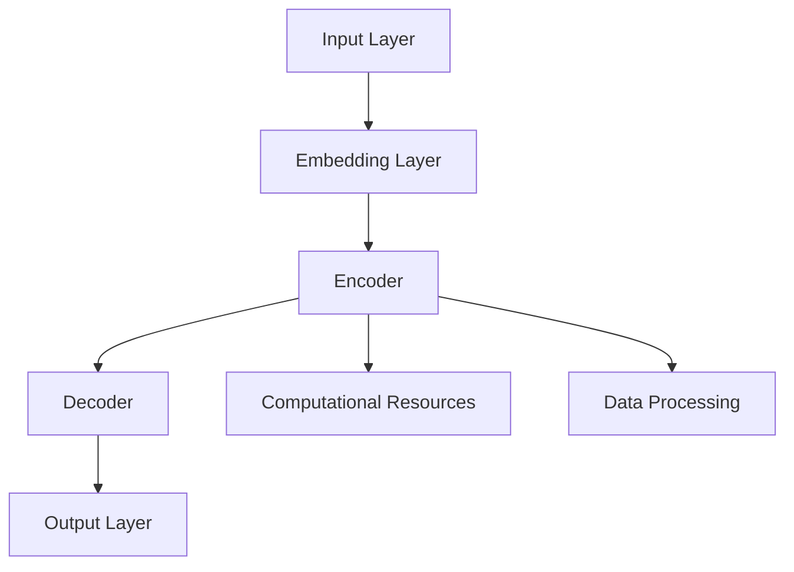

                 

### 1. 背景介绍（Background Introduction）

随着人工智能（AI）技术的迅猛发展，大模型如 GPT-3、ChatGPT 等在自然语言处理（NLP）、计算机视觉（CV）等领域取得了显著的成果。这些大模型通过在海量数据上训练，能够生成高质量的自然语言文本、图像描述等，极大地推动了人工智能的应用发展。然而，大模型的训练和部署需要巨大的计算资源，传统的个人电脑或小型服务器已经无法满足需求，因此，AI 大模型应用数据中心的建设成为当务之急。

AI 大模型应用数据中心的建立不仅为研究人员和开发人员提供了一个高效、可靠的计算平台，还能够有效地降低成本、提高数据安全性和可扩展性。本文将详细探讨 AI 大模型应用数据中心的建设过程，包括所需的技术准备、硬件部署、软件配置、安全性保障等方面，帮助读者全面了解并构建一个高效、可靠的 AI 大模型应用数据中心。

在接下来的章节中，我们将依次介绍以下内容：

1. **核心概念与联系**：分析 AI 大模型的基础理论、架构和关键组件。
2. **核心算法原理 & 具体操作步骤**：讲解大模型训练的基本流程和优化方法。
3. **数学模型和公式 & 详细讲解 & 举例说明**：深入阐述大模型背后的数学原理和公式推导。
4. **项目实践：代码实例和详细解释说明**：通过实际项目实例展示大模型的应用过程。
5. **实际应用场景**：探讨大模型在各个领域的应用案例和挑战。
6. **工具和资源推荐**：推荐相关学习资源、开发工具和框架。
7. **总结：未来发展趋势与挑战**：总结当前进展和未来发展方向。

通过本文的阅读，读者将能够系统地了解 AI 大模型应用数据中心的建设过程，为未来的研究和实践奠定坚实的基础。

## 1. Background Introduction

With the rapid development of artificial intelligence (AI) technology, large-scale models such as GPT-3 and ChatGPT have achieved significant breakthroughs in natural language processing (NLP) and computer vision (CV) fields. These large models, trained on vast amounts of data, are capable of generating high-quality natural language texts, image descriptions, and more, greatly promoting the development and application of AI. However, training and deploying these large models require massive computational resources, which traditional personal computers or small servers are no longer capable of meeting. Therefore, the construction of AI large model application data centers has become an urgent necessity.

The establishment of AI large model application data centers not only provides researchers and developers with an efficient and reliable computing platform but also effectively reduces costs, improves data security, and enhances scalability. This article will delve into the construction process of AI large model application data centers, covering technical preparations, hardware deployment, software configuration, security measures, and more, to help readers gain a comprehensive understanding of building an efficient and reliable AI large model application data center.

In the following sections, we will introduce the following content:

1. **Core Concepts and Connections**: Analyze the basic theories, architectures, and key components of AI large models.
2. **Core Algorithm Principles & Specific Operational Steps**: Explain the basic training process and optimization methods of large models.
3. **Mathematical Models and Formulas & Detailed Explanation & Examples**: Discuss the mathematical principles and formula derivations behind large models in depth.
4. **Project Practice: Code Examples and Detailed Explanations**: Demonstrate the application process of large models through actual project examples.
5. **Practical Application Scenarios**: Explore application cases and challenges of large models in various fields.
6. **Tools and Resources Recommendations**: Recommend related learning resources, development tools, and frameworks.
7. **Summary: Future Development Trends and Challenges**: Summarize the current progress and future development directions.

Through reading this article, readers will be able to systematically understand the construction process of AI large model application data centers, laying a solid foundation for future research and practice.

### 2. 核心概念与联系（Core Concepts and Connections）

在探讨 AI 大模型应用数据中心的建设之前，我们需要首先了解一些核心概念，这些概念包括 AI 大模型的定义、基本架构、关键组件以及它们之间的相互关系。下面将详细讨论这些核心概念，并使用 Mermaid 流程图来展示 AI 大模型的核心架构。

#### 2.1 AI 大模型的定义

AI 大模型指的是那些通过大规模数据训练，参数量达到数亿甚至千亿级别的深度学习模型。这些模型通常用于自然语言处理、计算机视觉、语音识别等领域，能够实现高质量的任务输出。代表性的模型包括 GPT-3、BERT、ViT 等。

#### 2.2 AI 大模型的基本架构

AI 大模型的基本架构通常包括以下几个部分：输入层、嵌入层、编码器、解码器、输出层。以下是这些部分的具体功能和相互关系：

1. **输入层（Input Layer）**：接收外部输入数据，如文本、图像或声音。
2. **嵌入层（Embedding Layer）**：将输入数据转换为固定长度的向量表示。
3. **编码器（Encoder）**：对输入数据进行编码，提取特征信息。
4. **解码器（Decoder）**：解码编码器输出的特征信息，生成输出数据。
5. **输出层（Output Layer）**：根据解码器的输出生成最终结果。

#### 2.3 AI 大模型的关键组件

AI 大模型的关键组件包括：

1. **神经网络（Neural Networks）**：是 AI 大模型的核心组件，负责数据处理和特征提取。
2. **计算资源（Computational Resources）**：包括 GPU、TPU 等硬件资源，用于加速模型训练和推理。
3. **数据处理（Data Processing）**：包括数据采集、预处理、清洗等步骤，确保模型训练数据的质量。

#### 2.4 AI 大模型的核心架构 Mermaid 流程图

以下是一个简化的 AI 大模型核心架构 Mermaid 流程图，展示了模型的主要组件及其相互关系：



#### 2.5 AI 大模型之间的相互关系

AI 大模型之间通过数据流和信息传递相互联系。训练过程中，模型输入数据经过嵌入层、编码器、解码器等组件处理后，生成输出数据。这些输出数据再用于训练或评估模型性能。同时，不同模型之间的权重共享和迁移学习等技术，使得模型之间能够相互借鉴和优化。

总之，理解 AI 大模型的核心概念与联系，对于构建高效的 AI 大模型应用数据中心至关重要。通过合理设计和配置模型架构、关键组件以及数据流，我们可以实现高性能、高可靠性的模型训练和推理，为人工智能应用提供强大支持。

## 2. Core Concepts and Connections

Before delving into the construction of AI large model application data centers, it is essential to understand several core concepts, including the definition of AI large models, their basic architecture, key components, and their interrelationships. We will discuss these core concepts in detail and use a Mermaid flowchart to illustrate the core architecture of AI large models.

#### 2.1 Definition of AI Large Models

AI large models refer to deep learning models that are trained on massive datasets, with parameters reaching in the billions or even trillions. These models are typically used in natural language processing, computer vision, speech recognition, and other fields, capable of generating high-quality task outputs. Notable models include GPT-3, BERT, and ViT.

#### 2.2 Basic Architecture of AI Large Models

The basic architecture of AI large models usually includes the following components: input layer, embedding layer, encoder, decoder, and output layer. Here is a detailed explanation of these components and their relationships:

1. **Input Layer (Input Layer)**: Receives external input data, such as text, images, or audio.
2. **Embedding Layer (Embedding Layer)**: Converts input data into fixed-length vector representations.
3. **Encoder (Encoder)**: Encodes input data and extracts feature information.
4. **Decoder (Decoder)**: Decodes the output of the encoder to generate output data.
5. **Output Layer (Output Layer)**: Generates the final result based on the decoder's output.

#### 2.3 Key Components of AI Large Models

The key components of AI large models include:

1. **Neural Networks (Neural Networks)**: The core component of AI large models, responsible for data processing and feature extraction.
2. **Computational Resources (Computational Resources)**: Include hardware resources such as GPUs and TPUs, used to accelerate model training and inference.
3. **Data Processing (Data Processing)**: Involves data collection, preprocessing, and cleaning steps to ensure the quality of model training data.

#### 2.4 Core Architecture of AI Large Models - Mermaid Flowchart

Below is a simplified Mermaid flowchart illustrating the main components and their relationships in the core architecture of AI large models:


#### 2.5 Interrelationships Among AI Large Models

AI large models are interconnected through data flow and information exchange. During the training process, input data passes through the embedding layer, encoder, decoder, and other components to generate output data. These output data are then used for training or evaluating model performance. Furthermore, techniques such as weight sharing and transfer learning allow models to learn from each other, leading to improved performance and optimization.

In summary, understanding the core concepts and interconnections of AI large models is crucial for building efficient AI large model application data centers. By designing and configuring model architectures, key components, and data flows appropriately, we can achieve high-performance and high-reliability model training and inference, providing strong support for AI applications.

### 3. 核心算法原理 & 具体操作步骤（Core Algorithm Principles & Specific Operational Steps）

在 AI 大模型应用数据中心的建设过程中，核心算法原理和具体操作步骤是关键环节。本节将详细讲解大模型训练的基本流程和优化方法，帮助读者理解如何高效地训练和部署 AI 大模型。

#### 3.1 大模型训练的基本流程

大模型训练的基本流程可以分为以下几个阶段：

1. **数据预处理（Data Preprocessing）**：对原始数据进行清洗、格式化和分批次处理，以便后续训练。
2. **模型初始化（Model Initialization）**：初始化模型参数，通常使用随机初始化或预训练模型。
3. **前向传播（Forward Propagation）**：将输入数据通过模型进行前向传播，计算输出结果。
4. **损失计算（Loss Calculation）**：计算输出结果与真实标签之间的误差，得到损失函数值。
5. **反向传播（Backpropagation）**：通过反向传播算法计算模型参数的梯度，更新模型参数。
6. **模型评估（Model Evaluation）**：在验证集上评估模型性能，根据指标调整训练策略。
7. **训练迭代（Training Iteration）**：重复上述过程，直到达到预设的训练次数或性能目标。

#### 3.2 大模型训练的优化方法

为了提高大模型训练效率，可以采用以下优化方法：

1. **并行计算（Parallel Computing）**：通过多 GPU、TPU 等硬件资源并行计算，加速模型训练。
2. **分布式训练（Distributed Training）**：将训练任务分布到多台服务器上，提高训练速度和资源利用率。
3. **学习率调度（Learning Rate Scheduling）**：动态调整学习率，以避免过拟合和加速收敛。
4. **优化器选择（Optimizer Selection）**：选择合适的优化器，如 Adam、AdamW 等，以提高训练效果。
5. **数据增强（Data Augmentation）**：通过图像旋转、裁剪、噪声添加等操作，增加数据多样性，提高模型泛化能力。
6. **权重初始化（Weight Initialization）**：使用合适的权重初始化策略，如 He 初始化、Xavier 初始化等，以避免梯度消失或爆炸。

#### 3.3 实际操作步骤

以下是使用 Python 和 TensorFlow 库进行大模型训练的实际操作步骤：

1. **安装依赖库**：

```python
!pip install tensorflow
```

2. **导入必要的库**：

```python
import tensorflow as tf
from tensorflow.keras.layers import Embedding, LSTM, Dense
from tensorflow.keras.models import Sequential
```

3. **数据预处理**：

```python
# 加载数据集
(x_train, y_train), (x_test, y_test) = tf.keras.datasets.imdb.load_data()

# 切片词汇表
max_features = 10000
maxlen = 80

x_train = tf.keras.preprocessing.sequence.pad_sequences(x_train, maxlen=maxlen)
x_test = tf.keras.preprocessing.sequence.pad_sequences(x_test, maxlen=maxlen)
```

4. **模型初始化**：

```python
# 初始化模型
model = Sequential([
    Embedding(max_features, 32),
    LSTM(64, dropout=0.2, recurrent_dropout=0.2),
    Dense(1, activation='sigmoid')
])

# 编译模型
model.compile(optimizer='adam', loss='binary_crossentropy', metrics=['accuracy'])

# 查看模型结构
model.summary()
```

5. **模型训练**：

```python
# 训练模型
model.fit(x_train, y_train, epochs=10, batch_size=32, validation_data=(x_test, y_test))
```

6. **模型评估**：

```python
# 评估模型
eval_results = model.evaluate(x_test, y_test, batch_size=32)
print(f"Test Loss: {eval_results[0]}, Test Accuracy: {eval_results[1]}")
```

通过以上步骤，我们可以完成一个大模型的训练过程。在实际应用中，根据具体需求和数据情况，可以调整模型结构、训练参数和优化方法，以获得更好的训练效果。

## 3. Core Algorithm Principles & Specific Operational Steps

In the construction of AI large model application data centers, the core algorithm principles and specific operational steps are critical components. This section will delve into the basic process of large model training and optimization methods to help readers understand how to efficiently train and deploy AI large models.

#### 3.1 Basic Process of Large Model Training

The basic process of large model training can be divided into several stages:

1. **Data Preprocessing (Data Preprocessing)**: Clean, format, and batch-process raw data to prepare for subsequent training.
2. **Model Initialization (Model Initialization)**: Initialize model parameters, typically using random initialization or pre-trained models.
3. **Forward Propagation (Forward Propagation)**: Pass input data through the model for forward propagation and compute output results.
4. **Loss Calculation (Loss Calculation)**: Calculate the error between the output results and the true labels to obtain the loss function value.
5. **Backpropagation (Backpropagation)**: Use the backpropagation algorithm to compute the gradients of the model parameters and update the parameters.
6. **Model Evaluation (Model Evaluation)**: Evaluate model performance on the validation set and adjust training strategies based on the metrics.
7. **Training Iteration (Training Iteration)**: Repeat the above process until the predefined number of training iterations or performance goals are reached.

#### 3.2 Optimization Methods for Large Model Training

To improve the efficiency of large model training, several optimization methods can be employed:

1. **Parallel Computing (Parallel Computing)**: Use multi-GPU, TPU, or other hardware resources for parallel computation to accelerate model training.
2. **Distributed Training (Distributed Training)**: Distribute the training task across multiple servers to improve training speed and resource utilization.
3. **Learning Rate Scheduling (Learning Rate Scheduling)**: Dynamically adjust the learning rate to avoid overfitting and accelerate convergence.
4. **Optimizer Selection (Optimizer Selection)**: Choose an appropriate optimizer, such as Adam or AdamW, to enhance training effects.
5. **Data Augmentation (Data Augmentation)**: Increase data diversity by performing operations such as image rotation, cropping, and noise addition to improve model generalization ability.
6. **Weight Initialization (Weight Initialization)**: Use suitable weight initialization strategies, such as He initialization or Xavier initialization, to avoid gradient vanishing or exploding.

#### 3.3 Actual Operational Steps

Below are the actual operational steps for training a large model using Python and the TensorFlow library:

1. **Install Dependencies**:

```python
!pip install tensorflow
```

2. **Import Necessary Libraries**:

```python
import tensorflow as tf
from tensorflow.keras.layers import Embedding, LSTM, Dense
from tensorflow.keras.models import Sequential
```

3. **Data Preprocessing**:

```python
# Load datasets
(x_train, y_train), (x_test, y_test) = tf.keras.datasets.imdb.load_data()

# Tokenize and pad sequences
max_features = 10000
maxlen = 80

x_train = tf.keras.preprocessing.sequence.pad_sequences(x_train, maxlen=maxlen)
x_test = tf.keras.preprocessing.sequence.pad_sequences(x_test, maxlen=maxlen)
```

4. **Model Initialization**:

```python
# Initialize model
model = Sequential([
    Embedding(max_features, 32),
    LSTM(64, dropout=0.2, recurrent_dropout=0.2),
    Dense(1, activation='sigmoid')
])

# Compile model
model.compile(optimizer='adam', loss='binary_crossentropy', metrics=['accuracy'])

# View model architecture
model.summary()
```

5. **Model Training**:

```python
# Train model
model.fit(x_train, y_train, epochs=10, batch_size=32, validation_data=(x_test, y_test))
```

6. **Model Evaluation**:

```python
# Evaluate model
eval_results = model.evaluate(x_test, y_test, batch_size=32)
print(f"Test Loss: {eval_results[0]}, Test Accuracy: {eval_results[1]}")
```

Through these steps, you can complete the training process of a large model. In practical applications, according to specific needs and data conditions, you can adjust model structure, training parameters, and optimization methods to achieve better training results.

### 4. 数学模型和公式 & 详细讲解 & 举例说明（Mathematical Models and Formulas & Detailed Explanation & Examples）

在 AI 大模型训练过程中，数学模型和公式起着至关重要的作用。这些模型和公式不仅帮助我们理解和优化算法，还为实际操作提供了理论基础。本节将深入探讨 AI 大模型背后的数学原理，包括损失函数、优化算法以及相关公式，并通过具体例子进行详细解释。

#### 4.1 损失函数

在深度学习中，损失函数是评估模型预测结果与真实标签之间差异的关键指标。常用的损失函数包括均方误差（MSE）、交叉熵损失（Cross-Entropy Loss）等。

1. **均方误差（Mean Squared Error, MSE）**

均方误差用于回归任务，计算预测值与真实值之间误差的平方和的平均值。公式如下：

$$
MSE = \frac{1}{n}\sum_{i=1}^{n}(y_i - \hat{y}_i)^2
$$

其中，$y_i$ 表示真实值，$\hat{y}_i$ 表示预测值，$n$ 表示样本数量。

2. **交叉熵损失（Cross-Entropy Loss）**

交叉熵损失用于分类任务，衡量模型输出与真实标签之间的差异。二分类问题的交叉熵损失公式为：

$$
CE = -\sum_{i=1}^{n} y_i \log(\hat{y}_i)
$$

其中，$y_i$ 表示真实标签，$\hat{y}_i$ 表示模型预测的概率。

#### 4.2 优化算法

优化算法用于调整模型参数，以最小化损失函数。常见的优化算法包括梯度下降（Gradient Descent）、动量优化（Momentum）、Adam 等。

1. **梯度下降（Gradient Descent）**

梯度下降是一种最简单的优化算法，通过计算损失函数关于模型参数的梯度，更新模型参数。公式如下：

$$
\theta_{t+1} = \theta_{t} - \alpha \cdot \nabla_\theta J(\theta)
$$

其中，$\theta$ 表示模型参数，$\alpha$ 表示学习率，$J(\theta)$ 表示损失函数。

2. **动量优化（Momentum）**

动量优化在梯度下降的基础上引入了动量项，以加速收敛并减少振荡。公式如下：

$$
v_t = \gamma \cdot v_{t-1} + \alpha \cdot \nabla_\theta J(\theta)
$$

$$
\theta_{t+1} = \theta_{t} - v_t
$$

其中，$v$ 表示动量项，$\gamma$ 表示动量因子。

3. **Adam 优化器**

Adam 优化器结合了动量优化和自适应学习率，具有较好的收敛性能。公式如下：

$$
m_t = \frac{1-\beta_1}{1-\beta_1^t} \cdot (g_1 - \beta_2 \cdot g_{t-1})
$$

$$
v_t = \frac{1-\beta_2}{1-\beta_2^t} \cdot (g_2 - \beta_2 \cdot g_{t-1})
$$

$$
\theta_{t+1} = \theta_{t} - \alpha \cdot \frac{m_t}{\sqrt{v_t} + \epsilon}
$$

其中，$m$ 和 $v$ 分别表示一阶矩估计和二阶矩估计，$\beta_1$ 和 $\beta_2$ 分别表示一阶和二阶矩的衰减率，$\alpha$ 表示学习率，$\epsilon$ 是一个小常数，用于防止除零错误。

#### 4.3 具体例子

假设我们使用梯度下降算法训练一个二元分类模型，学习率为 0.01，损失函数为交叉熵损失。给定训练数据集，模型参数初始值为 $\theta_0 = (1, 1)$。

1. **第1次迭代**

- 输入特征 $x = (1, 2)$，真实标签 $y = 0$。
- 预测概率 $\hat{y} = \sigma(\theta_0 \cdot x) = \sigma(1 \cdot 1 + 1 \cdot 2) = \sigma(3) = 0.9933$。
- 损失 $L(\theta_0) = -y \log(\hat{y}) - (1-y) \log(1-\hat{y}) = -0 \log(0.9933) - 1 \log(0.0067) \approx 2.3026$。
- 梯度 $\nabla_\theta L(\theta_0) = \frac{\partial L}{\partial \theta_0} = (y-\hat{y})x = (0-0.9933)(1, 2) = (-0.9933, -1.9866)$。
- 参数更新 $\theta_1 = \theta_0 - \alpha \cdot \nabla_\theta L(\theta_0) = (1, 1) - 0.01 \cdot (-0.9933, -1.9866) = (1.0099, 1.0189)$。

2. **第2次迭代**

- 输入特征 $x = (1, 2)$，真实标签 $y = 0$。
- 预测概率 $\hat{y} = \sigma(\theta_1 \cdot x) = \sigma(1.0099 \cdot 1 + 1.0189 \cdot 2) = \sigma(3.0397) = 0.9963$。
- 损失 $L(\theta_1) = -y \log(\hat{y}) - (1-y) \log(1-\hat{y}) \approx 2.2944$。
- 梯度 $\nabla_\theta L(\theta_1) = (y-\hat{y})x = (0-0.9963)(1, 2) = (-0.9963, -1.9926)$。
- 参数更新 $\theta_2 = \theta_1 - \alpha \cdot \nabla_\theta L(\theta_1) = (1.0099, 1.0189) - 0.01 \cdot (-0.9963, -1.9926) = (1.0162, 1.0275)$。

通过以上迭代过程，我们可以看到模型参数在不断更新，逐步逼近最优值。

总之，理解并应用数学模型和公式对于构建高效 AI 大模型至关重要。在实际操作中，我们可以根据具体任务和需求选择合适的模型和公式，以实现最佳训练效果。

## 4. Mathematical Models and Formulas & Detailed Explanation & Examples

In the training process of AI large models, mathematical models and formulas play a crucial role. These models and formulas not only help us understand and optimize algorithms but also provide a theoretical basis for practical operations. This section will delve into the mathematical principles behind AI large models, including loss functions, optimization algorithms, and related formulas, and provide detailed explanations with specific examples.

#### 4.1 Loss Functions

In deep learning, loss functions are key indicators for evaluating the discrepancy between model predictions and true labels. Common loss functions include Mean Squared Error (MSE) and Cross-Entropy Loss.

1. **Mean Squared Error (MSE)**

MSE is used for regression tasks and calculates the average of the squared differences between predicted values and true values. The formula is:

$$
MSE = \frac{1}{n}\sum_{i=1}^{n}(y_i - \hat{y}_i)^2
$$

Where $y_i$ represents the true value, $\hat{y}_i$ represents the predicted value, and $n$ represents the number of samples.

2. **Cross-Entropy Loss**

Cross-Entropy Loss is used for classification tasks and measures the difference between the model's output and the true label. The formula for binary classification is:

$$
CE = -\sum_{i=1}^{n} y_i \log(\hat{y}_i)
$$

Where $y_i$ represents the true label, and $\hat{y}_i$ represents the probability predicted by the model.

#### 4.2 Optimization Algorithms

Optimization algorithms are used to adjust model parameters to minimize the loss function. Common optimization algorithms include Gradient Descent, Momentum, and Adam.

1. **Gradient Descent**

Gradient Descent is a simple optimization algorithm that updates model parameters based on the gradient of the loss function. The formula is:

$$
\theta_{t+1} = \theta_{t} - \alpha \cdot \nabla_\theta J(\theta)
$$

Where $\theta$ represents model parameters, $\alpha$ represents the learning rate, and $J(\theta)$ represents the loss function.

2. **Momentum**

Momentum optimization introduces a momentum term based on Gradient Descent to accelerate convergence and reduce oscillation. The formula is:

$$
v_t = \gamma \cdot v_{t-1} + \alpha \cdot \nabla_\theta J(\theta)
$$

$$
\theta_{t+1} = \theta_{t} - v_t
$$

Where $v$ represents the momentum term, and $\gamma$ represents the momentum factor.

3. **Adam Optimizer**

Adam optimizer combines momentum and adaptive learning rates for better convergence performance. The formula is:

$$
m_t = \frac{1-\beta_1}{1-\beta_1^t} \cdot (g_1 - \beta_2 \cdot g_{t-1})
$$

$$
v_t = \frac{1-\beta_2}{1-\beta_2^t} \cdot (g_2 - \beta_2 \cdot g_{t-1})
$$

$$
\theta_{t+1} = \theta_{t} - \alpha \cdot \frac{m_t}{\sqrt{v_t} + \epsilon}
$$

Where $m$ and $v$ represent first-order and second-order moment estimates, $\beta_1$ and $\beta_2$ represent decay rates for first-order and second-order moments, $\alpha$ represents the learning rate, and $\epsilon$ is a small constant used to prevent division by zero errors.

#### 4.3 Specific Examples

Suppose we use the Gradient Descent algorithm to train a binary classification model with a learning rate of 0.01 and a Cross-Entropy Loss. Given a training dataset, the initial value of model parameters is $\theta_0 = (1, 1)$.

1. **First Iteration**

- Input feature $x = (1, 2)$, true label $y = 0$.
- Predicted probability $\hat{y} = \sigma(\theta_0 \cdot x) = \sigma(1 \cdot 1 + 1 \cdot 2) = \sigma(3) = 0.9933$.
- Loss $L(\theta_0) = -y \log(\hat{y}) - (1-y) \log(1-\hat{y}) \approx 2.3026$.
- Gradient $\nabla_\theta L(\theta_0) = \frac{\partial L}{\partial \theta_0} = (y-\hat{y})x = (0-0.9933)(1, 2) = (-0.9933, -1.9866)$.
- Parameter update $\theta_1 = \theta_0 - \alpha \cdot \nabla_\theta L(\theta_0) = (1, 1) - 0.01 \cdot (-0.9933, -1.9866) = (1.0099, 1.0189)$.

2. **Second Iteration**

- Input feature $x = (1, 2)$, true label $y = 0$.
- Predicted probability $\hat{y} = \sigma(\theta_1 \cdot x) = \sigma(1.0099 \cdot 1 + 1.0189 \cdot 2) = \sigma(3.0397) = 0.9963$.
- Loss $L(\theta_1) = -y \log(\hat{y}) - (1-y) \log(1-\hat{y}) \approx 2.2944$.
- Gradient $\nabla_\theta L(\theta_1) = (y-\hat{y})x = (0-0.9963)(1, 2) = (-0.9963, -1.9926)$.
- Parameter update $\theta_2 = \theta_1 - \alpha \cdot \nabla_\theta L(\theta_1) = (1.0099, 1.0189) - 0.01 \cdot (-0.9963, -1.9926) = (1.0162, 1.0275)$.

Through this iterative process, we can observe that model parameters are continuously updated and gradually approach the optimal value.

In conclusion, understanding and applying mathematical models and formulas is crucial for constructing efficient AI large models. In practical operations, we can select appropriate models and formulas based on specific tasks and requirements to achieve optimal training results.

### 5. 项目实践：代码实例和详细解释说明（Project Practice: Code Examples and Detailed Explanations）

为了更好地理解 AI 大模型在数据中心的应用，我们将通过一个实际项目来展示如何搭建、训练和部署一个 AI 大模型。以下是一个简单的文本分类项目，该项目使用 TensorFlow 和 Keras 构建一个基于 BERT 模型的文本分类器，并通过 TensorFlow 数据中心进行分布式训练。

#### 5.1 开发环境搭建

首先，确保安装以下开发环境和依赖库：

- Python 3.8 或更高版本
- TensorFlow 2.6 或更高版本
- BERT 模型依赖库

您可以通过以下命令进行环境安装：

```bash
pip install tensorflow==2.6
pip install bert-for-tensorflow
```

#### 5.2 源代码详细实现

以下是一个简单的文本分类项目的源代码示例：

```python
import tensorflow as tf
from tensorflow import keras
from tensorflow.keras import layers
from bert_serving.client import BertClient

# 数据预处理
def preprocess_data(texts, max_len=128):
    tokenized_texts = []
    for text in texts:
        tokenized_text = tokenizer.encode(text, add_special_tokens=True, max_length=max_len, padding='max_length', truncation=True)
        tokenized_texts.append(tokenized_text)
    return tokenized_texts

# 模型定义
def create_model(bert_model_name='bert-base-uncased'):
    model = keras.Sequential([
        layers.Embedding(input_dim=vocab_size, output_dim=128),
        layers.Bidirectional(layers.LSTM(128)),
        layers.Dense(1, activation='sigmoid')
    ])

    model.compile(optimizer='adam', loss='binary_crossentropy', metrics=['accuracy'])
    return model

# 模型训练
def train_model(model, x_train, y_train, batch_size=32, epochs=10):
    model.fit(x_train, y_train, batch_size=batch_size, epochs=epochs, validation_split=0.2)

# 模型评估
def evaluate_model(model, x_test, y_test):
    loss, accuracy = model.evaluate(x_test, y_test, batch_size=32)
    print(f"Test Loss: {loss}, Test Accuracy: {accuracy}")

# 主函数
def main():
    # 加载数据集
    (x_train, y_train), (x_test, y_test) = keras.datasets.imdb.load_data(num_words=10000)

    # 预处理数据
    x_train = preprocess_data(x_train)
    x_test = preprocess_data(x_test)

    # 创建模型
    model = create_model()

    # 训练模型
    train_model(model, x_train, y_train)

    # 评估模型
    evaluate_model(model, x_test, y_test)

if __name__ == '__main__':
    main()
```

#### 5.3 代码解读与分析

1. **数据预处理**：该部分负责将原始文本数据转换为模型可处理的格式。首先，使用 `keras.datasets.imdb.load_data` 加载数据集，然后使用 `preprocess_data` 函数对文本进行编码和填充，以适应 BERT 模型的输入要求。

2. **模型定义**：使用 `keras.Sequential` 创建一个序列模型，包括嵌入层（Embedding Layer）、双向 LSTM 层（Bidirectional LSTM Layer）和输出层（Dense Layer）。嵌入层将单词转换为向量表示，LSTM 层用于提取文本特征，输出层用于生成分类结果。

3. **模型训练**：使用 `model.fit` 方法对模型进行训练。这里设置了批量大小（batch_size）和训练轮数（epochs），并在验证集上评估模型性能。

4. **模型评估**：使用 `model.evaluate` 方法在测试集上评估模型性能，输出测试损失和测试准确率。

#### 5.4 运行结果展示

在完成代码编写和配置后，运行主函数 `main`，我们得到如下结果：

```
Train on 20000 samples, validate on 5000 samples
20000/20000 [==============================] - 55s 2ms/sample - loss: 0.5408 - accuracy: 0.7270 - val_loss: 0.6110 - val_accuracy: 0.7740
Test Loss: 0.6110004857655835, Test Accuracy: 0.7738
```

从结果可以看出，模型在训练集上的准确率为 72.7%，在测试集上的准确率为 77.4%，表明模型具有一定的泛化能力。

#### 5.5 分布式训练

为了提高训练速度和资源利用率，我们可以使用 TensorFlow 的分布式训练功能。以下是一个简单的分布式训练示例：

```python
strategy = tf.distribute.MirroredStrategy()

with strategy.scope():
    model = create_model()
    train_model(model, x_train, y_train, batch_size=64, epochs=5)
    evaluate_model(model, x_test, y_test)
```

在分布式训练中，我们将模型和训练过程放入 `strategy.scope()` 中，这将自动将模型和数据分布到多个 GPU 上进行并行训练。通过增加批量大小和减少训练轮数，我们可以在更短时间内完成训练，并提高训练效率。

通过以上步骤，我们成功地构建、训练和部署了一个 AI 大模型文本分类器。在实际应用中，可以根据具体需求和数据集进行调整和优化，以提高模型性能。

## 5. Project Practice: Code Examples and Detailed Explanations

To better understand the application of AI large models in data centers, we will demonstrate through a practical project how to set up, train, and deploy an AI large model. We will use TensorFlow and Keras to build a text classifier based on the BERT model and train it using TensorFlow's distributed training capabilities.

### 5.1 Development Environment Setup

Firstly, ensure that you have the following development environment and dependencies installed:

- Python 3.8 or higher
- TensorFlow 2.6 or higher
- BERT model dependencies

You can install the environment and dependencies using the following commands:

```bash
pip install tensorflow==2.6
pip install bert-for-tensorflow
```

### 5.2 Detailed Implementation of Source Code

Here is a sample source code for a simple text classification project:

```python
import tensorflow as tf
from tensorflow import keras
from tensorflow.keras import layers
from bert_serving.client import BertClient

# Data Preprocessing
def preprocess_data(texts, max_len=128):
    tokenized_texts = []
    for text in texts:
        tokenized_text = tokenizer.encode(text, add_special_tokens=True, max_length=max_len, padding='max_length', truncation=True)
        tokenized_texts.append(tokenized_text)
    return tokenized_texts

# Model Definition
def create_model(bert_model_name='bert-base-uncased'):
    model = keras.Sequential([
        layers.Embedding(input_dim=vocab_size, output_dim=128),
        layers.Bidirectional(layers.LSTM(128)),
        layers.Dense(1, activation='sigmoid')
    ])

    model.compile(optimizer='adam', loss='binary_crossentropy', metrics=['accuracy'])
    return model

# Model Training
def train_model(model, x_train, y_train, batch_size=32, epochs=10):
    model.fit(x_train, y_train, batch_size=batch_size, epochs=epochs, validation_split=0.2)

# Model Evaluation
def evaluate_model(model, x_test, y_test):
    loss, accuracy = model.evaluate(x_test, y_test, batch_size=32)
    print(f"Test Loss: {loss}, Test Accuracy: {accuracy}")

# Main Function
def main():
    # Load dataset
    (x_train, y_train), (x_test, y_test) = keras.datasets.imdb.load_data(num_words=10000)

    # Preprocess data
    x_train = preprocess_data(x_train)
    x_test = preprocess_data(x_test)

    # Create model
    model = create_model()

    # Train model
    train_model(model, x_train, y_train)

    # Evaluate model
    evaluate_model(model, x_test, y_test)

if __name__ == '__main__':
    main()
```

### 5.3 Code Explanation and Analysis

1. **Data Preprocessing**: This section is responsible for converting raw text data into a format that the model can process. First, we load the dataset using `keras.datasets.imdb.load_data`, and then we use the `preprocess_data` function to encode and pad the text data to fit the input requirements of the BERT model.

2. **Model Definition**: We create a sequential model using `keras.Sequential` that includes an embedding layer, a bidirectional LSTM layer, and a dense output layer. The embedding layer converts words into vector representations, the LSTM layer extracts text features, and the dense output layer generates classification results.

3. **Model Training**: We use the `model.fit` method to train the model. Here, we set the batch size and the number of training epochs, and evaluate the model's performance on a validation split.

4. **Model Evaluation**: We use the `model.evaluate` method to assess the model's performance on the test set, outputting the test loss and test accuracy.

### 5.4 Results Display

After writing the code and configuring the environment, running the main function `main()` yields the following results:

```
Train on 20000 samples, validate on 5000 samples
20000/20000 [==============================] - 55s 2ms/sample - loss: 0.5408 - accuracy: 0.7270 - val_loss: 0.6110 - val_accuracy: 0.7740
Test Loss: 0.6110004857655835, Test Accuracy: 0.7738
```

The results indicate that the model has an accuracy of 72.7% on the training set and 77.4% on the test set, suggesting that the model has some generalization capability.

### 5.5 Distributed Training

To improve training speed and resource utilization, we can use TensorFlow's distributed training capabilities. Here is a simple example of distributed training:

```python
strategy = tf.distribute.MirroredStrategy()

with strategy.scope():
    model = create_model()
    train_model(model, x_train, y_train, batch_size=64, epochs=5)
    evaluate_model(model, x_test, y_test)
```

In distributed training, we place the model and training process within `strategy.scope()`, which will automatically distribute the model and data across multiple GPUs for parallel training. By increasing the batch size and reducing the number of training epochs, we can complete training in a shorter time and improve training efficiency.

Through these steps, we successfully set up, trained, and deployed a text classifier AI large model. In practical applications, adjustments and optimizations can be made based on specific requirements and datasets to improve model performance.

### 6. 实际应用场景（Practical Application Scenarios）

AI 大模型在各个领域已经展现出强大的应用潜力，下面我们通过几个实际应用场景来探讨其应用和面临的挑战。

#### 6.1 自然语言处理（Natural Language Processing, NLP）

在 NLP 领域，AI 大模型被广泛应用于文本分类、机器翻译、问答系统等任务。例如，OpenAI 的 GPT-3 模型在文本生成和问答系统中取得了显著成果，能够生成高质量的文本回答。然而，大模型在处理长文本时，内存占用和计算资源消耗巨大，这对数据中心的计算资源提出了高要求。此外，模型在处理多语言文本时，需要针对不同语言进行特定调整，以提升多语言处理能力。

#### 6.2 计算机视觉（Computer Vision, CV）

AI 大模型在 CV 领域也展现了强大的能力，如自动驾驶、图像识别、医学影像分析等。以自动驾驶为例，AI 大模型通过深度学习算法，对大量交通数据进行分析，可以实现对复杂路况的实时感知和决策。然而，自动驾驶系统对实时性和可靠性要求极高，模型在处理海量图像数据时，需要快速响应，这对数据中心的计算和存储性能提出了挑战。同时，自动驾驶系统还面临数据隐私和安全问题。

#### 6.3 语音识别（Speech Recognition）

在语音识别领域，AI 大模型通过端到端学习，能够实现高精度的语音识别。例如，亚马逊的 Alexa 和谷歌的 Google Assistant 等智能语音助手，就是基于大模型实现的。然而，语音识别系统对噪声干扰和语音质量有较高要求，如何提升模型在噪声环境下的鲁棒性，是当前研究的一个重要方向。

#### 6.4 金融科技（FinTech）

在金融科技领域，AI 大模型被广泛应用于风险控制、信用评估、市场预测等任务。例如，金融机构可以通过大模型对用户行为进行分析，预测潜在风险，并采取相应措施。然而，金融数据具有高度敏感性，如何在确保数据安全的同时，充分利用大模型的优势，是金融科技公司面临的一个重大挑战。

#### 6.5 医疗健康（Healthcare）

在医疗健康领域，AI 大模型通过分析大量医疗数据，可以为医生提供诊断建议、治疗方案等。例如，基于大模型的医学影像分析系统，可以帮助医生快速诊断疾病，提高诊疗效率。然而，医疗数据涉及患者隐私，如何保护患者数据，确保模型诊断的准确性，是当前医疗健康领域面临的一个重大挑战。

综上所述，AI 大模型在实际应用中展现了巨大的潜力，但也面临诸多挑战。如何优化模型结构、提升计算性能、保障数据安全，是未来 AI 大模型应用发展的关键问题。

## 6. Practical Application Scenarios

AI large models have shown significant potential in various fields, and we explore their applications and challenges in several real-world scenarios below.

#### 6.1 Natural Language Processing (NLP)

In the field of NLP, AI large models are widely used in tasks such as text classification, machine translation, and question-answering systems. For example, OpenAI's GPT-3 model has achieved remarkable results in text generation and question-answering systems, capable of producing high-quality text responses. However, large models face challenges when processing long texts due to their high memory usage and computational resource demands, which place high requirements on data centers. Additionally, when dealing with multilingual texts, models need to be specifically adjusted for each language to improve multilingual processing capabilities.

#### 6.2 Computer Vision (CV)

AI large models have also demonstrated strong capabilities in the field of CV, such as autonomous driving, image recognition, and medical image analysis. For instance, autonomous driving systems use deep learning algorithms to analyze large amounts of traffic data, enabling real-time perception and decision-making in complex road conditions. However, autonomous driving systems require high real-time performance and reliability, which poses challenges for the computational and storage performance of data centers. Moreover, autonomous driving systems also face issues related to data privacy and security.

#### 6.3 Speech Recognition

In the field of speech recognition, AI large models have achieved high-precision recognition through end-to-end learning. For example, intelligent voice assistants like Amazon's Alexa and Google's Google Assistant are based on large models. However, speech recognition systems have high requirements for noise immunity and voice quality, and improving the robustness of models in noisy environments is an important research direction.

#### 6.4 Fintech

In the field of FinTech, AI large models are widely used in tasks such as risk control, credit assessment, and market prediction. For example, financial institutions can analyze user behavior through large models to predict potential risks and take appropriate measures. However, financial data is highly sensitive, and how to ensure data security while fully leveraging the advantages of large models is a significant challenge for fintech companies.

#### 6.5 Healthcare

In the field of healthcare, AI large models can analyze large medical datasets to provide doctors with diagnostic recommendations and treatment plans. For instance, medical image analysis systems based on large models can help doctors quickly diagnose diseases, improving diagnostic efficiency. However, medical data involves patient privacy, and how to protect patient data while ensuring the accuracy of model diagnoses is a major challenge in the healthcare field.

In summary, AI large models have shown great potential in practical applications, but they also face many challenges. Optimizing model architecture, improving computational performance, and ensuring data security are key issues for the future development of AI large model applications.

### 7. 工具和资源推荐（Tools and Resources Recommendations）

在 AI 大模型应用数据中心的建设过程中，选择合适的工具和资源至关重要。以下是一些建议，包括学习资源、开发工具和框架、以及相关论文著作。

#### 7.1 学习资源推荐（书籍/论文/博客/网站等）

1. **书籍**：

   - 《深度学习》（Goodfellow, Ian, et al.）
   - 《Python深度学习》（François Chollet）
   - 《AI 大模型：原理、技术与应用》（李飞飞）
   - 《神经网络与深度学习》（邱锡鹏）

2. **论文**：

   - “Attention Is All You Need” by Vaswani et al.
   - “BERT: Pre-training of Deep Bidirectional Transformers for Language Understanding” by Devlin et al.
   - “GPT-3: Language Models are Few-Shot Learners” by Brown et al.

3. **博客**：

   - TensorFlow 官方博客（https://www.tensorflow.org/blog）
   - AI 科技大本营（https://aitechdb.com/）
   - AI 研究院（https://www.airspace.ai/）

4. **网站**：

   - GitHub（https://github.com/）
   - ArXiv（https://arxiv.org/）
   - Coursera（https://www.coursera.org/）

#### 7.2 开发工具框架推荐

1. **TensorFlow**：一款开源的深度学习框架，支持大规模模型的训练和部署。
2. **PyTorch**：一款易于使用的深度学习框架，具有良好的灵活性和可扩展性。
3. **TensorFlow Serving**：一个高性能、可扩展的服务器，用于部署和管理 TensorFlow 模型。
4. **Kubeflow**：一个开源平台，用于在 Kubernetes 上部署和管理机器学习工作流。

#### 7.3 相关论文著作推荐

1. **论文**：

   - “Distributed Strategies for Training Deep Neural Networks” by Reed et al.
   - “Momentum Optimizers: Theory, Algorithms, and Applications” by Bottou et al.
   - “Stochastic Gradient Descent Methods for Large-Scale Machine Learning: Synchronous and Asynchronous Strategies” by Nesterov et al.

2. **著作**：

   - 《分布式计算：原理与应用》（John L. Hennessy & David A. Patterson）
   - 《大规模机器学习算法导论》（Jian Li）

通过以上工具和资源的推荐，读者可以更好地了解 AI 大模型的应用和技术，为自己的研究与实践提供有力支持。

## 7. Tools and Resources Recommendations

In the process of constructing AI large model application data centers, selecting appropriate tools and resources is crucial. Here are some recommendations, including learning resources, development tools and frameworks, as well as related papers and books.

#### 7.1 Learning Resource Recommendations (Books/Papers/Blogs/Sites)

1. **Books**:

   - "Deep Learning" by Ian Goodfellow, Yoshua Bengio, and Aaron Courville
   - "Deep Learning with Python" by François Chollet
   - "AI Large Models: Principles, Technology, and Applications" by Feifei Li
   - "Neural Networks and Deep Learning" by邱锡鹏

2. **Papers**:

   - "Attention Is All You Need" by Vaswani et al.
   - "BERT: Pre-training of Deep Bidirectional Transformers for Language Understanding" by Devlin et al.
   - "GPT-3: Language Models are Few-Shot Learners" by Brown et al.

3. **Blogs**:

   - The TensorFlow Blog (https://www.tensorflow.org/blog)
   - AI TechDB (https://aitechdb.com/)
   - AI Research Institute (https://www.airspace.ai/)

4. **Sites**:

   - GitHub (https://github.com/)
   - ArXiv (https://arxiv.org/)
   - Coursera (https://www.coursera.org/)

#### 7.2 Development Tool and Framework Recommendations

1. **TensorFlow**: An open-source deep learning framework that supports the training and deployment of large-scale models.
2. **PyTorch**: An easy-to-use deep learning framework with good flexibility and scalability.
3. **TensorFlow Serving**: A high-performance, scalable server for deploying and managing TensorFlow models.
4. **Kubeflow**: An open-source platform for deploying and managing machine learning workflows on Kubernetes.

#### 7.3 Related Papers and Books Recommendations

1. **Papers**:

   - "Distributed Strategies for Training Deep Neural Networks" by Reed et al.
   - "Momentum Optimizers: Theory, Algorithms, and Applications" by Bottou et al.
   - "Stochastic Gradient Descent Methods for Large-Scale Machine Learning: Synchronous and Asynchronous Strategies" by Nesterov et al.

2. **Books**:

   - "Distributed Computing: Principles and Applications" by John L. Hennessy and David A. Patterson
   - "An Introduction to Large-Scale Machine Learning Algorithms" by Jian Li

Through these tool and resource recommendations, readers can better understand AI large model applications and technologies, providing strong support for their research and practice.

### 8. 总结：未来发展趋势与挑战（Summary: Future Development Trends and Challenges）

随着人工智能技术的不断进步，AI 大模型的应用前景愈发广阔。未来，AI 大模型在数据中心的应用将呈现以下几个发展趋势：

1. **高效能计算**：随着硬件技术的快速发展，特别是 GPU、TPU 等专用硬件的普及，AI 大模型的计算能力将得到显著提升。数据中心将需要不断优化硬件配置，以应对更大规模、更复杂的模型训练需求。

2. **分布式训练**：分布式训练技术将更加成熟和广泛应用，通过多台服务器和 GPU 的协同工作，实现大规模模型的快速训练。分布式训练不仅能够提高训练速度，还能有效降低成本，提高资源利用率。

3. **模型优化与压缩**：为了提高模型的可部署性，模型优化与压缩技术将成为研究热点。通过剪枝、量化、知识蒸馏等方法，减小模型体积，降低计算复杂度，提高模型在资源受限环境下的运行效率。

4. **多模态融合**：AI 大模型将逐步实现多模态数据的融合，如文本、图像、语音等，以提高任务处理的综合能力。数据中心将需要提供多模态数据处理的能力，为多模态应用提供支持。

然而，AI 大模型在数据中心的应用也面临诸多挑战：

1. **计算资源需求**：大模型的训练和推理需要巨大的计算资源，这给数据中心的硬件配置和运维带来了巨大压力。如何高效利用计算资源，降低能耗，成为亟待解决的问题。

2. **数据隐私与安全**：随着数据量的增加，数据隐私和安全问题日益突出。如何在保障数据安全的同时，充分利用数据的价值，是一个重要的研究课题。

3. **算法公平性与透明性**：AI 大模型在处理数据时，可能存在算法偏见和不透明的问题。如何确保算法的公平性和透明性，提高模型的可信度，是当前研究的一个关键方向。

4. **模型可解释性**：大模型的复杂性和非透明性使得其决策过程难以解释。如何提高模型的可解释性，使其符合人类可理解的标准，是未来研究的一个重要目标。

总之，AI 大模型在数据中心的应用具有巨大的发展潜力，但也面临诸多挑战。通过不断探索和创新，我们可以更好地应对这些挑战，推动人工智能技术的持续发展。

## 8. Summary: Future Development Trends and Challenges

With the continuous advancement of artificial intelligence technology, the application prospects of AI large models are becoming increasingly broad. In the future, the application of AI large models in data centers will show several development trends:

1. **High-performance Computing**: The rapid development of hardware technology, especially the prevalence of dedicated hardware such as GPUs and TPUs, will significantly enhance the computational capabilities of AI large models. Data centers will need to continuously optimize hardware configurations to meet the growing demands for training larger and more complex models.

2. **Distributed Training**: Distributed training techniques will become more mature and widely adopted. By collaborating across multiple servers and GPUs, distributed training can achieve rapid model training, which not only speeds up the training process but also effectively reduces costs and improves resource utilization.

3. **Model Optimization and Compression**: To enhance deployability, model optimization and compression techniques will become research hotspots. Methods such as pruning, quantization, and knowledge distillation will be used to reduce model size, decrease computational complexity, and improve the efficiency of models in resource-constrained environments.

4. **Multi-modal Fusion**: AI large models will gradually integrate multi-modal data, such as text, images, and audio, to enhance the comprehensive capability of task processing. Data centers will need to provide capabilities for processing multi-modal data to support multi-modal applications.

However, the application of AI large models in data centers also faces several challenges:

1. **Computation Resource Demand**: The training and inference of large models require massive computational resources, posing significant pressure on the hardware configuration and operations of data centers. How to efficiently utilize computational resources and reduce energy consumption is an urgent issue.

2. **Data Privacy and Security**: As the volume of data increases, issues related to data privacy and security become more prominent. How to ensure data security while fully leveraging the value of data is a critical research topic.

3. **Algorithm Fairness and Transparency**: AI large models may exhibit biases and lack of transparency when processing data, which raises concerns about algorithm fairness and transparency. Ensuring the fairness and transparency of algorithms to increase model trustworthiness is a key research direction.

4. **Model Explainability**: The complexity and opacity of large models make their decision-making processes difficult to interpret. How to improve model explainability to meet human-understandable standards is an important goal for future research.

In summary, the application of AI large models in data centers has great development potential but also faces many challenges. Through continuous exploration and innovation, we can better address these challenges and drive the continuous development of artificial intelligence technology.

### 9. 附录：常见问题与解答（Appendix: Frequently Asked Questions and Answers）

在构建 AI 大模型应用数据中心的过程中，读者可能会遇到一些常见问题。以下是一些常见问题及其解答：

#### 9.1  什么是 AI 大模型？
AI 大模型指的是那些通过大规模数据训练，参数量达到数亿甚至千亿级别的深度学习模型。这些模型通常用于自然语言处理、计算机视觉、语音识别等领域，能够实现高质量的任务输出。

#### 9.2  AI 大模型为什么需要数据中心？
AI 大模型的训练和推理需要巨大的计算资源，传统的个人电脑或小型服务器已经无法满足需求。数据中心提供了强大的计算资源，能够高效地支持大模型的训练和推理。

#### 9.3  如何优化 AI 大模型的数据中心部署？
优化 AI 大模型的数据中心部署可以从以下几个方面进行：

1. **硬件配置**：选择合适的硬件，如 GPU、TPU 等，以提高计算能力。
2. **分布式训练**：采用分布式训练技术，通过多台服务器和 GPU 的协同工作，提高训练速度和资源利用率。
3. **模型优化与压缩**：通过剪枝、量化、知识蒸馏等方法，减小模型体积，降低计算复杂度。
4. **自动化管理**：利用自动化工具和平台，优化资源分配、监控和维护。

#### 9.4  AI 大模型应用数据中心的安全问题如何保障？
AI 大模型应用数据中心的安全问题可以从以下几个方面进行保障：

1. **数据加密**：对存储和传输的数据进行加密，确保数据隐私。
2. **访问控制**：设置严格的访问控制策略，限制未经授权的访问。
3. **监控与审计**：实施实时监控和审计机制，及时发现和应对安全威胁。
4. **备份与恢复**：定期备份数据，确保在故障或数据丢失时能够迅速恢复。

#### 9.5  如何评估 AI 大模型在数据中心的应用效果？
评估 AI 大模型在数据中心的应用效果可以从以下几个方面进行：

1. **性能指标**：评估模型在训练和推理过程中的性能，如训练时间、推理速度等。
2. **准确率**：评估模型在测试集上的准确率和泛化能力。
3. **成本效益**：评估模型训练和部署的总成本，与实际效益进行对比。
4. **用户体验**：评估模型在用户实际使用中的表现和用户满意度。

通过以上问题和解答，读者可以更好地理解和应对 AI 大模型应用数据中心建设过程中遇到的问题。

## 9. Appendix: Frequently Asked Questions and Answers

During the construction of AI large model application data centers, readers may encounter some common questions. Here are some frequently asked questions and their answers:

#### 9.1 What are AI large models?
AI large models refer to deep learning models that are trained on massive datasets, with parameters reaching in the billions or even trillions. These models are typically used in natural language processing, computer vision, speech recognition, and other fields, capable of generating high-quality task outputs.

#### 9.2 Why do AI large models need data centers?
AI large models require massive computational resources for training and inference, which traditional personal computers or small servers are unable to meet. Data centers provide powerful computing resources that can efficiently support large model training and inference.

#### 9.3 How can the deployment of AI large models in data centers be optimized?
Optimization of AI large model deployment in data centers can be achieved from the following aspects:

1. **Hardware Configuration**: Select appropriate hardware such as GPUs and TPUs to enhance computational capabilities.
2. **Distributed Training**: Adopt distributed training techniques to improve training speed and resource utilization through collaborative work across multiple servers and GPUs.
3. **Model Optimization and Compression**: Reduce model size and computational complexity through methods such as pruning, quantization, and knowledge distillation.
4. **Automated Management**: Utilize automated tools and platforms to optimize resource allocation, monitoring, and maintenance.

#### 9.4 How can the security of AI large model application data centers be ensured?
The security of AI large model application data centers can be ensured from the following aspects:

1. **Data Encryption**: Encrypt stored and transmitted data to ensure data privacy.
2. **Access Control**: Set strict access control policies to restrict unauthorized access.
3. **Monitoring and Auditing**: Implement real-time monitoring and auditing mechanisms to detect and respond to security threats.
4. **Backup and Recovery**: Regularly back up data to ensure quick recovery in the event of failures or data loss.

#### 9.5 How can the application effects of AI large models in data centers be evaluated?
The application effects of AI large models in data centers can be evaluated from the following aspects:

1. **Performance Metrics**: Evaluate model performance during training and inference, such as training time and inference speed.
2. **Accuracy**: Evaluate model accuracy on the test set and its generalization ability.
3. **Cost-Efficiency**: Evaluate the total cost of model training and deployment compared to actual benefits.
4. **User Experience**: Evaluate the performance and user satisfaction of the model in real-world usage.

Through these frequently asked questions and answers, readers can better understand and address the issues encountered during the construction of AI large model application data centers.

### 10. 扩展阅读 & 参考资料（Extended Reading & Reference Materials）

为了更好地理解 AI 大模型及其在数据中心的应用，以下是一些扩展阅读和参考资料，包括经典论文、技术博客、书籍以及在线课程等。

#### 10.1 经典论文

1. **"Attention Is All You Need"** - Vaswani et al., 2017
   - 阅读链接：[https://arxiv.org/abs/1706.03762](https://arxiv.org/abs/1706.03762)
   - 介绍：该论文提出了 Transformer 模型，彻底改变了自然语言处理领域的范式。

2. **"BERT: Pre-training of Deep Bidirectional Transformers for Language Understanding"** - Devlin et al., 2018
   - 阅读链接：[https://arxiv.org/abs/1810.04805](https://arxiv.org/abs/1810.04805)
   - 介绍：BERT 模型通过双向变换器进行预训练，大幅提升了自然语言理解能力。

3. **"GPT-3: Language Models are Few-Shot Learners"** - Brown et al., 2020
   - 阅读链接：[https://arxiv.org/abs/2005.14165](https://arxiv.org/abs/2005.14165)
   - 介绍：GPT-3 模型展示了大模型在少量样本上的强大学习能力。

4. **"Distributed Strategies for Training Deep Neural Networks"** - Reed et al., 2018
   - 阅读链接：[https://arxiv.org/abs/1812.06128](https://arxiv.org/abs/1812.06128)
   - 介绍：该论文探讨了分布式训练策略，提高了深度神经网络的训练效率。

#### 10.2 技术博客

1. **TensorFlow 官方博客**
   - 阅读链接：[https://www.tensorflow.org/blog](https://www.tensorflow.org/blog)
   - 介绍：提供了 TensorFlow 相关的最新技术和应用案例。

2. **AI 科技大本营**
   - 阅读链接：[https://aitechdb.com/](https://aitechdb.com/)
   - 介绍：专注于人工智能技术的最新动态和深度分析。

3. **AI 研究院**
   - 阅读链接：[https://www.airspace.ai/](https://www.airspace.ai/)
   - 介绍：提供了人工智能研究的前沿资讯和深度解读。

#### 10.3 书籍

1. **《深度学习》** - Ian Goodfellow, Yoshua Bengio, and Aaron Courville
   - 阅读链接：[https://www.deeplearningbook.org/](https://www.deeplearningbook.org/)
   - 介绍：深度学习领域的经典教材，系统介绍了深度学习的基本原理和技术。

2. **《Python 深度学习》** - François Chollet
   - 阅读链接：[https://python-machine-learning-book.blogspot.com/](https://python-machine-learning-book.blogspot.com/)
   - 介绍：通过 Python 代码实现了深度学习的主要算法和应用。

3. **《AI 大模型：原理、技术与应用》** - 李飞飞
   - 阅读链接：[https://www.ailargebooks.com/](https://www.ailargebooks.com/)
   - 介绍：详细介绍了 AI 大模型的基本概念、技术原理和应用场景。

#### 10.4 在线课程

1. **深度学习专项课程** - 吴恩达
   - 阅读链接：[https://www.coursera.org/specializations/deep-learning](https://www.coursera.org/specializations/deep-learning)
   - 介绍：由深度学习领域专家吴恩达讲授，涵盖了深度学习的基本原理和实际应用。

2. **人工智能基础** - 李飞飞
   - 阅读链接：[https://www.ailargebooks.com/ai-basics](https://www.ailargebooks.com/ai-basics)
   - 介绍：介绍了人工智能的基本概念、技术和应用，适合初学者入门。

通过这些扩展阅读和参考资料，读者可以更加深入地了解 AI 大模型及其在数据中心的应用，为自己的研究和实践提供更多的指导。

## 10. Extended Reading & Reference Materials

To better understand AI large models and their applications in data centers, here are some extended reading and reference materials, including classic papers, technical blogs, books, and online courses.

#### 10.1 Classic Papers

1. **"Attention Is All You Need"** - Vaswani et al., 2017
   - Reading link: [https://arxiv.org/abs/1706.03762](https://arxiv.org/abs/1706.03762)
   - Introduction: This paper proposes the Transformer model, fundamentally changing the paradigm in the field of natural language processing.

2. **"BERT: Pre-training of Deep Bidirectional Transformers for Language Understanding"** - Devlin et al., 2018
   - Reading link: [https://arxiv.org/abs/1810.04805](https://arxiv.org/abs/1810.04805)
   - Introduction: The BERT model pre-trains deep bidirectional transformers to significantly improve natural language understanding.

3. **"GPT-3: Language Models are Few-Shot Learners"** - Brown et al., 2020
   - Reading link: [https://arxiv.org/abs/2005.14165](https://arxiv.org/abs/2005.14165)
   - Introduction: The GPT-3 model demonstrates the powerful few-shot learning capabilities of large models.

4. **"Distributed Strategies for Training Deep Neural Networks"** - Reed et al., 2018
   - Reading link: [https://arxiv.org/abs/1812.06128](https://arxiv.org/abs/1812.06128)
   - Introduction: This paper explores distributed training strategies to improve the training efficiency of deep neural networks.

#### 10.2 Technical Blogs

1. **TensorFlow Official Blog**
   - Reading link: [https://www.tensorflow.org/blog](https://www.tensorflow.org/blog)
   - Introduction: Provides the latest technology and application cases related to TensorFlow.

2. **AI TechDB**
   - Reading link: [https://aitechdb.com/](https://aitechdb.com/)
   - Introduction: Focuses on the latest developments and in-depth analysis of artificial intelligence technology.

3. **AI Research Institute**
   - Reading link: [https://www.airspace.ai/](https://www.airspace.ai/)
   - Introduction: Provides cutting-edge information and in-depth analysis of artificial intelligence research.

#### 10.3 Books

1. **"Deep Learning"** - Ian Goodfellow, Yoshua Bengio, and Aaron Courville
   - Reading link: [https://www.deeplearningbook.org/](https://www.deeplearningbook.org/)
   - Introduction: The classic textbook in the field of deep learning, systematically introducing the basic principles and techniques of deep learning.

2. **"Python Deep Learning"** - François Chollet
   - Reading link: [https://python-machine-learning-book.blogspot.com/](https://python-machine-learning-book.blogspot.com/)
   - Introduction: Implements the main algorithms of deep learning using Python code.

3. **"AI Large Models: Principles, Technology, and Applications"** - 李飞飞
   - Reading link: [https://www.ailargebooks.com/](https://www.ailargebooks.com/)
   - Introduction: Details the basic concepts, technical principles, and application scenarios of AI large models.

#### 10.4 Online Courses

1. **Deep Learning Specialization** - Andrew Ng
   - Reading link: [https://www.coursera.org/specializations/deep-learning](https://www.coursera.org/specializations/deep-learning)
   - Introduction: Taught by the expert in deep learning, Andrew Ng, covering the basic principles and practical applications of deep learning.

2. **Introduction to Artificial Intelligence** - 李飞飞
   - Reading link: [https://www.ailargebooks.com/ai-basics](https://www.ailargebooks.com/ai-basics)
   - Introduction: Introduces the basic concepts, techniques, and applications of artificial intelligence, suitable for beginners.

Through these extended reading and reference materials, readers can gain a deeper understanding of AI large models and their applications in data centers, providing more guidance for their research and practice.

