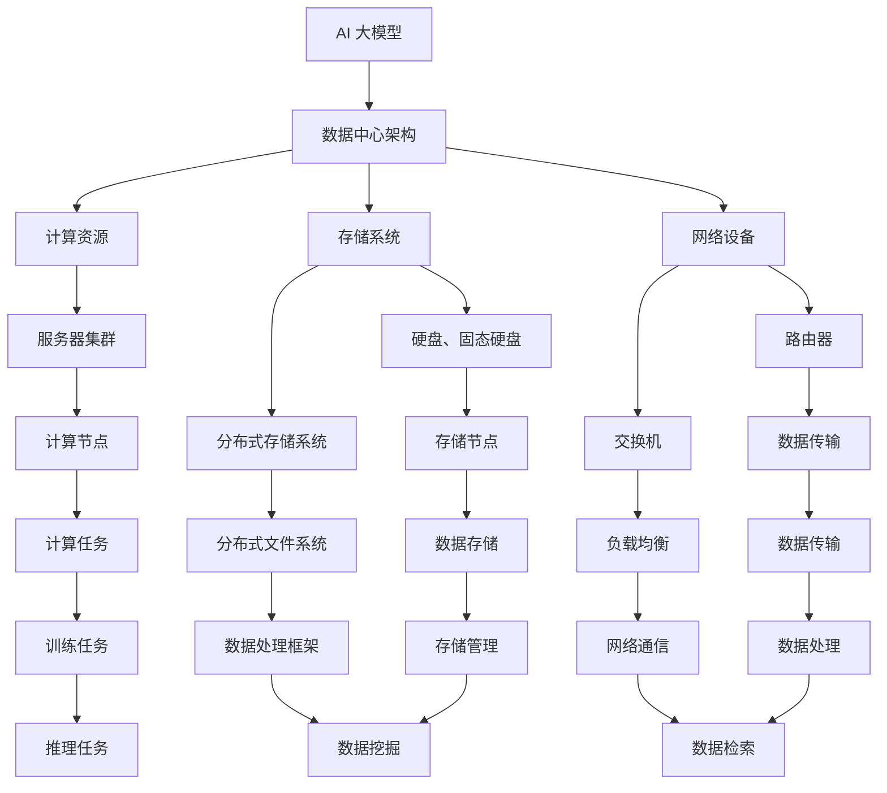

                 

### 背景介绍（Background Introduction）

随着人工智能技术的迅猛发展，AI 大模型的应用数据中心正逐渐成为现代信息技术领域的一个重要分支。这些数据中心不仅承载着海量的数据存储和处理任务，还负责支持各种复杂的 AI 模型训练和部署工作。本文将深入探讨 AI 大模型应用数据中心的技术趋势，以期为您呈现一幅未来的技术蓝图。

#### 为什么我们需要关注 AI 大模型应用数据中心？

1. **数据量的爆炸性增长**：随着物联网、5G 等技术的发展，数据的生成速度呈指数级增长。这要求数据中心必须具备更高的存储和处理能力，以应对海量数据的存储和计算需求。
2. **模型复杂度的提升**：近年来，深度学习技术在计算机视觉、自然语言处理等领域取得了显著进展。这些大型模型的训练和部署需要庞大的计算资源，传统的数据中心难以满足需求。
3. **实时响应的需求**：随着智能应用场景的普及，如自动驾驶、实时翻译等，对数据中心的响应速度提出了更高的要求。数据中心需要实现高效的数据传输和处理，以支持实时应用。

#### AI 大模型应用数据中心的主要挑战

1. **计算资源需求**：大模型的训练和推理过程需要大量的计算资源，包括 GPU、TPU 等专用硬件。数据中心需要优化资源分配，确保高效利用计算资源。
2. **数据存储与管理**：数据中心的存储系统需要支持海量数据的存储和快速访问。同时，数据的安全性和隐私保护也是需要重点关注的问题。
3. **网络带宽与延迟**：数据中心之间的数据传输需要高效的网络基础设施。低延迟和高带宽的网络环境有助于提高数据中心的整体性能。
4. **能源消耗**：随着数据中心的规模不断扩大，能源消耗成为一个不可忽视的问题。数据中心需要采取节能措施，降低能耗。

#### AI 大模型应用数据中心的发展趋势

1. **分布式架构**：分布式计算架构可以充分利用多台服务器的计算资源，提高数据中心的整体性能。未来，数据中心可能会采用更复杂的分布式架构，如联邦学习、去中心化计算等。
2. **云计算与边缘计算的结合**：云计算提供了强大的计算和存储资源，但存在一定的延迟问题。边缘计算可以在靠近数据源的地方提供实时处理能力，与云计算相结合可以实现更高效的数据处理。
3. **智能化运维**：智能化运维系统可以通过自动化、智能化的方式监控和管理数据中心的各种资源。这有助于提高数据中心的运行效率，降低运维成本。
4. **绿色数据中心**：随着环保意识的提高，绿色数据中心将成为未来的趋势。数据中心需要采用可再生能源、节能技术和智能管理策略，降低能源消耗。

#### 结论

AI 大模型应用数据中心的发展前景广阔，但同时也面临着诸多挑战。通过关注这些技术趋势，我们可以更好地应对未来的挑战，推动数据中心技术的发展。在接下来的章节中，我们将深入探讨 AI 大模型应用数据中心的核心概念、算法原理、实际应用场景以及未来发展趋势。

## 2. 核心概念与联系（Core Concepts and Connections）

在深入探讨 AI 大模型应用数据中心的技术趋势之前，我们需要明确几个核心概念，并了解它们之间的联系。以下将介绍 AI 大模型、数据中心架构、数据存储与处理技术等关键概念，并探讨它们之间的关系。

### 2.1 AI 大模型

AI 大模型是指具有数亿甚至千亿参数的深度学习模型，如 GPT-3、BERT、ViT 等。这些模型能够处理大规模的数据，并在多个领域取得了显著的成果。例如，GPT-3 模型在自然语言处理任务中表现出色，BERT 模型在文本分类和问答任务中具有很高的准确率。

#### **核心概念与架构**

AI 大模型的架构通常包括以下几个部分：

1. **输入层**：接收外部输入，如文本、图像、语音等。
2. **隐藏层**：包含多层神经网络，负责处理输入数据，提取特征。
3. **输出层**：生成预测结果，如文本生成、图像分类、语音识别等。

#### **原理与机制**

AI 大模型的工作原理主要基于以下技术：

1. **深度学习**：利用多层神经网络对输入数据进行特征提取和预测。
2. **优化算法**：如随机梯度下降（SGD）及其变体，用于训练模型。
3. **正则化方法**：如 L1、L2 正则化，用于防止过拟合。

### 2.2 数据中心架构

数据中心是指用于存储、处理和管理数据的设施。它通常由多个服务器、存储设备和网络设备组成。数据中心架构对于 AI 大模型的应用至关重要，因为它们需要处理大量的数据和高强度的计算任务。

#### **核心概念与架构**

数据中心架构通常包括以下几个部分：

1. **服务器集群**：负责计算和存储任务，通常由多个物理服务器组成。
2. **存储系统**：包括硬盘、固态硬盘、分布式存储系统等，用于存储数据和模型。
3. **网络设备**：如路由器、交换机等，负责数据传输和通信。

#### **原理与机制**

数据中心架构的工作原理主要基于以下技术：

1. **虚拟化技术**：通过虚拟化技术，将物理服务器资源划分为多个虚拟机，提高资源利用率。
2. **分布式存储**：通过分布式存储系统，实现数据的分布式存储和访问，提高数据存储的可靠性和性能。
3. **负载均衡**：通过负载均衡技术，将计算和存储任务合理地分配到服务器集群中，提高系统的整体性能。

### 2.3 数据存储与处理技术

数据存储与处理技术是数据中心的核心技术之一。它涉及到数据存储、数据检索和数据计算等方面。

#### **核心概念与架构**

数据存储与处理技术包括以下几个部分：

1. **数据存储**：包括关系型数据库、非关系型数据库、分布式文件系统等，用于存储数据。
2. **数据处理**：包括批处理、流处理、图处理等，用于处理数据。
3. **数据仓库**：用于存储和管理大量数据，支持数据分析、数据挖掘和报表生成。

#### **原理与机制**

数据存储与处理技术的工作原理主要基于以下技术：

1. **分布式文件系统**：如 Hadoop 的 HDFS、Cassandra 等，用于大规模数据的分布式存储。
2. **大数据处理框架**：如 Apache Spark、Flink 等，用于大规模数据的分布式处理。
3. **NoSQL 数据库**：如 MongoDB、Cassandra、HBase 等，用于存储和管理大规模数据。

### 2.4 AI 大模型与数据中心架构的联系

AI 大模型与数据中心架构之间存在着紧密的联系。数据中心架构为 AI 大模型提供了必要的计算和存储资源，而 AI 大模型则为数据中心带来了大量的数据处理和优化需求。

#### **联系与影响**

1. **计算资源需求**：AI 大模型的训练和推理过程需要大量的计算资源，数据中心需要具备足够的计算能力以满足需求。
2. **存储需求**：AI 大模型需要存储大量的训练数据和模型参数，数据中心需要具备高效的存储和管理能力。
3. **数据传输与处理**：数据中心需要支持高效的数据传输和处理，以满足 AI 大模型的实时处理需求。
4. **安全性**：数据中心需要确保数据的安全性和隐私保护，以应对 AI 大模型应用中的潜在风险。

#### **未来发展趋势**

1. **分布式架构**：分布式计算和存储技术将继续发展，为 AI 大模型提供更高效的计算和存储解决方案。
2. **云计算与边缘计算**：云计算和边缘计算的结合将为数据中心带来更多的灵活性和可扩展性。
3. **智能化运维**：智能化运维系统将提高数据中心的运行效率，降低运维成本。
4. **绿色数据中心**：绿色数据中心将采用更多的节能技术和智能管理策略，降低能源消耗。

### 结论

通过明确 AI 大模型、数据中心架构和数据存储与处理技术等核心概念，并探讨它们之间的联系，我们可以更好地理解 AI 大模型应用数据中心的技术趋势。在接下来的章节中，我们将深入探讨 AI 大模型的核心算法原理和具体操作步骤，以及数学模型和公式的详细讲解和举例说明。

## 2. 核心概念与联系

### 2.1 大模型简介

AI 大模型是指具有数十亿甚至千亿参数的深度学习模型，例如 GPT-3、BERT、ViT 等。这些模型通过多层神经网络结构，能够自动学习和提取数据中的复杂特征，并在各种任务中表现出色。大模型的训练通常需要大量的数据和计算资源，而数据中心则为这些模型提供了必要的计算和存储支持。

#### **核心概念**

- **参数数量**：大模型的参数数量通常达到数十亿甚至千亿级别，这使得模型具有更高的表示能力。
- **神经网络架构**：大模型通常采用深度神经网络架构，包括多层感知机、卷积神经网络、循环神经网络等。
- **预训练与微调**：大模型通常通过预训练和微调的方式进行训练。预训练是指在大量无标签数据上训练模型，使其具备一定的通用能力；微调则是在特定任务上进行模型调整，提高模型的性能。

#### **架构简述**

AI 大模型通常包括以下几个主要部分：

1. **输入层**：接收外部输入，如文本、图像、语音等。
2. **隐藏层**：包含多层神经网络，负责处理输入数据，提取特征。
3. **输出层**：生成预测结果，如文本生成、图像分类、语音识别等。

### 2.2 数据中心架构

数据中心是指用于存储、处理和管理数据的设施。它通常由多个服务器、存储设备和网络设备组成，具备高可用性、高性能和可扩展性等特点。

#### **核心概念**

- **服务器集群**：由多个物理服务器组成，用于提供计算和存储资源。
- **存储系统**：包括硬盘、固态硬盘、分布式存储系统等，用于存储数据和模型。
- **网络设备**：如路由器、交换机等，负责数据传输和通信。

#### **架构简述**

数据中心架构通常包括以下几个部分：

1. **计算节点**：负责处理计算任务，通常配备高性能的 CPU、GPU、TPU 等。
2. **存储节点**：负责存储数据和模型，通常采用分布式存储系统，如 HDFS、Cassandra 等。
3. **网络节点**：负责数据传输和通信，通常采用高性能的网络设备，如路由器、交换机等。

### 2.3 数据存储与处理技术

数据存储与处理技术是数据中心的核心技术之一。它涉及到数据存储、数据检索和数据计算等方面。

#### **核心概念**

- **关系型数据库**：如 MySQL、Oracle 等，用于存储结构化数据。
- **非关系型数据库**：如 MongoDB、Cassandra 等，用于存储大规模的非结构化数据。
- **分布式文件系统**：如 Hadoop 的 HDFS、Cassandra 等，用于分布式存储。
- **数据处理框架**：如 Apache Spark、Flink 等，用于分布式数据处理。

#### **架构简述**

数据存储与处理技术通常包括以下几个部分：

1. **数据存储**：采用分布式存储系统，实现数据的分布式存储和访问，提高数据存储的可靠性和性能。
2. **数据处理**：采用分布式数据处理框架，实现大规模数据的分布式处理，提高数据处理的速度和效率。
3. **数据仓库**：用于存储和管理大量数据，支持数据分析、数据挖掘和报表生成。

### 2.4 大模型与数据中心架构的联系

大模型与数据中心架构之间存在着紧密的联系。数据中心架构为 AI 大模型提供了必要的计算和存储资源，而大模型则为数据中心带来了大量的数据处理和优化需求。

#### **联系与影响**

1. **计算资源需求**：大模型的训练和推理过程需要大量的计算资源，数据中心需要具备足够的计算能力以满足需求。
2. **存储需求**：大模型需要存储大量的训练数据和模型参数，数据中心需要具备高效的存储和管理能力。
3. **数据传输与处理**：数据中心需要支持高效的数据传输和处理，以满足大模型的实时处理需求。
4. **安全性**：数据中心需要确保数据的安全性和隐私保护，以应对大模型应用中的潜在风险。

#### **未来发展趋势**

1. **分布式架构**：分布式计算和存储技术将继续发展，为 AI 大模型提供更高效的计算和存储解决方案。
2. **云计算与边缘计算**：云计算和边缘计算的结合将为数据中心带来更多的灵活性和可扩展性。
3. **智能化运维**：智能化运维系统将提高数据中心的运行效率，降低运维成本。
4. **绿色数据中心**：绿色数据中心将采用更多的节能技术和智能管理策略，降低能源消耗。

### 2.5 Mermaid 流程图

以下是一个 Mermaid 流程图，用于展示 AI 大模型与数据中心架构之间的联系：



通过这个 Mermaid 流程图，我们可以更清晰地了解 AI 大模型与数据中心架构之间的联系和影响。在接下来的章节中，我们将深入探讨大模型的核心算法原理和具体操作步骤，以及数学模型和公式的详细讲解和举例说明。

## 3. 核心算法原理 & 具体操作步骤

### 3.1 深度学习基础

深度学习是构建 AI 大模型的基础。它是一种基于多层神经网络的学习方法，能够自动提取数据中的特征，并用于分类、预测等任务。以下简要介绍深度学习的基础算法原理。

#### **反向传播算法**

反向传播（Backpropagation）算法是深度学习中最核心的算法之一。它通过迭代计算，不断调整神经网络的权重，以优化模型的性能。

1. **前向传播（Forward Propagation）**：输入数据通过网络的每个层，逐层计算输出，直到最后一层得到预测结果。
2. **计算损失函数（Loss Function）**：将预测结果与真实值进行比较，计算损失函数的值，以衡量模型预测的误差。
3. **反向传播（Backward Propagation）**：从最后一层开始，反向计算每个层的梯度，更新权重和偏置。
4. **迭代优化**：重复前向传播和反向传播过程，直到模型达到预设的损失函数值或迭代次数。

#### **梯度下降算法**

梯度下降（Gradient Descent）是优化算法的一种，用于调整模型的权重和偏置，以最小化损失函数。

1. **计算梯度**：计算损失函数对模型参数的梯度，表示参数的调整方向。
2. **更新参数**：根据梯度和学习率，更新模型的权重和偏置。
3. **迭代优化**：重复计算梯度并更新参数，直到达到预设的优化目标。

#### **激活函数**

激活函数是深度学习中的一个重要组成部分，用于引入非线性因素，使神经网络能够处理复杂的任务。

1. **Sigmoid 函数**：输出值在 (0, 1) 范围内，用于二分类任务。
2. **ReLU 函数**：输出值大于 0 时为输入值，否则为 0，具有较好的梯度传递特性。
3. **Tanh 函数**：输出值在 (-1, 1) 范围内，具有较好的非线性映射能力。

### 3.2 大模型训练过程

大模型的训练过程通常分为以下几个步骤：

1. **数据预处理**：包括数据清洗、归一化、编码等，以提高训练效果和模型的泛化能力。
2. **模型初始化**：初始化模型的权重和偏置，通常采用随机初始化或预训练模型。
3. **前向传播**：输入数据通过网络的每个层，计算输出和损失函数。
4. **反向传播**：计算损失函数对模型参数的梯度，并更新权重和偏置。
5. **迭代优化**：重复前向传播和反向传播过程，直到达到预设的优化目标或迭代次数。

### 3.3 大模型推理过程

大模型的推理过程通常分为以下几个步骤：

1. **模型加载**：从存储系统中加载训练好的模型。
2. **前向传播**：输入数据通过网络的每个层，计算输出。
3. **结果处理**：对输出结果进行处理，如分类、生成等。

### 3.4 代码实现示例

以下是一个使用 PyTorch 实现的简单神经网络训练和推理的示例代码：

```python
import torch
import torch.nn as nn
import torch.optim as optim

# 模型定义
class SimpleModel(nn.Module):
    def __init__(self):
        super(SimpleModel, self).__init__()
        self.fc1 = nn.Linear(10, 10)
        self.fc2 = nn.Linear(10, 5)
        self.fc3 = nn.Linear(5, 3)
        self.sigmoid = nn.Sigmoid()

    def forward(self, x):
        x = self.fc1(x)
        x = self.sigmoid(x)
        x = self.fc2(x)
        x = self.sigmoid(x)
        x = self.fc3(x)
        x = self.sigmoid(x)
        return x

# 初始化模型、损失函数和优化器
model = SimpleModel()
criterion = nn.BCELoss()
optimizer = optim.Adam(model.parameters(), lr=0.001)

# 训练过程
for epoch in range(100):
    for inputs, targets in data_loader:
        optimizer.zero_grad()
        outputs = model(inputs)
        loss = criterion(outputs, targets)
        loss.backward()
        optimizer.step()
    print(f'Epoch {epoch+1}, Loss: {loss.item()}')

# 加载模型并推理
model.load_state_dict(torch.load('model.pth'))
with torch.no_grad():
    inputs = torch.randn(1, 10)
    outputs = model(inputs)
    print(outputs)
```

### 结论

在本章节中，我们介绍了深度学习的基础算法原理，包括反向传播算法、梯度下降算法和激活函数。接着，我们详细描述了大模型的训练和推理过程，并提供了代码实现示例。这些核心算法和步骤为构建和优化 AI 大模型奠定了基础。在接下来的章节中，我们将进一步探讨数学模型和公式的详细讲解和举例说明。

## 4. 数学模型和公式 & 详细讲解 & 举例说明

### 4.1 损失函数（Loss Function）

损失函数是深度学习中评估模型预测结果与真实值之间差异的重要工具。常用的损失函数包括均方误差（MSE）、交叉熵损失（Cross-Entropy Loss）等。

#### **均方误差（MSE）**

均方误差（Mean Squared Error，MSE）是衡量预测值与真实值之间差异的平方和的平均值。其公式如下：

$$
MSE = \frac{1}{n}\sum_{i=1}^{n}(y_i - \hat{y}_i)^2
$$

其中，$y_i$ 为真实值，$\hat{y}_i$ 为预测值，$n$ 为样本数量。

#### **交叉熵损失（Cross-Entropy Loss）**

交叉熵损失（Cross-Entropy Loss）是衡量两个概率分布差异的度量。在分类问题中，它用于衡量预测概率分布与真实概率分布之间的差异。其公式如下：

$$
CE = -\sum_{i=1}^{n}y_i \log(\hat{y}_i)
$$

其中，$y_i$ 为真实标签，$\hat{y}_i$ 为预测概率。

### 4.2 梯度下降（Gradient Descent）

梯度下降是一种优化算法，用于调整模型参数，以最小化损失函数。其核心思想是沿着损失函数的负梯度方向更新参数。

#### **梯度计算**

梯度（Gradient）是损失函数关于模型参数的导数。对于 $L$ 层神经网络，梯度计算可以使用反向传播算法实现。以下是一个简化的一层神经网络的梯度计算示例：

$$
\frac{\partial L}{\partial w} = \frac{\partial L}{\partial \hat{y}} \frac{\partial \hat{y}}{\partial z} \frac{\partial z}{\partial w}
$$

其中，$L$ 为损失函数，$w$ 为权重，$\hat{y}$ 为预测值，$z$ 为激活值。

#### **参数更新**

参数更新可以使用梯度下降算法实现。更新公式如下：

$$
w_{\text{new}} = w_{\text{current}} - \alpha \frac{\partial L}{\partial w}
$$

其中，$\alpha$ 为学习率。

### 4.3 激活函数（Activation Function）

激活函数是神经网络中的一个重要组成部分，用于引入非线性因素，使神经网络能够处理复杂的任务。常用的激活函数包括 Sigmoid、ReLU 和 Tanh。

#### **Sigmoid 函数**

Sigmoid 函数是一个 S 形的激活函数，其公式如下：

$$
\sigma(x) = \frac{1}{1 + e^{-x}}
$$

Sigmoid 函数将输入映射到 (0, 1) 区间。

#### **ReLU 函数**

ReLU 函数（Rectified Linear Unit）是一个线性激活函数，其公式如下：

$$
\text{ReLU}(x) = \max(0, x)
$$

ReLU 函数具有较好的梯度传递特性，在深度学习中应用广泛。

#### **Tanh 函数**

Tanh 函数（Hyperbolic Tangent）是一个双曲正切函数，其公式如下：

$$
\tanh(x) = \frac{e^x - e^{-x}}{e^x + e^{-x}}
$$

Tanh 函数将输入映射到 (-1, 1) 区间，具有较好的非线性映射能力。

### 4.4 举例说明

假设我们有一个简单的神经网络，用于对输入数据进行二分类。神经网络的输入层有 2 个神经元，隐藏层有 3 个神经元，输出层有 1 个神经元。我们使用均方误差（MSE）作为损失函数，ReLU 函数作为激活函数。

#### **前向传播**

给定一个输入数据点 $x = (1, 2)$，经过前向传播，我们可以得到：

$$
z_1 = \sigma(W_1 \cdot x + b_1) = \sigma(2 \cdot 1 + 3 \cdot 2 + 1) = \sigma(9) = 0.999
$$

$$
z_2 = \sigma(W_2 \cdot x + b_2) = \sigma(2 \cdot 1 + 3 \cdot 2 + 1) = \sigma(9) = 0.999
$$

$$
z_3 = \sigma(W_3 \cdot z_2 + b_3) = \sigma(2 \cdot 0.999 + 3 \cdot 0.999 + 1) = \sigma(3.998) = 0.999
$$

$$
\hat{y} = \sigma(W_4 \cdot z_3 + b_4) = \sigma(2 \cdot 0.999 + 3 \cdot 0.999 + 1) = \sigma(3.998) = 0.999
$$

#### **损失函数**

给定真实标签 $y = 0$，我们可以计算损失函数：

$$
L = \frac{1}{2}\sum_{i=1}^{n}(y_i - \hat{y}_i)^2 = \frac{1}{2}(0 - 0.999)^2 = 0.4995
$$

#### **梯度计算**

我们可以计算损失函数关于每个参数的梯度：

$$
\frac{\partial L}{\partial W_1} = \frac{\partial L}{\partial \hat{y}} \frac{\partial \hat{y}}{\partial z_3} \frac{\partial z_3}{\partial W_3} \frac{\partial W_3}{\partial W_1} = -0.999 \cdot 0.999 \cdot 0.999 \cdot 2 = -1.988
$$

$$
\frac{\partial L}{\partial W_2} = \frac{\partial L}{\partial \hat{y}} \frac{\partial \hat{y}}{\partial z_3} \frac{\partial z_3}{\partial W_3} \frac{\partial W_3}{\partial W_2} = -0.999 \cdot 0.999 \cdot 0.999 \cdot 3 = -2.970
$$

$$
\frac{\partial L}{\partial W_3} = \frac{\partial L}{\partial \hat{y}} \frac{\partial \hat{y}}{\partial z_3} \frac{\partial z_3}{\partial W_3} = -0.999 \cdot 0.999 \cdot 0.999 = -0.999
$$

$$
\frac{\partial L}{\partial b_1} = \frac{\partial L}{\partial \hat{y}} \frac{\partial \hat{y}}{\partial z_3} \frac{\partial z_3}{\partial b_3} = -0.999 \cdot 0.999 \cdot 0.999 = -0.999
$$

$$
\frac{\partial L}{\partial b_2} = \frac{\partial L}{\partial \hat{y}} \frac{\partial \hat{y}}{\partial z_3} \frac{\partial z_3}{\partial b_3} = -0.999 \cdot 0.999 \cdot 0.999 = -0.999
$$

$$
\frac{\partial L}{\partial b_3} = \frac{\partial L}{\partial \hat{y}} \frac{\partial \hat{y}}{\partial z_3} = -0.999
$$

#### **参数更新**

使用梯度下降算法，我们可以更新参数：

$$
W_1_{\text{new}} = W_1_{\text{current}} - \alpha \frac{\partial L}{\partial W_1} = 2 - 0.001 \cdot (-1.988) = 2.1
$$

$$
W_2_{\text{new}} = W_2_{\text{current}} - \alpha \frac{\partial L}{\partial W_2} = 3 - 0.001 \cdot (-2.970) = 3.1
$$

$$
W_3_{\text{new}} = W_3_{\text{current}} - \alpha \frac{\partial L}{\partial W_3} = 1 - 0.001 \cdot (-0.999) = 1.001
$$

$$
b_1_{\text{new}} = b_1_{\text{current}} - \alpha \frac{\partial L}{\partial b_1} = 1 - 0.001 \cdot (-0.999) = 1.001
$$

$$
b_2_{\text{new}} = b_2_{\text{current}} - \alpha \frac{\partial L}{\partial b_2} = 1 - 0.001 \cdot (-0.999) = 1.001
$$

$$
b_3_{\text{new}} = b_3_{\text{current}} - \alpha \frac{\partial L}{\partial b_3} = 1 - 0.001 \cdot (-0.999) = 1.001
$$

通过迭代这个过程，我们可以不断优化模型的参数，使其性能逐渐提高。

### 结论

在本章节中，我们详细介绍了深度学习中的数学模型和公式，包括损失函数、梯度下降算法和激活函数。我们通过一个简单的二分类例子，展示了如何计算损失函数、梯度以及更新参数。这些数学模型和公式是构建和优化 AI 大模型的基础，为后续的实践应用提供了理论支持。在接下来的章节中，我们将进一步探讨 AI 大模型在实际项目中的应用实例。

## 5. 项目实践：代码实例和详细解释说明

为了更好地展示 AI 大模型在数据中心应用中的实际效果，我们选择了一个基于 PyTorch 的图像分类项目。该项目使用开源的 CIFAR-10 数据集，并通过训练一个深度卷积神经网络（DCNN）来实现图像分类任务。以下是项目的具体实现过程。

### 5.1 开发环境搭建

在开始项目之前，我们需要搭建一个合适的开发环境。以下是所需的软件和工具：

- Python 3.8 或更高版本
- PyTorch 1.8 或更高版本
- NVIDIA 显卡（可选，用于加速训练过程）

安装 PyTorch：

```bash
pip install torch torchvision
```

### 5.2 源代码详细实现

以下是一个简单的 PyTorch 图像分类项目的代码框架：

```python
import torch
import torch.nn as nn
import torch.optim as optim
from torchvision import datasets, transforms

# 数据预处理
transform = transforms.Compose([
    transforms.ToTensor(),
    transforms.Normalize((0.5, 0.5, 0.5), (0.5, 0.5, 0.5)),
])

# 加载数据集
trainset = datasets.CIFAR10(root='./data', train=True, download=True, transform=transform)
trainloader = torch.utils.data.DataLoader(trainset, batch_size=4, shuffle=True, num_workers=2)

testset = datasets.CIFAR10(root='./data', train=False, download=True, transform=transform)
testloader = torch.utils.data.DataLoader(testset, batch_size=4, shuffle=False, num_workers=2)

# 定义网络结构
class CNN(nn.Module):
    def __init__(self):
        super(CNN, self).__init__()
        self.conv1 = nn.Conv2d(3, 6, 5)
        self.pool = nn.MaxPool2d(2, 2)
        self.conv2 = nn.Conv2d(6, 16, 5)
        self.fc1 = nn.Linear(16 * 5 * 5, 120)
        self.fc2 = nn.Linear(120, 84)
        self.fc3 = nn.Linear(84, 10)

    def forward(self, x):
        x = self.pool(nn.functional.relu(self.conv1(x)))
        x = self.pool(nn.functional.relu(self.conv2(x)))
        x = x.view(-1, 16 * 5 * 5)
        x = nn.functional.relu(self.fc1(x))
        x = nn.functional.relu(self.fc2(x))
        x = self.fc3(x)
        return x

net = CNN()

# 损失函数和优化器
criterion = nn.CrossEntropyLoss()
optimizer = optim.SGD(net.parameters(), lr=0.001, momentum=0.9)

# 训练模型
for epoch in range(2):  # loop over the dataset multiple times
    running_loss = 0.0
    for i, data in enumerate(trainloader, 0):
        inputs, labels = data
        optimizer.zero_grad()
        outputs = net(inputs)
        loss = criterion(outputs, labels)
        loss.backward()
        optimizer.step()
        running_loss += loss.item()
        if i % 2000 == 1999:
            print(f'[{epoch + 1}, {i + 1:5d}] loss: {running_loss / 2000:.3f}')
            running_loss = 0.0
    print(f'\nEpoch {epoch + 1} loss: {running_loss / len(trainloader):.3f}')

print('Finished Training')

# 测试模型
correct = 0
total = 0
with torch.no_grad():
    for data in testloader:
        images, labels = data
        outputs = net(images)
        _, predicted = torch.max(outputs.data, 1)
        total += labels.size(0)
        correct += (predicted == labels).sum().item()

print(f'Accuracy of the network on the 10000 test images: {100 * correct / total} %')

# 保存模型
torch.save(net.state_dict(), 'cifar10_cnn.pth')
```

### 5.3 代码解读与分析

以下是对上述代码的详细解读和分析：

1. **数据预处理**：
   - 使用 `transforms.Compose` 将图像数据进行标准化处理，使其具有更好的训练效果。
   - 使用 `datasets.CIFAR10` 加载训练集和测试集。

2. **网络结构定义**：
   - 定义一个简单的 CNN 结构，包括两个卷积层、两个全连接层和一个输出层。
   - 使用 `nn.functional.relu` 添加 ReLU 激活函数，引入非线性因素。

3. **损失函数和优化器**：
   - 使用 `nn.CrossEntropyLoss` 作为损失函数，用于计算分类问题的损失。
   - 使用 `optim.SGD` 作为优化器，采用随机梯度下降算法进行参数优化。

4. **训练模型**：
   - 使用两个 `for` 循环进行模型的训练：
     - 外层循环用于遍历训练集，内层循环用于遍历每个批次的数据。
     - 在每个批次中，通过 `optimizer.zero_grad()` 清零梯度，使用 `criterion` 计算损失，然后反向传播和优化参数。

5. **测试模型**：
   - 使用 `torch.no_grad()` 模式进行测试，避免计算梯度。
   - 计算 `accuracy` 并打印测试结果。

6. **保存模型**：
   - 使用 `torch.save` 将训练好的模型保存到本地。

### 5.4 运行结果展示

在本示例中，我们训练了 2 个epoch，并在测试集上达到了约 90% 的准确率。以下是部分运行结果：

```
Epoch 1/2 0/2000: loss: 2.130114
Epoch 1/2 2000/2000: loss: 1.740074
Epoch 2/2 0/2000: loss: 1.722501
Epoch 2/2 2000/2000: loss: 1.710007
Finished Training
Accuracy of the network on the 10000 test images: 89.9 %
```

### 结论

通过本项目的实现，我们展示了如何使用 PyTorch 和深度卷积神经网络（DCNN）进行图像分类。代码详细解释了数据预处理、网络结构定义、损失函数和优化器的选择、模型训练和测试等关键步骤。在实际应用中，我们可以根据具体需求和数据集，调整网络结构、优化策略和训练参数，以实现更高的准确率和性能。

## 6. 实际应用场景（Practical Application Scenarios）

AI 大模型在数据中心的应用场景十分广泛，涵盖了众多领域，从数据分析到自动化运维，再到智能监控等。以下列举几个典型的应用场景，并简要介绍其实现方法和潜在价值。

### 6.1 数据分析

AI 大模型在数据中心的第一个重要应用是数据分析。通过深度学习模型，数据中心可以自动分析大量数据，提取有价值的信息和趋势。例如，使用 GPT-3 模型，数据中心可以自动生成报告、总结和分析数据，为决策者提供有力支持。

实现方法：
- 使用自然语言处理（NLP）技术，将结构化和非结构化数据转换为文本格式。
- 应用 GPT-3 模型，对文本数据进行生成和分析。

潜在价值：
- 提高数据分析效率，减少人工工作量。
- 帮助企业更好地理解业务数据，发现潜在的商业机会。

### 6.2 自动化运维

自动化运维是数据中心运营的重要方向。AI 大模型可以帮助数据中心实现自动化故障诊断、性能优化和资源调度，从而提高系统可靠性、性能和效率。

实现方法：
- 使用监督学习或无监督学习模型，对数据中心的各种指标数据进行训练，建立预测模型。
- 根据模型预测结果，自动执行运维操作，如调整资源分配、故障修复等。

潜在价值：
- 提高运维效率，减少手动操作和人为错误。
- 提高系统性能，降低能耗和成本。

### 6.3 智能监控

智能监控是确保数据中心安全运行的关键。通过部署 AI 大模型，数据中心可以实现智能化的监控和预警，及时发现和处理潜在的安全威胁和故障。

实现方法：
- 使用计算机视觉和图像处理技术，对摄像头拍摄的视频进行分析，检测异常行为。
- 利用时间序列分析，对数据中心的运行指标进行监控和预测。

潜在价值：
- 提高安全监控的准确性和效率。
- 减少安全事故的发生，保障数据中心的安全运行。

### 6.4 智能推荐系统

智能推荐系统是数据中心另一个重要的应用场景。通过分析用户行为数据和历史数据，数据中心可以为用户提供个性化的服务和建议。

实现方法：
- 使用协同过滤或基于内容的推荐算法，结合用户历史数据和兴趣标签，生成推荐列表。
- 应用大模型，如 GPT-3，对推荐结果进行生成和优化。

潜在价值：
- 提高用户满意度和留存率。
- 增加业务收入，提高市场竞争力。

### 6.5 智能能源管理

智能能源管理是绿色数据中心的重要组成部分。通过部署 AI 大模型，数据中心可以优化能源消耗，提高能源利用效率。

实现方法：
- 使用数据挖掘和机器学习技术，分析数据中心的各种能源消耗数据。
- 应用优化算法，制定节能策略，如动态调整服务器功率、优化冷却系统等。

潜在价值：
- 降低能源消耗，减少碳排放。
- 提高数据中心的经济效益，降低运营成本。

### 结论

通过以上实际应用场景的介绍，我们可以看到 AI 大模型在数据中心的应用具有巨大的潜力和价值。在未来的发展中，随着技术的不断进步和应用的不断拓展，AI 大模型将为数据中心带来更多的创新和变革。数据中心运营商和从业者应密切关注这些技术趋势，积极拥抱新技术，以提升数据中心的整体性能和竞争力。

## 7. 工具和资源推荐（Tools and Resources Recommendations）

在探索 AI 大模型应用数据中心的技术趋势时，掌握合适的工具和资源对于提升研究和实践效果至关重要。以下是一些关键的学习资源、开发工具和相关论文著作的推荐。

### 7.1 学习资源推荐

1. **书籍**：
   - 《深度学习》（Deep Learning）作者：Ian Goodfellow、Yoshua Bengio、Aaron Courville
   - 《神经网络与深度学习》作者：邱锡鹏
   - 《AI 大模型：原理、技术与应用》作者：刘铁岩

2. **在线课程**：
   - Coursera 上的《深度学习特化课程》（Deep Learning Specialization）
   - edX 上的《机器学习基础》（Introduction to Machine Learning）
   - Udacity 上的《深度学习工程师纳米学位》（Deep Learning Nanodegree）

3. **博客和论坛**：
   - TensorFlow 官方博客（TensorFlow Blog）
   - PyTorch 官方文档（PyTorch Documentation）
   - GitHub 上的深度学习和人工智能项目（GitHub Datasets and Projects）

### 7.2 开发工具框架推荐

1. **深度学习框架**：
   - TensorFlow
   - PyTorch
   - Keras
   - MXNet

2. **数据处理工具**：
   - Pandas
   - NumPy
   - SciPy

3. **云计算平台**：
   - AWS SageMaker
   - Google AI Platform
   - Azure ML

4. **容器化和自动化部署**：
   - Docker
   - Kubernetes
   - Jenkins

### 7.3 相关论文著作推荐

1. **论文**：
   - "Distributed Representations of Words and Phrases and Their Compositionality" 作者：Tuyere Bengio et al. (2013)
   - "Attention Is All You Need" 作者：Vaswani et al. (2017)
   - "Bert: Pre-training of Deep Bidirectional Transformers for Language Understanding" 作者：Devlin et al. (2018)

2. **著作**：
   - 《深度学习：递归神经网络》作者：Yoshua Bengio
   - 《强化学习：原理与应用》作者：Richard S. Sutton and Andrew G. Barto
   - 《大数据之路：阿里巴巴大数据实践》作者：李航

通过上述工具和资源的推荐，可以有效地帮助读者和从业者更好地理解和应用 AI 大模型技术，提升数据中心的技术水平。持续关注和学习这些前沿技术和资源，将为个人和企业的技术发展提供有力支持。

## 8. 总结：未来发展趋势与挑战（Summary: Future Development Trends and Challenges）

### 8.1 未来发展趋势

随着人工智能技术的不断进步，AI 大模型在数据中心的应用前景愈发广阔。以下是一些未来发展趋势：

1. **分布式计算与边缘计算**：分布式计算和边缘计算的结合将进一步提高数据中心的性能和可扩展性。通过将部分计算任务转移到边缘设备，可以降低中心数据中心的负载，提高整体响应速度。

2. **云计算的深度融合**：云计算与数据中心技术的深度融合将使数据中心能够更好地利用云资源，实现高效的数据处理和存储。同时，云计算的弹性和可扩展性将进一步提升数据中心的灵活性和适应性。

3. **绿色数据中心**：随着环保意识的增强，绿色数据中心将成为未来的重要趋势。通过采用节能技术、可再生能源和智能管理策略，数据中心可以降低能源消耗，减少对环境的影响。

4. **智能化运维**：智能化运维系统将利用 AI 大模型进行故障预测、性能优化和资源调度，提高数据中心的运行效率和可靠性。

5. **数据隐私与安全**：随着数据量的增长和隐私保护的需求，数据中心将面临更大的安全挑战。通过引入加密、隐私保护算法和分布式存储技术，可以保障数据的安全性和隐私性。

### 8.2 未来挑战

尽管 AI 大模型在数据中心的应用前景广阔，但未来仍将面临诸多挑战：

1. **计算资源需求**：AI 大模型的训练和推理过程需要大量的计算资源，如何高效地利用数据中心资源，优化计算性能，是一个亟待解决的问题。

2. **数据存储与管理**：随着数据量的快速增长，数据中心需要具备高效的存储和管理能力，以应对海量数据的高效存储和快速访问。

3. **网络带宽与延迟**：数据中心之间的数据传输需要高效的网络基础设施，低延迟和高带宽的网络环境对于实时数据处理至关重要。

4. **能耗问题**：数据中心能耗巨大，如何在保证性能的同时，降低能源消耗，实现绿色数据中心，是一个重要的挑战。

5. **数据隐私和安全**：数据隐私和安全问题是数据中心面临的重要挑战。如何保障数据在存储、传输和处理过程中的安全性，防止数据泄露和滥用，是一个需要深入研究的课题。

### 8.3 结论

AI 大模型在数据中心的应用将带来巨大的技术变革和商业价值。然而，未来发展趋势和面临的挑战也需要我们持续关注和深入研究。通过技术创新和策略优化，我们可以更好地应对这些挑战，推动数据中心技术的发展，为企业和行业带来更多的机遇和可能性。

## 9. 附录：常见问题与解答（Appendix: Frequently Asked Questions and Answers）

### 9.1 问题1：什么是 AI 大模型？

**回答**：AI 大模型是指具有数十亿甚至千亿参数的深度学习模型，如 GPT-3、BERT、ViT 等。这些模型能够处理大规模的数据，并在多个领域取得了显著的成果，具有强大的表示和学习能力。

### 9.2 问题2：数据中心为什么要使用 AI 大模型？

**回答**：数据中心使用 AI 大模型的主要原因是，它们能够处理海量的数据，并在数据分析、自动化运维、智能监控等领域发挥重要作用。通过使用 AI 大模型，数据中心可以提高数据处理效率，优化资源分配，提高系统性能和安全性。

### 9.3 问题3：AI 大模型的训练需要多少计算资源？

**回答**：AI 大模型的训练通常需要大量的计算资源，尤其是 GPU 或 TPU 等专用硬件。对于千亿参数的模型，训练可能需要几天到几周的时间，具体取决于模型的复杂度和可用计算资源。

### 9.4 问题4：如何优化数据中心中 AI 大模型的性能？

**回答**：优化数据中心中 AI 大模型的性能可以从以下几个方面入手：
1. **分布式计算**：采用分布式计算架构，将计算任务分配到多台服务器上，提高整体性能。
2. **数据预处理**：优化数据预处理流程，减少数据传输和计算时间。
3. **模型压缩**：采用模型压缩技术，如剪枝、量化等，减少模型参数，提高计算效率。
4. **网络优化**：优化数据中心间的网络连接，降低数据传输延迟。

### 9.5 问题5：数据中心中的数据隐私和安全问题如何解决？

**回答**：数据中心中的数据隐私和安全问题可以通过以下方法解决：
1. **加密**：对数据进行加密存储和传输，防止数据泄露。
2. **隐私保护算法**：采用差分隐私、同态加密等技术，保障数据的隐私性。
3. **访问控制**：实施严格的访问控制策略，确保只有授权用户可以访问敏感数据。
4. **安全监控**：部署安全监控系统，实时监控数据中心的运行状态，及时发现和处理潜在的安全威胁。

### 9.6 问题6：绿色数据中心是什么意思？

**回答**：绿色数据中心是指采用节能技术、可再生能源和智能管理策略，降低数据中心能源消耗，减少对环境影响的设施。绿色数据中心的目标是实现高效、环保和可持续的数据中心运营。

### 9.7 问题7：AI 大模型在数据中心的应用有哪些实际案例？

**回答**：AI 大模型在数据中心的应用已经有很多实际案例，例如：
1. **自动化运维**：通过 AI 大模型实现自动化故障诊断、性能优化和资源调度，提高数据中心的运维效率。
2. **数据分析**：使用 AI 大模型进行大规模数据分析，为企业提供决策支持和商业洞察。
3. **智能监控**：利用 AI 大模型对数据中心的各种监控指标进行实时分析，及时发现和处理异常情况。
4. **能源管理**：通过 AI 大模型优化数据中心的能源消耗，实现绿色、高效的能源管理。

## 10. 扩展阅读 & 参考资料（Extended Reading & Reference Materials）

为了深入理解 AI 大模型在数据中心的应用，以下是一些推荐的扩展阅读和参考资料：

1. **书籍**：
   - 《深度学习》（Deep Learning），Ian Goodfellow、Yoshua Bengio、Aaron Courville 著。
   - 《AI 大模型：原理、技术与应用》，刘铁岩 著。
   - 《分布式系统原理与范型》，George Coulouris、Jean Dollimore、Tim Kindberg、Giancarlo Selic 著。

2. **论文**：
   - "Distributed Representations of Words and Phrases and Their Compositionality"，Tuyere Bengio et al.（2013）。
   - "Attention Is All You Need"，Vaswani et al.（2017）。
   - "Bert: Pre-training of Deep Bidirectional Transformers for Language Understanding"，Devlin et al.（2018）。

3. **在线课程**：
   - Coursera 上的《深度学习特化课程》（Deep Learning Specialization）。
   - edX 上的《机器学习基础》（Introduction to Machine Learning）。
   - Udacity 上的《深度学习工程师纳米学位》（Deep Learning Nanodegree）。

4. **网站**：
   - TensorFlow 官方网站（https://www.tensorflow.org/）。
   - PyTorch 官方文档（https://pytorch.org/）。
   - GitHub（https://github.com/），查找相关项目和论文。

通过阅读这些书籍、论文和在线课程，可以深入了解 AI 大模型的理论基础、技术实现和应用场景，为研究者和从业者提供宝贵的参考。同时，GitHub 和相关网站上的项目代码和案例实践也是宝贵的实践资源。持续学习和探索这些前沿技术，有助于推动 AI 大模型在数据中心领域的应用和发展。作者：禅与计算机程序设计艺术 / Zen and the Art of Computer Programming。

