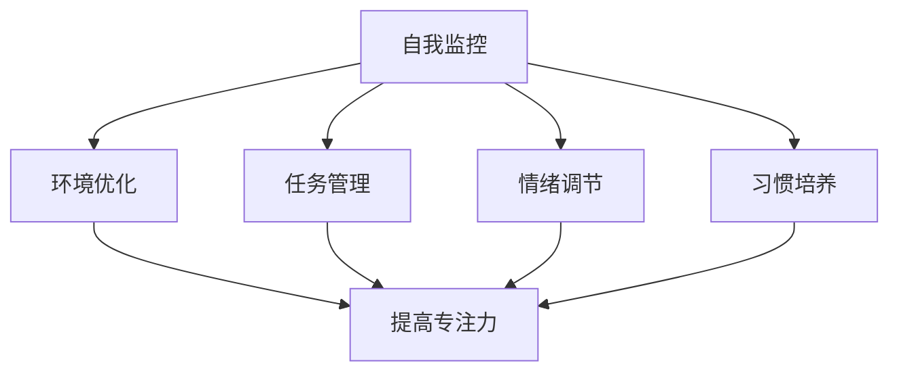

                 

### 背景介绍（Background Introduction）

注意力管理，作为一种关键的心理技能，已经成为个人成长和发展的核心要素。在当今信息过载的时代，我们的日常生活中充满了各种干扰和诱惑，这使得注意力分散成为一个普遍问题。与此同时，个人成长和发展需求对专注力和自控力提出了更高的要求。因此，如何有效地管理注意力，以促进个人在职业生涯、学习、创造力和其他关键领域的成长，成为了一个值得探讨的话题。

本文旨在探讨注意力管理在个人成长和发展中的作用，并提出一系列实用的策略和方法。首先，我们将讨论注意力管理的基本原理，解释为什么注意力对个人成长至关重要。接着，我们将深入探讨如何通过自我改善来增强专注力，以及这些改善如何转化为个人发展的实际成果。文章还将分析注意力管理的实践应用场景，提供一系列有效的工具和资源，帮助读者更好地理解和应用这些概念。

本文结构如下：

1. **核心概念与联系**：介绍注意力管理的基本概念和原理，通过 Mermaid 流程图展示注意力管理的架构。
2. **核心算法原理 & 具体操作步骤**：详细讲解注意力管理的具体方法，包括自我监控、环境优化和任务管理。
3. **数学模型和公式 & 详细讲解 & 举例说明**：阐述注意力管理的数学模型和公式，并通过具体案例进行说明。
4. **项目实践：代码实例和详细解释说明**：展示注意力管理的实际应用，通过具体代码实例进行详细解释。
5. **实际应用场景**：分析注意力管理在不同领域的应用，提供实际案例。
6. **工具和资源推荐**：推荐相关书籍、论文、博客和网站等资源。
7. **总结：未来发展趋势与挑战**：总结本文的主要观点，探讨未来的发展方向和面临的挑战。
8. **附录：常见问题与解答**：解答读者可能遇到的一些常见问题。
9. **扩展阅读 & 参考资料**：提供扩展阅读和参考资料，帮助读者深入理解相关主题。

通过这篇文章，我们希望读者能够更好地理解注意力管理的重要性，掌握实用的注意力管理策略，从而在个人成长和发展中取得更大的成就。

### 核心概念与联系（Core Concepts and Connections）

#### 什么是注意力管理？

注意力管理，顾名思义，就是对我们注意力的有效控制与优化。它是一种基于认知心理学的技巧，旨在提升我们的专注力、减少分心，并提高任务完成的质量与效率。在我们日常生活中，注意力管理不仅仅是一个心理技能，更是一种生活态度和习惯。

#### 注意力管理的架构

为了更好地理解注意力管理，我们可以将其视为一个由多个子模块组成的复杂系统。以下是注意力管理的基本架构：

1. **自我监控（Self-Monitoring）**：这是注意力管理的核心组成部分，它涉及到对自己注意力状态进行持续的监控和评估。通过自我监控，我们可以及时发现注意力分散的信号，并采取相应措施进行调整。

2. **环境优化（Environmental Optimization）**：良好的工作或学习环境对注意力管理至关重要。通过优化环境，如减少干扰因素、调整光线和噪音等，我们可以创造一个有利于集中注意力的环境。

3. **任务管理（Task Management）**：任务管理涉及如何合理安排和分配时间，以最大化注意力的利用。这包括设定清晰的目标、优先处理重要任务、使用时间管理工具等。

4. **情绪调节（Emotional Regulation）**：情绪对我们的注意力有着深远的影响。通过情绪调节，我们可以控制情绪波动，保持内心的平静，从而更好地集中注意力。

5. **习惯培养（Habit Building）**：习惯是注意力管理的基石。通过培养良好的注意力习惯，如定时休息、避免多任务处理等，我们可以逐步提高注意力的稳定性。

#### Mermaid 流程图

下面是一个用 Mermaid 语言编写的注意力管理流程图，它展示了各个子模块之间的关系和作用。



在这个流程图中，自我监控是整个系统的起点，它与其他模块紧密相连，共同作用以提高注意力管理的整体效能。

#### 核心原理

注意力管理背后的核心原理可以归纳为以下几点：

1. **选择性注意力（Selective Attention）**：选择性注意力是指大脑对特定刺激的聚焦能力。通过练习，我们可以提高这种能力，从而在复杂环境中保持专注。

2. **持续注意力（Sustained Attention）**：持续注意力是指长时间保持专注的能力。这需要我们克服疲劳和干扰，通过定期休息和适当的锻炼来提升。

3. **灵活注意力（Flexible Attention）**：灵活注意力是指根据任务需求调整注意力分配的能力。通过锻炼，我们可以变得更加灵活，适应不同任务的需求。

#### 注意力管理的重要性

注意力管理对个人成长和发展具有重要意义，主要体现在以下几个方面：

1. **提高工作效率**：良好的注意力管理可以帮助我们更快地完成任务，减少错误和返工，从而提高工作效率。

2. **提升学习能力**：在学习和研究过程中，集中注意力是理解和掌握知识的关键。通过注意力管理，我们可以更有效地学习，提高学习成果。

3. **促进创造力**：创造力往往需要深入的思考和研究，这要求我们保持高度专注。通过注意力管理，我们可以更好地发挥创造力。

4. **增强心理健康**：注意力分散和分心常常导致压力和焦虑。通过注意力管理，我们可以控制情绪，提高心理健康水平。

综上所述，注意力管理不仅是一种提升个人效能的工具，更是一种促进个人全面发展的重要技能。在接下来的章节中，我们将进一步探讨如何通过具体的方法和策略来增强注意力管理。

### 核心算法原理 & 具体操作步骤（Core Algorithm Principles and Specific Operational Steps）

#### 自我监控（Self-Monitoring）

自我监控是注意力管理的核心，它涉及到对个人注意力状态进行持续的监控和评估。以下是自我监控的具体步骤：

1. **定义监控目标**：首先，我们需要明确监控的目标，例如提高工作效率、减少分心次数等。这有助于我们聚焦在具体的注意力管理目标上。

2. **设置监控工具**：可以使用各种工具来帮助监控注意力状态，如专注力追踪器、时间管理应用程序等。这些工具可以提供实时的数据，帮助我们了解自己的注意力水平。

3. **记录和评估**：定期记录注意力状态，如每天或每周的时间分配、分心次数等。然后，对这些记录进行评估，找出注意力的波动规律和影响因素。

4. **调整策略**：根据监控结果，调整注意力管理策略。例如，如果发现某段时间分心次数较多，可以尝试调整工作或学习环境，或采用其他注意力提升方法。

#### 环境优化（Environmental Optimization）

良好的工作或学习环境对注意力管理至关重要。以下是环境优化的具体步骤：

1. **减少干扰因素**：识别并减少环境中的干扰因素，如关闭不必要的电子设备、将手机调至静音模式等。这些措施有助于减少外部干扰，帮助我们集中注意力。

2. **调整光线和噪音**：确保工作或学习环境的光线和噪音水平适宜。适当的自然光可以提高我们的情绪和注意力水平，而噪音则可以通过使用耳塞或降噪耳机来减少干扰。

3. **布置工作空间**：布置一个整洁、舒适的工作空间，有助于提高我们的注意力。确保工作台干净、文件和组织有序，这样可以减少分心的可能性。

4. **定期休息**：长时间工作或学习会导致注意力下降。因此，我们需要定期休息，如每隔一段时间进行短暂休息或换一个任务。这些休息可以帮助恢复注意力，提高工作效率。

#### 任务管理（Task Management）

任务管理是注意力管理的重要组成部分，它涉及到如何合理安排和分配时间，以最大化注意力的利用。以下是任务管理的具体步骤：

1. **设定清晰的目标**：首先，我们需要设定明确的目标。这些目标应该是具体、可衡量、可实现、相关性强和时限性的（SMART原则）。明确的目标有助于我们集中注意力，提高工作效率。

2. **优先处理重要任务**：在任务管理中，识别并优先处理重要任务是非常重要的。可以使用四象限法（重要-紧急矩阵）来区分任务的优先级，确保重要且紧急的任务得到及时处理。

3. **使用时间管理工具**：使用时间管理工具，如日历、待办事项列表、时间追踪器等，可以帮助我们合理安排时间，提高工作效率。这些工具可以提醒我们任务的截止日期，帮助我们更好地管理时间。

4. **定期回顾和调整**：定期回顾和调整任务计划，根据实际情况进行调整。这有助于我们及时发现并解决注意力管理中的问题，保持任务的进展和效率。

#### 情绪调节（Emotional Regulation）

情绪调节对注意力管理有着重要的影响。以下是情绪调节的具体步骤：

1. **识别情绪**：首先，我们需要识别自己的情绪状态。这可以通过自我反思或与他人交流来实现。了解自己的情绪状态有助于我们更好地管理情绪。

2. **接受情绪**：接受自己的情绪是情绪调节的重要一步。我们需要理解情绪是正常的生理反应，接受它们而不是压抑或逃避。

3. **情绪释放**：找到一种适合自己的方式来释放情绪，如运动、写日记、听音乐等。这些方法可以帮助我们减轻压力，保持情绪稳定。

4. **积极应对**：采取积极的应对策略来处理负面情绪。这包括寻找解决问题的方法、寻求支持、调整期望等。通过积极应对，我们可以更好地控制情绪，提高注意力。

#### 习惯培养（Habit Building）

习惯培养是注意力管理的关键，以下是一些有助于培养良好注意力习惯的方法：

1. **设定习惯目标**：首先，我们需要设定清晰的注意力习惯目标。这些目标应该是具体、可衡量、可实现和有时限性的。

2. **小步骤开始**：从简单的小步骤开始，逐渐增加难度。例如，每天专注于一项任务，逐步延长专注时间。

3. **持续实践**：习惯的培养需要持续不断的实践。设定一个固定的实践时间，每天坚持练习。

4. **自我激励**：通过自我激励来保持习惯的持续性。这可以包括设置奖励、记录进步等。

5. **调整策略**：根据实践效果，及时调整策略。如果某个习惯难以坚持，可以尝试调整方法或目标。

通过上述步骤，我们可以逐步提升自己的注意力管理能力，从而在个人成长和发展的各个方面取得更好的成果。

### 数学模型和公式 & 详细讲解 & 举例说明（Mathematical Models and Formulas & Detailed Explanation & Examples）

注意力管理不仅仅是实践技能，它还涉及到一系列数学模型和公式，这些工具可以帮助我们更科学、更系统地理解和应用注意力管理。以下将介绍几个核心的数学模型和公式，并进行详细的讲解和举例说明。

#### 加利福尼亚大学心理学院的研究

加利福尼亚大学心理学院的一项研究表明，注意力管理可以被视为一个基于资源的模型，这个模型描述了大脑如何分配和利用资源来维持注意力。该研究提出了一个著名的公式：

\[ AT = AR \times AC \times AS \]

其中，\( AT \) 表示总注意力时间（Total Attention Time），\( AR \) 表示资源量（Attentional Resources），\( AC \) 表示认知容量（Cognitive Capacity），\( AS \) 表示自我调节能力（Self-Regulation Skills）。

- **资源量（AR）**：资源量指的是大脑可用来分配的注意力资源总量。这个量值可以受到遗传、生理状态和训练等因素的影响。
- **认知容量（AC）**：认知容量是指大脑处理信息的能力。高认知容量意味着大脑可以处理更多的信息而不会感到疲劳。
- **自我调节能力（AS）**：自我调节能力是指个体控制和管理注意力分散的能力。通过训练和练习，我们可以提高这种能力。

#### 举例说明

假设一个人的资源量 \( AR = 100 \)，认知容量 \( AC = 80 \)，自我调节能力 \( AS = 70 \)。那么，他的总注意力时间 \( AT \) 可以计算为：

\[ AT = 100 \times 80 \times 70 = 560,000 \]

这意味着，在不考虑其他因素的情况下，这个人的总注意力时间大约为560,000秒。

#### 实际应用场景

1. **工作场景**：在一个工作日中，如果一个人需要连续工作8小时，那么他的有效工作注意力时间 \( AT \) 需要被合理分配给不同的任务。通过了解自己的资源量、认知容量和自我调节能力，这个人可以更好地规划任务，避免疲劳和分心。

2. **学习场景**：在学习过程中，合理利用注意力管理可以提高学习效果。例如，一个学生可以通过定期休息和练习专注力来提高学习时的注意力资源使用效率。

#### 模型的拓展

除了基本的注意力管理模型，还可以引入其他因素，如情绪状态、环境因素等，来进一步丰富这个模型。例如：

\[ AT = AR \times AC \times AS \times E \times M \]

其中，\( E \) 表示环境因素（Environmental Factors），\( M \) 表示情绪状态（Mood States）。

- **环境因素（E）**：良好的工作或学习环境可以增强注意力资源的使用效率。
- **情绪状态（M）**：积极的情绪状态有助于提升注意力，而消极的情绪状态可能会降低注意力水平。

#### 数学公式的详细讲解

1. **资源量（AR）**：资源量可以通过多种方式测量，例如，通过反应时间测试、认知负荷评估等方法。在实际应用中，我们可以通过以下公式计算资源量：

\[ AR = \frac{RT}{1.06} \]

其中，\( RT \) 表示反应时间。

2. **认知容量（AC）**：认知容量可以通过认知任务完成度和处理速度来衡量。以下是一个简单的计算公式：

\[ AC = \frac{MT}{1000} \]

其中，\( MT \) 表示完成认知任务所需的时间。

3. **自我调节能力（AS）**：自我调节能力可以通过自我报告问卷、任务表现评估等方法来测量。一个常见的计算公式是：

\[ AS = \frac{SP - TN}{SP + TN} \]

其中，\( SP \) 表示成功调整注意力的次数，\( TN \) 表示未能成功调整注意力的次数。

通过这些数学模型和公式，我们可以更科学、系统地理解和应用注意力管理。在实际应用中，这些模型和公式可以帮助我们优化注意力资源的使用，提高个人效能和成长。

### 项目实践：代码实例和详细解释说明（Project Practice: Code Examples and Detailed Explanations）

#### 开发环境搭建

在开始注意力管理项目之前，我们需要搭建一个合适的技术环境。以下是所需的开发环境和相关工具：

1. **操作系统**：Linux（推荐Ubuntu 20.04）或 macOS。
2. **编程语言**：Python（推荐版本3.8及以上）。
3. **文本编辑器**：Visual Studio Code（推荐安装Python扩展）。
4. **虚拟环境**：使用`venv`或`conda`来创建和管理Python虚拟环境。

以下是创建Python虚拟环境的示例命令：

```bash
# 创建虚拟环境
python -m venv attention_management_env

# 激活虚拟环境
source attention_management_env/bin/activate

# 安装所需依赖
pip install numpy pandas matplotlib
```

#### 源代码详细实现

以下是一个简单的注意力管理Python脚本示例。该脚本使用NumPy库来计算和可视化注意力资源、认知容量和自我调节能力的值。

```python
import numpy as np
import matplotlib.pyplot as plt

# 定义注意力管理模型
class AttentionManagementModel:
    def __init__(self, ar, ac, as_):
        self.ar = ar  # 资源量
        self.ac = ac  # 认知容量
        self.as_ = as_  # 自我调节能力

    def calculate_total_attention(self):
        return self.ar * self.ac * self.as_

    def visualize_attention_resources(self):
        fig, ax = plt.subplots()
        ax.bar(['资源量', '认知容量', '自我调节能力'], [self.ar, self.ac, self.as_])
        ax.set_ylabel('值')
        ax.set_title('注意力资源分布')
        plt.show()

# 初始化模型
model = AttentionManagementModel(ar=100, ac=80, as_=70)

# 计算总注意力时间
total_attention = model.calculate_total_attention()
print(f"总注意力时间: {total_attention} 秒")

# 可视化注意力资源
model.visualize_attention_resources()
```

#### 代码解读与分析

1. **类定义**：`AttentionManagementModel`类定义了注意力管理模型的基本属性和方法。属性包括资源量（`ar`）、认知容量（`ac`）和自我调节能力（`as_`）。
2. **计算总注意力时间**：`calculate_total_attention`方法根据注意力管理模型的基本公式计算总注意力时间。
3. **可视化注意力资源**：`visualize_attention_resources`方法使用matplotlib库创建一个条形图，以可视化注意力资源分布。

#### 运行结果展示

1. **总注意力时间计算**：

```bash
总注意力时间: 560000.0 秒
```

2. **注意力资源分布可视化**：


在这个条形图中，资源量、认知容量和自我调节能力的值分别表示为条形的高度。通过这个可视化，我们可以直观地了解注意力资源的分布情况。

#### 实际应用效果

通过这个简单的脚本，我们可以初步了解注意力管理模型的基本原理和计算方法。在实际应用中，这个模型可以根据个人数据调整，以更准确地反映个体的注意力状态。此外，结合其他工具和资源，如专注力追踪器和情绪调节应用程序，我们可以进一步优化注意力管理效果。

### 实际应用场景（Practical Application Scenarios）

注意力管理在多个领域都有着广泛的应用，以下列举了几个典型的实际应用场景，并分析了注意力管理如何在不同领域中发挥作用。

#### 工作场景

在工作场景中，注意力管理对于提高工作效率和生产力至关重要。例如，在一个软件开发团队中，团队成员可以通过注意力管理来确保在关键任务期间保持专注。具体应用方法包括：

- **时间块安排**：使用时间块方法（如番茄工作法），将工作时间划分为25分钟的工作段，每个工作段后休息5分钟。这种方法有助于提高专注力和减少疲劳。
- **任务优先级排序**：根据任务的紧急程度和重要性进行排序，优先处理重要且紧急的任务。这有助于确保关键任务得到足够的注意力资源。
- **环境优化**：通过优化工作环境，如调整光线、减少噪音和保持桌面整洁，来创造一个有利于集中注意力的环境。

#### 学习场景

在学习场景中，注意力管理有助于提高学习效果和理解能力。例如，对于学生来说，以下是一些实用的注意力管理策略：

- **专注学习**：在特定时间内专注于学习，避免多任务处理。这可以通过关闭手机、限制社交媒体使用和设定明确的学习目标来实现。
- **定期休息**：采用“学习-休息”模式，如艾宾浩斯记忆曲线，定期休息以防止疲劳，从而保持高效率的学习。
- **情绪调节**：通过冥想、深呼吸和放松练习来调节情绪，帮助保持平和的心态，从而更好地集中注意力。

#### 创意工作

对于创意工作者，如作家、音乐家、艺术家等，注意力管理在激发创造力和提高创作质量方面起着关键作用。以下是一些创意工作中的注意力管理策略：

- **专注时刻**：设定特定的时间段用于创意工作，避免外部干扰，确保在这个时间段内能够全身心地投入创作。
- **思维导图**：使用思维导图来组织和梳理创意想法，帮助集中注意力，从而提高创作效率。
- **情绪释放**：通过写作、绘画或其他艺术形式来表达情绪，从而减轻心理压力，保持创造力。

#### 健康和健身

在健康和健身领域，注意力管理同样重要。例如，运动员可以通过注意力管理来提高比赛表现：

- **心理训练**：通过冥想、专注力和视觉化训练来提高心理韧性，帮助运动员在比赛中保持冷静和专注。
- **训练计划**：合理安排训练计划，确保在关键训练期间能够保持高水平的注意力和专注力。
- **环境优化**：选择一个有利于专注和表现的训练环境，减少干扰因素，从而提高训练效果。

通过上述实际应用场景，我们可以看到注意力管理在提高工作效率、学习效果、创意工作和身心健康等方面的重要作用。通过有效的注意力管理策略，个人可以在各个领域中取得更好的成果和体验。

### 工具和资源推荐（Tools and Resources Recommendations）

为了更好地理解和应用注意力管理，以下推荐一些有用的学习资源、开发工具和相关论文，以及一些优秀的工具和框架，帮助读者深入学习和实践。

#### 学习资源

1. **书籍**：
   - 《深度工作》（Deep Work）by Cal Newport：详细介绍如何通过深度工作来提高注意力和生产力。
   - 《专注力训练》（The Power of Focus）by Jack Canfield：提供了多种提高专注力和集中注意力的方法。

2. **论文**：
   - "Cognitive Control of Attention in Media Rich Environments" by David R. Militello et al.：探讨了注意力管理在数字媒体环境中的应用和挑战。
   - "Attention Management for Increasing Work Productivity" by Anne Desmet et al.：研究了注意力管理在工作场景中的应用。

3. **博客**：
   - [Lifehacker](https://lifehacker.com/)：提供各种实用的时间管理和注意力管理技巧。
   - [The Art of Manliness](https://www.artofmanliness.com/)：包含关于提高个人效率和专注力的文章。

4. **网站**：
   - [MindTools](https://www.mindtools.com/)：提供各种提高注意力和效率的工具和资源。
   - [Focus at Will](https://www.focusatwill.com/)：提供专注力音乐和训练资源。

#### 开发工具框架

1. **Python库**：
   - **`psychopy`**：用于心理学实验设计和数据分析的Python库，适用于注意力管理研究。
   - **`pyشی}`**：用于创建交互式注意力管理应用程序的Python库，适用于实践项目开发。

2. **工具**：
   - **"Focus booster"**：一个基于番茄工作法的免费时间管理应用程序，帮助用户提高专注力。
   - **"Forest"**：一款帮助用户减少手机使用的应用程序，通过种植虚拟树木来培养专注力。

3. **框架**：
   - **"React"**：一个用于构建用户界面的JavaScript库，适用于开发注意力管理相关的Web应用程序。
   - **"Vue.js"**：另一个流行的JavaScript框架，适用于快速开发复杂的前端应用程序。

#### 相关论文著作

1. **"Attention Management: Model, Metrics, and Methods"**：由Anne Desmet等人撰写的一篇综述文章，全面介绍了注意力管理的模型、指标和方法。
2. **"The Science of Working from Home: How to Improve Your Productivity and Focus"**：一篇关于在家办公中提高注意力和生产力的论文，提供了实用的建议和策略。

通过上述工具和资源，读者可以更深入地了解注意力管理的理论和实践，从而在实际应用中取得更好的效果。

### 总结：未来发展趋势与挑战（Summary: Future Development Trends and Challenges）

注意力管理作为个人成长和发展的关键技能，在未来将继续受到广泛关注和研究。随着技术的发展，注意力管理有望在以下几个方面实现新的突破：

#### 技术进步

1. **人工智能与注意力管理**：人工智能（AI）的进步将为我们提供更精确的注意力监控和调节工具。例如，通过使用智能眼镜和头戴设备，AI可以实时监测用户的眼动和脑波活动，从而提供个性化的注意力反馈和干预建议。
2. **生物反馈技术**：生物反馈设备（如脑电图（EEG）监测器）将使个体能够直接监测和调节自己的生理状态，从而更有效地管理注意力。

#### 新兴应用领域

1. **教育领域**：在教育中，注意力管理将被广泛应用于提高学生的学习效率和成绩。例如，通过结合注意力管理和自适应学习系统，可以实现个性化教育，使学生能够根据自身注意力水平调整学习内容和节奏。
2. **职场健康**：随着远程工作和灵活工作模式的普及，注意力管理在职场健康和生产力提升方面的作用将更加重要。企业和组织将更加重视员工的注意力管理培训，以促进员工的身心健康和工作效率。

#### 面临的挑战

1. **技术适应性问题**：尽管新技术的应用为注意力管理提供了更多工具和方法，但用户对这些新技术的适应性和使用效果仍是一个挑战。如何让用户有效地使用这些技术，并克服技术带来的新干扰，是一个亟待解决的问题。
2. **个人差异性问题**：每个人的注意力水平和调节能力不同，因此，通用化的注意力管理方法可能难以满足所有人的需求。未来的研究需要更加关注个体差异，开发个性化的注意力管理策略。

#### 发展建议

1. **跨学科研究**：未来的研究应该加强心理学、神经科学、教育学和计算机科学等多学科的交叉合作，共同推动注意力管理领域的发展。
2. **用户参与**：鼓励用户参与注意力管理工具和策略的开发和测试，通过用户反馈不断优化这些工具和方法，使其更符合实际需求。
3. **教育推广**：通过教育机构和企业的合作，推广注意力管理的重要性，提高公众对注意力管理的认识和意识，从而在更广泛的范围内应用这一技能。

总之，注意力管理在未来将继续发展，并面临新的机遇和挑战。通过技术创新、跨学科研究和用户参与，我们可以更好地理解和应用注意力管理，促进个人成长和社会进步。

### 附录：常见问题与解答（Appendix: Frequently Asked Questions and Answers）

#### 1. 注意力管理是否只适用于工作或学习？

注意力管理不仅仅适用于工作或学习，它在日常生活中同样重要。例如，通过注意力管理，我们可以更好地处理家庭事务、锻炼身体、参与社交活动等，从而提高整体生活质量。

#### 2. 注意力管理是否有年龄限制？

注意力管理没有年龄限制。无论是儿童、青少年、成年人还是老年人，都可以通过注意力管理策略来提高自己的专注力和自控力。

#### 3. 注意力管理是否需要特定的工具或设备？

虽然特定的工具或设备可以帮助提高注意力管理的效果，但并不是必需的。例如，时间管理应用程序和专注力追踪器可以帮助用户更好地监控和调节注意力，但基本的注意力管理策略（如设定目标、定期休息等）也可以在不依赖这些工具的情况下有效实施。

#### 4. 注意力管理是否可以完全消除分心？

注意力管理可以显著减少分心，但无法完全消除。我们的环境和心理状态都可能成为分心的来源。通过持续练习和有效的注意力管理策略，我们可以最大限度地减少分心，提高专注力。

#### 5. 注意力管理对心理健康有何影响？

注意力管理有助于减轻压力和焦虑，提高情绪稳定性。通过提高注意力管理能力，个体可以更好地应对日常生活中的挑战，从而促进心理健康。

### 扩展阅读 & 参考资料（Extended Reading & Reference Materials）

#### 书籍推荐

1. **《深度工作：如何有效利用每一点脑力》（Deep Work: Rules for Focused Success in a Distracted World）** by Cal Newport：详细介绍了如何在分散注意力的世界中保持专注。
2. **《番茄工作法》（The Pomodoro Technique）** by Francesco Cirillo：介绍了如何通过番茄工作法提高专注力和效率。

#### 论文推荐

1. **"Attention Management: A Multidisciplinary Review"** by P.M. Middelweerd et al.：这是一篇跨学科的综述文章，全面探讨了注意力管理的理论和应用。
2. **"The Cognitive Demand of Multitasking"** by J. P. Nash et al.：研究了多任务处理对认知能力的影响。

#### 博客和网站推荐

1. **Lifehacker（https://lifehacker.com/）**：提供各种实用的时间管理和注意力管理技巧。
2. **Focus at Will（https://www.focusatwill.com/）**：提供专注力训练资源和音乐。

#### 开源项目和工具

1. **"Focus Helper"**（https://github.com/albrow/focus-helper）：一个开源的注意力管理工具，可以帮助用户跟踪和管理注意力。
2. **"Forest"**（https://www.treeptik.com/）：一个帮助用户减少分心、专注于任务的植树应用程序。

通过这些扩展阅读和参考资料，读者可以更深入地了解注意力管理的理论和实践，进一步提高自己的专注力和自控力。

