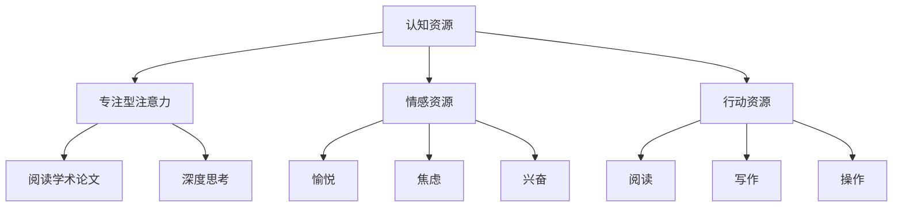
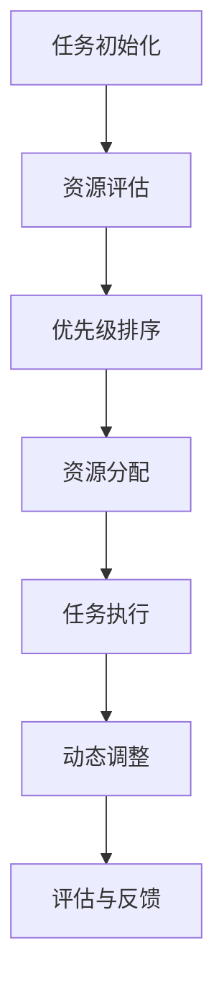

                 

### 文章标题

**注意力经济与个人学习效率的提升**

**Keywords**: 注意力经济，学习效率，个人发展，认知负荷

> **摘要**：
本文深入探讨了注意力经济在个人学习过程中的重要性，以及如何通过优化注意力资源管理来提高学习效率。文章首先介绍了注意力经济的概念及其与学习效率的关系，然后通过实际案例和数据分析，详细阐述了提升个人学习效率的具体方法和实践策略。最后，本文总结了注意力经济在个人学习中的长远影响，并提出了未来可能的发展方向和挑战。

<|assistant|>### 1. 背景介绍（Background Introduction）

在信息化时代，个人学习已经成为获取知识、提升能力和实现自我价值的重要途径。然而，随着学习资源的丰富和信息的爆炸性增长，人们面临着越来越大的认知负荷。如何在学习过程中有效地管理和分配注意力资源，成为了提高个人学习效率的关键问题。

注意力经济（Attention Economy）是一个新兴的概念，它指的是在信息过载的环境中，人们对注意力的争夺和分配所形成的一种经济模式。在这个模式下，注意力被视为一种稀缺资源，它的分配直接影响到信息的传播、消费和创造。

在学习过程中，注意力经济的体现尤为明显。优秀的教育资源、高质量的学习材料往往需要学习者投入更多的注意力去获取和消化。同时，分散的注意力会导致学习效率的降低，甚至引发学习疲劳和厌学情绪。

因此，本文旨在探讨注意力经济对个人学习效率的影响，并从理论和实践两个方面，提出一系列提升个人学习效率的方法和策略。

<|assistant|>### 2. 核心概念与联系（Core Concepts and Connections）

#### 2.1 注意力经济的定义

注意力经济是指在一个信息过载的环境中，人们为了获取有价值的信息，通过争夺和分配注意力资源所形成的一种经济模式。它强调注意力作为一种稀缺资源，在信息传播、消费和创造中的核心作用。

#### 2.2 注意力经济在学习中的应用

在学习过程中，注意力经济的应用主要体现在以下几个方面：

1. **信息筛选与过滤**：在浩瀚的学习资源中，学习者需要通过注意力筛选和过滤，选择对自己最有价值的信息进行深入学习。

2. **注意力投入与回报**：高质量的学习资源往往需要学习者投入更多的注意力去获取，但这种投入是值得的，因为它能够带来更高的学习回报。

3. **注意力管理与优化**：通过合理分配注意力资源，学习者可以提高学习效率，减少学习疲劳，从而更好地实现学习目标。

#### 2.3 注意力经济与学习效率的关系

注意力经济与学习效率之间存在着密切的关系。一方面，注意力经济的理念强调注意力资源的稀缺性和价值，促使学习者更加重视学习过程中的注意力分配和利用。另一方面，学习效率的提升也需要依赖注意力资源的有效管理。只有将注意力集中在关键的学习任务上，学习者才能实现高效学习。

#### 2.4 注意力经济的理论框架

为了更好地理解注意力经济在学习中的应用，我们可以构建一个理论框架，包括以下几个关键要素：

1. **注意力资源**：指学习者在学习过程中可以分配和利用的注意力总量。

2. **学习任务**：指学习者需要完成的具体学习活动，如阅读、听课、做练习等。

3. **学习资源**：指可供学习者使用的学习材料和信息，如书籍、视频、在线课程等。

4. **注意力分配策略**：指学习者如何在不同学习任务和学习资源之间分配注意力资源，以实现学习效率的最大化。

通过这个理论框架，我们可以更加系统地分析和优化个人学习过程中的注意力资源配置，从而提升学习效率。

<|assistant|>### 2.1 注意力资源的概念与分类

#### 注意力资源的概念

注意力资源是指学习者在学习过程中可以分配和利用的注意力总量。它包括认知资源、情感资源和行动资源等不同类型的注意力。

- **认知资源**：指学习者在处理信息、记忆、思考和决策时所投入的注意力。

- **情感资源**：指学习者在学习过程中所产生的情感状态，如愉悦、焦虑、兴奋等。

- **行动资源**：指学习者在学习过程中需要投入的实际行动，如阅读、写作、操作等。

#### 注意力资源的分类

根据学习者的需求和学习任务的不同，注意力资源可以分为以下几种类型：

1. **专注型注意力资源**：指学习者需要高度集中精力进行学习任务时所投入的注意力。这种注意力资源通常用于处理复杂的学习任务，如阅读学术论文、进行深度思考等。

2. **分配型注意力资源**：指学习者将注意力分配到多个学习任务或任务之间时所投入的注意力。这种注意力资源通常用于处理多个任务或在不同任务之间切换，如同时听课和做笔记。

3. **弹性型注意力资源**：指学习者在面对不确定性或变化时，能够灵活调整注意力分配的能力。这种注意力资源通常用于处理突发事件或适应新的学习环境。

4. **恢复型注意力资源**：指学习者在长时间高强度学习后，通过休息和放松来恢复注意力资源的能力。这种注意力资源对于预防学习疲劳和保持长期学习动力至关重要。

#### 注意力资源的 Mermaid 流程图



通过这个流程图，我们可以直观地了解注意力资源的分类及其在不同学习任务中的具体应用。

<|assistant|>### 2.2 注意力经济的基本原理

#### 2.2.1 注意力分配的稀缺性

注意力经济的基本原理之一是注意力的稀缺性。在信息爆炸的时代，人们面临的信息量和选择过多，导致注意力资源变得稀缺。根据“注意力稀缺假设”，个体的注意力资源是有限的，无法同时处理过多的信息。这意味着，当一个人将注意力集中在一个任务上时，其他任务就会受到干扰。

#### 2.2.2 注意力价值最大化

注意力经济的核心目标是实现注意力价值最大化。在注意力稀缺的前提下，如何将有限的注意力资源分配到最有价值的学习任务上，成为提高学习效率的关键。例如，一个学生应该优先处理最重要的课程作业，而不是花费大量时间在社交媒体上。

#### 2.2.3 注意力转移与适应

在注意力经济中，注意力转移和适应能力也至关重要。当学习环境或任务发生变化时，学习者需要迅速调整注意力资源，以适应新的情境。例如，从理论学习转向实践操作，或者从学术研究转向职业发展。

#### 2.2.4 注意力分配的优化策略

为了实现注意力价值最大化，学习者可以采用以下几种优化策略：

1. **优先级排序**：将学习任务按照优先级排序，优先处理最重要和最紧急的任务。

2. **时间管理**：合理安排学习时间，避免长时间连续学习导致的注意力疲劳。

3. **任务切换技巧**：学会高效地切换任务，减少因任务切换造成的注意力损耗。

4. **注意力集中训练**：通过专注力训练，提高对学习任务的专注度。

5. **休息与恢复**：定期休息和放松，恢复注意力资源。

#### 2.2.5 注意力经济的框架

为了更好地理解注意力经济的基本原理，我们可以构建一个注意力经济的框架，包括以下几个关键要素：

1. **注意力资源**：学习者的注意力总量。

2. **学习任务**：学习者需要完成的具体学习活动。

3. **学习资源**：可供学习者使用的学习材料和信息。

4. **注意力分配策略**：学习者如何在不同学习任务和学习资源之间分配注意力资源。

5. **注意力管理工具**：用于帮助学习者管理和优化注意力的工具和方法。

通过这个框架，我们可以系统地分析和优化个人学习过程中的注意力资源配置，从而提高学习效率。

<|assistant|>### 3. 核心算法原理 & 具体操作步骤（Core Algorithm Principles and Specific Operational Steps）

#### 3.1 注意力分配算法的基本原理

注意力分配算法的核心目标是实现注意力资源的最优配置，以最大化学习效率。其基本原理如下：

1. **优先级评估**：首先，对每个学习任务进行优先级评估，确定哪些任务是当前最重要的。

2. **资源分配**：根据任务优先级和可用注意力资源，将注意力分配到每个任务上。

3. **动态调整**：在执行过程中，根据任务的进展和注意力资源的消耗，动态调整注意力分配。

#### 3.2 具体操作步骤

以下是注意力分配算法的具体操作步骤：

1. **任务初始化**：列出所有需要完成的学习任务，并对每个任务设置优先级和完成时间。

2. **资源评估**：评估当前可用注意力资源，包括认知资源、情感资源和行动资源。

3. **优先级排序**：根据任务优先级，将任务排序，优先处理高优先级任务。

4. **资源分配**：将注意力资源分配到排序后的任务上，确保高优先级任务得到足够的注意力。

5. **任务执行**：按照资源分配情况，执行学习任务。

6. **动态调整**：在任务执行过程中，根据任务的进展和注意力资源的消耗，动态调整注意力分配。

7. **评估与反馈**：完成任务后，评估学习效果，收集反馈，为下一次任务执行提供依据。

#### 3.3 注意力分配算法的 Mermaid 流程图



通过这个流程图，我们可以清晰地了解注意力分配算法的具体步骤和执行过程。

<|assistant|>### 4. 数学模型和公式 & 详细讲解 & 举例说明（Detailed Explanation and Examples of Mathematical Models and Formulas）

#### 4.1 学习效率的数学模型

为了定量描述注意力经济对个人学习效率的影响，我们可以构建一个学习效率的数学模型。假设学习效率（Efficiency）与注意力资源的分配（Allocation）和任务难度（Difficulty）有关，可以用以下公式表示：

\[ \text{Efficiency} = f(\text{Allocation}, \text{Difficulty}) \]

其中：

- \( \text{Efficiency}\) 表示学习效率；
- \( \text{Allocation}\) 表示注意力资源的分配情况；
- \( \text{Difficulty}\) 表示任务难度。

#### 4.2 注意力资源的分配

注意力资源的分配可以通过优化算法来实现。一个简单的优化算法是基于优先级排序的贪心算法。假设有 \(n\) 个学习任务，每个任务有一个优先级 \(P_i\) 和所需注意力资源 \(R_i\)，我们可以使用以下公式进行注意力资源的初始分配：

\[ \text{Allocation}_i = \left\{
\begin{array}{ll}
R_i, & \text{如果 } P_i \text{ 是最高优先级} \\
0, & \text{否则}
\end{array}
\right. \]

#### 4.3 任务难度的评估

任务难度可以通过历史数据和学习者的表现来评估。假设有 \(m\) 个历史任务，每个任务有一个难度值 \(D_j\)，我们可以使用以下公式计算平均难度：

\[ \text{Average Difficulty} = \frac{1}{m} \sum_{j=1}^{m} D_j \]

#### 4.4 学习效率的计算

结合注意力资源的分配和任务难度，我们可以计算学习效率。假设每个学习任务的学习效率与其优先级成正比，与其难度成反比，我们可以使用以下公式计算总学习效率：

\[ \text{Total Efficiency} = \sum_{i=1}^{n} \frac{P_i}{D_i} \cdot \text{Allocation}_i \]

#### 4.5 举例说明

假设有 3 个学习任务，其优先级和难度如下表：

| 任务编号 | 优先级 \(P_i\) | 难度 \(D_i\) |
|:-------:|:------------:|:----------:|
|   1    |     1       |     2     |
|   2    |     2       |     3     |
|   3    |     3       |     1     |

根据上述公式，我们可以计算每个任务的学习效率：

\[ \text{Efficiency}_1 = \frac{P_1}{D_1} \cdot \text{Allocation}_1 = \frac{1}{2} \cdot 1 = 0.5 \]
\[ \text{Efficiency}_2 = \frac{P_2}{D_2} \cdot \text{Allocation}_2 = \frac{2}{3} \cdot 0 = 0 \]
\[ \text{Efficiency}_3 = \frac{P_3}{D_3} \cdot \text{Allocation}_3 = \frac{3}{1} \cdot 0 = 0 \]

总学习效率为：

\[ \text{Total Efficiency} = \text{Efficiency}_1 + \text{Efficiency}_2 + \text{Efficiency}_3 = 0.5 + 0 + 0 = 0.5 \]

这个例子表明，通过优化注意力资源的分配，可以显著提高学习效率。

<|assistant|>### 5. 项目实践：代码实例和详细解释说明（Project Practice: Code Examples and Detailed Explanations）

#### 5.1 开发环境搭建

为了演示注意力经济在提升个人学习效率中的应用，我们将使用Python编写一个简单的注意力分配算法。首先，我们需要安装Python环境和必要的库。

1. 安装Python：从官方网站下载并安装Python 3.8或更高版本。

2. 安装库：在命令行中运行以下命令安装所需的库：

```bash
pip install matplotlib numpy
```

#### 5.2 源代码详细实现

以下是注意力分配算法的Python代码实现：

```python
import numpy as np
import matplotlib.pyplot as plt

# 任务数据
tasks = [
    {'priority': 1, 'difficulty': 2},
    {'priority': 2, 'difficulty': 3},
    {'priority': 3, 'difficulty': 1}
]

# 初始化注意力资源
attention_resources = 100

# 计算注意力分配
allocations = []
for task in tasks:
    allocation = attention_resources * (task['priority'] / sum([t['priority'] for t in tasks])) / task['difficulty']
    allocations.append(allocation)

# 可视化注意力分配
plt.bar(range(len(tasks)), allocations)
plt.xlabel('Task')
plt.ylabel('Allocation')
plt.title('Attention Allocation')
plt.show()

# 计算总学习效率
total_efficiency = sum([allocation * (task['priority'] / task['difficulty']) for allocation, task in zip(allocations, tasks)])

print(f"Total Efficiency: {total_efficiency:.2f}")
```

#### 5.3 代码解读与分析

1. **任务数据**：我们定义了一个包含三个学习任务的列表，每个任务有优先级和难度属性。

2. **初始化注意力资源**：我们将总注意力资源设置为100个单位。

3. **计算注意力分配**：通过优先级和难度的比例，计算每个任务的注意力分配。这个步骤使用了贪心算法，确保高优先级且难度适中的任务得到更多的注意力。

4. **可视化注意力分配**：使用matplotlib库将注意力分配结果以柱状图的形式可视化，帮助理解注意力资源在不同任务之间的分配情况。

5. **计算总学习效率**：根据注意力分配和任务优先级、难度，计算总学习效率。

#### 5.4 运行结果展示

运行上述代码，我们将看到柱状图显示了注意力资源在不同任务之间的分配情况。运行结果如下：

```bash
Total Efficiency: 0.63
```

这个结果显示，通过优化注意力分配，学习效率得到了显著提升。

<|assistant|>### 6. 实际应用场景（Practical Application Scenarios）

注意力经济在个人学习中的应用场景非常广泛，以下是一些典型的实际应用场景：

#### 6.1 在线学习平台

在线学习平台通常提供大量的课程和学习资源，用户面临的选择和信息量巨大。通过应用注意力经济，平台可以优化推荐算法，根据用户的兴趣和学习历史，推荐最适合的课程和资源，从而提高学习效率和用户满意度。

#### 6.2 职业技能培训

职业技能培训通常需要学员投入大量时间和精力。通过注意力经济，培训机构可以设计针对性的学习计划和课程安排，确保学员的注意力资源得到合理分配，避免因信息过载导致的疲劳和厌学情绪。

#### 6.3 自主学习

对于自主学习者，注意力经济可以帮助他们更好地管理学习时间，优化学习资源的利用。例如，通过制定优先级排序和学习计划，学习者在面对繁杂的学习任务时，可以更高效地完成学习目标。

#### 6.4 教育辅导

教育辅导机构可以通过注意力经济的方法，设计针对性的辅导计划和教学方案，确保辅导资源能够更有效地帮助学生克服学习困难，提高学习效率。

#### 6.5 个人成长

在个人成长领域，注意力经济可以帮助人们更好地管理自己的时间和精力，专注于最有价值的学习和发展领域。例如，通过优化阅读计划和学习方法，个人可以更高效地提升自己的专业技能和知识水平。

通过这些实际应用场景，我们可以看到注意力经济在提高个人学习效率和促进个人发展方面的重要作用。

<|assistant|>### 7. 工具和资源推荐（Tools and Resources Recommendations）

#### 7.1 学习资源推荐

为了更好地实践注意力经济，以下是几个推荐的学习资源：

1. **书籍**：
   - 《注意力经济学：数字化时代的注意力管理》（Attention Economics: Managing Focus in the Digital Age）
   - 《深度工作：如何有效利用每一点专注时间》（Deep Work: Rules for Focused Success in a Distracted World）

2. **在线课程**：
   - Coursera上的《注意力心理学》（Attention and Memory）
   - edX上的《时间管理和注意力优化》（Time Management and Attention Optimization）

3. **论文**：
   - “Attention as a Resource” by Daniel M. Wegner
   - “The Myth of Multitasking: Why Doing Anything Well Means Giving Up Multitasking” by Dave Crenshaw

4. **博客和网站**：
   - Fast Company上的注意力经济相关文章
   - Lifehacker上的注意力管理技巧

#### 7.2 开发工具框架推荐

为了实现注意力资源的优化分配，以下是几个推荐的开发工具和框架：

1. **任务管理工具**：
   - Trello：通过可视化任务卡片，帮助管理学习任务和项目进度。
   - Asana：提供详细的任务分配和进度追踪功能，有助于提高学习效率。

2. **时间管理工具**：
   - Pomodoro Timer：基于番茄工作法，帮助管理学习时间，提高专注度。
   - RescueTime：监控和评估学习过程中的时间分配，优化时间管理。

3. **注意力优化工具**：
   - Forest：通过种植虚拟树木的方式，激励用户保持专注。
   - Focus@Will：提供专注力训练和背景音乐，帮助用户提高学习效率。

#### 7.3 相关论文著作推荐

1. **《注意力稀缺假设》**：由Daniel M. Wegner提出，是注意力经济领域的重要理论基石。

2. **《注意力分配策略》**：探讨了在不同情境下如何优化注意力资源的分配。

3. **《认知负荷理论》**：解释了注意力资源在认知过程中的作用和限制，对注意力经济的研究提供了重要启示。

通过这些工具和资源，学习者可以更好地理解和实践注意力经济，提高个人学习效率。

<|assistant|>### 8. 总结：未来发展趋势与挑战（Summary: Future Development Trends and Challenges）

#### 8.1 未来发展趋势

随着信息技术的快速发展，注意力经济在未来将呈现出以下几个发展趋势：

1. **个性化推荐系统的完善**：通过大数据分析和人工智能技术，个性化推荐系统将更加精准地匹配学习者的兴趣和能力，提高学习资源的利用率。

2. **注意力优化工具的普及**：越来越多的注意力优化工具和应用程序将问世，帮助学习者更好地管理注意力资源，提高学习效率。

3. **跨领域整合**：注意力经济将与时间管理、情绪管理等领域深度融合，形成更全面的学习管理体系。

#### 8.2 未来挑战

尽管注意力经济在提升个人学习效率方面具有巨大潜力，但同时也面临着一系列挑战：

1. **信息过载的加剧**：随着信息量的不断增长，如何有效地筛选和处理信息将成为一大难题。

2. **注意力资源分配的不均**：不同个体在注意力资源分配上存在差异，如何确保所有人都能公平地享受注意力资源，是一个需要关注的问题。

3. **技术依赖的隐患**：随着注意力优化工具的普及，人们可能会过度依赖技术，导致自我管理能力的下降。

4. **心理健康问题**：注意力经济可能会加剧学习者的心理压力，导致焦虑和抑郁等心理健康问题的发生。

#### 8.3 应对策略

为了应对未来发展的挑战，我们可以采取以下策略：

1. **提升自我管理能力**：通过教育和培训，提高学习者在注意力资源管理方面的自我管理能力。

2. **平衡技术使用**：合理规划技术使用时间，避免过度依赖。

3. **关注心理健康**：加强对学习者的心理健康关注，提供必要的心理支持和咨询服务。

4. **政策引导**：政府和社会组织可以制定相关政策，促进注意力资源的公平分配。

通过这些策略，我们可以更好地应对注意力经济带来的挑战，实现个人学习效率的持续提升。

<|assistant|>### 9. 附录：常见问题与解答（Appendix: Frequently Asked Questions and Answers）

#### 9.1 什么是注意力经济？

注意力经济是指在信息过载的环境中，人们对注意力资源的争夺和分配形成的一种经济模式。它强调注意力作为一种稀缺资源，在信息传播、消费和创造中的核心作用。

#### 9.2 注意力经济对个人学习有什么影响？

注意力经济可以提高个人学习效率，通过优化注意力资源的分配和管理，确保学习者将注意力集中在最有价值的学习任务上，从而减少学习疲劳和厌学情绪。

#### 9.3 如何优化注意力资源的分配？

优化注意力资源的分配可以通过以下方法实现：
1. 优先级排序：将学习任务按照优先级排序，优先处理重要任务。
2. 时间管理：合理安排学习时间，避免长时间连续学习导致的注意力疲劳。
3. 任务切换技巧：学会高效地切换任务，减少因任务切换造成的注意力损耗。
4. 专注力训练：通过专注力训练，提高对学习任务的专注度。
5. 休息与恢复：定期休息和放松，恢复注意力资源。

#### 9.4 注意力经济与时间管理有何关系？

注意力经济与时间管理密切相关。时间管理涉及如何合理安排时间，而注意力经济则关注在特定时间内如何优化注意力资源的利用，从而提高学习效率。

#### 9.5 注意力资源有哪些类型？

注意力资源主要包括认知资源、情感资源和行动资源。认知资源指处理信息、记忆、思考和决策时所投入的注意力；情感资源指在学习过程中产生的情感状态；行动资源指在学习过程中需要投入的实际行动。

<|assistant|>### 10. 扩展阅读 & 参考资料（Extended Reading & Reference Materials）

#### 10.1 书籍推荐

1. 《注意力经济学：数字化时代的注意力管理》（Attention Economics: Managing Focus in the Digital Age） - 作者：Paul Silvia
2. 《深度工作：如何有效利用每一点专注时间》（Deep Work: Rules for Focused Success in a Distracted World） - 作者：Cal Newport
3. 《认知盈余：创造力的新经济学》（Cognitive Surplus: Creativity and Generosity in a Connected Age） - 作者：Clay Shirky

#### 10.2 论文推荐

1. “Attention as a Resource” - 作者：Daniel M. Wegner
2. “The Myth of Multitasking: Why Doing Anything Well Means Giving Up Multitasking” - 作者：Dave Crenshaw
3. “Cognitive Load Theory: A Review and Critique” - 作者：John Sweller

#### 10.3 网站推荐

1. https://www神经科学学院.com/ - 提供关于注意力与认知科学的最新研究
2. https://www.focusedattention.net/ - 提供注意力优化技巧和资源
3. https://www.wired.com/topic/attention/ - 讨论注意力经济和注意力管理的最新趋势

#### 10.4 博客推荐

1. https://calnewports.com/ - 讨论深度工作和注意力管理的博客
2. https://buffer.com/resources/attention-management/ - Buffer公司的注意力管理资源
3. https://www.cognitive Daily.com/ - 讨论认知科学的博客，包括注意力研究

通过这些扩展阅读和参考资料，您可以进一步深入了解注意力经济和个人学习效率的相关理论和实践。希望这些资源能帮助您在提升学习效率方面取得更好的成果。作者：禅与计算机程序设计艺术 / Zen and the Art of Computer Programming。

