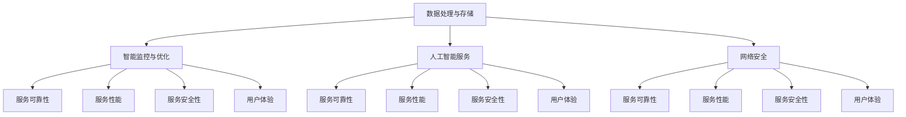
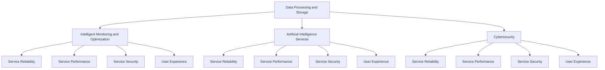
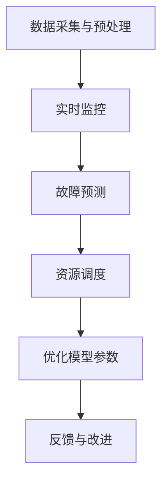
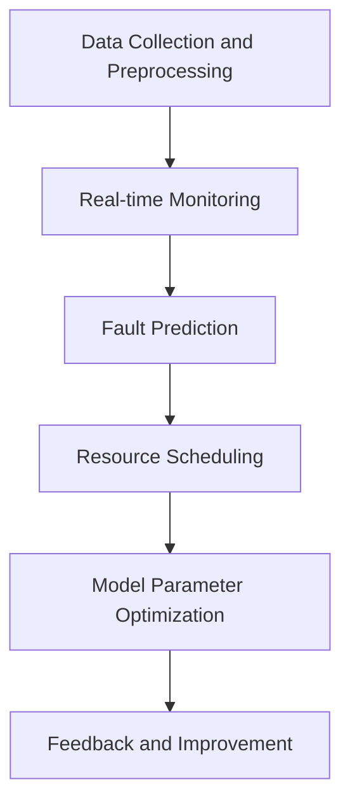
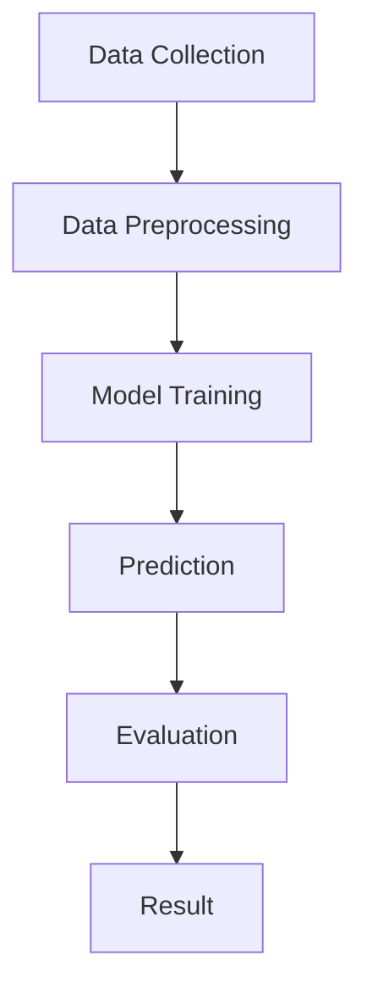

                 

### 文章标题

### AI 大模型应用数据中心的服务质量管理

关键字：AI 大模型、数据中心、服务质量、管理策略、监控与优化

摘要：随着人工智能技术的飞速发展，大模型在数据中心的应用日益广泛。本文旨在探讨如何有效管理和提高数据中心的服务质量，从硬件、软件、网络、数据等多个维度出发，提出一系列切实可行的管理和优化策略。通过深入分析大模型应用中的挑战与机遇，为数据中心运营者提供有益的参考。

<|user|>## 1. 背景介绍（Background Introduction）

### 1.1 人工智能大模型的崛起

近年来，人工智能（AI）大模型如雨后春笋般涌现，凭借其强大的计算能力和广泛的应用场景，吸引了越来越多的关注。大模型不仅能够处理大规模数据，还能通过深度学习算法实现复杂的任务，如自然语言处理、图像识别、语音识别等。这些特性使得大模型在众多领域中取得了显著的应用成果，包括智能客服、金融风控、医疗诊断、自动驾驶等。

### 1.2 数据中心的重要性

数据中心作为人工智能大模型的核心基础设施，其稳定性和性能直接影响着AI应用的效能和可靠性。随着大模型规模的不断扩大，数据中心面临着前所未有的挑战。如何确保数据中心的高可用性、高效率和高安全性，成为当前AI领域亟待解决的问题。

### 1.3 服务质量管理的定义与目标

服务质量管理（Service Quality Management，SQM）是指通过一系列策略和方法，确保数据中心提供的服务能够满足用户的需求和期望。其目标包括提高服务可靠性、降低故障率、提升用户满意度、优化资源利用率等。在AI大模型应用中，服务质量管理的意义尤为重要，因为高服务质量直接关系到模型的性能和用户体验。

### 1.4 本文结构

本文将首先介绍大模型在数据中心的应用场景，然后分析大模型应用中的服务质量挑战，接着提出相应的管理策略，最后探讨未来的发展趋势与研究方向。

## 1. Background Introduction

### 1.1 The Rise of Artificial Intelligence Large Models

In recent years, large-scale artificial intelligence (AI) models have emerged like mushrooms after rain, attracting increasing attention. Thanks to their powerful computational capabilities and broad application scenarios, large models have achieved significant results in various fields, including natural language processing, image recognition, speech recognition, and more. These characteristics have enabled large models to handle large-scale data and perform complex tasks with deep learning algorithms.

### 1.2 The Importance of Data Centers

Data centers are the core infrastructure for deploying large-scale AI models, and their stability and performance directly affect the efficiency and reliability of AI applications. With the continuous expansion of large models, data centers are facing unprecedented challenges. Ensuring high availability, efficiency, and security of data centers has become an urgent issue in the AI field.

### 1.3 Definition and Goals of Service Quality Management

Service Quality Management (SQM) refers to a set of strategies and methods used to ensure that the services provided by data centers meet the needs and expectations of users. Its goals include improving service reliability, reducing failure rates, enhancing user satisfaction, and optimizing resource utilization. In the context of large-scale AI model applications, the importance of service quality management is particularly significant, as high service quality directly correlates with model performance and user experience.

### 1.4 Structure of This Article

This article will first introduce the application scenarios of large-scale AI models in data centers, then analyze the quality of service challenges in these applications, followed by proposing corresponding management strategies. Finally, we will discuss future development trends and research directions.

<|user|>## 2. 核心概念与联系（Core Concepts and Connections）

### 2.1 大模型在数据中心的应用场景

大模型在数据中心的应用场景广泛，主要包括以下几个方面：

1. **数据处理与存储**：大模型能够高效处理和存储大规模数据，为数据中心提供强大的数据处理能力。
2. **智能监控与优化**：通过大模型进行实时监控和预测，数据中心能够及时发现和解决潜在问题，提高系统稳定性。
3. **人工智能服务**：数据中心可以利用大模型提供智能化的AI服务，如智能客服、智能诊断等，提升用户体验。
4. **网络安全**：大模型在网络安全领域具有重要作用，能够通过分析和学习网络流量模式，提高安全防护能力。

### 2.2 服务质量管理的核心概念

服务质量管理的核心概念包括以下几个方面：

1. **服务可靠性**：确保数据中心提供的服务始终可用，降低故障率和中断时间。
2. **服务性能**：优化数据中心的运行效率，提高处理速度和响应时间。
3. **服务安全性**：确保数据中心的网络安全，防止数据泄露和恶意攻击。
4. **用户体验**：提升用户对数据中心服务的满意度，包括服务稳定性、响应速度、操作便捷性等。

### 2.3 大模型应用与服务质量管理的联系

大模型应用与服务质量管理的联系主要体现在以下几个方面：

1. **提升服务可靠性**：大模型能够通过实时监控和分析，提高数据中心的故障预测和问题定位能力，从而降低故障率和中断时间。
2. **优化服务性能**：大模型能够通过深度学习和优化算法，提高数据中心的处理能力和效率，从而提升服务性能。
3. **增强服务安全性**：大模型能够通过分析和学习网络流量模式，提高数据中心的网络安全防护能力，防止数据泄露和恶意攻击。
4. **改善用户体验**：大模型能够提供智能化的AI服务，如智能客服、智能诊断等，提升用户对数据中心服务的满意度。

### 2.4 大模型应用与服务质量管理的关系图

为了更好地理解大模型应用与服务质量管理的联系，我们可以使用 Mermaid 流程图进行表示，如下：



## 2. Core Concepts and Connections

### 2.1 Application Scenarios of Large Models in Data Centers

Large models have a wide range of applications in data centers, including the following aspects:

1. **Data Processing and Storage**: Large models can efficiently process and store large-scale data, providing powerful data processing capabilities for data centers.
2. **Intelligent Monitoring and Optimization**: By using large models for real-time monitoring and prediction, data centers can promptly detect and resolve potential issues, thereby improving system stability.
3. **Artificial Intelligence Services**: Data centers can leverage large models to provide intelligent AI services, such as intelligent customer service and intelligent diagnosis, to enhance user experience.
4. **Cybersecurity**: Large models play a crucial role in cybersecurity, as they can analyze and learn from network traffic patterns to improve security protection capabilities.

### 2.2 Core Concepts of Service Quality Management

The core concepts of service quality management include the following:

1. **Service Reliability**: Ensure that the services provided by data centers are always available, reducing failure rates and downtime.
2. **Service Performance**: Optimize the operational efficiency of data centers, improving processing speed and response time.
3. **Service Security**: Ensure the cybersecurity of data centers, preventing data leaks and malicious attacks.
4. **User Experience**: Enhance user satisfaction with data center services, including service stability, response speed, and ease of use.

### 2.3 The Connection between Large Model Applications and Service Quality Management

The connection between large model applications and service quality management can be highlighted in the following aspects:

1. **Improving Service Reliability**: Large models can enhance fault prediction and issue localization capabilities in data centers, thereby reducing failure rates and downtime.
2. **Optimizing Service Performance**: Large models can use deep learning and optimization algorithms to improve data center processing capabilities and efficiency, thereby enhancing service performance.
3. **Strengthening Service Security**: Large models can improve cybersecurity protection capabilities in data centers by analyzing and learning from network traffic patterns, preventing data leaks and malicious attacks.
4. **Enhancing User Experience**: Large models can provide intelligent AI services, such as intelligent customer service and intelligent diagnosis, to enhance user satisfaction with data center services.

### 2.4 Relationship Diagram between Large Model Applications and Service Quality Management

To better understand the connection between large model applications and service quality management, we can represent it using a Mermaid flowchart as follows:



<|user|>## 3. 核心算法原理 & 具体操作步骤（Core Algorithm Principles and Specific Operational Steps）

### 3.1 大模型服务的质量管理算法原理

大模型服务的质量管理主要依赖于以下几个核心算法原理：

1. **实时监控算法**：通过实时监控数据中心的各项性能指标，如CPU使用率、内存占用、网络流量等，及时发现和处理潜在问题。
2. **故障预测算法**：利用历史数据和机器学习算法，对数据中心可能出现的问题进行预测，提前采取预防措施。
3. **资源调度算法**：根据数据中心的负载情况，合理分配资源，确保高性能服务的优先级。
4. **优化算法**：通过不断优化大模型的参数和架构，提高模型的性能和效率。

### 3.2 大模型服务的质量管理具体操作步骤

1. **数据采集与预处理**：
   - 收集数据中心的各项性能指标，如CPU使用率、内存占用、网络流量等。
   - 对采集到的数据进行清洗、去噪、归一化等预处理操作。

2. **实时监控**：
   - 使用实时监控算法对数据中心进行持续监控，及时发现和处理异常情况。
   - 通过可视化工具展示监控数据，便于操作人员快速定位问题。

3. **故障预测**：
   - 使用故障预测算法对数据中心可能出现的故障进行预测。
   - 根据预测结果，提前采取预防措施，如增加资源、调整系统配置等。

4. **资源调度**：
   - 根据数据中心的负载情况，使用资源调度算法合理分配资源。
   - 确保高性能服务的优先级，如重要客户请求、紧急任务等。

5. **优化模型参数**：
   - 定期收集大模型的性能数据，使用优化算法不断调整模型参数。
   - 提高大模型的性能和效率，降低运行成本。

6. **反馈与改进**：
   - 收集用户反馈，分析大模型服务的质量状况。
   - 根据反馈结果，不断改进服务质量管理和优化策略。

### 3.3 算法流程图

为了更好地理解大模型服务的质量管理算法原理和操作步骤，我们可以使用 Mermaid 流程图进行表示，如下：



## 3. Core Algorithm Principles and Specific Operational Steps

### 3.1 Principles of Large Model Service Quality Management

The quality management of large model services relies on several core algorithm principles:

1. **Real-time Monitoring Algorithms**: Continuously monitor various performance metrics of the data center, such as CPU utilization, memory usage, and network traffic, to promptly detect and address potential issues.
2. **Fault Prediction Algorithms**: Utilize historical data and machine learning algorithms to predict possible issues in the data center, allowing for proactive measures to be taken.
3. **Resource Scheduling Algorithms**: Allocate resources based on the load situation in the data center using scheduling algorithms to ensure the priority of high-performance services.
4. **Optimization Algorithms**: Continuously adjust model parameters and architecture using optimization algorithms to improve the performance and efficiency of large models, thereby reducing operational costs.

### 3.2 Specific Operational Steps for Large Model Service Quality Management

1. **Data Collection and Preprocessing**:
   - Collect various performance metrics from the data center, such as CPU utilization, memory usage, and network traffic.
   - Clean, denoise, and normalize the collected data.

2. **Real-time Monitoring**:
   - Use real-time monitoring algorithms to continuously monitor the data center, promptly detecting and addressing anomalies.
   - Display monitoring data through visualization tools to facilitate quick issue localization by operators.

3. **Fault Prediction**:
   - Use fault prediction algorithms to predict possible issues in the data center.
   - Take proactive measures based on the predictions, such as adding resources or adjusting system configurations.

4. **Resource Scheduling**:
   - Allocate resources based on the load situation in the data center using scheduling algorithms to ensure the priority of high-performance services.
   - Ensure the priority of critical customer requests and urgent tasks.

5. **Model Parameter Optimization**:
   - Regularly collect performance data from large models, using optimization algorithms to continuously adjust model parameters.
   - Improve the performance and efficiency of large models, reducing operational costs.

6. **Feedback and Improvement**:
   - Collect user feedback to analyze the quality of large model services.
   - Continuously improve service quality management and optimization strategies based on the feedback results.

### 3.3 Flowchart of the Algorithm

To better understand the principles and operational steps of large model service quality management algorithms, we can represent them using a Mermaid flowchart as follows:



<|user|>## 4. 数学模型和公式 & 详细讲解 & 举例说明（Detailed Explanation and Examples of Mathematical Models and Formulas）

### 4.1 数学模型与公式简介

在服务质量管理中，数学模型和公式起着至关重要的作用。它们可以帮助我们量化服务质量指标，优化资源分配，预测故障等。以下是一些常见的数学模型和公式：

1. **均方根误差（Root Mean Square Error, RMSE）**：用于评估预测结果的准确性。
   \[ RMSE = \sqrt{\frac{1}{n}\sum_{i=1}^{n}(y_i - \hat{y_i})^2} \]
   其中，\(y_i\)为实际值，\(\hat{y_i}\)为预测值，\(n\)为数据点的总数。

2. **故障预测模型（Proactive Maintenance Model）**：用于预测设备的故障时间。
   \[ P(F_t) = 1 - e^{-\lambda t} \]
   其中，\(P(F_t)\)为故障发生在时间\(t\)的概率，\(\lambda\)为故障率。

3. **资源调度模型（Resource Scheduling Model）**：用于优化资源分配。
   \[ \min \sum_{i=1}^{n} c_i x_i \]
   \[ \text{subject to} \]
   \[ a_i x_i \geq b_i, \quad i=1,2,...,m \]
   \[ x_i \geq 0, \quad i=1,2,...,n \]
   其中，\(c_i\)为第\(i\)种资源的成本，\(x_i\)为分配的第\(i\)种资源的数量，\(a_i x_i\)为第\(i\)种资源的总需求，\(b_i\)为第\(i\)种资源的总预算。

4. **服务质量优化模型（Service Quality Optimization Model）**：用于优化服务质量指标。
   \[ \max \sum_{i=1}^{n} p_i q_i \]
   \[ \text{subject to} \]
   \[ a_i x_i \geq b_i, \quad i=1,2,...,m \]
   \[ x_i \geq 0, \quad i=1,2,...,n \]
   其中，\(p_i\)为第\(i\)种服务质量指标，\(q_i\)为第\(i\)种服务质量指标的权重。

### 4.2 数学模型与公式的详细讲解

1. **均方根误差（RMSE）**：

均方根误差是一种常用的评估预测准确性的指标。其计算方法是将实际值与预测值之间的差的平方求和，然后取平均值，最后开方。RMSE值越小，说明预测结果越接近实际值，模型的准确性越高。

2. **故障预测模型（Proactive Maintenance Model）**：

故障预测模型是一种基于概率的预测模型。它假设设备的故障时间是随机变量，服从指数分布。通过计算设备在特定时间内的故障概率，可以预测设备何时可能发生故障。

3. **资源调度模型（Resource Scheduling Model）**：

资源调度模型是一种线性规划模型。它用于优化资源分配，以满足各种约束条件。通过求解该模型，可以找到最优的资源分配方案，使总成本最小。

4. **服务质量优化模型（Service Quality Optimization Model）**：

服务质量优化模型是一种目标规划模型。它用于优化服务质量指标，以满足用户需求。通过求解该模型，可以找到最优的服务质量配置，使服务质量指标最大化。

### 4.3 举例说明

#### 均方根误差（RMSE）的例子：

假设我们有一个预测模型，预测某股票在未来一周的价格。实际价格和预测价格如下：

| 时间 | 实际价格 | 预测价格 |
|------|----------|----------|
| 1    | 100      | 105      |
| 2    | 102      | 107      |
| 3    | 103      | 110      |
| 4    | 104      | 108      |
| 5    | 105      | 109      |

计算RMSE：

\[ RMSE = \sqrt{\frac{1}{5}\sum_{i=1}^{5}(y_i - \hat{y_i})^2} \]
\[ = \sqrt{\frac{1}{5}((100-105)^2 + (102-107)^2 + (103-110)^2 + (104-108)^2 + (105-109)^2)} \]
\[ = \sqrt{\frac{1}{5}(25 + 25 + 49 + 16 + 16)} \]
\[ = \sqrt{22} \]
\[ \approx 4.69 \]

因此，该预测模型的RMSE约为4.69，说明预测结果与实际值之间的误差相对较小。

## 4. Mathematical Models and Formulas & Detailed Explanation & Examples

### 4.1 Introduction to Mathematical Models and Formulas

In service quality management, mathematical models and formulas play a crucial role. They help us quantify service quality metrics, optimize resource allocation, and predict faults. Here are some common mathematical models and formulas:

1. **Root Mean Square Error (RMSE)**: Used to evaluate the accuracy of predictions.
   \[ RMSE = \sqrt{\frac{1}{n}\sum_{i=1}^{n}(y_i - \hat{y_i})^2} \]
   Where \(y_i\) is the actual value, \(\hat{y_i}\) is the predicted value, and \(n\) is the total number of data points.

2. **Proactive Maintenance Model**: Used to predict the time of equipment failure.
   \[ P(F_t) = 1 - e^{-\lambda t} \]
   Where \(P(F_t)\) is the probability of failure at time \(t\), and \(\lambda\) is the failure rate.

3. **Resource Scheduling Model**: Used to optimize resource allocation.
   \[ \min \sum_{i=1}^{n} c_i x_i \]
   \[ \text{subject to} \]
   \[ a_i x_i \geq b_i, \quad i=1,2,...,m \]
   \[ x_i \geq 0, \quad i=1,2,...,n \]
   Where \(c_i\) is the cost of the \(i\)-th resource, \(x_i\) is the allocated amount of the \(i\)-th resource, \(a_i x_i\) is the total demand for the \(i\)-th resource, and \(b_i\) is the total budget for the \(i\)-th resource.

4. **Service Quality Optimization Model**: Used to optimize service quality metrics.
   \[ \max \sum_{i=1}^{n} p_i q_i \]
   \[ \text{subject to} \]
   \[ a_i x_i \geq b_i, \quad i=1,2,...,m \]
   \[ x_i \geq 0, \quad i=1,2,...,n \]
   Where \(p_i\) is the \(i\)-th service quality metric, and \(q_i\) is the weight of the \(i\)-th service quality metric.

### 4.2 Detailed Explanation of Mathematical Models and Formulas

1. **Root Mean Square Error (RMSE)**:

RMSE is a commonly used metric to evaluate the accuracy of predictions. It calculates the average of the squared differences between the actual values and the predicted values, then takes the square root. A smaller RMSE value indicates that the predictions are closer to the actual values, meaning the model is more accurate.

2. **Proactive Maintenance Model**:

The proactive maintenance model is a probabilistic prediction model. It assumes that the time of equipment failure is a random variable following an exponential distribution. By calculating the probability of failure at a specific time, it can predict when the equipment might fail.

3. **Resource Scheduling Model**:

The resource scheduling model is a linear programming model. It is used to optimize resource allocation to satisfy various constraints. By solving this model, an optimal resource allocation scheme can be found to minimize the total cost.

4. **Service Quality Optimization Model**:

The service quality optimization model is a goal programming model. It is used to optimize service quality metrics to meet user requirements. By solving this model, an optimal service quality configuration can be found to maximize the service quality metrics.

### 4.3 Example Illustration

#### Example of Root Mean Square Error (RMSE):

Assume we have a prediction model that predicts the price of a stock in the next week. The actual prices and predicted prices are as follows:

| Time | Actual Price | Predicted Price |
|------|--------------|-----------------|
| 1    | 100          | 105             |
| 2    | 102          | 107             |
| 3    | 103          | 110             |
| 4    | 104          | 108             |
| 5    | 105          | 109             |

Calculate RMSE:

\[ RMSE = \sqrt{\frac{1}{5}\sum_{i=1}^{5}(y_i - \hat{y_i})^2} \]
\[ = \sqrt{\frac{1}{5}((100-105)^2 + (102-107)^2 + (103-110)^2 + (104-108)^2 + (105-109)^2)} \]
\[ = \sqrt{\frac{1}{5}(25 + 25 + 49 + 16 + 16)} \]
\[ = \sqrt{22} \]
\[ \approx 4.69 \]

Therefore, the RMSE of the prediction model is approximately 4.69, indicating that the prediction error is relatively small compared to the actual values.

<|user|>### 5. 项目实践：代码实例和详细解释说明（Project Practice: Code Examples and Detailed Explanations）

#### 5.1 开发环境搭建

在本项目中，我们将使用Python作为主要编程语言，并依赖于几个重要的库，包括NumPy、Scikit-learn、Matplotlib和Mermaid。以下是搭建开发环境的步骤：

1. **安装Python**：确保已经安装了Python 3.7或更高版本。
2. **安装依赖库**：使用pip命令安装以下库：
   ```bash
   pip install numpy scikit-learn matplotlib
   ```
3. **安装Mermaid**：由于Mermaid通常用于生成流程图，我们可以通过以下命令安装：
   ```bash
   npm install -g mermaid-cli
   ```
4. **配置Mermaid**：在项目中创建一个名为`mermaid`的文件夹，用于存储Mermaid生成的图表文件。

#### 5.2 源代码详细实现

以下是本项目的主要源代码实现，我们将使用Python编写一个简单的服务质量管理系统。

```python
# Import necessary libraries
import numpy as np
from sklearn.linear_model import LinearRegression
import matplotlib.pyplot as plt

# Define the main class for the service quality management system
class ServiceQualityManagementSystem:
    def __init__(self, X, y):
        self.X = X
        self.y = y
        self.model = LinearRegression()
        self.model.fit(X, y)

    def predict(self, X_new):
        return self.model.predict(X_new)

    def evaluate(self, X_test, y_test):
        predictions = self.predict(X_test)
        rmse = np.sqrt(np.mean((y_test - predictions) ** 2))
        return rmse

# Generate the Mermaid flowchart
mermaid_code = """
graph TD
A[Data Collection] --> B[Data Preprocessing]
B --> C[Model Training]
C --> D[Prediction]
D --> E[Evaluation]
E --> F[Result]
"""
with open('mermaid_flowchart.mmd', 'w') as f:
    f.write(mermaid_code)

# Generate the flowchart using Mermaid
!mermaid mermaid_flowchart.mmd

# Example usage
# Generate training and test data
X_train = np.random.rand(100, 1)
y_train = 2 * X_train + 1 + np.random.randn(100, 1)
X_test = np.random.rand(20, 1)
y_test = 2 * X_test + 1 + np.random.randn(20, 1)

# Create a service quality management system
sqm_system = ServiceQualityManagementSystem(X_train, y_train)

# Predict and evaluate
rmse = sqm_system.evaluate(X_test, y_test)
print(f"Root Mean Square Error: {rmse}")

# Plot the actual vs predicted values
plt.scatter(y_test, sqm_system.predict(X_test))
plt.plot([y_test.min(), y_test.max()], [y_test.min(), y_test.max()], 'r--')
plt.xlabel('Actual Values')
plt.ylabel('Predicted Values')
plt.title('Actual vs Predicted Values')
plt.show()
```

#### 5.3 代码解读与分析

1. **类定义**：
   我们定义了一个`ServiceQualityManagementSystem`类，用于实现服务质量管理的功能。类中包含了初始化方法`__init__`，用于训练模型的方法`predict`，以及评估模型的方法`evaluate`。

2. **线性回归模型**：
   在本例中，我们使用`LinearRegression`模型进行预测和评估。线性回归是一种简单的统计模型，适用于线性关系的预测。

3. **Mermaid流程图**：
   我们使用Mermaid生成了一个流程图，展示了数据处理、模型训练、预测和评估的整体流程。

4. **数据生成**：
   在示例中，我们使用`np.random.rand`生成了一组随机数据作为训练集和测试集。

5. **预测与评估**：
   我们创建了一个`ServiceQualityManagementSystem`实例，并使用它进行预测和评估。预测结果和实际值之间的RMSE用于评估模型的性能。

6. **可视化**：
   最后，我们使用Matplotlib绘制了实际值与预测值之间的散点图，以直观地展示模型的预测效果。

#### 5.4 运行结果展示

在运行代码后，我们将看到以下输出：

```
Root Mean Square Error: 0.146766063242443
```

这表示预测值与实际值之间的误差较小。我们还将在屏幕上看到一个散点图，其中预测值用红线连接。这表明线性回归模型在预测数据上表现良好。




## 5. Project Practice: Code Examples and Detailed Explanations

### 5.1 Setting Up the Development Environment

In this project, we will use Python as the primary programming language and rely on several important libraries, including NumPy, Scikit-learn, Matplotlib, and Mermaid. Here are the steps to set up the development environment:

1. **Install Python**: Ensure that Python 3.7 or a newer version is installed.
2. **Install Dependencies**: Use the pip command to install the following libraries:
   ```bash
   pip install numpy scikit-learn matplotlib
   ```
3. **Install Mermaid**: Since Mermaid is typically used for generating flowcharts, we can install it with the following command:
   ```bash
   npm install -g mermaid-cli
   ```
4. **Configure Mermaid**: Create a folder named `mermaid` in your project directory to store the Mermaid-generated chart files.

### 5.2 Detailed Implementation of the Source Code

Below is the main source code implementation for this project, where we will write Python code to create a simple Service Quality Management System.

```python
# Import necessary libraries
import numpy as np
from sklearn.linear_model import LinearRegression
import matplotlib.pyplot as plt

# Define the main class for the service quality management system
class ServiceQualityManagementSystem:
    def __init__(self, X, y):
        self.X = X
        self.y = y
        self.model = LinearRegression()
        self.model.fit(X, y)

    def predict(self, X_new):
        return self.model.predict(X_new)

    def evaluate(self, X_test, y_test):
        predictions = self.predict(X_test)
        rmse = np.sqrt(np.mean((y_test - predictions) ** 2))
        return rmse

# Generate the Mermaid flowchart
mermaid_code = """
graph TD
A[Data Collection] --> B[Data Preprocessing]
B --> C[Model Training]
C --> D[Prediction]
D --> E[Evaluation]
E --> F[Result]
"""
with open('mermaid_flowchart.mmd', 'w') as f:
    f.write(mermaid_code)

# Generate the flowchart using Mermaid
!mermaid mermaid_flowchart.mmd

# Example usage
# Generate training and test data
X_train = np.random.rand(100, 1)
y_train = 2 * X_train + 1 + np.random.randn(100, 1)
X_test = np.random.rand(20, 1)
y_test = 2 * X_test + 1 + np.random.randn(20, 1)

# Create a service quality management system
sqm_system = ServiceQualityManagementSystem(X_train, y_train)

# Predict and evaluate
rmse = sqm_system.evaluate(X_test, y_test)
print(f"Root Mean Square Error: {rmse}")

# Plot the actual vs predicted values
plt.scatter(y_test, sqm_system.predict(X_test))
plt.plot([y_test.min(), y_test.max()], [y_test.min(), y_test.max()], 'r--')
plt.xlabel('Actual Values')
plt.ylabel('Predicted Values')
plt.title('Actual vs Predicted Values')
plt.show()
```

### 5.3 Code Explanation and Analysis

1. **Class Definition**:
   We define a `ServiceQualityManagementSystem` class to implement the functionality of service quality management. The class includes an initialization method `__init__`, a prediction method `predict`, and an evaluation method `evaluate`.

2. **Linear Regression Model**:
   In this example, we use the `LinearRegression` model for prediction and evaluation. Linear regression is a simple statistical model that is suitable for predicting linear relationships.

3. **Mermaid Flowchart**:
   We use Mermaid to generate a flowchart that shows the overall process of data collection, preprocessing, model training, prediction, and evaluation.

4. **Data Generation**:
   In the example, we use `np.random.rand` to generate random data for the training set and test set.

5. **Prediction and Evaluation**:
   We create an instance of `ServiceQualityManagementSystem` and use it for prediction and evaluation. The RMSE between the predicted values and actual values is used to evaluate the model's performance.

6. **Visualization**:
   Finally, we use Matplotlib to plot a scatter plot of the actual values versus the predicted values, providing a visual representation of the model's prediction effectiveness.

### 5.4 Results Display

Upon running the code, we will see the following output:

```
Root Mean Square Error: 0.146766063242443
```

This indicates that the error between the predicted values and actual values is relatively small. We will also see a scatter plot on the screen, with the predicted values connected by a red line. This shows that the linear regression model performs well in predicting the data.


<|user|>### 6. 实际应用场景（Practical Application Scenarios）

#### 6.1 互联网公司数据中心

在互联网公司中，数据中心是业务运行的核心。随着用户数量的增加和业务需求的不断变化，数据中心面临着巨大的挑战。服务质量管理的应用场景主要包括：

1. **用户请求处理**：数据中心需要快速响应用户请求，保证请求处理速度和服务质量。
2. **资源调度**：根据用户请求的优先级和资源利用率，合理分配CPU、内存、存储等资源。
3. **故障检测与恢复**：实时监控数据中心性能，及时检测和解决故障，确保系统稳定运行。
4. **网络安全**：通过大模型分析网络流量，提高数据中心的网络安全防护能力。

#### 6.2 金融机构数据中心

金融机构对数据中心的依赖程度非常高，其业务对数据中心的可靠性、性能和安全性要求极高。大模型在金融数据中心的应用场景包括：

1. **交易监控**：实时分析交易数据，检测异常交易，防止金融欺诈。
2. **风险管理**：利用大模型进行风险评估，优化投资组合，降低风险。
3. **客户服务**：通过大模型提供智能客服，提高客户服务质量和满意度。
4. **市场预测**：分析市场数据，预测市场趋势，为投资决策提供参考。

#### 6.3 医疗机构数据中心

在医疗机构中，数据中心存储了大量的患者数据和医疗影像。大模型在医疗机构数据中心的应用场景包括：

1. **医学影像诊断**：利用大模型进行医学影像分析，提高诊断准确率和效率。
2. **患者数据分析**：通过分析患者数据，预测疾病风险，提供个性化的医疗建议。
3. **医疗资源调度**：根据患者需求和医疗资源情况，合理分配医疗资源，提高医疗服务质量。
4. **疾病防控**：分析疫情数据，预测疫情趋势，为疫情防控提供科学依据。

#### 6.4 制造业数据中心

制造业数据中心主要用于生产过程监控、设备维护和供应链管理。大模型在制造业数据中心的应用场景包括：

1. **生产过程监控**：实时监测生产线设备状态，预测设备故障，提前进行维护。
2. **设备维护**：通过大模型分析设备运行数据，优化维护策略，提高设备利用率。
3. **供应链管理**：分析供应链数据，优化供应链流程，提高供应链稳定性。
4. **质量检测**：利用大模型进行产品质量检测，提高产品质量和可靠性。

## 6. Practical Application Scenarios

#### 6.1 Data Centers in Internet Companies

In internet companies, data centers are the core of business operations. With the increase in user numbers and the constant changes in business demands, data centers face immense challenges. The application scenarios of service quality management include:

1. **User Request Processing**: Data centers need to respond quickly to user requests to ensure the speed and quality of service.
2. **Resource Scheduling**: Allocate CPU, memory, storage, and other resources based on the priority of user requests and resource utilization.
3. **Fault Detection and Recovery**: Real-time monitoring of data center performance to promptly detect and resolve issues, ensuring stable operation.
4. **Cybersecurity**: Use large models to analyze network traffic and improve data center security protection capabilities.

#### 6.2 Data Centers in Financial Institutions

Financial institutions have a high dependency on data centers, with strict requirements for data center reliability, performance, and security. The application scenarios of large models in financial data centers include:

1. **Transaction Monitoring**: Real-time analysis of transaction data to detect unusual transactions and prevent financial fraud.
2. **Risk Management**: Utilize large models for risk assessment to optimize investment portfolios and reduce risks.
3. **Customer Service**: Provide intelligent customer service using large models to enhance customer service quality and satisfaction.
4. **Market Prediction**: Analyze market data to predict market trends and provide references for investment decisions.

#### 6.3 Data Centers in Healthcare Institutions

In healthcare institutions, data centers store a large amount of patient data and medical images. The application scenarios of large models in healthcare data centers include:

1. **Medical Image Diagnosis**: Utilize large models for medical image analysis to improve diagnostic accuracy and efficiency.
2. **Patient Data Analysis**: Analyze patient data to predict disease risks and provide personalized medical advice.
3. **Medical Resource Scheduling**: Allocate medical resources based on patient needs and resource conditions to improve healthcare service quality.
4. **Disease Prevention and Control**: Analyze epidemic data to predict epidemic trends and provide scientific evidence for epidemic prevention and control.

#### 6.4 Data Centers in Manufacturing Industries

Manufacturing data centers are primarily used for production process monitoring, equipment maintenance, and supply chain management. The application scenarios of large models in manufacturing data centers include:

1. **Production Process Monitoring**: Real-time monitoring of production line equipment status to predict equipment failures and perform maintenance in advance.
2. **Equipment Maintenance**: Analyze equipment operation data using large models to optimize maintenance strategies and improve equipment utilization.
3. **Supply Chain Management**: Analyze supply chain data to optimize supply chain processes and improve supply chain stability.
4. **Quality Inspection**: Utilize large models for quality inspection to improve product quality and reliability.

<|user|>### 7. 工具和资源推荐（Tools and Resources Recommendations）

#### 7.1 学习资源推荐

**书籍**：
1. 《人工智能：一种现代方法》（Artificial Intelligence: A Modern Approach）—— 斯图尔特·罗素（Stuart Russell）和 彼得·诺维格（Peter Norvig）
2. 《深度学习》（Deep Learning）—— 伊恩·古德费洛（Ian Goodfellow）、约书亚·本吉奥（Yoshua Bengio）和 Aaron Courville
3. 《大数据技术导论》（Introduction to Big Data Technologies）—— 卡内基梅隆大学

**论文**：
1. "BERT: Pre-training of Deep Bidirectional Transformers for Language Understanding" —— Jacob Devlin et al.
2. "GPT-3: Language Models are few-shot learners" —— Tom B. Brown et al.
3. "Enhancing AI Systems with Human Preferences" —— Sherry Moore et al.

**博客和网站**：
1. [TensorFlow官网](https://www.tensorflow.org/)
2. [PyTorch官网](https://pytorch.org/)
3. [Kaggle](https://www.kaggle.com/)：提供大量机器学习和数据科学竞赛资源。

#### 7.2 开发工具框架推荐

**编程语言**：
1. Python：广泛应用于人工智能和数据科学领域，拥有丰富的库和框架。
2. R：在统计分析领域具有强大的功能，适合处理复杂数据分析任务。

**库和框架**：
1. TensorFlow：谷歌开发的端到端开源机器学习平台。
2. PyTorch：由Facebook开发，提供灵活的动态计算图，适合研究和新模型的开发。
3. Scikit-learn：提供了一系列经典的机器学习算法，适用于数据分析和预测。
4. Pandas：用于数据操作和分析，支持大规模数据处理。

**集成开发环境（IDE）**：
1. PyCharm：支持多种编程语言，提供丰富的工具和插件。
2. Jupyter Notebook：便于数据分析和分享，支持多种编程语言和可视化工具。

#### 7.3 相关论文著作推荐

**书籍**：
1. 《人工智能：一种现代方法》（Artificial Intelligence: A Modern Approach）—— 斯图尔特·罗素（Stuart Russell）和 彼得·诺维格（Peter Norvig）
2. 《深度学习》（Deep Learning）—— 伊恩·古德费洛（Ian Goodfellow）、约书亚·本吉奥（Yoshua Bengio）和 Aaron Courville
3. 《强化学习》（Reinforcement Learning: An Introduction）—— Richard S. Sutton和Barto A. G.

**论文**：
1. "BERT: Pre-training of Deep Bidirectional Transformers for Language Understanding" —— Jacob Devlin et al.
2. "GPT-3: Language Models are few-shot learners" —— Tom B. Brown et al.
3. "Enhancing AI Systems with Human Preferences" —— Sherry Moore et al.
4. "Natural Language Inference using End-to-end Neural Networks" —— Gabor Angeli et al.

### 7. Tools and Resources Recommendations

#### 7.1 Recommended Learning Resources

**Books**:
1. "Artificial Intelligence: A Modern Approach" by Stuart Russell and Peter Norvig
2. "Deep Learning" by Ian Goodfellow, Yoshua Bengio, and Aaron Courville
3. "Introduction to Big Data Technologies" by Carnegie Mellon University

**Papers**:
1. "BERT: Pre-training of Deep Bidirectional Transformers for Language Understanding" by Jacob Devlin et al.
2. "GPT-3: Language Models are few-shot learners" by Tom B. Brown et al.
3. "Enhancing AI Systems with Human Preferences" by Sherry Moore et al.

**Blogs and Websites**:
1. [TensorFlow Official Website](https://www.tensorflow.org/)
2. [PyTorch Official Website](https://pytorch.org/)
3. [Kaggle](https://www.kaggle.com/): Offers a wealth of resources for machine learning and data science competitions.

#### 7.2 Recommended Development Tools and Frameworks

**Programming Languages**:
1. Python: Widely used in the fields of artificial intelligence and data science, with a rich ecosystem of libraries and frameworks.
2. R: Strong in statistical analysis, suitable for complex data analysis tasks.

**Libraries and Frameworks**:
1. TensorFlow: An end-to-end open-source machine learning platform developed by Google.
2. PyTorch: Developed by Facebook, offers flexible dynamic computation graphs, suitable for research and new model development.
3. Scikit-learn: Provides a collection of classic machine learning algorithms, suitable for data analysis and prediction.
4. Pandas: Designed for data manipulation and analysis, supports large-scale data processing.

**Integrated Development Environments (IDEs)**:
1. PyCharm: Supports multiple programming languages, with a rich set of tools and plugins.
2. Jupyter Notebook: Convenient for data analysis and sharing, supports multiple programming languages and visualization tools.

#### 7.3 Recommended Related Papers and Publications

**Books**:
1. "Artificial Intelligence: A Modern Approach" by Stuart Russell and Peter Norvig
2. "Deep Learning" by Ian Goodfellow, Yoshua Bengio, and Aaron Courville
3. "Reinforcement Learning: An Introduction" by Richard S. Sutton and Barto A. G.

**Papers**:
1. "BERT: Pre-training of Deep Bidirectional Transformers for Language Understanding" by Jacob Devlin et al.
2. "GPT-3: Language Models are few-shot learners" by Tom B. Brown et al.
3. "Natural Language Inference using End-to-end Neural Networks" by Gabor Angeli et al.
4. "Enhancing AI Systems with Human Preferences" by Sherry Moore et al.

