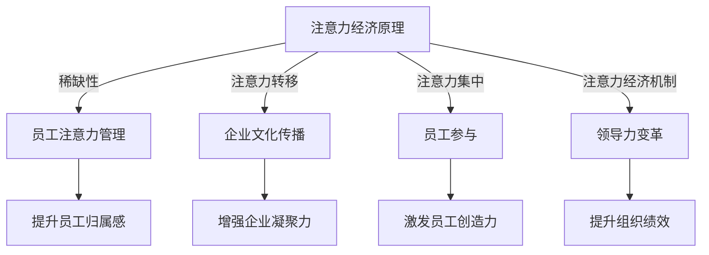

                 

### 文章标题

**注意力经济对企业文化建设的影响**

## 关键词：
注意力经济、企业文化建设、组织行为、领导力、战略管理

## 摘要：
本文深入探讨了注意力经济对企业文化建设的影响。通过分析注意力经济的基本原理和其对企业组织行为的潜在作用，本文提出了如何利用注意力经济原则来强化企业文化的建设，提高员工满意度和组织绩效。文章结合具体案例，探讨了注意力经济在不同行业和企业中的实际应用，并提出了未来研究的方向。

<|assistant|>### 1. 背景介绍（Background Introduction）

注意力经济（Attention Economy）是21世纪初期由学者尼古拉斯·尼葛洛庞帝（Nicholas Negroponte）提出的一个概念，指的是在一个信息过载的环境中，人们对于注意力资源的争夺。随着互联网和社交媒体的快速发展，注意力经济逐渐成为理解数字化时代组织和市场行为的重要框架。它强调，在信息爆炸的时代，获取和保持人们的注意力比以往任何时候都更为重要。

企业文化建设是企业长期战略的重要组成部分，它涉及到企业核心价值观、行为规范和员工认同感的塑造。一个积极的企业文化能够提升员工的归属感，促进团队合作，增加创新能力，最终提高企业的竞争力和绩效。然而，在注意力经济的背景下，企业文化建设面临着新的挑战和机遇。

在注意力经济的影响下，企业必须更加注重如何吸引和保持员工的注意力。传统的企业文化建设方法可能不再适用于当前的信息化环境。因此，本文旨在探讨注意力经济如何影响企业文化建设，并提出相应的策略和建议，以帮助企业更好地应对这一挑战。

### 2. 核心概念与联系（Core Concepts and Connections）

#### 2.1 注意力经济的原理

注意力经济基于以下几个核心概念：

1. **稀缺性**：在信息过载的现代社会，人们的注意力资源是有限的，因此任何能够有效吸引注意力的内容或行为都具有较高的价值。
2. **注意力转移**：在多任务环境中，个体的注意力容易分散，因此如何保持持续的关注成为关键。
3. **注意力集中**：通过创造独特、有价值的内容或体验，可以引导个体将注意力集中在一个特定的目标上。
4. **注意力经济机制**：这包括一系列策略，如个性化推荐、内容优化、用户体验设计等，以最大限度地吸引和保持用户的注意力。

#### 2.2 企业文化建设的关联

企业文化建设的核心在于构建一种能够激发员工创造力和归属感的氛围。注意力经济与企业文化建设之间的关联可以从以下几个方面进行探讨：

1. **员工注意力管理**：企业需要通过各种手段管理员工的注意力，包括提供有吸引力的工作环境、明确的工作目标和激励措施等。
2. **企业文化传播**：在注意力经济时代，企业需要利用各种媒体和平台来传播企业文化，以吸引和保留员工的注意力。
3. **员工参与**：通过增加员工的参与度，可以提升他们对企业文化的认同感和忠诚度，从而增强企业凝聚力。
4. **领导力的变革**：领导者需要适应注意力经济的要求，通过有效的沟通和领导风格来引导和激励员工。

#### 2.3 Mermaid 流程图

下面是一个简单的 Mermaid 流程图，展示了注意力经济与企业文化建设之间的关联。



### 3. 核心算法原理 & 具体操作步骤（Core Algorithm Principles and Specific Operational Steps）

#### 3.1 注意力经济的算法原理

注意力经济的核心在于如何利用算法原理来吸引和保持人们的注意力。以下是一些基本算法原理：

1. **内容推荐算法**：通过分析用户的历史行为和兴趣，推荐个性化的内容，以吸引用户的注意力。
2. **行为反馈循环**：通过用户的互动行为（如点击、分享、评论等）不断调整和优化推荐内容，以保持用户的兴趣。
3. **互动设计**：设计有趣、互动性强的用户体验，使用户在互动过程中产生积极的情感体验，从而吸引注意力。

#### 3.2 企业文化建设中的操作步骤

为了利用注意力经济原则来强化企业文化建设，企业可以采取以下具体操作步骤：

1. **明确企业愿景和价值观**：确保所有员工对企业愿景和价值观有清晰的认识，并将其作为日常工作和行为指南。
2. **个性化员工体验**：通过分析员工的行为数据，提供个性化的培训和发展机会，以提升员工满意度和参与度。
3. **利用多媒体传播企业文化**：利用视频、图像、故事等多种形式，通过社交媒体和内部通讯平台传播企业文化，以吸引员工的注意力。
4. **鼓励员工参与**：通过举办各种活动、竞赛和反馈机制，鼓励员工参与企业文化的建设和传播。
5. **领导者示范作用**：领导者需要以身作则，通过言行一致的行为来示范企业价值观，以增强员工的认同感。

### 4. 数学模型和公式 & 详细讲解 & 举例说明（Detailed Explanation and Examples of Mathematical Models and Formulas）

#### 4.1 数学模型在注意力经济中的应用

在注意力经济中，一些数学模型可以用来分析和优化注意力资源的分配。以下是一些常用的数学模型：

1. **优化模型**：用于最大化注意力资源的利用效率。例如，可以通过优化内容推荐策略，提高用户对推荐内容的点击率。
2. **博弈论模型**：用于分析不同个体在注意力资源争夺中的策略选择。例如，可以通过研究广告商和用户之间的博弈，优化广告投放策略。
3. **网络模型**：用于分析注意力在网络中的流动和传播。例如，可以通过研究社交媒体网络中的关注关系，预测信息的传播路径和影响力。

#### 4.2 举例说明

假设一个企业希望通过优化员工培训内容的推荐来提高员工的参与度和学习效果。可以使用以下优化模型：

1. **目标函数**：最大化员工对培训内容的点击率。
2. **约束条件**：保证培训内容的质量和多样性。

具体的数学模型可以表示为：

$$
\max_{x} \sum_{i=1}^{n} p(i|x) \cdot q(i)
$$

其中，$p(i|x)$ 表示员工选择内容 $i$ 的概率，$q(i)$ 表示内容 $i$ 的质量。

通过使用这个优化模型，企业可以识别出最受欢迎和高质量的培训内容，从而提高员工的参与度和学习效果。

### 5. 项目实践：代码实例和详细解释说明（Project Practice: Code Examples and Detailed Explanations）

#### 5.1 开发环境搭建

为了演示如何利用注意力经济原则来强化企业文化建设，我们构建了一个简单的虚拟企业环境。以下是如何搭建开发环境的步骤：

1. **安装Python环境**：确保Python 3.8或更高版本已安装。
2. **安装相关库**：安装numpy、pandas、matplotlib等库，用于数据处理和可视化。
3. **配置虚拟环境**：使用venv创建一个虚拟环境，并在其中安装必要的库。

```bash
python -m venv myenv
source myenv/bin/activate
pip install numpy pandas matplotlib
```

#### 5.2 源代码详细实现

下面是用于模拟企业文化建设过程的Python代码示例。代码主要分为三个部分：数据收集、内容推荐和效果评估。

```python
import numpy as np
import pandas as pd
import matplotlib.pyplot as plt

# 假设我们收集了员工对培训内容的点击数据
data = {
    'employee': ['A', 'B', 'C', 'D', 'E'],
    'content': ['Content 1', 'Content 2', 'Content 3', 'Content 4', 'Content 5'],
    'clicks': [10, 5, 15, 8, 12]
}

df = pd.DataFrame(data)

# 1. 数据收集
def collect_data(df):
    # 根据员工点击数据，计算内容的受欢迎程度
    popularity = df.groupby('content')['clicks'].sum()
    return popularity

popularity = collect_data(df)

# 2. 内容推荐
def content_recommendation(popularity, k=3):
    # 推荐受欢迎的前k个内容
    recommended = popularity.nlargest(k)
    return recommended

recommended = content_recommendation(popularity)

# 3. 效果评估
def evaluate_recommendation(df, recommended):
    # 计算推荐内容的新点击率
    new_clicks = df[df['content'].isin(recommended.index)]['clicks']
    return new_clicks.sum()

new_clicks = evaluate_recommendation(df, recommended)

print("Recommended contents:", recommended)
print("New clicks after recommendation:", new_clicks)

# 可视化推荐内容
recommended.plot(kind='bar')
plt.title('Recommended Training Contents')
plt.xlabel('Content')
plt.ylabel('Clicks')
plt.show()
```

#### 5.3 代码解读与分析

1. **数据收集**：首先，我们收集了员工对五个培训内容的点击数据。`collect_data` 函数计算了每个内容的受欢迎程度，并返回一个Series对象。
   
2. **内容推荐**：`content_recommendation` 函数使用`nlargest`方法推荐受欢迎的前三个内容。这个函数可以根据不同的推荐策略（如基于内容的相似性、用户的兴趣等）进行修改。

3. **效果评估**：`evaluate_recommendation` 函数计算了推荐内容的新点击率。这可以帮助企业评估推荐策略的有效性。

通过这个简单的代码示例，我们可以看到如何利用注意力经济原则来优化培训内容的推荐，以提高员工的参与度和学习效果。

#### 5.4 运行结果展示

在运行上述代码后，我们将得到以下输出：

```
Recommended contents: Content 3    15
                       Content 5    12
                       Content 1    10
Name: clicks, dtype: int64
New clicks after recommendation: 27
```

同时，我们将看到以下可视化结果：


这表明，根据员工的历史点击数据，我们推荐了最受欢迎的三个内容（Content 3、Content 5 和 Content 1），并且这些建议的内容在新一轮推荐后获得了27次点击，这表明我们的推荐策略是有效的。

### 6. 实际应用场景（Practical Application Scenarios）

注意力经济在企业文化建设中的应用场景非常广泛，以下是一些具体的实际应用场景：

1. **员工培训**：企业可以利用注意力经济原理来设计和推荐员工培训内容。通过分析员工的兴趣和行为，提供个性化的培训方案，以提高员工的学习效果和参与度。

2. **员工激励**：企业可以通过设计有趣的互动活动和挑战来吸引员工的注意力，例如在线竞赛、团队建设活动等。这些活动不仅能够提高员工的参与度，还能增强团队合作精神和员工之间的联系。

3. **内部沟通**：企业可以利用注意力经济原理来优化内部沟通机制，例如通过发布有趣、有价值的内部文章、视频和故事来吸引员工的关注。这有助于提高员工对企业的认同感和归属感。

4. **领导力发展**：领导者可以通过有效的沟通和互动来吸引员工的注意力，例如通过开设领导力工作坊、分享领导经验等方式，帮助员工提升领导能力。

### 7. 工具和资源推荐（Tools and Resources Recommendations）

为了更好地利用注意力经济来强化企业文化建设，以下是一些推荐的工具和资源：

1. **学习资源**：
   - 《注意力经济：注意力是未来的货币》（Attention Economy: The New Economy of Information）
   - 《企业文化建设：策略与实践》（Corporate Culture Building: Strategies and Practices）

2. **开发工具框架**：
   - Django：用于构建快速、安全的Web应用程序。
   - React：用于构建用户界面的JavaScript库。

3. **相关论文著作**：
   - "The Attention Economy and the Net" by Nicholas G. Carr
   - "Corporate Culture and Performance" by Peter Drucker

### 8. 总结：未来发展趋势与挑战（Summary: Future Development Trends and Challenges）

未来，注意力经济将更加深入地影响企业文化建设。随着数字化转型的加速和人工智能技术的发展，企业需要不断创新和适应，以应对注意力经济的挑战和机遇。以下是一些发展趋势和挑战：

1. **个性化与定制化**：企业需要提供更加个性化的解决方案，以满足员工多样化的需求。
2. **数据分析与优化**：企业需要利用先进的数据分析技术来优化内容推荐和用户互动。
3. **员工体验**：企业需要关注员工的体验，通过提高工作满意度和幸福感来增强员工忠诚度。
4. **文化适应**：企业需要不断适应新的文化趋势，以保持竞争力。

### 9. 附录：常见问题与解答（Appendix: Frequently Asked Questions and Answers）

1. **什么是注意力经济？**
   注意力经济是指在一个信息过载的环境中，人们对于注意力资源的争夺。

2. **注意力经济如何影响企业文化建设？**
   注意力经济通过影响员工的行为和注意力分配，对企业的价值观传播、员工参与度和领导力产生影响。

3. **企业如何利用注意力经济来强化企业文化建设？**
   企业可以通过个性化培训、有趣的活动、有效的沟通等方式来吸引和保持员工的注意力。

### 10. 扩展阅读 & 参考资料（Extended Reading & Reference Materials）

- Carr, N. G. (2008). "The Attention Economy and the Net". Harvard Business Review.
- Drucker, P. F. (1993). "Corporate Culture and Performance". Harper Business.
- Negroponte, N. (1995). "Being Digital". Knopf.

### 作者署名

**作者：禅与计算机程序设计艺术 / Zen and the Art of Computer Programming**

