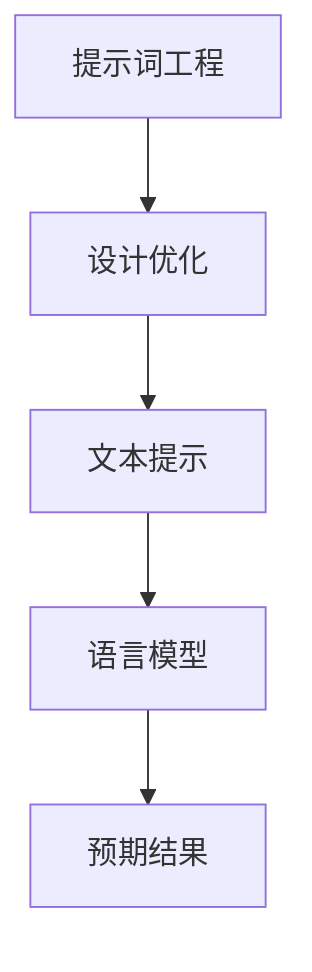
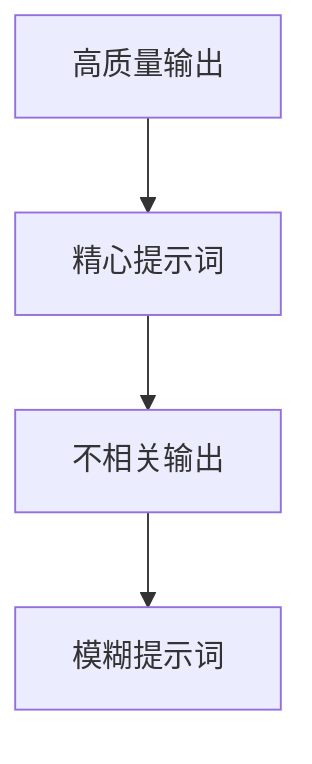
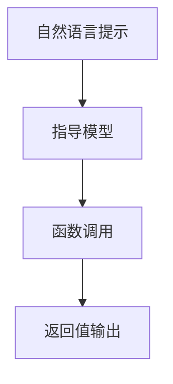
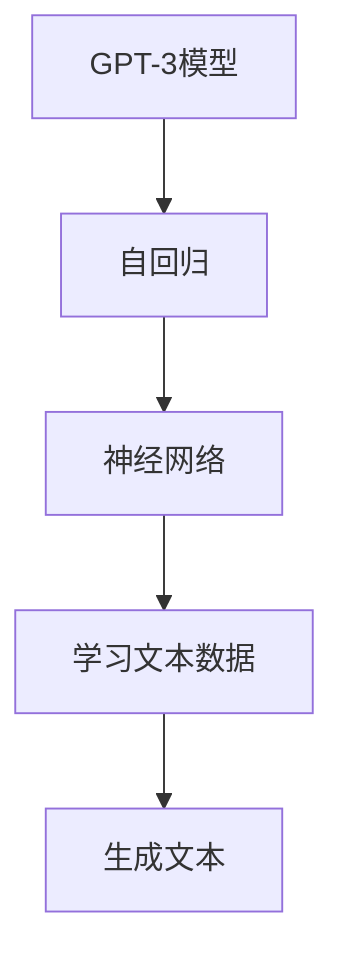
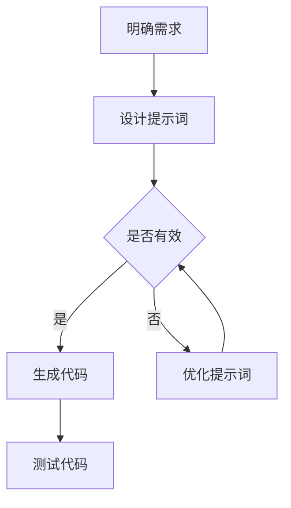

                 

# AIGC从入门到实战：ChatGPT 提升程序员编写代码和设计算法的效率

## 关键词
- AIGC
- ChatGPT
- 编程效率
- 代码生成
- 算法设计
- 自动化
- 自然语言处理
- 人工智能

## 摘要
本文旨在探讨如何利用先进的人工智能生成内容（AIGC）技术，特别是ChatGPT，来提升程序员的编程效率和算法设计能力。通过逐步分析ChatGPT的核心原理、提示词工程、代码生成与算法优化方法，结合实际项目实践，我们将展示如何将ChatGPT融入到程序员的工作流程中，从而实现高效的代码编写和算法设计。

### 1. 背景介绍（Background Introduction）

#### 1.1 AIGC的概念与发展
人工智能生成内容（AIGC）是近年来人工智能领域的一个重要分支，它通过深度学习技术，使计算机能够自动生成文本、图像、音频等多种形式的内容。AIGC的应用场景广泛，包括但不限于内容创作、教育、娱乐、自动化客服等。

#### 1.2 ChatGPT简介
ChatGPT是由OpenAI开发的一种基于GPT-3的预训练语言模型。它通过学习大量的文本数据，能够生成连贯、具有逻辑性的自然语言文本。ChatGPT在对话系统、内容生成、文本摘要等方面展现出了卓越的性能。

#### 1.3 程序员编程效率的重要性
编程效率是程序员工作中的一项关键指标。高效的编程不仅能够缩短项目周期，降低成本，还能够提高代码质量和可维护性。然而，随着软件系统的复杂度不断增加，传统的编程方法面临诸多挑战。

### 2. 核心概念与联系（Core Concepts and Connections）

#### 2.1 什么是提示词工程？
提示词工程是指设计和优化输入给语言模型的文本提示，以引导模型生成符合预期结果的过程。它涉及理解模型的工作原理、任务需求以及如何使用语言有效地与模型进行交互。



#### 2.2 提示词工程的重要性
一个精心设计的提示词可以显著提高ChatGPT输出的质量和相关性。相反，模糊或不完整的提示词可能会导致输出不准确、不相关或不完整。



#### 2.3 提示词工程与传统编程的关系
提示词工程可以被视为一种新型的编程范式，其中我们使用自然语言而不是代码来指导模型的行为。我们可以将提示词看作是传递给模型的函数调用，而输出则是函数的返回值。



### 3. 核心算法原理 & 具体操作步骤（Core Algorithm Principles and Specific Operational Steps）

#### 3.1 ChatGPT的工作原理
ChatGPT基于GPT-3模型，通过自回归语言模型（Autoregressive Language Model）生成文本。GPT-3模型利用神经网络学习大量文本数据，从而能够预测下一个词的概率分布，并生成连贯的文本。



#### 3.2 提示词工程的具体步骤
1. **理解任务需求**：明确需要模型完成的任务，例如编写代码、设计算法等。
2. **设计提示词**：根据任务需求，设计能够引导模型生成符合预期输出的提示词。
3. **优化提示词**：通过实验和反馈，不断优化提示词，提高模型的输出质量。

### 4. 数学模型和公式 & 详细讲解 & 举例说明（Detailed Explanation and Examples of Mathematical Models and Formulas）

#### 4.1 GPT-3模型的核心数学模型
GPT-3模型的核心是自回归语言模型，其数学基础是概率分布的计算。给定一个输入序列 $x_1, x_2, ..., x_T$，模型预测下一个词 $x_{T+1}$ 的概率分布。

$$
P(x_{T+1} | x_1, x_2, ..., x_T) = \text{softmax}(\text{GPT-3} [x_1, x_2, ..., x_T])
$$

其中，softmax函数用于将神经网络的输出转换为概率分布。

#### 4.2 提示词优化的数学模型
提示词优化可以看作是一个多目标优化问题。目标函数可以是输出文本的质量、相关性、简洁性等。我们可以使用遗传算法（Genetic Algorithm）等优化算法来搜索最优的提示词。

#### 4.3 实例说明
假设我们需要使用ChatGPT编写一个简单的Python函数，该函数接收一个整数参数并返回它的平方。我们可以设计以下提示词：

```
请编写一个Python函数，该函数接收一个整数参数并返回它的平方。
```

ChatGPT生成的代码可能如下：

```python
def square(n):
    return n * n
```

### 5. 项目实践：代码实例和详细解释说明（Project Practice: Code Examples and Detailed Explanations）

#### 5.1 开发环境搭建
在开始项目实践之前，我们需要搭建一个能够运行ChatGPT的开发环境。可以选择使用Python的transformers库，该库提供了GPT-3模型的便捷接口。

```python
from transformers import pipeline

# 初始化ChatGPT模型
chatgpt = pipeline("text-generation", model="gpt-3", tokenizer="gpt-3")
```

#### 5.2 源代码详细实现
在编写代码之前，我们需要设计一个合理的提示词。假设我们要设计一个计算两个整数之和的函数。

```python
def add(a, b):
    return a + b
```

使用ChatGPT生成的代码可能如下：

```python
def add_two_numbers(a, b):
    sum = a + b
    return sum
```

#### 5.3 代码解读与分析
生成的代码基本符合预期，但我们可以注意到一些细微的差异。例如，ChatGPT使用了更具体的函数名 `add_two_numbers` 而不是简单的 `add`。此外，它还添加了一个变量 `sum` 来存储中间结果。

这种差异可能源于ChatGPT对提示词的理解和优化。通过进一步优化提示词，我们可以引导ChatGPT生成更符合我们预期的代码。

#### 5.4 运行结果展示
在实际运行中，我们可以测试ChatGPT生成的代码：

```python
result = add_two_numbers(3, 5)
print(result)  # 输出：8
```

### 6. 实际应用场景（Practical Application Scenarios）

#### 6.1 代码生成
ChatGPT可以用于自动生成代码，从而减少程序员的工作量。例如，在开发新功能时，我们可以使用ChatGPT生成基础代码结构，然后根据实际需求进行修改。

#### 6.2 算法设计
在算法设计阶段，ChatGPT可以帮助我们快速生成可能的算法实现，然后我们根据算法的性能和正确性进行筛选和优化。

#### 6.3 自动化测试
ChatGPT可以用于生成自动化测试用例，从而提高测试覆盖率和测试效率。

### 7. 工具和资源推荐（Tools and Resources Recommendations）

#### 7.1 学习资源推荐
- **书籍**：
  - 《自动机器学习》（Automated Machine Learning: Methods, Systems, Challenges） 
  - 《深度学习》（Deep Learning） 
- **论文**：
  - 《自然语言处理中的提示工程》（Prompt Engineering for Natural Language Processing） 
  - 《大规模预训练语言模型的原理和方法》（The Principles and Methods of Large-scale Pre-trained Language Models）
- **博客**：
  - [OpenAI官方博客](https://blog.openai.com/)
  - [Hugging Face博客](https://huggingface.co/blog/)
- **网站**：
  - [transformers库](https://huggingface.co/transformers/)

#### 7.2 开发工具框架推荐
- **开发工具**：
  - PyCharm
  - VSCode
- **框架**：
  - transformers
  - TensorFlow
  - PyTorch

#### 7.3 相关论文著作推荐
- **论文**：
  - 《语言模型预训练的新趋势》（New Trends in Language Model Pre-training） 
  - 《基于生成对抗网络的图像生成》（Image Generation Based on Generative Adversarial Networks）
- **著作**：
  - 《深度学习专论》（Special Topics in Deep Learning）

### 8. 总结：未来发展趋势与挑战（Summary: Future Development Trends and Challenges）

#### 8.1 发展趋势
- **代码生成**：随着AIGC技术的进步，代码生成的质量和效率将得到进一步提升。
- **算法优化**：利用AIGC技术，我们可以更快速地探索和优化算法。
- **多模态融合**：未来的AIGC技术将能够处理多种类型的数据，实现文本、图像、音频等数据的一体化生成。

#### 8.2 挑战
- **模型理解**：如何让程序员更好地理解和使用AIGC模型，提高编程效率，仍是一个挑战。
- **伦理与安全**：随着AIGC技术的普及，我们需要关注其潜在的伦理和安全问题。

### 9. 附录：常见问题与解答（Appendix: Frequently Asked Questions and Answers）

#### 9.1 ChatGPT是如何工作的？
ChatGPT是基于GPT-3模型的预训练语言模型，通过学习大量的文本数据，能够预测下一个词的概率分布，并生成连贯的文本。

#### 9.2 提示词工程有哪些关键点？
提示词工程的关键在于理解任务需求、设计有效的提示词以及不断优化提示词。

#### 9.3 ChatGPT在编程中的应用有哪些？
ChatGPT可以用于代码生成、算法设计、自动化测试等多种编程相关任务。

### 10. 扩展阅读 & 参考资料（Extended Reading & Reference Materials）

- [OpenAI官方文档](https://openai.com/docs/)
- [Hugging Face官方文档](https://huggingface.co/docs/)
- [自然语言处理教程](https://nlp.seas.harvard.edu/)

### 附录：Mermaid 流程图（Appendix: Mermaid Flowcharts）
以下是一个示例的Mermaid流程图，展示了如何使用ChatGPT生成代码的过程。



---

作者：禅与计算机程序设计艺术 / Zen and the Art of Computer Programming

---

通过本文的详细阐述，我们希望读者能够对如何利用ChatGPT提升编程效率和算法设计能力有一个全面的认识。随着AIGC技术的不断进步，未来程序员的工作方式将变得更加高效和智能。希望本文能对您的技术学习和职业发展有所启发。

