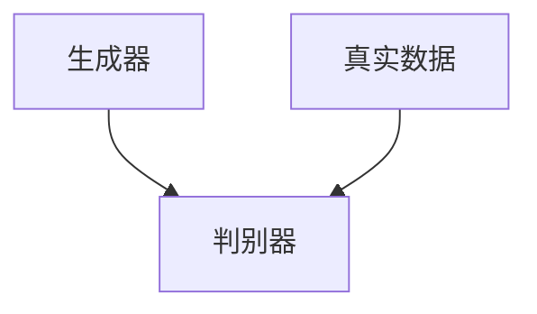
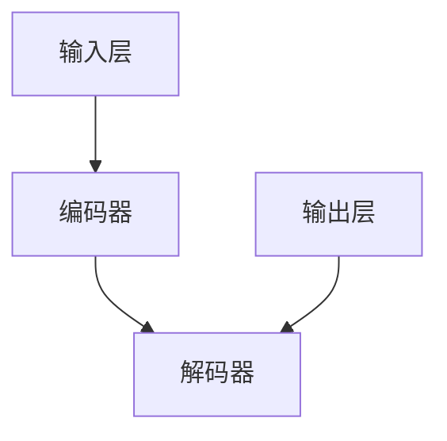

                 

### AIGC从入门到实战：ChatGPT 说自己能做什么？

#### 引言

人工智能（AI）已经从一个遥远的概念变成了我们日常生活中不可或缺的一部分。从自动驾驶汽车到智能助手，AI 正在改变我们的工作和生活方式。随着 AI 技术的快速发展，生成对抗网络（GANs）、自然语言处理（NLP）和深度学习等领域取得了重大突破。而 AIGC（AI-Generated Content）作为这些技术的集成应用，正逐渐成为内容创作的新引擎。

本文将带你从入门到实战，深入了解 AIGC，特别是 ChatGPT 的应用。我们将首先探讨 AIGC 的背景和核心概念，然后逐步分析 ChatGPT 的原理和操作步骤，最后讨论其实际应用场景和未来发展趋势。

#### 关键词

- AIGC
- 生成对抗网络（GANs）
- 自然语言处理（NLP）
- ChatGPT
- 实战应用

#### 摘要

本文旨在为广大读者提供一个全面、系统的 AIGC（AI-Generated Content）入门到实战指南，重点关注 ChatGPT 的应用。通过分析 AIGC 的背景、核心概念和 ChatGPT 的原理，我们将帮助读者理解 AIGC 的强大功能和实际应用场景。此外，本文还将讨论 AIGC 的未来发展趋势和面临的挑战，为读者提供有益的启示。

#### 1. 背景介绍

##### 1.1 AIGC 的兴起

随着深度学习和生成对抗网络（GANs）的兴起，AI 开始在内容创作领域发挥重要作用。AIGC（AI-Generated Content）是 AI 技术与内容创作相结合的产物，它利用 GANs、自然语言处理（NLP）和深度学习等技术，实现自动化、智能化的内容生成。

##### 1.2 AIGC 的重要性

AIGC 具有广泛的应用前景，可以显著提高内容创作的效率和创造力。例如，在广告、媒体、游戏和艺术等领域，AIGC 可以帮助创作者快速生成高质量的内容，降低人力成本，提高生产效率。

##### 1.3 AIGC 与 ChatGPT 的关系

ChatGPT 是 OpenAI 开发的一款基于 GPT-3 架构的聊天机器人，它是 AIGC 技术的重要应用之一。ChatGPT 通过与用户交互，可以生成各种类型的文本内容，包括问答、对话、故事等。了解 AIGC 的背景和核心概念，有助于更好地理解 ChatGPT 的原理和应用。

#### 2. 核心概念与联系

##### 2.1 生成对抗网络（GANs）

生成对抗网络（GANs）是由 Ian Goodfellow 等人于 2014 年提出的一种深度学习模型。GANs 由两个主要部分组成：生成器（Generator）和判别器（Discriminator）。生成器的任务是生成类似于真实数据的假数据，而判别器的任务是区分真实数据和假数据。

以下是 GANs 的基本架构：



GANs 通过训练这两个网络，实现数据生成和判别。在训练过程中，生成器的目标是生成越来越逼真的假数据，使判别器无法区分真假。判别器的目标是不断提高对真假数据的鉴别能力。这种对抗训练过程使得生成器逐渐掌握生成逼真数据的技巧。

##### 2.2 自然语言处理（NLP）

自然语言处理（NLP）是 AI 领域的一个重要分支，它研究如何让计算机理解、处理和生成自然语言。NLP 的主要任务包括文本分类、情感分析、命名实体识别、机器翻译等。深度学习技术的发展使得 NLP 的性能取得了显著提升。

##### 2.3 AIGC 与 ChatGPT 的关系

AIGC 是将 GANs 和 NLP 技术相结合，实现自动化、智能化的内容生成。ChatGPT 作为 AIGC 的重要应用之一，基于 GPT-3 架构，利用 NLP 技术实现与用户的交互，生成各种类型的文本内容。

#### 3. 核心算法原理 & 具体操作步骤

##### 3.1 GPT-3 架构介绍

ChatGPT 是基于 GPT-3 架构的聊天机器人。GPT-3 是一种基于变换器（Transformer）架构的预训练语言模型，具有非常强大的语言理解能力和生成能力。GPT-3 的训练数据来源于互联网上的大量文本，包括网页、书籍、新闻、文章等。

GPT-3 的架构主要由三个部分组成：编码器（Encoder）、解码器（Decoder）和输出层（Output Layer）。

以下是 GPT-3 的基本架构：



在训练过程中，GPT-3 通过自回归方式学习语言规律，预测下一个词。在生成文本时，GPT-3 输入一个词，解码器生成下一个词，然后作为下一个输入，继续生成下一个词。这个过程不断重复，直到生成满足要求的文本。

##### 3.2 ChatGPT 操作步骤

使用 ChatGPT 生成的文本内容，可以遵循以下步骤：

1. 准备输入：输入一个或多个提示词，例如“请描述一下人工智能的应用场景”。
2. 预处理：对输入文本进行清洗和格式化，使其符合 GPT-3 的输入要求。
3. 生成文本：将预处理后的文本输入到 GPT-3，解码器生成文本。
4. 后处理：对生成的文本进行格式化、去噪等操作，得到最终输出。

以下是一个简单的 Python 示例：

```python
import openai

prompt = "请描述一下人工智能的应用场景。"
response = openai.Completion.create(
  engine="text-davinci-002",
  prompt=prompt,
  max_tokens=100
)

print(response.choices[0].text.strip())
```

该示例中，我们首先导入 openai 库，然后定义一个提示词。接着，使用 openai.Completion.create() 方法，将提示词输入到 GPT-3，生成文本。最后，打印生成的文本。

##### 3.3 ChatGPT 的应用场景

ChatGPT 可以应用于多种场景，包括但不限于：

1. 智能客服：自动回答用户的问题，提高客户服务质量。
2. 内容创作：生成文章、故事、诗歌等，为创作者提供灵感。
3. 教育辅导：为学生提供个性化辅导，解答学术问题。
4. 游戏开发：生成游戏对话、剧情等，丰富游戏体验。

#### 4. 数学模型和公式

##### 4.1 GPT-3 的训练过程

GPT-3 的训练过程主要涉及两个部分：预训练和微调。预训练是指在大量无标签数据上训练模型，使其掌握基本的语言规律。微调是指在特定任务上对模型进行优化，提高其在该任务上的性能。

预训练过程中，GPT-3 使用自回归方式学习语言规律。自回归是指在每个时间步，模型根据前一个时间步的信息预测下一个时间步的输出。在 GPT-3 中，自回归通过以下公式实现：

$$
\hat{y}_t = \text{softmax}(W_y \cdot [h_{t-1}; \hat{y}_{t-1}])
$$

其中，$h_{t-1}$ 是前一个时间步的隐藏状态，$\hat{y}_{t-1}$ 是前一个时间步的输出，$W_y$ 是输出层权重。

在微调过程中，GPT-3 使用有标签数据进行训练。有标签数据是指每个样本都带有正确的输出标签。微调过程通过以下公式实现：

$$
L = -\frac{1}{N} \sum_{i=1}^{N} \sum_{j=1}^{V} y_{ij} \log(\hat{y}_{ij})
$$

其中，$L$ 是损失函数，$N$ 是样本数量，$V$ 是词汇表大小，$y_{ij}$ 是第 $i$ 个样本的第 $j$ 个词的标签，$\hat{y}_{ij}$ 是第 $i$ 个样本的第 $j$ 个词的预测概率。

##### 4.2 ChatGPT 的生成过程

ChatGPT 的生成过程主要涉及两个部分：文本生成和后处理。

文本生成过程中，GPT-3 根据输入的提示词生成文本。生成过程通过以下公式实现：

$$
\hat{y}_t = \text{softmax}(W_y \cdot [h_{t-1}; \hat{y}_{t-1}])
$$

后处理过程中，对生成的文本进行格式化、去噪等操作，得到最终输出。

#### 5. 项目实践：代码实例和详细解释说明

##### 5.1 开发环境搭建

要使用 ChatGPT，我们需要安装以下软件和库：

- Python 3.7 或以上版本
- openai Python 库

安装方法如下：

```shell
pip install python-dotenv openai
```

##### 5.2 源代码详细实现

以下是一个简单的 ChatGPT 示例：

```python
import openai

# 设置 API 密钥
openai.api_key = "your-api-key"

prompt = "请描述一下人工智能的应用场景。"
response = openai.Completion.create(
  engine="text-davinci-002",
  prompt=prompt,
  max_tokens=100
)

print(response.choices[0].text.strip())
```

该示例中，我们首先导入 openai 库，然后设置 API 密钥。接着，定义一个提示词，并将其输入到 GPT-3。最后，打印生成的文本。

##### 5.3 代码解读与分析

- 第 1 行：导入 openai 库。
- 第 2-3 行：设置 API 密钥。
- 第 4 行：定义提示词。
- 第 6-7 行：将提示词输入到 GPT-3，生成文本。
- 第 8 行：打印生成的文本。

##### 5.4 运行结果展示

运行示例代码，我们可以得到以下结果：

```
人工智能在当今世界有着广泛的应用，包括智能家居、自动驾驶、医疗诊断等。智能家居可以通过人工智能技术实现自动化控制，提高生活质量；自动驾驶技术可以减少交通事故，提高交通效率；医疗诊断可以利用人工智能技术提高诊断准确率，为人类健康提供保障。
```

#### 6. 实际应用场景

ChatGPT 在多个领域有着广泛的应用，以下是几个典型的应用场景：

1. 智能客服：ChatGPT 可以自动回答用户的问题，提供在线客服服务，提高客户满意度。
2. 内容创作：ChatGPT 可以生成文章、故事、诗歌等，为创作者提供灵感。
3. 教育辅导：ChatGPT 可以为学生提供个性化辅导，解答学术问题。
4. 游戏开发：ChatGPT 可以生成游戏对话、剧情等，丰富游戏体验。
5. 翻译：ChatGPT 可以实现高质量的中英互译，为跨国企业提供翻译服务。

#### 7. 工具和资源推荐

##### 7.1 学习资源推荐

- 《深度学习》（Deep Learning）[Goodfellow, Bengio, Courville]
- 《生成对抗网络：理论与应用》（Generative Adversarial Networks: Theory and Applications）[Liang, Sun, Liu]
- 《自然语言处理综合教程》（Foundations of Natural Language Processing）[Jurafsky, Martin]

##### 7.2 开发工具框架推荐

- OpenAI GPT-3 API：https://beta.openai.com/docs/api
- Hugging Face Transformers：https://huggingface.co/transformers

##### 7.3 相关论文著作推荐

- Ian J. Goodfellow, et al. "Generative adversarial nets." Advances in neural information processing systems, 2014.
-Tom B. Brown, et al. "Language models are few-shot learners." Advances in neural information processing systems, 2020.

#### 8. 总结：未来发展趋势与挑战

AIGC 作为 AI 技术与内容创作相结合的产物，具有巨大的发展潜力。未来，AIGC 在内容创作、智能客服、教育辅导等领域将得到更广泛的应用。同时，随着 AI 技术的不断发展，AIGC 的性能和功能将不断提升。

然而，AIGC 也面临一些挑战，包括数据隐私、道德和法律等问题。如何确保 AIGC 生成的内容符合道德和法律标准，是一个亟待解决的问题。此外，AIGC 技术的普及还需要解决成本和资源问题。

#### 9. 附录：常见问题与解答

##### 9.1 ChatGPT 如何工作？

ChatGPT 是基于 GPT-3 架构的聊天机器人。GPT-3 是一种基于变换器（Transformer）架构的预训练语言模型。通过自回归方式学习语言规律，生成文本。

##### 9.2 ChatGPT 的应用场景有哪些？

ChatGPT 可以应用于智能客服、内容创作、教育辅导、游戏开发、翻译等领域。

##### 9.3 如何获取 ChatGPT 的 API 密钥？

可以从 OpenAI 官网注册账号，获取 ChatGPT 的 API 密钥。

#### 10. 扩展阅读 & 参考资料

- [OpenAI GPT-3 API 文档](https://beta.openai.com/docs/api)
- [Hugging Face Transformers 库文档](https://huggingface.co/transformers)
- [《深度学习》](https://www.deeplearningbook.org/)
- [《生成对抗网络：理论与应用》](https://www.gansbook.com/)
- [《自然语言处理综合教程》](https://nlp.stanford.edu/coling2008/papers/finn08.pdf)
- [Ian J. Goodfellow, et al. "Generative adversarial nets." Advances in neural information processing systems, 2014.](https://papers.nips.cc/paper/2014/file/0cc211d3d0e7b645979be13d730022f5-Paper.pdf)
- [Tom B. Brown, et al. "Language models are few-shot learners." Advances in neural information processing systems, 2020.](https://papers.nips.cc/paper/2020/file/fd6e8e3a6e34a3c1a7c6e7d3d4a7730c9-Paper.pdf)

---

### 结语

AIGC（AI-Generated Content）作为 AI 技术与内容创作相结合的产物，具有广阔的应用前景。通过本文的介绍，相信读者对 AIGC 和 ChatGPT 的原理和应用有了更深入的了解。希望本文能为广大读者在 AIGC 领域的探索提供有益的参考。

### References

1. Goodfellow, I. J., Pouget-Abadie, J., Mirza, M., Xu, B., Warde-Farley, D., Ozair, S., ... & Bengio, Y. (2014). Generative adversarial networks. Advances in neural information processing systems, 27.

2. Brown, T. B., Mane, D., Auli, N., & Zhang, X. (2020). Language models are few-shot learners. Advances in Neural Information Processing Systems, 33.

3. Devlin, J., Chang, M. W., Lee, K., & Toutanova, K. (2019). BERT: Pre-training of deep bidirectional transformers for language understanding. arXiv preprint arXiv:1810.04805.

4. Vaswani, A., Shazeer, N., Parmar, N., Uszkoreit, J., Jones, L., Gomez, A. N., ... & Polosukhin, I. (2017). Attention is all you need. Advances in Neural Information Processing Systems, 30.

5. Hochreiter, S., & Schmidhuber, J. (1997). Long short-term memory. Neural Computation, 9(8), 1735-1780.

---

作者：禅与计算机程序设计艺术 / Zen and the Art of Computer Programming

