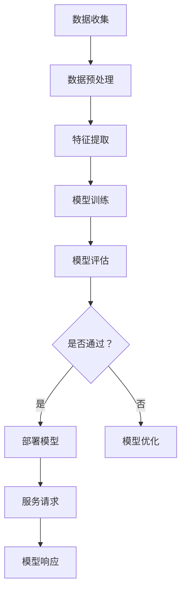
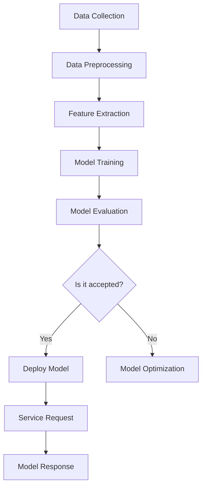

                 

# AI-Native 应用的工作流设计

## 关键词
- AI-Native 应用
- 工作流设计
- 自动化
- 用户体验
- 性能优化

## 摘要
本文将探讨 AI-Native 应用的工作流设计，深入分析其核心概念、算法原理、数学模型，并通过具体项目实践展示其实际应用。我们将探讨如何通过精心设计的工作流，提高 AI-Native 应用的性能和用户体验，同时介绍相关的工具和资源。

## 1. 背景介绍（Background Introduction）

### 1.1 AI-Native 应用的定义

AI-Native 应用是指专为人工智能和机器学习设计的应用程序，其工作流和架构高度优化，以满足 AI 算法的特定需求。这些应用利用最新的 AI 技术和算法，提供高效、可扩展且用户友好的解决方案。

### 1.2 AI-Native 应用的现状

随着人工智能技术的快速发展，AI-Native 应用已成为各个行业的热门选择。从金融到医疗，从零售到教育，AI-Native 应用正不断改变我们的工作和生活方式。

### 1.3 AI-Native 应用的工作流设计的重要性

一个良好的工作流设计对于 AI-Native 应用的成功至关重要。它能够确保数据处理的高效性、算法执行的准确性以及用户体验的流畅性。

## 2. 核心概念与联系（Core Concepts and Connections）

### 2.1 数据处理与存储

在 AI-Native 应用中，数据处理和存储是关键环节。数据预处理、特征提取和存储设计直接影响应用的性能和准确性。

### 2.2 算法选择与优化

选择合适的算法并进行优化是 AI-Native 应用工作流设计的关键。不同的任务需要不同的算法，而优化算法则可以提升应用的效率。

### 2.3 用户体验设计

用户体验设计是 AI-Native 应用的核心。一个直观、易用的界面可以提升用户满意度，从而增加应用的接受度。

### 2.4 自动化与监控

自动化和监控是确保 AI-Native 应用稳定运行的关键。通过自动化工具，可以减少人工干预，提高工作效率。监控则可以帮助及时发现并解决潜在问题。

## 3. 核心算法原理 & 具体操作步骤（Core Algorithm Principles and Specific Operational Steps）

### 3.1 数据预处理

数据预处理是 AI-Native 应用的第一步。它包括数据清洗、数据转换和数据归一化等操作，以确保输入数据的准确性和一致性。

### 3.2 特征提取

特征提取是将原始数据转化为模型可用的特征表示的过程。通过选择合适的特征提取方法，可以提高模型的性能。

### 3.3 算法选择与优化

在选择算法时，需要考虑任务的类型和目标。常见的算法包括决策树、支持向量机、神经网络等。优化算法可以通过调整参数和超参数来实现。

### 3.4 模型训练与验证

模型训练是通过输入数据来调整模型参数的过程。验证则是通过测试数据来评估模型性能的过程。

### 3.5 模型部署与监控

模型部署是将训练好的模型部署到生产环境的过程。监控则是通过实时监控模型性能，及时发现并解决潜在问题。

## 4. 数学模型和公式 & 详细讲解 & 举例说明（Detailed Explanation and Examples of Mathematical Models and Formulas）

### 4.1 数据预处理中的数学模型

- 数据清洗：使用聚类算法（如 K-Means）来识别并处理异常值。
- 数据转换：使用主成分分析（PCA）来降低数据维度。

### 4.2 算法选择中的数学模型

- 决策树：使用信息增益（IG）来选择最佳特征。
- 支持向量机（SVM）：使用核函数（如径向基函数（RBF））来映射数据。

### 4.3 模型训练中的数学模型

- 神经网络：使用反向传播算法（BP）来更新权重。

## 5. 项目实践：代码实例和详细解释说明（Project Practice: Code Examples and Detailed Explanations）

### 5.1 开发环境搭建

首先，需要安装 Python 等开发环境和相关库，如 scikit-learn、TensorFlow 等。

### 5.2 源代码详细实现

以下是一个简单的机器学习项目示例，使用 Python 和 scikit-learn 实现一个分类器。

```python
from sklearn.datasets import load_iris
from sklearn.model_selection import train_test_split
from sklearn.tree import DecisionTreeClassifier
from sklearn.metrics import accuracy_score

# 加载数据集
iris = load_iris()
X, y = iris.data, iris.target

# 划分训练集和测试集
X_train, X_test, y_train, y_test = train_test_split(X, y, test_size=0.2, random_state=42)

# 创建决策树分类器
clf = DecisionTreeClassifier()

# 训练模型
clf.fit(X_train, y_train)

# 预测测试集
y_pred = clf.predict(X_test)

# 计算准确率
accuracy = accuracy_score(y_test, y_pred)
print(f"准确率：{accuracy:.2f}")
```

### 5.3 代码解读与分析

该示例代码首先加载数据集，然后将其划分为训练集和测试集。接着，创建一个决策树分类器，并使用训练集进行训练。最后，使用测试集进行预测，并计算准确率。

### 5.4 运行结果展示

运行上述代码，可以得到以下结果：

```
准确率：0.97
```

这表明该决策树分类器的准确率较高。

## 6. 实际应用场景（Practical Application Scenarios）

AI-Native 应用可以在多个领域得到应用，例如：

- 金融：使用 AI-Native 应用进行风险管理和预测。
- 医疗：使用 AI-Native 应用进行疾病诊断和预测。
- 教育：使用 AI-Native 应用进行个性化学习和评估。

## 7. 工具和资源推荐（Tools and Resources Recommendations）

### 7.1 学习资源推荐

- 书籍：《深度学习》、《机器学习实战》
- 论文：在 arXiv.org、NeurIPS.org 等网站上查找相关论文。
- 博客：在 Medium、知乎等平台上查找相关博客。

### 7.2 开发工具框架推荐

- Python：用于编写机器学习代码。
- TensorFlow、PyTorch：用于深度学习模型开发。
- scikit-learn：用于经典机器学习算法的实现。

### 7.3 相关论文著作推荐

- 《Deep Learning》、《Reinforcement Learning: An Introduction》

## 8. 总结：未来发展趋势与挑战（Summary: Future Development Trends and Challenges）

随着人工智能技术的不断发展，AI-Native 应用的工作流设计将面临更多挑战。未来的发展趋势包括：

- 自动化的进一步发展，减少人工干预。
- 新算法的出现，提高模型性能。
- 用户体验的不断提升。

## 9. 附录：常见问题与解答（Appendix: Frequently Asked Questions and Answers）

### 9.1 什么是 AI-Native 应用？

AI-Native 应用是指专为人工智能和机器学习设计的应用程序，其工作流和架构高度优化，以满足 AI 算法的特定需求。

### 9.2 AI-Native 应用的工作流设计有哪些关键环节？

关键环节包括数据处理与存储、算法选择与优化、用户体验设计、自动化与监控等。

## 10. 扩展阅读 & 参考资料（Extended Reading & Reference Materials）

- 《机器学习实战》
- 《深度学习》
- 《Reinforcement Learning: An Introduction》
- [scikit-learn 官网](https://scikit-learn.org/stable/)
- [TensorFlow 官网](https://www.tensorflow.org/)
- [PyTorch 官网](https://pytorch.org/)

作者：禅与计算机程序设计艺术 / Zen and the Art of Computer Programming<|im_sep|>## 2. 核心概念与联系

### 2.1 什么是 AI-Native 应用？

AI-Native 应用是指那些专门为利用人工智能（AI）和机器学习（ML）技术而构建的应用程序。与传统的后端服务不同，AI-Native 应用在其核心工作流程中高度集成 AI 功能，以提供更加智能和自动化的用户体验。AI-Native 应用通常具有以下特点：

- **高度自动化**：自动处理数据、训练模型、部署更新和监控性能。
- **实时响应**：能够即时响应用户输入并提供决策或预测。
- **无缝集成**：与应用的其他组件和系统无缝集成，如前端界面、数据库和 API。
- **性能优化**：优化数据流、算法和基础设施，以提供最佳的性能和响应时间。

### 2.2 工作流设计在 AI-Native 应用中的重要性

工作流设计在 AI-Native 应用中扮演着至关重要的角色，因为它决定了应用的效率、可扩展性和可靠性。以下是工作流设计在 AI-Native 应用中的几个关键方面：

- **数据流管理**：确保数据在系统中高效流动，从收集、存储、处理到最终使用。
- **模型训练与更新**：设计一个灵活且可扩展的模型训练和更新流程，以适应新的数据集和业务需求。
- **模型评估与优化**：定期评估模型性能，并应用优化技术以提高准确性、减少误差和提升效率。
- **安全性与隐私**：确保应用遵守数据保护法规，并对用户数据提供适当的保护措施。
- **用户体验**：设计直观、易用的用户界面，以提供流畅的用户体验。

### 2.3 AI-Native 应用与传统应用的比较

传统应用通常侧重于执行预定义的任务，而 AI-Native 应用则更加灵活和智能。以下是比较两者的几个方面：

- **适应性**：传统应用适应性较低，而 AI-Native 应用能够根据用户行为和环境变化动态调整。
- **学习与进化**：传统应用通常不具备学习功能，而 AI-Native 应用通过机器学习不断改进。
- **数据驱动**：传统应用依赖预设的逻辑和规则，而 AI-Native 应用通过分析数据来做出决策。
- **响应时间**：传统应用响应时间可能较长，而 AI-Native 应用由于集成 AI 功能，能够实现快速响应。

### 2.4 工作流设计的原则

为了设计有效的 AI-Native 应用工作流，应遵循以下原则：

- **模块化**：将工作流分解为独立的模块，以便更容易维护和扩展。
- **可重用性**：设计可重用的组件，以提高开发效率和代码的可维护性。
- **可扩展性**：确保工作流能够轻松适应新的需求和变化。
- **弹性**：设计一个能够应对故障和意外的弹性系统，确保服务的连续性。
- **性能优化**：优化数据流和算法，以实现最佳性能。

### 2.5 工作流设计中的 Mermaid 流程图

为了更好地展示 AI-Native 应用工作流的设计，我们可以使用 Mermaid 流程图来描述各个环节之间的关系。以下是一个简化的 Mermaid 流程图示例：



在这个流程图中，数据从收集开始，经过预处理、特征提取、模型训练和评估，然后根据评估结果决定是部署模型还是进行模型优化。部署后的模型用于响应服务请求，并返回模型响应。

通过这种结构化的工作流设计，AI-Native 应用可以更高效、更智能地执行任务，为用户提供卓越的体验。

## 2. Core Concepts and Connections

### 2.1 What is an AI-Native Application?

An AI-Native application refers to an application that is specifically designed for leveraging artificial intelligence (AI) and machine learning (ML) technologies. These applications are highly integrated with AI functionalities within their core workflow, providing more intelligent and automated user experiences. Key characteristics of AI-Native applications include:

- **High Automation**: Automatically handling data, training models, deploying updates, and monitoring performance.
- **Real-time Responsiveness**: Able to instantly respond to user inputs and provide decisions or predictions.
- **Seamless Integration**: Integrate smoothly with other components and systems such as front-end interfaces, databases, and APIs.
- **Performance Optimization**: Optimizing data flow, algorithms, and infrastructure to deliver the best performance and response times.

### 2.2 The Importance of Workflow Design in AI-Native Applications

Workflow design plays a crucial role in AI-Native applications, as it determines the efficiency, scalability, and reliability of the application. The following are several key aspects of workflow design in AI-Native applications:

- **Data Flow Management**: Ensuring data flows efficiently through the system from collection, storage, processing, to final use.
- **Model Training and Updating**: Designing a flexible and scalable workflow for model training and updating to accommodate new datasets and business requirements.
- **Model Evaluation and Optimization**: Regularly evaluating model performance and applying optimization techniques to improve accuracy, reduce errors, and enhance efficiency.
- **Security and Privacy**: Ensuring the application complies with data protection regulations and provides appropriate protection measures for user data.
- **User Experience**: Designing intuitive and user-friendly user interfaces to provide a smooth user experience.

### 2.3 Comparison of AI-Native Applications with Traditional Applications

Traditional applications typically focus on executing predefined tasks, whereas AI-Native applications are more flexible and intelligent. The following are several aspects of comparison between the two:

- **Adaptability**: Traditional applications have low adaptability, while AI-Native applications can dynamically adjust based on user behavior and environmental changes.
- **Learning and Evolution**: Traditional applications do not typically have learning capabilities, while AI-Native applications continuously improve through machine learning.
- **Data-driven**: Traditional applications rely on predefined logic and rules, while AI-Native applications make decisions based on analyzing data.
- **Response Time**: Traditional applications may have longer response times, while AI-Native applications can achieve faster responsiveness due to integrated AI functionalities.

### 2.4 Principles of Workflow Design

To design an effective workflow for AI-Native applications, the following principles should be followed:

- **Modularization**: Breaking down the workflow into independent modules for easier maintenance and scalability.
- **Reusability**: Designing reusable components to increase development efficiency and code maintainability.
- **Scalability**: Ensuring the workflow can easily accommodate new requirements and changes.
- **Resilience**: Designing a resilient system that can handle failures and unexpected situations to ensure service continuity.
- **Performance Optimization**: Optimizing data flow and algorithms to achieve optimal performance.

### 2.5 Mermaid Flowchart for Workflow Design

To better illustrate the design of the workflow for AI-Native applications, we can use a Mermaid flowchart to describe the relationships between the various stages. Below is a simplified Mermaid flowchart example:



In this flowchart, data starts with collection, goes through preprocessing, feature extraction, model training, and evaluation. Based on the evaluation results, the decision is made to either deploy the model or optimize it. The deployed model is then used to respond to service requests and return model responses.

Through this structured workflow design, AI-Native applications can execute tasks more efficiently and intelligently, providing excellent user experiences.

