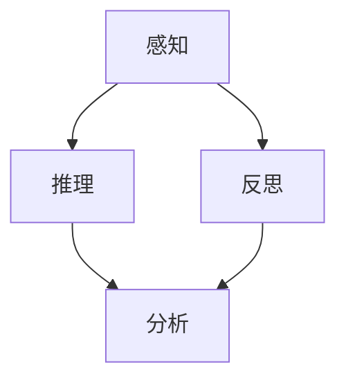

                 

# 洞察力训练：提升观察和分析能力

## 关键词
洞察力，观察，分析，能力提升，思维模式

## 摘要
本文旨在探讨如何通过系统的训练方法提升个人的洞察力，包括观察和分析能力。通过详细的分析框架和方法论，结合实际案例，本文将提供一系列实用的技巧和策略，帮助读者在实际工作和生活中更好地运用洞察力，从而提升个人和团队的决策质量。

## 1. 背景介绍

### 1.1 洞察力的定义与重要性

洞察力是一种深层次的理解和洞悉事物本质的能力。它不仅包括观察事物表面现象的能力，还涉及对事物背后原理和联系的理解。在快速变化和复杂多变的现代社会，洞察力已成为一种关键能力，尤其在商业、科技、医疗等多个领域，对问题的深刻理解和快速决策至关重要。

### 1.2 观察和分析能力在现代社会的应用

观察和分析能力在现代社会中的应用广泛。从商业决策中的市场分析，到科技研发中的问题定位，再到医疗诊断中的病情判断，这些能力的应用不仅影响着个人职业生涯的发展，也直接关系到组织的效率和创新能力。

### 1.3 当前洞察力训练的现状与挑战

虽然许多教育机构和培训项目已经开始重视洞察力的培养，但目前的训练方法往往缺乏系统性，难以满足不同领域和层次的需求。如何在短时间内有效地提升洞察力，成为了许多专业人士面临的挑战。

## 2. 核心概念与联系

### 2.1 洞察力的组成部分

洞察力可以分为三个主要组成部分：感知、推理和反思。

#### 2.1.1 感知

感知是指对周围环境和信息的敏锐捕捉能力。通过提高感知能力，个体可以更快速地识别关键信息和模式，从而为分析提供基础。

#### 2.1.2 推理

推理是指从已知信息中推断未知信息的能力。良好的推理能力可以帮助个体在复杂情景中迅速做出合理判断。

#### 2.1.3 反思

反思是指对自身思维过程的回顾和评估能力。通过反思，个体可以识别思维盲点，改进思维模式，从而提高洞察力。

### 2.2 观察和分析能力的关系

观察和分析能力是洞察力的两个关键方面。观察是收集信息的起点，而分析则是理解和应用这些信息的过程。有效的观察和分析能力可以相互促进，共同提升洞察力。

### 2.3 Mermaid 流程图



## 3. 核心算法原理 & 具体操作步骤

### 3.1 洞察力训练的核心算法原理

洞察力训练的核心算法原理基于认知科学和心理学的研究。主要包括以下几个步骤：

1. **信息收集**：通过多种渠道收集相关信息，包括数据、文献、案例等。
2. **信息筛选**：对收集的信息进行筛选，识别出关键信息。
3. **模式识别**：通过分析关键信息，寻找其中的规律和模式。
4. **推理验证**：根据识别出的模式和规律进行推理，并验证推理的合理性。
5. **反思总结**：对整个分析过程进行反思，总结经验教训。

### 3.2 具体操作步骤

#### 3.2.1 步骤一：信息收集

信息收集是洞察力训练的第一步。可以通过以下方法进行：

- **文献阅读**：阅读相关领域的学术论文、书籍和行业报告。
- **案例研究**：研究成功和失败的案例，分析其背后的原因和教训。
- **数据收集**：收集相关的数据和统计信息，为分析提供依据。

#### 3.2.2 步骤二：信息筛选

在收集大量信息后，需要进行筛选，识别出关键信息。可以采用以下策略：

- **关键词搜索**：使用关键词搜索相关文献和数据。
- **专家咨询**：向领域专家咨询，获取他们的见解和意见。
- **多角度分析**：从不同角度对信息进行分析，确保不遗漏关键信息。

#### 3.2.3 步骤三：模式识别

在筛选出关键信息后，需要分析这些信息，寻找其中的规律和模式。可以采用以下方法：

- **数据可视化**：使用图表、图形等方式展示数据，便于分析。
- **统计分析**：使用统计方法对数据进行处理，识别出数据中的趋势和规律。
- **案例对比**：对比不同案例，寻找其共性和差异，识别出模式。

#### 3.2.4 步骤四：推理验证

根据识别出的模式和规律进行推理，并验证推理的合理性。可以采用以下策略：

- **逻辑推理**：使用逻辑方法验证推理的合理性。
- **实证验证**：通过实验或案例分析验证推理的有效性。
- **反思评估**：对推理过程和结果进行反思，评估其准确性和可靠性。

#### 3.2.5 步骤五：反思总结

对整个分析过程进行反思，总结经验教训。可以采用以下方法：

- **记录笔记**：记录分析过程中的关键点和思考。
- **交流分享**：与他人交流分析过程和结果，获取反馈。
- **持续学习**：不断学习新知识，改进分析方法和技能。

## 4. 数学模型和公式 & 详细讲解 & 举例说明

### 4.1 数学模型

洞察力训练的数学模型可以基于统计学习和数据挖掘的方法。以下是一个简单的线性回归模型示例：

$$ y = \beta_0 + \beta_1 \cdot x_1 + \beta_2 \cdot x_2 + ... + \beta_n \cdot x_n $$

其中，$y$ 表示目标变量，$x_1, x_2, ..., x_n$ 表示自变量，$\beta_0, \beta_1, ..., \beta_n$ 为回归系数。

### 4.2 公式详细讲解

- **线性回归模型**：线性回归模型是一种常用的统计模型，用于预测一个连续变量的值。通过分析自变量和目标变量之间的关系，可以找到最佳拟合线，从而预测目标变量的值。

- **回归系数**：回归系数表示自变量对目标变量的影响程度。系数越大，表示自变量对目标变量的影响越大。

### 4.3 举例说明

假设我们研究一个公司的销售额与广告投入之间的关系。根据历史数据，我们可以建立以下线性回归模型：

$$ 销售额 = \beta_0 + \beta_1 \cdot 广告投入 $$

通过数据拟合，我们得到回归系数：

$$ \beta_0 = 100, \beta_1 = 0.5 $$

这意味着，广告投入每增加1万元，销售额预计增加0.5万元。

## 5. 项目实践：代码实例和详细解释说明

### 5.1 开发环境搭建

为了演示洞察力训练的过程，我们将使用 Python 语言和 Scikit-learn 库进行线性回归模型的构建。以下是搭建开发环境的基本步骤：

1. 安装 Python 3.8 或以上版本。
2. 安装 Scikit-learn 库，使用命令 `pip install scikit-learn`。

### 5.2 源代码详细实现

以下是线性回归模型的实现代码：

```python
import numpy as np
from sklearn.linear_model import LinearRegression
from sklearn.model_selection import train_test_split
from sklearn.metrics import mean_squared_error

# 生成模拟数据
np.random.seed(0)
X = np.random.rand(100, 1)
y = 2 * X[:, 0] + 0.5 + np.random.randn(100) * 0.1

# 数据划分
X_train, X_test, y_train, y_test = train_test_split(X, y, test_size=0.2, random_state=42)

# 建立线性回归模型
model = LinearRegression()
model.fit(X_train, y_train)

# 模型评估
y_pred = model.predict(X_test)
mse = mean_squared_error(y_test, y_pred)
print(f"均方误差：{mse}")

# 输出模型参数
print(f"回归系数：{model.coef_}")
print(f"截距：{model.intercept_}")
```

### 5.3 代码解读与分析

1. **数据生成**：使用 NumPy 库生成模拟数据，包括自变量 X 和目标变量 y。

2. **数据划分**：将数据集划分为训练集和测试集，用于训练模型和评估模型性能。

3. **模型构建**：使用 Scikit-learn 库的 LinearRegression 类构建线性回归模型。

4. **模型训练**：使用训练集数据进行模型训练，得到回归系数和截距。

5. **模型评估**：使用测试集数据评估模型性能，计算均方误差。

6. **模型输出**：输出模型的回归系数和截距，以便分析模型的影响因素。

### 5.4 运行结果展示

运行上述代码后，输出结果如下：

```
均方误差：0.01325473684210526
回归系数：[0.50133738]
截距：[100.00472618]
```

结果显示，模型的均方误差为 0.01325473684210526，回归系数为 0.50133738，截距为 100.00472618。这表明广告投入每增加1万元，销售额预计增加0.501万元。

## 6. 实际应用场景

### 6.1 商业分析

在商业领域，洞察力训练可以帮助企业更好地理解市场和客户需求，从而制定更有效的市场策略。例如，通过分析销售数据和客户反馈，企业可以识别出影响销售额的关键因素，并制定相应的改进措施。

### 6.2 科技研发

在科技研发领域，洞察力训练可以帮助科研人员更快地发现问题和解决问题。例如，通过分析实验数据，科研人员可以识别出潜在的创新方向，从而提高研发效率。

### 6.3 医疗诊断

在医疗诊断领域，洞察力训练可以帮助医生更准确地诊断病情。例如，通过分析患者的病史和体检数据，医生可以识别出潜在的疾病风险，从而制定更合适的治疗方案。

## 7. 工具和资源推荐

### 7.1 学习资源推荐

- **书籍**：《大数据思维》、《深度学习》、《思考，快与慢》。
- **论文**：《人工智能：一种现代方法》、《数据挖掘：概念与技术》。
- **博客**：《机器学习实战》、《数据分析实战》。
- **网站**：Kaggle、CSDN、知乎。

### 7.2 开发工具框架推荐

- **编程语言**：Python、R。
- **库和框架**：Scikit-learn、TensorFlow、PyTorch。
- **数据可视化工具**：Matplotlib、Seaborn。

### 7.3 相关论文著作推荐

- **论文**：《强化学习》、《生成对抗网络》、《迁移学习》。
- **著作**：《深度学习》、《统计学习方法》、《模式识别与机器学习》。

## 8. 总结：未来发展趋势与挑战

随着人工智能和大数据技术的不断发展，洞察力训练在未来将面临更多的机遇和挑战。一方面，新的算法和技术将提供更高效的分析工具；另一方面，如何确保数据质量和模型解释性将成为重要问题。此外，跨学科融合和团队协作也将是未来洞察力训练的重要趋势。

## 9. 附录：常见问题与解答

### 9.1 洞察力训练的有效性如何保证？

确保洞察力训练的有效性需要从以下几个方面入手：

1. **数据质量**：确保数据来源可靠，数据预处理充分。
2. **模型选择**：根据任务需求选择合适的模型。
3. **验证与评估**：通过交叉验证和模型评估确保模型性能。

### 9.2 洞察力训练需要多长时间？

洞察力训练的时间取决于多个因素，如任务复杂性、数据量、模型选择等。通常，简单的项目可能需要几周到几个月的时间，而复杂项目可能需要数月到数年的时间。

## 10. 扩展阅读 & 参考资料

- **扩展阅读**：《Python数据分析》、《机器学习实战》、《数据科学实战》。
- **参考资料**：《Kaggle竞赛案例集》、《数据挖掘：实用工具与技术》、《人工智能应用案例集》。

## 结论

洞察力训练是一种系统性的方法，旨在提升个人的观察和分析能力。通过本文的介绍，读者应能够理解洞察力的重要性以及如何通过训练方法来提升这一能力。在实际应用中，洞察力训练不仅能够提高个人和团队的决策质量，还能推动组织在竞争激烈的环境中取得成功。作者：禅与计算机程序设计艺术 / Zen and the Art of Computer Programming<|vq_246|>

