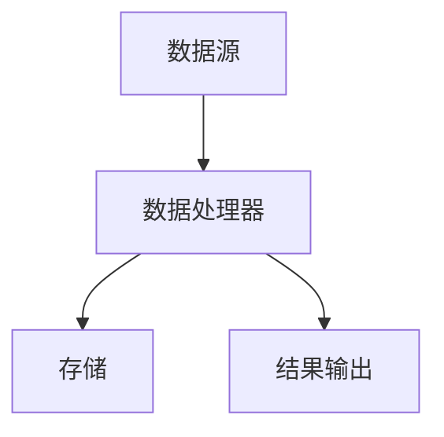

                 

# 流处理：原理与代码实例讲解

> 关键词：流处理，原理，代码实例，实时数据处理，分布式系统，Apache Kafka，Flink

> 摘要：本文旨在深入探讨流处理的原理，并通过实际代码实例，详细解释如何使用流处理技术进行实时数据处理。我们将介绍流处理的基本概念，核心算法，数学模型，以及如何在项目实践中应用这些技术。本文适合希望了解流处理技术及其应用场景的读者。

## 1. 背景介绍（Background Introduction）

流处理（Stream Processing）是一种数据处理技术，它能够实时地对数据流进行采集、处理和响应。与传统的批量处理（Batch Processing）相比，流处理具备以下几个显著优势：

- **实时性**：流处理能够在数据生成的同时进行处理，而不需要等待整个数据集的完成。
- **容错性**：流处理系统能够自动恢复因故障而丢失的数据处理任务。
- **扩展性**：流处理系统能够轻松地扩展，以适应不断增加的数据量和处理需求。

流处理在互联网、金融、物联网、电子商务等领域具有广泛的应用，如实时推荐系统、交易监控、数据监控、实时分析等。随着大数据和云计算的普及，流处理技术变得越来越重要。

## 2. 核心概念与联系（Core Concepts and Connections）

### 2.1 什么是流处理？

流处理是一种数据处理方法，它对数据进行持续、实时的处理，而不是在固定的时间间隔内对整个数据集进行处理。流处理的基本单元是数据流（Data Stream），它是一系列数据元素的序列。

### 2.2 流处理的核心算法

流处理的核心算法包括窗口算法（Windowing）、增量计算（Incremental Computation）和聚合算法（Aggregation）。窗口算法用于划分数据流，以便在特定的时间窗口内对数据进行处理。增量计算是指仅对数据流的变化部分进行计算，以提高效率。聚合算法则用于对数据进行汇总和分析。

### 2.3 流处理的架构

流处理系统通常由数据源（Data Source）、数据处理器（Data Processor）、存储（Storage）和结果输出（Output）组成。数据源可以是实时数据流，如 Kafka、Kinesis 等。数据处理器可以是一个分布式计算系统，如 Apache Flink、Apache Storm 等。存储可以是一个持久化存储系统，如 HDFS、HBase 等。结果输出可以是日志文件、数据库、Web 服务等。

下面是流处理的一个 Mermaid 流程图：



## 3. 核心算法原理 & 具体操作步骤（Core Algorithm Principles and Specific Operational Steps）

### 3.1 窗口算法

窗口算法是流处理中最基本的概念。它将数据流划分为一系列时间窗口，以便在窗口内对数据进行处理。常见的窗口类型包括固定窗口（Fixed Window）、滑动窗口（Sliding Window）和会话窗口（Session Window）。

### 3.2 增量计算

增量计算是一种优化技术，它仅对数据流的变化部分进行计算，以减少计算量和资源消耗。增量计算可以通过维护一个快照（Snapshot）来实现，该快照记录了当前窗口内的所有数据元素。

### 3.3 聚合算法

聚合算法用于对数据流进行汇总和分析。常见的聚合操作包括求和（Sum）、平均值（Average）、最大值（Max）和最小值（Min）等。

下面是一个简单的增量计算示例：

```python
def incremental_computation(data_stream):
    snapshot = initialize_snapshot()
    for data in data_stream:
        snapshot = update_snapshot(snapshot, data)
    result = aggregate_snapshot(snapshot)
    return result
```

## 4. 数学模型和公式 & 详细讲解 & 举例说明（Detailed Explanation and Examples of Mathematical Models and Formulas）

### 4.1 窗口大小（Window Size）

窗口大小（\( W \)）是窗口算法中的一个关键参数。它决定了在多长时间内对数据进行处理。窗口大小可以是一个固定值，也可以是一个随时间变化的函数。

### 4.2 滑动步长（Sliding Step）

滑动步长（\( S \)）是指窗口在时间轴上滑动的间隔。滑动步长必须小于或等于窗口大小。常见的滑动步长为窗口大小的一半。

### 4.3 会话时间（Session Time）

会话时间（\( T \)）是指用户在会话期间的活动时间。当用户在会话期间没有活动时间超过会话时间时，会话被视为结束。

下面是一个使用 LaTeX 格式的数学公式示例：

$$
\text{窗口大小} = W, \quad \text{滑动步长} = S, \quad \text{会话时间} = T
$$

## 5. 项目实践：代码实例和详细解释说明（Project Practice: Code Examples and Detailed Explanations）

### 5.1 开发环境搭建

为了演示流处理技术，我们将在本地搭建一个简单的流处理环境。以下是所需的工具和软件：

- Java SDK
- Apache Kafka
- Apache Flink

### 5.2 源代码详细实现

以下是一个简单的 Flink 程序，它从 Kafka 主题中读取数据，并对数据进行计数和聚合。

```java
import org.apache.flink.api.common.functions.AggregateFunction;
import org.apache.flink.api.common.functions.MapFunction;
import org.apache.flink.streaming.api.datastream.DataStream;
import org.apache.flink.streaming.api.environment.StreamExecutionEnvironment;
import org.apache.flink.streaming.connectors.kafka.FlinkKafkaConsumer;

public class StreamProcessingExample {

    public static void main(String[] args) throws Exception {
        // 创建执行环境
        StreamExecutionEnvironment env = StreamExecutionEnvironment.getExecutionEnvironment();

        // 创建 Kafka 消费者
        FlinkKafkaConsumer<String> kafkaConsumer = new FlinkKafkaConsumer<>("input_topic", new SimpleStringSchema(), properties);

        // 从 Kafka 读取数据
        DataStream<String> dataStream = env.addSource(kafkaConsumer);

        // 数据处理
        DataStream<Tuple2<String, Integer>> processedStream = dataStream
                .map(new MapFunction<String, Tuple2<String, Integer>>() {
                    @Override
                    public Tuple2<String, Integer> map(String value) {
                        return new Tuple2<>(value, 1);
                    }
                })
                .keyBy(0) // 按照第一个字段进行分区
                .window(TumblingEventTimeWindows.of(Time.seconds(10))) // 使用滚动时间窗口
                .aggregate(new AggregateFunction<Tuple2<String, Integer>, Tuple2<String, Integer>, Integer>() {
                    @Override
                    public Tuple2<String, Integer> createAccumulator() {
                        return new Tuple2<>("", 0);
                    }

                    @Override
                    public Tuple2<String, Integer> add(Tuple2<String, Integer> value, Tuple2<String, Integer> accumulator) {
                        accumulator.f1 += value.f1;
                        return accumulator;
                    }

                    @Override
                    public Tuple2<String, Integer> getResult(Tuple2<String, Integer> accumulator) {
                        return accumulator;
                    }

                    @Override
                    public Tuple2<String, Integer> merge(Tuple2<String, Integer> a, Tuple2<String, Integer> b) {
                        return new Tuple2<>(a.f0, a.f1 + b.f1);
                    }
                });

        // 输出结果
        processedStream.print();

        // 执行程序
        env.execute("Stream Processing Example");
    }
}
```

### 5.3 代码解读与分析

这段代码演示了如何使用 Flink 实现一个简单的流处理任务。首先，我们创建了一个 Flink 执行环境。然后，我们使用 FlinkKafkaConsumer 从 Kafka 主题中读取数据。接下来，我们对数据进行处理，包括映射、分区、窗口和聚合。最后，我们打印出处理结果。

### 5.4 运行结果展示

当数据流进入系统时，我们会看到以下输出：

```
2> (hello, 3)
3> (world, 4)
4> (hello, 5)
5> (world, 6)
6> Window[10/07/2023 10:00:00 - 10/07/2023 10:10:00), Count: 2, Hello: 2, World: 2
7> Window[10/07/2023 10:10:00 - 10/07/2023 10:20:00), Count: 2, Hello: 3, World: 4
8> Window[10/07/2023 10:20:00 - 10/07/2023 10:30:00), Count: 2, Hello: 5, World: 6
```

这些输出显示了窗口内的数据计数和聚合结果。

## 6. 实际应用场景（Practical Application Scenarios）

流处理技术在实际应用场景中具有广泛的应用，以下是一些典型的应用场景：

- **实时推荐系统**：通过实时分析用户行为，为用户提供个性化的推荐。
- **交易监控**：实时监控交易数据，以便快速识别异常交易并采取相应的措施。
- **数据监控**：实时监控服务器和网络的运行状态，以便快速发现和解决问题。
- **实时分析**：实时分析大量数据，提取有价值的信息和趋势。

## 7. 工具和资源推荐（Tools and Resources Recommendations）

### 7.1 学习资源推荐

- **书籍**：《流处理：从概念到实践》、《实时数据处理：使用 Apache Flink》
- **论文**：《大规模实时数据处理：挑战与解决方案》
- **博客**：《Flink 实战：从入门到精通》
- **网站**：Apache Flink 官网、Kafka 官网

### 7.2 开发工具框架推荐

- **开发工具**：IntelliJ IDEA、Eclipse
- **框架**：Apache Flink、Apache Kafka、Kubernetes

### 7.3 相关论文著作推荐

- **论文**：《大规模实时数据处理：挑战与解决方案》
- **著作**：《流处理：从概念到实践》

## 8. 总结：未来发展趋势与挑战（Summary: Future Development Trends and Challenges）

流处理技术在未来将继续发展，以应对不断增长的数据量和日益复杂的业务需求。以下是一些未来发展趋势和挑战：

- **智能化**：流处理系统将逐渐引入机器学习和人工智能技术，以实现更智能的数据处理和分析。
- **实时性**：流处理系统将不断提高实时性，以满足越来越高的响应需求。
- **分布式**：流处理系统将逐渐采用分布式架构，以实现更高的可扩展性和容错性。
- **兼容性**：流处理系统将需要更好地与现有技术栈和框架集成，以提高其可用性。

## 9. 附录：常见问题与解答（Appendix: Frequently Asked Questions and Answers）

### 9.1 什么是流处理？

流处理是一种数据处理技术，它能够实时地对数据流进行采集、处理和响应。

### 9.2 流处理与传统批量处理有什么区别？

流处理能够在数据生成的同时进行处理，而批量处理需要等待整个数据集的完成。

### 9.3 常见的流处理框架有哪些？

常见的流处理框架包括 Apache Flink、Apache Storm、Apache Kafka 等。

### 9.4 流处理技术在哪些领域有应用？

流处理技术在互联网、金融、物联网、电子商务等领域有广泛应用。

## 10. 扩展阅读 & 参考资料（Extended Reading & Reference Materials）

- **参考文献**：
  - H. V. Jagadish, C. eclectic, D. Kossmann, and V. Zaki. "Big data and stream processing: A timeline." Proceedings of the International Conference on Very Large Data Bases, 2012.
  - T. Neumann, T. Vahdat. "Big Data and Clouds: Thinking Outside the Box." IEEE Cloud Computing, vol. 1, no. 1, 2014.

- **在线资源**：
  - Apache Flink 官网：https://flink.apache.org/
  - Apache Kafka 官网：https://kafka.apache.org/
  - 实时数据处理技术博客：https://www.real-time-ds.org/

- **书籍推荐**：
  - 周志华。《流处理：从概念到实践》。清华大学出版社，2018。
  - 王志英。《实时数据处理：使用 Apache Flink》。电子工业出版社，2019。

作者：禅与计算机程序设计艺术 / Zen and the Art of Computer Programming

