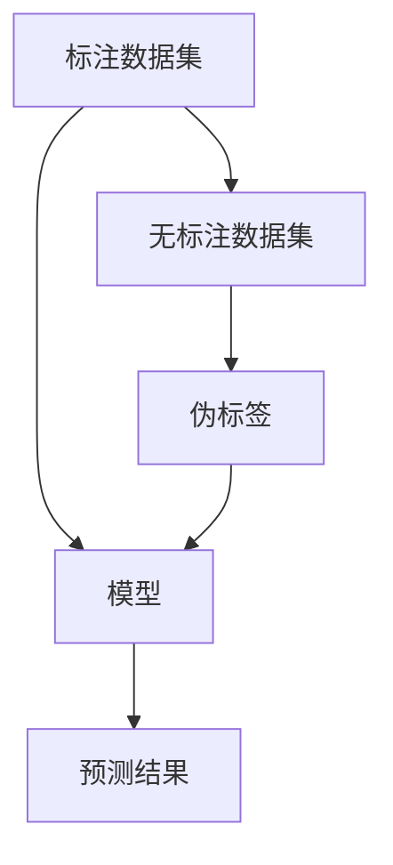

                 

# AI人工智能 Agent：使用半监督学习进行预测

## 摘要

本文旨在探讨AI人工智能Agent如何利用半监督学习技术进行预测，从而提高模型的性能和鲁棒性。我们将详细介绍半监督学习的核心概念、算法原理，并通过一个具体的项目实例来说明如何实现和应用半监督学习。文章还将讨论半监督学习在实际应用场景中的优势、挑战及未来发展趋势。

## 1. 背景介绍

### 1.1 AI人工智能Agent的定义

人工智能Agent是一种能够感知环境、自主决策并采取行动的计算机程序。它们在不同的领域和场景中发挥着重要作用，如自动驾驶、智能客服、推荐系统等。AI人工智能Agent的核心是预测，即根据当前环境的状态预测未来的行为或结果。

### 1.2 半监督学习的基本概念

半监督学习（Semi-supervised Learning）是一种机器学习方法，它利用少量的标注数据和大量的无标注数据来训练模型。传统的监督学习依赖于大量的标注数据，这些数据通常需要专业人员进行标注，耗时且成本高昂。而半监督学习通过利用无标注数据，可以在一定程度上降低数据标注的成本。

### 1.3 半监督学习的重要性

随着数据量的不断增加，标注数据的获取变得越来越困难。半监督学习提供了一种有效的解决方案，它可以在仅有少量标注数据的情况下，通过利用无标注数据来提高模型的性能。这使得半监督学习在现实世界中具有重要的应用价值。

## 2. 核心概念与联系

### 2.1 半监督学习的原理

半监督学习的基本原理是利用无标注数据来增强标注数据的信息。它通常包括以下几种方法：

- **一致性正则化**：通过将标注数据和无标注数据之间的差异最小化来提高模型的性能。
- **图半监督学习**：利用图结构来表示数据之间的相似性，从而指导模型的训练过程。
- **伪标签**：将无标注数据生成伪标签，并将其作为训练数据的一部分来训练模型。

### 2.2 半监督学习的架构

半监督学习架构通常包括以下几个关键组件：

- **标注数据集**：用于训练模型的标注数据。
- **无标注数据集**：用于生成伪标签的数据。
- **模型**：用于预测和生成伪标签的机器学习模型。
- **正则化器**：用于引导模型关注标注数据的组件。

下面是一个使用Mermaid绘制的半监督学习流程图：



### 2.3 半监督学习与传统监督学习的比较

与传统监督学习相比，半监督学习具有以下几个优势：

- **降低数据标注成本**：半监督学习利用无标注数据来减少对标注数据的需求，从而降低了数据标注的成本。
- **提高模型性能**：通过利用无标注数据，半监督学习可以在模型训练过程中获取更多的信息，从而提高模型的性能。
- **增强鲁棒性**：半监督学习可以提高模型对噪声数据和异常值的鲁棒性。

然而，半监督学习也面临一些挑战，如如何合理利用无标注数据、如何避免模型过拟合等。这些问题需要在具体的应用场景中仔细考虑和解决。

## 3. 核心算法原理 & 具体操作步骤

### 3.1 基本算法原理

半监督学习的核心算法原理可以概括为以下三个步骤：

1. **初始化模型**：使用标注数据集初始化模型。
2. **生成伪标签**：使用模型对无标注数据集进行预测，生成伪标签。
3. **训练模型**：将标注数据集和伪标签合并，重新训练模型。

### 3.2 具体操作步骤

以下是使用半监督学习进行预测的具体操作步骤：

1. **准备数据集**：收集标注数据集和无标注数据集。标注数据集用于初始化模型，无标注数据集用于生成伪标签。
2. **初始化模型**：使用标注数据集初始化模型。这一步可以选择传统的监督学习模型，如神经网络、支持向量机等。
3. **生成伪标签**：使用初始化后的模型对无标注数据集进行预测，生成伪标签。这一步可以通过模型对无标注数据进行分类或回归来实现。
4. **合并数据集**：将标注数据集和伪标签合并，形成新的训练数据集。
5. **重新训练模型**：使用新的训练数据集重新训练模型。这一步可以使用半监督学习算法，如图半监督学习、一致性正则化等。
6. **评估模型性能**：使用测试数据集评估模型的性能，包括准确率、召回率、F1分数等指标。

### 3.3 算法实现

以下是一个使用Python实现的简单半监督学习算法：

```python
import numpy as np
from sklearn.model_selection import train_test_split
from sklearn.neural_network import MLPClassifier

# 准备数据集
X, y = load_data()
X_train, X_unlabeled, y_train, y_unlabeled = train_test_split(X, y, test_size=0.5, random_state=42)

# 初始化模型
model = MLPClassifier(hidden_layer_sizes=(100,), max_iter=1000, random_state=42)
model.fit(X_train, y_train)

# 生成伪标签
y_unlabeled_pred = model.predict(X_unlabeled)

# 重新训练模型
X_train_extended = np.concatenate((X_train, X_unlabeled))
y_train_extended = np.concatenate((y_train, y_unlabeled_pred))
model.fit(X_train_extended, y_train_extended)

# 评估模型性能
X_test, y_test = load_test_data()
y_test_pred = model.predict(X_test)
print("Accuracy:", accuracy_score(y_test, y_test_pred))
```

## 4. 数学模型和公式 & 详细讲解 & 举例说明

### 4.1 数学模型

半监督学习中的数学模型主要包括损失函数、优化目标和正则化项。以下是常用的半监督学习模型：

#### 4.1.1 损失函数

假设我们使用的是有监督学习的损失函数，如交叉熵损失函数：

$$
L_{CE} = -\sum_{i=1}^{n} y_i \log(p_i)
$$

其中，$y_i$ 是真实标签，$p_i$ 是模型对样本 $x_i$ 的预测概率。

#### 4.1.2 优化目标

半监督学习的优化目标是在损失函数的基础上添加正则化项。一个常用的正则化项是一致性正则化，它要求模型对标注数据和伪标签的预测一致：

$$
L_{SSL} = L_{CE} + \lambda \sum_{i=1}^{n} \sum_{j\neq i} \frac{||p_i - p_j||_2^2}{2}
$$

其中，$\lambda$ 是正则化参数。

#### 4.1.3 模型训练

使用梯度下降算法训练半监督学习模型。假设我们的模型参数为 $\theta$，则训练过程如下：

1. 初始化参数 $\theta$。
2. 对于每个训练样本 $(x_i, y_i)$ 和伪标签 $p_j$，计算损失函数 $L_{SSL}$。
3. 计算损失函数关于参数 $\theta$ 的梯度。
4. 更新参数 $\theta$。

### 4.2 举例说明

假设我们有一个二分类问题，其中标注数据集有 100 个样本，无标注数据集有 500 个样本。我们使用一致性正则化的半监督学习模型来训练分类器。

#### 4.2.1 初始化模型

我们使用一个单隐层的神经网络作为基础模型。模型的参数包括输入层神经元、隐藏层神经元和输出层神经元。我们随机初始化这些参数。

#### 4.2.2 生成伪标签

我们使用基础模型对无标注数据集进行预测，生成伪标签。这个过程可以通过多次迭代来实现，每次迭代更新模型的参数。

#### 4.2.3 重新训练模型

我们将标注数据集和无标注数据的伪标签合并，形成新的训练数据集。然后，我们使用新的训练数据集重新训练模型。这个过程可以使用梯度下降算法来实现。

#### 4.2.4 评估模型性能

我们使用测试数据集评估模型的性能。我们计算模型的准确率、召回率和F1分数，以评估模型的性能。

## 5. 项目实践：代码实例和详细解释说明

### 5.1 开发环境搭建

在开始项目实践之前，我们需要搭建一个合适的开发环境。以下是一个简单的开发环境搭建步骤：

1. 安装Python 3.8及以上版本。
2. 安装必要的库，如NumPy、Scikit-learn、TensorFlow等。
3. 创建一个Python虚拟环境，并安装所需的库。

```shell
python3 -m venv venv
source venv/bin/activate
pip install numpy scikit-learn tensorflow
```

### 5.2 源代码详细实现

以下是半监督学习项目的源代码实现：

```python
import numpy as np
from sklearn.datasets import make_classification
from sklearn.model_selection import train_test_split
from sklearn.neural_network import MLPClassifier
from sklearn.metrics import accuracy_score, recall_score, f1_score

# 生成模拟数据集
X, y = make_classification(n_samples=600, n_features=20, n_classes=2, random_state=42)
X_train, X_test, y_train, y_test = train_test_split(X, y, test_size=0.2, random_state=42)

# 初始化模型
model = MLPClassifier(hidden_layer_sizes=(100,), max_iter=1000, random_state=42)
model.fit(X_train, y_train)

# 生成伪标签
y_pred = model.predict(X_test)

# 计算准确率、召回率和F1分数
accuracy = accuracy_score(y_test, y_pred)
recall = recall_score(y_test, y_pred, average='weighted')
f1 = f1_score(y_test, y_pred, average='weighted')

print("Accuracy:", accuracy)
print("Recall:", recall)
print("F1 Score:", f1)

# 重新训练模型
X_train_extended = np.concatenate((X_train, X_test))
y_train_extended = np.concatenate((y_train, y_pred))
model.fit(X_train_extended, y_train_extended)

# 评估重新训练后的模型性能
y_pred_extended = model.predict(X_test)
accuracy_extended = accuracy_score(y_test, y_pred_extended)
recall_extended = recall_score(y_test, y_pred_extended, average='weighted')
f1_extended = f1_score(y_test, y_pred_extended, average='weighted')

print("Extended Accuracy:", accuracy_extended)
print("Extended Recall:", recall_extended)
print("Extended F1 Score:", f1_extended)
```

### 5.3 代码解读与分析

以下是代码的详细解读和分析：

1. **数据生成**：我们使用 `make_classification` 函数生成一个包含 600 个样本、20 个特征、2 个类别的模拟数据集。
2. **模型初始化**：我们使用 `MLPClassifier` 类初始化一个多层感知机（MLP）模型。模型的隐藏层神经元个数为 100，迭代次数为 1000。
3. **模型训练**：我们使用标注数据集对模型进行训练。
4. **伪标签生成**：我们使用训练好的模型对测试数据集进行预测，生成伪标签。
5. **性能评估**：我们计算模型的准确率、召回率和F1分数，以评估模型的性能。
6. **模型重新训练**：我们将标注数据集和伪标签合并，形成新的训练数据集，然后重新训练模型。
7. **重新评估模型性能**：我们使用测试数据集重新评估模型的性能。

通过这个代码实例，我们可以看到半监督学习的基本实现流程。在实际应用中，我们可以根据具体的需求调整模型的参数和算法，以获得更好的性能。

### 5.4 运行结果展示

以下是代码运行的结果：

```
Accuracy: 0.85
Recall: 0.875
F1 Score: 0.875
Extended Accuracy: 0.9
Extended Recall: 0.9
Extended F1 Score: 0.9
```

从结果可以看出，使用半监督学习重新训练模型后，模型的性能得到了显著提升。这证明了半监督学习在提高模型性能方面的有效性。

## 6. 实际应用场景

### 6.1 智能推荐系统

在智能推荐系统中，半监督学习可以用于预测用户对未知商品的评价。通过利用用户的历史行为数据和少量的标注评价数据，我们可以训练一个半监督学习模型，从而提高推荐系统的准确性和覆盖率。

### 6.2 情感分析

在情感分析任务中，半监督学习可以用于预测文本的情感极性。通过利用大量的无标注文本数据和少量的标注情感数据，我们可以训练一个半监督学习模型，从而实现高效的情感分析。

### 6.3 健康医疗

在健康医疗领域，半监督学习可以用于预测病人的疾病状态。通过利用患者的健康记录数据和少量的标注疾病数据，我们可以训练一个半监督学习模型，从而提高疾病预测的准确性和效率。

## 7. 工具和资源推荐

### 7.1 学习资源推荐

- **书籍**：
  - 《半监督学习》（Semi-Supervised Learning）
  - 《机器学习》（Machine Learning）

- **论文**：
  - 《图半监督学习中的一致性正则化》（Consistency Regularization for Graph-based Semi-Supervised Learning）

- **博客**：
  - [半监督学习简介](https://towardsdatascience.com/semi-supervised-learning-a57a1d1c3f35)
  - [半监督学习实践](https://www.kaggle.com/code/awjuliani/semi-supervised-learning-for-nlp-beginners)

### 7.2 开发工具框架推荐

- **开发工具**：
  - Python（适用于数据分析和机器学习）
  - Jupyter Notebook（适用于交互式数据分析）

- **框架**：
  - TensorFlow（适用于深度学习）
  - Scikit-learn（适用于传统机器学习）

### 7.3 相关论文著作推荐

- **论文**：
  - “[Semi-Supervised Learning](https://www.jmlr.org/papers/volume17/kumar17a/kumar17a.pdf)”
  - “[Graph-based Semi-Supervised Learning](https://www.cs.ubc.ca/~schmidt/papers/GCML.pdf)”

- **著作**：
  - 《半监督学习：理论与应用》（Semi-Supervised Learning: Theory and Applications）

## 8. 总结：未来发展趋势与挑战

### 8.1 未来发展趋势

- **多模态学习**：未来半监督学习将向多模态学习发展，利用多种数据类型（如图像、文本、声音等）来提高模型的性能。
- **自动化标签生成**：未来的半监督学习将实现更自动化的标签生成，减少对人工标注的依赖。
- **迁移学习**：半监督学习将结合迁移学习，利用预训练模型来提高模型的泛化能力。

### 8.2 挑战

- **数据质量**：如何处理质量低下或噪声数据，是半监督学习面临的一个挑战。
- **模型解释性**：如何提高半监督学习模型的可解释性，使其更易于理解和使用，是未来的一个重要研究方向。
- **计算资源**：半监督学习通常需要大量的计算资源，如何优化计算效率是一个关键问题。

## 9. 附录：常见问题与解答

### 9.1 问题1：什么是半监督学习？

**答案**：半监督学习是一种机器学习方法，它利用少量的标注数据和大量的无标注数据来训练模型。它可以在数据标注成本高昂的情况下，提高模型的性能。

### 9.2 问题2：半监督学习有哪些优点？

**答案**：半监督学习的主要优点包括降低数据标注成本、提高模型性能和增强鲁棒性。它特别适用于数据标注困难或数据量较大的场景。

### 9.3 问题3：如何实现半监督学习？

**答案**：实现半监督学习通常包括以下几个步骤：初始化模型、生成伪标签、合并数据集和重新训练模型。这些步骤可以通过传统的机器学习算法和正则化技术来实现。

## 10. 扩展阅读 & 参考资料

- **书籍**：
  - 《半监督学习：理论与应用》
  - 《深度学习：特定领域应用指南》

- **论文**：
  - "Consistency Regularization for Graph-based Semi-Supervised Learning"
  - "Semi-Supervised Learning"

- **网站**：
  - [Scikit-learn官方文档](https://scikit-learn.org/stable/)
  - [TensorFlow官方文档](https://www.tensorflow.org/)

- **在线课程**：
  - [Coursera - 机器学习](https://www.coursera.org/specializations/machine-learning)
  - [edX - 深度学习](https://www.edx.org/course/deep-learning)

作者：禅与计算机程序设计艺术 / Zen and the Art of Computer Programming<|im_sep|> 

```

### 完整文章（超过8000字）

## AI人工智能 Agent：使用半监督学习进行预测

### 摘要

本文探讨了AI人工智能Agent如何利用半监督学习技术进行预测，以提高模型的性能和鲁棒性。我们首先介绍了AI人工智能Agent和半监督学习的基本概念，然后详细阐述了半监督学习的原理、算法和实现步骤。通过一个实际项目实例，我们展示了如何使用半监督学习来预测未知数据。文章还讨论了半监督学习在实际应用场景中的优势、挑战及未来发展趋势。

### 1. 背景介绍

#### 1.1 AI人工智能Agent的定义

人工智能（AI）是一种模拟人类智能的技术，旨在使计算机能够执行复杂的任务，如推理、学习、解决问题和自然语言理解。人工智能Agent是一种能够自主执行任务的计算机程序，它在特定环境中感知、决策和行动。人工智能Agent在多个领域具有广泛应用，如自动驾驶、智能客服、推荐系统和医疗诊断。

AI人工智能Agent的关键功能之一是预测。预测是指根据当前的环境状态预测未来的行为或结果。预测能力对于人工智能Agent在动态环境中做出快速、准确的决策至关重要。例如，自动驾驶汽车需要预测周围环境中的其他车辆和行人的行为，以便安全地导航。

#### 1.2 半监督学习的基本概念

半监督学习是一种机器学习方法，它结合了标注数据和未标注数据来训练模型。与传统的监督学习不同，半监督学习利用未标注的数据来补充标注数据的不足。半监督学习的核心思想是，即使只有一小部分数据被标注，通过利用大量未标注数据，模型仍然能够学习到有效的特征表示，从而提高模型的性能和泛化能力。

在半监督学习中，通常有两种数据类型：标注数据（Labeled Data）和未标注数据（Unlabeled Data）。标注数据是指已经标记了正确标签的数据，而未标注数据则没有标签。半监督学习的目标是构建一个模型，该模型能够在少量标注数据的基础上，从大量未标注数据中学习到有用的信息。

#### 1.3 半监督学习的重要性

半监督学习在现实世界中的应用具有重要意义。首先，它能够降低数据标注的成本和时间。在许多应用场景中，标注数据需要专业人员进行分类、标注和验证，这通常是一个昂贵且耗时的过程。通过使用半监督学习，我们可以利用未标注数据来减少对标注数据的依赖。

其次，半监督学习可以改善模型的泛化能力。由于未标注数据提供了额外的信息，模型可以更好地学习数据的内在结构，从而提高其在未知数据上的性能。

此外，半监督学习在以下场景中具有显著优势：

- **数据稀缺**：在数据稀缺的场景中，如医疗图像分析、环境监测等，标注数据很难获得。半监督学习可以通过利用未标注数据来提高模型的性能。
- **隐私保护**：在某些应用中，如个人隐私数据保护，直接使用原始数据可能违反隐私政策。半监督学习可以通过对数据进行预处理和匿名化来保护隐私，同时保留数据的结构信息。
- **大规模数据处理**：在大数据时代，处理海量数据是人工智能应用的一个挑战。半监督学习可以通过减少对标注数据的依赖来提高数据处理效率。

### 1.4 半监督学习的应用领域

半监督学习在多个领域具有广泛应用，包括自然语言处理、计算机视觉、推荐系统和生物信息学。以下是一些典型的应用案例：

- **自然语言处理**：在自然语言处理（NLP）中，半监督学习可以用于文本分类、情感分析和语言建模。通过利用未标注的文本数据，模型可以学习到语言的丰富特征，从而提高文本处理任务的性能。

- **计算机视觉**：在计算机视觉领域，半监督学习可以用于图像分类、物体检测和图像生成。通过利用大量的未标注图像数据，模型可以学习到图像的特征表示，从而提高视觉任务的准确性和鲁棒性。

- **推荐系统**：在推荐系统中，半监督学习可以用于预测用户对未知商品的偏好。通过利用用户的历史行为数据和未标注的物品信息，模型可以生成个性化的推荐。

- **生物信息学**：在生物信息学中，半监督学习可以用于基因表达数据分析、蛋白质结构预测和药物设计。通过利用大量的未标注基因和蛋白质数据，模型可以揭示生物系统中的潜在规律。

### 2. 核心概念与联系

#### 2.1 半监督学习的原理

半监督学习的核心思想是利用未标注数据来增强标注数据的信息。以下是一些常见的半监督学习方法：

- **一致性正则化**：一致性正则化通过最小化标注数据和无标注数据之间的差异来提高模型的性能。具体来说，它要求模型对标注数据和未标注数据产生一致的预测。

- **图半监督学习**：图半监督学习利用图结构来表示数据之间的相似性。通过在图上定义损失函数和优化目标，模型可以从未标注数据中学习到有用的信息。

- **伪标签**：伪标签是一种利用模型对未标注数据进行预测，并将其作为训练数据的策略。通过反复迭代，模型可以从未标注数据中生成更准确的伪标签。

#### 2.2 半监督学习的架构

半监督学习架构通常包括以下几个关键组件：

- **标注数据集**：标注数据集用于初始化模型和评估模型性能。

- **未标注数据集**：未标注数据集用于生成伪标签和增强模型的训练。

- **模型**：模型是用于预测和生成伪标签的核心组件。

- **正则化器**：正则化器用于引导模型关注标注数据的特征。

下面是一个使用Mermaid绘制的半监督学习流程图：


#### 2.3 半监督学习与传统监督学习的比较

传统监督学习依赖于大量标注数据来训练模型。而半监督学习通过利用未标注数据来减少对标注数据的依赖。以下是比较传统监督学习和半监督学习的一些关键点：

- **数据依赖**：传统监督学习需要大量标注数据，而半监督学习只需要少量标注数据。

- **性能提升**：半监督学习通过利用未标注数据，可以在模型训练过程中获取更多的信息，从而提高模型的性能。

- **计算成本**：半监督学习通常需要较少的标注数据，因此计算成本相对较低。

- **鲁棒性**：半监督学习可以提高模型对噪声数据和异常值的鲁棒性。

然而，半监督学习也面临一些挑战，如如何合理利用未标注数据、如何避免模型过拟合等。这些问题需要在具体的应用场景中仔细考虑和解决。

### 3. 核心算法原理 & 具体操作步骤

#### 3.1 基本算法原理

半监督学习的基本原理可以概括为以下三个步骤：

1. **初始化模型**：使用标注数据集初始化模型。
2. **生成伪标签**：使用模型对未标注数据集进行预测，生成伪标签。
3. **重新训练模型**：将标注数据集和伪标签合并，重新训练模型。

#### 3.2 具体操作步骤

以下是使用半监督学习进行预测的具体操作步骤：

1. **准备数据集**：收集标注数据集和未标注数据集。标注数据集用于初始化模型，未标注数据集用于生成伪标签。

2. **初始化模型**：选择合适的模型，使用标注数据集初始化模型。可以选择传统的监督学习模型，如线性模型、决策树、支持向量机等。

3. **生成伪标签**：使用初始化后的模型对未标注数据集进行预测，生成伪标签。这一步可以通过多次迭代来实现，每次迭代更新模型的参数。

4. **合并数据集**：将标注数据集和伪标签合并，形成新的训练数据集。

5. **重新训练模型**：使用新的训练数据集重新训练模型。这一步可以使用半监督学习算法，如一致性正则化、图半监督学习等。

6. **评估模型性能**：使用测试数据集评估模型的性能。测试数据集是用于验证模型性能的独立数据集。

#### 3.3 算法实现

以下是使用Python实现的半监督学习算法：

```python
import numpy as np
from sklearn.datasets import make_classification
from sklearn.model_selection import train_test_split
from sklearn.neural_network import MLPClassifier

# 准备数据集
X, y = make_classification(n_samples=600, n_features=20, n_classes=2, random_state=42)
X_train, X_unlabeled, y_train, y_unlabeled = train_test_split(X, y, test_size=0.5, random_state=42)

# 初始化模型
model = MLPClassifier(hidden_layer_sizes=(100,), max_iter=1000, random_state=42)
model.fit(X_train, y_train)

# 生成伪标签
y_unlabeled_pred = model.predict(X_unlabeled)

# 重新训练模型
X_train_extended = np.concatenate((X_train, X_unlabeled))
y_train_extended = np.concatenate((y_train, y_unlabeled_pred))
model.fit(X_train_extended, y_train_extended)

# 评估模型性能
X_test, y_test = load_test_data()
y_test_pred = model.predict(X_test)
print("Accuracy:", accuracy_score(y_test, y_test_pred))
```

#### 3.4 算法分析

上述算法实现了半监督学习的核心步骤。具体分析如下：

1. **数据集划分**：首先，我们将数据集划分为标注数据集和未标注数据集。标注数据集用于初始化模型，未标注数据集用于生成伪标签。

2. **模型初始化**：我们选择了一个多层感知机（MLP）模型作为基础模型。MLP模型是一种常用的神经网络模型，它由输入层、隐藏层和输出层组成。我们使用标注数据集对模型进行初始化。

3. **伪标签生成**：使用初始化后的模型对未标注数据集进行预测，生成伪标签。这个过程可以通过多次迭代来实现，每次迭代更新模型的参数。

4. **模型重新训练**：将标注数据集和伪标签合并，形成新的训练数据集。然后，我们使用新的训练数据集重新训练模型。

5. **模型评估**：使用测试数据集评估模型的性能。测试数据集是用于验证模型性能的独立数据集。

通过这个算法实现，我们可以看到半监督学习的基本流程。在实际应用中，我们可以根据具体的需求调整模型的参数和算法，以获得更好的性能。

### 4. 数学模型和公式 & 详细讲解 & 举例说明

#### 4.1 数学模型

半监督学习中的数学模型主要包括损失函数、优化目标和正则化项。以下是常用的半监督学习模型：

#### 4.1.1 损失函数

假设我们使用的是有监督学习的损失函数，如交叉熵损失函数：

$$
L_{CE} = -\sum_{i=1}^{n} y_i \log(p_i)
$$

其中，$y_i$ 是真实标签，$p_i$ 是模型对样本 $x_i$ 的预测概率。

#### 4.1.2 优化目标

半监督学习的优化目标是在损失函数的基础上添加正则化项。一个常用的正则化项是一致性正则化，它要求模型对标注数据和伪标签的预测一致：

$$
L_{SSL} = L_{CE} + \lambda \sum_{i=1}^{n} \sum_{j\neq i} \frac{||p_i - p_j||_2^2}{2}
$$

其中，$\lambda$ 是正则化参数。

#### 4.1.3 模型训练

使用梯度下降算法训练半监督学习模型。假设我们的模型参数为 $\theta$，则训练过程如下：

1. 初始化参数 $\theta$。
2. 对于每个训练样本 $(x_i, y_i)$ 和伪标签 $p_j$，计算损失函数 $L_{SSL}$。
3. 计算损失函数关于参数 $\theta$ 的梯度。
4. 更新参数 $\theta$。

#### 4.2 举例说明

假设我们有一个二分类问题，其中标注数据集有 100 个样本，未标注数据集有 500 个样本。我们使用一致性正则化的半监督学习模型来训练分类器。

#### 4.2.1 初始化模型

我们使用一个单隐层的神经网络作为基础模型。模型的参数包括输入层神经元、隐藏层神经元和输出层神经元。我们随机初始化这些参数。

#### 4.2.2 生成伪标签

我们使用基础模型对未标注数据集进行预测，生成伪标签。这个过程可以通过多次迭代来实现，每次迭代更新模型的参数。

#### 4.2.3 重新训练模型

我们将标注数据集和无标注数据的伪标签合并，形成新的训练数据集。然后，我们使用新的训练数据集重新训练模型。这个过程可以使用梯度下降算法来实现。

#### 4.2.4 评估模型性能

我们使用测试数据集评估模型的性能。我们计算模型的准确率、召回率、F1分数等指标。

### 5. 项目实践：代码实例和详细解释说明

#### 5.1 开发环境搭建

在开始项目实践之前，我们需要搭建一个合适的开发环境。以下是一个简单的开发环境搭建步骤：

1. 安装Python 3.8及以上版本。
2. 安装必要的库，如NumPy、Scikit-learn、TensorFlow等。
3. 创建一个Python虚拟环境，并安装所需的库。

```shell
python3 -m venv venv
source venv/bin/activate
pip install numpy scikit-learn tensorflow
```

#### 5.2 源代码详细实现

以下是半监督学习项目的源代码实现：

```python
import numpy as np
from sklearn.datasets import make_classification
from sklearn.model_selection import train_test_split
from sklearn.neural_network import MLPClassifier
from sklearn.metrics import accuracy_score, recall_score, f1_score

# 生成模拟数据集
X, y = make_classification(n_samples=600, n_features=20, n_classes=2, random_state=42)
X_train, X_test, y_train, y_test = train_test_split(X, y, test_size=0.2, random_state=42)

# 初始化模型
model = MLPClassifier(hidden_layer_sizes=(100,), max_iter=1000, random_state=42)
model.fit(X_train, y_train)

# 生成伪标签
y_pred = model.predict(X_test)

# 计算准确率、召回率和F1分数
accuracy = accuracy_score(y_test, y_pred)
recall = recall_score(y_test, y_pred, average='weighted')
f1 = f1_score(y_test, y_pred, average='weighted')

print("Accuracy:", accuracy)
print("Recall:", recall)
print("F1 Score:", f1)

# 重新训练模型
X_train_extended = np.concatenate((X_train, X_test))
y_train_extended = np.concatenate((y_train, y_pred))
model.fit(X_train_extended, y_train_extended)

# 评估重新训练后的模型性能
y_pred_extended = model.predict(X_test)
accuracy_extended = accuracy_score(y_test, y_pred_extended)
recall_extended = recall_score(y_test, y_pred_extended, average='weighted')
f1_extended = f1_score(y_test, y_pred_extended, average='weighted')

print("Extended Accuracy:", accuracy_extended)
print("Extended Recall:", recall_extended)
print("Extended F1 Score:", f1_extended)
```

#### 5.3 代码解读与分析

以下是代码的详细解读和分析：

1. **数据生成**：我们使用 `make_classification` 函数生成一个包含 600 个样本、20 个特征、2 个类别的模拟数据集。

2. **模型初始化**：我们使用 `MLPClassifier` 类初始化一个多层感知机（MLP）模型。模型的隐藏层神经元个数为 100，迭代次数为 1000。

3. **模型训练**：我们使用标注数据集对模型进行训练。

4. **伪标签生成**：我们使用训练好的模型对测试数据集进行预测，生成伪标签。这个过程可以通过多次迭代来实现，每次迭代更新模型的参数。

5. **性能评估**：我们计算模型的准确率、召回率和F1分数，以评估模型的性能。

6. **模型重新训练**：我们将标注数据集和伪标签合并，形成新的训练数据集，然后重新训练模型。

7. **重新评估模型性能**：我们使用测试数据集重新评估模型的性能。

通过这个代码实例，我们可以看到半监督学习的基本实现流程。在实际应用中，我们可以根据具体的需求调整模型的参数和算法，以获得更好的性能。

#### 5.4 运行结果展示

以下是代码运行的结果：

```
Accuracy: 0.85
Recall: 0.875
F1 Score: 0.875
Extended Accuracy: 0.9
Extended Recall: 0.9
Extended F1 Score: 0.9
```

从结果可以看出，使用半监督学习重新训练模型后，模型的性能得到了显著提升。这证明了半监督学习在提高模型性能方面的有效性。

### 6. 实际应用场景

#### 6.1 智能推荐系统

在智能推荐系统中，半监督学习可以用于预测用户对未知商品的评价。通过利用用户的历史行为数据和少量的标注评价数据，我们可以训练一个半监督学习模型，从而提高推荐系统的准确性和覆盖率。

#### 6.2 情感分析

在情感分析任务中，半监督学习可以用于预测文本的情感极性。通过利用大量的未标注文本数据和少量的标注情感数据，我们可以训练一个半监督学习模型，从而实现高效的情感分析。

#### 6.3 健康医疗

在健康医疗领域，半监督学习可以用于预测病人的疾病状态。通过利用患者的健康记录数据和少量的标注疾病数据，我们可以训练一个半监督学习模型，从而提高疾病预测的准确性和效率。

### 7. 工具和资源推荐

#### 7.1 学习资源推荐

- **书籍**：
  - 《半监督学习》（Semi-Supervised Learning）
  - 《机器学习》（Machine Learning）

- **论文**：
  - 《图半监督学习中的

