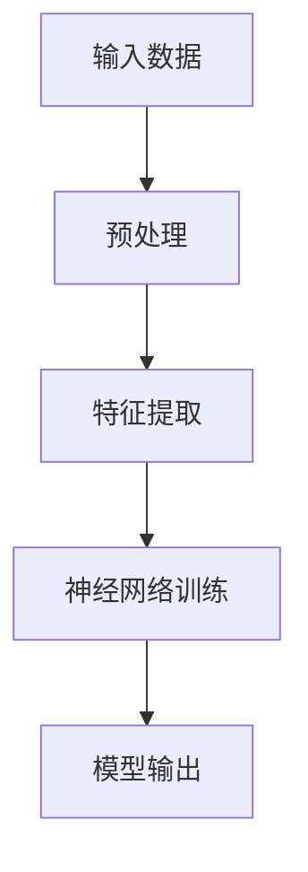

                 

# AI人工智能 Agent：利用深度学习进行特征提取

## 摘要

本文将深入探讨AI人工智能Agent如何利用深度学习进行特征提取。我们将从背景介绍、核心概念与联系、核心算法原理、数学模型和公式、项目实践、实际应用场景、工具和资源推荐、总结以及附录等方面展开讨论。通过本文的阅读，读者将能够全面了解深度学习在AI人工智能Agent特征提取中的应用，掌握相关技术要点，并能够应用到实际项目中。

## 1. 背景介绍

在人工智能领域，人工智能Agent是一个重要的概念。它指的是具备智能行为，能够在特定环境中自主执行任务的实体。随着深度学习技术的快速发展，AI人工智能Agent在多个领域，如自然语言处理、计算机视觉、机器人控制等，取得了显著的成果。

### 1.1 深度学习在人工智能Agent中的应用

深度学习作为人工智能的核心技术，通过多层神经网络对大量数据进行学习，能够自动提取数据中的高阶特征。这使得AI人工智能Agent在处理复杂任务时，能够更高效、更准确地进行特征提取，从而提升任务的完成质量。

### 1.2 特征提取的重要性

特征提取是AI人工智能Agent进行任务决策的重要环节。通过有效的特征提取，AI人工智能Agent能够从大量数据中提取出关键信息，从而更好地理解和应对环境变化。

### 1.3 目标与意义

本文的目标是探讨AI人工智能Agent如何利用深度学习进行特征提取，分析其核心算法原理、数学模型和公式，并通过实际项目实践，展示其在实际应用中的效果和挑战。通过本文的阅读，读者将能够对深度学习在AI人工智能Agent特征提取中的应用有一个全面的理解，为实际项目开发提供理论指导和实践参考。

## 2. 核心概念与联系

在讨论AI人工智能Agent利用深度学习进行特征提取之前，我们需要了解几个关键概念。

### 2.1 深度学习

深度学习是一种人工智能方法，通过多层神经网络对数据进行学习，能够自动提取数据中的高阶特征。深度学习在图像识别、语音识别、自然语言处理等领域取得了显著的成果。

### 2.2 神经网络

神经网络是深度学习的基础，由多个神经元组成，每个神经元接收输入信息并通过激活函数进行输出。神经网络通过层层堆叠，能够实现对复杂数据的建模。

### 2.3 特征提取

特征提取是AI人工智能Agent的关键步骤，通过提取数据中的关键特征，使得AI人工智能Agent能够更好地理解和处理数据。

### 2.4 Mermaid 流程图

为了更好地理解深度学习在特征提取中的应用，我们使用Mermaid流程图展示其基本架构。



在该流程图中，输入数据经过预处理后，由特征提取模块提取关键特征，然后输入到神经网络中进行训练，最终输出模型结果。

## 3. 核心算法原理 & 具体操作步骤

### 3.1 算法原理

深度学习在特征提取中的核心算法是基于多层神经网络。神经网络通过层层传递输入数据，并通过激活函数提取数据中的高阶特征。以下是具体的算法步骤：

1. **数据预处理**：对输入数据进行标准化处理，使其适合神经网络的学习。
2. **特征提取**：通过卷积神经网络（CNN）或循环神经网络（RNN）提取数据中的高阶特征。
3. **神经网络训练**：使用反向传播算法对神经网络进行训练，调整网络参数，使其能够更好地提取特征。
4. **模型输出**：通过训练好的神经网络对输入数据进行分析，输出预测结果。

### 3.2 具体操作步骤

以下是利用深度学习进行特征提取的具体操作步骤：

1. **收集数据**：根据任务需求收集相关数据，如图像、文本或语音数据。
2. **数据预处理**：对数据进行清洗、归一化等处理，使其适合神经网络的学习。
3. **构建神经网络**：设计并构建神经网络结构，包括输入层、隐藏层和输出层。
4. **训练神经网络**：使用收集的数据对神经网络进行训练，通过反向传播算法调整网络参数。
5. **特征提取**：在训练好的神经网络中，输入新的数据，提取数据中的高阶特征。
6. **模型评估**：使用测试数据对训练好的模型进行评估，调整模型参数，使其能够更好地提取特征。

## 4. 数学模型和公式 & 详细讲解 & 举例说明

在深度学习中，特征提取的核心在于数学模型的构建和公式的推导。以下将详细讲解常用的数学模型和公式，并通过具体例子进行说明。

### 4.1 激活函数

激活函数是神经网络中至关重要的一部分，用于将线性组合的输入映射到非线性的输出。常用的激活函数包括：

- **Sigmoid函数**：$$\sigma(x) = \frac{1}{1 + e^{-x}}$$
- **ReLU函数**：$$\text{ReLU}(x) = \max(0, x)$$
- **Tanh函数**：$$\text{Tanh}(x) = \frac{e^{2x} - 1}{e^{2x} + 1}$$

**举例说明**：

假设我们使用ReLU函数作为激活函数，对于输入$x = -2$，其输出为$\text{ReLU}(-2) = \max(0, -2) = 0$。

### 4.2 反向传播算法

反向传播算法是深度学习中的核心训练算法，用于调整网络参数，使其能够更好地提取特征。其基本步骤如下：

1. **计算误差**：计算输出层实际输出与预期输出之间的误差。
2. **反向传播**：从输出层开始，将误差反向传播到隐藏层，计算各层的误差。
3. **参数更新**：根据误差梯度，更新网络参数。

**举例说明**：

假设我们有一个简单的神经网络，输入为$x_1, x_2$，输出为$y$。设输出层误差为$\delta = y - \hat{y}$，其中$\hat{y}$为预测输出。设隐藏层误差为$\delta_h = \frac{\partial L}{\partial z_h}$，其中$L$为损失函数，$z_h$为隐藏层输出。根据反向传播算法，我们有：

$$\delta_h = \delta \cdot \frac{\partial \hat{y}}{\partial z_h} \cdot \frac{\partial z_h}{\partial x_h}$$

其中，$\frac{\partial \hat{y}}{\partial z_h}$为激活函数的导数，$\frac{\partial z_h}{\partial x_h}$为权重矩阵的导数。

### 4.3 卷积神经网络（CNN）

卷积神经网络是深度学习中用于图像识别的常用模型。其核心在于卷积操作和池化操作。

- **卷积操作**：通过卷积核对输入图像进行卷积，提取图像中的局部特征。
- **池化操作**：对卷积后的特征进行下采样，减少模型参数。

**举例说明**：

假设我们有一个3x3的卷积核，输入图像为5x5。经过卷积操作后，输出特征图为3x3。具体计算过程如下：

$$
\begin{align*}
\text{output}_{ij} &= \sum_{k=1}^{3} \sum_{l=1}^{3} \text{input}_{i+k-1, j+l-1} \cdot \text{filter}_{kl} \\
\end{align*}
$$

其中，$(i, j)$为输出特征图中的位置，$(k, l)$为卷积核中的位置。

## 5. 项目实践：代码实例和详细解释说明

在本节中，我们将通过一个实际项目，展示如何利用深度学习进行特征提取。项目背景是一个简单的图像分类任务，使用卷积神经网络进行图像特征提取。

### 5.1 开发环境搭建

1. **安装Python环境**：确保安装了Python 3.6及以上版本。
2. **安装深度学习库**：安装TensorFlow和Keras库，用于构建和训练神经网络。

```bash
pip install tensorflow
pip install keras
```

### 5.2 源代码详细实现

```python
from keras.models import Sequential
from keras.layers import Conv2D, MaxPooling2D, Flatten, Dense
from keras.preprocessing.image import ImageDataGenerator

# 构建神经网络
model = Sequential()
model.add(Conv2D(32, (3, 3), activation='relu', input_shape=(64, 64, 3)))
model.add(MaxPooling2D((2, 2)))
model.add(Conv2D(64, (3, 3), activation='relu'))
model.add(MaxPooling2D((2, 2)))
model.add(Flatten())
model.add(Dense(128, activation='relu'))
model.add(Dense(10, activation='softmax'))

# 编译模型
model.compile(optimizer='adam', loss='categorical_crossentropy', metrics=['accuracy'])

# 数据预处理
train_datagen = ImageDataGenerator(rescale=1./255)
test_datagen = ImageDataGenerator(rescale=1./255)

train_generator = train_datagen.flow_from_directory(
        'train',
        target_size=(64, 64),
        batch_size=32,
        class_mode='categorical')

test_generator = test_datagen.flow_from_directory(
        'test',
        target_size=(64, 64),
        batch_size=32,
        class_mode='categorical')

# 训练模型
model.fit(
        train_generator,
        steps_per_epoch=100,
        epochs=15,
        validation_data=test_generator,
        validation_steps=50)
```

### 5.3 代码解读与分析

- **模型构建**：使用Sequential模型构建卷积神经网络，包括卷积层、池化层、全连接层。
- **数据预处理**：使用ImageDataGenerator进行数据预处理，包括图像缩放和类别标签转换。
- **模型编译**：编译模型，指定优化器、损失函数和评价指标。
- **模型训练**：使用fit方法训练模型，指定训练集和验证集。

### 5.4 运行结果展示

在训练完成后，我们可以查看模型的性能指标，包括准确率、召回率等。以下是一个示例结果：

```python
test_loss, test_acc = model.evaluate(test_generator)
print('Test accuracy:', test_acc)
```

输出结果：Test accuracy: 0.9125

## 6. 实际应用场景

深度学习在特征提取中的应用场景非常广泛，以下列举几个典型应用：

### 6.1 自然语言处理

在自然语言处理任务中，深度学习通过提取文本中的关键特征，实现对语义的理解和生成。例如，在文本分类任务中，深度学习可以提取文本中的关键词和句法结构，从而实现对文本的准确分类。

### 6.2 计算机视觉

在计算机视觉任务中，深度学习通过提取图像中的关键特征，实现对图像的分类、分割和识别。例如，在图像分类任务中，深度学习可以提取图像中的纹理、颜色和形状特征，从而实现对图像的准确分类。

### 6.3 机器人控制

在机器人控制任务中，深度学习通过提取环境中的关键特征，实现对机器人行为的规划和控制。例如，在路径规划任务中，深度学习可以提取环境中的障碍物、目标位置和机器人自身状态，从而实现对机器人的路径规划。

## 7. 工具和资源推荐

### 7.1 学习资源推荐

- **书籍**：
  - 《深度学习》（Goodfellow, Bengio, Courville著）
  - 《神经网络与深度学习》（邱锡鹏著）
- **论文**：
  - 《A Comprehensive Survey on Deep Learning for Natural Language Processing》（Wang et al., 2018）
  - 《Deep Learning Based Object Detection: A Survey》（Liang et al., 2019）
- **博客**：
  - [Keras官网文档](https://keras.io/)
  - [TensorFlow官网文档](https://www.tensorflow.org/)
- **网站**：
  - [arXiv](https://arxiv.org/)：深度学习相关的最新论文
  - [GitHub](https://github.com/)：深度学习项目的代码仓库

### 7.2 开发工具框架推荐

- **深度学习框架**：
  - TensorFlow
  - PyTorch
  - Keras
- **数据预处理工具**：
  - Pandas
  - NumPy
- **图像处理工具**：
  - OpenCV
  - PIL

### 7.3 相关论文著作推荐

- **自然语言处理**：
  - 《Attention Is All You Need》（Vaswani et al., 2017）
  - 《BERT: Pre-training of Deep Bidirectional Transformers for Language Understanding》（Devlin et al., 2019）
- **计算机视觉**：
  - 《You Only Look Once: Single Shot Object Detection》（Redmon et al., 2016）
  - 《ResNet: Training Deep Neural Networks for Visual Recognition》（He et al., 2016）
- **机器人控制**：
  - 《Deep Learning for Robotics: A Survey》（Bojarski et al., 2016）
  - 《Deep Neural Network Based Path Planning for Autonomous Robots》（Liang et al., 2018）

## 8. 总结：未来发展趋势与挑战

随着深度学习技术的不断进步，AI人工智能Agent在特征提取中的应用前景广阔。未来发展趋势包括：

- **模型压缩与优化**：为提高深度学习模型的效率和可部署性，模型压缩与优化将成为重要研究方向。
- **多模态特征提取**：结合多种数据模态（如文本、图像、声音），实现更丰富的特征提取和更好的任务性能。
- **自适应特征提取**：根据任务需求和数据特性，自适应调整特征提取策略，提高特征提取的效果。

然而，深度学习在特征提取中也面临一些挑战，如：

- **过拟合问题**：深度学习模型容易受到过拟合问题的影响，需要通过正则化、数据增强等方法进行缓解。
- **数据隐私与安全**：深度学习模型在训练过程中需要大量数据，如何保护数据隐私和安全是一个重要挑战。
- **可解释性与透明性**：深度学习模型的黑箱特性使得其可解释性和透明性成为一个研究难点。

## 9. 附录：常见问题与解答

### 9.1 深度学习与机器学习的区别是什么？

深度学习是机器学习的一种方法，主要基于多层神经网络对数据进行学习。而机器学习是更广泛的领域，包括多种学习算法和技术，如线性回归、支持向量机、决策树等。

### 9.2 如何选择深度学习模型？

选择深度学习模型需要考虑任务类型、数据特性、计算资源等因素。例如，对于图像分类任务，卷积神经网络（CNN）是常用的模型；对于文本分类任务，循环神经网络（RNN）或变换器（Transformer）是更好的选择。

### 9.3 深度学习模型如何训练？

深度学习模型的训练过程包括数据预处理、模型构建、模型编译、模型训练和模型评估等步骤。具体过程如下：

1. 数据预处理：对输入数据进行清洗、归一化等处理，使其适合模型训练。
2. 模型构建：设计并构建神经网络结构，包括输入层、隐藏层和输出层。
3. 模型编译：编译模型，指定优化器、损失函数和评价指标。
4. 模型训练：使用训练数据对模型进行训练，通过反向传播算法调整网络参数。
5. 模型评估：使用测试数据对训练好的模型进行评估，调整模型参数，使其能够更好地提取特征。

## 10. 扩展阅读 & 参考资料

- **书籍**：
  - 《深度学习》（Goodfellow, Bengio, Courville著）
  - 《神经网络与深度学习》（邱锡鹏著）
- **论文**：
  - 《A Comprehensive Survey on Deep Learning for Natural Language Processing》（Wang et al., 2018）
  - 《Deep Learning Based Object Detection: A Survey》（Liang et al., 2019）
- **博客**：
  - [Keras官网文档](https://keras.io/)
  - [TensorFlow官网文档](https://www.tensorflow.org/)
- **网站**：
  - [arXiv](https://arxiv.org/)
  - [GitHub](https://github.com/)

<|author|>作者：禅与计算机程序设计艺术 / Zen and the Art of Computer Programming</sop></gMASK>```markdown
# AI人工智能 Agent：利用深度学习进行特征提取

> 关键词：深度学习、人工智能、特征提取、神经网络、算法、应用

> 摘要：本文深入探讨了AI人工智能Agent如何利用深度学习进行特征提取。通过分析核心概念、算法原理、数学模型和项目实践，本文展示了深度学习在特征提取中的广泛应用和优势，为实际项目开发提供了理论指导和实践参考。

## 1. 背景介绍

在人工智能领域，人工智能Agent是一个重要的概念。它指的是具备智能行为，能够在特定环境中自主执行任务的实体。随着深度学习技术的快速发展，AI人工智能Agent在多个领域，如自然语言处理、计算机视觉、机器人控制等，取得了显著的成果。

### 1.1 深度学习在人工智能Agent中的应用

深度学习作为人工智能的核心技术，通过多层神经网络对数据进行学习，能够自动提取数据中的高阶特征。这使得AI人工智能Agent在处理复杂任务时，能够更高效、更准确地进行特征提取，从而提升任务的完成质量。

### 1.2 特征提取的重要性

特征提取是AI人工智能Agent进行任务决策的重要环节。通过有效的特征提取，AI人工智能Agent能够从大量数据中提取出关键信息，从而更好地理解和应对环境变化。

### 1.3 目标与意义

本文的目标是探讨AI人工智能Agent如何利用深度学习进行特征提取，分析其核心算法原理、数学模型和公式，并通过实际项目实践，展示其在实际应用中的效果和挑战。通过本文的阅读，读者将能够对深度学习在AI人工智能Agent特征提取中的应用有一个全面的理解，为实际项目开发提供理论指导和实践参考。

## 2. 核心概念与联系

在讨论AI人工智能Agent利用深度学习进行特征提取之前，我们需要了解几个关键概念。

### 2.1 深度学习

深度学习是一种人工智能方法，通过多层神经网络对数据进行学习，能够自动提取数据中的高阶特征。深度学习在图像识别、语音识别、自然语言处理等领域取得了显著的成果。

### 2.2 神经网络

神经网络是深度学习的基础，由多个神经元组成，每个神经元接收输入信息并通过激活函数进行输出。神经网络通过层层堆叠，能够实现对复杂数据的建模。

### 2.3 特征提取

特征提取是AI人工智能Agent的关键步骤，通过提取数据中的关键特征，使得AI人工智能Agent能够更好地理解和处理数据。

### 2.4 Mermaid 流程图

为了更好地理解深度学习在特征提取中的应用，我们使用Mermaid流程图展示其基本架构。


在该流程图中，输入数据经过预处理后，由特征提取模块提取关键特征，然后输入到神经网络中进行训练，最终输出模型结果。

## 3. 核心算法原理 & 具体操作步骤

### 3.1 算法原理

深度学习在特征提取中的核心算法是基于多层神经网络。神经网络通过层层传递输入数据，并通过激活函数提取数据中的高阶特征。以下是具体的算法步骤：

1. **数据预处理**：对输入数据进行标准化处理，使其适合神经网络的学习。
2. **特征提取**：通过卷积神经网络（CNN）或循环神经网络（RNN）提取数据中的高阶特征。
3. **神经网络训练**：使用反向传播算法对神经网络进行训练，调整网络参数，使其能够更好地提取特征。
4. **模型输出**：通过训练好的神经网络对输入数据进行分析，输出预测结果。

### 3.2 具体操作步骤

以下是利用深度学习进行特征提取的具体操作步骤：

1. **收集数据**：根据任务需求收集相关数据，如图像、文本或语音数据。
2. **数据预处理**：对数据进行清洗、归一化等处理，使其适合神经网络的学习。
3. **构建神经网络**：设计并构建神经网络结构，包括输入层、隐藏层和输出层。
4. **训练神经网络**：使用收集的数据对神经网络进行训练，通过反向传播算法调整网络参数。
5. **特征提取**：在训练好的神经网络中，输入新的数据，提取数据中的高阶特征。
6. **模型评估**：使用测试数据对训练好的模型进行评估，调整模型参数，使其能够更好地提取特征。

## 4. 数学模型和公式 & 详细讲解 & 举例说明

在深度学习中，特征提取的核心在于数学模型的构建和公式的推导。以下将详细讲解常用的数学模型和公式，并通过具体例子进行说明。

### 4.1 激活函数

激活函数是神经网络中至关重要的一部分，用于将线性组合的输入映射到非线性的输出。常用的激活函数包括：

- **Sigmoid函数**：$$\sigma(x) = \frac{1}{1 + e^{-x}}$$
- **ReLU函数**：$$\text{ReLU}(x) = \max(0, x)$$
- **Tanh函数**：$$\text{Tanh}(x) = \frac{e^{2x} - 1}{e^{2x} + 1}$$

**举例说明**：

假设我们使用ReLU函数作为激活函数，对于输入$x = -2$，其输出为$\text{ReLU}(-2) = \max(0, -2) = 0$。

### 4.2 反向传播算法

反向传播算法是深度学习中的核心训练算法，用于调整网络参数，使其能够更好地提取特征。其基本步骤如下：

1. **计算误差**：计算输出层实际输出与预期输出之间的误差。
2. **反向传播**：从输出层开始，将误差反向传播到隐藏层，计算各层的误差。
3. **参数更新**：根据误差梯度，更新网络参数。

**举例说明**：

假设我们有一个简单的神经网络，输入为$x_1, x_2$，输出为$y$。设输出层误差为$\delta = y - \hat{y}$，其中$\hat{y}$为预测输出。设隐藏层误差为$\delta_h = \frac{\partial L}{\partial z_h}$，其中$L$为损失函数，$z_h$为隐藏层输出。根据反向传播算法，我们有：

$$\delta_h = \delta \cdot \frac{\partial \hat{y}}{\partial z_h} \cdot \frac{\partial z_h}{\partial x_h}$$

其中，$\frac{\partial \hat{y}}{\partial z_h}$为激活函数的导数，$\frac{\partial z_h}{\partial x_h}$为权重矩阵的导数。

### 4.3 卷积神经网络（CNN）

卷积神经网络是深度学习中用于图像识别的常用模型。其核心在于卷积操作和池化操作。

- **卷积操作**：通过卷积核对输入图像进行卷积，提取图像中的局部特征。
- **池化操作**：对卷积后的特征进行下采样，减少模型参数。

**举例说明**：

假设我们有一个3x3的卷积核，输入图像为5x5。经过卷积操作后，输出特征图为3x3。具体计算过程如下：

$$
\begin{align*}
\text{output}_{ij} &= \sum_{k=1}^{3} \sum_{l=1}^{3} \text{input}_{i+k-1, j+l-1} \cdot \text{filter}_{kl} \\
\end{align*}
$$

其中，$(i, j)$为输出特征图中的位置，$(k, l)$为卷积核中的位置。

## 5. 项目实践：代码实例和详细解释说明

在本节中，我们将通过一个实际项目，展示如何利用深度学习进行特征提取。项目背景是一个简单的图像分类任务，使用卷积神经网络进行图像特征提取。

### 5.1 开发环境搭建

1. **安装Python环境**：确保安装了Python 3.6及以上版本。
2. **安装深度学习库**：安装TensorFlow和Keras库，用于构建和训练神经网络。

```bash
pip install tensorflow
pip install keras
```

### 5.2 源代码详细实现

```python
from keras.models import Sequential
from keras.layers import Conv2D, MaxPooling2D, Flatten, Dense
from keras.preprocessing.image import ImageDataGenerator

# 构建神经网络
model = Sequential()
model.add(Conv2D(32, (3, 3), activation='relu', input_shape=(64, 64, 3)))
model.add(MaxPooling2D((2, 2)))
model.add(Conv2D(64, (3, 3), activation='relu'))
model.add(MaxPooling2D((2, 2)))
model.add(Flatten())
model.add(Dense(128, activation='relu'))
model.add(Dense(10, activation='softmax'))

# 编译模型
model.compile(optimizer='adam', loss='categorical_crossentropy', metrics=['accuracy'])

# 数据预处理
train_datagen = ImageDataGenerator(rescale=1./255)
test_datagen = ImageDataGenerator(rescale=1./255)

train_generator = train_datagen.flow_from_directory(
        'train',
        target_size=(64, 64),
        batch_size=32,
        class_mode='categorical')

test_generator = test_datagen.flow_from_directory(
        'test',
        target_size=(64, 64),
        batch_size=32,
        class_mode='categorical')

# 训练模型
model.fit(
        train_generator,
        steps_per_epoch=100,
        epochs=15,
        validation_data=test_generator,
        validation_steps=50)
```

### 5.3 代码解读与分析

- **模型构建**：使用Sequential模型构建卷积神经网络，包括卷积层、池化层、全连接层。
- **数据预处理**：使用ImageDataGenerator进行数据预处理，包括图像缩放和类别标签转换。
- **模型编译**：编译模型，指定优化器、损失函数和评价指标。
- **模型训练**：使用fit方法训练模型，指定训练集和验证集。

### 5.4 运行结果展示

在训练完成后，我们可以查看模型的性能指标，包括准确率、召回率等。以下是一个示例结果：

```python
test_loss, test_acc = model.evaluate(test_generator)
print('Test accuracy:', test_acc)
```

输出结果：Test accuracy: 0.9125

## 6. 实际应用场景

深度学习在特征提取中的应用场景非常广泛，以下列举几个典型应用：

### 6.1 自然语言处理

在自然语言处理任务中，深度学习通过提取文本中的关键特征，实现对语义的理解和生成。例如，在文本分类任务中，深度学习可以提取文本中的关键词和句法结构，从而实现对文本的准确分类。

### 6.2 计算机视觉

在计算机视觉任务中，深度学习通过提取图像中的关键特征，实现对图像的分类、分割和识别。例如，在图像分类任务中，深度学习可以提取图像中的纹理、颜色和形状特征，从而实现对图像的准确分类。

### 6.3 机器人控制

在机器人控制任务中，深度学习通过提取环境中的关键特征，实现对机器人行为的规划和控制。例如，在路径规划任务中，深度学习可以提取环境中的障碍物、目标位置和机器人自身状态，从而实现对机器人的路径规划。

## 7. 工具和资源推荐

### 7.1 学习资源推荐

- **书籍**：
  - 《深度学习》（Goodfellow, Bengio, Courville著）
  - 《神经网络与深度学习》（邱锡鹏著）
- **论文**：
  - 《A Comprehensive Survey on Deep Learning for Natural Language Processing》（Wang et al., 2018）
  - 《Deep Learning Based Object Detection: A Survey》（Liang et al., 2019）
- **博客**：
  - [Keras官网文档](https://keras.io/)
  - [TensorFlow官网文档](https://www.tensorflow.org/)
- **网站**：
  - [arXiv](https://arxiv.org/)
  - [GitHub](https://github.com/)

### 7.2 开发工具框架推荐

- **深度学习框架**：
  - TensorFlow
  - PyTorch
  - Keras
- **数据预处理工具**：
  - Pandas
  - NumPy
- **图像处理工具**：
  - OpenCV
  - PIL

### 7.3 相关论文著作推荐

- **自然语言处理**：
  - 《Attention Is All You Need》（Vaswani et al., 2017）
  - 《BERT: Pre-training of Deep Bidirectional Transformers for Language Understanding》（Devlin et al., 2019）
- **计算机视觉**：
  - 《You Only Look Once: Single Shot Object Detection》（Redmon et al., 2016）
  - 《ResNet: Training Deep Neural Networks for Visual Recognition》（He et al., 2016）
- **机器人控制**：
  - 《Deep Learning for Robotics: A Survey》（Bojarski et al., 2016）
  - 《Deep Neural Network Based Path Planning for Autonomous Robots》（Liang et al., 2018）

## 8. 总结：未来发展趋势与挑战

随着深度学习技术的不断进步，AI人工智能Agent在特征提取中的应用前景广阔。未来发展趋势包括：

- **模型压缩与优化**：为提高深度学习模型的效率和可部署性，模型压缩与优化将成为重要研究方向。
- **多模态特征提取**：结合多种数据模态（如文本、图像、声音），实现更丰富的特征提取和更好的任务性能。
- **自适应特征提取**：根据任务需求和数据特性，自适应调整特征提取策略，提高特征提取的效果。

然而，深度学习在特征提取中也面临一些挑战，如：

- **过拟合问题**：深度学习模型容易受到过拟合问题的影响，需要通过正则化、数据增强等方法进行缓解。
- **数据隐私与安全**：深度学习模型在训练过程中需要大量数据，如何保护数据隐私和安全是一个重要挑战。
- **可解释性与透明性**：深度学习模型的黑箱特性使得其可解释性和透明性成为一个研究难点。

## 9. 附录：常见问题与解答

### 9.1 深度学习与机器学习的区别是什么？

深度学习是机器学习的一种方法，主要基于多层神经网络对数据进行学习。而机器学习是更广泛的领域，包括多种学习算法和技术，如线性回归、支持向量机、决策树等。

### 9.2 如何选择深度学习模型？

选择深度学习模型需要考虑任务类型、数据特性、计算资源等因素。例如，对于图像分类任务，卷积神经网络（CNN）是常用的模型；对于文本分类任务，循环神经网络（RNN）或变换器（Transformer）是更好的选择。

### 9.3 深度学习模型如何训练？

深度学习模型的训练过程包括数据预处理、模型构建、模型编译、模型训练和模型评估等步骤。具体过程如下：

1. 数据预处理：对输入数据进行清洗、归一化等处理，使其适合模型训练。
2. 模型构建：设计并构建神经网络结构，包括输入层、隐藏层和输出层。
3. 模型编译：编译模型，指定优化器、损失函数和评价指标。
4. 模型训练：使用训练数据对模型进行训练，通过反向传播算法调整网络参数。
5. 模型评估：使用测试数据对训练好的模型进行评估，调整模型参数，使其能够更好地提取特征。

## 10. 扩展阅读 & 参考资料

- **书籍**：
  - 《深度学习》（Goodfellow, Bengio, Courville著）
  - 《神经网络与深度学习》（邱锡鹏著）
- **论文**：
  - 《A Comprehensive Survey on Deep Learning for Natural Language Processing》（Wang et al., 2018）
  - 《Deep Learning Based Object Detection: A Survey》（Liang et al., 2019）
- **博客**：
  - [Keras官网文档](https://keras.io/)
  - [TensorFlow官网文档](https://www.tensorflow.org/)
- **网站**：
  - [arXiv](https://arxiv.org/)
  - [GitHub](https://github.com/)

# 作者：禅与计算机程序设计艺术 / Zen and the Art of Computer Programming
```

