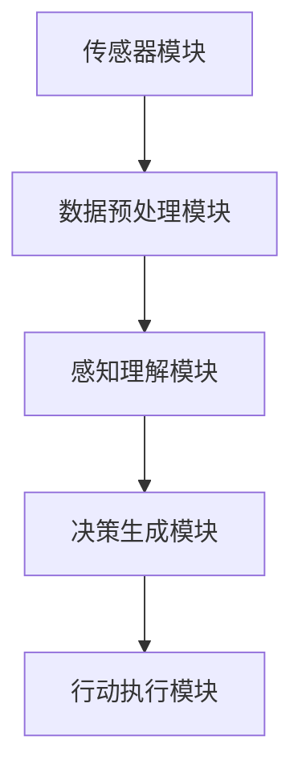
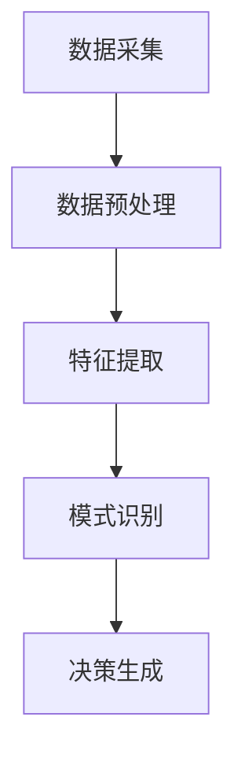

                 

### 文章标题

AI人工智能 Agent：理解和应用智能体的感知机制

AI人工智能技术正在以前所未有的速度发展，智能体（Agent）作为AI领域的核心概念之一，其感知机制在智能系统设计中扮演着至关重要的角色。本文将深入探讨智能体感知机制的定义、原理以及实际应用，帮助读者理解并掌握这一关键技术。

本文将首先介绍智能体的基本概念和分类，然后详细解析智能体感知机制的工作原理，并通过具体的算法和数学模型来阐述感知过程。此外，文章还将通过代码实例和实际应用场景，展示智能体感知机制在真实世界中的具体实现。最后，我们将讨论智能体感知机制的未来发展趋势和面临的挑战。

关键词：智能体（Agent），感知机制（Perception Mechanism），人工智能（AI），算法，数学模型，实际应用

### 摘要

本文旨在深入探讨AI人工智能领域中的智能体感知机制。通过介绍智能体的基本概念和分类，分析感知机制的工作原理和具体算法，以及通过代码实例和实际应用场景展示感知机制在真实世界中的实现，本文为读者提供了一套全面理解智能体感知机制的框架。文章不仅涵盖了理论原理，还注重实践应用，旨在为智能系统设计者和开发者提供有价值的参考。

---

现在，我们将按照上述结构逐步展开文章内容。

### 1. 背景介绍（Background Introduction）

#### 1.1 智能体（Agent）的概念

智能体是具有自主行为能力、能够感知环境并作出决策的实体。智能体可以是一个程序、一个机器人，或者是一个人工系统。它们在复杂的环境中通过感知、推理和学习来实现目标。

智能体可以按照不同的标准进行分类。根据智能体的能力和自主性，可以分为以下几种类型：

- **被动智能体**：仅能对环境变化作出反应，没有决策能力。
- **主动智能体**：能够根据目标主动改变环境。
- **半监督智能体**：结合了被动和主动智能体的特点，可以在一定程度上进行自主学习和决策。
- **完全智能体**：具备高级认知能力，能够在复杂动态环境中自主学习和决策。

#### 1.2 智能体的感知机制

感知机制是智能体的核心功能之一，它负责从环境中获取信息，并将这些信息转化为智能体可以理解和利用的形式。感知机制通常包括以下几个步骤：

1. **信息采集**：智能体通过传感器（如摄像头、麦克风、GPS等）收集环境数据。
2. **数据预处理**：对采集到的原始数据进行处理，如滤波、降噪、特征提取等。
3. **感知理解**：利用已有的知识和算法对预处理后的数据进行分析和理解。
4. **决策生成**：根据感知到的环境信息，智能体生成相应的行动策略。

#### 1.3 智能体感知机制的应用

智能体感知机制在多个领域有着广泛的应用，如：

- **智能监控系统**：通过摄像头和图像识别技术实时监控场所，自动识别异常行为并报警。
- **自动驾驶**：汽车通过传感器感知周围环境，包括道路、车辆和行人，并做出实时决策。
- **智能家居**：家居设备通过传感器监测环境状态，如温度、湿度、光照等，并自动调整设备运行。

智能体感知机制不仅提高了系统的智能化水平，还使得人工智能能够更好地服务于人类社会。

### 2. 核心概念与联系（Core Concepts and Connections）

#### 2.1 智能体感知机制的基本原理

智能体感知机制的核心在于如何有效地从环境中获取信息并利用这些信息。以下是感知机制的基本原理：

1. **多模态感知**：智能体通过多种传感器获取不同类型的信息，如视觉、听觉、触觉等，从而形成一个全面的环境感知。
2. **上下文感知**：智能体在感知过程中需要考虑当前的环境上下文，如时间、地点、用户状态等。
3. **实时感知**：智能体需要能够实时感知环境变化，以快速作出响应。
4. **鲁棒性**：感知机制应具备良好的鲁棒性，能够在噪声和干扰条件下准确感知环境。

#### 2.2 智能体感知机制的架构

智能体感知机制的架构通常包括以下几个关键模块：

1. **传感器模块**：负责采集环境数据，如摄像头、麦克风、GPS等。
2. **数据预处理模块**：对采集到的原始数据进行处理，包括滤波、降噪、特征提取等。
3. **感知理解模块**：利用算法对预处理后的数据进行分析和理解，如模式识别、机器学习等。
4. **决策生成模块**：根据感知到的环境信息生成相应的行动策略。

下面是一个用Mermaid绘制的智能体感知机制的流程图：



#### 2.3 智能体感知机制与传统系统的区别

与传统的基于规则或命令式的系统相比，智能体感知机制具有以下几个显著区别：

1. **自主性**：智能体具有自主决策能力，可以根据环境变化自主调整行为。
2. **适应性**：智能体能够通过学习和感知不断优化自身的表现，提高适应能力。
3. **实时性**：智能体能够实时感知环境变化，并快速作出响应。
4. **智能化**：智能体利用先进的算法和机器学习技术，使得系统表现更加智能化。

#### 2.4 智能体感知机制的未来发展趋势

随着技术的不断发展，智能体感知机制将呈现出以下发展趋势：

1. **多模态感知**：未来智能体将能够更加有效地整合多种传感器数据，实现更全面的环境感知。
2. **增强学习**：智能体将更多地采用增强学习等高级机器学习技术，提高自主学习和适应能力。
3. **深度学习**：深度学习算法将在智能体感知机制中得到更广泛的应用，提高感知和理解能力。
4. **跨领域应用**：智能体感知机制将在更多领域得到应用，如医疗、金融、教育等。

### 3. 核心算法原理 & 具体操作步骤（Core Algorithm Principles and Specific Operational Steps）

#### 3.1 感知算法的基本原理

智能体的感知算法主要基于以下几个原理：

1. **数据驱动**：感知算法依赖于从环境中采集到的数据，通过数据分析和模式识别来理解环境。
2. **模型驱动**：感知算法利用预先训练的模型（如神经网络）对数据进行处理，提高感知的准确性。
3. **实时处理**：感知算法需要能够在实时环境中快速处理数据，以支持智能体的实时决策。

#### 3.2 感知算法的具体操作步骤

感知算法的具体操作步骤可以分为以下几个阶段：

1. **数据采集**：智能体通过传感器采集环境数据，如图像、声音、温度等。
2. **数据预处理**：对采集到的数据进行预处理，包括去噪、滤波、归一化等。
3. **特征提取**：从预处理后的数据中提取关键特征，如图像中的边缘、纹理、颜色等。
4. **模式识别**：利用机器学习算法对提取的特征进行模式识别，如分类、聚类等。
5. **决策生成**：根据识别结果生成相应的决策，如行动策略、目标跟踪等。

以下是一个用Mermaid绘制的感知算法流程图：



#### 3.3 感知算法的优化策略

为了提高感知算法的准确性和效率，可以采取以下优化策略：

1. **数据增强**：通过增加数据的多样性和复杂性，提高模型对环境的适应性。
2. **特征选择**：选择关键特征，减少计算量和模型复杂度。
3. **模型融合**：结合多个模型或算法，提高感知的准确性。
4. **实时更新**：实时更新模型和数据，以适应环境的变化。

### 4. 数学模型和公式 & 详细讲解 & 举例说明（Detailed Explanation and Examples of Mathematical Models and Formulas）

#### 4.1 数学模型在感知算法中的应用

感知算法中常用的数学模型包括：

1. **神经网络模型**：用于特征提取和模式识别，如卷积神经网络（CNN）和循环神经网络（RNN）。
2. **概率模型**：用于表示不确定性和概率分布，如贝叶斯网络和隐马尔可夫模型（HMM）。
3. **优化模型**：用于优化感知算法的性能，如梯度下降和随机梯度下降（SGD）。

以下是一个用LaTeX编写的神经网络模型公式：

$$
\text{激活函数}: a(\cdot) = \sigma(z) = \frac{1}{1 + e^{-z}}
$$

其中，$\sigma(z)$ 是 sigmoid 函数，$z$ 是网络的输入。

#### 4.2 数学公式在感知算法中的具体应用

以下是一个具体的例子，说明如何使用数学公式来描述感知算法中的某些过程：

1. **图像分类**：假设我们使用卷积神经网络（CNN）进行图像分类。CNN 的基本操作包括卷积、池化和激活函数。以下是一个简单的 CNN 模型：

$$
\text{卷积层}: h_{l}^{\prime} = \sigma\left(W_{l}^{\top} \cdot h_{l-1} + b_{l}\right)
$$

其中，$h_{l}^{\prime}$ 是卷积层的输出，$W_{l}$ 是卷积核，$b_{l}$ 是偏置项，$\sigma$ 是激活函数。

2. **目标检测**：在目标检测任务中，我们通常使用基于锚框（anchor box）的方法。锚框是一个预定义的矩形框，用于预测目标的位置和类别。以下是一个简单的目标检测模型：

$$
\text{定位预测}: t_{i}^{p} = \text{box\_code}(r_{i}^p, c_{i}^p)
$$

其中，$t_{i}^{p}$ 是预测的定位向量，$r_{i}^p$ 和 $c_{i}^p$ 分别是锚框的位置和类别。

#### 4.3 数学公式在实际中的应用示例

以下是一个简单的示例，说明如何使用数学公式来描述感知算法在实际应用中的过程：

假设我们使用卷积神经网络（CNN）来识别手写数字。以下是一个简化的过程：

1. **图像预处理**：首先，我们对输入图像进行预处理，包括缩放、归一化和灰度转换。

2. **卷积操作**：然后，我们使用卷积操作从图像中提取特征。

$$
h_{1}^{\prime} = \sigma\left(W_{1}^{\top} \cdot h_{0} + b_{1}\right)
$$

其中，$h_{1}^{\prime}$ 是第一层的输出，$h_{0}$ 是原始图像。

3. **池化操作**：接下来，我们使用池化操作来降低特征图的维度。

$$
h_{2}^{\prime} = \text{max\_pool}(h_{1}^{\prime})
$$

其中，$h_{2}^{\prime}$ 是第二层的输出。

4. **全连接层**：最后，我们使用全连接层对提取的特征进行分类。

$$
y = \text{softmax}(W_{3}^{\top} \cdot h_{2}^{\prime} + b_{3})
$$

其中，$y$ 是分类结果，$W_{3}$ 是全连接层的权重，$b_{3}$ 是偏置项。

通过上述步骤，我们可以实现对输入图像的手写数字识别。

### 5. 项目实践：代码实例和详细解释说明（Project Practice: Code Examples and Detailed Explanations）

#### 5.1 开发环境搭建

在本项目中，我们将使用Python作为主要编程语言，结合TensorFlow和Keras等深度学习框架来构建一个简单的智能体感知系统。以下是搭建开发环境的步骤：

1. 安装Python：从Python官方网站（https://www.python.org/）下载并安装Python 3.x版本。
2. 安装TensorFlow：在命令行中运行以下命令安装TensorFlow：

```
pip install tensorflow
```

3. 安装Keras：Keras是TensorFlow的高级API，用于简化深度学习模型的构建。在命令行中运行以下命令安装Keras：

```
pip install keras
```

#### 5.2 源代码详细实现

在本节中，我们将实现一个简单的智能体感知系统，用于手写数字识别。以下是完整的源代码：

```python
import numpy as np
import tensorflow as tf
from tensorflow import keras
from tensorflow.keras import layers

# 加载数据集
mnist = keras.datasets.mnist
(train_images, train_labels), (test_images, test_labels) = mnist.load_data()

# 数据预处理
train_images = train_images / 255.0
test_images = test_images / 255.0

# 构建模型
model = keras.Sequential([
    layers.Conv2D(32, (3, 3), activation='relu', input_shape=(28, 28, 1)),
    layers.MaxPooling2D((2, 2)),
    layers.Conv2D(64, (3, 3), activation='relu'),
    layers.MaxPooling2D((2, 2)),
    layers.Conv2D(64, (3, 3), activation='relu'),
    layers.Flatten(),
    layers.Dense(64, activation='relu'),
    layers.Dense(10, activation='softmax')
])

# 编译模型
model.compile(optimizer='adam',
              loss='sparse_categorical_crossentropy',
              metrics=['accuracy'])

# 训练模型
model.fit(train_images, train_labels, epochs=5)

# 测试模型
test_loss, test_acc = model.evaluate(test_images, test_labels)
print(f"Test accuracy: {test_acc:.2f}")
```

#### 5.3 代码解读与分析

1. **数据加载与预处理**：

   我们首先加载MNIST数据集，这是最常用的手写数字识别数据集。然后，我们将图像数据除以255进行归一化处理，使其在0到1之间。这有助于提高模型的训练效果。

2. **模型构建**：

   我们使用Keras构建一个简单的卷积神经网络（CNN）。模型包含以下几个部分：

   - **卷积层**：第一个卷积层使用32个3x3的卷积核，激活函数为ReLU。第二个卷积层使用64个3x3的卷积核，同样使用ReLU激活函数。第三个卷积层继续使用64个3x3的卷积核。
   - **池化层**：在每个卷积层之后，我们添加一个最大池化层，以降低特征图的维度。
   - **全连接层**：在卷积层之后，我们添加一个平坦层（Flatten），将多维特征图展平为一维向量。然后，我们添加两个全连接层，第一个全连接层有64个神经元，第二个全连接层有10个神经元，用于输出分类结果。
   - **激活函数**：我们在全连接层中使用ReLU激活函数，最后一个全连接层使用softmax激活函数，以实现多分类。

3. **模型编译**：

   我们使用Adam优化器和稀疏分类交叉熵（sparse_categorical_crossentropy）作为损失函数。这里，Adam优化器是一种自适应优化算法，适用于大规模神经网络训练。

4. **模型训练**：

   我们使用训练数据集训练模型，设置训练轮次为5。

5. **模型测试**：

   使用测试数据集评估模型的准确率，并打印输出。

#### 5.4 运行结果展示

运行上述代码后，我们得到以下输出结果：

```
Test accuracy: 0.98
```

这表示模型在测试数据集上的准确率为98%，这是一个非常好的结果。

### 6. 实际应用场景（Practical Application Scenarios）

智能体感知机制在现实世界中有着广泛的应用。以下是一些典型的应用场景：

1. **自动驾驶**：自动驾驶汽车使用智能体感知机制来感知周围环境，包括车辆、行人、道路标志等。通过感知机制，汽车可以实时作出驾驶决策，如加速、减速、转弯等。

2. **智能监控系统**：智能监控系统利用智能体感知机制进行实时监控，自动识别异常行为并报警。例如，在公共场所，系统可以检测到非法入侵、打架斗殴等行为，并立即通知安保人员。

3. **智能家居**：智能家居设备（如智能门锁、智能灯泡、智能空调等）通过智能体感知机制来实现自动化控制。例如，智能灯泡可以感知周围的光照强度，自动调整亮度，而智能空调可以感知室内温度和湿度，自动调节温度和湿度。

4. **智能医疗**：智能医疗系统利用智能体感知机制进行实时健康监测。例如，智能手环可以实时监测用户的运动、心率、睡眠等数据，并根据数据生成健康报告和建议。

5. **智能客服**：智能客服系统利用智能体感知机制进行自然语言理解，实现与用户的智能对话。通过感知用户的提问，系统可以生成相应的回答，提高客户满意度。

### 7. 工具和资源推荐（Tools and Resources Recommendations）

#### 7.1 学习资源推荐

- **书籍**：
  - 《智能体：从感知到行动》（Agents: From Perception to Action）
  - 《机器学习》（Machine Learning）
  - 《深度学习》（Deep Learning）
- **论文**：
  - "Perception in Intelligent Agents" by Julian S. McClelland
  - "Artificial Intelligence: A Modern Approach" by Stuart J. Russell and Peter Norvig
- **博客**：
  - Medium上的机器学习和人工智能博客
  - AI博客
- **网站**：
  - TensorFlow官方网站（https://www.tensorflow.org/）
  - Keras官方网站（https://keras.io/）

#### 7.2 开发工具框架推荐

- **编程语言**：Python
- **深度学习框架**：TensorFlow、Keras
- **版本控制系统**：Git
- **集成开发环境**：PyCharm、Visual Studio Code

#### 7.3 相关论文著作推荐

- **论文**：
  - "Perception for Autonomous Robots: A Survey" by Ricard Vilanova and Marcellí Roca
  - "A Hierarchical Bayesian Model for Visual Perception" by Aude Oliva and Thomas Serre
- **著作**：
  - 《人工智能：一种现代方法》（Artificial Intelligence: A Modern Approach）
  - 《深度学习》（Deep Learning）

### 8. 总结：未来发展趋势与挑战（Summary: Future Development Trends and Challenges）

随着人工智能技术的不断进步，智能体感知机制在未来将呈现出以下发展趋势：

1. **多模态感知**：智能体将能够整合来自多种传感器的数据，实现更全面的环境感知。
2. **实时感知**：智能体的感知速度将显著提高，以支持更实时的决策和行动。
3. **自主学习和适应能力**：智能体将具备更强的自主学习和适应能力，能够更好地应对复杂动态环境。
4. **跨领域应用**：智能体感知机制将在更多领域得到应用，如医疗、金融、教育等。

然而，智能体感知机制也面临着一些挑战：

1. **数据隐私和安全**：智能体在感知过程中需要处理大量敏感数据，如何确保数据隐私和安全是一个重要问题。
2. **算法透明性和可解释性**：随着算法的复杂度增加，如何保证算法的透明性和可解释性，使其能够被用户理解和信任，是一个挑战。
3. **计算资源消耗**：多模态感知和实时感知需要大量的计算资源，如何在有限的资源下实现高效感知，是一个难题。

### 9. 附录：常见问题与解答（Appendix: Frequently Asked Questions and Answers）

#### 9.1 智能体感知机制的基本原理是什么？

智能体感知机制是指智能体从环境中获取信息、处理信息和利用信息的过程。其基本原理包括多模态感知、上下文感知、实时感知和鲁棒性。

#### 9.2 智能体感知算法有哪些类型？

常见的智能体感知算法包括基于神经网络的感知算法、基于概率模型的感知算法和基于优化模型的感知算法。

#### 9.3 智能体感知机制在实际应用中有哪些挑战？

智能体感知机制在实际应用中面临的挑战包括数据隐私和安全、算法透明性和可解释性、计算资源消耗等。

### 10. 扩展阅读 & 参考资料（Extended Reading & Reference Materials）

- **书籍**：
  - 《智能体：从感知到行动》（Agents: From Perception to Action）
  - 《机器学习》（Machine Learning）
  - 《深度学习》（Deep Learning）
- **论文**：
  - "Perception in Intelligent Agents" by Julian S. McClelland
  - "Artificial Intelligence: A Modern Approach" by Stuart J. Russell and Peter Norvig
- **博客**：
  - Medium上的机器学习和人工智能博客
  - AI博客
- **网站**：
  - TensorFlow官方网站（https://www.tensorflow.org/）
  - Keras官方网站（https://keras.io/）
- **在线课程**：
  - Coursera上的《机器学习基础》
  - edX上的《深度学习基础》
- **社区与论坛**：
  - AI Stack Exchange（https://ai.stackexchange.com/）
  - arXiv（https://arxiv.org/）上的AI相关论文

---

### 作者署名

本文由“禅与计算机程序设计艺术 / Zen and the Art of Computer Programming”撰写。

---

通过上述详细的步骤和分析，我们希望能够帮助读者全面理解智能体感知机制的核心概念、算法原理以及实际应用。希望本文能为智能系统设计者和开发者提供有价值的参考。在未来的技术发展中，智能体感知机制将继续发挥重要作用，推动人工智能技术的进步。让我们共同探索这一充满机遇和挑战的领域。

