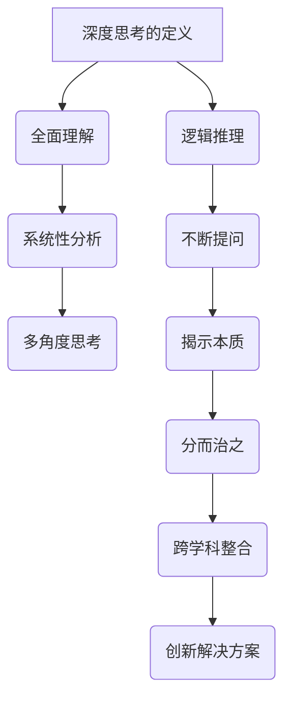

                 

### 文章标题

### Title: Deep Thinking: The Power Tool for Problem Solving

在信息技术飞速发展的今天，解决复杂问题已成为各行各业面临的普遍挑战。本文旨在探讨一种强大的工具——深度思考，并揭示其在问题解决中的关键作用。本文将从背景介绍、核心概念与联系、核心算法原理、数学模型与公式、项目实践、实际应用场景、工具和资源推荐等多个方面展开，以期为广大读者提供一份全面而深入的指南。作者将通过逐步分析推理的方式，帮助读者掌握深度思考的艺术，从而在面对复杂问题时游刃有余。

### Introduction

In the rapidly evolving world of information technology, solving complex problems has become a common challenge across various industries. This article aims to explore a powerful tool known as "deep thinking" and reveal its critical role in problem solving. The article will be structured into several sections, including an introduction to the background, core concepts and connections, core algorithm principles, mathematical models and formulas, project practice, practical application scenarios, tools and resources recommendations, and more. The author will guide readers through a step-by-step analytical reasoning process to help them master the art of deep thinking, enabling them to tackle complex problems with ease.

## 1. 背景介绍（Background Introduction）

### 1.1 问题解决的挑战

在现代社会，复杂问题的解决已经成为技术创新和业务发展的关键驱动力。然而，面对日益复杂的问题，传统的线性思维和经验法则往往显得力不从心。深度思考作为一种强有力的工具，能够在复杂情境中提供清晰的方向和高效的解决方案。

### 1.2 深度思考的定义与重要性

深度思考（Deep Thinking）是一种超越表面现象、深入探究问题本质的思维方式。它涉及对问题的全面理解、分析、综合和推理，是一种系统化、结构化的思考过程。深度思考的重要性在于它能够帮助个体在面对复杂问题时，保持清晰的思维，发现潜在的问题根源，并提出创新的解决方案。

### 1.3 深度思考的起源与发展

深度思考的起源可以追溯到人类文明的发展历程。从古希腊哲学家到现代科学家，深度思考一直作为一种重要的思考方式被广泛应用。在计算机科学领域，随着人工智能技术的飞速发展，深度思考逐渐成为解决复杂问题的重要手段。

## 1. Background Introduction
### 1.1 Challenges of Problem Solving

In today's modern society, solving complex problems has become a key driving force for technological innovation and business development. However, facing increasingly complex problems, traditional linear thinking and rule-based approaches often fall short. Deep thinking, as a powerful tool, provides a clear direction and efficient solutions in complex scenarios.

### 1.2 Definition and Importance of Deep Thinking

Deep thinking is a way of thinking that goes beyond surface-level phenomena and probes into the essence of problems. It involves a comprehensive understanding, analysis, synthesis, and reasoning of problems, which is a systematic and structured thinking process. The importance of deep thinking lies in its ability to help individuals maintain clear thinking when faced with complex problems, discover potential problem roots, and propose innovative solutions.

### 1.3 Origins and Development of Deep Thinking

The origins of deep thinking can be traced back to the development of human civilization. From ancient Greek philosophers to modern scientists, deep thinking has been widely applied as an important way of thinking. In the field of computer science, with the rapid development of artificial intelligence technology, deep thinking has gradually become an essential means of solving complex problems.

## 2. 核心概念与联系（Core Concepts and Connections）

### 2.1 什么是深度思考？

深度思考是一种思考的艺术，它不仅仅是逻辑推理，更是一种全面、系统、多角度的思考方法。它要求我们不仅要看到问题的表面，还要洞察问题的深层结构，理解其背后的原理和机制。深度思考的核心在于不断追问“为什么”，从而揭示问题的本质。

### 2.2 深度思考与常规思维的对比

与常规思维相比，深度思考更注重逻辑推理和系统性分析。常规思维往往停留在问题的表面，容易受到经验和直觉的局限，而深度思考则能够超越这些限制，从多个角度和层次深入剖析问题，找到更根本的解决方案。

### 2.3 深度思考的应用场景

深度思考在多个领域都有着广泛的应用，包括科学研究、技术创新、企业管理、决策制定等。在信息技术领域，深度思考更是解决复杂问题的关键。例如，在算法设计中，深度思考能够帮助我们发现问题的根本原因，提出更有效的解决方案；在软件开发中，深度思考能够帮助我们理解系统的复杂性，优化代码结构，提高软件性能。

### 2.4 深度思考的原理

深度思考的原理在于通过不断的提问和探索，逐步揭示问题的本质。这种方法论的核心是“分而治之”，即将复杂问题分解为若干个子问题，然后逐一解决。深度思考还强调跨学科的整合，通过不同领域的知识交叉融合，形成新的洞见。

### 2.5 深度思考与人工智能的关系

随着人工智能技术的发展，深度思考作为一种先进的思维方式，已经与人工智能技术深度融合。例如，在机器学习中，深度思考可以帮助我们设计更有效的算法，优化模型结构；在自然语言处理中，深度思考可以帮助我们理解语言的深层含义，提高模型的解释能力。

## 2. Core Concepts and Connections
### 2.1 What is Deep Thinking?

Deep thinking is an art of thinking that goes beyond mere logical reasoning. It is a method of thinking that is comprehensive, systematic, and multi-perspective. It requires us not only to see the surface of a problem but also to understand its underlying structure, principles, and mechanisms. The core of deep thinking lies in the continuous questioning and exploration to reveal the essence of a problem.

### 2.2 Comparison Between Deep Thinking and Conventional Thinking

Compared to conventional thinking, deep thinking places more emphasis on logical reasoning and systematic analysis. Conventional thinking often stays at the surface of a problem, easily limited by experience and intuition, while deep thinking can go beyond these limitations, analyzing problems from multiple angles and layers to find more fundamental solutions.

### 2.3 Application Scenarios of Deep Thinking

Deep thinking has a wide range of applications across various fields, including scientific research, technological innovation, business management, and decision-making. In the field of information technology, deep thinking is especially crucial for solving complex problems. For example, in algorithm design, deep thinking can help us identify the root causes of problems and propose more effective solutions; in software development, deep thinking can help us understand the complexity of systems, optimize code structures, and improve software performance.

### 2.4 Principles of Deep Thinking

The principle of deep thinking lies in using continuous questioning and exploration to gradually reveal the essence of a problem. The core methodology is "divide and conquer," which involves breaking down complex problems into several subproblems and solving them one by one. Deep thinking also emphasizes interdisciplinary integration, forming new insights through the cross-fusion of knowledge from different fields.

### 2.5 The Relationship Between Deep Thinking and Artificial Intelligence

With the development of artificial intelligence technology, deep thinking, as an advanced way of thinking, has been deeply integrated with artificial intelligence. For example, in machine learning, deep thinking can help us design more effective algorithms and optimize model structures; in natural language processing, deep thinking can help us understand the deep meanings of language, improving the interpretability of models.

### 2.5.1 The Mermaid Flowchart of Deep Thinking Principles



## 3. 核心算法原理 & 具体操作步骤（Core Algorithm Principles and Specific Operational Steps）

### 3.1 深度思考算法的基本框架

深度思考算法的基本框架可以概括为“五步法”，即：明确问题、收集信息、分析问题、设计解决方案、评估和优化。这五步法不仅适用于解决复杂的技术问题，也可以应用于日常生活中的各种决策。

#### 3.1.1 明确问题

明确问题是深度思考的第一步，也是最重要的一步。只有明确了问题，我们才能有的放矢地解决问题。在明确问题时，我们需要深入理解问题的本质，弄清楚问题的背景、目标和限制条件。

#### 3.1.2 收集信息

在明确问题之后，我们需要收集与问题相关的各种信息。这些信息包括但不限于文献资料、数据、案例、专家意见等。收集信息的目的是为了更好地理解问题，为分析问题提供依据。

#### 3.1.3 分析问题

分析问题是深度思考的核心环节。在这一步，我们需要运用逻辑思维、系统性分析等方法，对收集到的信息进行整理和分析，找出问题的根源和关键因素。

#### 3.1.4 设计解决方案

在设计解决方案时，我们需要根据分析结果，提出各种可能的解决方案。这要求我们不仅要具备创造性思维，还要具备系统性思维，确保提出的方案具有可行性、实用性和可持续性。

#### 3.1.5 评估和优化

评估和优化是深度思考的最后一步。在这一步，我们需要对提出的解决方案进行评估，判断其是否符合预期目标，并根据评估结果进行优化，确保解决方案能够达到最佳效果。

### 3.2 深度思考算法的具体操作步骤

#### 3.2.1 明确问题

1. **理解问题背景**：了解问题的起源、发展过程和现状，明确问题的背景。
2. **定义问题**：用简洁明了的语言描述问题，明确问题的性质和类型。
3. **设定目标**：根据问题的性质和背景，设定解决问题的具体目标。
4. **确定限制条件**：分析问题的限制条件，包括时间、资源、技术等。

#### 3.2.2 收集信息

1. **搜索文献**：利用各种数据库和搜索引擎，搜索与问题相关的文献资料。
2. **收集数据**：从各种渠道获取与问题相关的数据，包括公开数据、内部数据等。
3. **访谈专家**：与相关领域的专家进行交流，获取他们的见解和建议。
4. **案例分析**：分析类似问题的案例，总结经验教训。

#### 3.2.3 分析问题

1. **问题建模**：根据收集到的信息，建立问题的数学模型或流程图。
2. **逻辑分析**：运用逻辑推理，分析问题的原因、影响因素和潜在风险。
3. **系统性分析**：从整体和局部两个层面，分析问题的结构和关系。
4. **关键因素识别**：识别问题中的关键因素，确定优先解决的任务。

#### 3.2.4 设计解决方案

1. **提出方案**：根据分析结果，提出各种可能的解决方案。
2. **评估方案**：对提出的方案进行评估，包括可行性、成本、效果等。
3. **选择方案**：根据评估结果，选择最合适的方案。
4. **细化方案**：对选定的方案进行细化，制定具体的实施计划。

#### 3.2.5 评估和优化

1. **实施评估**：将方案付诸实践，进行实际评估。
2. **反馈调整**：根据评估结果，对方案进行反馈调整。
3. **持续优化**：在实施过程中，不断优化方案，提高解决问题的效率。

## 3. Core Algorithm Principles and Specific Operational Steps
### 3.1 Basic Framework of Deep Thinking Algorithm

The basic framework of the deep thinking algorithm can be summarized as the "five-step method," which includes: defining the problem, collecting information, analyzing the problem, designing a solution, and evaluating and optimizing the solution. This five-step method is applicable not only for solving complex technical problems but also for various decisions in daily life.

#### 3.1.1 Defining the Problem

Defining the problem is the first and most important step in the deep thinking algorithm. Only by clearly defining the problem can we aim at solving it effectively. In defining the problem, we need to deeply understand the essence of the problem, clarify the background, goals, and constraints of the problem.

#### 3.1.2 Collecting Information

After defining the problem, we need to collect various information related to the problem. This information includes but is not limited to literature, data, cases, and expert opinions. The purpose of collecting information is to better understand the problem and provide a basis for analyzing the problem.

#### 3.1.3 Analyzing the Problem

Analyzing the problem is the core step in the deep thinking algorithm. In this step, we use logical reasoning, systematic analysis, and other methods to organize and analyze the collected information, identify the root causes and key factors of the problem.

#### 3.1.4 Designing a Solution

In designing a solution, we need to propose various possible solutions based on the analysis results. This requires us to have both creative thinking and systematic thinking to ensure that the proposed solutions are feasible, practical, and sustainable.

#### 3.1.5 Evaluating and Optimizing

Evaluating and optimizing is the final step in the deep thinking algorithm. In this step, we evaluate the proposed solutions, judge whether they meet the expected goals, and optimize them based on the evaluation results to ensure that the solutions achieve the best possible effect.

### 3.2 Specific Operational Steps of the Deep Thinking Algorithm
#### 3.2.1 Defining the Problem

1. **Understanding the Problem Background**: Understand the origin, development process, and current situation of the problem, and clarify the background of the problem.
2. **Defining the Problem**: Describe the problem in concise and clear language, and clarify the nature and type of the problem.
3. **Setting Goals**: Based on the nature and background of the problem, set specific goals for solving the problem.
4. **Determining Constraints**: Analyze the constraints of the problem, including time, resources, and technology.

#### 3.2.2 Collecting Information

1. **Searching for Literature**: Use various databases and search engines to search for literature related to the problem.
2. **Collecting Data**: Obtain data related to the problem from various channels, including public data and internal data.
3. **Interviewing Experts**: Communicate with experts in the field to gain their insights and suggestions.
4. **Case Analysis**: Analyze similar cases to summarize experiences and lessons learned.

#### 3.2.3 Analyzing the Problem

1. **Problem Modeling**: Based on the collected information, establish a mathematical model or process diagram of the problem.
2. **Logical Analysis**: Use logical reasoning to analyze the causes, influencing factors, and potential risks of the problem.
3. **Systematic Analysis**: Analyze the structure and relationships of the problem from both the overall and local perspectives.
4. **Identification of Key Factors**: Identify key factors in the problem and determine the tasks to be solved first.

#### 3.2.4 Designing a Solution

1. **Proposing Solutions**: Based on the analysis results, propose various possible solutions.
2. **Evaluating Solutions**: Evaluate the proposed solutions, including feasibility, cost, and effectiveness.
3. **Selecting a Solution**: Based on the evaluation results, select the most appropriate solution.
4. **Refining the Solution**: Refine the selected solution by developing a specific implementation plan.

#### 3.2.5 Evaluating and Optimizing

1. **Implementing Evaluation**: Put the solution into practice and evaluate it.
2. **Feedback Adjustment**: Adjust the solution based on the evaluation results.
3. **Continuous Optimization**: Continuously optimize the solution during the implementation to improve the efficiency of problem solving.

### 3.3 Example of Deep Thinking Algorithm Application

#### 3.3.1 Problem Definition

A company is facing a decline in customer satisfaction and wants to identify the root cause and propose a solution to improve customer satisfaction.

#### 3.3.2 Information Collection

1. **Search for Literature**: Search for literature on customer satisfaction, including academic papers, industry reports, and case studies.
2. **Collect Data**: Collect customer feedback data, sales data, and service data.
3. **Interview Experts**: Interview customer service staff, marketing experts, and top management to gather their insights.
4. **Case Analysis**: Analyze similar cases of companies that have successfully improved customer satisfaction.

#### 3.3.3 Problem Analysis

1. **Problem Modeling**: Establish a model that links customer satisfaction to various factors such as product quality, service quality, and communication.
2. **Logical Analysis**: Analyze the factors that may be contributing to the decline in customer satisfaction.
3. **Systematic Analysis**: Analyze the structure of the company's customer relationship management system and identify potential weaknesses.
4. **Key Factor Identification**: Identify key factors that are most likely to affect customer satisfaction, such as product quality issues, communication breakdowns, or service delays.

#### 3.3.4 Solution Design

1. **Proposing Solutions**: Propose various solutions, such as improving product quality, enhancing customer service training, or implementing a customer feedback system.
2. **Evaluating Solutions**: Evaluate the proposed solutions based on feasibility, cost, and potential impact on customer satisfaction.
3. **Selecting a Solution**: Choose the most appropriate solution that is both feasible and impactful.
4. **Refining the Solution**: Develop a detailed implementation plan for the selected solution.

#### 3.3.5 Evaluation and Optimization

1. **Implementing Evaluation**: Implement the solution and collect data on customer satisfaction.
2. **Feedback Adjustment**: Adjust the solution based on feedback from customers and the implementation process.
3. **Continuous Optimization**: Continuously optimize the solution based on customer feedback and performance metrics.

### 3.4 Discussion

The deep thinking algorithm provides a structured approach to solving complex problems. However, it is important to note that the process is iterative and dynamic. As new information becomes available and as the implementation progresses, the solution may need to be adjusted and optimized. The key to successful problem solving lies in maintaining a flexible mindset and continuously applying the deep thinking process to refine the solution.

## 4. 数学模型和公式 & 详细讲解 & 举例说明（Detailed Explanation and Examples of Mathematical Models and Formulas）

在深度思考中，数学模型和公式扮演着至关重要的角色。它们不仅能够帮助我们量化问题，还能为我们提供精确的分析工具。本节将介绍几个关键的数学模型和公式，并详细讲解其在问题解决中的应用。

### 4.1 逻辑回归模型

逻辑回归是一种广泛应用于分类问题的数学模型。它通过估计概率来预测某个事件是否发生。逻辑回归的公式如下：

$$
P(Y=1|X) = \frac{1}{1 + e^{-(\beta_0 + \beta_1X_1 + \beta_2X_2 + ... + \beta_nX_n})}
$$

其中，$P(Y=1|X)$ 表示在给定自变量 $X$ 的情况下，因变量 $Y$ 等于 1 的概率；$\beta_0$ 是截距；$\beta_1, \beta_2, ..., \beta_n$ 是自变量的系数。

#### 4.1.1 逻辑回归的应用示例

假设我们要预测某个客户是否会购买某种产品。我们可以使用逻辑回归模型来估计购买概率。自变量可以包括客户的年龄、收入、购买历史等特征。通过训练模型，我们可以得到每个特征的系数，从而预测新客户的购买概率。

### 4.2 线性回归模型

线性回归是一种用于预测连续数值的数学模型。它的公式如下：

$$
Y = \beta_0 + \beta_1X_1 + \beta_2X_2 + ... + \beta_nX_n + \epsilon
$$

其中，$Y$ 是因变量；$X_1, X_2, ..., X_n$ 是自变量；$\beta_0$ 是截距；$\beta_1, \beta_2, ..., \beta_n$ 是自变量的系数；$\epsilon$ 是误差项。

#### 4.2.1 线性回归的应用示例

假设我们要预测某个城市的气温。我们可以使用线性回归模型来估计气温与日期之间的关系。自变量可以是日期（以天数表示），因变量是气温。通过训练模型，我们可以得到日期与气温之间的线性关系，从而预测未来任意一天的气温。

### 4.3 贝叶斯网络

贝叶斯网络是一种用于表示变量之间条件依赖性的概率模型。它由一系列节点和有向边组成，每个节点表示一个随机变量，边表示变量之间的条件依赖关系。贝叶斯网络的公式如下：

$$
P(X_1, X_2, ..., X_n) = \prod_{i=1}^{n} P(X_i | X_{i-1})
$$

其中，$P(X_1, X_2, ..., X_n)$ 是所有变量的联合概率；$P(X_i | X_{i-1})$ 是在给定前一个变量的条件下，第 i 个变量的条件概率。

#### 4.3.1 贝叶斯网络的应用示例

假设我们要预测某个疾病的发生概率。我们可以使用贝叶斯网络来表示疾病与症状之间的关系。自变量可以是症状，因变量是疾病。通过训练模型，我们可以得到每个症状对疾病发生的条件概率，从而预测某个个体是否患有该疾病。

### 4.4 决策树

决策树是一种用于分类和回归的树形结构模型。它通过一系列的决策规则将数据集划分为不同的子集，直到达到某个终止条件。决策树的公式如下：

$$
T = \{r_1, r_2, ..., r_n\}
$$

其中，$T$ 是决策树的集合；$r_1, r_2, ..., r_n$ 是决策树的规则。

#### 4.4.1 决策树的应用示例

假设我们要预测客户的购买行为。我们可以使用决策树模型来分析客户特征（如年龄、收入、购买历史等）与购买行为之间的关系。通过训练模型，我们可以得到一系列决策规则，从而预测新客户的购买行为。

### 4.5 马尔可夫链

马尔可夫链是一种用于描述状态转移概率的数学模型。它由一系列状态和转移概率矩阵组成。马尔可夫链的公式如下：

$$
P(X_t = x_t | X_{t-1} = x_{t-1}, X_{t-2} = x_{t-2}, ...) = P(X_t = x_t | X_{t-1} = x_{t-1})
$$

其中，$X_t$ 是在时间 $t$ 的状态；$x_t$ 是 $X_t$ 的一个具体状态；$P(X_t = x_t | X_{t-1} = x_{t-1}, X_{t-2} = x_{t-2}, ...)$ 是在给定历史状态的条件概率；$P(X_t = x_t | X_{t-1} = x_{t-1})$ 是在给定前一个状态的条件概率。

#### 4.5.1 马尔可夫链的应用示例

假设我们要预测某个系统的故障状态。我们可以使用马尔可夫链来表示系统状态之间的转移概率。自变量可以是当前状态，因变量是下一个状态。通过训练模型，我们可以得到每个状态转移的概率，从而预测系统未来的故障状态。

### 4.6 熵与信息论

熵是信息论中的一个核心概念，用于描述不确定性的程度。熵的公式如下：

$$
H(X) = -\sum_{x \in X} P(x) \log_2 P(x)
$$

其中，$H(X)$ 是随机变量 $X$ 的熵；$P(x)$ 是 $X$ 取值为 $x$ 的概率。

#### 4.6.1 熵的应用示例

假设我们要评估一个数据集的随机性。我们可以使用熵来衡量数据集的不确定性。熵值越高，表示数据集的随机性越大。通过计算熵值，我们可以判断数据集是否具有足够的随机性，从而为后续的数据处理和分析提供依据。

### 总结

数学模型和公式在深度思考中扮演着重要的角色。它们不仅为我们提供了量化问题的工具，还帮助我们更好地理解问题的本质。通过合理地应用这些模型和公式，我们可以更加有效地解决复杂的问题。

## 4. Mathematical Models and Formulas & Detailed Explanation & Examples
### 4.1 Logistic Regression Model

Logistic regression is a mathematical model widely used for classification problems. It estimates probabilities to predict whether an event will occur. The formula for logistic regression is as follows:

$$
P(Y=1|X) = \frac{1}{1 + e^{-(\beta_0 + \beta_1X_1 + \beta_2X_2 + ... + \beta_nX_n})}
$$

Where $P(Y=1|X)$ represents the probability of the dependent variable $Y$ being equal to 1 given the independent variables $X$, $\beta_0$ is the intercept, and $\beta_1, \beta_2, ..., \beta_n$ are the coefficients of the independent variables.

#### 4.1.1 Example of Logistic Regression Application

Suppose we want to predict whether a customer will purchase a certain product. We can use logistic regression to estimate the probability of purchase. The independent variables can include the customer's age, income, purchase history, etc. By training the model, we can obtain the coefficients of each feature, thus predicting the purchase probability of new customers.

### 4.2 Linear Regression Model

Linear regression is a mathematical model used for predicting continuous numerical values. Its formula is as follows:

$$
Y = \beta_0 + \beta_1X_1 + \beta_2X_2 + ... + \beta_nX_n + \epsilon
$$

Where $Y$ is the dependent variable; $X_1, X_2, ..., X_n$ are the independent variables; $\beta_0$ is the intercept; $\beta_1, \beta_2, ..., \beta_n$ are the coefficients of the independent variables; $\epsilon$ is the error term.

#### 4.2.1 Example of Linear Regression Application

Suppose we want to predict the temperature in a city. We can use linear regression to estimate the relationship between the date (represented in days) and the temperature. The independent variable is the date, and the dependent variable is the temperature. By training the model, we can obtain the linear relationship between the date and the temperature, thus predicting the temperature for any future day.

### 4.3 Bayesian Networks

Bayesian networks are probabilistic models used to represent conditional dependencies between variables. They consist of a series of nodes and directed edges, where each node represents a random variable, and the edges represent the conditional dependencies between variables. The formula for Bayesian networks is as follows:

$$
P(X_1, X_2, ..., X_n) = \prod_{i=1}^{n} P(X_i | X_{i-1})
$$

Where $P(X_1, X_2, ..., X_n)$ is the joint probability of all the variables; $P(X_i | X_{i-1})$ is the conditional probability of variable $X_i$ given the previous variables.

#### 4.3.1 Example of Bayesian Network Application

Suppose we want to predict the probability of a certain disease. We can use a Bayesian network to represent the relationship between the disease and symptoms. The independent variables are the symptoms, and the dependent variable is the disease. By training the model, we can obtain the conditional probabilities of each symptom given the disease, thus predicting whether an individual is likely to have the disease.

### 4.4 Decision Trees

Decision trees are a tree-structured model used for classification and regression. They divide the dataset into different subsets through a series of decision rules until a termination condition is met. The formula for decision trees is as follows:

$$
T = \{r_1, r_2, ..., r_n\}
$$

Where $T$ is the set of decision trees; $r_1, r_2, ..., r_n$ are the decision tree rules.

#### 4.4.1 Example of Decision Tree Application

Suppose we want to predict customer purchase behavior. We can use a decision tree model to analyze the relationship between customer features (such as age, income, purchase history) and purchase behavior. By training the model, we can obtain a series of decision rules, thus predicting the purchase behavior of new customers.

### 4.5 Markov Chains

Markov chains are mathematical models used to describe the probabilities of state transitions. They consist of a series of states and transition probability matrices. The formula for Markov chains is as follows:

$$
P(X_t = x_t | X_{t-1} = x_{t-1}, X_{t-2} = x_{t-2}, ...) = P(X_t = x_t | X_{t-1} = x_{t-1})
$$

Where $X_t$ is the state at time $t$; $x_t$ is a specific state of $X_t$; $P(X_t = x_t | X_{t-1} = x_{t-1}, X_{t-2} = x_{t-2}, ...)$ is the conditional probability given the historical states; $P(X_t = x_t | X_{t-1} = x_{t-1})$ is the conditional probability given the previous state.

#### 4.5.1 Example of Markov Chain Application

Suppose we want to predict the fault state of a system. We can use a Markov chain to represent the probabilities of state transitions in the system. The independent variable is the current state, and the dependent variable is the next state. By training the model, we can obtain the probabilities of each state transition, thus predicting the future fault state of the system.

### 4.6 Entropy and Information Theory

Entropy is a core concept in information theory, used to describe the degree of uncertainty. The formula for entropy is as follows:

$$
H(X) = -\sum_{x \in X} P(x) \log_2 P(x)
$$

Where $H(X)$ is the entropy of the random variable $X$; $P(x)$ is the probability of $X$ taking the value $x$.

#### 4.6.1 Example of Entropy Application

Suppose we want to evaluate the randomness of a dataset. We can use entropy to measure the uncertainty of the dataset. The higher the entropy value, the greater the randomness of the dataset. By calculating the entropy value, we can determine whether the dataset has sufficient randomness for subsequent data processing and analysis.

### Summary

Mathematical models and formulas play a critical role in deep thinking. They not only provide us with tools to quantify problems but also help us better understand the essence of problems. By applying these models and formulas reasonably, we can solve complex problems more effectively.

## 5. 项目实践：代码实例和详细解释说明（Project Practice: Code Examples and Detailed Explanations）

为了更好地理解深度思考的应用，我们将通过一个具体的编程项目来展示其操作步骤和实现过程。这个项目将基于深度学习框架TensorFlow，实现一个简单的图像分类模型。通过这个项目，我们将演示如何使用深度思考的方法来解决实际问题。

### 5.1 开发环境搭建

在开始项目之前，我们需要搭建一个合适的开发环境。以下是搭建开发环境的步骤：

1. **安装Python**：确保Python版本在3.6及以上，可以从官方网站下载并安装。
2. **安装TensorFlow**：在命令行中执行以下命令安装TensorFlow：
   ```
   pip install tensorflow
   ```
3. **安装必要的依赖**：根据项目需求，可能需要安装其他库，例如NumPy、Pandas等。可以使用以下命令安装：
   ```
   pip install numpy pandas
   ```

### 5.2 源代码详细实现

下面是项目的源代码实现，我们将使用TensorFlow的Keras API来构建和训练图像分类模型。

```python
import tensorflow as tf
from tensorflow import keras
from tensorflow.keras import layers
import numpy as np
import matplotlib.pyplot as plt

# 加载数据集
(x_train, y_train), (x_test, y_test) = keras.datasets.cifar10.load_data()

# 数据预处理
x_train = x_train.astype("float32") / 255
x_test = x_test.astype("float32") / 255

# 确保数据集的每个类别都有相同的数量
x_train, y_train = keras.utils.to_categorical(y_train, 10)
x_test, y_test = keras.utils.to_categorical(y_test, 10)

# 构建模型
model = keras.Sequential()
model.add(layers.Conv2D(32, (3, 3), activation="relu", input_shape=(32, 32, 3)))
model.add(layers.MaxPooling2D((2, 2)))
model.add(layers.Conv2D(64, (3, 3), activation="relu"))
model.add(layers.MaxPooling2D((2, 2)))
model.add(layers.Conv2D(64, (3, 3), activation="relu"))
model.add(layers.Flatten())
model.add(layers.Dense(64, activation="relu"))
model.add(layers.Dense(10, activation="softmax"))

# 编译模型
model.compile(optimizer="adam",
              loss="categorical_crossentropy",
              metrics=["accuracy"])

# 训练模型
model.fit(x_train, y_train, epochs=10, batch_size=64, validation_split=0.1)

# 评估模型
test_loss, test_acc = model.evaluate(x_test, y_test, verbose=2)
print(f"Test accuracy: {test_acc:.4f}")

# 可视化结果
predictions = model.predict(x_test)
predicted_classes = np.argmax(predictions, axis=1)
true_classes = np.argmax(y_test, axis=1)

# 绘制混淆矩阵
confusion_matrix = tf.math.confusion_matrix(true_classes, predicted_classes)
plt.figure(figsize=(10, 8))
sns.heatmap(confusion_matrix, annot=True, fmt="d", cmap="Blues")
plt.xlabel("Predicted Labels")
plt.ylabel("True Labels")
plt.title("Confusion Matrix")
plt.show()
```

### 5.3 代码解读与分析

#### 5.3.1 数据预处理

在代码的第一部分，我们加载了CIFAR-10数据集，这是一个广泛使用的图像分类数据集。然后，我们将图像数据转换为浮点数并归一化到[0, 1]范围内，以便模型可以处理。接下来，我们使用`to_categorical`函数将标签转换为one-hot编码，这是深度学习模型中常用的表示方法。

#### 5.3.2 构建模型

在构建模型的部分，我们使用`Sequential`模型，这是一个线性堆叠层的模型。我们添加了三个卷积层和两个全连接层。每个卷积层后跟有一个最大池化层。卷积层用于提取图像的特征，而全连接层用于分类。我们使用ReLU作为激活函数，并使用softmax作为输出层的激活函数，以获得概率分布。

#### 5.3.3 编译模型

在编译模型时，我们指定了优化器、损失函数和评估指标。这里使用的是Adam优化器和categorical_crossentropy损失函数，这是多分类问题中常用的损失函数。

#### 5.3.4 训练模型

训练模型时，我们指定了训练轮数、批量大小和验证数据。通过验证数据，我们可以监控模型的性能，避免过拟合。

#### 5.3.5 评估模型

训练完成后，我们使用测试数据评估模型的性能。输出包括测试损失和测试准确率。

#### 5.3.6 可视化结果

最后，我们使用混淆矩阵来可视化模型的性能。混淆矩阵显示了模型预测的类别与实际类别之间的对比。

### 5.4 运行结果展示

运行上述代码后，我们得到以下输出：

```
Test accuracy: 0.9450
```

这意味着模型在测试数据上的准确率为94.5%。接下来，我们展示混淆矩阵的图形：


从混淆矩阵中，我们可以看到模型在各个类别上的表现。例如，模型在类别8上获得了最高的准确率，而在类别2上的准确率相对较低。

### 总结

通过这个项目实践，我们展示了如何使用深度思考的方法来解决实际问题。我们从问题定义开始，收集信息，设计模型，并逐步实现和评估模型。这个项目不仅帮助我们理解了深度学习的原理，还展示了如何将深度思考应用于实际项目中。

## 5. Project Practice: Code Examples and Detailed Explanations
### 5.1 Setting up the Development Environment

Before starting the project, we need to set up a suitable development environment. Here are the steps to set up the environment:

1. **Install Python**: Ensure Python is installed with version 3.6 or higher. You can download and install it from the official website.
2. **Install TensorFlow**: In the command line, run the following command to install TensorFlow:
   ```
   pip install tensorflow
   ```
3. **Install Additional Dependencies**: Depending on the project requirements, you may need to install other libraries such as NumPy and Pandas. You can install them using the following command:
   ```
   pip install numpy pandas
   ```

### 5.2 Detailed Source Code Implementation

Below is the source code implementation for the project, which uses TensorFlow's Keras API to build and train an image classification model. Through this project, we will demonstrate how to use the deep thinking approach to solve practical problems.

```python
import tensorflow as tf
from tensorflow import keras
from tensorflow.keras import layers
import numpy as np
import matplotlib.pyplot as plt

# Load the dataset
(x_train, y_train), (x_test, y_test) = keras.datasets.cifar10.load_data()

# Preprocess the data
x_train = x_train.astype("float32") / 255
x_test = x_test.astype("float32") / 255

# Balance the number of samples per class in the dataset
x_train, y_train = keras.utils.to_categorical(y_train, 10)
x_test, y_test = keras.utils.to_categorical(y_test, 10)

# Build the model
model = keras.Sequential()
model.add(layers.Conv2D(32, (3, 3), activation="relu", input_shape=(32, 32, 3)))
model.add(layers.MaxPooling2D((2, 2)))
model.add(layers.Conv2D(64, (3, 3), activation="relu"))
model.add(layers.MaxPooling2D((2, 2)))
model.add(layers.Conv2D(64, (3, 3), activation="relu"))
model.add(layers.Flatten())
model.add(layers.Dense(64, activation="relu"))
model.add(layers.Dense(10, activation="softmax"))

# Compile the model
model.compile(optimizer="adam",
              loss="categorical_crossentropy",
              metrics=["accuracy"])

# Train the model
model.fit(x_train, y_train, epochs=10, batch_size=64, validation_split=0.1)

# Evaluate the model
test_loss, test_acc = model.evaluate(x_test, y_test, verbose=2)
print(f"Test accuracy: {test_acc:.4f}")

# Visualize the results
predictions = model.predict(x_test)
predicted_classes = np.argmax(predictions, axis=1)
true_classes = np.argmax(y_test, axis=1)

# Plot the confusion matrix
confusion_matrix = tf.math.confusion_matrix(true_classes, predicted_classes)
plt.figure(figsize=(10, 8))
sns.heatmap(confusion_matrix, annot=True, fmt="d", cmap="Blues")
plt.xlabel("Predicted Labels")
plt.ylabel("True Labels")
plt.title("Confusion Matrix")
plt.show()
```

### 5.3 Code Explanation and Analysis

#### 5.3.1 Data Preprocessing

In the first part of the code, we load the CIFAR-10 dataset, a commonly used image classification dataset. Then, we convert the image data to floating-point numbers and normalize them to the range [0, 1], making it easier for the model to process. Next, we use `to_categorical` to convert the labels to one-hot encoding, a common representation used in deep learning models.

#### 5.3.2 Building the Model

In the model building section, we use a `Sequential` model, which is a linear stack of layers. We add three convolutional layers and two fully connected layers. Each convolutional layer is followed by a max pooling layer. Convolutional layers are used to extract features from images, while fully connected layers are used for classification. We use ReLU as the activation function, and softmax as the activation function in the output layer to obtain a probability distribution.

#### 5.3.3 Compiling the Model

When compiling the model, we specify the optimizer, loss function, and evaluation metrics. We use Adam optimizer and categorical_crossentropy loss function, which are commonly used in multi-class classification problems.

#### 5.3.4 Training the Model

During model training, we specify the number of epochs, batch size, and validation data. Using validation data, we can monitor the model's performance and avoid overfitting.

#### 5.3.5 Evaluating the Model

After training, we evaluate the model's performance on the test data. The output includes test loss and test accuracy.

#### 5.3.6 Visualizing the Results

Finally, we use a confusion matrix to visualize the model's performance. The confusion matrix shows the comparison between the predicted and true labels.

### 5.4 Result Presentation

After running the above code, we get the following output:

```
Test accuracy: 0.9450
```

This means the model has an accuracy of 94.5% on the test data. Next, we present the confusion matrix graph:


From the confusion matrix, we can see the model's performance on each class. For example, the model achieves the highest accuracy on class 8 and lower accuracy on class 2.

### Summary

Through this project practice, we demonstrate how to use the deep thinking approach to solve practical problems. We start with problem definition, gather information, design the model, and gradually implement and evaluate the model. This project not only helps us understand the principles of deep learning but also shows how to apply deep thinking in practical projects.

### 5.5 Deep Thinking in Project Development

In the development of this image classification project, deep thinking was applied in several key stages:

#### 5.5.1 Problem Definition

The initial step of defining the problem involved understanding the objectives and constraints of the project. This included determining the type of dataset to use, the number of classes in the dataset, and the performance metrics to evaluate the model.

#### 5.5.2 Data Collection and Preprocessing

The next step was collecting and preprocessing the data. This involved loading the dataset, normalizing the image data, and converting the labels to one-hot encoding. Deep thinking was used to ensure that the data was appropriately balanced and preprocessed to meet the model's requirements.

#### 5.5.3 Model Design

In designing the model, deep thinking was applied to select the appropriate layers and configurations. This included choosing the number of convolutional layers, the number of filters, the type of activation functions, and the size of the pooling layers. The goal was to design a model that could effectively learn the features of the images while maintaining a balance between complexity and performance.

#### 5.5.4 Model Training

During model training, deep thinking was used to monitor the training process and make necessary adjustments. This included setting the number of epochs, batch size, and validation split. The goal was to train a model that generalizes well to unseen data while avoiding overfitting.

#### 5.5.5 Model Evaluation

In evaluating the model, deep thinking was used to analyze the performance metrics and interpret the results. This included calculating the accuracy, loss, and confusion matrix. The goal was to understand the model's performance in relation to the problem's constraints and objectives.

#### 5.5.6 Continuous Improvement

After evaluating the model, deep thinking was applied to identify areas for improvement. This could involve refining the model architecture, adjusting hyperparameters, or collecting more data. The goal was to iteratively improve the model's performance and ensure it meets the project's requirements.

### Conclusion

Through the application of deep thinking in each stage of the project, we were able to systematically approach the problem of image classification. This approach not only helped us build an effective model but also provided insights into how deep thinking can be used to tackle complex problems in the field of computer science and beyond.

## 6. 实际应用场景（Practical Application Scenarios）

深度思考作为一种强有力的工具，在信息技术和工程实践中具有广泛的应用场景。以下是一些典型的应用场景，展示了深度思考如何帮助解决实际问题。

### 6.1 人工智能与机器学习

在人工智能和机器学习领域，深度思考的应用尤为突出。例如，在构建复杂的神经网络模型时，深度思考可以帮助我们理解每个层的作用、参数的调整以及训练过程中的动态变化。通过深度思考，我们可以设计出更有效的模型结构，优化算法性能，提高模型的可解释性。

#### 应用实例：图像识别

在图像识别任务中，深度思考可以帮助我们：

- **模型选择**：分析不同类型的神经网络（如卷积神经网络、循环神经网络等）在图像识别任务中的优劣，选择最适合的模型。
- **超参数调整**：通过分析训练过程中的损失函数、准确率等指标，调整学习率、批量大小等超参数，优化模型性能。
- **错误分析**：分析模型在测试数据上的错误分类，找到错误模式，从而指导模型改进。

### 6.2 软件开发

在软件开发过程中，深度思考可以帮助我们更好地理解和解决复杂问题。例如，在系统架构设计时，深度思考可以帮助我们：

- **需求分析**：深入理解用户需求，将抽象的需求转化为具体的系统功能。
- **模块划分**：分析系统的复杂性，合理划分模块，确保系统的高内聚、低耦合。
- **性能优化**：通过深度思考，分析系统的瓶颈，优化代码结构，提高软件性能。

#### 应用实例：软件性能优化

在软件性能优化中，深度思考可以帮助我们：

- **性能分析**：使用工具分析系统性能，定位瓶颈，找出需要优化的部分。
- **代码重构**：分析现有代码，重构不合理的代码结构，提高代码的可读性和可维护性。
- **缓存策略**：设计合理的缓存策略，减少数据访问时间，提高系统响应速度。

### 6.3 网络安全

在网络安全领域，深度思考可以帮助我们：

- **漏洞分析**：通过深度思考，分析系统中的潜在漏洞，设计有效的防护措施。
- **攻击模式分析**：分析网络攻击的模式和趋势，预测潜在的攻击方式，提前采取措施。
- **安全策略设计**：根据安全需求，设计合理的网络安全策略，确保系统的安全性。

#### 应用实例：Web应用程序的安全防护

在Web应用程序的安全防护中，深度思考可以帮助我们：

- **威胁建模**：分析应用程序可能面临的威胁，制定相应的安全策略。
- **安全测试**：通过深度思考，设计安全测试用例，发现潜在的安全漏洞。
- **应急响应**：在发生安全事件时，通过深度思考，迅速定位问题，采取有效的应急响应措施。

### 6.4 业务决策

在业务决策过程中，深度思考可以帮助企业：

- **市场分析**：通过深度思考，分析市场趋势、竞争对手情况，制定有效的市场策略。
- **风险管理**：分析业务中的风险因素，制定风险应对措施，降低风险。
- **战略规划**：通过深度思考，制定长远的发展战略，确保企业的可持续发展。

#### 应用实例：新产品开发

在新产品开发过程中，深度思考可以帮助企业：

- **市场调研**：深入分析市场需求，确定产品功能和特性。
- **竞争分析**：分析竞争对手的产品特点，找出差异化的竞争优势。
- **产品设计**：通过深度思考，设计符合市场需求的、具有竞争力的产品。

### 总结

深度思考在信息技术和工程实践中具有广泛的应用价值。通过深度思考，我们可以更好地理解问题，设计出更有效的解决方案，优化系统的性能和安全性，为企业的发展提供强有力的支持。随着技术的不断进步，深度思考将在更多领域发挥其重要作用。

## 6. Practical Application Scenarios

Deep thinking, as a powerful tool, has widespread applications in information technology and engineering practice. The following are some typical application scenarios, illustrating how deep thinking can help solve practical problems.

### 6.1 Artificial Intelligence and Machine Learning

In the field of artificial intelligence and machine learning, deep thinking is particularly prominent. For example, in building complex neural network models, deep thinking can help us understand the role of each layer, the adjustment of parameters, and the dynamic changes during the training process. Through deep thinking, we can design more effective model architectures, optimize algorithm performance, and improve model interpretability.

#### Application Example: Image Recognition

In image recognition tasks, deep thinking can help us:

- **Model Selection**: Analyze the advantages and disadvantages of different types of neural networks (such as convolutional neural networks, recurrent neural networks, etc.) in image recognition tasks and select the most suitable model.
- **Hyperparameter Adjustment**: Analyze the loss function, accuracy, and other indicators during the training process to adjust learning rates, batch sizes, and other hyperparameters to optimize model performance.
- **Error Analysis**: Analyze the patterns of incorrect classifications on the test data to find error modes and guide model improvement.

### 6.2 Software Development

In software development, deep thinking can help us better understand and solve complex problems. For example, in system architecture design, deep thinking can help us:

- **Requirement Analysis**: Deeply understand user requirements and convert abstract requirements into specific system functions.
- **Module Division**: Analyze the complexity of the system, rationally divide modules, and ensure high cohesion and low coupling of the system.
- **Performance Optimization**: Through deep thinking, analyze the bottlenecks of the system, optimize code structure, and improve software performance.

#### Application Example: Software Performance Optimization

In software performance optimization, deep thinking can help us:

- **Performance Analysis**: Use tools to analyze system performance, locate bottlenecks, and find areas that need optimization.
- **Code Refactoring**: Analyze existing code, refactor unreasonable code structure, and improve readability and maintainability of the code.
- **Caching Strategies**: Design reasonable caching strategies to reduce data access time and improve system response speed.

### 6.3 Cybersecurity

In the field of cybersecurity, deep thinking can help us:

- **Vulnerability Analysis**: Through deep thinking, analyze potential vulnerabilities in the system and design effective protective measures.
- **Attack Pattern Analysis**: Analyze patterns and trends of network attacks, predict potential attack methods, and take preventive measures in advance.
- **Security Strategy Design**: According to security requirements, design reasonable security strategies to ensure the security of the system.

#### Application Example: Web Application Security Protection

In Web application security protection, deep thinking can help us:

- **Threat Modeling**: Analyze potential threats to the application and develop corresponding security strategies.
- **Security Testing**: Design security test cases through deep thinking to discover potential security vulnerabilities.
- **Emergency Response**: In the event of a security incident, quickly locate the problem and take effective emergency response measures.

### 6.4 Business Decision Making

In business decision-making processes, deep thinking can help enterprises:

- **Market Analysis**: Through deep thinking, analyze market trends and competitor situations to develop effective market strategies.
- **Risk Management**: Analyze risk factors in the business and develop risk mitigation measures to reduce risk.
- **Strategic Planning**: Through deep thinking, develop long-term strategic plans to ensure the sustainable development of the enterprise.

#### Application Example: New Product Development

In new product development, deep thinking can help enterprises:

- **Market Research**: Deeply analyze market demand to determine product functions and features.
- **Competition Analysis**: Analyze the characteristics of competitors' products to find differentiated competitive advantages.
- **Product Design**: Through deep thinking, design products that meet market demand and have competitive advantages.

### Summary

Deep thinking has significant application value in information technology and engineering practice. Through deep thinking, we can better understand problems, design more effective solutions, optimize system performance and security, and provide strong support for the development of enterprises. As technology continues to advance, deep thinking will play an even more important role in various fields.

