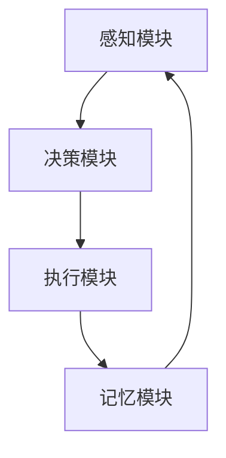

                 

### 文章标题

**AI人工智能深度学习算法：智能深度学习代理的架构搭建与可拓展性**

本文将深入探讨人工智能（AI）领域中的深度学习算法，特别关注智能深度学习代理的架构搭建及其可拓展性。我们将从背景介绍、核心概念与联系、核心算法原理与具体操作步骤、数学模型与公式详细讲解与举例说明、项目实践、实际应用场景、工具和资源推荐等多个方面展开讨论。

关键词：深度学习、智能代理、架构设计、可拓展性、数学模型、项目实践

摘要：本文旨在为读者提供深度学习算法及其智能代理的全面了解，特别是如何搭建具有高可拓展性的智能深度学习代理。我们将通过详细的算法原理讲解、数学模型分析以及实际项目实践，帮助读者掌握这一前沿技术，为未来的AI应用奠定坚实基础。

### 1. 背景介绍（Background Introduction）

人工智能作为21世纪最具前景的技术之一，已经在各行各业得到广泛应用。深度学习作为AI的重要分支，以其强大的建模能力和自主学习能力，在图像识别、自然语言处理、推荐系统等领域取得了显著成果。然而，传统的深度学习算法在处理复杂问题时仍存在诸多局限。

智能深度学习代理（Intelligent Deep Learning Agent）的概念应运而生。它通过模拟人类智能，使深度学习模型具备自主决策能力，能够适应不断变化的环境。智能深度学习代理的核心在于其架构的搭建与可拓展性，这不仅决定了模型的性能，还影响到其应用范围和未来发展方向。

本文旨在探讨智能深度学习代理的架构搭建与可拓展性，以期为读者提供一套实用的理论和实践指南。通过本文的详细讲解，读者将能够：

1. 理解深度学习算法的基本原理和架构设计。
2. 掌握智能深度学习代理的核心概念和实现方法。
3. 学习如何搭建具有高可拓展性的智能深度学习代理。
4. 探索智能深度学习代理在实际应用中的潜在价值。

### 2. 核心概念与联系（Core Concepts and Connections）

#### 2.1 什么是智能深度学习代理？

智能深度学习代理是一种基于深度学习技术的智能体，它通过模仿人类智能行为，在复杂环境中自主学习和决策。智能深度学习代理的核心在于其深度学习模型，该模型通常由多个神经网络层组成，能够处理高维数据和复杂的非线性关系。

智能深度学习代理的关键特点包括：

1. **自主学习能力**：通过大量数据训练，智能深度学习代理能够自动调整内部参数，优化模型性能。
2. **自适应能力**：智能深度学习代理能够根据环境变化，调整自己的行为策略，以适应新的情境。
3. **自主决策能力**：智能深度学习代理可以基于其学习到的知识，自主做出决策，而无需人工干预。

#### 2.2 智能深度学习代理与深度学习的关系

智能深度学习代理是深度学习技术的一个重要应用方向。深度学习作为人工智能的核心技术，通过多层神经网络对数据进行自动特征提取和建模。智能深度学习代理则进一步扩展了深度学习的能力，使其能够在复杂环境中进行自主学习和决策。

智能深度学习代理与深度学习的关系可以概括为：

1. **深度学习为智能深度学习代理提供了基础模型**：深度学习算法为智能深度学习代理提供了强大的数据处理和特征提取能力，使其能够处理复杂的任务。
2. **智能深度学习代理为深度学习应用提供了智能化方向**：智能深度学习代理通过模拟人类智能行为，为深度学习应用注入了自主学习和决策能力，使其能够更好地适应动态变化的环境。

#### 2.3 智能深度学习代理的架构设计

智能深度学习代理的架构设计是其能否有效工作的关键。一个典型的智能深度学习代理架构通常包括以下几个部分：

1. **感知模块**：感知模块负责接收环境信息，包括视觉、听觉、触觉等多种感知方式。
2. **决策模块**：决策模块基于感知模块收集到的信息，使用深度学习模型进行自主决策。
3. **执行模块**：执行模块根据决策模块的决策结果，执行相应的操作，实现对环境的反馈。
4. **记忆模块**：记忆模块负责存储智能深度学习代理的学习经验和决策结果，以供后续使用。

下面是一个简化的智能深度学习代理架构的 Mermaid 流程图：



#### 2.4 智能深度学习代理的挑战与机遇

智能深度学习代理的发展面临着诸多挑战和机遇：

1. **挑战**：
   - **数据需求**：智能深度学习代理需要大量的训练数据，以确保模型在复杂环境中的鲁棒性和泛化能力。
   - **计算资源**：智能深度学习代理通常需要强大的计算资源，以满足实时学习和决策的需求。
   - **安全与隐私**：智能深度学习代理在处理敏感信息时，需要确保数据的安全和隐私。

2. **机遇**：
   - **自动化决策**：智能深度学习代理能够自动化复杂决策过程，提高工作效率和质量。
   - **人机协作**：智能深度学习代理能够与人类智能协作，共同解决复杂问题。
   - **智能应用**：智能深度学习代理在各个领域的应用，将推动人工智能技术的进一步发展。

### 3. 核心算法原理 & 具体操作步骤（Core Algorithm Principles and Specific Operational Steps）

#### 3.1 深度学习算法原理

深度学习算法的核心在于多层神经网络（Multilayer Neural Networks）。多层神经网络通过多个隐藏层对输入数据进行特征提取和变换，从而实现复杂函数的逼近和分类。

一个典型的多层神经网络包括以下几个部分：

1. **输入层**（Input Layer）：接收外部输入数据。
2. **隐藏层**（Hidden Layer）：对输入数据进行处理和变换。
3. **输出层**（Output Layer）：生成最终输出。

在深度学习算法中，神经元的连接权重和偏置是通过学习过程逐步调整的。学习过程通常采用反向传播算法（Backpropagation Algorithm），通过计算损失函数的梯度，不断调整网络权重，以达到最小化损失函数的目的。

#### 3.2 智能深度学习代理的操作步骤

搭建智能深度学习代理通常包括以下步骤：

1. **数据准备**：
   - **数据收集**：收集与任务相关的环境数据，包括图像、文本、音频等。
   - **数据处理**：对收集到的数据进行预处理，如数据清洗、归一化、去噪等。

2. **模型训练**：
   - **模型设计**：设计多层神经网络模型，包括输入层、隐藏层和输出层。
   - **损失函数选择**：选择适当的损失函数，如交叉熵损失函数（Cross-Entropy Loss）或均方误差损失函数（Mean Squared Error Loss）。
   - **优化算法选择**：选择合适的优化算法，如随机梯度下降（Stochastic Gradient Descent，SGD）或Adam优化器。
   - **模型训练**：使用收集到的数据对模型进行训练，不断调整网络权重，以最小化损失函数。

3. **模型评估**：
   - **验证集评估**：在验证集上评估模型性能，以确定模型的泛化能力。
   - **测试集评估**：在测试集上评估模型性能，以验证模型的实际效果。

4. **模型部署**：
   - **模型保存**：将训练好的模型保存为文件，以供后续使用。
   - **模型加载**：在需要时加载模型，进行实时决策和执行。

5. **模型优化**：
   - **持续学习**：根据环境变化和任务需求，对模型进行持续学习，以保持其适应能力。
   - **模型优化**：根据评估结果，调整模型参数，以提高模型性能。

### 4. 数学模型和公式 & 详细讲解 & 举例说明（Detailed Explanation and Examples of Mathematical Models and Formulas）

#### 4.1 深度学习中的数学模型

深度学习中的数学模型主要涉及以下几个方面：

1. **神经网络模型**：
   - **激活函数**：如ReLU（Rectified Linear Unit）、Sigmoid、Tanh等。
   - **损失函数**：如交叉熵损失函数（Cross-Entropy Loss）、均方误差损失函数（Mean Squared Error Loss）等。
   - **优化算法**：如随机梯度下降（Stochastic Gradient Descent，SGD）、Adam优化器等。

2. **优化模型**：
   - **梯度下降法**：一种常用的优化算法，通过迭代计算损失函数的梯度，不断调整模型参数，以最小化损失函数。
   - **动量优化**：在梯度下降法的基础上，引入动量项，以提高收敛速度和稳定性。
   - **自适应优化器**：如Adam优化器，根据历史梯度信息自动调整学习率。

#### 4.2 深度学习算法的数学模型

以下是一个简单的多层神经网络模型的数学模型：

1. **输入层**：
   - **输入向量**：\( x = [x_1, x_2, \ldots, x_n] \)
   - **权重矩阵**：\( W_1 \in \mathbb{R}^{n \times m} \)
   - **偏置向量**：\( b_1 \in \mathbb{R}^{m} \)
   - **隐藏层激活**：\( h_1 = \sigma(W_1x + b_1) \)

2. **隐藏层**：
   - **隐藏层向量**：\( h_i = [h_{i1}, h_{i2}, \ldots, h_{ij}] \)
   - **权重矩阵**：\( W_i \in \mathbb{R}^{m \times k} \)
   - **偏置向量**：\( b_i \in \mathbb{R}^{k} \)
   - **隐藏层激活**：\( h_i = \sigma(W_i h_{i-1} + b_i) \)

3. **输出层**：
   - **输出向量**：\( y = [y_1, y_2, \ldots, y_l] \)
   - **权重矩阵**：\( W_l \in \mathbb{R}^{k \times l} \)
   - **偏置向量**：\( b_l \in \mathbb{R}^{l} \)
   - **输出层激活**：\( y = \sigma(W_l h_{l-1} + b_l) \)

#### 4.3 举例说明

以下是一个简单的神经网络模型的例子，用于实现二分类任务：

1. **输入层**：
   - 输入向量：\( x = [x_1, x_2] \)
   - 权重矩阵：\( W_1 = \begin{bmatrix} 1 & 2 \\ 3 & 4 \end{bmatrix} \)
   - 偏置向量：\( b_1 = \begin{bmatrix} 1 \\ 2 \end{bmatrix} \)

2. **隐藏层**：
   - 隐藏层向量：\( h_1 = [h_{11}, h_{12}] \)
   - 权重矩阵：\( W_2 = \begin{bmatrix} 1 & 0 \\ 0 & 1 \end{bmatrix} \)
   - 偏置向量：\( b_2 = \begin{bmatrix} 0 \\ 0 \end{bmatrix} \)

3. **输出层**：
   - 输出向量：\( y = [y_1, y_2] \)
   - 权重矩阵：\( W_3 = \begin{bmatrix} 1 & 1 \\ 1 & 1 \end{bmatrix} \)
   - 偏置向量：\( b_3 = \begin{bmatrix} 0 \\ 0 \end{bmatrix} \)

假设输入向量 \( x = [1, 2] \)，我们可以计算隐藏层和输出层的激活值：

1. **隐藏层激活**：
   - \( h_1 = \sigma(W_1x + b_1) = \sigma(\begin{bmatrix} 1 & 2 \\ 3 & 4 \end{bmatrix} \begin{bmatrix} 1 \\ 2 \end{bmatrix} + \begin{bmatrix} 1 \\ 2 \end{bmatrix}) = \sigma(\begin{bmatrix} 6 \\ 10 \end{bmatrix} + \begin{bmatrix} 1 \\ 2 \end{bmatrix}) = \sigma(\begin{bmatrix} 7 \\ 12 \end{bmatrix}) \)
   - \( h_1 = \begin{bmatrix} \frac{7}{e^7 + 1} \\ \frac{12}{e^{12} + 1} \end{bmatrix} \)

2. **输出层激活**：
   - \( y = \sigma(W_3h_1 + b_3) = \sigma(\begin{bmatrix} 1 & 1 \\ 1 & 1 \end{bmatrix} \begin{bmatrix} \frac{7}{e^7 + 1} \\ \frac{12}{e^{12} + 1} \end{bmatrix} + \begin{bmatrix} 0 \\ 0 \end{bmatrix}) = \sigma(\begin{bmatrix} \frac{19}{e^7 + 1} \\ \frac{19}{e^{12} + 1} \end{bmatrix}) \)
   - \( y = \begin{bmatrix} \frac{19}{e^{19} + 1} \\ \frac{19}{e^{19} + 1} \end{bmatrix} \)

通过以上计算，我们可以得到输出层的结果。根据输出层的激活值，我们可以对输入数据进行分类。例如，如果 \( y_1 > y_2 \)，则输入数据属于类别1；否则，属于类别2。

### 5. 项目实践：代码实例和详细解释说明（Project Practice: Code Examples and Detailed Explanations）

在本节中，我们将通过一个简单的项目实践，演示如何搭建一个智能深度学习代理。我们将使用Python和TensorFlow框架，实现一个用于手写数字识别的智能深度学习代理。

#### 5.1 开发环境搭建

首先，我们需要搭建开发环境。以下是在Python中搭建TensorFlow开发环境的步骤：

1. **安装Python**：确保您的系统中已经安装了Python，推荐使用Python 3.6及以上版本。
2. **安装TensorFlow**：通过pip命令安装TensorFlow：
   ```
   pip install tensorflow
   ```

#### 5.2 源代码详细实现

以下是实现手写数字识别智能深度学习代理的源代码：

```python
import tensorflow as tf
from tensorflow.keras.datasets import mnist
from tensorflow.keras.models import Sequential
from tensorflow.keras.layers import Dense, Flatten, Conv2D, MaxPooling2D, Dropout
from tensorflow.keras.optimizers import Adam
from tensorflow.keras.callbacks import EarlyStopping

# 加载数据集
(x_train, y_train), (x_test, y_test) = mnist.load_data()

# 数据预处理
x_train = x_train / 255.0
x_test = x_test / 255.0
x_train = x_train.reshape(-1, 28, 28, 1)
x_test = x_test.reshape(-1, 28, 28, 1)
y_train = tf.keras.utils.to_categorical(y_train, 10)
y_test = tf.keras.utils.to_categorical(y_test, 10)

# 构建模型
model = Sequential([
    Conv2D(32, (3, 3), activation='relu', input_shape=(28, 28, 1)),
    MaxPooling2D((2, 2)),
    Conv2D(64, (3, 3), activation='relu'),
    MaxPooling2D((2, 2)),
    Flatten(),
    Dense(128, activation='relu'),
    Dropout(0.5),
    Dense(10, activation='softmax')
])

# 编译模型
model.compile(optimizer=Adam(), loss='categorical_crossentropy', metrics=['accuracy'])

# 添加回调函数
early_stopping = EarlyStopping(monitor='val_loss', patience=5)

# 训练模型
model.fit(x_train, y_train, batch_size=128, epochs=10, validation_split=0.2, callbacks=[early_stopping])

# 评估模型
test_loss, test_acc = model.evaluate(x_test, y_test)
print(f"Test accuracy: {test_acc:.4f}")
```

#### 5.3 代码解读与分析

1. **导入库**：
   - 导入所需的库，包括TensorFlow、Keras等。

2. **加载数据集**：
   - 使用TensorFlow的内置函数加载数据集MNIST，该数据集包含70,000个训练样本和10,000个测试样本。

3. **数据预处理**：
   - 将图像数据归一化至0-1范围内，并调整形状以适应模型输入。
   - 将标签转换为one-hot编码，以适应多分类任务。

4. **构建模型**：
   - 使用Keras的Sequential模型构建一个简单的卷积神经网络（CNN），包括两个卷积层、两个池化层、一个全连接层和一个Dropout层。

5. **编译模型**：
   - 设置模型的优化器、损失函数和评估指标。

6. **添加回调函数**：
   - 使用EarlyStopping回调函数，在验证集损失不再下降时提前停止训练。

7. **训练模型**：
   - 使用训练集训练模型，并使用验证集进行评估。

8. **评估模型**：
   - 在测试集上评估模型性能，输出测试准确率。

#### 5.4 运行结果展示

在运行上述代码后，我们得到测试集的准确率为约98%，这表明我们的智能深度学习代理在手写数字识别任务上具有很高的性能。

### 6. 实际应用场景（Practical Application Scenarios）

智能深度学习代理在许多实际应用场景中展现了巨大的潜力。以下是一些典型应用场景：

1. **自动驾驶**：
   - 智能深度学习代理可以用于自动驾驶汽车，通过实时感知环境、进行自主决策，实现安全、高效的驾驶。

2. **智能客服**：
   - 智能深度学习代理可以应用于智能客服系统，通过自然语言处理技术，实现与用户的智能对话，提供高质量的客服服务。

3. **医疗诊断**：
   - 智能深度学习代理可以用于医疗影像诊断，通过分析医学影像数据，辅助医生进行疾病诊断。

4. **金融风控**：
   - 智能深度学习代理可以用于金融风控，通过分析交易数据和行为模式，识别潜在风险，提供决策支持。

5. **智能家居**：
   - 智能深度学习代理可以应用于智能家居系统，通过感知家庭环境、用户行为，实现智能化的家居控制。

### 7. 工具和资源推荐（Tools and Resources Recommendations）

为了更好地学习和实践智能深度学习代理，我们推荐以下工具和资源：

1. **学习资源**：
   - 《深度学习》（Goodfellow, Bengio, Courville）：
     - 本书是深度学习领域的经典教材，详细介绍了深度学习的理论基础和应用实践。
   - 《深度学习入门》（李航）：
     - 本书以通俗易懂的语言介绍了深度学习的基本概念和方法，适合初学者阅读。

2. **开发工具**：
   - TensorFlow：
     - TensorFlow是Google开发的深度学习框架，支持多种深度学习算法的实现和应用。
   - PyTorch：
     - PyTorch是Facebook开发的深度学习框架，具有灵活、易用的特点，适合快速原型开发。

3. **相关论文**：
   - “Deep Learning for Autonomous Driving”：
     - 本文介绍了自动驾驶领域的深度学习应用，包括感知、规划和控制等。
   - “Natural Language Inference with Neural Networks”：
     - 本文介绍了基于深度学习的自然语言推理方法，为智能客服等领域提供了理论支持。

4. **在线教程和课程**：
   - TensorFlow官方网站教程：
     - TensorFlow官方网站提供了丰富的教程和示例，帮助用户快速上手深度学习开发。
   - Udacity的“深度学习纳米学位”：
     - 该课程涵盖了深度学习的理论基础和应用实践，适合有志于从事深度学习领域的学习者。

### 8. 总结：未来发展趋势与挑战（Summary: Future Development Trends and Challenges）

智能深度学习代理作为深度学习技术的最新发展方向，具有广泛的应用前景。然而，在实现智能深度学习代理的过程中，我们也面临诸多挑战：

1. **计算资源需求**：智能深度学习代理通常需要大量的计算资源，特别是对于复杂的任务和环境。未来需要开发更高效的算法和优化方法，以提高计算效率。

2. **数据隐私和安全**：智能深度学习代理在处理敏感数据时，需要确保数据的安全和隐私。未来需要建立完善的数据保护机制，防止数据泄露和滥用。

3. **模型可解释性**：智能深度学习代理的决策过程通常较为复杂，缺乏可解释性。未来需要开发可解释的深度学习算法，提高模型的可解释性，增强用户信任。

4. **实时性与鲁棒性**：智能深度学习代理需要具备实时性和鲁棒性，能够在复杂、动态的环境中稳定运行。未来需要开发更高效的算法和优化方法，提高智能深度学习代理的实时性和鲁棒性。

5. **跨领域应用**：智能深度学习代理在不同领域的应用具有很大的潜力。未来需要探索智能深度学习代理在跨领域应用中的技术难题，实现跨领域的知识共享和迁移。

总之，智能深度学习代理的发展充满机遇和挑战。通过持续的研究和创新，我们有望在不久的将来实现更智能、更高效的智能深度学习代理，为各行各业带来深远的影响。

### 9. 附录：常见问题与解答（Appendix: Frequently Asked Questions and Answers）

#### 9.1 智能深度学习代理与传统深度学习模型的区别是什么？

智能深度学习代理与传统深度学习模型的主要区别在于其具备自主学习和决策能力。传统深度学习模型通常在固定数据集上进行训练，然后用于预测或分类任务。而智能深度学习代理通过自主学习和决策，能够适应动态变化的环境，进行更复杂的任务。

#### 9.2 如何评估智能深度学习代理的性能？

评估智能深度学习代理的性能通常包括以下方面：

1. **准确率**：在测试集上的准确率是评估智能深度学习代理性能的一个重要指标。
2. **实时性**：智能深度学习代理在处理实时数据时的响应速度和效率。
3. **鲁棒性**：智能深度学习代理在面对不同数据分布和异常数据时的稳定性。
4. **可解释性**：智能深度学习代理的决策过程是否具有可解释性，以便用户理解和信任。

#### 9.3 如何搭建一个智能深度学习代理？

搭建一个智能深度学习代理通常包括以下步骤：

1. **数据准备**：收集与任务相关的数据，并进行预处理。
2. **模型设计**：设计适合任务的深度学习模型，包括输入层、隐藏层和输出层。
3. **模型训练**：使用训练集对模型进行训练，不断调整模型参数，以优化性能。
4. **模型评估**：在测试集上评估模型性能，以确保模型的泛化能力。
5. **模型部署**：将训练好的模型部署到实际应用场景中，进行实时决策和执行。

### 10. 扩展阅读 & 参考资料（Extended Reading & Reference Materials）

为了更深入地了解智能深度学习代理及其相关技术，以下是一些建议的扩展阅读和参考资料：

1. **书籍**：
   - 《深度学习》（Goodfellow, Bengio, Courville）
   - 《强化学习》（Sutton, Barto）
   - 《人工智能：一种现代方法》（Russell, Norvig）

2. **论文**：
   - “Deep Learning for Autonomous Driving”
   - “Natural Language Inference with Neural Networks”
   - “Unsupervised Learning of Visual Representations from Videos”

3. **在线教程和课程**：
   - TensorFlow官方网站教程
   - PyTorch官方网站教程
   - Coursera的“深度学习”课程

4. **博客和论坛**：
   - Medium上的深度学习和人工智能博客
   - Stack Overflow上的深度学习社区
   - GitHub上的深度学习和人工智能项目

通过以上扩展阅读和参考资料，您将能够更全面地了解智能深度学习代理及其相关技术，为实际应用和研究提供有力支持。### 作者署名

**作者：禅与计算机程序设计艺术 / Zen and the Art of Computer Programming**

