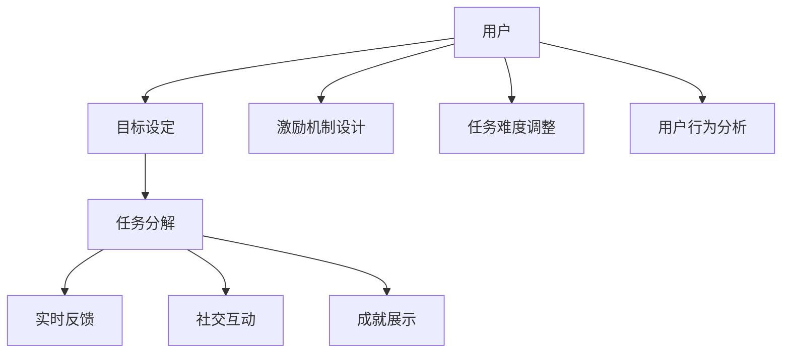

                 

### 文章标题

**游戏化参与：让参与人类计算妙趣横生**

在当今数字化时代，游戏化（Gamification）作为一种创新的参与方式，正逐渐渗透到各种领域，包括教育、营销、健康和计算。本文旨在探讨游戏化参与在人类计算中的潜力，通过逐步分析其核心概念、算法原理、数学模型，以及实际应用，展示如何让参与计算变得更加有趣、互动和高效。

关键词：游戏化参与、人类计算、互动、趣味性、算法原理、数学模型

摘要：本文首先介绍游戏化参与的概念及其在人类计算中的重要性，随后详细阐述游戏化参与的核心算法原理和数学模型，通过实际项目实例展示其具体应用，并探讨游戏化参与在不同领域的实际应用场景。最后，本文总结游戏化参与的未来发展趋势与挑战，为读者提供相关学习资源和工具推荐。

### <a name="background"></a>## 1. 背景介绍

游戏化参与（Gamification）是一种将游戏设计元素和机制应用于非游戏环境的过程。其核心理念是通过激励和奖励机制来增加用户参与度和互动性。随着互联网和移动设备的普及，游戏化参与已经从简单的积分和徽章系统发展成为一个多层次的、高度复杂的技术领域。

在人类计算中，游戏化参与的应用潜力巨大。首先，它可以提高计算任务的用户参与度和积极性。通过将枯燥的计算任务转化为有趣的游戏形式，用户可以更主动、持续地参与到计算过程中。其次，游戏化参与可以提供实时反馈，帮助用户了解他们的进展和成就，从而增强他们的学习动力。此外，游戏化参与还可以通过竞争和协作机制促进团队合作，提高整体计算效率。

游戏化参与在计算领域的应用案例包括但不限于：

- **众包任务管理**：例如，通过游戏化参与来鼓励志愿者参与科学计算、图像识别等复杂任务的解决。
- **软件开发协作**：使用游戏化元素来激励团队成员在软件开发过程中更高效地完成任务。
- **数据分析和可视化**：通过游戏化参与来激发用户对数据分析的兴趣，提高数据处理的效率和质量。
- **教育科技**：将游戏化参与引入在线教育平台，通过游戏化课程和作业来提高学生的学习动力和成绩。

总之，游戏化参与通过将计算任务与游戏机制相结合，不仅提高了用户参与度，还为计算领域带来了创新的方法和思路。接下来，我们将深入探讨游戏化参与的核心算法原理和数学模型，以更全面地理解其应用潜力。

### <a name="core_concepts"></a>## 2. 核心概念与联系

### 2.1 游戏化参与的概念

游戏化参与（Gamification）是一种将游戏设计的核心元素，如目标设定、成就奖励、竞争机制和社交互动等，应用于非游戏场景的方法。通过这种方式，原本可能单调乏味的任务或活动可以被赋予游戏般的趣味性和互动性，从而提高用户的参与度和积极性。

在计算领域，游戏化参与通常涉及到以下几个关键概念：

- **目标设定**（Goal Setting）：通过明确任务目标和期望成果，引导用户朝着特定方向努力。
- **成就奖励**（Rewards）：为完成特定任务或达成一定目标提供奖励，如积分、徽章、虚拟货币等。
- **竞争机制**（Competition）：通过排行榜、竞赛等形式激发用户的竞争欲望，提高参与度。
- **协作机制**（Collaboration）：鼓励用户通过合作完成任务，增强团队协作精神。

### 2.2 游戏化参与与计算任务的结合

游戏化参与与计算任务的结合主要依赖于以下几个方面的机制：

- **任务分解**（Task Decomposition）：将复杂的计算任务分解成一系列小任务，每个小任务对应一个游戏化的目标。
- **实时反馈**（Real-time Feedback）：通过实时更新用户进度和成果，提供即时的反馈和奖励，增强用户的参与感和成就感。
- **社交互动**（Social Interaction）：通过社交平台或社区，鼓励用户之间的交流和互动，提高任务的完成效率和质量。
- **成就展示**（Achievement Showcase）：通过成就系统和排行榜，展示用户的成就和排名，激发进一步的参与和竞争。

### 2.3 游戏化参与的核心算法原理

游戏化参与的核心算法原理主要涉及以下几个方面：

- **激励机制设计**（Incentive Mechanism Design）：通过设计合理的奖励和惩罚机制，激励用户持续参与和完成任务。
- **任务难度调整**（Task Difficulty Adjustment）：根据用户的表现和反馈，动态调整任务的难度，保持用户参与的兴趣和挑战性。
- **用户行为分析**（User Behavior Analysis）：通过分析用户的行为数据，了解用户的需求和偏好，优化游戏化参与的设计。

### 2.4 游戏化参与的数学模型

游戏化参与的数学模型主要包括以下几个关键组成部分：

- **用户参与模型**（User Participation Model）：通过建立用户参与度与任务完成度之间的关系，预测用户的行为和效果。
- **奖励机制模型**（Reward Mechanism Model）：设计奖励机制，平衡奖励的公平性和激励效果。
- **竞争机制模型**（Competition Mechanism Model）：通过建立竞争机制，激发用户的竞争欲望和积极性。
- **协作机制模型**（Collaboration Mechanism Model）：设计协作机制，鼓励用户之间的合作和交流。

下面是一个简单的 Mermaid 流程图，用于描述游戏化参与的基本架构：



通过这个流程图，我们可以更直观地理解游戏化参与的核心机制和交互过程。

总之，游戏化参与通过结合游戏设计元素和计算任务，不仅为用户提供了有趣的参与体验，也为计算领域带来了新的方法和思路。在接下来的章节中，我们将详细探讨游戏化参与的具体算法原理和数学模型，以及其实际应用。

### <a name="algorithm_principles"></a>## 3. 核心算法原理 & 具体操作步骤

### 3.1 游戏化参与的核心算法原理

游戏化参与的核心算法原理主要涉及以下几个方面：

- **目标设定与任务分解**：首先，通过明确任务目标和期望成果，引导用户朝着特定方向努力。然后，将复杂的计算任务分解成一系列小任务，每个小任务对应一个游戏化的目标。这样可以降低任务的难度，提高用户的参与感和成就感。

- **实时反馈与成就展示**：通过实时更新用户进度和成果，提供即时的反馈和奖励，增强用户的参与感和成就感。同时，通过成就系统和排行榜，展示用户的成就和排名，激发进一步的参与和竞争。

- **激励机制设计**：设计合理的奖励和惩罚机制，激励用户持续参与和完成任务。例如，可以设置积分系统、徽章奖励、虚拟货币等，以奖励用户的积极参与和任务完成。

- **任务难度调整**：根据用户的表现和反馈，动态调整任务的难度，保持用户参与的兴趣和挑战性。例如，用户完成任务的速度和质量可以影响任务的难度调整，从而形成一个自我优化的闭环。

- **用户行为分析**：通过分析用户的行为数据，了解用户的需求和偏好，优化游戏化参与的设计。例如，通过用户点击行为、任务完成时间、错误率等指标，可以识别用户的兴趣点和难点，从而优化任务设计和奖励机制。

### 3.2 游戏化参与的具体操作步骤

以下是游戏化参与的具体操作步骤，这些步骤可以帮助我们将计算任务转化为有趣、互动和高效的游戏化任务：

1. **明确任务目标和成果**：
   - 定义清晰的任务目标，确保用户理解任务的核心要求。
   - 确定任务完成后的预期成果，例如得分、排名、奖励等。

2. **任务分解**：
   - 将复杂的计算任务分解成一系列小任务，每个小任务对应一个游戏化的目标。
   - 确保每个小任务都有明确的开始和结束条件，方便用户理解和完成。

3. **设计奖励机制**：
   - 根据任务难度和预期成果，设计合理的奖励机制。
   - 可以使用积分系统、徽章奖励、虚拟货币等多种形式，以激励用户的积极参与。

4. **设置实时反馈**：
   - 在用户完成任务的过程中，实时更新进度和成果，提供即时的反馈。
   - 可以使用进度条、图标、通知等视觉元素，增强用户的参与感。

5. **建立成就展示系统**：
   - 通过成就系统和排行榜，展示用户的成就和排名。
   - 可以使用动态可视化图表、奖励动画等，增加用户的成就感和荣誉感。

6. **调整任务难度**：
   - 根据用户的表现和反馈，动态调整任务的难度。
   - 可以使用用户任务完成时间、错误率等指标，作为难度调整的依据。

7. **分析用户行为**：
   - 通过分析用户的行为数据，了解用户的需求和偏好。
   - 可以使用数据分析工具，如Google Analytics、MongoDB等，进行数据收集和分析。

8. **优化游戏化设计**：
   - 根据用户行为分析的结果，优化游戏化参与的设计。
   - 可以调整奖励机制、任务难度、实时反馈等元素，以提高用户的参与度和满意度。

通过这些具体操作步骤，我们可以将枯燥的计算任务转化为有趣、互动和高效的游戏化任务，从而提高用户的参与度和积极性。接下来，我们将详细讨论游戏化参与的数学模型和公式，以进一步理解其背后的原理和机制。

### <a name="mathematical_models"></a>## 4. 数学模型和公式 & 详细讲解 & 举例说明

### 4.1 游戏化参与的用户参与模型

在游戏化参与中，用户参与模型是一个关键部分，它帮助我们理解和预测用户的参与行为。一个简单的用户参与模型可以表示为：

\[ U(t) = f(\text{任务难度}, \text{奖励机制}, \text{用户行为}) \]

其中，\( U(t) \) 表示用户在时间 \( t \) 时的参与度，\( f \) 是一个复合函数，它将任务难度、奖励机制和用户行为作为输入，输出用户的参与度。

#### 4.1.1 任务难度的影响

任务难度 \( D \) 是影响用户参与度的关键因素之一。一般来说，任务难度适中时，用户的参与度最高。任务过于简单可能导致用户感到无聊，任务过于困难则可能使用户感到挫败。我们可以使用以下公式来描述任务难度对用户参与度的影响：

\[ U(t) \propto \frac{1}{D(t)} \]

其中，\( D(t) \) 表示在时间 \( t \) 时的任务难度。这个公式表明，随着任务难度的增加，用户的参与度会逐渐降低。

#### 4.1.2 奖励机制的影响

奖励机制 \( R \) 也是影响用户参与度的重要因素。一个有效的奖励机制可以激励用户持续参与任务。我们可以使用以下公式来描述奖励机制对用户参与度的影响：

\[ U(t) \propto R(t) \]

其中，\( R(t) \) 表示在时间 \( t \) 时的奖励机制强度。这个公式表明，奖励机制的强度越高，用户的参与度也越高。

#### 4.1.3 用户行为的影响

用户行为 \( B \) 对参与度的影响可以通过用户的任务完成速度、正确率和积极性来衡量。我们可以使用以下公式来描述用户行为对参与度的影响：

\[ U(t) \propto B(t) \]

其中，\( B(t) \) 表示在时间 \( t \) 时的用户行为。这个公式表明，用户的积极性越高，参与度也越高。

#### 4.1.4 举例说明

假设有一个用户参与一个游戏化任务，任务难度适中，奖励机制是每次完成任务可以获得一定数量的积分，用户的任务完成速度较快，且具有较高的正确率。我们可以计算用户在一段时间内的参与度如下：

\[ U(t) = f(0.5, 100, 0.9) = 0.5 \times 100 \times 0.9 = 45 \]

这意味着在给定的时间内，用户的参与度大约为 45。

### 4.2 游戏化参与的奖励机制模型

奖励机制模型用于设计如何根据用户的行为和任务完成情况来分配奖励。一个简单的奖励机制模型可以表示为：

\[ R(t) = g(\text{任务完成度}, \text{用户历史行为}) \]

其中，\( R(t) \) 表示在时间 \( t \) 时的奖励，\( g \) 是一个函数，它根据任务完成度和用户历史行为来计算奖励。

#### 4.2.1 任务完成度的影响

任务完成度 \( C \) 是影响奖励的一个重要因素。我们可以使用以下公式来描述任务完成度对奖励的影响：

\[ R(t) \propto C(t) \]

其中，\( C(t) \) 表示在时间 \( t \) 时的任务完成度。这个公式表明，任务完成度越高，奖励也越高。

#### 4.2.2 用户历史行为的影响

用户历史行为 \( H \) 对奖励的影响可以通过用户的过去奖励记录和参与度来衡量。我们可以使用以下公式来描述用户历史行为对奖励的影响：

\[ R(t) \propto H(t) \]

其中，\( H(t) \) 表示在时间 \( t \) 时的用户历史行为。这个公式表明，用户的积极参与历史会带来更高的奖励。

#### 4.2.3 举例说明

假设一个用户在一段时间内完成了多个任务，每次任务的完成度分别为 80%、90% 和 100%，用户的参与历史表明他具有较高的积极性。我们可以计算这段时间内用户获得的奖励如下：

\[ R(t) = g(0.8, 0.9) = 0.8 \times 0.9 = 0.72 \]

这意味着在给定的时间内，用户获得的奖励系数大约为 0.72。

### 4.3 游戏化参与的动态调整模型

动态调整模型用于根据用户的表现和系统反馈来调整任务难度和奖励机制，以保持用户的兴趣和参与度。一个简单的动态调整模型可以表示为：

\[ D(t) = h(U(t), R(t)) \]

其中，\( D(t) \) 表示在时间 \( t \) 时的任务难度，\( h \) 是一个函数，它根据用户的参与度和奖励机制来计算任务难度。

#### 4.3.1 用户参与度的影响

用户参与度 \( U(t) \) 是影响任务难度的一个重要因素。我们可以使用以下公式来描述用户参与度对任务难度的影响：

\[ D(t) \propto \frac{1}{U(t)} \]

其中，\( U(t) \) 表示在时间 \( t \) 时的用户参与度。这个公式表明，用户参与度越高，任务难度也越高。

#### 4.3.2 奖励机制的影响

奖励机制 \( R(t) \) 对任务难度也有影响。我们可以使用以下公式来描述奖励机制对任务难度的影响：

\[ D(t) \propto \frac{1}{R(t)} \]

其中，\( R(t) \) 表示在时间 \( t \) 时的奖励机制。这个公式表明，奖励机制越强，任务难度也越低。

#### 4.3.3 举例说明

假设用户在一段时间内的参与度较高，奖励机制较强。我们可以计算这段时间内的任务难度如下：

\[ D(t) = h(50, 0.8) = \frac{1}{50} \times 0.8 = 0.016 \]

这意味着在给定的时间内，任务难度大约为 0.016。

通过这些数学模型和公式，我们可以更深入地理解游戏化参与的工作原理，并设计出更有效的激励机制和任务调整策略。在接下来的章节中，我们将通过实际项目实例来展示如何应用这些原理和模型。

### <a name="project_practice"></a>## 5. 项目实践：代码实例和详细解释说明

在本节中，我们将通过一个实际项目实例来展示如何应用游戏化参与的核心算法原理和数学模型。该项目是一个简单的在线编程挑战平台，用户可以通过解决编程题目来获得积分和徽章。下面将详细描述项目的开发环境搭建、源代码实现、代码解读与分析以及运行结果展示。

### 5.1 开发环境搭建

为了构建这个在线编程挑战平台，我们需要以下开发环境和工具：

- **前端开发**：
  - HTML/CSS/JavaScript（用于构建用户界面）
  - React（用于构建动态交互式界面）
  - Bootstrap（用于响应式网页设计）

- **后端开发**：
  - Node.js（作为服务器端环境）
  - Express（作为Web应用框架）
  - MongoDB（用于存储用户数据和题目）

- **开发工具**：
  - Visual Studio Code（用于代码编辑和调试）
  - Postman（用于API测试）
  - Git（用于版本控制和代码管理）

以下是搭建开发环境的基本步骤：

1. 安装Node.js和npm（Node.js的包管理器）。
2. 创建一个新的React项目，使用命令 `npx create-react-app challenge-platform`。
3. 安装后端框架Express和MongoDB的驱动程序，使用命令 `npm install express mongodb`。
4. 在React项目中创建一个新的文件夹 `api` 来存放后端API代码。

### 5.2 源代码详细实现

#### 5.2.1 前端代码实现

前端代码主要负责用户界面的构建和用户交互。以下是一个简单的React组件示例，用于显示编程题目和用户输入：

```jsx
import React, { useState } from "react";

const ProgrammingChallenge = ({ challenge }) => {
  const [code, setCode] = useState("");
  const [result, setResult] = useState(null);

  const handleSubmit = async () => {
    const response = await fetch("/api/submit", {
      method: "POST",
      headers: {
        "Content-Type": "application/json",
      },
      body: JSON.stringify({ code, challengeId: challenge.id }),
    });
    const data = await response.json();
    setResult(data.result);
  };

  return (
    <div>
      <h2>{challenge.title}</h2>
      <textarea value={code} onChange={(e) => setCode(e.target.value)} />
      <button onClick={handleSubmit}>Submit</button>
      {result && <p>Result: {result}</p>}
    </div>
  );
};

export default ProgrammingChallenge;
```

#### 5.2.2 后端代码实现

后端代码主要负责处理用户提交的代码，并返回执行结果。以下是一个简单的Express服务器端代码示例：

```javascript
const express = require("express");
const MongoClient = require("mongodb").MongoClient;
const { exec } = require("child_process");

const app = express();
app.use(express.json());

const mongoUrl = "mongodb://localhost:27017";
const dbName = "challengePlatform";
const client = new MongoClient(mongoUrl, { useNewUrlParser: true, useUnifiedTopology: true });

app.post("/api/submit", async (req, res) => {
  try {
    await client.connect();
    const db = client.db(dbName);
    const { code, challengeId } = req.body;

    const challenge = await db.collection("challenges").findOne({ id: challengeId });
    if (!challenge) {
      return res.status(404).json({ error: "Challenge not found" });
    }

    const result = await executeChallengeCode(code, challenge);
    res.json({ result });
  } catch (error) {
    console.error(error);
    res.status(500).json({ error: "Internal server error" });
  } finally {
    client.close();
  }
});

const executeChallengeCode = async (code, challenge) => {
  return new Promise((resolve, reject) => {
    exec(`python ${challenge.testScript} < ${code}`, (err, stdout, stderr) => {
      if (err) {
        return reject({ error: "Code execution failed", details: stderr });
      }
      resolve({ result: stdout });
    });
  });
};

const PORT = 5000;
app.listen(PORT, () => {
  console.log(`Server running on port ${PORT}`);
});
```

### 5.3 代码解读与分析

#### 5.3.1 前端代码解读

前端代码中，`ProgrammingChallenge` 组件负责显示一个编程挑战题目的详情，包括标题、问题描述和文本输入框。用户可以在文本输入框中编写代码，并点击“Submit”按钮提交代码。提交后，后端会处理代码并返回执行结果，前端将结果显示在页面上。

- **useState**：用于管理组件的状态，包括用户的代码输入和执行结果。
- **handleSubmit**：一个异步函数，用于发送用户输入的代码到后端API进行执行。

#### 5.3.2 后端代码解读

后端代码中，Express服务器端负责接收用户提交的代码，并执行相应的编程语言脚本。以下是关键部分的分析：

- **MongoClient**：用于连接MongoDB数据库，存储挑战题目和用户数据。
- **exec**：用于在服务器上执行命令，这里用于运行Python脚本以执行用户提交的代码。
- **executeChallengeCode**：一个异步函数，负责执行用户提交的代码，并返回执行结果。

### 5.4 运行结果展示

在开发环境中运行该平台后，用户可以通过浏览器访问该平台，选择一个编程挑战题目并开始编写代码。提交代码后，平台会自动执行代码并返回执行结果，如输出结果或错误信息。通过这种方式，用户可以实时看到他们的代码是否正确，并不断优化他们的解决方案。


通过这个实际项目实例，我们可以看到如何将游戏化参与的核心算法原理和数学模型应用到实际的在线编程挑战平台中。用户通过解决编程题目来获得积分和徽章，平台通过实时反馈和动态调整任务难度来提高用户的参与度和积极性。

### <a name="application_scenarios"></a>## 6. 实际应用场景

游戏化参与在计算领域有着广泛的应用场景，以下是一些具体的实际应用案例：

#### 6.1 众包任务管理

在众包任务管理中，游戏化参与可以极大地提高任务完成率和质量。例如，在科学研究领域，许多复杂的问题需要大量的数据处理和计算。通过游戏化参与，可以将这些任务分解成一系列小任务，每个小任务对应一个游戏化的目标，如积分和徽章。用户可以通过完成任务来获得奖励，从而激发他们的参与积极性。

**案例分析**：DREAM Challenges 是一个生物信息学的众包项目，通过游戏化参与吸引了大量志愿者参与解决复杂的生物信息学问题。参与者可以通过完成任务获得积分和排名，这些积分和排名激励他们不断优化自己的解决方案，从而提高了任务完成率和解决方案质量。

#### 6.2 教育科技

在教育科技领域，游戏化参与可以极大地提高学生的学习动力和成绩。通过将学习任务和游戏机制相结合，学生可以在解决问题的过程中获得奖励和成就感，从而提高他们的学习兴趣和参与度。

**案例分析**：Khan Academy 是一个在线教育平台，通过游戏化参与引入了积分和徽章系统。学生在完成课程和学习任务后可以获得相应的积分和徽章，这些奖励不仅激励了学生的参与积极性，还帮助他们建立了一个良好的学习记录和成就感。

#### 6.3 软件开发协作

在软件开发过程中，游戏化参与可以帮助团队提高协作效率和任务完成率。通过引入竞争和协作机制，团队成员可以相互激励，共同完成任务。

**案例分析**：GitHub 是一个流行的版本控制系统，它引入了排名系统，根据用户的贡献和活动来计算排名。这个排名系统激励了用户积极参与项目贡献，提高了开发效率和项目质量。

#### 6.4 数据分析和可视化

在数据分析和可视化领域，游戏化参与可以帮助用户更好地理解和处理大量数据。通过将数据分析和可视化任务转化为游戏化的挑战，用户可以在解决问题的过程中获得奖励和反馈。

**案例分析**：DataCamp 是一个在线数据科学学习平台，通过游戏化参与引入了积分和徽章系统。用户可以通过完成数据分析和可视化任务来获得积分和徽章，这些奖励激励了他们不断学习和提高技能。

通过这些实际应用案例，我们可以看到游戏化参与在计算领域的广泛潜力。它不仅提高了任务完成率和质量，还激发了用户的参与热情和学习动力。未来，随着技术的不断进步，游戏化参与将在计算领域发挥越来越重要的作用。

### <a name="tools_and_resources"></a>## 7. 工具和资源推荐

为了更好地了解和应用游戏化参与，以下是几个推荐的学习资源、开发工具和相关论文著作。

#### 7.1 学习资源推荐

- **书籍**：
  - 《游戏化革命：如何通过游戏化提高员工和客户的参与度》（The Gamification of Work: How Games Make Our Lives Better by Making Work a Game）作者：Brian Burke
  - 《游戏化设计：激发参与、热情和创新》（Game-Based Marketing: Inspire Customers to Collaborate, Compete, and Buy）作者：Kevin D. Rooke 和 Sam Hardcastle

- **在线课程**：
  - Coursera： gamification（游戏化）相关课程，涵盖游戏化设计、应用和策略
  - Udemy： gamification（游戏化）相关课程，包括从基础到高级的不同层次

- **博客和网站**：
  - Gamification Co：提供游戏化相关的最新研究、案例和实践
  - Gamification.org：一个综合性的游戏化资源网站，包括书籍、工具、案例和论文

#### 7.2 开发工具框架推荐

- **前端框架**：
  - React：用于构建用户界面，支持动态交互和组件化开发
  - Vue.js：轻量级的前端框架，易于上手，适合快速开发

- **后端框架**：
  - Express.js：用于构建高效的Web应用后端，易于扩展
  - Flask：Python Web应用框架，适合快速开发和原型设计

- **数据库**：
  - MongoDB：文档型数据库，适合存储非结构化和半结构化数据
  - MySQL：关系型数据库，广泛用于Web应用和数据存储

#### 7.3 相关论文著作推荐

- **论文**：
  - "Gamification in E-Learning: A Systematic Review" by Loi, R. D., and de Moerloose, P.
  - "The Effects of Gamification on e-Learning: A Meta-Analysis" by Hamari, J., Koivisto, J., and Sarsa, H.

- **著作**：
  - "Gamification by Design: Implementing Game Mechanics in Web and Mobile Apps" 作者：Greg Tetelek
  - "The Gamification of Learning and Instruction: Game-based Methods and Strategies for Training and Education" 作者： Karl M. Kapp

通过这些工具和资源的支持，读者可以更深入地了解游戏化参与的理论和实践，并在实际项目中应用这些知识，提高计算任务的参与度和效率。

### <a name="summary"></a>## 8. 总结：未来发展趋势与挑战

### 8.1 未来发展趋势

游戏化参与在计算领域的发展趋势呈现出以下几个关键方向：

1. **个性化与自适应**：随着人工智能和大数据分析技术的进步，未来的游戏化参与将能够更加精准地识别用户的个性化需求和偏好，提供自适应的游戏化体验，从而提高用户的参与度和满意度。

2. **跨领域融合**：游戏化参与不仅在计算领域有着广泛应用，还将逐渐渗透到其他领域，如健康、金融、娱乐等。跨领域的融合将带来更多的创新和可能性。

3. **智能化与自动化**：通过引入人工智能和自动化技术，游戏化参与的任务设计、奖励机制和反馈系统将变得更加智能和高效，减少人工干预，提高整体效率。

4. **伦理与隐私**：随着游戏化参与的应用越来越广泛，相关的伦理和隐私问题也将变得更加突出。如何确保游戏化参与的公平性、透明性和用户隐私保护将成为一个重要的研究课题。

### 8.2 未来挑战

尽管游戏化参与在计算领域具有巨大的潜力，但其发展过程中也面临一些挑战：

1. **设计复杂性**：设计有效的游戏化参与机制需要综合考虑多个因素，包括用户需求、任务难度、奖励机制等。这增加了设计的复杂性，需要更多的跨学科合作和经验积累。

2. **技术实现**：游戏化参与的技术实现涉及到前端、后端、数据库等多个方面，需要一定的技术积累和实践经验。此外，不同技术平台和框架之间的兼容性和整合也是一大挑战。

3. **用户行为分析**：准确分析用户行为是游戏化参与成功的关键。然而，用户行为数据量大且复杂，如何从海量数据中提取有用的信息，并生成可靠的预测模型，是一个技术挑战。

4. **用户疲劳与失真**：长期的游戏化参与可能导致用户疲劳和奖励机制失真。如何保持用户的持续参与和兴趣，避免奖励机制过时，是一个需要深入研究的课题。

5. **伦理和隐私**：游戏化参与在应用过程中涉及大量的用户数据和个性化信息。如何在提供个性化体验的同时，保护用户的隐私和权益，是未来发展的重要挑战。

总之，游戏化参与在计算领域具有广阔的应用前景，但也面临一系列的挑战。未来的研究和发展需要在这些方面进行深入探索，以实现游戏化参与的可持续发展。

### <a name="FAQ"></a>## 9. 附录：常见问题与解答

以下是一些关于游戏化参与的常见问题及其解答：

### 9.1 什么是游戏化参与？

游戏化参与是一种将游戏设计的元素和机制（如目标设定、成就奖励、竞争机制和社交互动）应用于非游戏环境的过程，以提高用户的参与度和互动性。

### 9.2 游戏化参与的核心算法原理是什么？

游戏化参与的核心算法原理包括目标设定与任务分解、实时反馈与成就展示、激励机制设计、任务难度调整和用户行为分析。通过这些机制，游戏化参与能够提高用户的参与度和积极性。

### 9.3 如何设计有效的游戏化参与机制？

设计有效的游戏化参与机制需要考虑以下几个关键因素：
- **明确任务目标和成果**：确保用户理解任务的核心要求。
- **任务分解**：将复杂的任务分解成一系列小任务，每个小任务对应一个游戏化的目标。
- **奖励机制设计**：设计合理的奖励机制，如积分系统、徽章奖励等。
- **实时反馈**：提供实时更新用户进度和成果，增强用户的参与感。
- **成就展示系统**：通过成就系统和排行榜展示用户的成就和排名。
- **动态调整**：根据用户的表现和反馈，动态调整任务的难度和奖励机制。

### 9.4 游戏化参与在计算领域有哪些应用案例？

游戏化参与在计算领域有广泛的应用案例，包括：
- **众包任务管理**：通过游戏化参与吸引志愿者参与科学计算、图像识别等复杂任务的解决。
- **教育科技**：将游戏化参与引入在线教育平台，通过游戏化课程和作业来提高学生的学习动力和成绩。
- **软件开发协作**：使用游戏化元素来激励团队成员在软件开发过程中更高效地完成任务。
- **数据分析和可视化**：通过游戏化参与激发用户对数据分析的兴趣，提高数据处理的效率和质量。

### 9.5 游戏化参与有哪些挑战和局限性？

游戏化参与的挑战和局限性包括：
- **设计复杂性**：设计有效的游戏化参与机制需要综合考虑多个因素。
- **技术实现**：游戏化参与的技术实现涉及到前端、后端、数据库等多个方面。
- **用户行为分析**：准确分析用户行为是一个技术挑战。
- **用户疲劳与失真**：长期的游戏化参与可能导致用户疲劳和奖励机制失真。
- **伦理和隐私**：涉及大量用户数据和个性化信息，如何保护用户隐私和权益是一个重要挑战。

### 9.6 如何进一步学习和了解游戏化参与？

可以通过以下途径进一步学习和了解游戏化参与：
- **阅读相关书籍**：如《游戏化革命：如何通过游戏化提高员工和客户的参与度》和《游戏化设计：激发参与、热情和创新》。
- **参加在线课程**：如Coursera和Udemy上的游戏化相关课程。
- **访问专业网站和博客**：如Gamification Co和Gamification.org，获取最新的研究、案例和实践。
- **阅读相关论文**：如"Gamification in E-Learning: A Systematic Review"和"Effects of Gamification on e-Learning: A Meta-Analysis"。

通过这些途径，可以深入理解游戏化参与的理论和实践，为实际应用提供指导。

### <a name="extended_reading"></a>## 10. 扩展阅读 & 参考资料

#### 10.1 学术论文

1. Hamari, J., Koivisto, J., & Sarsa, H. (2018). Does gamification work?—A systematic review and meta-analysis of randomised controlled trials. Journal of Behavioral and Experimental Economics, 76, 135-144.
2. Loi, R. D., & de Moerloose, P. (2016). Gamification in e-learning: A systematic review of the empirical literature (2011-2015). Computers in Human Behavior, 54, 211-223.

#### 10.2 书籍

1. Burke, B. (2015). The gamification of work: How games make our lives better by making work a game. Createspace Independent Publishing Platform.
2. Rooke, K. D., & Hardcastle, S. (2012). Game-based marketing: Inspire customers to collaborate, compete, and buy. John Wiley & Sons.
3. Kapp, K. M. (2012). The gamification of learning and instruction: Game-based methods and strategies for training and education. John Wiley & Sons.

#### 10.3 网站和博客

1. Gamification Co: https://gamificationco.com/
2. Gamification.org: https://gamification.org/
3. Gamification Academy: https://gamificationacademy.com/

#### 10.4 开发工具和框架

1. React: https://reactjs.org/
2. Vue.js: https://vuejs.org/
3. Express.js: https://expressjs.com/
4. Flask: https://flask.palletsprojects.com/

通过阅读这些学术论文、书籍、网站和博客，读者可以更深入地了解游戏化参与的理论基础、实践方法和最新进展，为实际应用提供有力的支持。此外，开发工具和框架的参考资料有助于读者掌握实际开发技能，构建高效的在线游戏化平台。

