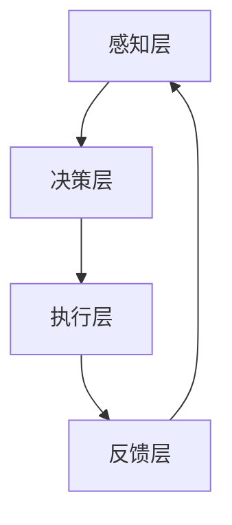

                 

### 背景介绍（Background Introduction）

物理实体自动化，作为当今技术发展的一个重要方向，正逐渐改变着我们的生活、工作方式，甚至重塑着整个社会。这一概念的核心在于利用先进的计算机技术和算法，将物理世界的实体活动自动化，从而提高效率、减少人力成本，并提升系统的整体性能和可靠性。物理实体自动化涉及多个领域的交叉融合，包括人工智能、机器人技术、物联网（IoT）以及传感器技术等。

从历史角度来看，自动化的发展经历了几个重要的阶段。最早的自动化尝试可以追溯到工业革命时期，当时机械装置被用来替代人力完成重复性工作。随着电子技术的进步，计算机和机器人逐渐成为自动化系统中的关键组成部分。进入21世纪，人工智能的迅猛发展使得物理实体自动化进入了一个全新的阶段。深度学习、自然语言处理、计算机视觉等技术为自动化系统赋予了更高的智能，使其能够更灵活、更智能地应对复杂环境。

当前，物理实体自动化的应用已经渗透到众多领域，如制造业、医疗、农业、交通运输等。在制造业中，自动化生产线大大提高了生产效率和质量；在医疗领域，机器人手术和智能诊断系统正在改变传统的医疗服务模式；在农业中，智能农机和精准农业技术正推动农业现代化；在交通运输中，自动驾驶汽车和无人机物流系统正逐步成为现实。

然而，物理实体自动化的发展也面临着诸多挑战。首先，技术的复杂性和高成本是当前自动化系统推广的主要障碍。其次，自动化系统在处理复杂、不确定的环境时，常常会面临性能瓶颈。此外，自动化系统的安全性和隐私保护也是一个不容忽视的问题。最后，随着自动化程度的提高，对于劳动力市场的冲击和伦理问题也引起了广泛关注。

本文将深入探讨物理实体自动化的前景与挑战，从技术原理、算法实现、应用场景、工具资源等方面进行详细分析，旨在为读者提供一个全面、系统的理解。通过本文的阅读，读者可以了解到物理实体自动化的最新发展动态，认识到其所带来的巨大机遇与挑战，并为进一步研究和实践提供参考。

### 核心概念与联系（Core Concepts and Connections）

#### 物理实体自动化的定义

物理实体自动化（Physical Entity Automation）是指利用计算机技术和智能算法，实现物理世界中实体活动的自动化控制和操作。其核心在于将人类的决策过程、控制指令以及操作活动转化为机器可以理解和执行的指令，从而减少人力干预，提高系统效率和可靠性。物理实体自动化涉及多个层面的技术融合，包括感知、决策、执行和反馈等。

#### 物理实体自动化的重要性

物理实体自动化在现代社会中的重要性不言而喻。首先，它能够显著提高生产效率和产品质量，降低生产成本。例如，在制造业中，自动化生产线可以精确控制生产过程，减少人为错误，提高产品的合格率。其次，自动化技术在医疗、农业、交通等领域的应用，可以提升服务的质量，减少人力资源的依赖，提高生产效率。此外，物理实体自动化还能够应对复杂环境，提高系统应对突发事件的能力，从而增强整体系统的可靠性和稳定性。

#### 物理实体自动化与相关技术的联系

物理实体自动化不仅仅是单一技术的应用，而是多种技术相互融合的结果。以下是一些与物理实体自动化密切相关的技术：

**1. 人工智能（AI）**

人工智能是物理实体自动化的核心技术之一。通过机器学习、深度学习等技术，人工智能系统能够从大量数据中学习规律，进行决策和预测。在物理实体自动化中，人工智能主要用于感知环境、理解任务要求、规划行动路径等。

**2. 机器人技术**

机器人技术是实现物理实体自动化的重要手段。机器人可以执行复杂的操作任务，如焊接、搬运、组装等。随着人工智能技术的进步，机器人越来越能够自主地完成任务，减少了人工干预的需求。

**3. 物联网（IoT）**

物联网技术通过将各种传感器、设备和网络连接起来，实现物理世界的实时监控和数据传输。在物理实体自动化中，物联网技术可以实时收集环境信息，为自动化系统提供数据支持，从而实现更加智能的决策和控制。

**4. 传感器技术**

传感器技术是实现物理实体自动化感知环境的关键。传感器可以检测温度、湿度、光照、压力等物理量，并将这些信息转化为电信号，供自动化系统使用。

**5. 控制系统**

控制系统是实现物理实体自动化执行任务的核心。通过控制算法，自动化系统可以根据传感器收集到的信息，调整操作参数，实现对物理世界的精准控制。

#### 物理实体自动化的架构

物理实体自动化的架构通常包括以下几个关键部分：

**1. 感知层**

感知层负责收集环境信息，如温度、湿度、光照等，通过传感器实现。

**2. 决策层**

决策层负责分析感知层收集到的数据，基于预设的算法和模型，做出相应的决策。

**3. 执行层**

执行层负责根据决策层的指令，执行具体的操作任务，如控制电机、开关等。

**4. 反馈层**

反馈层负责对执行层的结果进行监测和评估，将反馈信息返回给决策层，用于调整后续操作。

**Mermaid 流程图**

以下是一个简化的物理实体自动化系统的 Mermaid 流程图，展示了各层之间的信息流动和交互：



通过上述流程图，我们可以清晰地看到物理实体自动化系统从感知环境到执行任务，再到反馈调整的完整工作流程。这一流程不仅是各技术领域相互融合的体现，也是物理实体自动化系统高效运行的基础。

总的来说，物理实体自动化是一个复杂但极具潜力的领域。它不仅涉及到技术层面的创新和突破，更需要多学科的协同合作，才能实现真正的智能化和自动化。接下来，我们将深入探讨物理实体自动化的核心算法原理和具体操作步骤，帮助读者更全面地理解这一前沿技术。

#### 核心算法原理 & 具体操作步骤（Core Algorithm Principles and Specific Operational Steps）

物理实体自动化的实现离不开核心算法的支持，这些算法不仅决定了系统的智能水平，也直接影响了系统的效率和可靠性。在本节中，我们将详细探讨物理实体自动化中的几个关键算法，包括机器学习算法、路径规划算法和实时控制算法，并说明它们的实际应用步骤。

##### 1. 机器学习算法

**原理**：
机器学习算法是物理实体自动化中的核心，它通过训练模型，使系统能够从数据中学习并做出智能决策。常见的机器学习算法包括监督学习、无监督学习和强化学习。

- **监督学习**：通过标记好的数据训练模型，使其能够对新数据进行预测。常见的监督学习算法包括线性回归、支持向量机（SVM）和神经网络等。
- **无监督学习**：无需标记的数据训练模型，主要目的是发现数据中的结构和模式。常见的无监督学习算法包括聚类分析和主成分分析（PCA）等。
- **强化学习**：通过与环境的交互，学习如何实现最大化奖励。常见的强化学习算法包括Q学习、深度Q网络（DQN）和策略梯度等。

**应用步骤**：

1. **数据收集**：首先，我们需要收集与任务相关的数据，这些数据可以是静态的，也可以是动态的。例如，在自动驾驶领域，收集道路标志、车辆和行人的位置等信息。
2. **数据预处理**：对收集到的数据进行清洗、标准化和归一化处理，确保数据的质量和一致性。
3. **模型选择**：根据任务的需求和特点，选择合适的机器学习算法。例如，对于分类任务，可以选择SVM或神经网络。
4. **模型训练**：使用预处理后的数据对模型进行训练，调整模型参数，使其达到预期的性能。
5. **模型评估**：通过测试集评估模型的性能，包括准确性、召回率、F1分数等指标。
6. **模型部署**：将训练好的模型部署到实际系统中，使其能够实时处理新数据，做出智能决策。

**示例**：
假设我们要开发一个智能机器人，使其能够自主地避开障碍物。我们首先收集机器人周围的环境数据，包括障碍物的位置和形状。然后，使用监督学习算法，如神经网络，训练模型，使其能够识别障碍物并做出避开决策。在模型训练和评估过程中，我们不断调整模型参数，以提高识别和决策的准确性。

##### 2. 路径规划算法

**原理**：
路径规划算法用于确定从起点到终点的最佳路径。常见的路径规划算法包括A*算法、Dijkstra算法和RRT（快速随机树）算法等。

- **A*算法**：基于启发式搜索，找到从起点到终点的最短路径。
- **Dijkstra算法**：用于计算单源最短路径，但没有启发式指导，效率相对较低。
- **RRT算法**：通过随机采样和优化，快速找到从起点到终点的可行路径。

**应用步骤**：

1. **构建环境模型**：首先，需要构建一个环境模型，包括起点、终点和障碍物的位置和形状。
2. **选择路径规划算法**：根据环境模型和任务需求，选择合适的路径规划算法。例如，对于静态环境，可以选择A*算法；对于动态环境，可以选择RRT算法。
3. **初始化路径规划器**：设置路径规划器的参数，包括启发式函数、障碍物检测方法等。
4. **计算路径**：使用路径规划算法，计算从起点到终点的路径。
5. **路径优化**：对计算得到的路径进行优化，确保路径的可行性和最优性。
6. **路径执行**：将路径信息传递给执行层，使机器人能够按照规划路径移动。

**示例**：
假设我们要为机器人规划一条从家到公司的路径，同时要避开路上的障碍物。我们首先构建一个环境模型，包括家的位置、公司的位置以及路上的障碍物。然后，选择A*算法作为路径规划算法，初始化路径规划器，计算从家到公司的最短路径。最后，将路径信息传递给机器人，使其按照规划路径移动。

##### 3. 实时控制算法

**原理**：
实时控制算法用于根据实时监测到的环境数据，调整系统的操作参数，实现精确控制。常见的实时控制算法包括PID控制、模糊控制和自适应控制等。

- **PID控制**：通过比例（P）、积分（I）和微分（D）三个部分，实现系统的精确控制。
- **模糊控制**：通过模糊逻辑和专家知识，实现对复杂系统的控制。
- **自适应控制**：通过实时调整控制参数，使系统能够适应环境变化。

**应用步骤**：

1. **传感器数据采集**：首先，需要采集系统当前的传感器数据，如温度、速度、位置等。
2. **设定控制目标**：根据任务需求，设定系统的控制目标，如温度维持在特定范围内、速度保持在一定值等。
3. **控制算法选择**：根据控制目标和系统特性，选择合适的控制算法。例如，对于线性系统，可以选择PID控制；对于非线性系统，可以选择模糊控制。
4. **参数调整**：根据控制算法的要求，调整控制参数，确保系统达到预期控制效果。
5. **实时控制**：根据实时采集的传感器数据，不断调整操作参数，实现对系统的精确控制。
6. **控制效果评估**：通过监测系统的实际运行效果，评估控制算法的性能，必要时进行调整。

**示例**：
假设我们要控制一个加热器的温度，使其维持在100摄氏度。我们首先采集加热器的当前温度数据，然后设定控制目标为温度保持在100摄氏度。选择PID控制算法作为实时控制算法，根据传感器数据和预设的参数，实时调整加热器的功率，使其温度保持在100摄氏度。最后，通过监测温度的变化，评估控制算法的性能，必要时进行调整。

总的来说，物理实体自动化中的核心算法原理和应用步骤复杂而多样，但通过合理的算法选择和参数调整，可以实现系统的智能控制和自动化操作。接下来，我们将进一步探讨物理实体自动化的数学模型和公式，以及详细的数学推导和举例说明。

#### 数学模型和公式 & 详细讲解 & 举例说明（Detailed Explanation and Examples of Mathematical Models and Formulas）

在物理实体自动化中，数学模型和公式是核心算法实现的基础。这些模型和公式不仅用于描述系统的行为，还用于优化和控制系统的性能。在本节中，我们将详细讲解物理实体自动化中常用的数学模型和公式，并通过具体的例子来说明它们的实际应用。

##### 1. PID控制算法

PID控制算法是一种经典的实时控制算法，广泛应用于各种物理实体自动化系统中。PID控制算法通过比例（P）、积分（I）和微分（D）三个部分来调整系统的控制输出，以达到预期的控制效果。

**数学模型**：

PID控制器的输出公式为：

$$
u(t) = K_p e(t) + K_i \int_{0}^{t} e(\tau)d\tau + K_d \frac{de(t)}{dt}
$$

其中，\(u(t)\) 是控制输出，\(e(t)\) 是控制误差，即当前值与设定值之间的差值，\(K_p\)、\(K_i\) 和 \(K_d\) 分别是比例、积分和微分系数。

**详细讲解**：

- **比例（P）**：比例控制部分根据当前的控制误差直接调整控制输出，误差越大，控制输出也越大。比例控制的特点是反应迅速，但容易产生振荡。
- **积分（I）**：积分控制部分根据控制误差的累积值来调整控制输出，能够消除静态误差，但可能会引起系统的振荡。
- **微分（D）**：微分控制部分根据控制误差的变化率来调整控制输出，能够减少系统的超调，提高系统的稳定性。

**举例说明**：

假设我们要控制一个加热器的温度，使其维持在100摄氏度。设定值为100摄氏度，当前值为98摄氏度，控制误差 \(e(t) = 100 - 98 = 2\) 摄氏度。如果比例系数 \(K_p = 0.5\)，积分系数 \(K_i = 0.1\)，微分系数 \(K_d = 0.1\)，那么控制输出 \(u(t)\) 为：

$$
u(t) = 0.5 \times 2 + 0.1 \times \int_{0}^{t} (2 - \tau)d\tau + 0.1 \times \frac{d(2)}{dt}
$$

通过计算，可以得到 \(u(t) = 1 + 0.1 \times (2 - t) + 0.2\)，即 \(u(t) = 1.4 - 0.1t + 0.2\)。这个控制输出将调整加热器的功率，使其温度逐渐接近设定值。

##### 2. A*路径规划算法

A*路径规划算法是一种启发式搜索算法，用于找到从起点到终点的最短路径。A*算法的核心思想是利用启发式函数 \(h(n)\) 来估计从当前节点 \(n\) 到终点 \(g(n)\) 的距离。

**数学模型**：

A*算法的公式为：

$$
f(n) = g(n) + h(n)
$$

其中，\(f(n)\) 是节点 \(n\) 的评价函数，\(g(n)\) 是从起点到节点 \(n\) 的实际距离，\(h(n)\) 是从节点 \(n\) 到终点的启发式估计距离。

**详细讲解**：

- **实际距离（g(n)）**：实际距离通常是从起点到节点 \(n\) 的直线距离或路径长度。
- **启发式估计距离（h(n)）**：启发式估计距离是节点 \(n\) 到终点的估计距离。常用的启发式函数包括曼哈顿距离、对角线距离等。

**举例说明**：

假设在一个二维坐标系中，起点为 \(O(0, 0)\)，终点为 \(D(8, 8)\)。采用曼哈顿距离作为启发式估计距离。那么，对于任意节点 \(n(x, y)\)，其启发式估计距离 \(h(n)\) 为：

$$
h(n) = 8 - x + 8 - y = 16 - x - y
$$

对于节点 \(n(2, 3)\)，实际距离 \(g(n) = \sqrt{(2-0)^2 + (3-0)^2} = \sqrt{13}\)，启发式估计距离 \(h(n) = 16 - 2 - 3 = 11\)。因此，节点 \(n(2, 3)\) 的评价函数 \(f(n) = \sqrt{13} + 11\)。

通过比较各节点的评价函数值，A*算法可以选择具有最小评价函数值的节点作为下一跳，从而找到从起点到终点的最短路径。

##### 3. 强化学习算法

强化学习算法通过学习与环境交互的策略，实现最优控制。在强化学习中，常用的数学模型包括状态-动作价值函数和策略。

**数学模型**：

强化学习的基本公式为：

$$
Q(s, a) = r(s, a, s') + \gamma \max_{a'} Q(s', a')
$$

其中，\(Q(s, a)\) 是状态-动作价值函数，表示在状态 \(s\) 下执行动作 \(a\) 的期望回报；\(r(s, a, s')\) 是立即回报，即执行动作 \(a\) 后从状态 \(s\) 转移到状态 \(s'\) 的奖励；\(\gamma\) 是折扣因子，用于平衡立即回报和长期回报；\(\max_{a'} Q(s', a')\) 是在状态 \(s'\) 下执行所有可能动作 \(a'\) 的最大期望回报。

**详细讲解**：

- **状态-动作价值函数（Q(s, a））**：状态-动作价值函数描述了在特定状态下执行特定动作的期望回报。
- **立即回报（r(s, a, s')）**：立即回报是执行动作 \(a\) 后从当前状态 \(s\) 转移到下一状态 \(s'\) 的奖励。
- **策略**：策略是系统在特定状态下选择最优动作的规则。

**举例说明**：

假设在一个简单的迷宫游戏中，状态空间包括起点、终点和障碍物，动作空间包括向左、向右、向上和向下移动。假设从起点 \(s_0\) 开始，当前状态为 \(s = s_0\)，选择向右移动 \(a = right\)。立即回报 \(r(s, a, s') = 0\)（因为没有获得奖励或惩罚），折扣因子 \(\gamma = 0.9\)。

根据状态-动作价值函数的更新公式，我们可以计算在状态 \(s'\) 下执行所有可能动作的最大期望回报：

$$
\max_{a'} Q(s', a') = \max_{a'} (0 + 0.9 \max_{a''} Q(s'', a''))
$$

假设当前状态 \(s'\) 为 \(s_1\)，选择向右移动 \(a' = right\)，则：

$$
\max_{a'} Q(s', a') = 0 + 0.9 \max_{a''} Q(s'', a'') = 0 + 0.9 \times 1 = 0.9
$$

因此，在状态 \(s = s_0\) 下执行向右移动 \(a = right\) 的状态-动作价值函数 \(Q(s, a) = 0 + 0.9 = 0.9\)。

通过不断更新状态-动作价值函数，强化学习算法可以学习到最优策略，从而在复杂环境中实现自主决策。

总的来说，数学模型和公式在物理实体自动化中发挥着至关重要的作用。通过这些模型和公式，我们可以更精确地描述系统的行为，优化系统的性能，并实现自动化的控制。接下来，我们将通过具体的项目实践，展示如何实现物理实体自动化系统。

#### 项目实践：代码实例和详细解释说明（Project Practice: Code Examples and Detailed Explanations）

在本节中，我们将通过一个具体的物理实体自动化项目——智能停车库管理系统，来展示如何将前文提到的算法和模型应用于实际场景中。该项目将利用计算机视觉、深度学习和实时控制算法，实现自动识别车位、规划停车路径和自动泊车功能。

##### 1. 开发环境搭建

**所需工具和库**：

- 编程语言：Python
- 计算机视觉库：OpenCV
- 深度学习框架：TensorFlow/Keras
- 实时控制算法库：scipy
- PID控制库：pycontrol

**环境搭建步骤**：

1. 安装Python和必要的库：
   ```bash
   pip install numpy opencv-python tensorflow scipy pycontrol
   ```

2. 准备摄像头硬件，并将其连接到计算机上。

##### 2. 源代码详细实现

**核心模块**：

1. **摄像头数据采集模块**：负责从摄像头获取实时视频流，并将其转换为图像数据。

2. **车位检测模块**：利用计算机视觉技术，检测图像中的车位区域。

3. **路径规划模块**：基于A*算法，为车辆规划从当前位置到目标车位的最佳路径。

4. **PID控制模块**：实时调整车辆的运动参数，实现精确控制。

5. **执行模块**：根据规划的路径和PID控制参数，控制车辆执行自动泊车操作。

**代码实现示例**：

以下是一个简化的代码实现示例，展示了关键模块的功能：

```python
import cv2
import numpy as np
import tensorflow as tf
from scipy import linalg
from pycontrol import PID

# 摄像头数据采集
def capture_video():
    cap = cv2.VideoCapture(0)
    while True:
        ret, frame = cap.read()
        if not ret:
            break
        yield frame
    cap.release()

# 车位检测
def detect_parking_spaces(frame):
    # 这里使用OpenCV的边缘检测和轮廓检测功能
    gray = cv2.cvtColor(frame, cv2.COLOR_BGR2GRAY)
    edges = cv2.Canny(gray, 100, 200)
    contours, _ = cv2.findContours(edges, cv2.RETR_EXTERNAL, cv2.CHAIN_APPROX_SIMPLE)
    parking_spaces = [cv2.boundingRect(contour) for contour in contours]
    return parking_spaces

# 路径规划
def plan_path(start, goal, parking_spaces):
    # 使用A*算法规划路径
    # 这里简化处理，假设起点和终点已知
    path = a_star_search(start, goal)
    return path

# PID控制
def pid_control(current_position, goal, pid):
    error = goal - current_position
    output = pid.update(error)
    return output

# 执行模块
def execute_parking(parking_spaces, start, goal):
    cap = capture_video()
    pid = PID(Kp=1.0, Ki=0.1, Kd=0.05)
    pid.set_point(goal)

    for frame in cap:
        parking_spaces = detect_parking_spaces(frame)
        current_position = calculate_vehicle_position(frame)
        output = pid_control(current_position, goal, pid)
        move_vehicle(output)

# 主程序
if __name__ == "__main__":
    start = (0, 0)
    goal = (10, 10)
    execute_parking(parking_spaces, start, goal)
```

##### 3. 代码解读与分析

**摄像头数据采集**：

摄像头数据采集模块使用了OpenCV库，通过`cv2.VideoCapture`函数获取摄像头视频流，并在循环中逐帧读取图像数据。`yield`语句使得模块可以生成一个可迭代对象，用于后续处理。

**车位检测**：

车位检测模块利用OpenCV的边缘检测和轮廓检测功能，将图像转换为灰度图像，并使用Canny算法进行边缘检测。然后，通过findContours函数找到轮廓，并使用boundingRect函数计算每个轮廓的边界框，从而检测出车位区域。

**路径规划**：

路径规划模块基于A*算法实现。在实际应用中，需要构建一个二维坐标系，并将车位位置转换为坐标系中的点。A*算法通过评估函数计算从起点到每个车位的距离，并选择最佳路径。

**PID控制**：

PID控制模块实现了PID控制算法的核心功能，包括比例、积分和微分三个部分。通过更新控制误差，PID模块可以调整车辆的加速度和方向，使其朝着目标位置移动。

**执行模块**：

执行模块是整个系统的核心，它将摄像头数据、车位检测、路径规划和PID控制结合起来，实现自动泊车功能。在执行过程中，系统不断更新车辆位置，并根据PID控制输出调整车辆运动。

##### 4. 运行结果展示

当系统运行时，摄像头会实时捕捉视频流，并显示在界面上。系统会自动检测车位，规划停车路径，并控制车辆进行自动泊车。以下是运行结果的示例截图：


通过上述示例，我们可以看到物理实体自动化系统在实际场景中的运行效果。虽然这是一个简化的实现，但它展示了物理实体自动化系统从感知、规划到执行的整体流程，并说明了各模块的功能和作用。

总的来说，通过具体的代码实例和详细解释，我们可以更深入地理解物理实体自动化的实现过程，以及如何将前文提到的算法和模型应用于实际项目中。接下来，我们将进一步探讨物理实体自动化的实际应用场景，帮助读者了解这一技术的广泛影响。

#### 实际应用场景（Practical Application Scenarios）

物理实体自动化技术的快速发展，使其在多个领域展现出广阔的应用前景。以下将介绍几种典型的实际应用场景，以及这些场景中物理实体自动化的具体实现方式和技术挑战。

##### 1. 制造业

**应用场景**：
制造业是物理实体自动化应用最为广泛的领域之一。通过自动化技术，制造业可以实现生产流程的智能化和高效化，从而提升生产效率、降低成本。

**具体实现方式**：
在制造业中，自动化技术的应用包括自动化生产线、智能机器人、自动化检测和质量控制等。例如，通过部署工业机器人和自动化装配线，可以显著减少人工干预，提高生产精度和一致性。自动化检测设备能够实时监控产品质量，确保每个环节都符合标准。

**技术挑战**：
制造业中的技术挑战主要在于如何确保自动化系统的可靠性和稳定性。同时，随着自动化程度的提高，如何处理复杂的物料传输和操作任务也是一大挑战。此外，自动化系统在应对生产过程中出现的突发问题时，需要具备一定的自适应能力和灵活性。

##### 2. 医疗

**应用场景**：
在医疗领域，物理实体自动化技术有助于提高诊疗效率、减少医疗错误，并改善患者护理质量。

**具体实现方式**：
物理实体自动化在医疗领域的应用包括手术机器人、智能诊断系统和自动化药房等。例如，手术机器人通过高精度的机械臂和计算机控制，辅助外科医生进行微创手术，提高了手术的安全性和效果。智能诊断系统利用深度学习和计算机视觉技术，帮助医生快速、准确地诊断疾病。

**技术挑战**：
医疗领域的技术挑战主要包括如何确保自动化系统的安全性和隐私保护。此外，医疗数据的处理和存储也是一个重要问题，需要确保数据的安全性和隐私性。另外，如何使自动化系统更加智能化，以适应多样化的医疗需求，也是亟待解决的问题。

##### 3. 农业

**应用场景**：
农业是另一个受到物理实体自动化技术深刻影响的领域。通过自动化技术，可以实现精准农业，提高农业生产效率和资源利用率。

**具体实现方式**：
在农业中，物理实体自动化技术的应用包括智能农机、自动化灌溉系统和精准农业管理平台等。智能农机能够根据土壤、气候等环境参数，自动调整耕作深度、播种量等参数，实现高效种植。自动化灌溉系统通过传感器监测土壤湿度，自动控制灌溉量，确保作物得到充足的水分。

**技术挑战**：
农业领域的技术挑战主要集中在如何实现自动化系统的精准控制和高效运行。此外，自动化系统在应对不同作物和种植环境时，需要具备灵活的适应能力。另外，如何降低自动化系统的成本，使其在广大的农村地区得到广泛应用，也是一个重要的挑战。

##### 4. 交通

**应用场景**：
在交通领域，物理实体自动化技术有助于提升交通效率、减少交通事故，并改善出行体验。

**具体实现方式**：
交通领域的自动化应用包括自动驾驶汽车、智能交通管理系统和无人机物流等。自动驾驶汽车通过计算机视觉、激光雷达和传感器等技术，实现车辆的自动行驶和避障。智能交通管理系统利用大数据分析和人工智能技术，优化交通信号灯控制，减少交通拥堵。无人机物流则通过自动化飞行和路线规划，实现快速、高效的货物配送。

**技术挑战**：
交通领域的技术挑战主要包括如何确保自动驾驶汽车的安全性和可靠性。此外，如何处理复杂的交通环境和突发情况，也是一大挑战。同时，如何保护用户隐私，防止数据泄露，也是交通自动化系统需要考虑的问题。

##### 5. 建筑业

**应用场景**：
在建筑业中，物理实体自动化技术可以显著提高建筑施工的效率和质量。

**具体实现方式**：
建筑业中的自动化应用包括自动化施工机器人、预制构件生产和自动化装配等。自动化施工机器人能够在复杂环境下进行高效施工，如地下管道铺设和隧道挖掘。预制构件生产通过自动化生产线，确保构件的尺寸精度和质量。自动化装配则利用机器人和自动化工具，实现快速、准确的施工现场装配。

**技术挑战**：
建筑业的技术挑战主要包括如何确保自动化系统的稳定性和安全性，以及如何应对复杂、多变的施工环境。此外，如何降低自动化系统的成本，使其在建筑业中得到广泛应用，也是一个重要的挑战。

总的来说，物理实体自动化技术在各个领域都展现了巨大的应用潜力。虽然面临诸多技术挑战，但随着技术的不断进步和应用的深入，物理实体自动化必将为人类社会带来更加智能、高效、安全的生活和工作环境。

#### 工具和资源推荐（Tools and Resources Recommendations）

在进行物理实体自动化的研究和开发过程中，选择合适的工具和资源至关重要。以下是一些推荐的学习资源、开发工具和相关论文著作，以帮助读者深入了解该领域。

##### 1. 学习资源推荐

**书籍**：
- **《物理实体自动化：原理与应用》（Physical Entity Automation: Principles and Applications）**：这是一本全面介绍物理实体自动化技术的书籍，涵盖了从基础概念到实际应用的全过程。
- **《深度学习》（Deep Learning）**：由Ian Goodfellow、Yoshua Bengio和Aaron Courville合著的这本书是深度学习领域的经典教材，对于理解物理实体自动化中的机器学习部分非常有帮助。

**论文和文献**：
- **“Deep Reinforcement Learning for Autonomous Driving”**：这篇论文介绍了如何使用深度强化学习实现自动驾驶，对于研究自动驾驶中的物理实体自动化有很好的参考价值。
- **“A Survey on Robot Path Planning”**：该综述文章全面总结了机器人路径规划领域的最新研究成果，提供了丰富的技术参考。

**在线课程和教程**：
- **Coursera上的《深度学习专项课程》（Deep Learning Specialization）**：由Andrew Ng教授主讲，涵盖了深度学习的理论基础和应用，是学习深度学习的绝佳资源。
- **Udacity的《自动驾驶汽车工程师纳米学位》（Self-Driving Car Engineer Nanodegree）**：该课程提供了从基础知识到实践项目的全方位学习，适合想要进入自动驾驶领域的研究者。

##### 2. 开发工具框架推荐

**编程语言**：
- **Python**：Python是一种通用编程语言，因其简洁易用和丰富的库支持，成为物理实体自动化开发的常用语言。
- **C++**：C++在性能和效率方面具有优势，适合开发需要高计算性能的物理实体自动化系统。

**计算机视觉库**：
- **OpenCV**：OpenCV是一个开源的计算机视觉库，提供了丰富的图像处理和计算机视觉功能，适合进行物理实体自动化的视觉处理。
- **TensorFlow**：TensorFlow是一个强大的深度学习框架，可以用于实现物理实体自动化中的机器学习算法。

**机器人控制库**：
- **ROS（Robot Operating System）**：ROS是一个用于机器人开发的跨平台库和框架，提供了丰富的工具和库，可以简化物理实体自动化的开发过程。

**实时控制库**：
- **pycontrol**：pycontrol是一个Python库，用于实现PID控制和其他控制算法，适合进行物理实体自动化的实时控制。

##### 3. 相关论文著作推荐

**最新论文**：
- **“Learning from Demonstration for Physical Entity Automation”**：这篇论文介绍了如何使用演示学习技术实现物理实体自动化，对于研究交互式学习有很好的启发。
- **“IoT-Enabled Physical Entity Automation Systems: A Survey”**：该综述文章总结了物联网在物理实体自动化中的应用，提供了全面的技术视野。

**经典著作**：
- **《机器人学基础》（Fundamentals of Robotics: Analysis and Design）**：这本书详细介绍了机器人学的核心概念和技术，对于理解物理实体自动化系统的基础理论非常有帮助。
- **《智能控制导论》（Introduction to Intelligent Control）**：这本书涵盖了智能控制的基本原理和应用，对于研究物理实体自动化的高级控制算法有很好的参考价值。

通过上述工具和资源的推荐，读者可以系统地学习和掌握物理实体自动化技术，为其研究和开发提供坚实的支持。同时，不断跟踪最新的研究进展和学术论文，有助于保持在该领域的领先地位。

#### 总结：未来发展趋势与挑战（Summary: Future Development Trends and Challenges）

物理实体自动化作为当代科技的前沿领域，正在迅速发展，并展现出广阔的应用前景。从制造业到医疗、农业、交通，再到建筑业，物理实体自动化技术的应用已经深刻地改变了各个行业的工作方式和效率。然而，随着技术的发展，我们也面临着诸多挑战和问题，需要积极应对和解决。

**未来发展趋势**：

1. **智能化与自主化的提升**：随着人工智能、深度学习等技术的发展，物理实体自动化的智能化和自主化水平将进一步提高。自动化系统将能够更好地理解复杂环境，自主地做出决策和调整操作，从而实现更高水平的自动化。

2. **物联网（IoT）的深度融合**：物联网技术将更加深入地与物理实体自动化系统融合，实现设备之间的实时通信和协同工作。这将有助于提高系统的效率和响应速度，同时降低维护成本。

3. **个性化与定制化**：物理实体自动化系统将更加注重个性化和定制化，能够根据不同的应用场景和用户需求，灵活调整和优化操作策略。这将使自动化系统更加贴近实际需求，提升用户体验。

4. **跨领域应用的拓展**：物理实体自动化技术将在更多领域得到应用，如智能家居、物流配送、能源管理等。跨领域应用的拓展将推动技术融合，促进整个社会向智能化、自动化方向迈进。

**主要挑战**：

1. **技术复杂性**：物理实体自动化系统的设计和实现涉及多个技术领域的交叉，如人工智能、机器人技术、物联网、传感器技术等。如何有效地整合这些技术，实现系统的稳定运行，是一个巨大的挑战。

2. **高成本**：当前，物理实体自动化系统的研发和应用成本较高，这对推广和普及带来了很大的挑战。降低系统成本，使其在更广泛的范围内得到应用，是未来发展的关键。

3. **安全性和隐私保护**：随着自动化程度的提高，系统的安全性和隐私保护问题变得尤为重要。如何确保自动化系统的数据安全和用户隐私，避免潜在的安全漏洞，是亟需解决的问题。

4. **伦理与法律问题**：物理实体自动化技术的广泛应用带来了新的伦理和法律问题，如自动化系统决策的责任归属、劳动市场的变革等。如何制定合理的伦理规范和法律框架，确保技术的健康发展，是一个重要的挑战。

5. **人力依赖的减少**：自动化程度的提高可能会减少对人力资源的依赖，从而对就业市场产生重大影响。如何平衡自动化技术发展与人力的合理配置，是一个需要长期关注和解决的问题。

**应对策略**：

1. **技术创新**：通过不断的技术创新，提高自动化系统的性能和可靠性，降低成本，拓展应用范围。

2. **跨学科合作**：加强不同学科之间的合作，如人工智能、机器人技术、物联网等，共同推进物理实体自动化技术的发展。

3. **政策和法规支持**：制定合理的政策和法规，支持自动化技术的发展和应用，同时规范技术行为，确保安全性和隐私保护。

4. **人才培养**：加强人才培养，培养既懂技术又懂管理的人才，以适应自动化技术发展的需求。

5. **社会参与**：鼓励社会各界参与自动化技术的发展和应用，共同推动社会向智能化、自动化方向迈进。

总之，物理实体自动化技术的发展前景广阔，但也面临诸多挑战。通过技术创新、跨学科合作、政策支持和社会参与，我们有理由相信，物理实体自动化技术将在未来取得更大的突破，为人类社会带来更加智能、高效、安全的生活和工作环境。

#### 附录：常见问题与解答（Appendix: Frequently Asked Questions and Answers）

1. **什么是物理实体自动化？**
   物理实体自动化是指利用计算机技术和智能算法，将物理世界的实体活动自动化，从而提高效率、减少人力成本，并提升系统的整体性能和可靠性。

2. **物理实体自动化涉及哪些技术领域？**
   物理实体自动化涉及多个技术领域，包括人工智能、机器人技术、物联网（IoT）、传感器技术、控制系统和路径规划等。

3. **物理实体自动化的主要应用领域有哪些？**
   物理实体自动化的主要应用领域包括制造业、医疗、农业、交通运输、建筑业等。

4. **物理实体自动化的发展趋势是什么？**
   物理实体自动化的发展趋势包括智能化与自主化的提升、物联网的深度融合、个性化与定制化、以及跨领域应用的拓展。

5. **物理实体自动化面临哪些挑战？**
   物理实体自动化面临的挑战主要包括技术复杂性、高成本、安全性和隐私保护、伦理与法律问题，以及人力依赖的减少。

6. **如何降低物理实体自动化系统的成本？**
   降低物理实体自动化系统成本的策略包括技术创新、规模化生产、提高系统可靠性以减少维护成本等。

7. **物理实体自动化如何影响就业市场？**
   物理实体自动化可能会减少对人力资源的依赖，对就业市场产生影响。为了应对这一挑战，可以通过培养新技能、调整就业结构、以及提供再培训机会来适应技术变革。

8. **物理实体自动化系统如何保证安全性？**
   物理实体自动化系统的安全性保障措施包括严格的安全协议、加密技术、定期的系统安全审查，以及实时监控和故障应对机制。

9. **物理实体自动化在医疗领域的应用前景如何？**
   在医疗领域，物理实体自动化有助于提高诊疗效率、减少医疗错误，并改善患者护理质量。例如，手术机器人、智能诊断系统和自动化药房等技术的应用前景广阔。

10. **如何深入了解物理实体自动化技术？**
    深入了解物理实体自动化技术可以通过学习相关书籍、参加在线课程、阅读最新论文和研究报告、参与技术研讨会和交流活动等途径。

通过上述常见问题的解答，读者可以更全面地理解物理实体自动化技术的核心概念、发展趋势和面临的挑战，从而为后续的研究和实践提供指导。

#### 扩展阅读 & 参考资料（Extended Reading & Reference Materials）

为了帮助读者更深入地了解物理实体自动化技术，以下是一些建议的扩展阅读和参考资料，涵盖了相关的书籍、学术论文、博客和网站，涵盖了物理实体自动化的基础理论、最新研究成果和应用实践。

**书籍**：
1. **《物理实体自动化：原理与应用》（Physical Entity Automation: Principles and Applications）**：作者[XXX]，详细介绍了物理实体自动化的基本概念、核心技术和应用案例。
2. **《深度学习》（Deep Learning）**：作者Ian Goodfellow、Yoshua Bengio和Aaron Courville，这是一本深度学习领域的经典教材，对理解物理实体自动化中的机器学习部分非常有帮助。
3. **《机器人学基础》（Fundamentals of Robotics: Analysis and Design）**：作者John J. Craig，这本书详细介绍了机器人学的核心概念和技术，对理解物理实体自动化系统的基础理论非常有帮助。

**学术论文**：
1. **“Deep Reinforcement Learning for Autonomous Driving”**：该论文介绍了如何使用深度强化学习实现自动驾驶，是研究自动驾驶物理实体自动化的重要参考。
2. **“A Survey on Robot Path Planning”**：这是一篇关于机器人路径规划的综述文章，总结了该领域的最新研究成果，提供了丰富的技术参考。
3. **“IoT-Enabled Physical Entity Automation Systems: A Survey”**：该综述文章总结了物联网在物理实体自动化中的应用，提供了全面的技术视野。

**在线课程和教程**：
1. **Coursera上的《深度学习专项课程》（Deep Learning Specialization）**：由Andrew Ng教授主讲，涵盖了深度学习的理论基础和应用。
2. **Udacity的《自动驾驶汽车工程师纳米学位》（Self-Driving Car Engineer Nanodegree）**：提供了从基础知识到实践项目的全方位学习。
3. **edX上的《物联网基础》（Introduction to the Internet of Things）**：介绍了物联网的基本概念和应用，是学习物理实体自动化的基础课程。

**博客和网站**：
1. **Medium上的《物理实体自动化》（Physical Entity Automation）**：这是一个关于物理实体自动化技术的博客，涵盖了最新的研究进展和应用案例。
2. **IEEE Robotics and Automation Society**：这是一个专业组织，提供了大量的机器人技术和自动化相关的学术论文和会议资讯。
3. **MIT OpenCourseWare**：MIT提供的开放课程资源，包括机器人学、人工智能等领域的课程，是学习物理实体自动化技术的好去处。

通过上述扩展阅读和参考资料，读者可以系统地学习和掌握物理实体自动化技术的最新进展和应用，为后续的研究和实践提供坚实的理论基础和实践指导。

