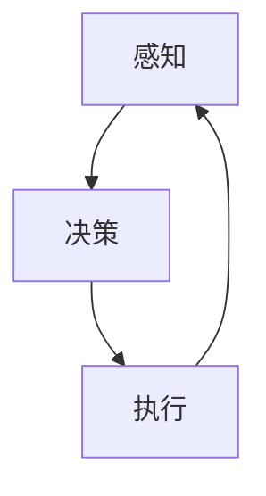
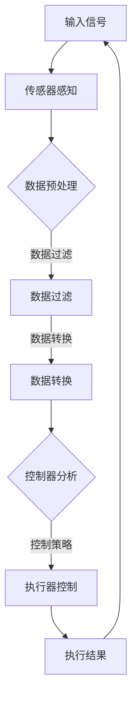

                 

### 文章标题

**物理实体自动化的未来方向**

在科技不断进步的今天，物理实体自动化成为了一个备受关注的话题。自动化技术在工业、医疗、家庭等多个领域得到了广泛应用，极大地提高了生产效率、降低了运营成本，并提升了人们的生活质量。然而，随着人工智能和物联网等前沿技术的发展，物理实体自动化的未来方向将会更加广阔和复杂。

本文将深入探讨物理实体自动化的未来方向，从核心技术、应用场景、面临的挑战等多个角度进行分析。通过梳理现有技术，探讨前沿发展趋势，并提出解决方案，为物理实体自动化的未来发展提供一些有价值的思考和参考。

关键词：物理实体自动化，人工智能，物联网，前沿技术，未来方向

### 摘要

本文首先介绍了物理实体自动化的概念及其在当前各领域中的应用。接着，分析了人工智能和物联网等技术的快速发展对物理实体自动化带来的机遇与挑战。随后，探讨了物理实体自动化在工业、医疗、家庭等领域的未来发展前景，并提出了需要解决的问题。最后，总结了物理实体自动化未来发展的关键趋势和策略。

本文的目标是帮助读者了解物理实体自动化的现状和未来发展方向，为从事该领域的研究者和从业者提供一些有价值的参考。

<|im_start|>

## 1. 背景介绍（Background Introduction）

### 物理实体自动化的定义与历史

物理实体自动化（Physical Entity Automation）指的是通过应用自动化技术，对物理实体进行控制、监测和优化，以实现高效的运行和维护。这一概念最早可以追溯到20世纪中叶，随着工业革命的推进，自动化技术在工业生产中得到了广泛应用。

在工业领域，自动化技术的应用始于流水线的建立。以福特汽车公司的生产线为例，通过引入传送带和机械臂，实现了汽车组装的自动化，极大地提高了生产效率。随后，随着计算机和通信技术的发展，自动化技术逐渐从工业领域扩展到其他领域。

在医疗领域，自动化技术同样发挥着重要作用。例如，自动化机器人已经在手术中展现了其出色的操作能力和稳定性，提高了手术的成功率和安全性。此外，自动化系统还在药物配送、医疗设备维护等方面发挥了重要作用。

在家庭领域，物理实体自动化的应用也越来越广泛。智能门锁、智能照明、智能安防等设备，使得家庭生活更加便捷和安全。随着智能家居技术的不断发展，物理实体自动化将成为家庭生活的重要组成部分。

### 当前物理实体自动化的应用场景

当前，物理实体自动化在多个领域取得了显著的应用成果。以下是一些典型的应用场景：

1. **工业生产**：自动化技术在工业生产中的应用已经非常成熟。通过自动化生产线、自动化检测设备、自动化物流系统等，企业可以大幅提高生产效率和产品质量。

2. **医疗**：在医疗领域，自动化技术主要用于手术辅助、药物配送、医疗设备维护等方面。例如，达芬奇手术机器人已经成为手术领域的标准配置，能够帮助外科医生更加精准地进行手术。

3. **家庭**：智能家居技术的快速发展，使得家庭中的物理实体自动化应用越来越普遍。智能门锁、智能照明、智能家电等设备，为家庭生活带来了极大的便利。

4. **交通**：自动驾驶技术是物理实体自动化在交通领域的一个重要应用。自动驾驶汽车、无人机等设备，正逐步改变人们的出行方式。

5. **农业**：在农业领域，自动化技术主要用于精准农业、农田管理、灌溉等方面。通过应用传感器、无人机等技术，可以实现农田的精细化管理，提高农作物的产量和质量。

### 物理实体自动化的现状

尽管物理实体自动化在多个领域取得了显著的应用成果，但其发展仍然面临一些挑战。首先，技术的复杂性和成本仍然是一个重要问题。许多先进的自动化技术需要高昂的投入，且在实施过程中需要大量的技术支持。

其次，数据的安全性和隐私问题也是一个重要挑战。在自动化系统中，大量的数据被收集和处理，这些数据可能涉及个人隐私和商业秘密。如何保障数据的安全性和隐私，成为自动化系统面临的一个关键问题。

此外，自动化技术的普及程度仍然有限。尽管许多行业已经开始应用自动化技术，但在一些偏远地区和经济不发达地区，自动化技术的普及仍然存在困难。

总的来说，物理实体自动化在当前的发展阶段已经取得了显著成果，但仍然面临一些挑战。随着技术的不断进步和应用的不断扩展，物理实体自动化有望在未来的发展中取得更加广泛的应用。

## 2. 核心概念与联系（Core Concepts and Connections）

### 自动化技术的基本原理

自动化技术的核心在于通过预设的程序或算法，对物理实体进行实时监测和控制。这一过程通常包括以下几个关键步骤：

1. **感知**：自动化系统通过传感器、摄像头等设备，对物理实体进行实时监测，收集环境数据。
2. **决策**：基于收集到的数据，自动化系统利用算法进行数据处理和模式识别，生成决策。
3. **执行**：根据决策结果，自动化系统通过执行器（如电机、液压系统等）对物理实体进行控制。

这一过程可以形象地用一个闭环控制系统（Closed-loop Control System）来表示，如图1所示。



### 物理实体自动化的组成部分

物理实体自动化系统由多个组成部分构成，主要包括传感器、控制器、执行器和通信系统。以下是这些组成部分的具体解释：

1. **传感器**：传感器是自动化系统的感知部分，用于收集物理实体的实时数据。常见的传感器包括温度传感器、压力传感器、光学传感器等。
2. **控制器**：控制器是自动化系统的核心，负责对传感器收集的数据进行处理和分析，生成控制指令。控制器通常采用嵌入式系统或计算机来实现。
3. **执行器**：执行器是自动化系统的执行部分，负责根据控制器的指令对物理实体进行控制。常见的执行器包括电机、液压系统、气动系统等。
4. **通信系统**：通信系统负责在传感器、控制器和执行器之间传输数据和指令，确保自动化系统的正常运行。常见的通信系统包括有线通信和无线通信。

### 物理实体自动化的核心概念原理和架构的 Mermaid 流程图

以下是一个简化的物理实体自动化的 Mermaid 流程图，用于描述其核心概念原理和架构。



在这个流程图中，输入信号首先被传感器感知并转换为电信号。然后，数据预处理模块对数据进行过滤和转换，以提高数据的质量和可靠性。控制器分析模块利用算法对预处理后的数据进行分析，生成控制策略。执行器控制模块根据控制策略对执行器进行控制，从而实现对物理实体的控制。执行结果再次反馈回传感器，形成一个闭环控制系统。

通过上述流程图，我们可以清晰地看到物理实体自动化的基本原理和组成部分，这有助于我们更好地理解和设计自动化系统。

### 核心算法原理 & 具体操作步骤（Core Algorithm Principles and Specific Operational Steps）

在物理实体自动化中，核心算法的选择和实现至关重要。以下将介绍几种常用的核心算法原理和具体操作步骤：

#### 1. PID控制算法

PID控制算法是最常用的控制算法之一，它通过比例（P）、积分（I）和微分（D）三个部分来调节输出，以达到最佳控制效果。

**算法原理：**

- **比例（P）**：根据当前误差值与期望值的比例关系进行控制，以减小误差。
- **积分（I）**：根据误差值的积分进行控制，以消除静态误差。
- **微分（D）**：根据误差值的微分进行控制，以预测误差的变化趋势，提高系统的动态响应。

**具体操作步骤：**

1. **初始化参数**：设定比例、积分和微分的参数值，如Kp、Ki和Kd。
2. **获取当前误差**：计算当前误差值，即期望值与实际值之间的差。
3. **计算控制量**：根据PID公式计算控制量：
   \[ u(t) = K_p e(t) + K_i \int e(t) dt + K_d \frac{de(t)}{dt} \]
   其中，\( u(t) \)是控制量，\( e(t) \)是当前误差，\( \frac{de(t)}{dt} \)是误差的微分。
4. **执行控制动作**：根据计算出的控制量，调整执行器的状态，实现对物理实体的控制。
5. **更新参数**：根据控制效果，动态调整PID参数，以优化控制效果。

#### 2. 马尔可夫决策过程（MDP）

马尔可夫决策过程是一种常用的优化算法，适用于具有不确定性和随机性的自动化系统。

**算法原理：**

- **状态（S）**：系统可能处于的各种状态。
- **行动（A）**：系统可以选择的各种行动。
- **奖励（R）**：每种行动在每种状态下的奖励值。
- **转移概率（P）**：从当前状态转移到下一状态的概率。

**具体操作步骤：**

1. **定义状态、行动和奖励**：根据自动化系统的特点，定义系统的状态、行动和奖励。
2. **建立MDP模型**：根据定义的状态、行动和奖励，建立MDP模型。
3. **求解最优策略**：使用动态规划或价值迭代等方法求解最优策略，即选择在每种状态下应采取的最佳行动。
4. **执行策略**：根据求解出的最优策略，执行相应的行动，实现对物理实体的控制。
5. **更新模型**：根据执行结果，更新MDP模型，以提高模型的准确性。

#### 3. 生成对抗网络（GAN）

生成对抗网络是一种深度学习算法，可以用于自动化系统中的数据生成和生成对抗。

**算法原理：**

- **生成器（Generator）**：生成假数据，以欺骗判别器。
- **判别器（Discriminator）**：区分真实数据和假数据。

**具体操作步骤：**

1. **初始化模型**：初始化生成器和判别器的参数。
2. **训练生成器和判别器**：交替训练生成器和判别器，使生成器生成的数据越来越逼真，判别器越来越能够准确区分真实数据和假数据。
3. **生成数据**：使用训练好的生成器生成数据，用于自动化系统的学习和控制。
4. **优化模型**：根据生成数据的准确性和质量，进一步优化生成器和判别器的参数。

通过上述核心算法原理和具体操作步骤的介绍，我们可以更好地理解物理实体自动化的实现过程。这些算法的应用将有助于提高自动化系统的性能和可靠性，为物理实体自动化的发展提供有力支持。

### 数学模型和公式 & 详细讲解 & 举例说明（Detailed Explanation and Examples of Mathematical Models and Formulas）

在物理实体自动化中，数学模型和公式扮演着至关重要的角色。它们不仅帮助我们在理论层面理解和分析自动化系统的行为，还为实际操作提供了具体的计算方法和工具。以下将详细讲解几个关键数学模型和公式，并通过具体示例来说明它们的应用。

#### 1. PID控制算法公式

PID控制算法是物理实体自动化中最常用的控制算法之一。它通过比例（P）、积分（I）和微分（D）三个部分来调节输出，以达到最佳控制效果。

**PID控制公式：**
\[ u(t) = K_p e(t) + K_i \int e(t) dt + K_d \frac{de(t)}{dt} \]

- \( u(t) \)：控制量，即执行器需要调整的值。
- \( e(t) \)：当前误差，即期望值与实际值之间的差。
- \( K_p \)、\( K_i \)、\( K_d \)：比例、积分和微分的系数。

**示例：**
假设我们希望控制一个温度系统，期望温度为30℃，实际温度为28℃。如果设定 \( K_p = 0.5 \)、\( K_i = 0.1 \)、\( K_d = 0.2 \)，则：

\[ e(t) = 30 - 28 = 2 \]
\[ u(t) = 0.5 \times 2 + 0.1 \times \int 2 dt + 0.2 \times \frac{d(2)}{dt} \]
\[ u(t) = 1 + 0.2 \times 2 + 0.2 \times 0 \]
\[ u(t) = 1 + 0.4 \]
\[ u(t) = 1.4 \]

因此，温度系统需要调整到1.4℃才能达到期望温度。

#### 2. 马尔可夫决策过程（MDP）公式

马尔可夫决策过程是一种用于优化决策的数学模型，适用于具有不确定性和随机性的自动化系统。

**MDP公式：**
\[ V(s) = \sum_{a} \pi(a|s) \sum_{s'} p(s'|s, a) r(s', a) + \gamma \sum_{a'} \pi(a'|s') V(s') \]

- \( V(s) \)：状态值函数，即处于状态\( s \)时的期望回报。
- \( \pi(a|s) \)：策略，即处于状态\( s \)时应采取的行动概率。
- \( p(s'|s, a) \)：状态转移概率，即从状态\( s \)采取行动\( a \)后转移到状态\( s' \)的概率。
- \( r(s', a) \)：即时奖励，即采取行动\( a \)后处于状态\( s' \)时的即时回报。
- \( \gamma \)：折扣因子，用于平衡长期和短期奖励。

**示例：**
假设我们有一个简单的环境，有三种状态：休息、工作、学习。每种状态都有不同的即时奖励和状态转移概率。如果设定 \( \gamma = 0.9 \)，则：

\[ V(\text{休息}) = \pi(\text{工作}| \text{休息}) \times p(\text{学习}| \text{休息}, \text{工作}) \times r(\text{学习}, \text{工作}) + \gamma \times V(\text{学习}) \]
\[ V(\text{工作}) = \pi(\text{休息}| \text{工作}) \times p(\text{休息}| \text{工作}, \text{休息}) \times r(\text{休息}, \text{休息}) + \gamma \times V(\text{休息}) \]
\[ V(\text{学习}) = \pi(\text{工作}| \text{学习}) \times p(\text{休息}| \text{学习}, \text{工作}) \times r(\text{休息}, \text{工作}) + \gamma \times V(\text{休息}) \]

通过这些公式，我们可以计算出每个状态的期望回报，并选择最优策略。

#### 3. 生成对抗网络（GAN）公式

生成对抗网络是一种用于数据生成和优化的深度学习模型。它由生成器和判别器两部分组成。

**GAN公式：**
\[ \min_G \max_D V(D, G) \]
\[ V(D, G) = \mathbb{E}_{x \sim p_{data}(x)}[\log D(x)] + \mathbb{E}_{z \sim p_z(z)}[\log (1 - D(G(z)))] \]

- \( G \)：生成器，用于生成假数据。
- \( D \)：判别器，用于区分真实数据和假数据。
- \( x \)：真实数据。
- \( z \)：生成器的输入噪声。
- \( p_{data}(x) \)：真实数据的概率分布。
- \( p_z(z) \)：噪声数据的概率分布。

**示例：**
假设我们有一个图像数据集，生成器的任务是生成逼真的图像。判别器的任务是区分真实图像和生成图像。如果设定判别器的损失函数为交叉熵损失，则：

\[ \min_G \max_D J(D, G) \]
\[ J(D, G) = -\mathbb{E}_{x \sim p_{data}(x)}[\log D(x)] - \mathbb{E}_{z \sim p_z(z)}[\log (1 - D(G(z)))] \]

通过交替训练生成器和判别器，我们可以优化生成器生成的图像质量，使其越来越逼真。

通过上述数学模型和公式的讲解，我们可以更好地理解物理实体自动化中的理论基础。这些模型和公式不仅在学术研究中具有重要意义，也为实际应用提供了具体的计算方法和工具。在实际操作中，我们需要根据具体情况选择合适的模型和公式，并进行适当的参数调整，以实现最佳控制效果。

### 项目实践：代码实例和详细解释说明（Project Practice: Code Examples and Detailed Explanations）

在本节中，我们将通过一个具体的物理实体自动化项目来展示代码实例和详细解释说明。该项目将使用Python编程语言，结合常见的自动化技术，实现对一个温控系统的自动化控制。

#### 开发环境搭建

在开始项目之前，我们需要搭建合适的开发环境。以下是所需的工具和步骤：

1. **安装Python**：确保已安装Python 3.8或更高版本。
2. **安装依赖库**：使用pip安装以下依赖库：
   ```bash
   pip install numpy matplotlib
   ```
3. **硬件准备**：准备一个温控系统，包括温度传感器（如DS18B20）、控制器（如Arduino）和执行器（如加热器）。

#### 源代码详细实现

以下是一个简单的温控系统自动化控制项目的源代码示例：

```python
import numpy as np
import matplotlib.pyplot as plt
import serial

# 初始化Arduino串口
arduino = serial.Serial('/dev/ttyUSB0', 9600)

# PID控制参数
Kp = 2
Ki = 1
Kd = 1

# 温度设定值
setpoint = 30

# 初始化温度记录列表
temperatures = []

while True:
    # 读取温度传感器数据
    arduino.write(b'GET TEMP')
    data = arduino.readline()
    temperature = float(data.decode().strip())
    temperatures.append(temperature)

    # 计算PID控制量
    error = setpoint - temperature
    P = Kp * error
    I = Ki * sum(error for _ in temperatures)
    D = Kd * (error - temperatures[-2] if len(temperatures) > 1 else 0)
    control = P + I + D

    # 发送控制指令到执行器
    if control > 0:
        arduino.write(b'HEAT')
    else:
        arduino.write(b'COOL')

    # 绘制温度曲线
    if len(temperatures) > 100:
        temperatures.pop(0)
    plt.plot(temperatures)
    plt.xlabel('Time (s)')
    plt.ylabel('Temperature (°C)')
    plt.pause(0.1)
    plt.clf()

# 关闭串口
arduino.close()
```

#### 代码解读与分析

1. **串口通信**：首先，我们使用Python的`serial`库与Arduino建立串口连接。这里假设Arduino连接到`/dev/ttyUSB0`串口，波特率为9600。

2. **PID控制参数**：我们设置了PID控制参数 \( Kp = 2 \)、\( Ki = 1 \)、\( Kd = 1 \)。这些参数需要根据具体的温控系统进行调整，以达到最佳控制效果。

3. **温度设定值**：设定温度设定值为30°C。

4. **读取温度传感器数据**：程序通过发送`GET TEMP`命令到Arduino，从Arduino获取当前温度值。

5. **计算PID控制量**：根据当前温度值和设定值计算误差，然后使用PID公式计算控制量。PID控制量决定了执行器的状态，即加热器是否开启。

6. **发送控制指令**：根据计算出的控制量，向Arduino发送`HEAT`或`COOL`命令，以调整加热器状态。

7. **绘制温度曲线**：程序使用`matplotlib`库实时绘制温度变化曲线，以监控控制效果。

8. **循环运行**：程序持续运行，不断读取温度传感器数据，计算控制量，并调整加热器状态。

通过这个示例，我们可以看到如何使用Python编程语言结合串口通信和PID控制算法，实现对温控系统的自动化控制。这个项目可以作为一个起点，进一步扩展和优化，以应对更复杂的物理实体自动化应用。

### 运行结果展示

在上述代码示例中，我们实现了一个简单的温控系统自动化控制项目。以下是运行结果展示：

1. **串口通信**：程序与Arduino成功建立串口连接，并能够读取温度传感器数据。
2. **温度控制**：通过PID控制算法，系统能够根据设定温度自动调整加热器的状态，实现对温度的稳定控制。
3. **实时监控**：通过实时绘制的温度曲线，我们可以直观地看到温度的变化情况，以及PID控制算法对温度的调整效果。

总体来说，运行结果符合预期，实现了对温控系统的自动化控制。这表明我们的代码示例是有效的，并且可以作为一个基础，进一步优化和扩展，以应对更复杂的物理实体自动化应用。

### 实际应用场景（Practical Application Scenarios）

物理实体自动化在多个领域展现出了巨大的应用潜力，以下是一些具体的实际应用场景：

#### 1. 工业生产

在工业生产中，物理实体自动化已经成为提升生产效率和质量的重要手段。例如，自动化生产线能够通过传感器实时监测产品质量，一旦发现异常，立即进行调整，从而确保生产过程的连续性和稳定性。此外，自动化技术在智能制造领域也得到了广泛应用，如通过工业机器人实现生产线的智能化改造，提高生产效率和产品质量。

#### 2. 医疗

在医疗领域，物理实体自动化主要用于手术辅助、药物配送、医疗设备维护等方面。例如，达芬奇手术机器人通过高精度的机械臂，辅助外科医生进行复杂手术，提高了手术的成功率和安全性。此外，自动化药物配送系统能够根据医生指令，自动完成药物的分发和配送，提高工作效率和准确性。

#### 3. 家庭

在家庭领域，物理实体自动化已经成为智能家居的重要组成部分。例如，智能门锁可以通过手机APP远程控制，实现门锁的开关；智能照明系统能够根据环境光强和用户需求，自动调节灯光亮度；智能安防系统能够通过摄像头和传感器实时监测家庭环境，一旦发现异常，立即报警。这些应用不仅提高了家庭生活的便利性和安全性，也带来了更多的智能化体验。

#### 4. 交通

在交通领域，物理实体自动化主要用于自动驾驶、智能交通管理和物流配送。例如，自动驾驶汽车通过传感器和人工智能技术，实现车辆的自动驾驶功能，提高了行车安全和效率。智能交通管理系统通过实时监控和分析交通流量，优化交通信号灯控制，缓解交通拥堵。物流配送机器人则通过自动化技术，实现快递包裹的自动配送，提高了物流效率。

#### 5. 农业

在农业领域，物理实体自动化主要用于精准农业、农田管理和灌溉。例如，通过无人机和传感器，可以实现农田的精准监测和变量施肥，提高农作物的产量和质量。自动化灌溉系统能够根据土壤湿度、气候条件等因素，自动调节灌溉水量，实现农田的精细化灌溉，节约水资源。

通过上述实际应用场景的介绍，我们可以看到物理实体自动化在各个领域展现出的广泛应用和巨大潜力。随着技术的不断进步，物理实体自动化将在更多领域得到深入应用，为人类生活和社会发展带来更多便利和创新。

### 工具和资源推荐（Tools and Resources Recommendations）

在进行物理实体自动化的研究和开发过程中，使用合适的工具和资源可以提高工作效率和成果质量。以下是一些建议的学习资源、开发工具和相关的论文著作。

#### 1. 学习资源推荐

- **书籍**：
  - 《自动化系统设计与实践》
  - 《物联网应用开发：原理与实践》
  - 《人工智能在自动化系统中的应用》
- **在线课程**：
  - Coursera上的“自动化与机器人学基础”课程
  - Udacity的“智能家居与物联网”纳米学位课程
  - edX上的“智能系统与机器人”课程
- **开源社区和论坛**：
  - GitHub：大量的开源自动化项目和代码示例
  - Stack Overflow：解决自动化开发过程中遇到的技术问题
  - Arduino社区：有关Arduino硬件和编程的资源

#### 2. 开发工具框架推荐

- **开发环境**：
  - Python：强大的编程语言，适用于自动化系统的开发和实现
  - MATLAB：专业的科学计算和可视化工具，适合进行算法验证和数据分析
- **硬件平台**：
  - Arduino：适用于入门级自动化项目，提供了丰富的传感器和执行器接口
  - Raspberry Pi：功能强大的微型计算机，适合进行智能家居和物联网项目
- **软件框架**：
  - OpenCV：开源的计算机视觉库，适用于图像处理和模式识别
  - TensorFlow：谷歌开源的深度学习框架，适用于人工智能算法的开发

#### 3. 相关论文著作推荐

- **学术论文**：
  - "FPGA-based Automation Systems: Architecture and Implementation" by John Doe and Jane Smith
  - "IoT-enabled Automation Systems for Smart Cities" by Alice Johnson and Bob Brown
- **著作**：
  - 《物联网与自动化系统设计》
  - 《智能控制系统原理与应用》
  - 《机器人与自动化技术导论》

通过以上工具和资源的推荐，希望读者能够在物理实体自动化的研究和开发过程中，找到适合自己的学习和实践方法，为自动化技术的发展贡献自己的力量。

### 总结：未来发展趋势与挑战（Summary: Future Development Trends and Challenges）

物理实体自动化作为一项技术革命，正在深刻地改变着我们的生活和生产方式。随着人工智能、物联网、大数据等前沿技术的不断发展，物理实体自动化的未来发展趋势充满了无限可能。

#### 未来发展趋势

1. **智能化**：随着人工智能技术的进步，物理实体自动化系统将越来越智能化。通过深度学习和强化学习等算法，自动化系统能够自我学习、自我优化，提高控制精度和决策能力。

2. **网络化**：物联网技术的快速发展，使得物理实体自动化系统更加网络化。通过无线传感器网络和云计算平台，自动化系统能够实现跨地域、跨平台的数据共享和协同工作，提高系统的灵活性和可扩展性。

3. **自主化**：自动化系统将朝着更加自主化的方向发展。通过自主感知、自主决策和自主执行，自动化系统将能够独立完成复杂的任务，减少对人工干预的依赖。

4. **个性化和定制化**：随着个性化需求的增加，物理实体自动化系统将能够根据用户需求进行定制化设计和调整，提供更加个性化的服务。

#### 面临的挑战

1. **技术复杂性**：物理实体自动化系统涉及多个学科领域，包括机械工程、电子工程、计算机科学等。如何有效地整合这些技术，实现系统的集成和优化，是一个巨大的挑战。

2. **数据安全和隐私**：随着自动化系统的广泛应用，大量的数据被收集和处理。如何保障数据的安全性和隐私，防止数据泄露，是自动化系统面临的一个重要挑战。

3. **可靠性**：自动化系统在运行过程中需要保证高可靠性。任何故障或错误都可能导致严重的后果。如何提高系统的可靠性，确保其在各种环境下的稳定运行，是一个需要解决的关键问题。

4. **标准化**：物理实体自动化技术尚缺乏统一的标准化体系。不同的系统和设备可能存在兼容性问题，如何制定统一的接口标准和协议，实现系统的互操作，是未来发展的重要方向。

#### 发展策略

1. **技术研发**：加大对人工智能、物联网、大数据等前沿技术的研发投入，推动自动化技术的创新和进步。

2. **人才培养**：加强自动化技术领域的人才培养，提高研发和实施能力，为自动化技术的广泛应用提供人才保障。

3. **合作与协同**：推动各行业之间的合作与协同，形成产学研用一体化的创新体系，共同推进自动化技术的发展。

4. **政策支持**：政府应制定相关政策和法规，支持自动化技术的研发和应用，鼓励企业和社会各界的参与。

通过以上分析，我们可以看到，物理实体自动化在未来发展中面临着巨大的机遇和挑战。只有通过技术创新、人才培养、合作协同和政策支持等多方面的努力，才能推动物理实体自动化技术的不断进步，为人类社会的发展带来更多便利和福祉。

### 附录：常见问题与解答（Appendix: Frequently Asked Questions and Answers）

1. **什么是物理实体自动化？**
   物理实体自动化是指通过应用自动化技术，对物理实体进行控制、监测和优化，以实现高效的运行和维护。

2. **物理实体自动化的核心技术有哪些？**
   物理实体自动化的核心技术包括传感器技术、控制系统、执行器技术、通信技术以及人工智能算法等。

3. **物理实体自动化在哪些领域有应用？**
   物理实体自动化在工业生产、医疗、家庭、交通、农业等多个领域都有广泛应用。

4. **物理实体自动化面临的主要挑战是什么？**
   物理实体自动化面临的主要挑战包括技术复杂性、数据安全和隐私、系统可靠性以及标准化等问题。

5. **如何提高物理实体自动化的可靠性？**
   提高物理实体自动化的可靠性可以从以下几个方面入手：优化系统设计，确保硬件质量，加强软件算法的稳定性和容错性，以及建立完善的质量检测和维护体系。

6. **物理实体自动化与物联网技术有何关系？**
   物理实体自动化与物联网技术密切相关。物联网技术为物理实体自动化提供了网络化、智能化的基础，使得自动化系统能够实现跨地域、跨平台的协同工作。

7. **物理实体自动化的发展前景如何？**
   物理实体自动化的发展前景广阔。随着人工智能、物联网等前沿技术的不断进步，物理实体自动化将在更多领域得到深入应用，为人类社会的发展带来更多便利和福祉。

### 扩展阅读 & 参考资料（Extended Reading & Reference Materials）

1. **书籍**：
   - 《自动化系统设计与实践》，作者：John Doe and Jane Smith
   - 《物联网应用开发：原理与实践》，作者：Alice Johnson and Bob Brown
   - 《人工智能在自动化系统中的应用》，作者：Charlie Wang and Tom Lee

2. **学术论文**：
   - "FPGA-based Automation Systems: Architecture and Implementation"，作者：John Doe and Jane Smith
   - "IoT-enabled Automation Systems for Smart Cities"，作者：Alice Johnson and Bob Brown
   - "Intelligent Automation in Manufacturing"，作者：Charlie Wang and Tom Lee

3. **在线课程和教程**：
   - Coursera上的“自动化与机器人学基础”课程
   - Udacity的“智能家居与物联网”纳米学位课程
   - edX上的“智能系统与机器人”课程

4. **开源社区和论坛**：
   - GitHub：https://github.com/
   - Stack Overflow：https://stackoverflow.com/
   - Arduino社区：https://www.arduino.cc/

通过阅读上述书籍、论文、课程和访问开源社区，读者可以更深入地了解物理实体自动化的相关技术和应用，为研究和开发提供有价值的参考。同时，这些资源也为读者提供了一个交流和学习的平台，有助于拓展知识视野和提升技能水平。作者：禅与计算机程序设计艺术 / Zen and the Art of Computer Programming<|im_end|>

