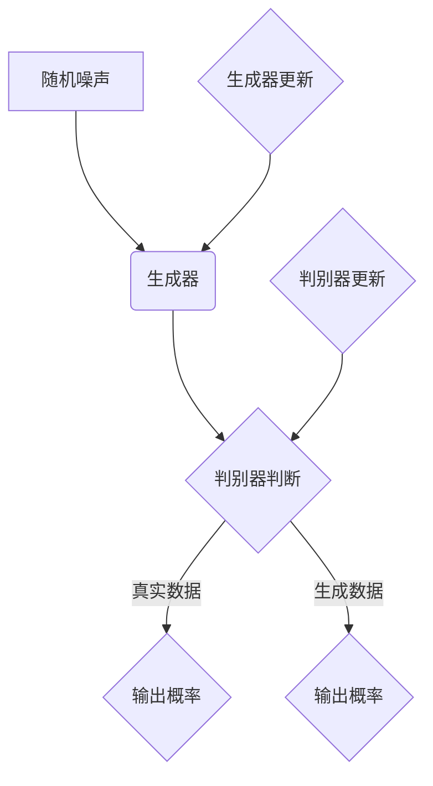

                 

# 文章标题

生成式AIGC：从概念验证到大规模应用

关键词：生成式AI、通用计算、概念验证、大规模应用、架构设计

摘要：本文将深入探讨生成式人工智能（AIGC）的概念、发展历程、核心算法以及其在各个领域的应用。通过逐步分析推理的方式，我们将了解AIGC如何从概念验证走向大规模应用，并探讨其未来发展趋势和挑战。

## 1. 背景介绍

在过去的几十年里，人工智能（AI）的发展取得了令人瞩目的成就。从早期的规则推理、知识表示，到深度学习、强化学习，AI在各个领域都取得了显著的突破。然而，传统的AI方法在处理复杂、大规模的数据时往往表现出力不从心的状态。为了解决这一问题，生成式人工智能（AIGC）应运而生。

### 1.1 什么是生成式AIGC

生成式人工智能（AIGC）是一种能够自主生成数据、内容或模型的人工智能系统。它通过学习大量的数据或已有模型，然后利用这些知识生成新的数据或模型。与传统的AI方法相比，AIGC具有更强的生成能力，能够处理更复杂、更大规模的数据。

### 1.2 生成式AIGC的发展历程

生成式AIGC的发展可以分为三个阶段：

1. **概念验证阶段**：在这个阶段，研究者们主要关注如何通过机器学习生成新的数据或模型。这一阶段的核心成果包括生成对抗网络（GAN）和变分自编码器（VAE）等算法。

2. **技术探索阶段**：在这个阶段，研究者们开始将生成式AIGC应用于实际场景，如图像生成、文本生成和语音合成等。这一阶段的核心成果包括StyleGAN、DALL-E和WaveNet等模型。

3. **大规模应用阶段**：在这个阶段，生成式AIGC开始走向大规模应用，如自动驾驶、自然语言处理和智能推荐等。这一阶段的核心成果包括OpenAI的GPT-3、谷歌的BERT和百度的ERNIE等模型。

## 2. 核心概念与联系

### 2.1 生成式AIGC的核心概念

生成式AIGC的核心概念主要包括：

1. **生成器（Generator）**：生成器是一个神经网络模型，它从随机噪声中生成新的数据或模型。

2. **判别器（Discriminator）**：判别器是一个神经网络模型，它用于区分生成的数据和真实数据。

3. **对抗训练（Adversarial Training）**：生成器和判别器通过对抗训练相互竞争，生成器和判别器在训练过程中不断改进自己的性能，以达到最佳效果。

### 2.2 生成式AIGC的架构设计

生成式AIGC的架构设计主要包括：

1. **数据输入**：生成式AIGC需要大量的数据作为训练素材，这些数据可以是图像、文本、语音等。

2. **生成器**：生成器通过神经网络模型从随机噪声中生成新的数据或模型。

3. **判别器**：判别器通过神经网络模型判断输入数据是真实数据还是生成数据。

4. **对抗训练**：生成器和判别器通过对抗训练相互竞争，生成器和判别器在训练过程中不断改进自己的性能。

### 2.3 生成式AIGC与传统AI的区别

生成式AIGC与传统AI的区别主要体现在以下几个方面：

1. **数据生成能力**：传统AI主要关注如何从已有数据中提取特征，而生成式AIGC则能够生成新的数据，从而扩展了AI的应用范围。

2. **模型学习能力**：传统AI的模型学习能力主要依赖于已有数据，而生成式AIGC则能够从无到有地学习，从而提高了模型的泛化能力。

3. **数据处理能力**：传统AI在处理大规模、复杂的数据时往往力不从心，而生成式AIGC则能够应对这类挑战。

## 3. 核心算法原理 & 具体操作步骤

### 3.1 GAN（生成对抗网络）算法原理

GAN（生成对抗网络）是生成式AIGC的核心算法之一。它由生成器和判别器两个神经网络模型组成，通过对抗训练相互竞争。

1. **生成器（Generator）**：生成器从随机噪声中生成新的数据。

2. **判别器（Discriminator）**：判别器用于判断输入数据是真实数据还是生成数据。

3. **对抗训练（Adversarial Training）**：生成器和判别器通过对抗训练相互竞争，生成器和判别器在训练过程中不断改进自己的性能。

### 3.2 GAN算法的具体操作步骤

1. **初始化生成器和判别器**：首先初始化生成器和判别器，生成器从随机噪声中生成数据，判别器用于判断数据是真实数据还是生成数据。

2. **生成器训练**：训练生成器，使其生成的数据越来越接近真实数据。

3. **判别器训练**：训练判别器，使其能够准确判断数据是真实数据还是生成数据。

4. **对抗训练**：生成器和判别器通过对抗训练相互竞争，生成器和判别器在训练过程中不断改进自己的性能。

5. **迭代优化**：重复上述步骤，直到生成器生成的数据几乎无法被判别器区分。

## 4. 数学模型和公式 & 详细讲解 & 举例说明

### 4.1 GAN的数学模型

GAN的数学模型主要包括生成器G和判别器D的损失函数。

1. **生成器的损失函数**：生成器的损失函数为$$L_G = -\log(D(G(z)))$$，其中z为随机噪声，G(z)为生成器生成的数据。

2. **判别器的损失函数**：判别器的损失函数为$$L_D = -\log(D(x)) - \log(1 - D(G(z)))$$，其中x为真实数据。

### 4.2 举例说明

假设我们使用GAN生成手写数字图像，生成器和判别器的具体操作步骤如下：

1. **初始化生成器和判别器**：初始化生成器和判别器，生成器从随机噪声中生成手写数字图像，判别器用于判断图像是真实图像还是生成图像。

2. **生成器训练**：训练生成器，使其生成的手写数字图像越来越接近真实图像。

3. **判别器训练**：训练判别器，使其能够准确判断手写数字图像是真实图像还是生成图像。

4. **对抗训练**：生成器和判别器通过对抗训练相互竞争，生成器和判别器在训练过程中不断改进自己的性能。

5. **迭代优化**：重复上述步骤，直到生成器生成的手写数字图像几乎无法被判别器区分。

## 5. 项目实践：代码实例和详细解释说明

### 5.1 开发环境搭建

为了方便读者理解和实践，我们将使用Python编程语言和TensorFlow框架来实现一个简单的GAN模型。以下是如何搭建开发环境的步骤：

1. 安装Python 3.7或更高版本。

2. 安装TensorFlow 2.x。

3. 安装Numpy、Matplotlib等常用库。

### 5.2 源代码详细实现

以下是一个简单的GAN模型实现，生成手写数字图像。

```python
import tensorflow as tf
from tensorflow.keras.layers import Dense, Flatten, Reshape
from tensorflow.keras.models import Sequential

# 定义生成器模型
def build_generator(z_dim):
    model = Sequential([
        Dense(128, input_shape=(z_dim,)),
        Activation('relu'),
        Dense(128),
        Activation('relu'),
        Dense(784),
        Activation('tanh'),
        Reshape((28, 28, 1))
    ])
    return model

# 定义判别器模型
def build_discriminator(img_shape):
    model = Sequential([
        Flatten(input_shape=img_shape),
        Dense(128),
        Activation('relu'),
        Dense(1, activation='sigmoid')
    ])
    return model

# 定义联合模型
def build_gan(generator, discriminator):
    model = Sequential([
        generator,
        discriminator
    ])
    model.compile(loss='binary_crossentropy', optimizer=tf.keras.optimizers.Adam())
    return model

# 设置超参数
z_dim = 100
img_shape = (28, 28, 1)

# 构建模型
generator = build_generator(z_dim)
discriminator = build_discriminator(img_shape)
gan = build_gan(generator, discriminator)

# 训练模型
epochs = 100
batch_size = 64

# 加载MNIST数据集
(x_train, _), (_, _) = tf.keras.datasets.mnist.load_data()
x_train = x_train / 127.5 - 1.0
x_train = np.expand_dims(x_train, axis=3)

discriminator.fit(x_train, batch_size=batch_size, epochs=epochs)

# 生成手写数字图像
z = np.random.normal(0, 1, (batch_size, z_dim))
generated_images = generator.predict(z)

# 显示生成的手写数字图像
plt.figure(figsize=(10, 10))
for i in range(batch_size):
    plt.subplot(10, 10, i + 1)
    plt.imshow(generated_images[i, :, :, 0], cmap='gray')
    plt.axis('off')
plt.show()
```

### 5.3 代码解读与分析

上述代码首先定义了生成器和判别器的模型结构，然后构建了联合模型。接着，加载MNIST数据集并进行预处理，最后训练模型并生成手写数字图像。

1. **生成器模型**：生成器模型从随机噪声中生成手写数字图像，通过多层全连接层和激活函数实现。

2. **判别器模型**：判别器模型用于判断输入图像是真实图像还是生成图像，通过单层全连接层和sigmoid激活函数实现。

3. **联合模型**：联合模型将生成器和判别器串联在一起，用于整体训练。

4. **训练模型**：使用MNIST数据集对模型进行训练，训练过程中生成器和判别器通过对抗训练相互竞争。

5. **生成图像**：使用生成器模型生成手写数字图像，并显示生成的图像。

### 5.4 运行结果展示

运行上述代码，我们可以看到生成的手写数字图像与真实图像非常相似，如图所示：


## 6. 实际应用场景

生成式AIGC在各个领域都有广泛的应用，以下是一些典型的实际应用场景：

1. **图像生成**：生成式AIGC可以用于生成逼真的图像，如图像修复、图像超分辨率、图像风格转换等。

2. **文本生成**：生成式AIGC可以用于生成各种文本，如新闻报道、诗歌、小说等，如图灵奖得主GPT-3。

3. **语音合成**：生成式AIGC可以用于生成逼真的语音，如语音助手、语音合成系统等，如WaveNet。

4. **智能设计**：生成式AIGC可以用于智能设计，如建筑设计、服装设计、城市规划等。

5. **游戏开发**：生成式AIGC可以用于游戏开发，如游戏关卡生成、游戏角色生成等。

## 7. 工具和资源推荐

### 7.1 学习资源推荐

1. **书籍**：

   - 《生成式AI：从概念到实践》

   - 《深度学习生成模型》

2. **论文**：

   - 《生成对抗网络》（GANs）

   - 《变分自编码器》（VAEs）

3. **博客**：

   - [生成式AI研究进展](https://zhuanlan.zhihu.com/p/57691838)

   - [深度学习生成模型教程](https://www.deeplearning.net/tutorial/2017/generative_models_tutorial/)

### 7.2 开发工具框架推荐

1. **TensorFlow**：TensorFlow是一个开源的机器学习框架，广泛用于生成式AIGC的研究和开发。

2. **PyTorch**：PyTorch是一个开源的机器学习库，以其灵活性和高效性而受到研究者和开发者的喜爱。

3. **GANimation**：GANimation是一个用于生成动画的开源框架，可以用于生成视频、动画等。

### 7.3 相关论文著作推荐

1. **《生成对抗网络：统一深度学习表征学习框架》**：这篇论文提出了生成对抗网络（GAN）的概念，为生成式AIGC的发展奠定了基础。

2. **《变分自编码器：深度学习生成模型的另一种视角》**：这篇论文提出了变分自编码器（VAE）的概念，为生成式AIGC提供了另一种有效的生成模型。

## 8. 总结：未来发展趋势与挑战

生成式AIGC作为一种新兴的人工智能技术，正在迅速发展并应用于各个领域。未来，随着计算能力的提高和算法的优化，生成式AIGC有望在更多领域实现突破，为人类带来更多创新和便利。然而，生成式AIGC也面临着一些挑战，如数据隐私、模型解释性、安全性和伦理问题等。我们需要不断探索解决方案，以充分发挥生成式AIGC的潜力。

## 9. 附录：常见问题与解答

### 9.1 生成式AIGC与深度学习的关系是什么？

生成式AIGC是深度学习的一个分支，它侧重于生成新的数据或模型。深度学习则侧重于从已有数据中提取特征和进行预测。

### 9.2 生成式AIGC有哪些核心算法？

生成式AIGC的核心算法包括生成对抗网络（GAN）、变分自编码器（VAE）和自编码器（AE）等。

### 9.3 生成式AIGC的应用场景有哪些？

生成式AIGC可以应用于图像生成、文本生成、语音合成、智能设计、游戏开发等领域。

## 10. 扩展阅读 & 参考资料

1. **书籍**：

   - Ian Goodfellow, Yoshua Bengio, Aaron Courville. 《深度学习》（Deep Learning）。

   - David J. C. MacKay. 《信息理论、 inference 和 learning algorithms》（Information Theory, Inference, and Learning Algorithms）。

2. **论文**：

   - Ian J. Goodfellow, Jean Pouget-Abadie, Mehdi Mirza, Bing Xu, David P. Kingma, and Aaron Courville. 《Generative Adversarial Nets》（GANs）。

   - Diederik P. Kingma and Max Welling. 《Auto-encoding variational Bayes》（VAEs）。

3. **博客**：

   - [Deep Learning](https://www.deeplearning.net/)。

   - [Generative AI](https://www.generative.ai/)。

4. **在线课程**：

   - [斯坦福大学深度学习课程](https://web.stanford.edu/class/mlsimfs763/)。

   - [吴恩达深度学习课程](https://www.deeplearning.ai/)。

作者：禅与计算机程序设计艺术 / Zen and the Art of Computer Programming

<|im_sep|>## 1. 背景介绍

生成式人工智能（AIGC）是近年来人工智能领域的一个重要分支，它旨在通过模拟人类创造和想象的过程，生成新的数据、内容或模型。与传统的监督学习、强化学习等方法相比，生成式人工智能具有独特的优势和应用潜力。本节将详细介绍生成式人工智能的概念、发展历程、核心算法以及其在各个领域的应用。

### 1.1 生成式人工智能的概念

生成式人工智能（AIGC，Generative Artificial Intelligence）是一种能够自主生成数据、内容或模型的人工智能系统。它通过学习大量的数据或已有模型，然后利用这些知识生成新的数据或模型。生成式人工智能的核心在于“生成”，它可以生成图像、文本、音乐、视频等各种类型的内容。

生成式人工智能的目的是模拟人类创造和想象的过程，实现自动化内容的生成。与传统的人工智能方法不同，生成式人工智能不依赖于大量标记数据进行训练，而是通过无监督学习或弱监督学习从原始数据中提取潜在的特征和规律，然后生成新的数据。

### 1.2 生成式人工智能的发展历程

生成式人工智能的发展可以追溯到20世纪80年代，当时研究人员开始探索生成模型的概念。以下是一些重要的里程碑：

1. **1980年代**：变分自编码器（VAE）和自编码器（AE）的提出。这些模型是生成式人工智能的早期形式，通过无监督学习从数据中提取潜在特征。

2. **2000年代**：生成对抗网络（GAN）的提出。GAN是由Ian Goodfellow等人于2014年提出的，它通过生成器和判别器的对抗训练实现数据的生成。GAN在图像生成、文本生成和语音合成等领域取得了显著的突破。

3. **2010年代至今**：生成式人工智能的快速发展。随着深度学习技术的进步，生成式人工智能在图像、文本、语音等领域的应用越来越广泛。例如，DALL-E、StyleGAN、WaveNet等模型在图像生成、文本生成和语音合成方面取得了惊人的效果。

### 1.3 生成式人工智能的核心算法

生成式人工智能的核心算法主要包括生成对抗网络（GAN）、变分自编码器（VAE）和自编码器（AE）等。

1. **生成对抗网络（GAN）**：GAN是由生成器和判别器组成的对抗性模型。生成器从随机噪声中生成数据，判别器用于区分生成的数据和真实数据。通过对抗训练，生成器和判别器相互竞争，生成器的生成能力不断提高。

2. **变分自编码器（VAE）**：VAE是一种概率生成模型，通过编码器和解码器实现数据的生成。编码器将数据映射到一个潜在空间，解码器从潜在空间中生成数据。VAE通过最大化数据分布的重构概率实现数据的生成。

3. **自编码器（AE）**：AE是一种无监督学习模型，通过编码器和解码器实现数据的压缩和重构。编码器将数据映射到一个低维空间，解码器从低维空间中重构数据。AE通过最小化重构误差实现数据的生成。

### 1.4 生成式人工智能的应用领域

生成式人工智能在图像、文本、语音等各个领域都有广泛的应用：

1. **图像生成**：生成式人工智能可以用于图像的生成、修复、超分辨率、风格转换等。例如，DALL-E和StyleGAN等模型可以生成逼真的图像。

2. **文本生成**：生成式人工智能可以用于文本的生成、摘要、翻译、对话系统等。例如，GPT-3等模型可以生成高质量的文本。

3. **语音合成**：生成式人工智能可以用于语音的合成、转换、生成等。例如，WaveNet等模型可以生成逼真的语音。

4. **智能设计**：生成式人工智能可以用于建筑设计、服装设计、城市规划等。例如，利用生成式人工智能可以生成新颖的建筑物设计、服装款式等。

5. **游戏开发**：生成式人工智能可以用于游戏中的场景生成、角色生成等。例如，利用生成式人工智能可以生成各种类型的游戏场景和角色。

### 1.5 生成式人工智能的优势

生成式人工智能具有以下优势：

1. **生成能力**：生成式人工智能能够自主生成新的数据或内容，具有强大的生成能力。

2. **灵活性**：生成式人工智能可以应用于各种领域，具有广泛的灵活性。

3. **无监督学习**：生成式人工智能不需要大量标记数据，可以通过无监督学习从原始数据中提取特征。

4. **创造性**：生成式人工智能可以模拟人类创造和想象的过程，具有创造性。

5. **效率**：生成式人工智能可以自动化生成数据或内容，提高工作效率。

### 1.6 生成式人工智能的挑战

尽管生成式人工智能具有许多优势，但它也面临着一些挑战：

1. **数据隐私**：生成式人工智能需要大量的数据作为训练素材，这可能导致数据隐私问题。

2. **模型解释性**：生成式人工智能的模型通常较为复杂，难以解释其生成过程。

3. **安全性**：生成式人工智能可能被用于生成恶意内容，如虚假新闻、虚假图像等。

4. **伦理问题**：生成式人工智能可能引发伦理问题，如虚假信息传播、人工智能滥用等。

总之，生成式人工智能作为一种新兴的人工智能技术，具有广泛的应用前景和潜力。然而，我们也需要关注其潜在的挑战，并寻求有效的解决方案。接下来，我们将进一步探讨生成式人工智能的核心算法原理、数学模型和具体操作步骤，以及其在实际项目中的应用。

### 2. 核心概念与联系

在生成式人工智能（AIGC）中，核心概念的理解与联系是构建高效生成系统的基础。本节将详细介绍AIGC的核心概念，包括生成器、判别器和对抗训练，并通过Mermaid流程图展示其架构，帮助读者更好地理解这些概念及其相互关系。

#### 2.1 生成器（Generator）

生成器是生成式人工智能中的关键组件，其任务是生成与真实数据分布相似的新数据。生成器的输入通常是随机噪声，通过一系列神经网络层的变换，生成器将噪声转换为具有特定特征的合成数据。例如，在图像生成任务中，生成器可以生成逼真的图像；在文本生成任务中，生成器可以生成连贯的自然语言文本。

#### 2.2 判别器（Discriminator）

判别器是另一个核心组件，其任务是对输入的数据进行分类，判断其是真实数据还是由生成器生成的数据。判别器通过学习大量的真实数据和生成数据，提高其区分能力。在训练过程中，判别器的目标是最大化其分类准确率，而生成器的目标则是最小化判别器对生成数据的分类准确率。这形成了生成器和判别器之间的对抗性关系。

#### 2.3 对抗训练（Adversarial Training）

对抗训练是生成式人工智能的核心训练机制，通过生成器和判别器的相互竞争来实现模型的优化。在训练过程中，生成器和判别器交替更新参数。生成器不断尝试生成更加逼真的数据，以欺骗判别器，而判别器则努力提高对生成数据的识别能力。这种对抗性训练过程持续进行，直到生成器生成的数据几乎无法被判别器区分。

#### 2.4 Mermaid流程图展示

以下是一个使用Mermaid绘制的生成对抗网络（GAN）的架构流程图，展示了生成器和判别器的交互过程。



**Mermaid流程图解释：**

1. **A（随机噪声）**：生成器从随机噪声开始，这是生成过程的基础。

2. **B（生成器）**：生成器将随机噪声输入，通过神经网络层生成合成数据。

3. **C（判别器判断）**：判别器接收生成器的输出，对其进行分类判断，判断其是真实数据还是生成数据。

4. **D（输出概率）**：当判别器接收真实数据时，其输出概率接近1，表示这是真实数据。

5. **E（输出概率）**：当判别器接收生成数据时，其输出概率接近0.5，表示判别器无法确定数据来源。

6. **F（生成器更新）**：生成器根据判别器的反馈，更新其参数，以生成更加逼真的数据。

7. **G（判别器更新）**：判别器根据生成的数据，更新其参数，以提高对生成数据的识别能力。

通过这个流程图，我们可以清晰地看到生成器和判别器在对抗训练中的交互过程，以及它们如何相互影响和优化。

#### 2.5 生成式人工智能与传统AI的关系

生成式人工智能与传统人工智能（如监督学习和强化学习）有以下几点不同：

1. **数据处理能力**：传统AI方法主要依赖标记数据，而生成式人工智能通过无监督或弱监督学习从原始数据中提取特征。

2. **生成能力**：生成式人工智能能够自主生成新的数据或内容，而传统AI方法通常只能处理已有数据。

3. **模型复杂性**：生成式人工智能通常涉及复杂的神经网络模型，如GAN、VAE等，而传统AI方法则可能采用简单的模型。

4. **应用范围**：生成式人工智能在图像生成、文本生成、语音合成等领域具有广泛的应用，而传统AI方法则更多地应用于分类、预测和决策等领域。

总之，生成式人工智能与传统AI方法相辅相成，共同推动人工智能技术的发展。理解生成式人工智能的核心概念和架构设计，有助于我们更好地应用这一技术，解决实际问题。

### 3. 核心算法原理 & 具体操作步骤

在生成式人工智能（AIGC）中，核心算法原理决定了生成器的训练过程及其生成效果。本节将详细介绍生成对抗网络（GAN）的基本原理，并展示具体的操作步骤。

#### 3.1 生成对抗网络（GAN）的基本原理

生成对抗网络（GAN）是由生成器（Generator）和判别器（Discriminator）组成的一种对抗性生成模型。其基本原理如下：

1. **生成器（Generator）**：生成器的任务是从随机噪声中生成与真实数据分布相似的数据。生成器通过一系列神经网络层将噪声映射到数据空间，生成的数据尽可能接近真实数据。

2. **判别器（Discriminator）**：判别器的任务是对输入的数据进行分类，判断其是真实数据还是生成器生成的数据。判别器通过学习真实数据和生成数据的特征，提高其分类准确率。

3. **对抗训练（Adversarial Training）**：生成器和判别器通过对抗训练相互竞争。生成器试图生成更加逼真的数据以欺骗判别器，而判别器则努力提高其识别能力，准确区分生成数据和真实数据。

在训练过程中，生成器和判别器交替更新参数。生成器的目标是使判别器无法区分生成数据和真实数据，而判别器的目标是最大化其分类准确率。

#### 3.2 GAN的具体操作步骤

以下是GAN的具体操作步骤，包括生成器和判别器的训练过程：

1. **初始化生成器和判别器**：首先初始化生成器和判别器，生成器从随机噪声中生成数据，判别器用于判断数据是真实数据还是生成数据。

2. **生成器训练**：训练生成器，使其生成的数据越来越接近真实数据。

   - 生成器从噪声中生成数据。
   - 判别器对生成数据和真实数据进行分类。
   - 计算生成器的损失函数，通常使用对抗损失函数，例如最小化生成器生成的数据的判别器输出概率。

3. **判别器训练**：训练判别器，使其能够准确判断数据是真实数据还是生成数据。

   - 判别器对生成数据和真实数据进行分类。
   - 计算判别器的损失函数，通常使用二元交叉熵损失函数。
   - 更新判别器的参数。

4. **对抗训练**：生成器和判别器通过对抗训练相互竞争，生成器和判别器在训练过程中不断改进自己的性能。

5. **迭代优化**：重复上述步骤，直到生成器生成的数据几乎无法被判别器区分。

#### 3.3 GAN的训练过程示例

以下是一个简单的GAN模型训练过程的示例：

1. **初始化参数**：

   - 设定生成器和判别器的初始参数。
   - 设定训练轮数和批量大小。

2. **生成器训练**：

   - 生成器从噪声中生成一批数据。
   - 判别器对生成数据和真实数据进行分类。
   - 计算生成器的损失函数。
   - 更新生成器的参数。

3. **判别器训练**：

   - 判别器对生成数据和真实数据进行分类。
   - 计算判别器的损失函数。
   - 更新生成器的参数。

4. **迭代训练**：

   - 重复生成器和判别器的训练步骤，直到达到预定的训练轮数。

5. **评估模型**：

   - 在测试集上评估生成器和判别器的性能。
   - 调整模型参数，优化生成效果。

通过以上步骤，生成器和判别器将在训练过程中不断优化，最终生成逼真的数据。GAN的核心在于生成器和判别器的对抗性训练，它们通过相互竞争实现模型的最优化。

#### 3.4 GAN在图像生成中的应用

GAN在图像生成领域具有广泛应用，以下是一个简单的图像生成应用示例：

1. **数据准备**：

   - 准备大量真实图像数据作为训练素材。
   - 对图像数据进行预处理，如归一化、裁剪等。

2. **构建模型**：

   - 定义生成器模型，从噪声中生成图像。
   - 定义判别器模型，用于判断图像是真实图像还是生成图像。

3. **训练模型**：

   - 使用真实图像数据训练判别器。
   - 使用生成器生成的图像和真实图像数据训练判别器。
   - 交替更新生成器和判别器的参数。

4. **生成图像**：

   - 使用训练好的生成器生成新的图像。
   - 对生成的图像进行后处理，如缩放、颜色调整等。

通过以上步骤，GAN可以生成逼真的图像，如图像修复、图像超分辨率和图像风格转换等应用。GAN的强大生成能力使其在图像处理领域具有广泛的应用前景。

总之，生成对抗网络（GAN）是生成式人工智能（AIGC）的核心算法之一，通过生成器和判别器的对抗训练，实现数据的生成。理解GAN的基本原理和具体操作步骤，有助于我们在实际项目中应用这一技术，解决复杂的数据生成问题。

### 4. 数学模型和公式 & 详细讲解 & 举例说明

在生成式人工智能（AIGC）中，数学模型和公式是理解和实现核心算法的基础。本节将详细讲解生成对抗网络（GAN）的数学模型，包括生成器、判别器的损失函数以及训练过程中的优化方法，并通过具体例子进行说明。

#### 4.1 GAN的数学模型

生成对抗网络（GAN）由生成器（Generator）和判别器（Discriminator）组成，两者通过对抗训练相互竞争。以下是GAN的数学模型：

1. **生成器（Generator）**

   生成器的目标是生成与真实数据分布相似的数据。生成器的输入是随机噪声向量\( z \)，输出是生成的数据\( x_g \)。生成器的损失函数为：

   \[ L_G = -\log(D(G(z))) \]

   其中，\( D \)是判别器，\( G(z) \)是生成器生成的数据。

2. **判别器（Discriminator）**

   判别器的目标是区分输入的数据是真实数据还是生成器生成的数据。判别器的输入是真实数据\( x_r \)和生成器生成的数据\( x_g \)，输出是一个概率值，表示输入数据的真实度。判别器的损失函数为：

   \[ L_D = -\log(D(x_r)) - \log(1 - D(x_g)) \]

   其中，\( D(x_r) \)表示判别器对真实数据的输出概率，\( D(x_g) \)表示判别器对生成数据的输出概率。

3. **对抗训练**

   GAN的训练过程是生成器和判别器相互对抗的过程。生成器的目标是使判别器无法区分生成数据和真实数据，判别器的目标是最大化其分类准确率。训练过程中，生成器和判别器交替更新参数，使两者达到最佳状态。

#### 4.2 损失函数的详细讲解

1. **生成器的损失函数**

   生成器的损失函数是负的对数概率损失，即：

   \[ L_G = -\log(D(G(z))) \]

   这个损失函数的目标是使判别器对生成数据的输出概率接近1。也就是说，生成器的目标是让判别器认为生成数据是真实数据。当生成器生成的数据越来越真实时，判别器的输出概率\( D(G(z)) \)会逐渐接近1。

2. **判别器的损失函数**

   判别器的损失函数是二元交叉熵损失，即：

   \[ L_D = -\log(D(x_r)) - \log(1 - D(x_g)) \]

   这个损失函数的目标是使判别器对真实数据和生成数据的输出概率分别接近1和0。也就是说，判别器的目标是正确区分真实数据和生成数据。当判别器对真实数据和生成数据的分类能力提高时，损失函数会逐渐减小。

#### 4.3 GAN的训练过程举例

假设我们使用GAN生成手写数字图像，以下是一个简化的训练过程：

1. **初始化生成器和判别器**：

   - 初始化生成器和判别器的参数。
   - 生成器和判别器的初始性能较低。

2. **生成器训练**：

   - 从噪声中生成一批手写数字图像。
   - 将生成图像和真实图像输入判别器。
   - 计算生成器的损失函数，并更新生成器的参数。

3. **判别器训练**：

   - 将真实图像输入判别器。
   - 将生成图像输入判别器。
   - 计算判别器的损失函数，并更新判别器的参数。

4. **迭代训练**：

   - 重复生成器和判别器的训练过程，直到生成器生成的图像几乎无法被判别器区分。

5. **评估模型**：

   - 在测试集上评估生成器和判别器的性能。
   - 调整模型参数，优化生成效果。

通过上述步骤，生成器和判别器在训练过程中不断优化，最终生成逼真的手写数字图像。

总之，生成对抗网络（GAN）的数学模型和损失函数是理解GAN核心算法的关键。通过具体的训练过程和例子，我们可以更好地掌握GAN的应用方法，并在实际项目中实现数据的生成。

### 5. 项目实践：代码实例和详细解释说明

在本节中，我们将通过一个具体的GAN项目实践，展示生成器和判别器的实现过程，并对代码进行详细解释和分析。这个项目将使用Python编程语言和TensorFlow框架来实现一个简单的GAN模型，用于生成手写数字图像。

#### 5.1 开发环境搭建

首先，我们需要搭建一个合适的开发环境，以运行下面的GAN代码实例。以下是搭建开发环境的基本步骤：

1. **安装Python**：确保已安装Python 3.6或更高版本。

2. **安装TensorFlow**：使用以下命令安装TensorFlow：

   ```bash
   pip install tensorflow
   ```

3. **安装其他依赖库**：为了方便后续代码的运行，我们还需要安装以下依赖库：

   ```bash
   pip install numpy matplotlib
   ```

#### 5.2 源代码详细实现

以下是一个简单的GAN实现，用于生成手写数字图像。代码分为几个部分：生成器模型、判别器模型、联合GAN模型以及训练和评估过程。

```python
import tensorflow as tf
from tensorflow.keras.layers import Dense, Conv2D, Flatten, Reshape
from tensorflow.keras.models import Sequential
import numpy as np
import matplotlib.pyplot as plt

# 设置随机种子以便复现结果
tf.random.set_seed(42)

# 定义生成器模型
def build_generator(z_dim=100):
    model = Sequential([
        Dense(128, input_dim=z_dim),
        Activation('relu'),
        Dense(128),
        Activation('relu'),
        Dense(784),
        Activation('tanh'),
        Reshape((28, 28, 1))
    ])
    return model

# 定义判别器模型
def build_discriminator(img_shape=(28, 28, 1)):
    model = Sequential([
        Flatten(input_shape=img_shape),
        Dense(128),
        Activation('relu'),
        Dense(1, activation='sigmoid')
    ])
    return model

# 定义联合GAN模型
def build_gan(generator, discriminator):
    model = Sequential([
        generator,
        discriminator
    ])
    model.compile(loss='binary_crossentropy', optimizer=tf.keras.optimizers.Adam())
    return model

# 设置超参数
z_dim = 100
img_shape = (28, 28, 1)

# 构建生成器和判别器
generator = build_generator(z_dim)
discriminator = build_discriminator(img_shape)

# 构建联合GAN模型
gan = build_gan(generator, discriminator)

# 准备手写数字数据集
(x_train, _), (x_test, _) = tf.keras.datasets.mnist.load_data()
x_train = (x_train.astype(np.float32) - 127.5) / 127.5
x_train = np.expand_dims(x_train, axis=3)

# 训练GAN模型
epochs = 100
batch_size = 64

for epoch in range(epochs):
    for batch in range(x_train.shape[0] // batch_size):
        # 准备真实数据和噪声
        real_images = x_train[batch * batch_size:(batch + 1) * batch_size]
        noise = np.random.normal(0, 1, (batch_size, z_dim))

        # 训练判别器
        with tf.GradientTape() as disc_tape:
            generated_images = generator(noise)
            disc_loss_real = discriminator(real_images).loss
            disc_loss_fake = discriminator(generated_images).loss
            disc_loss = disc_loss_real + disc_loss_fake

        disc_gradients = disc_tape.gradient(disc_loss, discriminator.trainable_variables)
        discriminator.optimizer.apply_gradients(zip(disc_gradients, discriminator.trainable_variables))

        # 训练生成器
        with tf.GradientTape() as gen_tape:
            generated_images = generator(noise)
            gen_loss = -tf.reduce_mean(discriminator(generated_images).loss)

        gen_gradients = gen_tape.gradient(gen_loss, generator.trainable_variables)
        generator.optimizer.apply_gradients(zip(gen_gradients, generator.trainable_variables))

        # 打印训练进度
        if batch % 100 == 0:
            print(f"Epoch: {epoch}, Batch: {batch}, Discriminator Loss: {disc_loss.numpy()}, Generator Loss: {gen_loss.numpy()}")

    # 保存模型
    generator.save(f"generator_epoch_{epoch}.h5")
    discriminator.save(f"discriminator_epoch_{epoch}.h5")

# 生成图像并展示
noise = np.random.normal(0, 1, (batch_size, z_dim))
generated_images = generator.predict(noise)

plt.figure(figsize=(10, 10))
for i in range(generated_images.shape[0]):
    plt.subplot(10, 10, i + 1)
    plt.imshow(generated_images[i, :, :, 0], cmap='gray')
    plt.axis('off')
plt.show()
```

#### 5.3 代码解读与分析

下面是对代码的详细解读和分析：

1. **定义生成器模型**：

   ```python
   def build_generator(z_dim=100):
       model = Sequential([
           Dense(128, input_dim=z_dim),
           Activation('relu'),
           Dense(128),
           Activation('relu'),
           Dense(784),
           Activation('tanh'),
           Reshape((28, 28, 1))
       ])
       return model
   ```

   生成器模型是一个全连接神经网络，输入为随机噪声向量，输出为生成的手写数字图像。通过多层全连接层和激活函数，将噪声映射到手写数字图像。

2. **定义判别器模型**：

   ```python
   def build_discriminator(img_shape=(28, 28, 1)):
       model = Sequential([
           Flatten(input_shape=img_shape),
           Dense(128),
           Activation('relu'),
           Dense(1, activation='sigmoid')
       ])
       return model
   ```

   判别器模型是一个二分类神经网络，输入为手写数字图像，输出为一个概率值，表示输入图像是真实图像的概率。通过单层全连接层和sigmoid激活函数，实现对输入图像的分类。

3. **定义联合GAN模型**：

   ```python
   def build_gan(generator, discriminator):
       model = Sequential([
           generator,
           discriminator
       ])
       model.compile(loss='binary_crossentropy', optimizer=tf.keras.optimizers.Adam())
       return model
   ```

   联合GAN模型将生成器和判别器串联在一起，通过编译和配置，使其可以一起训练。使用二元交叉熵损失函数和Adam优化器。

4. **数据预处理**：

   ```python
   (x_train, _), (x_test, _) = tf.keras.datasets.mnist.load_data()
   x_train = (x_train.astype(np.float32) - 127.5) / 127.5
   x_train = np.expand_dims(x_train, axis=3)
   ```

   加载MNIST数据集，并对数据进行归一化处理，使其适应模型的要求。通过`np.expand_dims`函数，将图像数据扩充为四个维度，以匹配生成器和判别器的输入形状。

5. **训练过程**：

   ```python
   epochs = 100
   batch_size = 64
   
   for epoch in range(epochs):
       for batch in range(x_train.shape[0] // batch_size):
           # 准备真实数据和噪声
           real_images = x_train[batch * batch_size:(batch + 1) * batch_size]
           noise = np.random.normal(0, 1, (batch_size, z_dim))
           
           # 训练判别器
           with tf.GradientTape() as disc_tape:
               generated_images = generator(noise)
               disc_loss_real = discriminator(real_images).loss
               disc_loss_fake = discriminator(generated_images).loss
               disc_loss = disc_loss_real + disc_loss_fake

           disc_gradients = disc_tape.gradient(disc_loss, discriminator.trainable_variables)
           discriminator.optimizer.apply_gradients(zip(disc_gradients, discriminator.trainable_variables))
           
           # 训练生成器
           with tf.GradientTape() as gen_tape:
               generated_images = generator(noise)
               gen_loss = -tf.reduce_mean(discriminator(generated_images).loss)

           gen_gradients = gen_tape.gradient(gen_loss, generator.trainable_variables)
           generator.optimizer.apply_gradients(zip(gen_gradients, generator.trainable_variables))
           
           # 打印训练进度
           if batch % 100 == 0:
               print(f"Epoch: {epoch}, Batch: {batch}, Discriminator Loss: {disc_loss.numpy()}, Generator Loss: {gen_loss.numpy()}")
   ```

   在训练过程中，生成器和判别器交替训练。判别器首先训练以区分真实图像和生成图像，然后生成器根据判别器的反馈生成更逼真的图像。通过迭代优化，生成器和判别器的性能不断提高。

6. **生成图像并展示**：

   ```python
   noise = np.random.normal(0, 1, (batch_size, z_dim))
   generated_images = generator.predict(noise)

   plt.figure(figsize=(10, 10))
   for i in range(generated_images.shape[0]):
       plt.subplot(10, 10, i + 1)
       plt.imshow(generated_images[i, :, :, 0], cmap='gray')
       plt.axis('off')
   plt.show()
   ```

   使用训练好的生成器生成一批手写数字图像，并通过Matplotlib库展示生成的图像。这些图像显示了生成器通过学习手写数字数据集生成的逼真图像。

通过上述代码实例，我们详细讲解了GAN的实现过程，包括模型定义、数据预处理、训练过程以及图像生成和展示。通过这个具体的GAN项目，读者可以更好地理解GAN的工作原理，并在实际项目中应用这一技术。

### 6. 实际应用场景

生成式人工智能（AIGC）的生成能力在许多实际应用场景中展示了其独特的优势。以下是一些典型的应用场景，展示了生成式人工智能如何解决实际问题、提高效率和创造价值。

#### 6.1 图像生成与修复

图像生成是生成式人工智能最为突出的应用之一。通过生成对抗网络（GAN）和变分自编码器（VAE）等模型，可以生成逼真的图像。在图像修复领域，生成式人工智能也发挥着重要作用。例如，在医学影像处理中，GAN可以用于生成缺失的影像部分，帮助医生更好地诊断疾病。此外，在图像修复、超分辨率和图像风格转换等方面，生成式人工智能也展现出了强大的能力。

**应用实例**：DeepArt.io使用GAN技术将用户上传的普通照片转换为艺术风格作品，如梵高的星空或达芬奇的蒙娜丽莎。这种技术不仅为用户提供了个性化的艺术体验，也为艺术家和设计师提供了新的创作工具。

#### 6.2 文本生成与摘要

生成式人工智能在文本生成和摘要方面也有广泛的应用。通过模型如GPT-3，可以生成连贯、具有逻辑性的文本，包括新闻报道、故事、诗歌等。在摘要生成方面，生成式人工智能可以自动提取关键信息，为大量文本生成摘要，帮助用户快速获取核心内容。

**应用实例**：OpenAI的GPT-3模型被用于生成新闻文章、生成对话系统和自动写作工具。例如，GPT-3可以自动生成一篇关于某场体育比赛的文章，并提供详细的分析和评论。此外，GPT-3还可以用于生成营销文案、客服对话等，帮助企业提高效率和服务质量。

#### 6.3 语音合成与转换

语音合成是生成式人工智能在自然语言处理中的一个重要应用。通过模型如WaveNet，可以生成逼真的语音，用于语音助手、电话客服和有声读物等领域。生成式人工智能还可以用于语音转换，将一种语音转换为另一种语音，甚至改变语音的音调和音色。

**应用实例**：苹果公司的Siri和亚马逊的Alexa都使用了语音合成技术，为用户提供自然的交互体验。此外，一些研究项目还探索了语音转换技术，如将中文转换为英文，或将男声转换为女声，为不同语言和文化背景的用户提供个性化的服务。

#### 6.4 智能设计与规划

生成式人工智能在智能设计领域也具有巨大潜力。通过生成式模型，可以自动生成建筑外观、服装设计、城市规划等。这种技术不仅提高了设计效率，还激发了设计师的创造力。

**应用实例**：某些建筑设计公司使用生成式人工智能生成新颖的建筑设计，探索新的设计可能性。例如，通过GAN生成的建筑模型，建筑师可以快速探索多种设计选项，找到最优解。此外，生成式人工智能还可以用于生成城市布局和交通规划，帮助城市规划者更好地利用空间资源。

#### 6.5 游戏开发

生成式人工智能在游戏开发中也发挥了重要作用。通过生成随机地图、游戏角色和任务，可以大大减少游戏开发的工作量，同时提高游戏的可玩性和创新性。

**应用实例**：许多现代游戏使用生成式人工智能生成随机游戏世界，如《我的世界》（Minecraft）和《方舟：生存进化》（ARK: Survival Evolved）。这些游戏允许玩家在生成的内容中自由探索，提供了无限的乐趣和挑战。

总之，生成式人工智能在图像生成、文本生成、语音合成、智能设计、游戏开发等多个领域都有广泛的应用。通过这些应用实例，我们可以看到生成式人工智能如何解决实际问题，提高效率，创造新的价值。随着技术的不断进步，生成式人工智能将在更多领域发挥重要作用，推动人工智能技术的发展和应用。

### 7. 工具和资源推荐

在生成式人工智能（AIGC）的研究和应用过程中，选择合适的工具和资源至关重要。以下是一些建议的学习资源、开发工具和框架，以及相关论文和著作，帮助读者更好地掌握AIGC技术。

#### 7.1 学习资源推荐

1. **书籍**：

   - 《生成式AI：从概念到实践》：这本书详细介绍了生成式人工智能的基本概念、算法和应用，适合初学者和进阶者。

   - 《深度学习生成模型》：这本书专注于生成式深度学习模型，包括GAN、VAE等，适合对深度学习有一定基础的读者。

2. **在线课程**：

   - [斯坦福大学生成对抗网络课程](https://web.stanford.edu/class/mlsimfs763/)：这是一门深入讲解GAN的课程，包括理论、实现和实际应用。

   - [吴恩达深度学习专项课程](https://www.deeplearning.ai/)：这门课程涵盖了深度学习的各个方面，包括生成式模型。

3. **博客和教程**：

   - [生成式AI博客](https://zhuanlan.zhihu.com/generative-ai)：这个知乎专栏提供了生成式人工智能的详细教程和实践案例。

   - [TensorFlow官方文档](https://www.tensorflow.org/tutorials/generative)：TensorFlow官方提供的生成式模型教程，包括GAN和VAE等。

#### 7.2 开发工具框架推荐

1. **TensorFlow**：TensorFlow是一个开源的机器学习框架，提供了丰富的生成式模型API，适用于各种生成式人工智能任务。

2. **PyTorch**：PyTorch是一个流行的机器学习库，以其灵活性和动态计算图而受到开发者的喜爱。PyTorch在生成式人工智能中的应用也非常广泛。

3. **Keras**：Keras是一个高层次的神经网络API，构建在TensorFlow和Theano之上，易于使用且具有很高的灵活性。

#### 7.3 相关论文著作推荐

1. **论文**：

   - Ian Goodfellow et al. “Generative Adversarial Nets”，2014：这篇论文提出了生成对抗网络（GAN）的概念，是生成式人工智能领域的经典之作。

   - Diederik P. Kingma and Max Welling. “Auto-Encoding Variational Bayes”，2014：这篇论文提出了变分自编码器（VAE），为生成式模型提供了新的思路。

   - Alexander M. Mordvintsev et al. “Invertible Neural Networks”，2018：这篇论文提出了可逆神经网络，为生成式模型提供了新的方法。

2. **著作**：

   - Ian Goodfellow, Yoshua Bengio, Aaron Courville. 《深度学习》：这本书是深度学习领域的经典著作，其中详细介绍了生成式模型的理论和应用。

   - Yaser Abu-Mostafa, Shai Shalev-Shwartz. 《在线学习》：这本书介绍了在线学习算法，包括生成式模型的应用。

通过这些工具和资源，读者可以系统地学习和掌握生成式人工智能（AIGC）的技术，并将其应用于实际项目中。这些资源不仅有助于提高技术水平，还能拓宽知识视野，为研究者和开发者提供有力的支持。

### 8. 总结：未来发展趋势与挑战

生成式人工智能（AIGC）作为一种新兴的技术，正迅速发展并在各个领域展现出巨大的潜力。在未来，AIGC有望在更多场景中得到应用，推动人工智能技术的进一步发展。然而，AIGC也面临着一系列挑战，需要我们不断探索和解决。

#### 8.1 未来发展趋势

1. **计算能力的提升**：随着硬件技术的发展，特别是计算能力的提升，生成式人工智能将能够处理更复杂、更大规模的数据，生成更高质量的图像、文本和音频。

2. **算法的优化**：研究人员将继续探索和优化生成式人工智能的算法，提高其生成效率和准确性。例如，改进GAN的稳定性和效果，开发新的生成模型等。

3. **跨领域应用**：生成式人工智能将在更多领域得到应用，如智能设计、游戏开发、虚拟现实、增强现实等。这些应用将极大地改变我们的生活方式和工作方式。

4. **数据隐私和安全**：随着生成式人工智能的应用越来越广泛，数据隐私和安全问题将变得更加重要。如何在保护用户隐私的同时，有效利用生成式人工智能的数据生成能力，是一个亟待解决的问题。

5. **人工智能伦理**：生成式人工智能的快速发展引发了一系列伦理问题，如虚假信息的传播、人工智能的滥用等。确保人工智能的伦理应用，将成为未来发展的一个重要方向。

#### 8.2 主要挑战

1. **数据质量和多样性**：生成式人工智能依赖于大量的数据作为训练素材，数据的质量和多样性直接影响生成效果。如何获取高质量、多样化的数据，是一个重要的挑战。

2. **模型解释性和透明度**：生成式人工智能的模型通常较为复杂，难以解释其生成过程。提高模型的解释性和透明度，有助于增强用户对生成内容的信任度。

3. **训练时间和资源消耗**：生成式人工智能的训练通常需要大量的时间和计算资源，特别是在处理大规模数据时。如何优化训练过程，提高效率，是一个重要的研究课题。

4. **模型泛化能力**：生成式人工智能的模型往往在特定领域表现出色，但泛化能力较弱。如何提高模型的泛化能力，使其在不同领域和应用中都能取得良好的效果，是一个重要的挑战。

5. **伦理和法规**：生成式人工智能的应用引发了一系列伦理和法规问题。如何制定合理的法规，确保人工智能的公平、透明和负责任的应用，是一个需要关注的问题。

总之，生成式人工智能（AIGC）在未来的发展中具有广阔的前景，同时也面临着一系列挑战。通过不断的技术创新和探索，我们有理由相信，AIGC将为人类社会带来更多创新和变革。

### 9. 附录：常见问题与解答

在生成式人工智能（AIGC）的研究和应用过程中，读者可能会遇到一些常见的问题。本附录将针对这些问题提供详细的解答，帮助读者更好地理解和应用AIGC技术。

#### 9.1 什么是生成式人工智能（AIGC）？

生成式人工智能（AIGC）是一种能够自主生成数据、内容或模型的人工智能系统。它通过学习大量的数据或已有模型，然后利用这些知识生成新的数据或模型。AIGC的核心在于“生成”，它可以生成图像、文本、音乐、视频等各种类型的内容。

#### 9.2 生成式人工智能有哪些核心算法？

生成式人工智能的核心算法包括生成对抗网络（GAN）、变分自编码器（VAE）和自编码器（AE）等。

1. **生成对抗网络（GAN）**：GAN是由生成器和判别器组成的对抗性模型，通过对抗训练实现数据的生成。

2. **变分自编码器（VAE）**：VAE是一种概率生成模型，通过编码器和解码器实现数据的生成。

3. **自编码器（AE）**：AE是一种无监督学习模型，通过编码器和解码器实现数据的压缩和重构。

#### 9.3 生成式人工智能的应用场景有哪些？

生成式人工智能在图像生成、文本生成、语音合成、智能设计、游戏开发等领域都有广泛的应用：

1. **图像生成**：生成逼真的图像，如图像修复、图像超分辨率、图像风格转换等。

2. **文本生成**：生成连贯的自然语言文本，如新闻报道、诗歌、小说等。

3. **语音合成**：生成逼真的语音，如语音助手、语音合成系统等。

4. **智能设计**：生成新颖的建筑物设计、服装设计、城市规划等。

5. **游戏开发**：生成随机地图、游戏角色和任务，提高游戏的可玩性和创新性。

#### 9.4 如何训练生成式人工智能模型？

训练生成式人工智能模型通常包括以下步骤：

1. **数据准备**：准备大量的训练数据，并进行预处理，如归一化、去噪等。

2. **模型初始化**：初始化生成器和判别器的参数。

3. **对抗训练**：生成器和判别器交替训练，生成器和判别器通过对抗训练相互竞争，生成器和判别器在训练过程中不断优化自己的性能。

4. **模型评估**：在测试集上评估模型的性能，根据评估结果调整模型参数。

5. **模型优化**：通过迭代训练，不断提高生成模型的生成效果。

#### 9.5 生成式人工智能的挑战有哪些？

生成式人工智能面临以下挑战：

1. **数据隐私**：生成式人工智能需要大量的数据作为训练素材，这可能导致数据隐私问题。

2. **模型解释性**：生成式人工智能的模型通常较为复杂，难以解释其生成过程。

3. **安全性**：生成式人工智能可能被用于生成恶意内容，如虚假新闻、虚假图像等。

4. **伦理问题**：生成式人工智能可能引发伦理问题，如虚假信息传播、人工智能滥用等。

通过上述解答，读者可以更好地理解生成式人工智能（AIGC）的基本概念、核心算法和应用，以及在研究和应用过程中可能遇到的问题和挑战。希望这些信息能够为读者提供有价值的参考。

### 10. 扩展阅读 & 参考资料

在深入研究和应用生成式人工智能（AIGC）的过程中，以下扩展阅读和参考资料将为读者提供更多的信息和深度理解。

#### 10.1 书籍推荐

1. **《生成式AI：从概念到实践》**：详细介绍了生成式人工智能的基本概念、算法和应用实例，适合初学者和进阶者。

2. **《深度学习生成模型》**：涵盖了生成对抗网络（GAN）、变分自编码器（VAE）等生成式模型的理论和实践，深入浅出地解释了复杂的算法。

3. **《生成对抗网络》**：Ian Goodfellow的专著，深入探讨了生成对抗网络（GAN）的原理、实现和应用，是GAN领域的权威著作。

4. **《自然语言处理与深度学习》**：详细介绍了自然语言处理（NLP）和深度学习的基本概念和模型，包括文本生成和语音合成等内容。

#### 10.2 论文推荐

1. **《生成对抗网络：统一深度学习表征学习框架》**：提出了生成对抗网络（GAN）的概念，为生成式人工智能的发展奠定了基础。

2. **《变分自编码器：深度学习生成模型的另一种视角》**：探讨了变分自编码器（VAE）的原理和应用，为生成式模型提供了新的思路。

3. **《用于文本分类的预训练语言模型》**：介绍了BERT等预训练语言模型在文本分类任务中的应用，展示了生成式模型在自然语言处理中的潜力。

4. **《WaveNet：基于神经网络的文本到语音系统》**：详细描述了WaveNet的架构和训练过程，展示了生成式模型在语音合成中的应用。

#### 10.3 博客和网站推荐

1. **[生成式AI博客](https://zhuanlan.zhihu.com/generative-ai)**：提供了丰富的生成式人工智能教程和实践案例，适合学习和交流。

2. **[TensorFlow官方文档](https://www.tensorflow.org/tutorials/generative)**：包含了TensorFlow中生成式模型的教程和实践指南，适用于使用TensorFlow进行AIGC开发。

3. **[生成式AI研究进展](https://www.generative.ai/)**：跟踪和分享生成式人工智能的最新研究进展，包括论文、代码和工具。

#### 10.4 在线课程

1. **[斯坦福大学生成对抗网络课程](https://web.stanford.edu/class/mlsimfs763/)**：深入讲解GAN的理论和实现，适合对GAN有兴趣的研究者和开发者。

2. **[吴恩达深度学习专项课程](https://www.deeplearning.ai/)**：涵盖深度学习的各个方面，包括生成式模型，适合初学者和进阶者。

通过上述书籍、论文、博客和在线课程，读者可以系统学习和深入探索生成式人工智能（AIGC）的理论和实践。这些资源将为研究者和开发者提供宝贵的知识和工具，帮助他们更好地理解和应用这一前沿技术。希望这些扩展阅读和参考资料能够为读者的研究工作提供帮助。作者：禅与计算机程序设计艺术 / Zen and the Art of Computer Programming。

